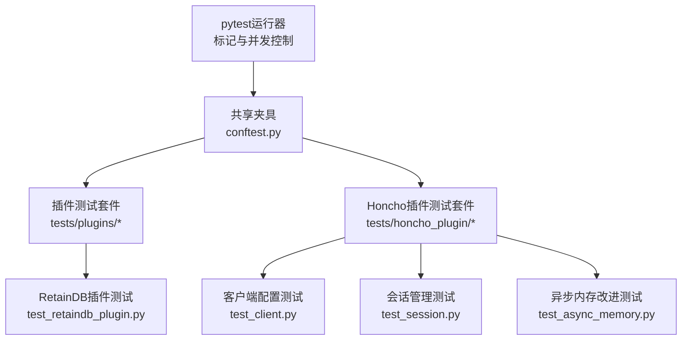
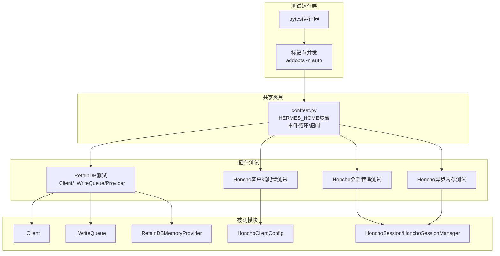
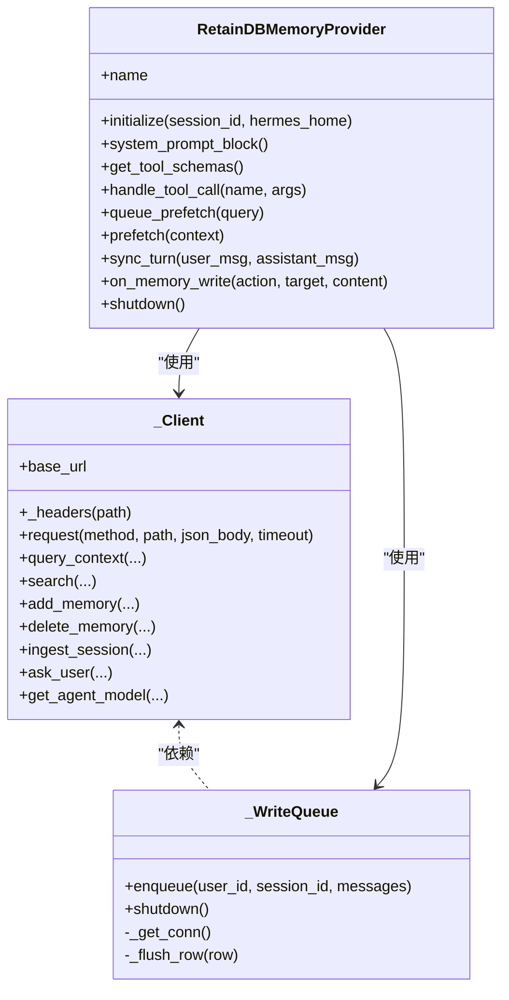
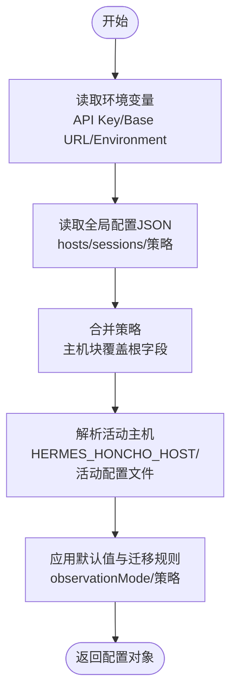
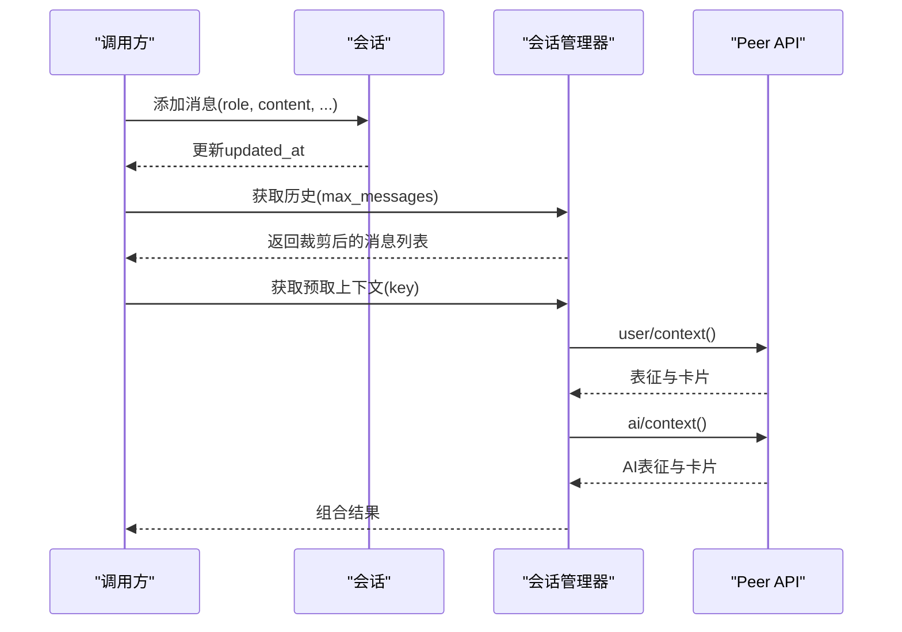
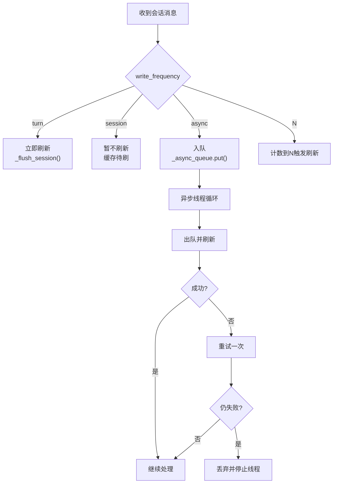
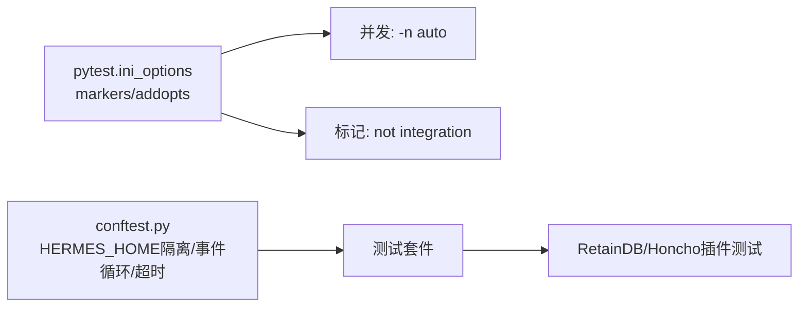

# 插件测试与验证

<cite>
**本文引用的文件**
- [tests/conftest.py](file://tests/conftest.py)
- [tests/plugins/test_retaindb_plugin.py](file://tests/plugins/test_retaindb_plugin.py)
- [tests/honcho_plugin/test_client.py](file://tests/honcho_plugin/test_client.py)
- [tests/honcho_plugin/test_session.py](file://tests/honcho_plugin/test_session.py)
- [tests/honcho_plugin/test_async_memory.py](file://tests/honcho_plugin/test_async_memory.py)
- [pyproject.toml](file://pyproject.toml)
- [requirements.txt](file://requirements.txt)
</cite>

## 目录
1. [引言](#引言)
2. [项目结构](#项目结构)
3. [核心组件](#核心组件)
4. [架构总览](#架构总览)
5. [详细组件分析](#详细组件分析)
6. [依赖分析](#依赖分析)
7. [性能考虑](#性能考虑)
8. [故障排查指南](#故障排查指南)
9. [结论](#结论)
10. [附录](#附录)

## 引言
本指南面向Hermes Agent插件质量保证，系统化阐述测试策略与方法，覆盖单元测试、集成测试与端到端测试；详解测试框架使用（测试用例编写、模拟对象创建、断言验证）；给出插件功能测试示例（含边界条件）；解释性能测试方法与指标（响应时间、吞吐量、资源消耗）；提供兼容性与回归测试实施建议；并说明测试自动化与持续集成配置思路。

## 项目结构
测试体系围绕pytest组织，集中于tests目录，并通过共享夹具与隔离环境保障稳定性与可重复性。插件测试主要集中在plugins与honcho_plugin两个子目录，分别覆盖RetainDB与Honcho内存插件。

**图表来源**
- [tests/conftest.py:1-120](file://tests/conftest.py#L1-L120)
- [tests/plugins/test_retaindb_plugin.py:1-777](file://tests/plugins/test_retaindb_plugin.py#L1-L777)
- [tests/honcho_plugin/test_client.py:1-510](file://tests/honcho_plugin/test_client.py#L1-L510)
- [tests/honcho_plugin/test_session.py:1-364](file://tests/honcho_plugin/test_session.py#L1-L364)
- [tests/honcho_plugin/test_async_memory.py:1-470](file://tests/honcho_plugin/test_async_memory.py#L1-L470)

**章节来源**
- [tests/conftest.py:1-120](file://tests/conftest.py#L1-L120)
- [pyproject.toml:110-116](file://pyproject.toml#L110-L116)

## 核心组件
- 共享夹具与隔离环境：确保测试不污染用户主目录、避免继承网关环境变量、统一事件循环与超时控制。
- 插件测试套件：以类分组的测试用例，覆盖HTTP客户端、写队列、工具分发、预取与线程管理、同步回合等。
- Honcho插件测试套件：覆盖客户端配置解析、会话管理、消息分块、异步写入与重试、迁移目标等。

**章节来源**
- [tests/conftest.py:19-41](file://tests/conftest.py#L19-L41)
- [tests/conftest.py:67-120](file://tests/conftest.py#L67-L120)
- [tests/plugins/test_retaindb_plugin.py:54-777](file://tests/plugins/test_retaindb_plugin.py#L54-L777)
- [tests/honcho_plugin/test_client.py:21-510](file://tests/honcho_plugin/test_client.py#L21-L510)
- [tests/honcho_plugin/test_session.py:19-364](file://tests/honcho_plugin/test_session.py#L19-L364)
- [tests/honcho_plugin/test_async_memory.py:58-470](file://tests/honcho_plugin/test_async_memory.py#L58-L470)

## 架构总览
下图展示RetainDB与Honcho插件测试在整体测试架构中的位置与交互要点。

**图表来源**
- [tests/conftest.py:19-120](file://tests/conftest.py#L19-L120)
- [tests/plugins/test_retaindb_plugin.py:40-47](file://tests/plugins/test_retaindb_plugin.py#L40-L47)
- [tests/honcho_plugin/test_client.py:10-18](file://tests/honcho_plugin/test_client.py#L10-L18)
- [tests/honcho_plugin/test_session.py:7-11](file://tests/honcho_plugin/test_session.py#L7-L11)
- [tests/honcho_plugin/test_async_memory.py:21-26](file://tests/honcho_plugin/test_async_memory.py#L21-L26)

## 详细组件分析

### RetainDB内存插件测试
- 测试范围
  - HTTP客户端行为：请求头、路径参数、错误回退、超时与认证处理。
  - 写队列：SQLite持久化、失败记录、线程本地连接复用、崩溃恢复重放。
  - 覆盖器：去重、截断、最大条目限制、本地过滤。
  - Provider生命周期：可用性检测、初始化、系统提示块、工具模式、工具调用分发、异常包装。
  - 预取与线程：上下文/对话合成/自模型结果消费、线程累积防护、推理级别判定。
  - 同步回合：消息入队、空内容跳过。
  - 内存镜像钩子：仅新增动作、类型映射、空内容跳过。
  - 注册入口：注册为内存提供者。
- 关键断言与模拟
  - 使用patch.object与side_effect模拟网络异常与慢响应，验证回退与重试。
  - 使用PropertyMock与MagicMock验证属性与方法调用次数与参数。
  - 使用sqlite3直接查询数据库确认持久化状态。
- 边界条件
  - 空输入、空记忆、None内容、超长文本截断、top_k上限、缺失必填参数、未初始化调用、异常传播。

**图表来源**
- [tests/plugins/test_retaindb_plugin.py:40-47](file://tests/plugins/test_retaindb_plugin.py#L40-L47)
- [tests/plugins/test_retaindb_plugin.py:54-273](file://tests/plugins/test_retaindb_plugin.py#L54-L273)
- [tests/plugins/test_retaindb_plugin.py:274-567](file://tests/plugins/test_retaindb_plugin.py#L274-L567)
- [tests/plugins/test_retaindb_plugin.py:568-777](file://tests/plugins/test_retaindb_plugin.py#L568-L777)

**章节来源**
- [tests/plugins/test_retaindb_plugin.py:54-777](file://tests/plugins/test_retaindb_plugin.py#L54-L777)

### Honcho插件测试（客户端配置）
- 测试范围
  - 默认值、环境变量读取、基础URL优先级、工作区与AI Peer主机块覆盖、观察模式迁移与粒度覆盖、重置单例。
- 断言要点
  - from_env与from_global_config在不同场景下的字段覆盖顺序。
  - resolve_active_host基于环境变量与活动配置文件的派生逻辑。
  - 基础URL仅根级有效，不支持按主机块覆盖。
- 边界条件
  - 缺失配置回落至环境变量；JSON损坏时安全降级；仅基础URL启用本地实例。

**图表来源**
- [tests/honcho_plugin/test_client.py:36-234](file://tests/honcho_plugin/test_client.py#L36-L234)
- [tests/honcho_plugin/test_client.py:297-398](file://tests/honcho_plugin/test_client.py#L297-L398)
- [tests/honcho_plugin/test_client.py:440-501](file://tests/honcho_plugin/test_client.py#L440-L501)

**章节来源**
- [tests/honcho_plugin/test_client.py:21-510](file://tests/honcho_plugin/test_client.py#L21-L510)

### Honcho插件测试（会话管理）
- 测试范围
  - 会话数据结构：消息添加、历史导出、清理与时间戳更新。
  - 会话管理器：ID清洗、迁移转录格式化、缓存操作、Peer查找与上下文检索。
  - 消息分块：段落/句子/单词边界、续传前缀、长度限制。
  - 对话输入保护：超长查询截断。
- 关键断言
  - 历史导出仅保留角色与内容键，丢弃额外元数据。
  - 分块后无单词切半，续传前缀正确。
  - 截断查询长度不超过阈值。

**图表来源**
- [tests/honcho_plugin/test_session.py:19-271](file://tests/honcho_plugin/test_session.py#L19-L271)

**章节来源**
- [tests/honcho_plugin/test_session.py:19-364](file://tests/honcho_plugin/test_session.py#L19-L364)

### Honcho插件测试（异步内存改进）
- 测试范围
  - 写频率解析：字符串async/turn/session与整数频率。
  - 会话名解析：标题优先、手动覆盖、策略影响、Peer前缀。
  - 保存路由：按频率立即刷新、异步入队、N回合周期刷新。
  - 异步写入：守护线程生命周期、队列耗尽、失败重试（最多一次）、最终丢弃。
  - 文件迁移目标：SOUL/USER/MEMORY上传目标Peer映射。
  - 新配置字段默认值与预取缓存访问器。
- 关键断言
  - 整数频率在第N次调用触发刷新。
  - 异步模式下队列非空且线程存活。
  - 失败后重试一次，两次失败后线程退出但不崩溃。

**图表来源**
- [tests/honcho_plugin/test_async_memory.py:183-234](file://tests/honcho_plugin/test_async_memory.py#L183-L234)
- [tests/honcho_plugin/test_async_memory.py:277-377](file://tests/honcho_plugin/test_async_memory.py#L277-L377)

**章节来源**
- [tests/honcho_plugin/test_async_memory.py:58-470](file://tests/honcho_plugin/test_async_memory.py#L58-L470)

## 依赖分析
- 测试运行与并发
  - pytest配置启用自动并发与标记过滤，避免集成测试阻塞。
- 运行时隔离
  - conftest通过临时目录与环境变量隔离，确保测试不写入用户主目录，避免插件单例泄漏。
- 外部依赖
  - Honcho插件测试依赖外部服务（如远程API），可通过标记进行选择性执行。

**图表来源**
- [pyproject.toml:110-116](file://pyproject.toml#L110-L116)
- [tests/conftest.py:19-120](file://tests/conftest.py#L19-L120)

**章节来源**
- [pyproject.toml:110-116](file://pyproject.toml#L110-L116)
- [tests/conftest.py:19-120](file://tests/conftest.py#L19-L120)

## 性能考虑
- 单元测试性能
  - 使用轻量级模拟与内存数据库（如SQLite）减少IO开销；对慢速路径（网络/文件）使用短超时或mock。
- 集成测试性能
  - 通过标记隔离真实外部服务调用；对高频调用设置合理的重试与退避。
- 资源消耗
  - 异步写入线程应具备优雅关闭与资源回收；队列大小与重试次数需平衡可靠性与内存占用。
- 指标建议
  - 响应时间：平均/中位/尾延迟（P95/P99）。
  - 吞吐量：每秒事务数（TPS）与消息数。
  - 资源：CPU/内存/文件描述符/网络连接数峰值与均值。

[本节为通用指导，无需特定文件引用]

## 故障排查指南
- 环境隔离问题
  - 确认HERMES_HOME指向临时目录，插件单例被重置；删除不必要的平台会话环境变量。
- 事件循环与超时
  - 同步测试若调用get_event_loop，确保有可用事件循环；单个测试超过30秒将被SIGALRM终止。
- RetainDB插件
  - 若工具调用报“未初始化”，检查initialize是否已调用；若API异常，确认认证头与基础URL。
  - 写队列失败时检查SQLite错误字段与重试日志。
- Honcho插件
  - 客户端配置优先级：基础URL仅根级有效；主机块覆盖工作区与AI Peer；观察模式迁移规则。
  - 异步写入失败：查看重试逻辑与线程状态；必要时强制flush_all并捕获异常。

**章节来源**
- [tests/conftest.py:19-41](file://tests/conftest.py#L19-L41)
- [tests/conftest.py:75-120](file://tests/conftest.py#L75-L120)
- [tests/plugins/test_retaindb_plugin.py:432-567](file://tests/plugins/test_retaindb_plugin.py#L432-L567)
- [tests/honcho_plugin/test_client.py:297-398](file://tests/honcho_plugin/test_client.py#L297-L398)
- [tests/honcho_plugin/test_async_memory.py:329-377](file://tests/honcho_plugin/test_async_memory.py#L329-L377)

## 结论
通过共享夹具实现稳定隔离、以类分组的测试用例覆盖核心行为与边界条件、结合模拟与真实依赖的混合策略，Hermes插件测试能够高效发现缺陷并保障质量。建议在CI中启用并发与标记过滤，在集成测试中谨慎引入外部依赖，并建立完善的性能与兼容性回归流程。

## 附录

### 测试框架与安装
- 推荐安装开发依赖以获得pytest与并发支持。
- 可选安装各平台与消息网关依赖用于端到端验证。

**章节来源**
- [requirements.txt:1-37](file://requirements.txt#L1-L37)
- [pyproject.toml:39-97](file://pyproject.toml#L39-L97)