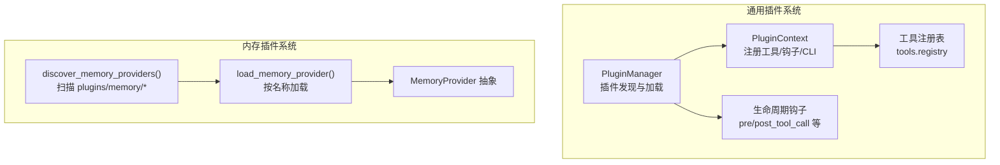
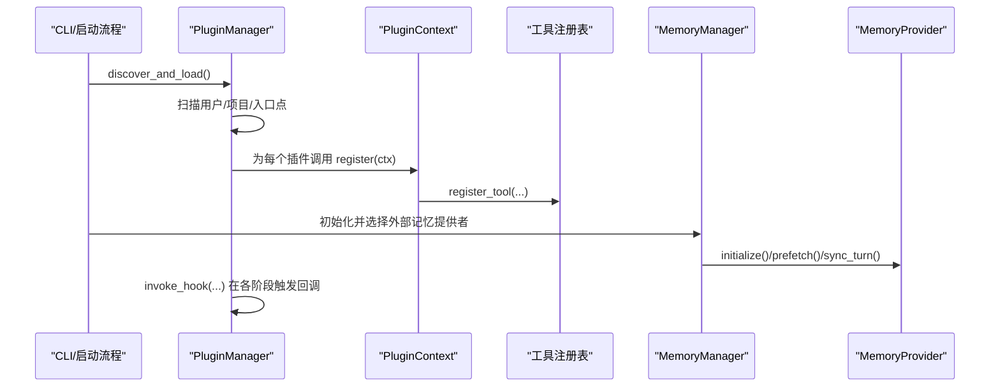
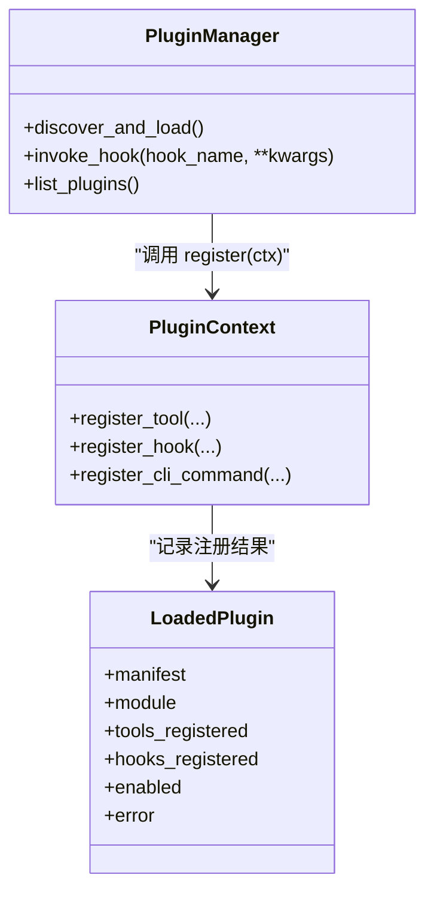
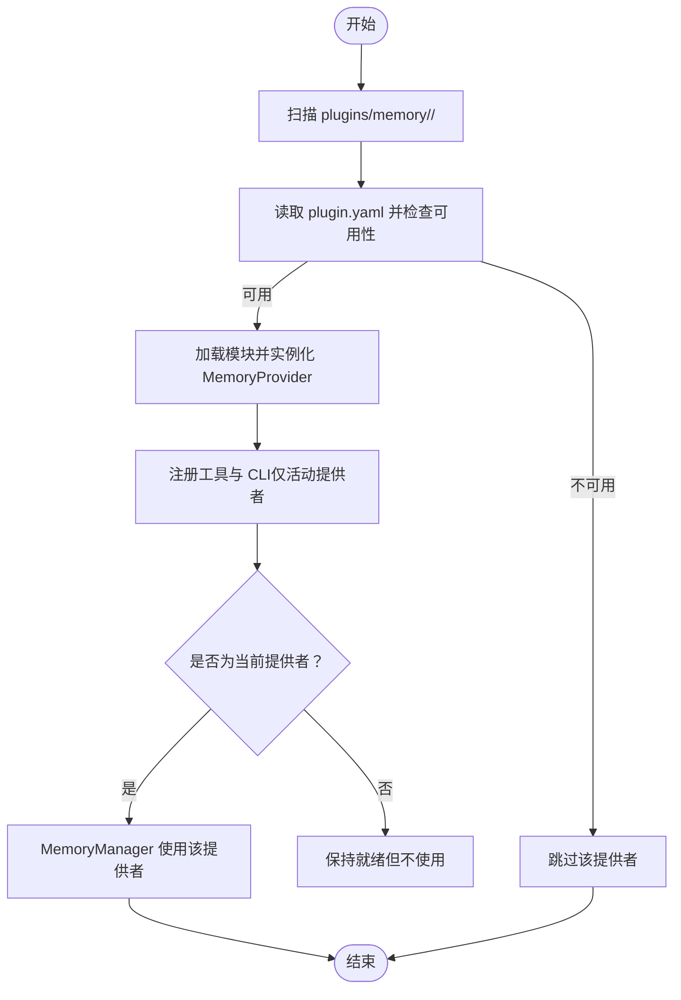
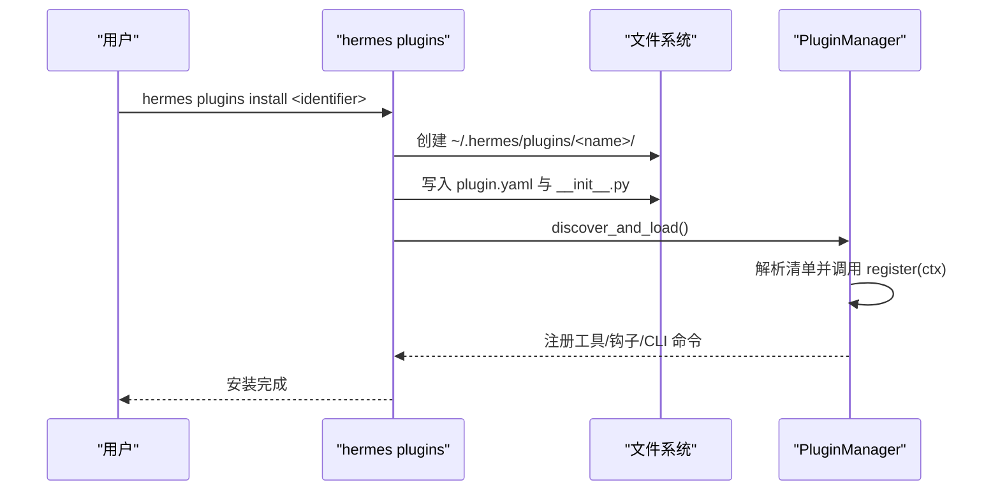
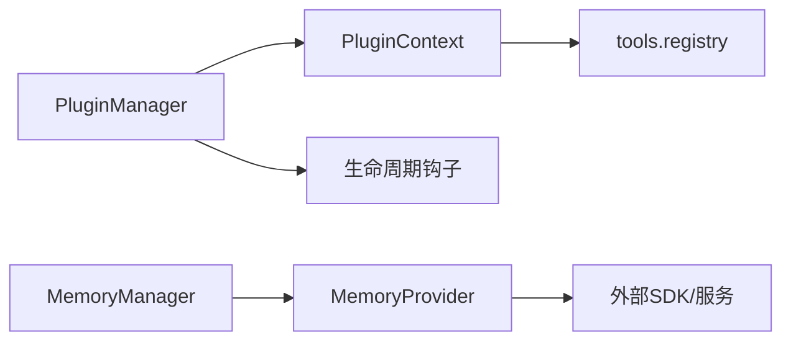

# 插件系统

<cite>
**本文引用的文件**
- [plugins/__init__.py](file://plugins/__init__.py)
- [plugins/memory/__init__.py](file://plugins/memory/__init__.py)
- [agent/memory_provider.py](file://agent/memory_provider.py)
- [plugins/memory/openviking/__init__.py](file://plugins/memory/openviking/__init__.py)
- [plugins/memory/openviking/plugin.yaml](file://plugins/memory/openviking/plugin.yaml)
- [plugins/memory/honcho/__init__.py](file://plugins/memory/honcho/__init__.py)
- [plugins/memory/honcho/plugin.yaml](file://plugins/memory/honcho/plugin.yaml)
- [hermes_cli/plugins.py](file://hermes_cli/plugins.py)
- [hermes_cli/plugins_cmd.py](file://hermes_cli/plugins_cmd.py)
- [run_agent.py](file://run_agent.py)
- [toolsets.py](file://toolsets.py)
- [tests/agent/test_memory_provider.py](file://tests/agent/test_memory_provider.py)
- [tests/hermes_cli/test_plugins.py](file://tests/hermes_cli/test_plugins.py)
</cite>

## 目录
1. [简介](#简介)
2. [项目结构](#项目结构)
3. [核心组件](#核心组件)
4. [架构总览](#架构总览)
5. [详细组件分析](#详细组件分析)
6. [依赖分析](#依赖分析)
7. [性能考虑](#性能考虑)
8. [故障排查指南](#故障排查指南)
9. [结论](#结论)
10. [附录](#附录)

## 简介
本指南面向希望在 Hermes Agent 中开发与集成插件的开发者，系统讲解插件体系的架构设计、扩展机制与生命周期管理，覆盖通用插件（工具插件）与内存插件两类类型，并提供从开发、注册、配置到测试与部署的完整实践路径。文档同时解释插件间交互与数据共享方式，帮助你构建可维护、可扩展的插件生态。

## 项目结构
Hermes 的插件系统由两部分组成：
- 通用插件（工具插件）：通过插件清单与注册函数在运行时动态发现与加载，向全局工具注册表注入工具与钩子。
- 内存插件：位于 plugins/memory 下，作为“外部记忆提供者”与内置记忆并行存在，同一时刻仅激活一个外部提供者。

图示来源
- [hermes_cli/plugins.py:238-610](file://hermes_cli/plugins.py#L238-L610)
- [plugins/memory/__init__.py:32-317](file://plugins/memory/__init__.py#L32-L317)
- [agent/memory_provider.py:42-232](file://agent/memory_provider.py#L42-L232)

章节来源
- [plugins/__init__.py:1-2](file://plugins/__init__.py#L1-L2)
- [plugins/memory/__init__.py:1-317](file://plugins/memory/__init__.py#L1-L317)
- [hermes_cli/plugins.py:1-610](file://hermes_cli/plugins.py#L1-L610)

## 核心组件
- 插件管理器（PluginManager）
  - 负责扫描用户目录、项目目录与入口点三类来源，解析 plugin.yaml 清单，调用插件的 register(ctx) 完成注册。
  - 提供钩子分发、工具集聚合、CLI 命令注册等能力。
- 插件上下文（PluginContext）
  - 向插件暴露 register_tool、register_hook、register_cli_command 等 API，统一注册入口。
- 工具注册表（tools.registry）
  - 接收来自插件的工具定义，与内置工具合并，支持按工具集聚合与展示。
- 内存提供者抽象（MemoryProvider）
  - 定义外部记忆提供者的生命周期与接口，如初始化、预取、同步、工具模式等。
- 内存插件发现与加载
  - 扫描 plugins/memory/<name>/ 目录，读取 plugin.yaml 元信息，按需加载具体提供者实例。

章节来源
- [hermes_cli/plugins.py:91-232](file://hermes_cli/plugins.py#L91-L232)
- [hermes_cli/plugins.py:238-610](file://hermes_cli/plugins.py#L238-L610)
- [agent/memory_provider.py:42-232](file://agent/memory_provider.py#L42-L232)
- [plugins/memory/__init__.py:32-317](file://plugins/memory/__init__.py#L32-L317)

## 架构总览
通用插件与内存插件在不同维度协同工作：
- 生命周期：通用插件通过钩子参与代理循环；内存插件通过 MemoryManager 驱动会话级记忆。
- 工具生态：通用插件注册工具，内存插件也提供工具以增强记忆能力。
- 配置与环境：两者均可声明所需的环境变量与依赖，安装后由 CLI 协助配置。

图示来源
- [hermes_cli/plugins.py:253-412](file://hermes_cli/plugins.py#L253-L412)
- [run_agent.py:1092-1114](file://run_agent.py#L1092-L1114)

## 详细组件分析

### 通用插件系统（工具插件）
- 发现与加载
  - 用户插件：~/.hermes/plugins/<name>/，要求包含 plugin.yaml 与 __init__.py，并在其中定义 register(ctx)。
  - 项目插件：./.hermes/plugins/<name>/（需开启开关），规则同上。
  - 入口点插件：通过 pip 包的 hermes_agent.plugins 入口点自动发现。
- 注册内容
  - 工具：register_tool(name, toolset, schema, handler, ...) 将工具加入全局注册表。
  - 钩子：register_hook(hook_name, callback) 注册生命周期钩子。
  - CLI 子命令：register_cli_command(name, help, setup_fn, handler_fn) 注册独立命令。
- 钩子机制
  - 支持 pre_tool_call、post_tool_call、pre_llm_call、post_llm_call、on_session_start、on_session_end 等。
  - 回调被逐一调用且各自 try/except，避免单个插件异常影响主流程。
- 工具集聚合
  - 通过工具注册表将插件工具按 toolset 分组，用于 UI 展示与平台切换。

图示来源
- [hermes_cli/plugins.py:238-610](file://hermes_cli/plugins.py#L238-L610)

章节来源
- [hermes_cli/plugins.py:253-412](file://hermes_cli/plugins.py#L253-L412)
- [hermes_cli/plugins.py:466-500](file://hermes_cli/plugins.py#L466-L500)
- [toolsets.py:471-479](file://toolsets.py#L471-L479)

### 内存插件系统
- 设计原则
  - 外部提供者与内置记忆并存，同一时刻仅激活一个外部提供者。
  - 通过配置项 memory.provider 指定当前提供者，加载其工具与行为。
- 发现与加载
  - 扫描 plugins/memory/<name>/，读取 plugin.yaml 获取元信息与可用性检查。
  - 通过 register(ctx) 或直接实例化类的方式加载提供者。
- 生命周期
  - initialize/session_prompt_block/prefetch/sync_turn/get_tool_schemas/handle_tool_call/shutdown
  - 可选钩子：on_turn_start/on_session_end/on_pre_compress/on_memory_write/on_delegation
- 示例：OpenViking/Honcho
  - OpenViking：提供搜索、阅读、浏览、记忆与资源入库工具，支持会话提交触发提取。
  - Honcho：提供画像查询、语义检索、对话式问答与持久化结论工具，支持成本感知与注入频率控制。

图示来源
- [plugins/memory/__init__.py:32-96](file://plugins/memory/__init__.py#L32-L96)
- [plugins/memory/__init__.py:234-317](file://plugins/memory/__init__.py#L234-L317)

章节来源
- [plugins/memory/__init__.py:1-317](file://plugins/memory/__init__.py#L1-L317)
- [agent/memory_provider.py:42-232](file://agent/memory_provider.py#L42-L232)
- [plugins/memory/openviking/__init__.py:252-633](file://plugins/memory/openviking/__init__.py#L252-L633)
- [plugins/memory/honcho/__init__.py:119-715](file://plugins/memory/honcho/__init__.py#L119-L715)

### 插件注册机制与配置管理
- 清单与入口
  - plugin.yaml 必须存在，包含 name/version/description/author/requires_env/provides_hooks 等字段。
  - __init__.py 必须导出 register(ctx) 函数，或提供 MemoryProvider 子类。
- 配置与环境变量
  - 通用插件：在 plugin.yaml 中声明 requires_env，安装后 CLI 会提示输入并写入 .env。
  - 内存插件：可通过 get_config_schema/save_config 提供配置界面与持久化。
- CLI 集成
  - hermes plugins install/update/remove/list/enable/disable 等命令支持插件全生命周期管理。
  - 内存插件的 CLI 仅对当前激活提供者生效，通过 discover_plugin_cli_commands() 动态扫描。

图示来源
- [hermes_cli/plugins_cmd.py:117-225](file://hermes_cli/plugins_cmd.py#L117-L225)
- [hermes_cli/plugins.py:253-412](file://hermes_cli/plugins.py#L253-L412)

章节来源
- [hermes_cli/plugins_cmd.py:117-225](file://hermes_cli/plugins_cmd.py#L117-L225)
- [hermes_cli/plugins.py:295-412](file://hermes_cli/plugins.py#L295-L412)
- [plugins/memory/openviking/plugin.yaml:1-10](file://plugins/memory/openviking/plugin.yaml#L1-L10)
- [plugins/memory/honcho/plugin.yaml:1-8](file://plugins/memory/honcho/plugin.yaml#L1-L8)

### 生命周期控制与钩子
- 通用插件钩子
  - pre_tool_call/post_tool_call/pre_llm_call/post_llm_call/on_session_start/on_session_end
  - 回调在 try/except 中执行，失败不影响主流程。
- 内存插件钩子
  - on_turn_start/on_session_end/on_pre_compress/on_memory_write/on_delegation
  - 与代理循环紧密耦合，用于上下文注入、压缩前提取、镜像内置记忆等。

章节来源
- [hermes_cli/plugins.py:55-64](file://hermes_cli/plugins.py#L55-L64)
- [hermes_cli/plugins.py:466-500](file://hermes_cli/plugins.py#L466-L500)
- [agent/memory_provider.py:142-187](file://agent/memory_provider.py#L142-L187)

### 插件间交互与数据共享
- 工具共享
  - 通用插件通过 tools.registry 注册的工具与内置工具统一管理，按 toolset 聚合展示。
- 钩子协作
  - 不同插件可注册相同钩子，形成链式调用；每个回调独立执行，互不影响。
- 内存插件与通用插件
  - 内存插件可提供工具，这些工具与通用插件工具共同出现在工具集中，由工具注册表统一调度。

章节来源
- [hermes_cli/plugins.py:573-609](file://hermes_cli/plugins.py#L573-L609)
- [toolsets.py:471-479](file://toolsets.py#L471-L479)

## 依赖分析
- 组件耦合
  - PluginManager 与 PluginContext 低耦合：通过 register(ctx) 传递上下文，插件仅依赖上下文 API。
  - MemoryProvider 与 MemoryManager 强耦合：前者提供生命周期方法，后者负责调度。
- 外部依赖
  - 通用插件：可声明 pip_dependencies，安装后由 CLI 协助配置。
  - 内存插件：可能依赖第三方 SDK（如 httpx、honcho-ai），需在 is_available 中进行轻量检查。

图示来源
- [hermes_cli/plugins.py:238-610](file://hermes_cli/plugins.py#L238-L610)
- [agent/memory_provider.py:42-232](file://agent/memory_provider.py#L42-L232)

章节来源
- [hermes_cli/plugins.py:238-610](file://hermes_cli/plugins.py#L238-L610)
- [agent/memory_provider.py:42-232](file://agent/memory_provider.py#L42-L232)

## 性能考虑
- 背景线程与非阻塞
  - 内存插件的 prefetch/sync_turn 建议使用后台线程，避免阻塞主循环。
- 预热与节流
  - Honcho 支持成本感知与注入频率控制，减少不必要的 API 调用。
- 上下文截断
  - 在注入前根据预算进行截断，避免超出上下文限制。
- 钩子开销
  - 钩子回调应尽量轻量，避免在 pre_llm_call 中做重计算。

## 故障排查指南
- 插件未被发现
  - 检查 plugin.yaml 是否存在且格式正确；确认 __init__.py 是否包含 register(ctx)。
  - 用户插件需放置于 ~/.hermes/plugins/<name>/，项目插件需开启开关并放置于 ./.hermes/plugins/<name>/。
- 插件加载失败
  - 查看错误信息中是否提示缺少 register() 函数或导入异常。
  - 确认 requires_env 是否已配置，必要时使用 hermes plugins install 后的引导流程。
- 内存插件不可用
  - 检查 is_available 的条件（如环境变量是否存在），确保依赖已安装。
  - 对于 Honcho/OpenViking，确认网络连通与凭据配置。
- 钩子异常
  - 单个钩子异常不会中断主流程，查看日志定位问题回调。

章节来源
- [tests/hermes_cli/test_plugins.py:53-76](file://tests/hermes_cli/test_plugins.py#L53-L76)
- [tests/agent/test_memory_provider.py:497-533](file://tests/agent/test_memory_provider.py#L497-L533)
- [hermes_cli/plugins.py:380-410](file://hermes_cli/plugins.py#L380-L410)

## 结论
Hermes 的插件系统通过清晰的抽象与严格的生命周期管理，实现了通用工具插件与内存插件的无缝集成。开发者只需遵循清单与注册规范，即可快速扩展工具生态与记忆能力。建议在开发过程中重视钩子与工具的轻量化设计，合理利用背景线程与预算控制，确保插件在复杂场景下的稳定性与性能。

## 附录

### 开发步骤速查
- 通用插件
  - 新建 ~/.hermes/plugins/<name>/，编写 plugin.yaml 与 __init__.py，实现 register(ctx)。
  - 在 register(ctx) 中调用 ctx.register_tool/ctx.register_hook/ctx.register_cli_command。
  - 使用 hermes plugins install 进行安装与配置。
- 内存插件
  - 在 plugins/memory/<name>/ 实现 MemoryProvider 子类，提供工具与生命周期方法。
  - 在 plugin.yaml 中声明 requires_env 与 hooks。
  - 通过配置项 memory.provider 激活对应提供者。

章节来源
- [hermes_cli/plugins_cmd.py:117-225](file://hermes_cli/plugins_cmd.py#L117-L225)
- [plugins/memory/__init__.py:1-317](file://plugins/memory/__init__.py#L1-L317)
- [agent/memory_provider.py:42-232](file://agent/memory_provider.py#L42-L232)