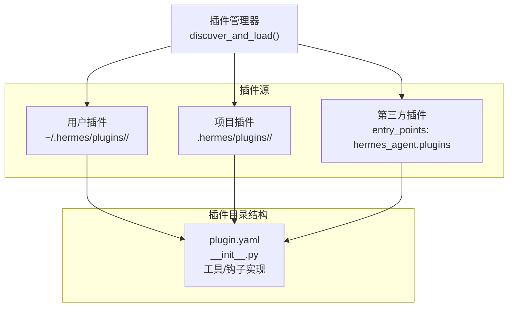
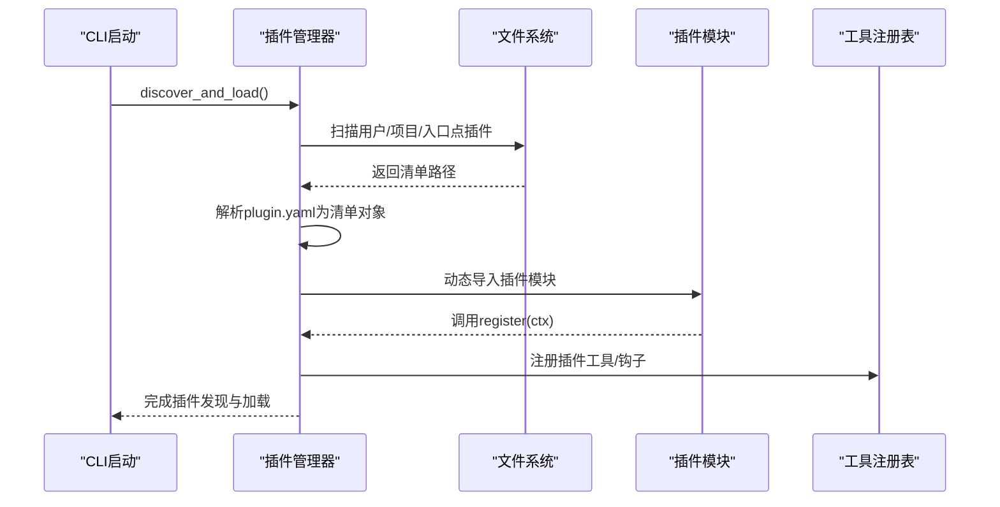
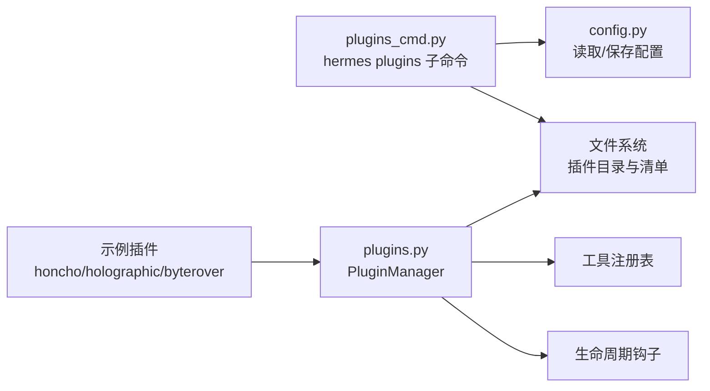

# 插件配置管理

<cite>
**本文引用的文件**
- [hermes_cli/plugins.py](file://hermes_cli/plugins.py)
- [hermes_cli/plugins_cmd.py](file://hermes_cli/plugins_cmd.py)
- [cli-config.yaml.example](file://cli-config.yaml.example)
- [hermes_cli/config.py](file://hermes_cli/config.py)
- [plugins/memory/honcho/plugin.yaml](file://plugins/memory/honcho/plugin.yaml)
- [plugins/memory/byterover/plugin.yaml](file://plugins/memory/byterover/plugin.yaml)
- [plugins/memory/holographic/plugin.yaml](file://plugins/memory/holographic/plugin.yaml)
- [plugins/memory/honcho/__init__.py](file://plugins/memory/honcho/__init__.py)
- [plugins/memory/holographic/__init__.py](file://plugins/memory/holographic/__init__.py)
- [hermes_cli/main.py](file://hermes_cli/main.py)
</cite>

## 目录
1. [简介](#简介)
2. [项目结构](#项目结构)
3. [核心组件](#核心组件)
4. [架构总览](#架构总览)
5. [详细组件分析](#详细组件分析)
6. [依赖关系分析](#依赖关系分析)
7. [性能考量](#性能考量)
8. [故障排除指南](#故障排除指南)
9. [结论](#结论)
10. [附录](#附录)

## 简介
本指南面向Hermes Agent的插件配置管理，系统讲解插件配置文件的格式与语法规则、插件的启用/禁用/卸载流程、配置示例与最佳实践、冲突处理与优先级规则、配置验证与诊断方法，以及常用配置模板与组合参考。内容基于仓库中的插件系统实现与示例插件，确保可操作性与可追溯性。

## 项目结构
Hermes插件体系由三类来源构成：
- 用户插件：位于用户主目录下的插件目录
- 项目插件：位于工作目录的插件目录（需显式开启）
- 第三方插件：通过Python入口点分发的插件包

插件发现与加载由插件管理器统一调度，插件清单（manifest）采用YAML格式，要求包含基本元数据与能力声明；每个插件目录必须提供清单文件与模块入口。

图表来源
- [hermes_cli/plugins.py:253-290](file://hermes_cli/plugins.py#L253-L290)
- [hermes_cli/plugins.py:295-331](file://hermes_cli/plugins.py#L295-L331)
- [hermes_cli/plugins.py:337-360](file://hermes_cli/plugins.py#L337-L360)

章节来源
- [hermes_cli/plugins.py:1-120](file://hermes_cli/plugins.py#L1-L120)
- [hermes_cli/plugins.py:253-290](file://hermes_cli/plugins.py#L253-L290)

## 核心组件
- 插件清单（plugin.yaml）：描述插件名称、版本、描述、所需环境变量、提供的工具与钩子等
- 插件上下文（PluginContext）：向插件暴露注册工具、消息注入、CLI命令注册与生命周期钩子的能力
- 插件管理器（PluginManager）：负责扫描、加载、初始化插件，并在运行时调用生命周期钩子
- 插件命令（hermes plugins）：提供安装、更新、卸载、启用/禁用、列表与交互式切换等运维能力

章节来源
- [hermes_cli/plugins.py:91-116](file://hermes_cli/plugins.py#L91-L116)
- [hermes_cli/plugins.py:122-232](file://hermes_cli/plugins.py#L122-L232)
- [hermes_cli/plugins.py:238-522](file://hermes_cli/plugins.py#L238-L522)
- [hermes_cli/plugins_cmd.py:284-691](file://hermes_cli/plugins_cmd.py#L284-L691)

## 架构总览
插件系统的核心流程如下：
- 启动阶段：插件管理器扫描三类插件源，读取清单并构建插件清单对象
- 加载阶段：按清单加载模块，调用插件入口函数进行注册（工具、钩子、内存提供者等）
- 运行阶段：在生命周期钩子触发时，调用已注册回调，或通过工具注册表使用插件工具

图表来源
- [hermes_cli/plugins.py:253-290](file://hermes_cli/plugins.py#L253-L290)
- [hermes_cli/plugins.py:366-412](file://hermes_cli/plugins.py#L366-L412)
- [hermes_cli/plugins.py:378-406](file://hermes_cli/plugins.py#L378-L406)

章节来源
- [hermes_cli/plugins.py:238-522](file://hermes_cli/plugins.py#L238-L522)

## 详细组件分析

### 插件清单（plugin.yaml）格式与字段
- 必填字段
  - name：插件名称（字符串）
- 常用字段
  - version：版本号（字符串）
  - description：简要描述（字符串）
  - author：作者信息（字符串）
  - requires_env：安装时需要的环境变量清单（列表，支持简单名或带元数据的字典）
  - provides_tools：插件声明提供的工具名列表（字符串数组）
  - provides_hooks：插件声明提供的生命周期钩子名列表（字符串数组）
  - hooks：兼容旧版的钩子声明（字符串数组）
  - pip_dependencies：安装时需要的pip依赖（字符串数组）
  - external_dependencies：外部可执行程序依赖（字典数组，含name、install、check键）

清单解析与校验逻辑：
- 支持plugin.yaml或plugin.yml两种文件名
- 使用安全解析，失败时记录警告
- 对requires_env支持简单列表与富元数据格式
- 对manifest_version进行兼容性检查

章节来源
- [hermes_cli/plugins.py:311-327](file://hermes_cli/plugins.py#L311-L327)
- [hermes_cli/plugins_cmd.py:115-127](file://hermes_cli/plugins_cmd.py#L115-L127)
- [hermes_cli/plugins_cmd.py:151-224](file://hermes_cli/plugins_cmd.py#L151-L224)
- [plugins/memory/honcho/plugin.yaml:1-8](file://plugins/memory/honcho/plugin.yaml#L1-L8)
- [plugins/memory/byterover/plugin.yaml:1-10](file://plugins/memory/byterover/plugin.yaml#L1-L10)
- [plugins/memory/holographic/plugin.yaml:1-6](file://plugins/memory/holographic/plugin.yaml#L1-L6)

### 插件上下文（PluginContext）与注册接口
- 工具注册：register_tool(name, toolset, schema, handler, ...)
- 生命周期钩子：register_hook(hook_name, callback)
- 消息注入：inject_message(content, role)
- CLI命令注册：register_cli_command(name, help, setup_fn, handler_fn, description)

章节来源
- [hermes_cli/plugins.py:122-232](file://hermes_cli/plugins.py#L122-L232)

### 插件管理器（PluginManager）与生命周期钩子
- discover_and_load：扫描三类插件源，过滤禁用列表后加载
- _load_plugin：动态导入模块并调用register(ctx)，收集插件注册的工具与钩子
- invoke_hook：按钩子名调用所有回调，异常被隔离，返回非空结果列表

章节来源
- [hermes_cli/plugins.py:238-522](file://hermes_cli/plugins.py#L238-L522)

### 插件命令（hermes plugins）：安装、更新、卸载、启用/禁用、列表与交互切换
- hermes plugins install：支持完整URL与简写形式，克隆到用户插件目录，读取清单，复制示例配置，提示缺失环境变量，显示安装后说明
- hermes plugins update：从git远程拉取最新
- hermes plugins remove：删除插件目录
- hermes plugins enable/disable：写入配置中的禁用集合，下次会话生效
- hermes plugins list/toggle：列出已安装插件状态，交互式勾选切换

章节来源
- [hermes_cli/plugins_cmd.py:284-691](file://hermes_cli/plugins_cmd.py#L284-L691)

### 插件间配置冲突与优先级
- 禁用列表优先：若插件名出现在禁用集合中，则跳过加载并标记为禁用
- 清单解析顺序：用户插件目录 → 项目插件目录（需开启） → 入口点插件
- 钩子与工具注册：插件各自维护独立的注册集合，互不覆盖，但可能产生功能重叠
- 冲突处理建议：通过禁用冲突插件或调整工具集/钩子范围来避免重复行为

章节来源
- [hermes_cli/plugins.py:274-282](file://hermes_cli/plugins.py#L274-L282)
- [hermes_cli/plugins_cmd.py:470-489](file://hermes_cli/plugins_cmd.py#L470-L489)

### 插件配置示例与最佳实践
- Honcho内存插件
  - 清单字段：name、version、description、hooks
  - 行为：作为内存提供者，支持工具模式与上下文注入模式，支持会话预热与结论持久化
  - 配置要点：API密钥或基础URL任一可用即视为可用；可通过配置控制注入频率、上下文预算等
- ByteRover内存插件
  - 清单字段：name、version、description、external_dependencies、hooks
  - 外部依赖：声明brv可执行程序及其安装与检测命令
- Holographic内存插件
  - 清单字段：name、version、description、hooks
  - 配置：数据库路径、自动抽取、默认信任度、HRR维度等
  - 行为：提供事实存储与检索工具，支持会话结束时自动抽取用户偏好与决策

章节来源
- [plugins/memory/honcho/plugin.yaml:1-8](file://plugins/memory/honcho/plugin.yaml#L1-L8)
- [plugins/memory/honcho/__init__.py:119-715](file://plugins/memory/honcho/__init__.py#L119-L715)
- [plugins/memory/byterover/plugin.yaml:1-10](file://plugins/memory/byterover/plugin.yaml#L1-L10)
- [plugins/memory/holographic/plugin.yaml:1-6](file://plugins/memory/holographic/plugin.yaml#L1-L6)
- [plugins/memory/holographic/__init__.py:96-408](file://plugins/memory/holographic/__init__.py#L96-L408)

### 插件配置模板与常用组合
- 插件清单模板（摘自官方文档示例）
  - 字段：name、version、description、provides_tools、provides_hooks、requires_env（可选）
  - 参考路径：website/docs/guides/build-a-hermes-plugin.md
- 常见组合
  - 仅启用必要工具：通过平台工具集限制插件工具可见性
  - 禁用高风险插件：将插件名加入禁用列表
  - 外部依赖管理：在清单中声明external_dependencies，安装时自动提示安装脚本

章节来源
- [hermes_cli/plugins_cmd.py:151-224](file://hermes_cli/plugins_cmd.py#L151-L224)
- [hermes_cli/plugins_cmd.py:115-127](file://hermes_cli/plugins_cmd.py#L115-L127)

## 依赖关系分析
- 插件系统依赖
  - hermes_cli/plugins.py：插件发现、加载、生命周期钩子调用
  - hermes_cli/plugins_cmd.py：插件安装、更新、卸载、启用/禁用、列表与交互切换
  - hermes_cli/config.py：全局配置读取与保存，包含插件禁用列表
  - 示例插件：plugins/memory/*/plugin.yaml与__init__.py

图表来源
- [hermes_cli/plugins_cmd.py:470-489](file://hermes_cli/plugins_cmd.py#L470-L489)
- [hermes_cli/plugins.py:238-522](file://hermes_cli/plugins.py#L238-L522)

章节来源
- [hermes_cli/plugins.py:238-522](file://hermes_cli/plugins.py#L238-L522)
- [hermes_cli/plugins_cmd.py:284-691](file://hermes_cli/plugins_cmd.py#L284-L691)
- [hermes_cli/config.py:1-200](file://hermes_cli/config.py#L1-L200)

## 性能考量
- 插件加载与钩子调用均在独立线程或异步回调中进行，避免阻塞主循环
- 钩子调用被包装在异常保护中，单个插件错误不会影响整体流程
- 插件工具注册采用集中式注册表，便于按平台工具集开关与快速查找

章节来源
- [hermes_cli/plugins.py:466-500](file://hermes_cli/plugins.py#L466-L500)
- [hermes_cli/plugins.py:144-158](file://hermes_cli/plugins.py#L144-L158)

## 故障排除指南
- 安装失败
  - 检查Git是否可用与网络可达
  - 确认清单文件存在且可解析
  - 若提示清单版本过高，按提示升级安装器
- 环境变量缺失
  - 安装时会提示缺失的requires_env项，按指引填写至.env
- 插件未生效
  - 确认插件未被加入禁用列表
  - 重启网关或新会话使变更生效
- 钩子无响应
  - 检查插件是否正确注册了钩子
  - 查看日志中钩子回调异常记录

章节来源
- [hermes_cli/plugins_cmd.py:284-397](file://hermes_cli/plugins_cmd.py#L284-L397)
- [hermes_cli/plugins_cmd.py:470-535](file://hermes_cli/plugins_cmd.py#L470-L535)
- [hermes_cli/plugins.py:466-500](file://hermes_cli/plugins.py#L466-L500)

## 结论
Hermes插件配置管理以清单驱动、命令行运维为核心，结合禁用列表与平台工具集实现灵活的启用/禁用策略。通过规范的清单字段与注册接口，插件可稳定地扩展工具与钩子能力；借助安装流程的环境变量提示与示例配置复制，降低了上手门槛。建议在生产环境中严格管理禁用列表与外部依赖，定期更新插件与安装器，确保兼容性与安全性。

## 附录

### 插件清单字段速查
- name：插件名称（必填）
- version：版本号（可选）
- description：描述（可选）
- author：作者（可选）
- requires_env：安装期所需的环境变量（可选）
- provides_tools：插件工具名列表（可选）
- provides_hooks：生命周期钩子名列表（可选）
- hooks：兼容旧版钩子声明（可选）
- pip_dependencies：pip依赖（可选）
- external_dependencies：外部可执行依赖（可选）

章节来源
- [hermes_cli/plugins.py:311-327](file://hermes_cli/plugins.py#L311-L327)
- [plugins/memory/honcho/plugin.yaml:1-8](file://plugins/memory/honcho/plugin.yaml#L1-L8)
- [plugins/memory/byterover/plugin.yaml:1-10](file://plugins/memory/byterover/plugin.yaml#L1-L10)
- [plugins/memory/holographic/plugin.yaml:1-6](file://plugins/memory/holographic/plugin.yaml#L1-L6)

### 命令行操作速查
- hermes plugins install <identifier> [--force]
- hermes plugins update <name>
- hermes plugins remove <name>
- hermes plugins enable <name>
- hermes plugins disable <name>
- hermes plugins list
- hermes plugins（交互式勾选）

章节来源
- [hermes_cli/plugins_cmd.py:284-691](file://hermes_cli/plugins_cmd.py#L284-L691)