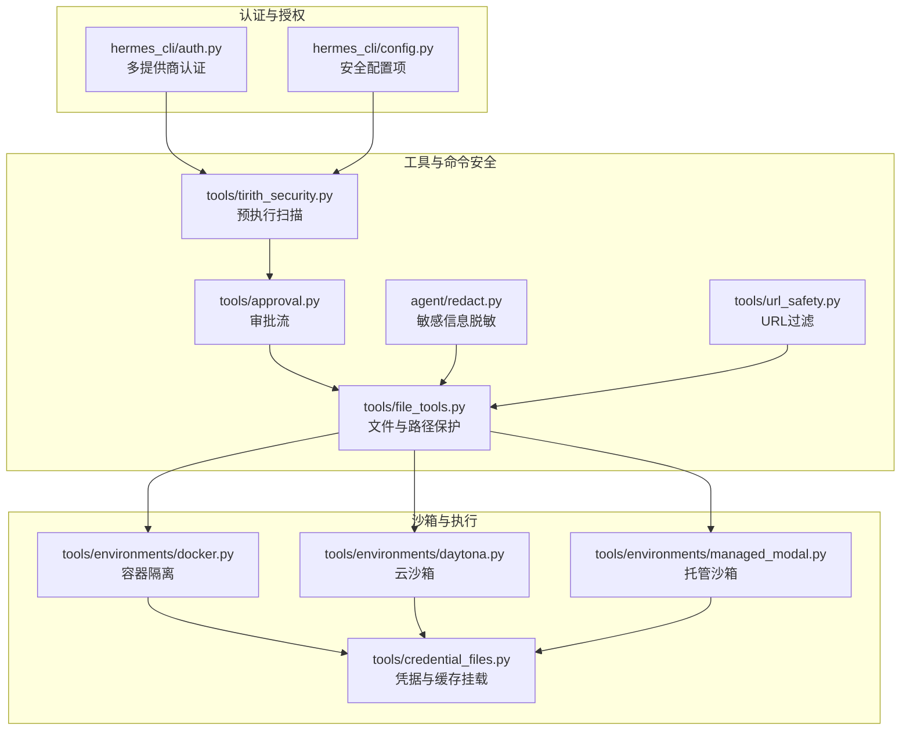
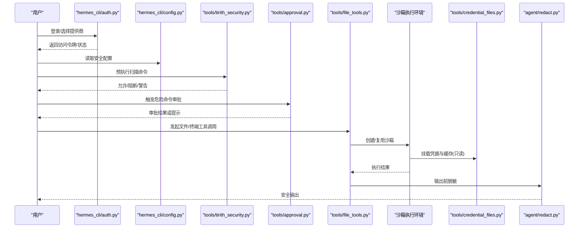
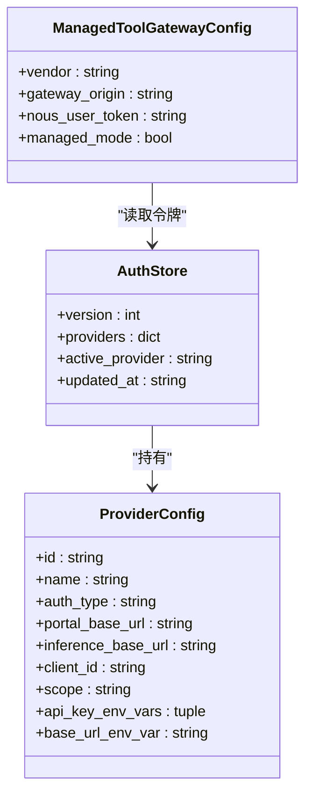
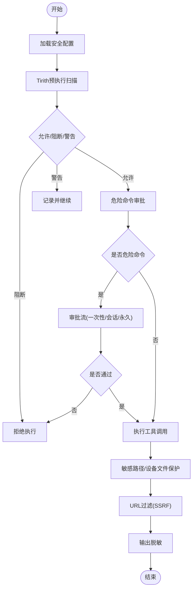
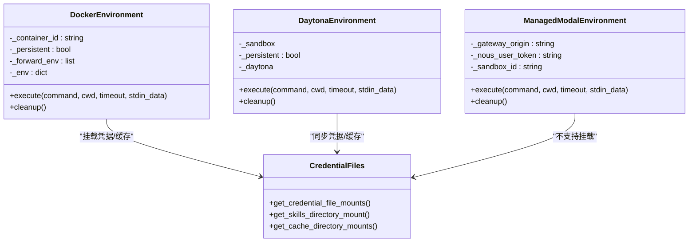
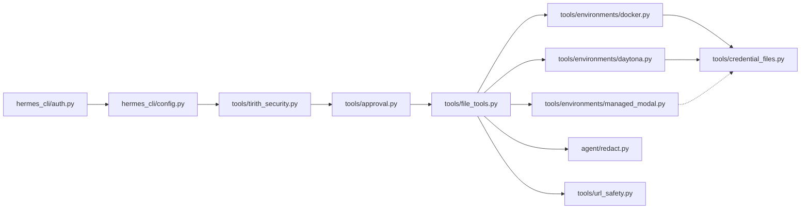

# 安全架构

<cite>
**本文引用的文件**
- [agent/redact.py](file://agent/redact.py)
- [tools/url_safety.py](file://tools/url_safety.py)
- [tools/tirith_security.py](file://tools/tirith_security.py)
- [tools/file_tools.py](file://tools/file_tools.py)
- [tools/credential_files.py](file://tools/credential_files.py)
- [tools/environments/docker.py](file://tools/environments/docker.py)
- [tools/environments/daytona.py](file://tools/environments/daytona.py)
- [tools/environments/managed_modal.py](file://tools/environments/managed_modal.py)
- [hermes_cli/auth.py](file://hermes_cli/auth.py)
- [hermes_cli/config.py](file://hermes_cli/config.py)
- [tools/approval.py](file://tools/approval.py)
- [tools/skills_guard.py](file://tools/skills_guard.py)
- [website/docs/user-guide/security.md](file://website/docs/user-guide/security.md)
</cite>

## 目录
1. [引言](#引言)
2. [项目结构](#项目结构)
3. [核心组件](#核心组件)
4. [架构总览](#架构总览)
5. [详细组件分析](#详细组件分析)
6. [依赖关系分析](#依赖关系分析)
7. [性能考量](#性能考量)
8. [故障排查指南](#故障排查指南)
9. [结论](#结论)
10. [附录](#附录)

## 引言
本文件面向Hermes Agent的安全架构，系统化阐述其在身份认证、授权控制、数据加密、工具调用与沙箱执行、平台集成与会话保护、内容安全策略等方面的防护设计，并结合代码实现进行可视化说明。文档同时提供威胁模型、风险评估、安全配置指南、合规性与审计建议，帮助读者在部署与运维中建立可操作的安全基线。

## 项目结构
Hermes Agent的安全能力由多层模块协同实现：
- 身份认证与授权：通过多提供商认证系统与会话态管理，确保访问控制与令牌治理。
- 工具与命令安全：预执行扫描（Tirith）、危险命令审批流、敏感路径与设备文件保护。
- 沙箱与执行隔离：容器化（Docker/Singularity/Modal）、云沙箱（Daytona）与受控环境变量传递。
- 内容与网络安全：URL过滤、敏感信息脱敏、缓存目录只读挂载、技能内容静态扫描。
- 平台与传输安全：HTTPS默认、令牌注入与最小暴露、会话超时与清理。

图表来源
- [hermes_cli/auth.py](file://hermes_cli/auth.py)
- [hermes_cli/config.py](file://hermes_cli/config.py)
- [tools/tirith_security.py](file://tools/tirith_security.py)
- [tools/approval.py](file://tools/approval.py)
- [tools/file_tools.py](file://tools/file_tools.py)
- [agent/redact.py](file://agent/redact.py)
- [tools/url_safety.py](file://tools/url_safety.py)
- [tools/environments/docker.py](file://tools/environments/docker.py)
- [tools/environments/daytona.py](file://tools/environments/daytona.py)
- [tools/environments/managed_modal.py](file://tools/environments/managed_modal.py)
- [tools/credential_files.py](file://tools/credential_files.py)

章节来源
- [hermes_cli/auth.py](file://hermes_cli/auth.py)
- [hermes_cli/config.py](file://hermes_cli/config.py)
- [tools/tirith_security.py](file://tools/tirith_security.py)
- [tools/approval.py](file://tools/approval.py)
- [tools/file_tools.py](file://tools/file_tools.py)
- [agent/redact.py](file://agent/redact.py)
- [tools/url_safety.py](file://tools/url_safety.py)
- [tools/environments/docker.py](file://tools/environments/docker.py)
- [tools/environments/daytona.py](file://tools/environments/daytona.py)
- [tools/environments/managed_modal.py](file://tools/environments/managed_modal.py)
- [tools/credential_files.py](file://tools/credential_files.py)

## 核心组件
- 多提供商认证与令牌治理：支持OAuth设备码、外部OAuth与API Key模式；跨进程锁保障auth.json一致性；令牌刷新与过期处理。
- 预执行安全扫描（Tirith）：对命令进行内容级威胁检测，支持失败开/关策略与自动安装校验。
- 危险命令审批流：交互式CLI与网关消息平台的两套审批流程，支持一次性、会话级、永久白名单。
- 沙箱执行与资源限制：容器能力降级、PID限制、tmpfs、磁盘配额、网络隔离、只读凭据挂载。
- 敏感信息脱敏与日志保护：统一脱敏器、日志格式化器、配置开关。
- URL过滤与内网阻断：基于主机名与IP范围的SSRF防护，DNS错误即阻断。
- 文件系统保护：设备文件黑名单、敏感路径前缀/精确路径阻断、重复读取与搜索循环防护、文件变更告警。
- 技能内容安全：静态规则扫描与LLM补充审计，分类“安全/谨慎/危险”。

章节来源
- [hermes_cli/auth.py](file://hermes_cli/auth.py)
- [tools/tirith_security.py](file://tools/tirith_security.py)
- [tools/approval.py](file://tools/approval.py)
- [tools/file_tools.py](file://tools/file_tools.py)
- [agent/redact.py](file://agent/redact.py)
- [tools/url_safety.py](file://tools/url_safety.py)
- [tools/environments/docker.py](file://tools/environments/docker.py)
- [tools/environments/daytona.py](file://tools/environments/daytona.py)
- [tools/environments/managed_modal.py](file://tools/environments/managed_modal.py)
- [tools/credential_files.py](file://tools/credential_files.py)
- [tools/skills_guard.py](file://tools/skills_guard.py)

## 架构总览
下图展示从用户请求到工具执行的关键安全路径：认证与授权、命令预检、沙箱隔离、凭据与缓存挂载、输出脱敏与日志记录。

图表来源
- [hermes_cli/auth.py](file://hermes_cli/auth.py)
- [hermes_cli/config.py](file://hermes_cli/config.py)
- [tools/tirith_security.py](file://tools/tirith_security.py)
- [tools/approval.py](file://tools/approval.py)
- [tools/file_tools.py](file://tools/file_tools.py)
- [tools/credential_files.py](file://tools/credential_files.py)
- [agent/redact.py](file://agent/redact.py)

## 详细组件分析

### 认证与授权
- 多提供商注册表：集中管理OAuth设备码、外部OAuth与API Key提供商，支持环境变量覆盖与基础URL探测。
- 令牌持久化与锁：auth.json采用跨进程advisory锁，写入原子化并设置仅所有者权限，防止并发冲突与泄露。
- 令牌刷新与过期：按提供商策略进行刷新与过期判断，避免使用即将失效的令牌。
- 网关令牌注入：托管工具网关读取Nous订阅者令牌，构建vendor gateway URL，确保传输安全。

图表来源
- [hermes_cli/auth.py](file://hermes_cli/auth.py)
- [hermes_cli/config.py](file://hermes_cli/config.py)
- [tools/managed_tool_gateway.py](file://tools/managed_tool_gateway.py)

章节来源
- [hermes_cli/auth.py](file://hermes_cli/auth.py)
- [hermes_cli/config.py](file://hermes_cli/config.py)
- [tools/managed_tool_gateway.py](file://tools/managed_tool_gateway.py)

### 工具调用与命令安全
- 预执行扫描（Tirith）：以非交互方式调用二进制，退出码决定允许/阻断/警告；支持失败开策略与自动安装校验（SHA-256与可选cosign供应链验证）。
- 审批流：CLI与网关分别提供“一次性/会话级/永久”三种批准粒度；永久白名单保存于配置文件，支持编辑与移除。
- 敏感路径与设备文件保护：禁止读取无限输出/阻塞输入的设备文件；禁止写入系统敏感路径；检测重复读取/搜索循环并给出告警或阻断。
- URL过滤：阻断私有/回环/链路本地/保留地址与已知内部主机名；DNS解析失败一律阻断。
- 日志脱敏：统一脱敏器与日志格式化器，按配置开关启用，避免敏感信息落盘。

图表来源
- [tools/tirith_security.py](file://tools/tirith_security.py)
- [tools/approval.py](file://tools/approval.py)
- [tools/file_tools.py](file://tools/file_tools.py)
- [tools/url_safety.py](file://tools/url_safety.py)
- [agent/redact.py](file://agent/redact.py)

章节来源
- [tools/tirith_security.py](file://tools/tirith_security.py)
- [tools/approval.py](file://tools/approval.py)
- [tools/file_tools.py](file://tools/file_tools.py)
- [tools/url_safety.py](file://tools/url_safety.py)
- [agent/redact.py](file://agent/redact.py)
- [website/docs/user-guide/security.md](file://website/docs/user-guide/security.md)

### 沙箱执行与资源限制
- Docker后端：能力降级（drop ALL）、最小权限CAP、PID限制、tmpfs临时文件系统、可选磁盘配额、网络隔离；支持只读凭据与技能目录挂载。
- Daytona云沙箱：停止/启动生命周期、资源规格、命令执行带超时与中断处理、增量同步凭据与技能。
- 托管Modal沙箱：通过网关代理执行，不支持凭据文件挂载，需切换为直连模式。
- 凭据与缓存挂载：严格路径校验与symlink清洗，确保凭据与缓存目录只读挂载，避免越权访问。

图表来源
- [tools/environments/docker.py](file://tools/environments/docker.py)
- [tools/environments/daytona.py](file://tools/environments/daytona.py)
- [tools/environments/managed_modal.py](file://tools/environments/managed_modal.py)
- [tools/credential_files.py](file://tools/credential_files.py)

章节来源
- [tools/environments/docker.py](file://tools/environments/docker.py)
- [tools/environments/daytona.py](file://tools/environments/daytona.py)
- [tools/environments/managed_modal.py](file://tools/environments/managed_modal.py)
- [tools/credential_files.py](file://tools/credential_files.py)

### 平台集成与会话保护
- API密钥管理：通过环境变量与配置文件分层管理，支持提供商特定的环境变量名；令牌持久化与最小暴露。
- 传输安全：默认HTTPS，供应商探测与基础URL覆盖；托管网关使用Bearer令牌。
- 会话保护：会话超时、空闲清理、令牌过期与刷新、审批状态持久化（永久白名单）。

章节来源
- [hermes_cli/auth.py](file://hermes_cli/auth.py)
- [hermes_cli/config.py](file://hermes_cli/config.py)
- [tools/managed_tool_gateway.py](file://tools/managed_tool_gateway.py)
- [website/docs/user-guide/security.md](file://website/docs/user-guide/security.md)

### 内容安全策略
- URL过滤：阻断私有/内部网络地址与已知内部主机名，DNS失败一律阻断。
- 文件上传检查：设备文件黑名单、敏感路径阻断、重复读取/搜索循环防护、大文件字符数上限与提示。
- 恶意链接检测：Tirith预执行扫描与URL过滤双重保障。
- 敏感信息脱敏：统一脱敏器覆盖多种敏感模式（API Key、Token、数据库连接串、Authorization头、Telegram Bot Token等），日志格式化器自动应用。

章节来源
- [tools/url_safety.py](file://tools/url_safety.py)
- [tools/file_tools.py](file://tools/file_tools.py)
- [agent/redact.py](file://agent/redact.py)
- [tools/tirith_security.py](file://tools/tirith_security.py)

### 技能内容安全
- 静态扫描：基于规则匹配识别潜在风险（环境变量泄露、隐藏指令、系统修改、未知网络请求、持久化尝试、社会工程等）。
- LLM审计：在静态扫描基础上进行补充审计，仅提升严重性，不降低已有结论。
- 分类与报告：输出“安全/谨慎/危险”，并生成简要摘要与发现清单。

章节来源
- [tools/skills_guard.py](file://tools/skills_guard.py)

## 依赖关系分析
- 组件耦合与内聚：认证模块与配置模块高内聚，与工具链解耦；沙箱模块与凭据模块弱耦合，通过挂载接口协作。
- 外部依赖：Tirith二进制、Docker CLI、HTTP客户端库、第三方提供商API。
- 循环依赖：未见直接循环；凭据挂载在沙箱创建阶段被显式调用，避免运行期循环。

图表来源
- [hermes_cli/auth.py](file://hermes_cli/auth.py)
- [hermes_cli/config.py](file://hermes_cli/config.py)
- [tools/tirith_security.py](file://tools/tirith_security.py)
- [tools/approval.py](file://tools/approval.py)
- [tools/file_tools.py](file://tools/file_tools.py)
- [tools/environments/docker.py](file://tools/environments/docker.py)
- [tools/environments/daytona.py](file://tools/environments/daytona.py)
- [tools/environments/managed_modal.py](file://tools/environments/managed_modal.py)
- [tools/credential_files.py](file://tools/credential_files.py)
- [agent/redact.py](file://agent/redact.py)
- [tools/url_safety.py](file://tools/url_safety.py)

## 性能考量
- 预执行扫描：Tirith超时可配置，默认短超时以避免阻塞；失败开策略在不可用时快速恢复。
- 沙箱创建：Docker镜像拉取与资源参数构建可能耗时；Daytona/Modal存在网络与SDK延迟，采用后台线程与超时重试。
- 文件读取：字符数上限与重复读取去重减少上下文膨胀；大文件提示分页读取。
- 日志脱敏：仅在必要时进行正则匹配与替换，避免对超大内容的重复处理。

## 故障排查指南
- 认证失败：检查提供商配置、令牌过期与刷新、auth.json锁文件占用；查看格式化错误消息映射。
- 预执行扫描异常：确认Tirith二进制可用与版本、网络可达性、自动安装失败标记；根据fail_open/fail_close行为调整。
- 沙箱执行失败：检查Docker可用性、资源配额、网络隔离、凭据挂载；Daytona/Modal注意SDK错误与超时。
- URL被阻断：确认目标域名不在内部主机名列表、DNS解析成功且不在私有/保留范围内。
- 文件读取异常：检查设备文件黑名单、敏感路径、字符数上限、重复读取循环；关注大文件提示与分页读取。

章节来源
- [hermes_cli/auth.py](file://hermes_cli/auth.py)
- [tools/tirith_security.py](file://tools/tirith_security.py)
- [tools/environments/docker.py](file://tools/environments/docker.py)
- [tools/environments/daytona.py](file://tools/environments/daytona.py)
- [tools/environments/managed_modal.py](file://tools/environments/managed_modal.py)
- [tools/url_safety.py](file://tools/url_safety.py)
- [tools/file_tools.py](file://tools/file_tools.py)

## 结论
Hermes Agent通过“认证治理 + 命令预检 + 沙箱隔离 + 内容脱敏 + 平台安全”的多层设计，在保证易用性的同时提供了可操作的安全基线。建议在生产环境中启用预执行扫描、严格审批模式、容器资源限制与凭据只读挂载，并定期审计配置与日志。

## 附录

### 威胁模型与风险评估
- 常见攻击向量
  - SSRF：通过恶意URL触发内部服务访问；依赖URL过滤与DNS错误阻断。
  - 命令注入与危险命令：通过LLM提示注入或恶意脚本；依赖Tirith扫描与审批流。
  - 凭据泄露：令牌、API Key、私钥在日志/输出中暴露；依赖统一脱敏与配置开关。
  - 沙箱逃逸：容器能力滥用或网络访问；依赖能力降级、PID限制与网络隔离。
  - 技能注入：恶意技能脚本；依赖静态扫描与LLM审计。
- 风险等级与缓解
  - 高危：SSRF、命令注入、凭据泄露；通过URL过滤、Tirith扫描、脱敏器与只读挂载缓解。
  - 中危：容器能力滥用、审批绕过；通过能力降级、审批策略与白名单管理缓解。
  - 低危：重复读取、大文件上下文膨胀；通过字符数限制与提示缓解。

章节来源
- [tools/url_safety.py](file://tools/url_safety.py)
- [tools/tirith_security.py](file://tools/tirith_security.py)
- [agent/redact.py](file://agent/redact.py)
- [tools/environments/docker.py](file://tools/environments/docker.py)
- [tools/skills_guard.py](file://tools/skills_guard.py)

### 安全配置指南
- 安全配置项（节选）
  - 安全扫描：redact_secrets、tirith_enabled、tirith_timeout、tirith_fail_open
  - 审批模式：approvals.mode、approvals.timeout
  - 危险命令白名单：command_allowlist
  - 文件读取上限：file_read_max_chars
  - 网站封禁：security.website_blocklist.enabled/domains/shared_files
- 最佳实践
  - 启用redact_secrets与tirith_fail_open以提升安全性。
  - 将approvals.mode设为smart或manual，避免off模式。
  - 限制容器CPU/内存/磁盘配额，启用网络隔离。
  - 使用只读挂载凭据与缓存目录，避免凭据文件透传至托管沙箱。

章节来源
- [hermes_cli/config.py](file://hermes_cli/config.py)
- [website/docs/user-guide/security.md](file://website/docs/user-guide/security.md)

### 合规性与审计
- 合规性要点
  - 令牌与密钥最小暴露：仅在必要时注入，避免明文存储。
  - 日志脱敏：统一脱敏策略，避免敏感信息落盘。
  - 审计轨迹：审批状态、命令执行、沙箱生命周期事件应可追溯。
- 审计机制
  - 日志级别与轮转：logging.level与备份数量配置。
  - 审批与白名单：永久白名单变更与审批记录。
  - 沙箱事件：创建、停止、删除与错误日志。

章节来源
- [hermes_cli/config.py](file://hermes_cli/config.py)
- [agent/redact.py](file://agent/redact.py)
- [tools/approval.py](file://tools/approval.py)
- [tools/environments/docker.py](file://tools/environments/docker.py)
- [tools/environments/daytona.py](file://tools/environments/daytona.py)
- [tools/environments/managed_modal.py](file://tools/environments/managed_modal.py)