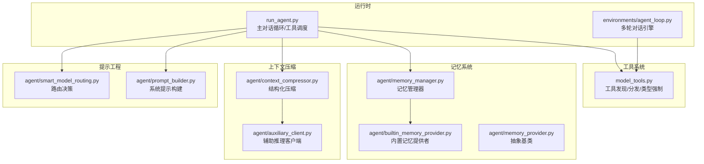
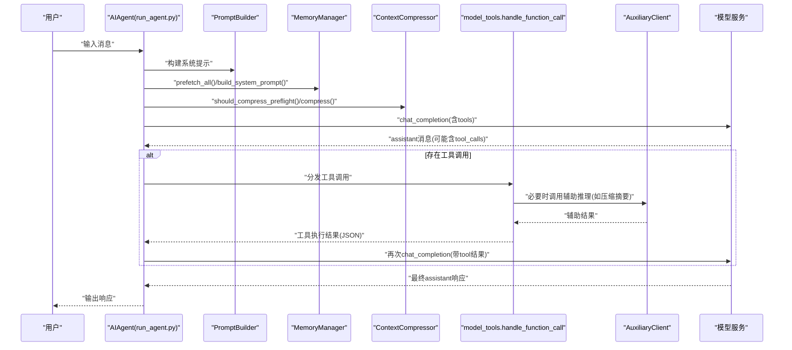
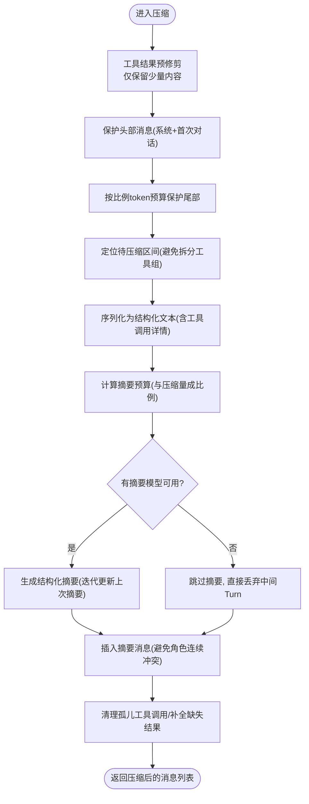
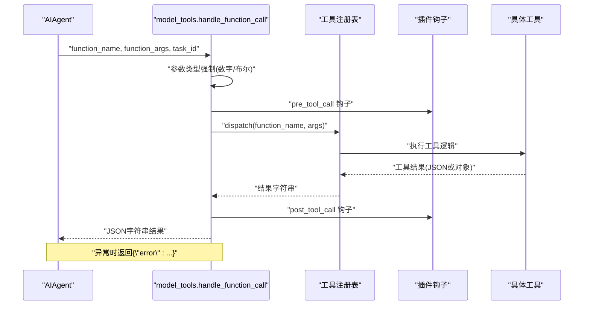
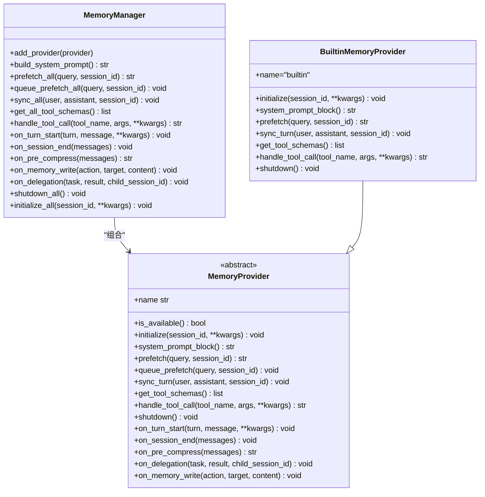
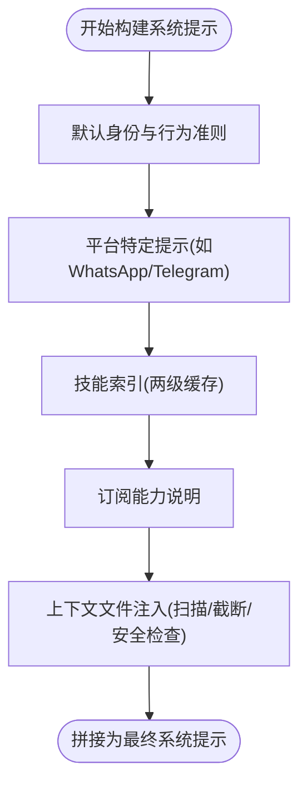
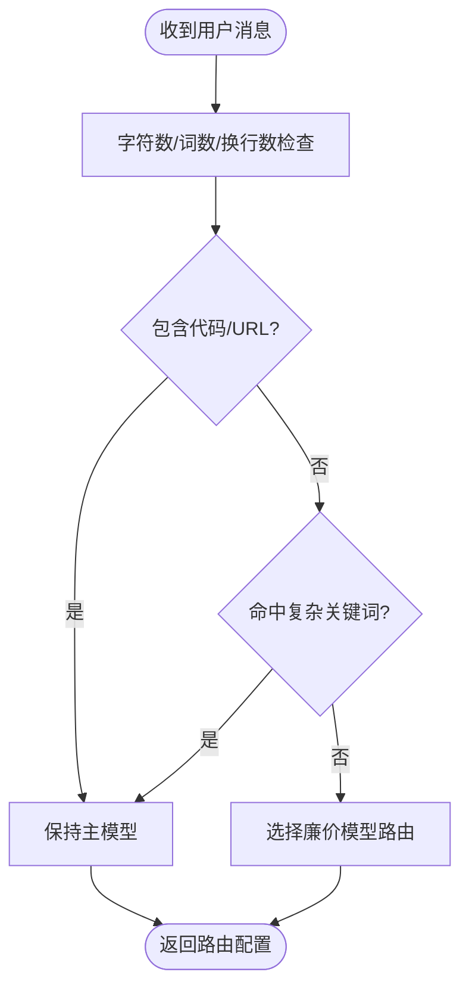
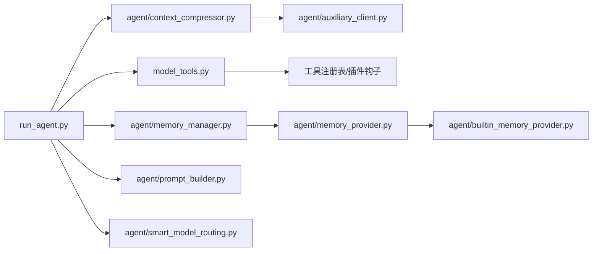

# 数据流分析

<cite>
**本文引用的文件**
- [agent/context_compressor.py](file://agent/context_compressor.py)
- [agent/memory_manager.py](file://agent/memory_manager.py)
- [agent/builtin_memory_provider.py](file://agent/builtin_memory_provider.py)
- [agent/memory_provider.py](file://agent/memory_provider.py)
- [agent/prompt_builder.py](file://agent/prompt_builder.py)
- [agent/smart_model_routing.py](file://agent/smart_model_routing.py)
- [environments/agent_loop.py](file://environments/agent_loop.py)
- [run_agent.py](file://run_agent.py)
- [model_tools.py](file://model_tools.py)
- [agent/auxiliary_client.py](file://agent/auxiliary_client.py)
</cite>

## 目录
1. [简介](#简介)
2. [项目结构](#项目结构)
3. [核心组件](#核心组件)
4. [架构总览](#架构总览)
5. [详细组件分析](#详细组件分析)
6. [依赖分析](#依赖分析)
7. [性能考虑](#性能考虑)
8. [故障排查指南](#故障排查指南)
9. [结论](#结论)
10. [附录](#附录)

## 简介
本文件面向Hermes Agent，提供系统级数据流与处理流程的深入分析。重点覆盖以下方面：
- 用户输入到响应输出的完整数据路径
- 上下文压缩的数据处理管道：token估算、压缩算法、缓存策略
- 工具调用的数据流：参数传递、结果处理、错误传播
- 记忆系统的数据持久化流程：数据序列化、存储格式、检索算法
- 数据验证规则、异常处理机制与性能监控指标
- 提供数据流图与状态转换图，直观展示数据在各组件间的传递过程

## 项目结构
Hermes Agent采用模块化分层设计：
- 运行时引擎：run_agent.py负责主对话循环、工具调度、上下文管理与错误处理
- 工具系统：model_tools.py统一注册与分发工具调用，支持类型强制与插件扩展
- 记忆系统：MemoryManager协调内置与外部记忆提供者，实现跨会话持久化
- 上下文压缩：ContextCompressor在接近模型上下文窗口阈值时进行结构化压缩
- 辅助客户端：auxiliary_client提供统一的“辅助任务”推理后端选择与回退链路
- 环境适配：environments/agent_loop.py提供可复用的多轮对话引擎



图表来源
- [run_agent.py](file://run_agent.py)
- [model_tools.py](file://model_tools.py)
- [agent/memory_manager.py](file://agent/memory_manager.py)
- [agent/builtin_memory_provider.py](file://agent/builtin_memory_provider.py)
- [agent/memory_provider.py](file://agent/memory_provider.py)
- [agent/context_compressor.py](file://agent/context_compressor.py)
- [agent/auxiliary_client.py](file://agent/auxiliary_client.py)
- [agent/prompt_builder.py](file://agent/prompt_builder.py)
- [agent/smart_model_routing.py](file://agent/smart_model_routing.py)
- [environments/agent_loop.py](file://environments/agent_loop.py)

章节来源
- [run_agent.py](file://run_agent.py)
- [model_tools.py](file://model_tools.py)
- [agent/memory_manager.py](file://agent/memory_manager.py)
- [agent/builtin_memory_provider.py](file://agent/builtin_memory_provider.py)
- [agent/memory_provider.py](file://agent/memory_provider.py)
- [agent/context_compressor.py](file://agent/context_compressor.py)
- [agent/auxiliary_client.py](file://agent/auxiliary_client.py)
- [agent/prompt_builder.py](file://agent/prompt_builder.py)
- [agent/smart_model_routing.py](file://agent/smart_model_routing.py)
- [environments/agent_loop.py](file://environments/agent_loop.py)

## 核心组件
- 主对话循环（run_agent.py）：负责消息历史管理、工具定义生成、API调用、错误恢复、预算控制与日志记录
- 工具系统（model_tools.py）：集中式工具注册与分发，支持类型强制、插件发现与异步桥接
- 记忆系统（MemoryManager/BuiltinMemoryProvider/MemoryProvider）：提供跨会话持久化能力，支持系统提示注入、预取与同步
- 上下文压缩（ContextCompressor/AuxiliaryClient）：基于token预算的结构化摘要生成与消息组保护，避免拆分工具调用对齐问题
- 系统提示构建（PromptBuilder）：技能索引、平台提示、上下文文件注入与缓存
- 智能路由（SmartModelRouting）：根据消息复杂度选择廉价模型路由

章节来源
- [run_agent.py](file://run_agent.py)
- [model_tools.py](file://model_tools.py)
- [agent/memory_manager.py](file://agent/memory_manager.py)
- [agent/builtin_memory_provider.py](file://agent/builtin_memory_provider.py)
- [agent/memory_provider.py](file://agent/memory_provider.py)
- [agent/context_compressor.py](file://agent/context_compressor.py)
- [agent/auxiliary_client.py](file://agent/auxiliary_client.py)
- [agent/prompt_builder.py](file://agent/prompt_builder.py)
- [agent/smart_model_routing.py](file://agent/smart_model_routing.py)

## 架构总览
下图展示从用户输入到最终响应的关键数据流路径，以及工具调用与记忆系统的交互。



图表来源
- [run_agent.py](file://run_agent.py)
- [agent/prompt_builder.py](file://agent/prompt_builder.py)
- [agent/memory_manager.py](file://agent/memory_manager.py)
- [agent/context_compressor.py](file://agent/context_compressor.py)
- [model_tools.py](file://model_tools.py)
- [agent/auxiliary_client.py](file://agent/auxiliary_client.py)

## 详细组件分析

### 上下文压缩数据流（ContextCompressor）
ContextCompressor在接近模型上下文限制时，通过“昂贵预处理（工具结果修剪）+头尾保护（按token预算）+结构化摘要（迭代更新）”三阶段压缩中间消息，确保API不接收孤儿工具调用对齐问题，并尽量保留关键信息。



图表来源
- [agent/context_compressor.py](file://agent/context_compressor.py)
- [agent/auxiliary_client.py](file://agent/auxiliary_client.py)

章节来源
- [agent/context_compressor.py](file://agent/context_compressor.py)
- [agent/auxiliary_client.py](file://agent/auxiliary_client.py)

### 工具调用数据流（model_tools.handle_function_call）
工具调用遵循“类型强制 → 插件钩子 → 注册表分发 → 结果序列化”的路径；同时处理未知工具名、参数解析失败与执行异常等错误场景，并将错误包装为JSON字符串返回给模型。



图表来源
- [model_tools.py](file://model_tools.py)
- [run_agent.py](file://run_agent.py)

章节来源
- [model_tools.py](file://model_tools.py)
- [run_agent.py](file://run_agent.py)

### 记忆系统数据流（MemoryManager）
MemoryManager作为中枢，协调内置与最多一个外部记忆提供者，提供系统提示拼装、预取召回、回合同步与工具路由。内置提供者始终激活，外部提供者仅允许一个，防止schema膨胀与后端冲突。



图表来源
- [agent/memory_manager.py](file://agent/memory_manager.py)
- [agent/memory_provider.py](file://agent/memory_provider.py)
- [agent/builtin_memory_provider.py](file://agent/builtin_memory_provider.py)

章节来源
- [agent/memory_manager.py](file://agent/memory_manager.py)
- [agent/memory_provider.py](file://agent/memory_provider.py)
- [agent/builtin_memory_provider.py](file://agent/builtin_memory_provider.py)

### 多轮对话引擎（environments/agent_loop.py）
提供与run_agent一致的工具调用循环，支持不同服务器类型（OpenAI、VLLM、SGLang、OpenRouter、ManagedServer），并在无法解析结构化tool_calls时使用备用解析器。

```mermaid
sequenceDiagram
participant ENV as "环境"
participant LOOP as "HermesAgentLoop"
participant SVR as "Server"
participant MT as "model_tools.handle_function_call"
ENV->>LOOP : "messages"
loop 每轮
LOOP->>SVR : "chat_completion(messages, tools)"
SVR-->>LOOP : "assistant消息"
alt 含tool_calls
LOOP->>MT : "逐个工具调用"
MT-->>LOOP : "工具结果(JSON)"
LOOP->>SVR : "再次chat_completion(含tool结果)"
else 无tool_calls
LOOP-->>ENV : "完成(自然结束)"
end
end
```

图表来源
- [environments/agent_loop.py](file://environments/agent_loop.py)
- [model_tools.py](file://model_tools.py)

章节来源
- [environments/agent_loop.py](file://environments/agent_loop.py)
- [model_tools.py](file://model_tools.py)

### 系统提示构建与平台提示（agent/prompt_builder.py）
系统提示由多个片段组成：身份、平台提示、技能索引、订阅能力、上下文文件等。其中技能索引采用两级缓存（进程内LRU + 磁盘快照），提升冷启动性能。



图表来源
- [agent/prompt_builder.py](file://agent/prompt_builder.py)

章节来源
- [agent/prompt_builder.py](file://agent/prompt_builder.py)

### 智能模型路由（agent/smart_model_routing.py）
根据消息长度、换行数、代码块、URL与关键词集合判断是否走“简单轮次”路由，若满足条件则切换到配置的廉价模型，否则保持主模型。



图表来源
- [agent/smart_model_routing.py](file://agent/smart_model_routing.py)

章节来源
- [agent/smart_model_routing.py](file://agent/smart_model_routing.py)

## 依赖分析
- 组件耦合
  - run_agent依赖model_tools进行工具分发，依赖memory_manager进行记忆集成，依赖context_compressor进行上下文压缩，依赖prompt_builder构建系统提示
  - model_tools依赖工具注册表与插件钩子，内部维护事件循环以避免“事件循环已关闭”问题
  - memory_manager组合多个MemoryProvider，内置提供者不可移除，外部提供者最多一个
  - context_compressor依赖auxiliary_client进行结构化摘要生成
- 外部依赖
  - OpenAI兼容客户端（OpenRouter、自定义端点、Codex OAuth、Anthropic）
  - 插件与MCP工具发现机制
  - 环境变量与配置文件（.env、config.yaml）



图表来源
- [run_agent.py](file://run_agent.py)
- [model_tools.py](file://model_tools.py)
- [agent/memory_manager.py](file://agent/memory_manager.py)
- [agent/memory_provider.py](file://agent/memory_provider.py)
- [agent/builtin_memory_provider.py](file://agent/builtin_memory_provider.py)
- [agent/context_compressor.py](file://agent/context_compressor.py)
- [agent/auxiliary_client.py](file://agent/auxiliary_client.py)
- [agent/prompt_builder.py](file://agent/prompt_builder.py)
- [agent/smart_model_routing.py](file://agent/smart_model_routing.py)

章节来源
- [run_agent.py](file://run_agent.py)
- [model_tools.py](file://model_tools.py)
- [agent/memory_manager.py](file://agent/memory_manager.py)
- [agent/memory_provider.py](file://agent/memory_provider.py)
- [agent/builtin_memory_provider.py](file://agent/builtin_memory_provider.py)
- [agent/context_compressor.py](file://agent/context_compressor.py)
- [agent/auxiliary_client.py](file://agent/auxiliary_client.py)
- [agent/prompt_builder.py](file://agent/prompt_builder.py)
- [agent/smart_model_routing.py](file://agent/smart_model_routing.py)

## 性能考虑
- 上下文压缩
  - 使用“工具结果预修剪”降低后续摘要成本
  - 基于模型上下文窗口的比例预算保护尾部，避免固定消息数导致的不均衡
  - 摘要预算与压缩量成比例，大窗口模型获得更丰富的摘要
- 工具执行
  - 异步桥接避免“事件循环已关闭”错误，提高缓存客户端稳定性
  - 并行执行策略：只对无共享状态且路径不重叠的工具批量并发
- 记忆系统
  - 技能索引两级缓存（进程内LRU + 磁盘快照），减少重复扫描
  - 内存提供者按需初始化，避免不必要的IO
- 路由优化
  - 简单轮次自动切换廉价模型，降低主模型负载

## 故障排查指南
- 工具调用错误
  - 未知工具名：返回标准错误JSON，记录警告日志
  - 参数JSON解析失败：记录错误并返回标准错误JSON
  - 工具执行异常：捕获异常并返回错误信息
- 上下文压缩失败
  - 摘要模型不可用：进入冷却期（默认10分钟），期间跳过摘要直接丢弃中间Turn
  - 工具调用对齐问题：自动清理孤儿结果并补全缺失结果，避免API拒绝
- 记忆系统异常
  - provider初始化失败：记录警告并跳过该provider
  - 工具schema冲突：同名工具冲突时记录警告并忽略重复
- 日志与可观测性
  - run_agent中提供详尽的日志级别控制与活动追踪（最后活动时间戳、API调用计数等）
  - 工具执行耗时超过阈值会记录警告，便于定位慢工具

章节来源
- [environments/agent_loop.py](file://environments/agent_loop.py)
- [agent/context_compressor.py](file://agent/context_compressor.py)
- [agent/memory_manager.py](file://agent/memory_manager.py)
- [run_agent.py](file://run_agent.py)

## 结论
Hermes Agent通过清晰的模块边界与稳健的错误处理机制，实现了从用户输入到响应输出的高效数据流。上下文压缩、工具调度、记忆系统与系统提示构建相互协作，在保证功能完整性的同时兼顾性能与可维护性。建议在生产环境中结合日志与监控指标持续优化路由策略与压缩阈值。

## 附录
- 关键数据结构与复杂度
  - 上下文压缩：预修剪O(n)、尾部预算扫描O(n)、摘要预算与内容成正比，整体近似线性
  - 工具分发：注册表查找O(1)，类型强制O(m)（m为参数数量）
  - 记忆系统：技能索引缓存命中O(1)，磁盘快照读写O(k)（k为技能数量）
- 数据验证规则
  - 系统提示构建：检测隐藏Unicode与潜在注入模式，阻断后返回安全占位符
  - 工具参数：严格类型强制（整数/浮点/布尔），字符串保持原样
  - Surrogate字符：统一替换为U+FFFD，避免JSON序列化崩溃
- 性能监控指标
  - API调用次数、每轮耗时、工具执行耗时、内存占用、压缩节省token数、摘要生成耗时