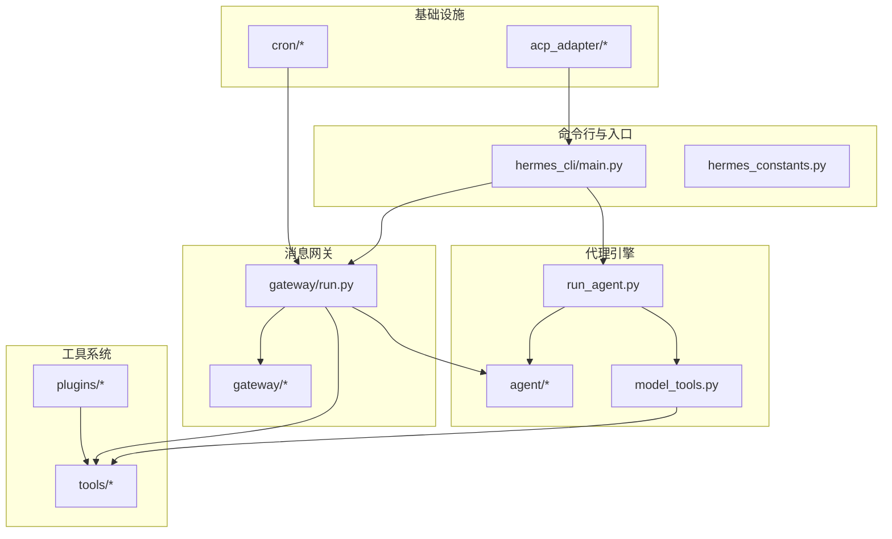
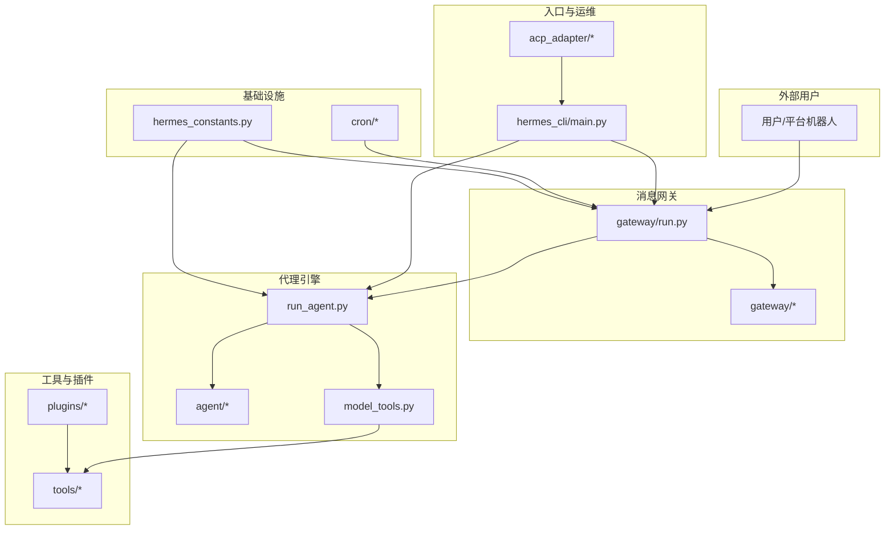
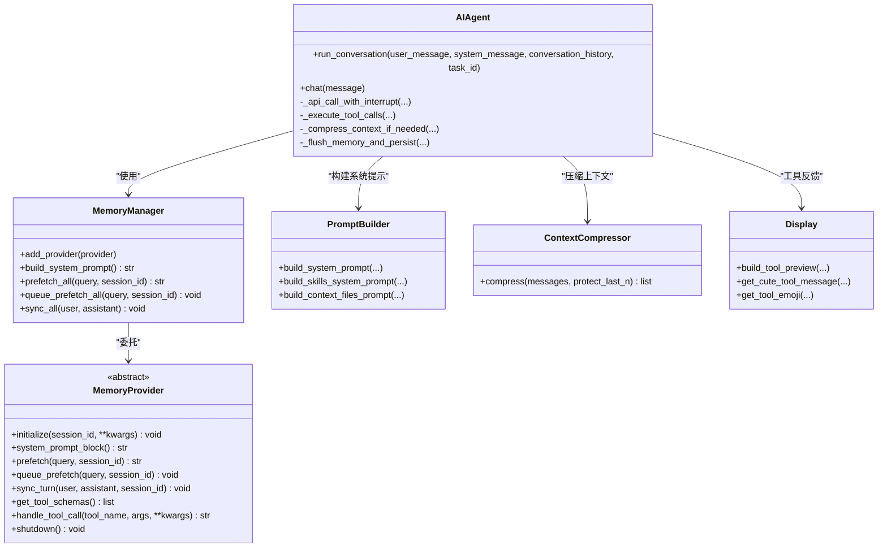
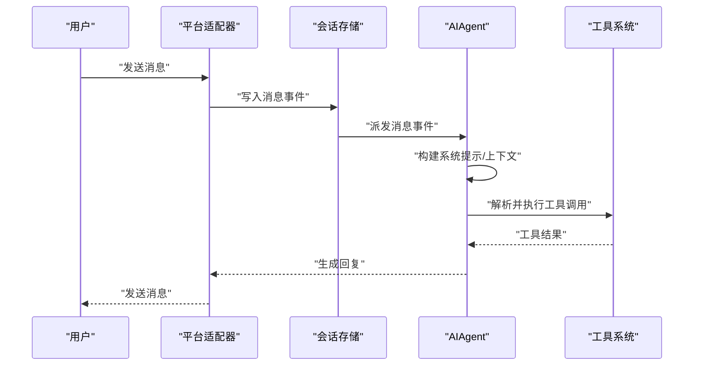
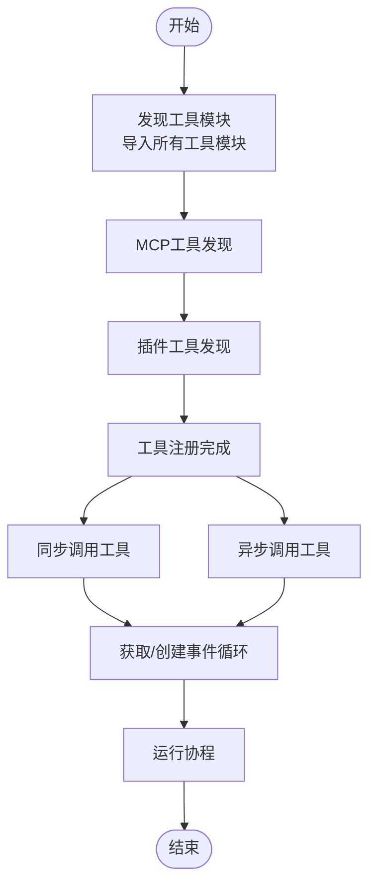
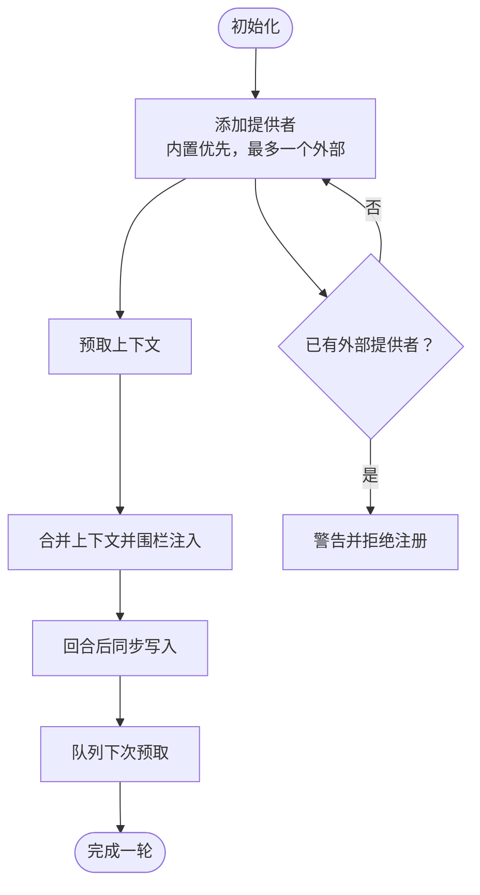
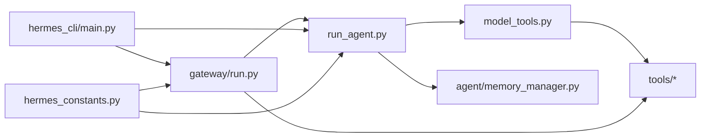

# 架构设计

<cite>
**本文引用的文件**   
- [README.md](file://README.md)
- [pyproject.toml](file://pyproject.toml)
- [requirements.txt](file://requirements.txt)
- [run_agent.py](file://run_agent.py)
- [agent/__init__.py](file://agent/__init__.py)
- [agent/memory_manager.py](file://agent/memory_manager.py)
- [agent/memory_provider.py](file://agent/memory_provider.py)
- [model_tools.py](file://model_tools.py)
- [hermes_constants.py](file://hermes_constants.py)
- [hermes_cli/main.py](file://hermes_cli/main.py)
- [gateway/run.py](file://gateway/run.py)
- [gateway/__init__.py](file://gateway/__init__.py)
- [website/docs/developer-guide/agent-loop.md](file://website/docs/developer-guide/agent-loop.md)
- [website/docs/developer-guide/gateway-internals.md](file://website/docs/developer-guide/gateway-internals.md)
- [website/docs/user-guide/messaging/index.md](file://website/docs/user-guide/messaging/index.md)
</cite>

## 目录
1. [引言](#引言)
2. [项目结构](#项目结构)
3. [核心组件](#核心组件)
4. [架构总览](#架构总览)
5. [详细组件分析](#详细组件分析)
6. [依赖分析](#依赖分析)
7. [性能考量](#性能考量)
8. [故障排查指南](#故障排查指南)
9. [结论](#结论)
10. [附录](#附录)

## 引言
本架构设计文档面向Hermes Agent，系统化阐述其高层架构与关键子系统：代理引擎（AIAgent）、消息网关（Gateway）、工具系统（Tool System）、内存管理（Memory Management）等。文档从系统架构、组件交互、数据流、集成模式、技术决策与权衡、基础设施与可扩展性、部署拓扑、安全与监控、灾难恢复以及技术栈与依赖兼容性等方面进行深入说明，并提供可视化图示帮助读者快速建立对系统的整体认知。

## 项目结构
Hermes Agent采用模块化分层组织，主要目录与职责如下：
- agent：代理内核与辅助能力（记忆、压缩、提示构建、定价统计、轨迹等）
- tools：工具注册与执行（终端、文件、浏览器、代码执行、图像生成、TTS、技能、定时任务等）
- gateway：多平台消息网关（适配器、会话、投递路由、钩子等）
- hermes_cli：命令行入口与运维工具（配置、状态、服务管理、ACP等）
- cron：内置计划任务调度器
- acp_adapter：ACPI（Agent Client Protocol）服务端适配
- plugins：插件生态（如多种记忆后端）
- optional-skills：可选技能包
- docker、scripts、packaging：容器与打包相关

**图表来源**
- [hermes_cli/main.py:1-200](file://hermes_cli/main.py#L1-L200)
- [run_agent.py:1-200](file://run_agent.py#L1-L200)
- [gateway/run.py:1-200](file://gateway/run.py#L1-L200)
- [model_tools.py:1-200](file://model_tools.py#L1-L200)
- [agent/__init__.py:1-7](file://agent/__init__.py#L1-L7)
- [gateway/__init__.py:1-36](file://gateway/__init__.py#L1-L36)

**章节来源**
- [README.md:1-176](file://README.md#L1-L176)
- [pyproject.toml:1-116](file://pyproject.toml#L1-L116)
- [requirements.txt:1-37](file://requirements.txt#L1-L37)

## 核心组件
- 代理引擎（AIAgent）
  - 负责对话循环、模型调用、工具调用、上下文压缩、记忆同步、迭代预算控制、错误处理与回退策略。
  - 关键流程参考“代理循环内部机制”文档，涵盖消息格式、中断式调用、工具并发执行、回退模型与持久化。
- 消息网关（Gateway）
  - 提供统一的多平台接入（Telegram、Discord、Slack、WhatsApp、Signal、SMS、Email、Matrix、Webhook、API Server等），支持会话管理、动态上下文注入、投递路由与平台特定工具集。
  - 网关生命周期由run.py驱动，平台适配器遵循统一接口，支持长轮询、Webhook、Socket等接入方式。
- 工具系统（Model Tools + Tools Registry）
  - 通过model_tools.py聚合工具发现、注册与执行桥接，支持同步/异步工具执行、线程池并发、事件循环复用，避免“事件循环已关闭”问题。
  - 工具按模块自注册，支持MCP外部工具与插件工具扩展。
- 内存管理（Memory Manager + Memory Provider）
  - MemoryManager协调内置记忆提供者与最多一个外部插件提供者；MemoryProvider定义抽象接口，支持预取、同步、工具Schema暴露、生命周期钩子等。
  - 记忆上下文以“围栏块”形式注入，避免被模型误判为用户输入。

**章节来源**
- [website/docs/developer-guide/agent-loop.md:1-221](file://website/docs/developer-guide/agent-loop.md#L1-L221)
- [website/docs/developer-guide/gateway-internals.md:144-175](file://website/docs/developer-guide/gateway-internals.md#L144-L175)
- [website/docs/user-guide/messaging/index.md:31-86](file://website/docs/user-guide/messaging/index.md#L31-L86)
- [run_agent.py:6923-6950](file://run_agent.py#L6923-L6950)
- [agent/memory_manager.py:1-200](file://agent/memory_manager.py#L1-L200)
- [agent/memory_provider.py:1-200](file://agent/memory_provider.py#L1-L200)
- [model_tools.py:1-200](file://model_tools.py#L1-L200)

## 架构总览
下图展示系统上下文与组件分解：CLI作为入口，Gateway负责多平台消息接入与会话存储，RunAgent承载代理引擎，ModelTools与Tools提供工具能力，Agent子模块提供记忆、压缩、提示构建等，Plugins与ACPI提供扩展与编辑器集成。

**图表来源**
- [hermes_cli/main.py:1-200](file://hermes_cli/main.py#L1-L200)
- [gateway/run.py:1-200](file://gateway/run.py#L1-L200)
- [run_agent.py:1-200](file://run_agent.py#L1-L200)
- [model_tools.py:1-200](file://model_tools.py#L1-L200)
- [agent/__init__.py:1-7](file://agent/__init__.py#L1-L7)
- [gateway/__init__.py:1-36](file://gateway/__init__.py#L1-L36)
- [hermes_constants.py:1-106](file://hermes_constants.py#L1-L106)

## 详细组件分析

### 代理引擎（AIAgent）类图
AIAgent是核心编排器，负责提示构建、模型调用、工具执行、上下文压缩与持久化。其与MemoryManager、PromptBuilder、ContextCompressor、Display等协作。

**图表来源**
- [run_agent.py:6923-6950](file://run_agent.py#L6923-L6950)
- [agent/memory_manager.py:72-200](file://agent/memory_manager.py#L72-L200)
- [agent/memory_provider.py:42-200](file://agent/memory_provider.py#L42-L200)

**章节来源**
- [website/docs/developer-guide/agent-loop.md:1-221](file://website/docs/developer-guide/agent-loop.md#L1-L221)
- [run_agent.py:1-200](file://run_agent.py#L1-L200)
- [agent/memory_manager.py:1-200](file://agent/memory_manager.py#L1-L200)
- [agent/memory_provider.py:1-200](file://agent/memory_provider.py#L1-L200)

### 消息网关（Gateway）序列图
消息从平台适配器进入，经会话存储路由到AIAgent，再返回平台适配器发送给用户。

**图表来源**
- [website/docs/user-guide/messaging/index.md:31-86](file://website/docs/user-guide/messaging/index.md#L31-L86)
- [gateway/run.py:2277-2299](file://gateway/run.py#L2277-L2299)

**章节来源**
- [website/docs/developer-guide/gateway-internals.md:144-175](file://website/docs/developer-guide/gateway-internals.md#L144-L175)
- [gateway/run.py:1-200](file://gateway/run.py#L1-200)

### 工具系统（Model Tools）流程图
工具发现与执行的流程，强调异步桥接与线程安全。

**图表来源**
- [model_tools.py:132-185](file://model_tools.py#L132-L185)
- [model_tools.py:44-126](file://model_tools.py#L44-L126)

**章节来源**
- [model_tools.py:1-200](file://model_tools.py#L1-L200)

### 内存管理（Memory Manager）流程图
内存提供者的注册、预取与同步流程，确保内置与外部提供者协同工作且互不冲突。

**图表来源**
- [agent/memory_manager.py:72-200](file://agent/memory_manager.py#L72-L200)
- [agent/memory_provider.py:42-200](file://agent/memory_provider.py#L42-L200)

**章节来源**
- [agent/memory_manager.py:1-200](file://agent/memory_manager.py#L1-L200)
- [agent/memory_provider.py:1-200](file://agent/memory_provider.py#L1-L200)

## 依赖分析
- 技术栈与版本约束
  - Python 3.11+，核心库包括openai、anthropic、httpx、rich、pydantic、Jinja2、PyJWT等。
  - 可选依赖覆盖消息平台（Telegram、Discord、Slack等）、语音（faster-whisper、ElevenLabs）、MCP、RL训练（Atropos、Tinker）等。
- 组件耦合与内聚
  - run_agent.py高内聚地编排代理循环，通过agent/*模块解耦记忆、压缩、提示构建等功能。
  - model_tools.py作为工具系统的薄层编排，降低tools/*与上层调用的耦合。
  - gateway/run.py集中处理环境变量桥接、SSL证书、配置注入与平台适配器生命周期。
- 外部依赖与集成点
  - OpenRouter、Anthropic、OpenAI等推理提供方；MCP服务器；平台API（Telegram、Discord等）。
  - 插件生态（plugins/memory/*）与ACPI协议（acp_adapter）提供扩展能力。

**图表来源**
- [run_agent.py:1-200](file://run_agent.py#L1-L200)
- [model_tools.py:1-200](file://model_tools.py#L1-L200)
- [agent/memory_manager.py:1-200](file://agent/memory_manager.py#L1-L200)
- [gateway/run.py:1-200](file://gateway/run.py#L1-L200)
- [hermes_cli/main.py:1-200](file://hermes_cli/main.py#L1-L200)
- [hermes_constants.py:1-106](file://hermes_constants.py#L1-L106)

**章节来源**
- [pyproject.toml:1-116](file://pyproject.toml#L1-L116)
- [requirements.txt:1-37](file://requirements.txt#L1-L37)

## 性能考量
- 事件循环与并发
  - model_tools.py通过持久化事件循环与线程本地循环避免“事件循环已关闭”错误，提升异步工具稳定性与复用率。
- 工具执行并发
  - 单工具调用直接在主线程执行，多工具调用并发执行并保持原始顺序，兼顾吞吐与一致性。
- 上下文压缩与持久化
  - 预压缩与网关自动压缩策略减少上下文长度，压缩前先刷新内存，避免数据丢失。
- I/O与管道健壮性
  - run_agent.py提供安全stdio包装，防止服务化或无终端场景下的I/O异常导致崩溃。

**章节来源**
- [model_tools.py:44-126](file://model_tools.py#L44-L126)
- [website/docs/developer-guide/agent-loop.md:125-160](file://website/docs/developer-guide/agent-loop.md#L125-L160)
- [run_agent.py:108-163](file://run_agent.py#L108-L163)

## 故障排查指南
- 日志与环境加载
  - hermes_cli/main.py与gateway/run.py均在启动早期加载环境变量与日志，便于定位配置与依赖问题。
- 中断与取消
  - 代理循环支持中断式API调用，用户发送新消息或/stop命令可中止当前请求，避免部分响应污染历史。
- 回退模型与辅助任务
  - 主模型失败时按配置回退至备用提供方；视觉、压缩、网页抽取、会话搜索等辅助任务各自拥有独立回退链。
- 平台适配器锁
  - 支持令牌级互斥锁，避免同一凭据被多个配置文件同时使用。

**章节来源**
- [hermes_cli/main.py:139-152](file://hermes_cli/main.py#L139-L152)
- [gateway/run.py:35-72](file://gateway/run.py#L35-L72)
- [website/docs/developer-guide/agent-loop.md:106-124](file://website/docs/developer-guide/agent-loop.md#L106-L124)
- [website/docs/developer-guide/agent-loop.md:190-200](file://website/docs/developer-guide/agent-loop.md#L190-L200)
- [website/docs/developer-guide/gateway-internals.md:173-175](file://website/docs/developer-guide/gateway-internals.md#L173-L175)

## 结论
Hermes Agent通过清晰的分层架构实现了“代理引擎 + 消息网关 + 工具系统 + 内存管理”的协同：代理引擎专注推理与工具编排，网关统一接入与会话治理，工具系统提供可扩展的能力边界，内存管理保障跨会话的知识沉淀与检索。该架构在可扩展性、安全性与运维可观测性方面具备良好基础，适合在多云/边缘/Serverless环境中部署与演进。

## 附录
- 基础设施与部署拓扑
  - 单机/容器/Serverless均可运行；支持多平台消息入口与本地/远程终端后端。
- 安全与合规
  - 环境变量桥接与脱敏、令牌锁、平台白名单、PII脱敏与审计日志。
- 监控与可观测性
  - CLI集中日志、会话持久化、使用计费估算、轨迹保存与压缩。
- 灾难恢复
  - 会话可恢复、压缩后保留尾部消息、内存刷盘、回退模型与辅助任务独立容错。