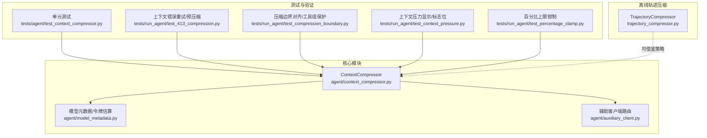
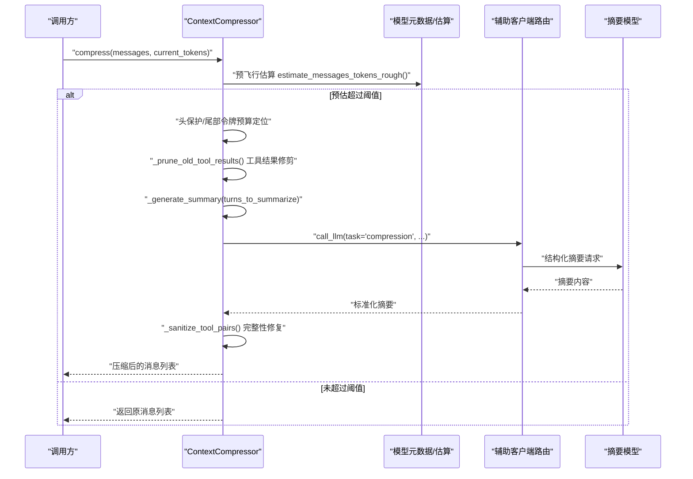
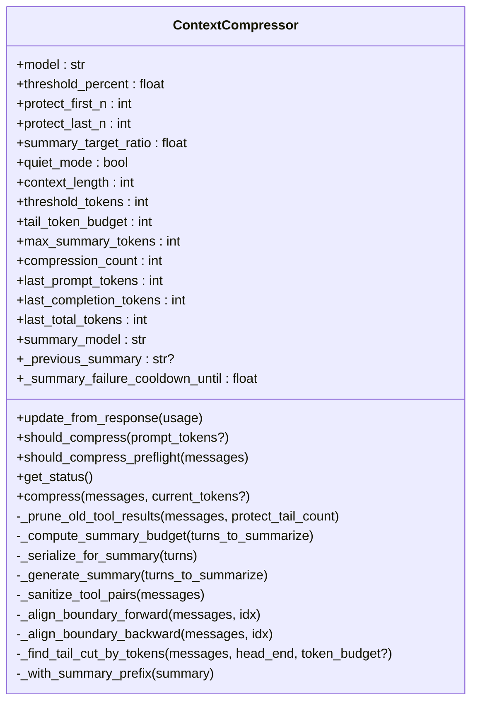
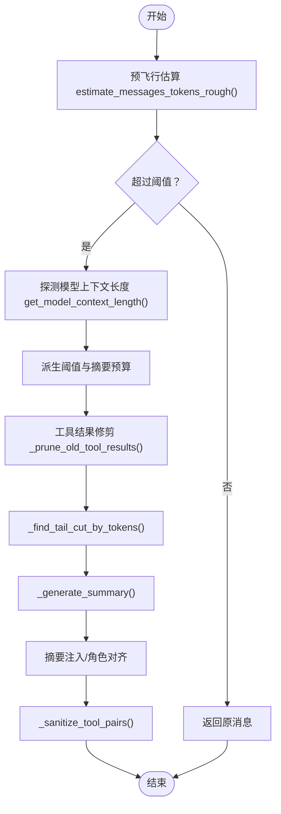
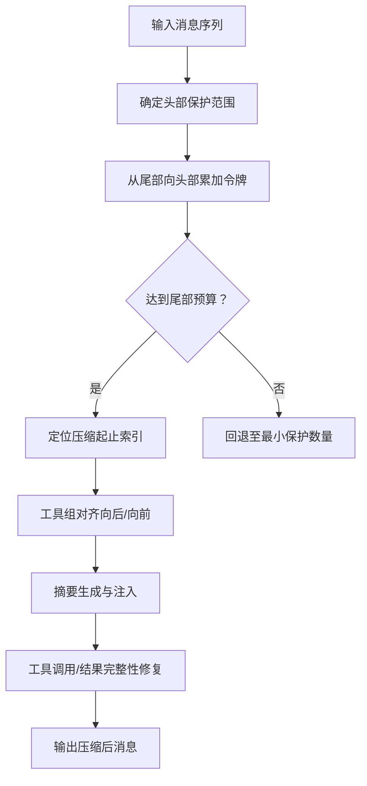
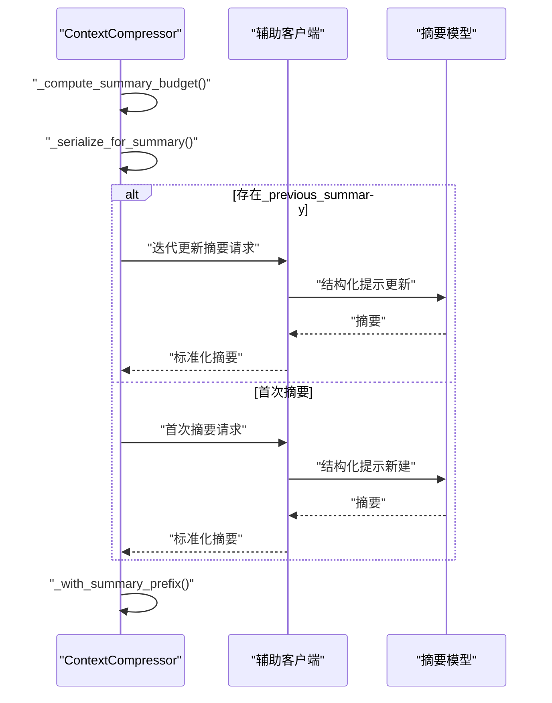
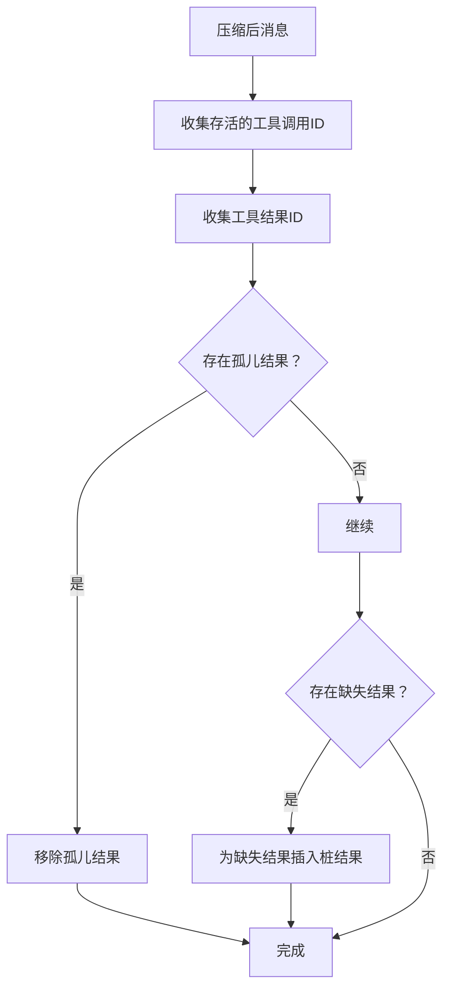
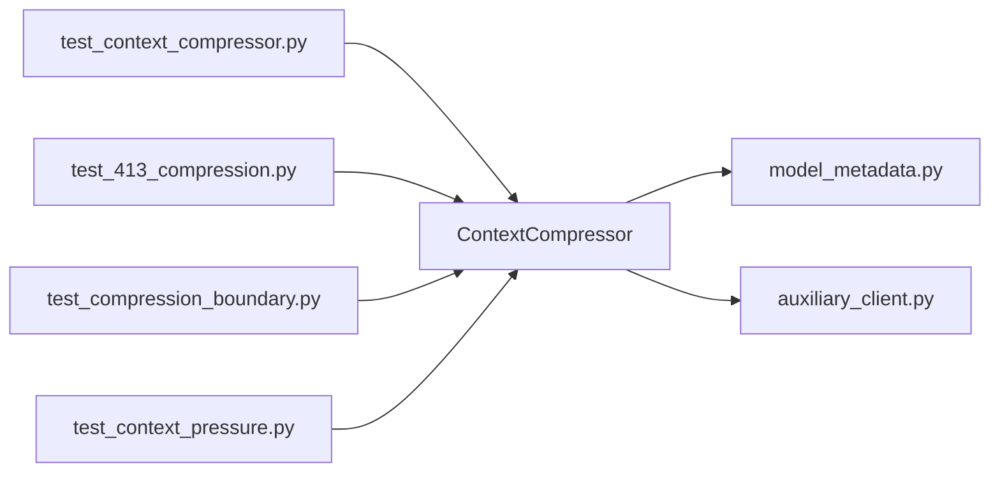

# 上下文压缩算法

<cite>
**本文引用的文件**
- [agent/context_compressor.py](file://agent/context_compressor.py)
- [agent/model_metadata.py](file://agent/model_metadata.py)
- [agent/auxiliary_client.py](file://agent/auxiliary_client.py)
- [tests/agent/test_context_compressor.py](file://tests/agent/test_context_compressor.py)
- [tests/run_agent/test_413_compression.py](file://tests/run_agent/test_413_compression.py)
- [tests/run_agent/test_compression_boundary.py](file://tests/run_agent/test_compression_boundary.py)
- [tests/run_agent/test_context_pressure.py](file://tests/run_agent/test_context_pressure.py)
- [tests/run_agent/test_percentage_clamp.py](file://tests/run_agent/test_percentage_clamp.py)
- [trajectory_compressor.py](file://trajectory_compressor.py)
</cite>

## 目录
1. [简介](#简介)
2. [项目结构](#项目结构)
3. [核心组件](#核心组件)
4. [架构总览](#架构总览)
5. [详细组件分析](#详细组件分析)
6. [依赖关系分析](#依赖关系分析)
7. [性能考量](#性能考量)
8. [故障排除指南](#故障排除指南)
9. [结论](#结论)
10. [附录](#附录)

## 简介
本技术文档围绕 Hermes Agent 的上下文压缩算法展开，系统阐述 ContextCompressor 类的设计与实现，覆盖以下关键主题：
- 压缩策略选择：基于令牌预算的尾部保护、中间段结构化摘要、迭代更新摘要
- 令牌估算：预飞行快速估算（粗略）与运行时精确估算（结合模型上下文探测）
- 历史消息优先级排序：头尾保护、工具调用组对齐、摘要角色交替
- 压缩算法细节：工具结果修剪、摘要预算分配、摘要生成模板、摘要前缀规范化
- 准确性保证：粗略估算 vs 精确计算的选择策略与冷却机制
- 效果监控与自适应：压缩率统计、性能影响评估、失败冷却与边界对齐
- 典型场景示例：长对话、大量工具结果、复杂记忆上下文
- 优化建议、基准测试与故障排除

## 项目结构
与上下文压缩直接相关的模块与测试如下：
- 核心算法：agent/context_compressor.py
- 模型元数据与令牌估算：agent/model_metadata.py
- 辅助客户端路由（摘要模型调用）：agent/auxiliary_client.py
- 单元测试与集成测试：tests/agent/test_context_compressor.py、tests/run_agent/test_413_compression.py、tests/run_agent/test_compression_boundary.py、tests/run_agent/test_context_pressure.py、tests/run_agent/test_percentage_clamp.py
- 轨迹压缩（离线训练数据压缩，策略可借鉴）：trajectory_compressor.py

**图表来源**
- [agent/context_compressor.py:1-697](file://agent/context_compressor.py#L1-L697)
- [agent/model_metadata.py:800-942](file://agent/model_metadata.py#L800-L942)
- [agent/auxiliary_client.py:1-800](file://agent/auxiliary_client.py#L1-L800)
- [tests/agent/test_context_compressor.py:1-603](file://tests/agent/test_context_compressor.py#L1-L603)
- [tests/run_agent/test_413_compression.py:170-369](file://tests/run_agent/test_413_compression.py#L170-L369)
- [tests/run_agent/test_compression_boundary.py:1-200](file://tests/run_agent/test_compression_boundary.py#L1-L200)
- [tests/run_agent/test_context_pressure.py:1-249](file://tests/run_agent/test_context_pressure.py#L1-L249)
- [tests/run_agent/test_percentage_clamp.py:120-155](file://tests/run_agent/test_percentage_clamp.py#L120-L155)
- [trajectory_compressor.py:1-800](file://trajectory_compressor.py#L1-L800)

**章节来源**
- [agent/context_compressor.py:1-697](file://agent/context_compressor.py#L1-L697)
- [agent/model_metadata.py:800-942](file://agent/model_metadata.py#L800-L942)
- [agent/auxiliary_client.py:1-800](file://agent/auxiliary_client.py#L1-L800)
- [tests/agent/test_context_compressor.py:1-603](file://tests/agent/test_context_compressor.py#L1-L603)
- [tests/run_agent/test_413_compression.py:170-369](file://tests/run_agent/test_413_compression.py#L170-L369)
- [tests/run_agent/test_compression_boundary.py:1-200](file://tests/run_agent/test_compression_boundary.py#L1-L200)
- [tests/run_agent/test_context_pressure.py:1-249](file://tests/run_agent/test_context_pressure.py#L1-L249)
- [tests/run_agent/test_percentage_clamp.py:120-155](file://tests/run_agent/test_percentage_clamp.py#L120-L155)
- [trajectory_compressor.py:1-800](file://trajectory_compressor.py#L1-L800)

## 核心组件
- ContextCompressor：负责在接近模型上下文阈值时进行自动压缩，采用“头尾保护 + 中间结构化摘要”的策略；支持摘要迭代更新、摘要角色交替、工具调用组完整性保护、摘要前缀规范化等。
- 摘要生成器：通过辅助客户端路由调用摘要模型，使用结构化提示模板生成摘要，并在失败时进入冷却期避免反复尝试。
- 令牌估算与上下文探测：提供预飞行快速估算（字符/4）与运行时精确估算（结合模型上下文长度探测），并支持配置覆盖与缓存。
- 工具调用/结果配对清理：确保压缩后不会出现孤儿工具结果或缺失结果，维护消息列表的完整性。

**章节来源**
- [agent/context_compressor.py:53-124](file://agent/context_compressor.py#L53-L124)
- [agent/context_compressor.py:253-390](file://agent/context_compressor.py#L253-L390)
- [agent/context_compressor.py:412-470](file://agent/context_compressor.py#L412-L470)
- [agent/model_metadata.py:908-942](file://agent/model_metadata.py#L908-L942)
- [agent/auxiliary_client.py:670-783](file://agent/auxiliary_client.py#L670-L783)

## 架构总览
ContextCompressor 的工作流由“预飞行估算 → 头尾保护 → 尾部令牌预算定位 → 结构化摘要 → 角色交替与摘要注入 → 工具调用组完整性修复”构成。摘要模型通过辅助客户端路由自动选择可用的后端（OpenRouter、Nous、Codex、Anthropic、自定义等），并在失败时进入冷却期。

**图表来源**
- [agent/context_compressor.py:565-697](file://agent/context_compressor.py#L565-L697)
- [agent/context_compressor.py:136-139](file://agent/context_compressor.py#L136-L139)
- [agent/context_compressor.py:155-185](file://agent/context_compressor.py#L155-L185)
- [agent/context_compressor.py:253-390](file://agent/context_compressor.py#L253-L390)
- [agent/auxiliary_client.py:670-783](file://agent/auxiliary_client.py#L670-L783)

**章节来源**
- [agent/context_compressor.py:565-697](file://agent/context_compressor.py#L565-L697)
- [agent/model_metadata.py:908-942](file://agent/model_metadata.py#L908-L942)
- [agent/auxiliary_client.py:670-783](file://agent/auxiliary_client.py#L670-L783)

## 详细组件分析

### ContextCompressor 类设计与职责
- 初始化与阈值设置：根据模型上下文长度与阈值比例计算阈值令牌数，派生摘要目标比例与尾部令牌预算，支持摘要模型覆盖与静默模式。
- 预飞行检查：使用粗略估算判断是否需要压缩，避免不必要的 API 调用。
- 压缩主流程：工具结果修剪 → 头尾保护 → 尾部令牌预算定位 → 结构化摘要 → 角色交替与摘要注入 → 工具调用组完整性修复。
- 摘要生成：结构化模板（目标、进度、决策、文件、下一步、关键上下文），支持首次摘要与迭代更新；失败进入冷却期。
- 工具调用/结果配对修复：移除孤儿结果、为缺失结果插入桩（stub）结果，确保 API 不会收到不匹配的 call_id。
- 摘要角色选择：避免与前后邻居角色相同，必要时合并到首尾消息中以保持消息角色交替。

**图表来源**
- [agent/context_compressor.py:53-124](file://agent/context_compressor.py#L53-L124)
- [agent/context_compressor.py:125-149](file://agent/context_compressor.py#L125-L149)
- [agent/context_compressor.py:565-697](file://agent/context_compressor.py#L565-L697)
- [agent/context_compressor.py:155-185](file://agent/context_compressor.py#L155-L185)
- [agent/context_compressor.py:191-201](file://agent/context_compressor.py#L191-L201)
- [agent/context_compressor.py:202-251](file://agent/context_compressor.py#L202-L251)
- [agent/context_compressor.py:253-390](file://agent/context_compressor.py#L253-L390)
- [agent/context_compressor.py:412-470](file://agent/context_compressor.py#L412-L470)
- [agent/context_compressor.py:472-504](file://agent/context_compressor.py#L472-L504)
- [agent/context_compressor.py:510-559](file://agent/context_compressor.py#L510-L559)
- [agent/context_compressor.py:391-400](file://agent/context_compressor.py#L391-L400)

**章节来源**
- [agent/context_compressor.py:53-124](file://agent/context_compressor.py#L53-L124)
- [agent/context_compressor.py:125-149](file://agent/context_compressor.py#L125-L149)
- [agent/context_compressor.py:565-697](file://agent/context_compressor.py#L565-L697)

### 令牌估算与上下文探测
- 预飞行估算：字符数估算（约 4 字符/令牌），用于 should_compress_preflight 快速判断。
- 运行时估算：结合模型上下文长度探测与消息序列的字符总量估算，用于压缩后效果评估。
- 上下文长度解析：支持配置覆盖、持久化缓存、本地服务器查询、特定提供商 API 查询、models.dev 注册表、默认族谱映射与回退探测。
- 粗略估算 vs 精确计算：预飞行使用粗略估算减少 API 调用；运行时使用更精确的上下文探测与字符估算。

**图表来源**
- [agent/context_compressor.py:136-139](file://agent/context_compressor.py#L136-L139)
- [agent/context_compressor.py:88-93](file://agent/context_compressor.py#L88-L93)
- [agent/context_compressor.py:191-201](file://agent/context_compressor.py#L191-L201)
- [agent/context_compressor.py:510-559](file://agent/context_compressor.py#L510-L559)
- [agent/context_compressor.py:253-390](file://agent/context_compressor.py#L253-L390)
- [agent/context_compressor.py:412-470](file://agent/context_compressor.py#L412-L470)

**章节来源**
- [agent/model_metadata.py:908-942](file://agent/model_metadata.py#L908-L942)
- [agent/model_metadata.py:778-905](file://agent/model_metadata.py#L778-L905)

### 历史消息优先级与边界对齐
- 头部保护：保留系统提示与前若干轮对话，避免关键上下文丢失。
- 尾部保护：按令牌预算而非固定消息数保护最近内容，确保最新交互的上下文质量。
- 工具调用组对齐：压缩边界不得分割工具调用与其结果组，通过向后对齐与向前推进确保完整性。
- 摘要角色选择：避免与前后邻居角色重复，必要时将摘要合并到首尾消息中。

**图表来源**
- [agent/context_compressor.py:598-605](file://agent/context_compressor.py#L598-L605)
- [agent/context_compressor.py:510-559](file://agent/context_compressor.py#L510-L559)
- [agent/context_compressor.py:472-504](file://agent/context_compressor.py#L472-L504)
- [agent/context_compressor.py:412-470](file://agent/context_compressor.py#L412-L470)

**章节来源**
- [agent/context_compressor.py:598-605](file://agent/context_compressor.py#L598-L605)
- [agent/context_compressor.py:510-559](file://agent/context_compressor.py#L510-L559)
- [agent/context_compressor.py:472-504](file://agent/context_compressor.py#L472-L504)

### 摘要生成与迭代更新
- 结构化模板：目标、进度（已完成/进行中/阻塞）、关键决策、相关文件、下一步、关键上下文。
- 预算分配：按被压缩内容的令牌量与最大摘要令牌上限（5%上下文，上限 12K）动态分配。
- 迭代更新：已有摘要存在时，仅更新新增进展，保留历史有效信息。
- 冷却机制：摘要生成失败进入冷却期，避免频繁重试造成资源浪费。

**图表来源**
- [agent/context_compressor.py:191-201](file://agent/context_compressor.py#L191-L201)
- [agent/context_compressor.py:202-251](file://agent/context_compressor.py#L202-L251)
- [agent/context_compressor.py:253-390](file://agent/context_compressor.py#L253-L390)
- [agent/context_compressor.py:391-400](file://agent/context_compressor.py#L391-L400)

**章节来源**
- [agent/context_compressor.py:191-201](file://agent/context_compressor.py#L191-L201)
- [agent/context_compressor.py:202-251](file://agent/context_compressor.py#L202-L251)
- [agent/context_compressor.py:253-390](file://agent/context_compressor.py#L253-L390)
- [agent/context_compressor.py:391-400](file://agent/context_compressor.py#L391-L400)

### 工具调用/结果配对完整性
- 清理孤儿结果：移除没有对应工具调用的消息。
- 插入桩结果：为仍存在的工具调用补上桩结果，避免 API 报错。
- 边界对齐：压缩边界不得分割工具调用组，必要时调整起止索引。

**图表来源**
- [agent/context_compressor.py:412-470](file://agent/context_compressor.py#L412-L470)

**章节来源**
- [agent/context_compressor.py:412-470](file://agent/context_compressor.py#L412-L470)

### 压缩效果监控与自适应
- 压缩计数：记录压缩次数，便于统计与调试。
- 使用统计：跟踪最后一次提示、补全与总令牌用量，用于状态展示与日志。
- 百分比上限：使用百分比时进行上限钳制，避免显示异常。
- 上下文压力提示：在接近阈值时发出用户可见的压力提示，支持回调与平台差异。

**章节来源**
- [agent/context_compressor.py:94-95](file://agent/context_compressor.py#L94-L95)
- [agent/context_compressor.py:125-129](file://agent/context_compressor.py#L125-L129)
- [agent/context_compressor.py:141-149](file://agent/context_compressor.py#L141-L149)
- [tests/run_agent/test_percentage_clamp.py:129-133](file://tests/run_agent/test_percentage_clamp.py#L129-L133)
- [tests/run_agent/test_context_pressure.py:25-78](file://tests/run_agent/test_context_pressure.py#L25-L78)

## 依赖关系分析
- ContextCompressor 依赖：
  - 模型元数据与令牌估算：用于上下文长度探测与预飞行估算。
  - 辅助客户端路由：统一摘要模型调用入口，支持多提供商自动切换。
- 测试覆盖：
  - 单元测试覆盖阈值判断、预飞行估算、摘要生成、摘要前缀规范化、摘要失败冷却、摘要角色选择、工具组完整性等。
  - 集成测试覆盖上下文错误触发压缩、预压缩、边界对齐与工具结果保护。

**图表来源**
- [agent/context_compressor.py:20-24](file://agent/context_compressor.py#L20-L24)
- [agent/model_metadata.py:21-24](file://agent/model_metadata.py#L21-L24)
- [agent/auxiliary_client.py:54-58](file://agent/auxiliary_client.py#L54-L58)
- [tests/agent/test_context_compressor.py:1-603](file://tests/agent/test_context_compressor.py#L1-L603)
- [tests/run_agent/test_413_compression.py:170-369](file://tests/run_agent/test_413_compression.py#L170-L369)
- [tests/run_agent/test_compression_boundary.py:1-200](file://tests/run_agent/test_compression_boundary.py#L1-L200)
- [tests/run_agent/test_context_pressure.py:1-249](file://tests/run_agent/test_context_pressure.py#L1-L249)

**章节来源**
- [agent/context_compressor.py:20-24](file://agent/context_compressor.py#L20-L24)
- [agent/model_metadata.py:21-24](file://agent/model_metadata.py#L21-L24)
- [agent/auxiliary_client.py:54-58](file://agent/auxiliary_client.py#L54-L58)
- [tests/agent/test_context_compressor.py:1-603](file://tests/agent/test_context_compressor.py#L1-L603)
- [tests/run_agent/test_413_compression.py:170-369](file://tests/run_agent/test_413_compression.py#L170-L369)
- [tests/run_agent/test_compression_boundary.py:1-200](file://tests/run_agent/test_compression_boundary.py#L1-L200)
- [tests/run_agent/test_context_pressure.py:1-249](file://tests/run_agent/test_context_pressure.py#L1-L249)

## 性能考量
- 预飞行估算：使用字符/4 的粗略估算，显著降低 API 调用频率，适合在发送请求前快速判断是否需要压缩。
- 运行时估算：结合上下文长度探测与字符估算，用于压缩后效果评估与日志统计。
- 摘要预算：按压缩内容规模动态分配，大上下文模型获得更丰富的摘要，避免硬性上限限制。
- 工具结果修剪：在不调用摘要模型的前提下移除旧工具结果，减少后续摘要负担。
- 冷却机制：摘要生成失败时进入冷却期，避免频繁重试导致资源浪费与延迟增加。

[本节为通用指导，无需具体文件引用]

## 故障排除指南
- 摘要模型不可用：当摘要模型调用失败时，进入冷却期并跳过摘要生成，直接丢弃中间轮次而不注入摘要。可通过环境变量或配置覆盖摘要模型。
- 工具结果丢失：若发现工具结果被丢弃，检查压缩边界是否正确对齐工具组，确认已启用工具配对修复逻辑。
- 上下文压力提示异常：确认百分比计算已进行上限钳制，避免显示超过 100% 的数值。
- 预压缩未生效：检查预飞行估算阈值与实际消息大小，确保预飞行估算正确触发压缩。
- 上下文错误重试：当遇到上下文长度错误时，应触发压缩并重建请求，确保第二次请求使用压缩后的消息。

**章节来源**
- [agent/context_compressor.py:374-390](file://agent/context_compressor.py#L374-L390)
- [agent/context_compressor.py:412-470](file://agent/context_compressor.py#L412-L470)
- [tests/run_agent/test_percentage_clamp.py:129-133](file://tests/run_agent/test_percentage_clamp.py#L129-L133)
- [tests/run_agent/test_413_compression.py:175-242](file://tests/run_agent/test_413_compression.py#L175-L242)
- [tests/run_agent/test_413_compression.py:318-369](file://tests/run_agent/test_413_compression.py#L318-L369)

## 结论
ContextCompressor 通过“头尾保护 + 令牌预算尾部保护 + 结构化摘要 + 工具组完整性修复”的组合策略，在保证上下文质量的同时显著降低令牌占用。其预飞行估算与冷却机制提升了整体性能与鲁棒性；摘要模板与迭代更新确保了知识传递的连续性。配合完善的测试覆盖，该算法在长对话、大量工具结果与复杂记忆上下文中均具备良好的稳定性与可扩展性。

[本节为总结性内容，无需具体文件引用]

## 附录

### 典型压缩场景与处理方式
- 长对话：通过尾部令牌预算保护最新交互，中间轮次进行结构化摘要，避免上下文溢出。
- 大量工具结果：先进行工具结果修剪，再进行摘要，减少摘要输入规模。
- 复杂记忆上下文：通过摘要模板保留关键决策与文件路径，避免重复工作。

**章节来源**
- [agent/context_compressor.py:565-697](file://agent/context_compressor.py#L565-L697)
- [agent/context_compressor.py:155-185](file://agent/context_compressor.py#L155-L185)
- [agent/context_compressor.py:202-251](file://agent/context_compressor.py#L202-L251)

### 与其他压缩策略的对比（离线轨迹压缩）
- TrajectoryCompressor 面向离线训练数据，采用“受保护头尾 + 中间区域逐步压缩 + 单条人类摘要替换”的策略，目标是训练信号质量与上下文控制的平衡。
- 与在线上下文压缩相比，离线压缩更强调可复现性与训练一致性，而在线压缩更强调实时性与用户体验。

**章节来源**
- [trajectory_compressor.py:303-774](file://trajectory_compressor.py#L303-L774)