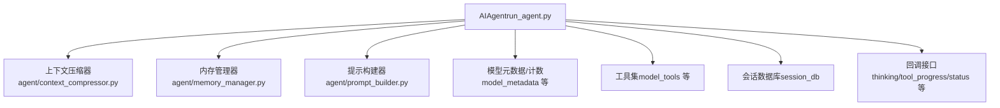
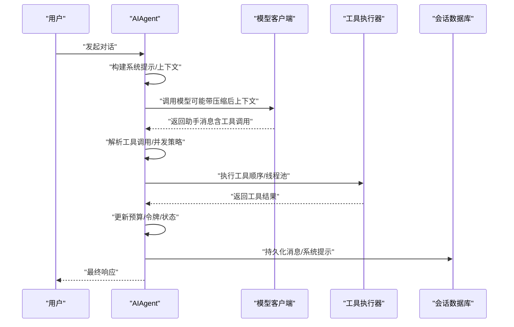
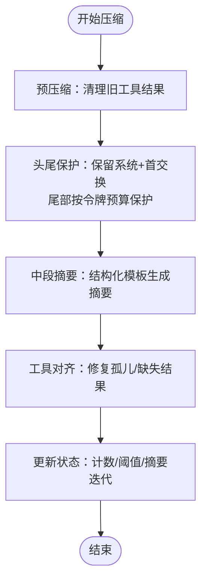
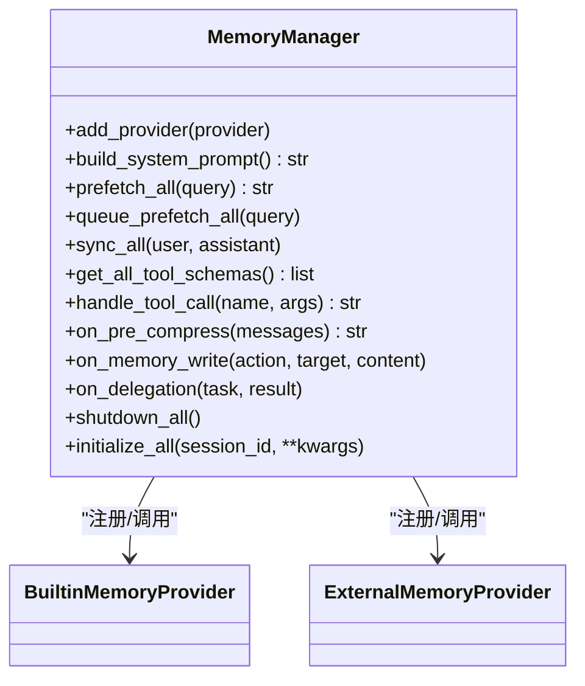
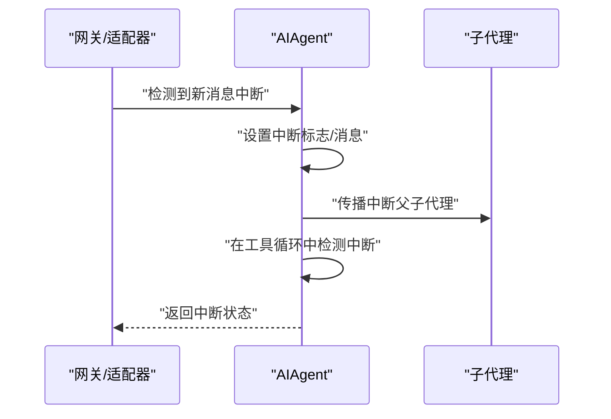
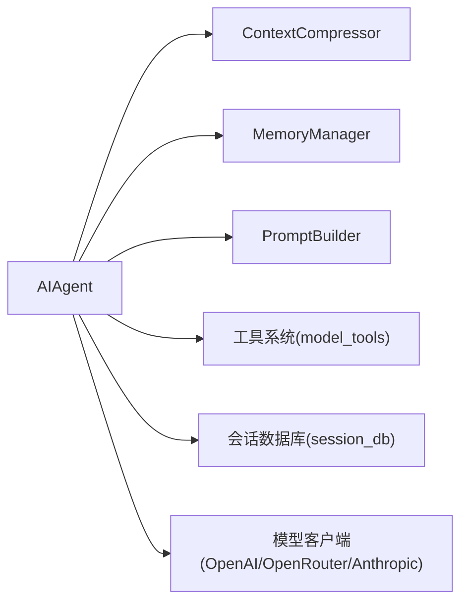

# 代理引擎

<cite>
**本文引用的文件**
- [run_agent.py](file://run_agent.py)
- [agent/context_compressor.py](file://agent/context_compressor.py)
- [agent/memory_manager.py](file://agent/memory_manager.py)
- [agent/prompt_builder.py](file://agent/prompt_builder.py)
- [website/docs/developer-guide/agent-loop.md](file://website/docs/developer-guide/agent-loop.md)
- [website/docs/developer-guide/context-compression-and-caching.md](file://website/docs/developer-guide/context-compression-and-caching.md)
- [gateway/run.py](file://gateway/run.py)
- [tests/run_agent/test_real_interrupt_subagent.py](file://tests/run_agent/test_real_interrupt_subagent.py)
- [tests/run_agent/test_long_context_tier_429.py](file://tests/run_agent/test_long_context_tier_429.py)
</cite>

## 目录
1. [引言](#引言)
2. [项目结构](#项目结构)
3. [核心组件](#核心组件)
4. [架构总览](#架构总览)
5. [详细组件分析](#详细组件分析)
6. [依赖关系分析](#依赖关系分析)
7. [性能考量](#性能考量)
8. [故障排除指南](#故障排除指南)
9. [结论](#结论)
10. [附录](#附录)

## 引言
本文件面向Hermes Agent的代理引擎，系统性阐述AIAgent类的设计与实现，覆盖对话循环管理、工具调用循环、迭代预算控制、上下文压缩、内存上下文构建、状态与中断机制、错误处理策略，并提供可定位到源码路径的示例说明，帮助开发者快速理解并高效使用代理引擎。

## 项目结构
- 代理主类AIAgent位于run_agent.py，负责对话循环、工具调度、上下文压缩、预算与回退、会话持久化等核心逻辑。
- 上下文压缩由agent/context_compressor.py提供，支持按阈值压缩、尾部保护、结构化摘要与迭代更新。
- 内存管理由agent/memory_manager.py统一编排内置与外部插件记忆提供者，负责系统提示拼装、预取、同步与工具路由。
- 提示词构建由agent/prompt_builder.py完成，涵盖技能索引、平台提示、订阅能力注入、上下文文件扫描与安全过滤。
- 文档网站提供“代理循环内部原理”和“上下文压缩与缓存”的权威说明，便于理解行为边界与配置要点。

图示来源
- [run_agent.py](file://run_agent.py)
- [agent/context_compressor.py](file://agent/context_compressor.py)
- [agent/memory_manager.py](file://agent/memory_manager.py)
- [agent/prompt_builder.py](file://agent/prompt_builder.py)

章节来源
- [run_agent.py](file://run_agent.py)
- [website/docs/developer-guide/agent-loop.md](file://website/docs/developer-guide/agent-loop.md)

## 核心组件
- AIAgent：代理主类，负责初始化、对话循环、工具调用、上下文压缩、预算控制、回退链、会话持久化、状态与中断、轨迹保存等。
- ContextCompressor：自动上下文压缩器，基于阈值与尾部保护策略生成结构化摘要，迭代更新以减少上下文膨胀。
- MemoryManager：统一编排内置与外部记忆提供者，负责系统提示拼装、预取、同步、工具路由与生命周期钩子。
- PromptBuilder：系统提示组装器，负责技能索引、平台提示、订阅能力、上下文文件注入与安全扫描。

章节来源
- [run_agent.py](file://run_agent.py)
- [agent/context_compressor.py](file://agent/context_compressor.py)
- [agent/memory_manager.py](file://agent/memory_manager.py)
- [agent/prompt_builder.py](file://agent/prompt_builder.py)

## 架构总览
AIAgent在运行时通过统一客户端适配不同提供商（OpenAI、OpenRouter、Anthropic等），在每次对话轮次中：
- 组装系统提示（含记忆、技能、平台提示、订阅能力、上下文文件）。
- 评估当前上下文是否接近阈值，必要时触发压缩。
- 发起模型调用，解析响应中的工具调用请求。
- 并发或顺序执行工具，将结果回写消息列表。
- 更新预算、令牌统计、成本估算与状态回调。
- 在退出路径进行会话持久化与轨迹保存。

图示来源
- [run_agent.py](file://run_agent.py)
- [website/docs/developer-guide/agent-loop.md](file://website/docs/developer-guide/agent-loop.md)

## 详细组件分析

### AIAgent类设计与对话循环
- 初始化与客户端适配
  - 自动识别API模式（chat_completions、codex_responses、anthropic_messages），并根据提供商设置默认头部与认证。
  - 支持OpenRouter、Copilot ACP、自定义提供商与本地端点，具备回退链与切换模型能力。
  - 预热模型元数据缓存，避免首次调用阻塞。
- 对话循环与工具调用
  - 将用户消息加入历史，构建系统提示与上下文（含记忆、技能、平台提示、订阅能力、上下文文件）。
  - 模型调用后解析工具调用列表，按策略决定顺序或并发执行。
  - 工具执行前触发进度回调；执行后将结果注入消息列表，支持大结果落盘与预览。
- 上下文压缩与预算
  - 压缩阈值与目标比例来自配置；采用尾部令牌预算保护，避免切分工具调用对结果组。
  - 迭代预算（IterationBudget）限制总轮次，支持父子代理共享与压力告警。
- 会话与持久化
  - 会话日志与SQLite数据库双通道持久化，避免重复写入；支持轨迹保存与清理。
- 回调与状态
  - 思维/推理/工具进度/步骤/状态等回调贯穿全链路，便于CLI与网关集成。
- 错误处理与调试
  - 统一API错误摘要与上下文提取，支持请求调试转储与安静输出包装。

章节来源
- [run_agent.py](file://run_agent.py)
- [website/docs/developer-guide/agent-loop.md](file://website/docs/developer-guide/agent-loop.md)

### 上下文压缩算法实现
- 压缩策略
  - 预压缩：清理旧工具结果占位，降低后续LLM摘要负担。
  - 头尾保护：保留系统提示与首交换，尾部按令牌预算保护最近消息。
  - 中段摘要：结构化模板生成摘要，支持迭代更新以保留跨压缩的历史信息。
  - 工具对齐：确保不切分工具调用-结果组，修复孤儿结果/缺失结果。
- 令牌估算与历史管理
  - 使用字符估算与API返回的令牌计数结合，动态计算阈值与节省量。
  - 压缩后重估令牌，更新最后提示/完成令牌计数，用于后续压力告警与阈值判断。
- 配置与行为
  - 阈值百分比、目标摘要比例、尾部保护数量、摘要模型覆盖等均可配置。
  - 支持静默模式与失败冷却时间，避免频繁摘要失败影响体验。

图示来源
- [agent/context_compressor.py](file://agent/context_compressor.py)

章节来源
- [agent/context_compressor.py](file://agent/context_compressor.py)
- [website/docs/developer-guide/context-compression-and-caching.md](file://website/docs/developer-guide/context-compression-and-caching.md)

### 内存上下文构建过程
- 记忆检索与技能注入
  - MemoryManager统一注册内置与外部记忆提供者，按需构建系统提示块与预取上下文。
  - 技能索引由PromptBuilder生成，包含分类描述与条件过滤，注入到系统提示中。
- 工具定义整合
  - 将外部记忆提供者的工具Schema合并到工具集合，保证工具调用面一致。
- 生命周期钩子
  - 预压缩、每轮开始、会话结束、委托完成、写入事件等钩子贯穿上下文构建与工具调用前后。

图示来源
- [agent/memory_manager.py](file://agent/memory_manager.py)

章节来源
- [agent/memory_manager.py](file://agent/memory_manager.py)
- [agent/prompt_builder.py](file://agent/prompt_builder.py)

### 状态管理、中断机制与错误处理
- 状态管理
  - 会话级令牌计数、API调用次数、缓存读写令牌、推理令牌、成本估算与来源标记。
  - 活动追踪（最后活动时间与描述）用于超时通知与“仍在工作”提示。
- 中断机制
  - 全局中断标志与消息，支持父-子代理传播；在工具调用循环中检测并跳过剩余调用，快速终止长耗时操作。
  - 网关层通过适配器轮询检测新消息并触发中断。
- 错误处理
  - API错误摘要与上下文提取，支持Cloudflare HTML错误页清洗与重试时间推断。
  - 请求调试转储（JSON）便于定位4xx问题；安静输出包装避免管道异常导致崩溃。

图示来源
- [gateway/run.py](file://gateway/run.py)
- [run_agent.py](file://run_agent.py)
- [tests/run_agent/test_real_interrupt_subagent.py](file://tests/run_agent/test_real_interrupt_subagent.py)

章节来源
- [run_agent.py](file://run_agent.py)
- [gateway/run.py](file://gateway/run.py)
- [tests/run_agent/test_real_interrupt_subagent.py](file://tests/run_agent/test_real_interrupt_subagent.py)

### 迭代预算控制策略
- 预算对象
  - IterationBudget线程安全计数器，支持消费与退款（如execute_code回退）。
- 压力告警
  - 分阶段阈值（70%/90%）向工具结果注入预算压力提示，避免无限循环。
- 父子共享
  - 父代理创建预算，子代理独立但共享上限，确保整体不会越界。

章节来源
- [run_agent.py](file://run_agent.py)
- [website/docs/developer-guide/agent-loop.md](file://website/docs/developer-guide/agent-loop.md)

### 代理初始化、对话执行与工具调用流程（代码路径）
- 代理初始化
  - 客户端选择与认证、API模式识别、提示缓存与回退链配置、工具加载与要求检查、会话日志与数据库初始化、内存与记忆提供者装配、上下文压缩器初始化。
  - 参考路径：[run_agent.py](file://run_agent.py)
- 对话执行
  - 用户消息入队、系统提示构建、上下文压缩评估、模型调用、工具调用解析、并发/顺序执行、结果注入、预算与令牌更新、会话持久化与轨迹保存。
  - 参考路径：[run_agent.py](file://run_agent.py)
- 工具调用
  - 工具批处理并行策略、路径隔离、交互式工具串行、大结果落盘与预览、工具错误包装与JSON解析。
  - 参考路径：[run_agent.py](file://run_agent.py)

章节来源
- [run_agent.py](file://run_agent.py)

## 依赖关系分析
- 组件耦合
  - AIAgent对ContextCompressor、MemoryManager、PromptBuilder存在强依赖；对工具系统与会话数据库存在弱耦合。
- 外部依赖
  - OpenAI/OpenRouter/Anthropic等提供商客户端；SQLite会话存储；工具后端（终端、浏览器、文件、网络等）。
- 循环依赖
  - 未发现直接循环导入；工具Schema与提供者路由通过集中模块解耦。

图示来源
- [run_agent.py](file://run_agent.py)
- [agent/context_compressor.py](file://agent/context_compressor.py)
- [agent/memory_manager.py](file://agent/memory_manager.py)
- [agent/prompt_builder.py](file://agent/prompt_builder.py)

章节来源
- [run_agent.py](file://run_agent.py)

## 性能考量
- 上下文压缩
  - 合理设置阈值与目标比例，避免过度压缩导致信息丢失；尾部保护应结合实际对话长度调整。
  - 预压缩清理旧工具结果可显著降低摘要成本。
- 工具执行
  - 并发执行仅限安全工具与路径隔离；对交互式工具（如clarify）强制串行，避免竞态。
  - 大结果落盘与预览减少内联文本膨胀，提升吞吐。
- 模型选择与缓存
  - Prompt缓存（如Claude）可显著降低输入成本；合理选择推理配置以平衡延迟与质量。
- 资源清理
  - 任务完成后清理VM与浏览器资源，避免资源泄漏。

## 故障排除指南
- 上下文溢出与压缩失败
  - 若压缩失败进入冷却期，等待冷却时间后重试；检查摘要模型可用性与网络连通。
  - 参考：[agent/context_compressor.py](file://agent/context_compressor.py)
- 预算压力与无限循环
  - 关注工具结果中的预算警告；适当提高预算或优化任务分解。
  - 参考：[website/docs/developer-guide/agent-loop.md](file://website/docs/developer-guide/agent-loop.md)
- 中断无效或延迟
  - 确认网关层中断轮询与会话键一致；检查父子代理中断传播。
  - 参考：[gateway/run.py](file://gateway/run.py)、[tests/run_agent/test_real_interrupt_subagent.py](file://tests/run_agent/test_real_interrupt_subagent.py)
- API错误与重试
  - 使用请求调试转储定位4xx错误；根据错误上下文提取重试时间并等待。
  - 参考：[run_agent.py](file://run_agent.py)
- 长上下文降级
  - 当订阅/套餐导致上下文窗口降级时，压缩器阈值与探测逻辑会自动调整，避免硬性失败。
  - 参考：[tests/run_agent/test_long_context_tier_429.py](file://tests/run_agent/test_long_context_tier_429.py)

章节来源
- [agent/context_compressor.py](file://agent/context_compressor.py)
- [website/docs/developer-guide/agent-loop.md](file://website/docs/developer-guide/agent-loop.md)
- [gateway/run.py](file://gateway/run.py)
- [tests/run_agent/test_real_interrupt_subagent.py](file://tests/run_agent/test_real_interrupt_subagent.py)
- [tests/run_agent/test_long_context_tier_429.py](file://tests/run_agent/test_long_context_tier_429.py)

## 结论
AIAgent通过模块化设计将复杂对话与工具调用流程封装为清晰的控制流，配合上下文压缩、预算控制、中断传播与会话持久化，实现了高鲁棒性与可维护性的代理引擎。借助本文提供的架构图、流程图与代码路径指引，读者可以快速定位关键实现并进行定制与优化。

## 附录
- 相关文档
  - 代理循环内部原理：[website/docs/developer-guide/agent-loop.md](file://website/docs/developer-guide/agent-loop.md)
  - 上下文压缩与缓存：[website/docs/developer-guide/context-compression-and-caching.md](file://website/docs/developer-guide/context-compression-and-caching.md)