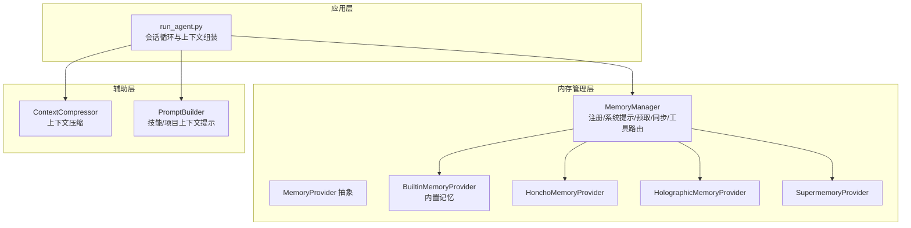
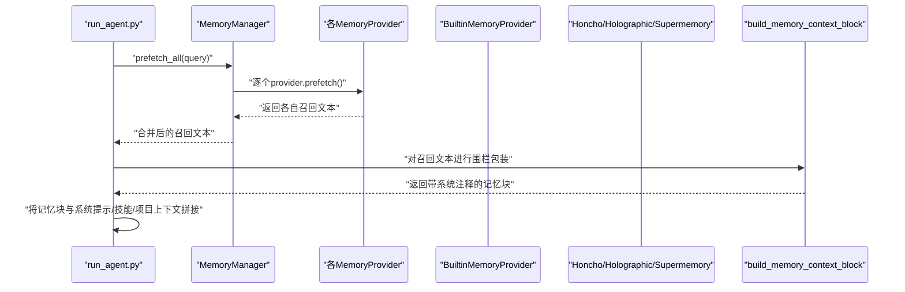
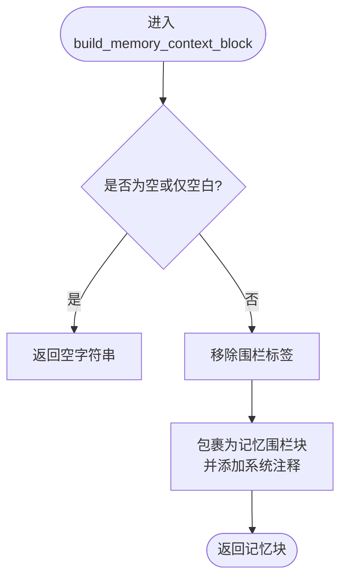
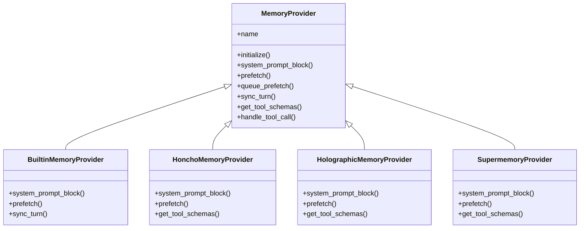
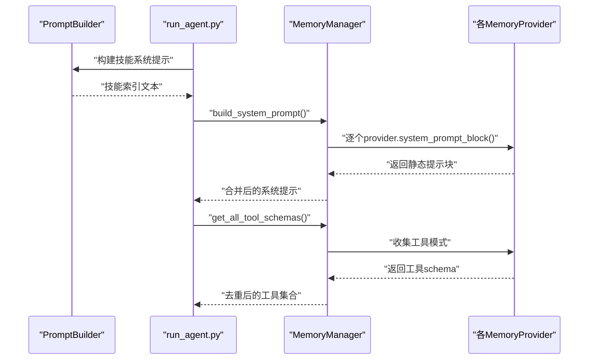
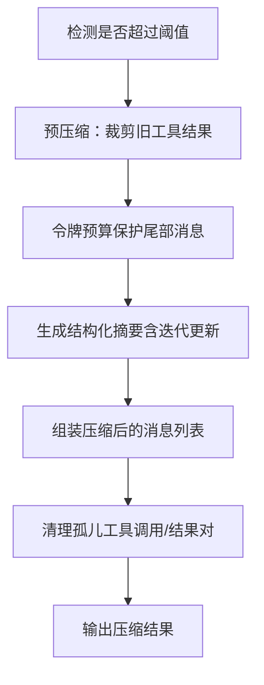
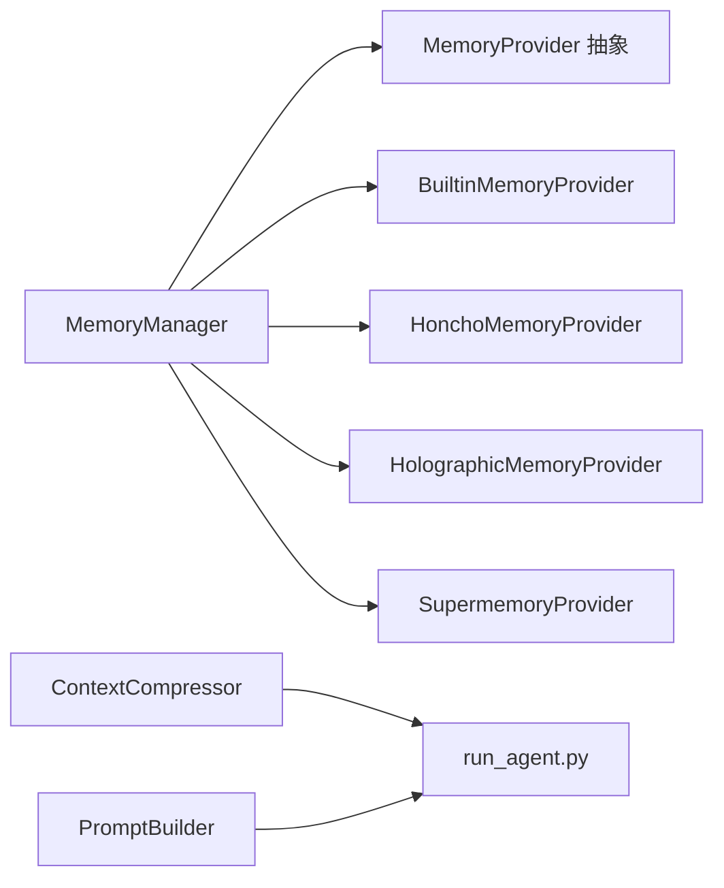

# 内存上下文构建

<cite>
**本文引用的文件**
- [agent/memory_manager.py](file://agent/memory_manager.py)
- [agent/builtin_memory_provider.py](file://agent/builtin_memory_provider.py)
- [agent/memory_provider.py](file://agent/memory_provider.py)
- [plugins/memory/holographic/__init__.py](file://plugins/memory/holographic/__init__.py)
- [plugins/memory/honcho/__init__.py](file://plugins/memory/honcho/__init__.py)
- [plugins/memory/supermemory/__init__.py](file://plugins/memory/supermemory/__init__.py)
- [agent/context_compressor.py](file://agent/context_compressor.py)
- [agent/prompt_builder.py](file://agent/prompt_builder.py)
- [run_agent.py](file://run_agent.py)
- [tests/agent/test_memory_provider.py](file://tests/agent/test_memory_provider.py)
</cite>

## 目录
1. [简介](#简介)
2. [项目结构](#项目结构)
3. [核心组件](#核心组件)
4. [架构总览](#架构总览)
5. [详细组件分析](#详细组件分析)
6. [依赖分析](#依赖分析)
7. [性能考量](#性能考量)
8. [故障排查指南](#故障排查指南)
9. [结论](#结论)
10. [附录](#附录)

## 简介
本文件聚焦于 Hermes Agent 的“内存上下文构建”机制，围绕 build_memory_context_block 函数的实现与调用链路，系统阐述以下主题：
- 记忆检索策略：内置记忆（短期/长期）与外部插件记忆（如 Honcho、Holographic、Supermemory）的召回与整合方式
- 技能注入过程：系统提示中技能索引的生成与缓存策略
- 工具定义整合：各记忆提供者暴露的工具模式与其路由机制
- 上下文层次结构：短期对话、长期记忆、技能知识、工具能力的组织与优先级
- 上下文构建优先级：时间相关性、重要性评分、相关性匹配的综合排序
- 动态上下文大小：令牌限制、压缩阈值、信息密度控制与性能优化
- 实战示例：不同记忆类型的构建路径与调用序列
- 最佳实践与调试技巧：内存管理、性能优化与问题定位

## 项目结构
Hermes Agent 将“内存上下文构建”拆分为多个层次：
- 提供者抽象层：MemoryProvider 定义统一接口，支持内置与外部插件提供者并行存在
- 管理器层：MemoryManager 负责注册、系统提示拼装、预取召回、工具路由与生命周期钩子
- 插件层：Honcho、Holographic、Supermemory 等提供者实现各自的检索与工具
- 压缩层：ContextCompressor 在接近上下文阈值时进行消息压缩与摘要保留
- 提示构建层：PromptBuilder 负责技能索引、项目上下文文件等系统提示内容的组装

图表来源
- [run_agent.py](file://run_agent.py)
- [agent/memory_manager.py](file://agent/memory_manager.py)
- [agent/memory_provider.py](file://agent/memory_provider.py)
- [agent/builtin_memory_provider.py](file://agent/builtin_memory_provider.py)
- [plugins/memory/honcho/__init__.py](file://plugins/memory/honcho/__init__.py)
- [plugins/memory/holographic/__init__.py](file://plugins/memory/holographic/__init__.py)
- [plugins/memory/supermemory/__init__.py](file://plugins/memory/supermemory/__init__.py)
- [agent/context_compressor.py](file://agent/context_compressor.py)
- [agent/prompt_builder.py](file://agent/prompt_builder.py)

章节来源
- [agent/memory_manager.py](file://agent/memory_manager.py)
- [agent/memory_provider.py](file://agent/memory_provider.py)
- [agent/builtin_memory_provider.py](file://agent/builtin_memory_provider.py)
- [plugins/memory/honcho/__init__.py](file://plugins/memory/honcho/__init__.py)
- [plugins/memory/holographic/__init__.py](file://plugins/memory/holographic/__init__.py)
- [plugins/memory/supermemory/__init__.py](file://plugins/memory/supermemory/__init__.py)
- [agent/context_compressor.py](file://agent/context_compressor.py)
- [agent/prompt_builder.py](file://agent/prompt_builder.py)
- [run_agent.py](file://run_agent.py)

## 核心组件
- MemoryManager：负责注册提供者、收集系统提示块、执行预取召回、同步回合、工具模式聚合与生命周期钩子
- MemoryProvider 抽象：定义 initialize、system_prompt_block、prefetch、queue_prefetch、sync_turn、get_tool_schemas、handle_tool_call 等接口
- BuiltinMemoryProvider：内置文件型记忆（MEMORY.md/USER.md），作为始终激活的第一提供者
- 外部提供者：Honcho、Holographic、Supermemory 等，按配置启用一个，提供检索与工具能力
- ContextCompressor：在接近模型上下文阈值时进行消息压缩与摘要保留
- PromptBuilder：构建系统提示中的技能索引与项目上下文文件

章节来源
- [agent/memory_manager.py](file://agent/memory_manager.py)
- [agent/memory_provider.py](file://agent/memory_provider.py)
- [agent/builtin_memory_provider.py](file://agent/builtin_memory_provider.py)
- [agent/context_compressor.py](file://agent/context_compressor.py)
- [agent/prompt_builder.py](file://agent/prompt_builder.py)

## 架构总览
build_memory_context_block 是“预取上下文”到“最终注入”的关键环节，其职责是：
- 对预取结果进行安全清洗（去除记忆围栏标签）
- 包裹为受控的“记忆围栏块”，明确标注“非用户输入”
- 仅在 API 调用前注入，不持久化

图表来源
- [agent/memory_manager.py](file://agent/memory_manager.py)
- [agent/builtin_memory_provider.py](file://agent/builtin_memory_provider.py)
- [plugins/memory/honcho/__init__.py](file://plugins/memory/honcho/__init__.py)
- [plugins/memory/holographic/__init__.py](file://plugins/memory/holographic/__init__.py)
- [plugins/memory/supermemory/__init__.py](file://plugins/memory/supermemory/__init__.py)
- [agent/memory_manager.py](file://agent/memory_manager.py)

## 详细组件分析

### build_memory_context_block 函数解析
- 输入：原始预取文本（可能来自内置或外部提供者）
- 清洗：移除潜在的围栏标签，防止模型误判
- 包裹：添加记忆围栏与系统注释，强调“非用户输入”
- 输出：可直接注入到 API 请求的消息列表中的文本块

图表来源
- [agent/memory_manager.py](file://agent/memory_manager.py)

章节来源
- [agent/memory_manager.py](file://agent/memory_manager.py)
- [tests/agent/test_memory_provider.py](file://tests/agent/test_memory_provider.py)

### 记忆检索策略与整合
- 内置记忆（短期/长期）：由 BuiltinMemoryProvider 提供静态系统提示块（MEMORY.md/USER.md），以及通过工具写入的长期记忆；它不参与 query-based 预取召回
- 外部提供者：
  - Honcho：支持“上下文注入模式”和“工具模式”，可按配置在每轮注入合成上下文或暴露 profile/search/context/conclude 工具
  - Holographic：结构化事实存储，支持实体解析、信任评分与组合查询
  - Supermemory：用户画像（持久）、近期上下文与相关记忆的去重与格式化输出
- 合并顺序：MemoryManager 按注册顺序依次调用 prefetch，再将结果合并；系统提示块同样按注册顺序拼接

图表来源
- [agent/memory_provider.py](file://agent/memory_provider.py)
- [agent/builtin_memory_provider.py](file://agent/builtin_memory_provider.py)
- [plugins/memory/honcho/__init__.py](file://plugins/memory/honcho/__init__.py)
- [plugins/memory/holographic/__init__.py](file://plugins/memory/holographic/__init__.py)
- [plugins/memory/supermemory/__init__.py](file://plugins/memory/supermemory/__init__.py)

章节来源
- [agent/builtin_memory_provider.py](file://agent/builtin_memory_provider.py)
- [plugins/memory/honcho/__init__.py](file://plugins/memory/honcho/__init__.py)
- [plugins/memory/holographic/__init__.py](file://plugins/memory/holographic/__init__.py)
- [plugins/memory/supermemory/__init__.py](file://plugins/memory/supermemory/__init__.py)
- [agent/memory_manager.py](file://agent/memory_manager.py)

### 技能注入过程与工具定义整合
- 技能索引：PromptBuilder 构建技能清单，支持缓存与快照，避免每次扫描文件系统
- 工具模式：MemoryManager 收集所有提供者的工具模式，去重后暴露给模型；工具调用由 MemoryManager 路由到对应提供者
- 冲突处理：当多个提供者声明同名工具时，记录冲突并忽略重复项

图表来源
- [agent/prompt_builder.py](file://agent/prompt_builder.py)
- [agent/memory_manager.py](file://agent/memory_manager.py)
- [agent/memory_provider.py](file://agent/memory_provider.py)

章节来源
- [agent/prompt_builder.py](file://agent/prompt_builder.py)
- [agent/memory_manager.py](file://agent/memory_manager.py)
- [agent/memory_provider.py](file://agent/memory_provider.py)

### 上下文层次结构与优先级
- 层次结构
  - 短期记忆：当前会话内的对话历史与工具调用结果（由 ContextCompressor 进行压缩与摘要）
  - 长期记忆：内置 MEMORY.md/USER.md 中的持久事实与用户画像
  - 技能记忆：系统提示中的技能索引与可用工具集合
  - 工具能力：各提供者暴露的工具模式（如 Honcho 的 profile/search/context/conclude）
- 优先级排序
  - 时间相关性：最近对话与近期上下文优先
  - 重要性评分：外部提供者（如 Holographic）使用信任评分与相似度过滤
  - 相关性匹配：query-based 预取与工具调用结果按相关性排序
  - 系统提示：内置记忆与技能索引固定注入，确保模型具备稳定的背景知识

章节来源
- [agent/context_compressor.py](file://agent/context_compressor.py)
- [agent/builtin_memory_provider.py](file://agent/builtin_memory_provider.py)
- [plugins/memory/holographic/__init__.py](file://plugins/memory/holographic/__init__.py)
- [plugins/memory/honcho/__init__.py](file://plugins/memory/honcho/__init__.py)
- [plugins/memory/supermemory/__init__.py](file://plugins/memory/supermemory/__init__.py)
- [agent/prompt_builder.py](file://agent/prompt_builder.py)

### 上下文大小动态调整与性能优化
- 令牌限制：根据模型上下文长度与阈值百分比计算触发压缩的令牌数
- 压缩策略：先裁剪旧工具结果，保护头尾消息，基于令牌预算保护尾部，中间段生成结构化摘要，并支持迭代更新
- 信息密度控制：通过摘要比例、最小摘要令牌数与上限控制摘要规模
- 性能优化：预压缩估算、工具调用结果占位符替换、摘要失败冷却、边界对齐避免切分工具组

图表来源
- [agent/context_compressor.py](file://agent/context_compressor.py)

章节来源
- [agent/context_compressor.py](file://agent/context_compressor.py)
- [run_agent.py](file://run_agent.py)

### 具体代码示例（路径引用）
- 内置记忆系统提示块构建：[agent/builtin_memory_provider.py](file://agent/builtin_memory_provider.py)
- 外部提供者工具模式定义（以 Honcho 为例）：[plugins/memory/honcho/__init__.py](file://plugins/memory/honcho/__init__.py)
- 外部提供者检索与格式化（以 Supermemory 为例）：[plugins/memory/supermemory/__init__.py](file://plugins/memory/supermemory/__init__.py)
- 记忆围栏包装与安全清洗：[agent/memory_manager.py](file://agent/memory_manager.py)
- 技能索引构建与缓存：[agent/prompt_builder.py](file://agent/prompt_builder.py)
- 上下文压缩主流程：[agent/context_compressor.py](file://agent/context_compressor.py)
- 会话循环中的上下文组装与压缩触发：[run_agent.py](file://run_agent.py)

章节来源
- [agent/builtin_memory_provider.py](file://agent/builtin_memory_provider.py)
- [plugins/memory/honcho/__init__.py](file://plugins/memory/honcho/__init__.py)
- [plugins/memory/supermemory/__init__.py](file://plugins/memory/supermemory/__init__.py)
- [agent/memory_manager.py](file://agent/memory_manager.py)
- [agent/prompt_builder.py](file://agent/prompt_builder.py)
- [agent/context_compressor.py](file://agent/context_compressor.py)
- [run_agent.py](file://run_agent.py)

## 依赖分析
- 组件耦合
  - MemoryManager 与 MemoryProvider 抽象解耦，支持多提供者并存
  - 外部提供者之间互斥（仅允许一个非内置提供者）
  - 工具模式去重与路由，避免重复与冲突
- 外部依赖
  - 模型元数据与令牌估算用于上下文压缩决策
  - 提供者配置（如 Honcho API Key、Holographic 数据库路径、Supermemory 搜索模式）影响检索质量与成本

图表来源
- [agent/memory_manager.py](file://agent/memory_manager.py)
- [agent/memory_provider.py](file://agent/memory_provider.py)
- [agent/builtin_memory_provider.py](file://agent/builtin_memory_provider.py)
- [plugins/memory/honcho/__init__.py](file://plugins/memory/honcho/__init__.py)
- [plugins/memory/holographic/__init__.py](file://plugins/memory/holographic/__init__.py)
- [plugins/memory/supermemory/__init__.py](file://plugins/memory/supermemory/__init__.py)
- [agent/context_compressor.py](file://agent/context_compressor.py)
- [agent/prompt_builder.py](file://agent/prompt_builder.py)
- [run_agent.py](file://run_agent.py)

章节来源
- [agent/memory_manager.py](file://agent/memory_manager.py)
- [agent/memory_provider.py](file://agent/memory_provider.py)
- [agent/context_compressor.py](file://agent/context_compressor.py)
- [agent/prompt_builder.py](file://agent/prompt_builder.py)
- [run_agent.py](file://run_agent.py)

## 性能考量
- 预取与后台队列：外部提供者可在 queue_prefetch 中异步准备下一轮召回，减少 API 调用延迟
- 工具结果裁剪：在压缩前先裁剪旧工具结果，显著降低令牌占用
- 摘要预算：按压缩内容规模动态分配摘要令牌，兼顾摘要质量与上下文窗口
- 边界保护：基于令牌预算而非固定消息数保护尾部，更贴合长上下文场景
- 失败冷却：摘要生成失败时进入冷却，避免反复尝试造成额外开销

## 故障排查指南
- 记忆围栏注入无效
  - 检查 build_memory_context_block 是否被调用且未返回空字符串
  - 确认预取文本中未包含记忆围栏标签，否则会被清洗
- 工具冲突与不可用
  - 查看 MemoryManager 的工具模式聚合日志，确认重复命名已被忽略
  - 确认提供者 is_available 返回正确状态
- 上下文溢出
  - 观察 ContextCompressor 的触发条件与压缩统计，必要时降低阈值或提升摘要比例
  - 检查是否存在大量冗余工具结果未被裁剪
- 外部提供者初始化失败
  - 查看 MemoryManager.initialize_all 的异常日志，确认配置路径与凭据有效

章节来源
- [agent/memory_manager.py](file://agent/memory_manager.py)
- [tests/agent/test_memory_provider.py](file://tests/agent/test_memory_provider.py)
- [agent/context_compressor.py](file://agent/context_compressor.py)

## 结论
Hermes Agent 的内存上下文构建通过“提供者抽象 + 管理器编排 + 压缩与提示构建”的分层设计，实现了：
- 可插拔的记忆提供者生态（内置 + 外部）
- 明确的上下文注入边界（围栏包装 + 安全清洗）
- 面向长上下文的压缩与摘要保留策略
- 技能与工具模式的统一索引与路由
在实际部署中，建议结合模型上下文长度、任务复杂度与外部提供者成本，合理配置预取频率、摘要比例与压缩阈值，以获得稳定且高效的上下文体验。

## 附录
- 最佳实践
  - 优先保存“用户偏好、环境细节、工具特性、稳定约定”等长效信息
  - 使用工具结果占位符与摘要保留关键决策与文件路径
  - 控制系统提示长度，避免超过模型上下文上限
- 调试技巧
  - 开启 MemoryManager 日志，观察提供者失败与回退路径
  - 使用 ContextCompressor 的统计输出定位压缩触发点
  - 在 run_agent 中打印最终消息长度与阈值，验证压缩效果