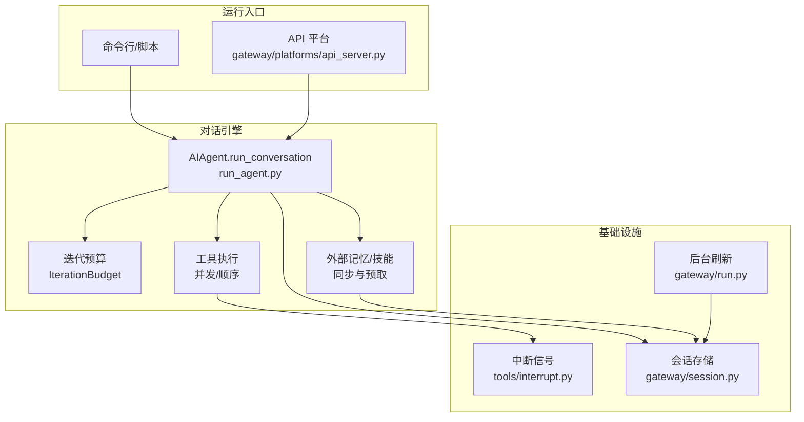
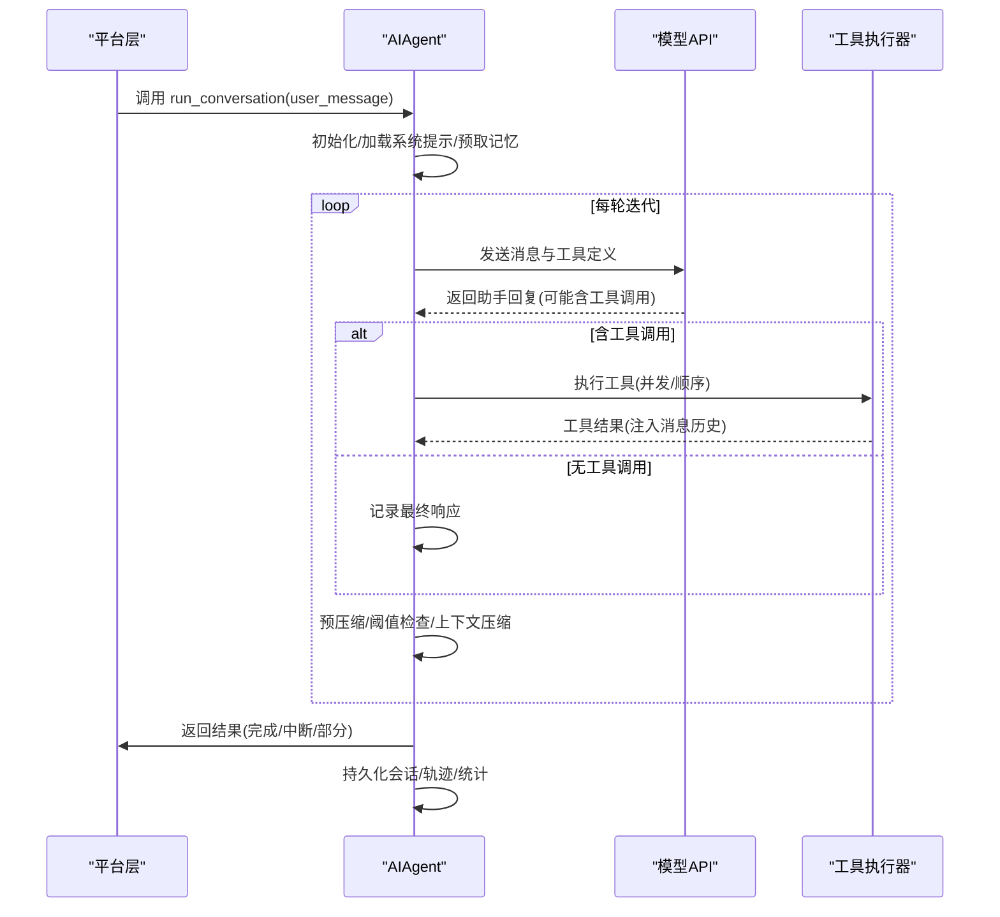
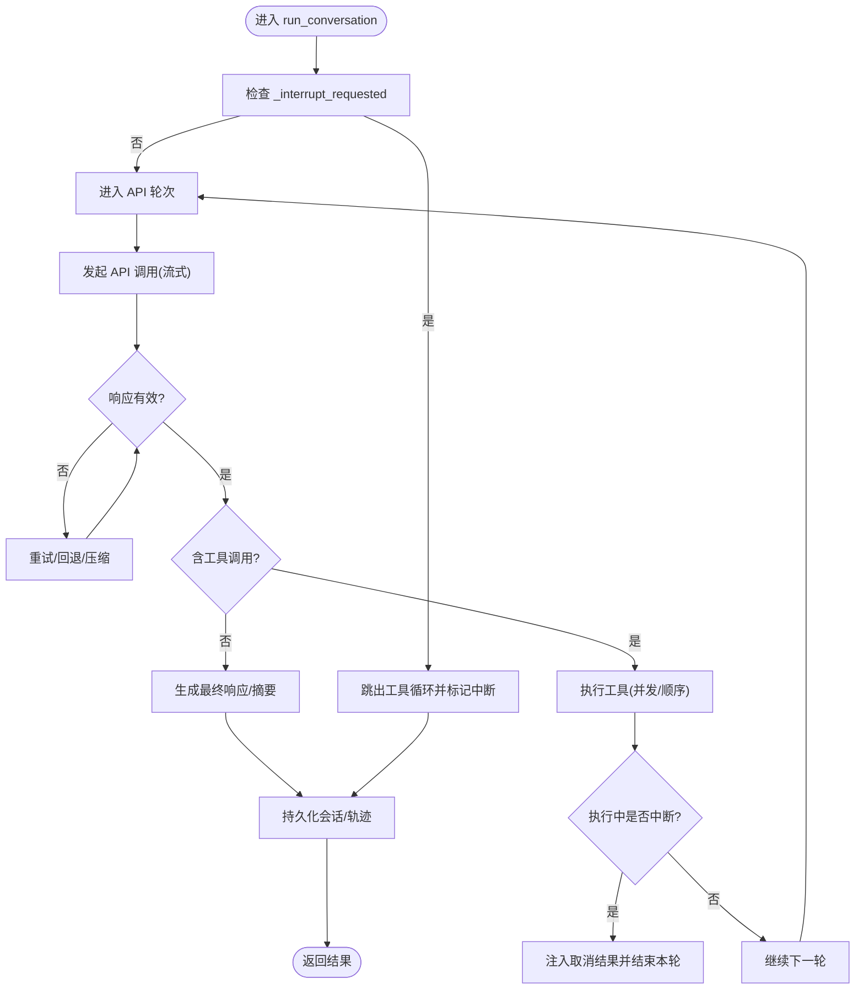
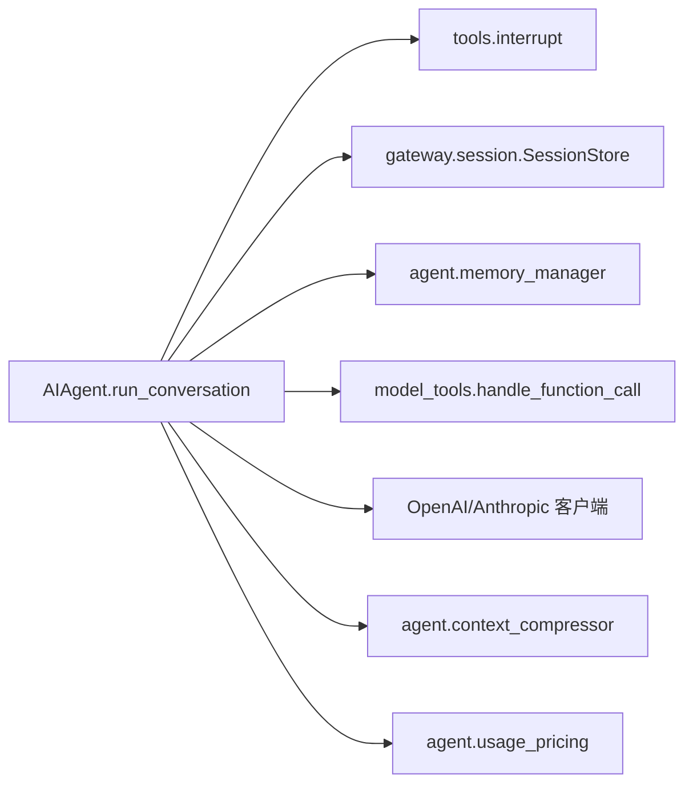

# 对话循环管理

<cite>
**本文引用的文件**
- [run_agent.py](file://run_agent.py)
- [api_server.py](file://gateway/platforms/api_server.py)
- [interrupt.py](file://tools/interrupt.py)
- [session.py](file://gateway/session.py)
- [run.py](file://gateway/run.py)
- [test_cron_inactivity_timeout.py](file://tests/cron/test_cron_inactivity_timeout.py)
- [test_interrupt.py](file://tests/tools/test_interrupt.py)
- [test_run_agent.py](file://tests/run_agent/test_run_agent.py)
</cite>

## 目录
1. [简介](#简介)
2. [项目结构](#项目结构)
3. [核心组件](#核心组件)
4. [架构总览](#架构总览)
5. [详细组件分析](#详细组件分析)
6. [依赖分析](#依赖分析)
7. [性能考虑](#性能考虑)
8. [故障排除指南](#故障排除指南)
9. [结论](#结论)

## 简介
本技术文档聚焦于 Hermes Agent 的对话循环管理，系统性解析 AIAgent.run_conversation 方法的实现机制，涵盖以下关键主题：
- 对话状态管理：消息历史维护、系统提示缓存、会话标识与持久化
- 迭代预算控制：全局迭代预算、每轮预算注入、接近上限的提醒与终止
- 生命周期流程：从初始化、多轮对话、工具调用、响应生成到完成或中断
- 中断机制：工具调用中断、用户中断、超时中断（含 Cron 超时）的处理策略
- 持久化与恢复：检查点保存、会话恢复、错误恢复与回滚
- 性能优化与调试：流式 API 调用、上下文压缩、令牌统计与成本估算
- 实战示例：启动、执行、中断、恢复的代码路径指引

## 项目结构
Hermes Agent 将对话循环集中于 run_agent.py 的 AIAgent 类中，并通过网关平台（如 API Server）触发运行。工具中断信号由 tools.interrupt 提供，会话存储由 gateway.session 管理，后台内存刷新由 gateway.run 协调。

图示来源
- [run_agent.py](file://run_agent.py)
- [api_server.py](file://gateway/platforms/api_server.py)
- [interrupt.py](file://tools/interrupt.py)
- [session.py](file://gateway/session.py)
- [run.py](file://gateway/run.py)

章节来源
- [run_agent.py](file://run_agent.py)
- [api_server.py](file://gateway/platforms/api_server.py)

## 核心组件
- AIAgent.run_conversation：主对话循环，负责消息构建、API 调用、工具执行、上下文压缩、预算控制与结果汇总
- IterationBudget：线程安全的迭代计数器，支持父子代理共享与退款
- 工具执行器：并发/顺序执行工具调用，支持检查点、超时与中断
- 中断系统：全局事件，用于在长耗时工具中快速响应用户请求
- 会话与持久化：JSON 日志、SQLite 会话数据库、外部记忆提供者
- 上下文压缩：基于令牌估算的预压缩与运行时压缩，避免 413/上下文溢出
- 成本与令牌统计：使用规范化的用量数据进行成本估算与缓存命中统计

章节来源
- [run_agent.py](file://run_agent.py)
- [interrupt.py](file://tools/interrupt.py)

## 架构总览
对话循环从平台层（CLI 或 API Server）进入，构建 AIAgent 并调用 run_conversation。该方法以“每轮”为单位循环，每轮内先进行 API 调用获取助手回复，再根据回复中的工具调用执行相应工具，随后将工具结果注入消息历史并继续下一轮，直到满足完成条件（最终响应、达到最大迭代、预算耗尽、被中断或发生不可恢复错误）。

图示来源
- [run_agent.py](file://run_agent.py)
- [api_server.py](file://gateway/platforms/api_server.py)

## 详细组件分析

### AIAgent.run_conversation 实现机制
- 初始化与预处理
  - 清理旧中断状态、准备系统提示（可缓存）、预取外部记忆、注入插件上下文
  - 构建每轮 API 消息列表，剥离内部字段，注入 reasoning_content 以兼容特定提供商
- 主循环与迭代预算
  - 使用 while 循环，条件为“未达最大迭代且预算剩余”，每轮自增 api_call_count 并消费预算
  - 在每轮开始前触发 step_callback，向网关汇报当前进度
- API 调用与重试
  - 优先使用流式调用，具备健康检查与超时检测；失败时按错误类型分类处理（413/上下文溢出、400/通用错误、429/速率限制等）
  - 支持回退链（fallback_model/fallback_providers），在瞬时错误或无效响应时自动切换
- 响应处理与工具调用
  - 标准化响应内容，处理不完整/截断/推理预算耗尽等情况
  - 校验工具名称与参数 JSON，自动修复与错误注入，避免破坏消息角色交替
  - 并发/顺序执行工具调用，支持检查点（写文件/补丁/终端危险命令前快照）
- 结果与收尾
  - 达到最大迭代时请求摘要；记录最终响应、轨迹、令牌统计与成本估算
  - 持久化会话（JSON 日志 + SQLite），触发后置钩子（post_llm_call/on_session_end）

章节来源
- [run_agent.py](file://run_agent.py)

### 对话状态管理与消息历史
- 状态字段
  - _session_messages：会话日志缓冲
  - _persist_user_message_idx/_persist_user_message_override：确保持久化用户消息与实际显示一致
  - _cached_system_prompt：系统提示缓存（跨轮复用）
  - _last_activity_ts/_last_activity_desc/_current_tool/_api_call_count：活动追踪，用于超时与状态回调
- 消息历史维护
  - 每轮构建 api_messages，剥离内部字段（reasoning/finish_reason/_thinking_prefill）
  - 注入插件与外部记忆上下文到本轮用户消息，不污染系统提示缓存
  - 工具结果以 role=tool 的消息追加，保持消息角色交替

章节来源
- [run_agent.py](file://run_agent.py)

### 迭代预算控制
- 全局预算
  - AIAgent 持有 IterationBudget，父代理与子代理各自独立预算，支持 refund（execute_code 等程序化调用）
  - 预算压力注入：当接近阈值（70%/90%）时，向最后一段工具结果注入“预算警告”，促使模型尽快收敛
- 每轮预算
  - 每轮开始 consume()，若耗尽则提前结束并请求摘要
  - 最大迭代 max_iterations 默认 90（可通过配置覆盖）

章节来源
- [run_agent.py](file://run_agent.py)

### 对话循环生命周期
- 初始化阶段
  - 解析模型与客户端、加载工具集、建立会话日志目录、创建会话 ID
  - 可选启用提示缓存、轨迹保存、检查点管理
- 多轮对话阶段
  - 预压缩（预估令牌超过阈值时多次压缩）
  - 插件 pre_llm_call 注入上下文
  - API 调用与重试、响应标准化、工具调用校验与执行
  - 上下文压缩（413/上下文溢出时的分段摘要）
- 完成/中断阶段
  - 生成最终响应或摘要；记录完成状态与中断信息
  - 持久化会话与轨迹；触发后置钩子

章节来源
- [run_agent.py](file://run_agent.py)

### 中断机制实现
- 工具调用中断
  - 并发执行路径：在提交任务前检查 _interrupt_requested，若已中断则跳过剩余工具并注入“取消”结果
  - 顺序执行路径：在每次工具开始前检查中断，若已中断则跳过剩余工具并注入“取消”结果
- 用户中断
  - run_conversation 每轮开始检查 _interrupt_requested，若中断则跳出工具循环并返回中断结果
  - 流式等待期间（重试等待、API 调用）也周期性检查中断
- 超时中断（Cron 超时）
  - 通过 gateway 的超时监控线程检测长时间无活动，触发中断并清理资源
  - 测试覆盖了慢速代理在空闲后被中断的场景

图示来源
- [run_agent.py](file://run_agent.py)
- [test_cron_inactivity_timeout.py](file://tests/cron/test_cron_inactivity_timeout.py)

章节来源
- [run_agent.py](file://run_agent.py)
- [interrupt.py](file://tools/interrupt.py)
- [test_cron_inactivity_timeout.py](file://tests/cron/test_cron_inactivity_timeout.py)
- [test_interrupt.py](file://tests/tools/test_interrupt.py)

### 对话状态的持久化与恢复
- 持久化
  - JSON 日志：_session_messages 与 _save_session_log 写入会话日志文件
  - SQLite 会话库：_session_db.update_token_counts 与 create_session 更新计费与用量
  - 轨迹保存：_save_trajectory 将完整消息历史保存为轨迹文件
- 恢复与错误恢复
  - 会话恢复：平台层可基于 session_id 加载历史消息并继续对话
  - 错误恢复：针对 413/上下文溢出，采用压缩与回滚策略；对于无效响应与速率限制，采用回退与指数退避
  - 检查点：对写文件/补丁/危险终端命令执行前创建快照，便于中断后恢复

章节来源
- [run_agent.py](file://run_agent.py)
- [session.py](file://gateway/session.py)
- [run.py](file://gateway/run.py)

### 代码示例（路径指引）
- 启动对话循环（平台层）
  - API Server 触发：[api_server.py](file://gateway/platforms/api_server.py)
  - CLI 触发：[run_agent.py](file://run_agent.py)
- 执行工具调用（并发/顺序）
  - 并发执行：[run_agent.py](file://run_agent.py)
  - 顺序执行：[run_agent.py](file://run_agent.py)
- 中断处理（工具/用户/Cron）
  - 工具中断：[run_agent.py](file://run_agent.py)
  - 用户中断：[run_agent.py](file://run_agent.py)
  - Cron 超时：[test_cron_inactivity_timeout.py](file://tests/cron/test_cron_inactivity_timeout.py)
- 持久化与恢复
  - 会话持久化：[run_agent.py](file://run_agent.py)
  - 会话存储接口：[session.py](file://gateway/session.py)
  - 后台刷新：[run.py](file://gateway/run.py)

章节来源
- [api_server.py](file://gateway/platforms/api_server.py)
- [run_agent.py](file://run_agent.py)
- [test_cron_inactivity_timeout.py](file://tests/cron/test_cron_inactivity_timeout.py)
- [session.py](file://gateway/session.py)
- [run.py](file://gateway/run.py)

## 依赖分析
- 组件耦合
  - AIAgent 与 tools.interrupt 强耦合：全局中断事件贯穿工具执行与 API 调用等待
  - AIAgent 与 gateway.session：会话创建、更新与持久化
  - AIAgent 与 agent.memory_manager：外部记忆预取、同步与后台审查
- 外部依赖
  - OpenAI/Anthropic 客户端、上下文压缩器、令牌估算器、成本估算器
  - 工具注册表与工具执行器

图示来源
- [run_agent.py](file://run_agent.py)
- [interrupt.py](file://tools/interrupt.py)
- [session.py](file://gateway/session.py)

章节来源
- [run_agent.py](file://run_agent.py)

## 性能考虑
- 流式 API 调用：优先使用流式接口，具备健康检查与超时检测，避免挂起
- 上下文压缩：预压缩与运行时压缩降低输入令牌，减少成本与延迟
- 并发工具执行：合理设置最大工作线程，避免过度并发导致资源争用
- 预算压力注入：在接近上限时提示模型收敛，减少无效轮次
- 令牌与成本统计：规范化用量数据，结合缓存命中率优化成本

## 故障排除指南
- 常见错误与处理
  - 413 请求体过大：尝试压缩消息或分段发送，最多重试 3 次
  - 上下文溢出：动态下调上下文阈值并压缩中间轮次
  - 无效响应/空输出：立即回退到备用提供者或切换模型
  - 速率限制：尊重 Retry-After，指数退避并支持回退链
- 中断相关
  - 工具执行中断：并发/顺序路径均会注入“取消”结果，避免资源浪费
  - 用户中断：每轮开始与等待期间检查中断，及时退出
  - Cron 超时：后台线程检测空闲并触发中断，清理资源
- 调试技巧
  - 开启 verbose_logging 查看请求/响应详情
  - 使用 HERMES_DUMP_REQUESTS 导出请求快照
  - 利用 status_callback/step_callback 获取实时状态

章节来源
- [run_agent.py](file://run_agent.py)
- [test_cron_inactivity_timeout.py](file://tests/cron/test_cron_inactivity_timeout.py)
- [test_interrupt.py](file://tests/tools/test_interrupt.py)
- [test_run_agent.py](file://tests/run_agent/test_run_agent.py)

## 结论
AIAgent.run_conversation 通过严谨的状态管理、预算控制与中断机制，实现了稳定高效的多轮对话循环。配合上下文压缩、成本统计与检查点策略，系统在复杂任务与长会话场景下仍能保持可控的成本与性能。平台层（CLI/API）与工具层（并发/顺序执行）的解耦设计，使得扩展与集成更为灵活。