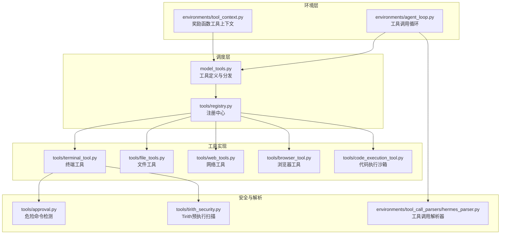
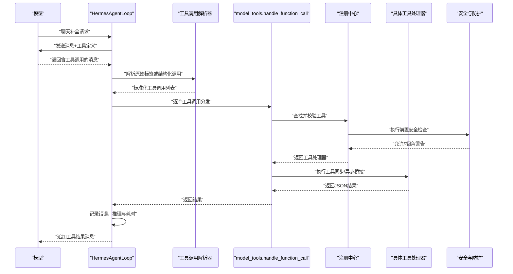
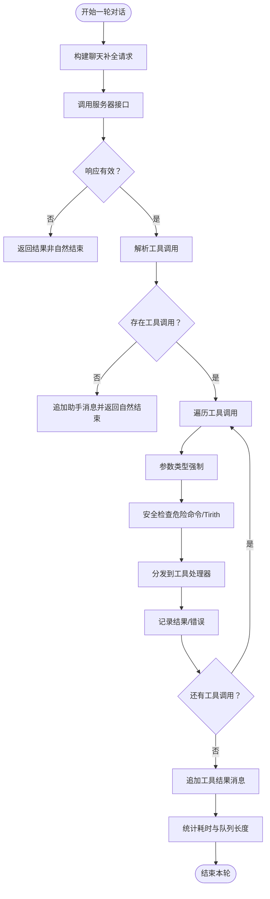
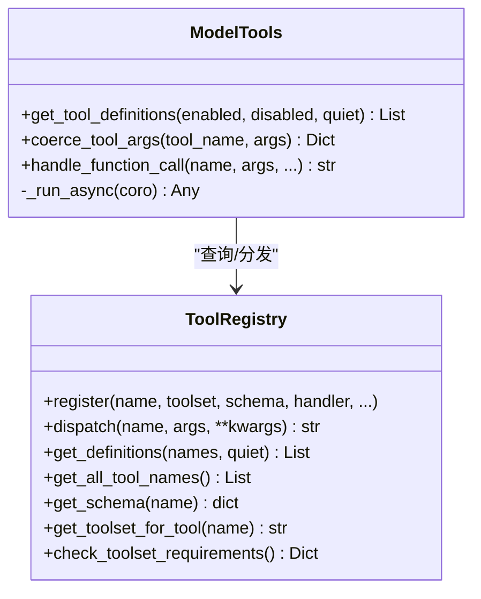
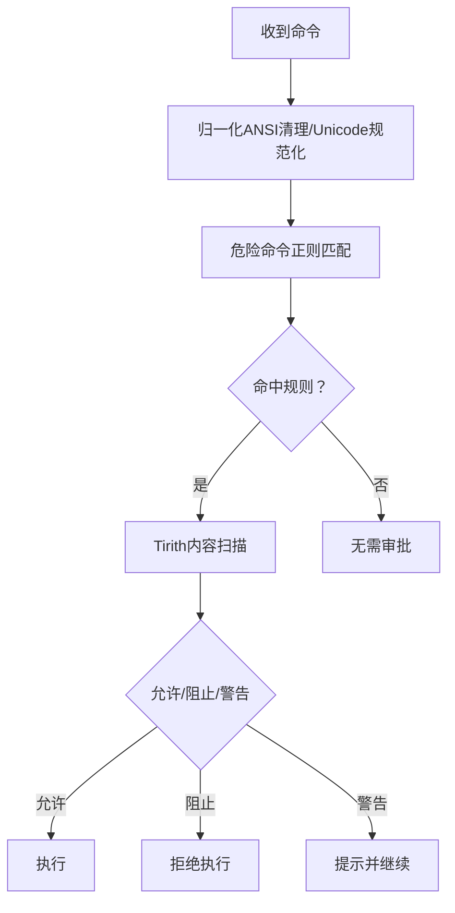
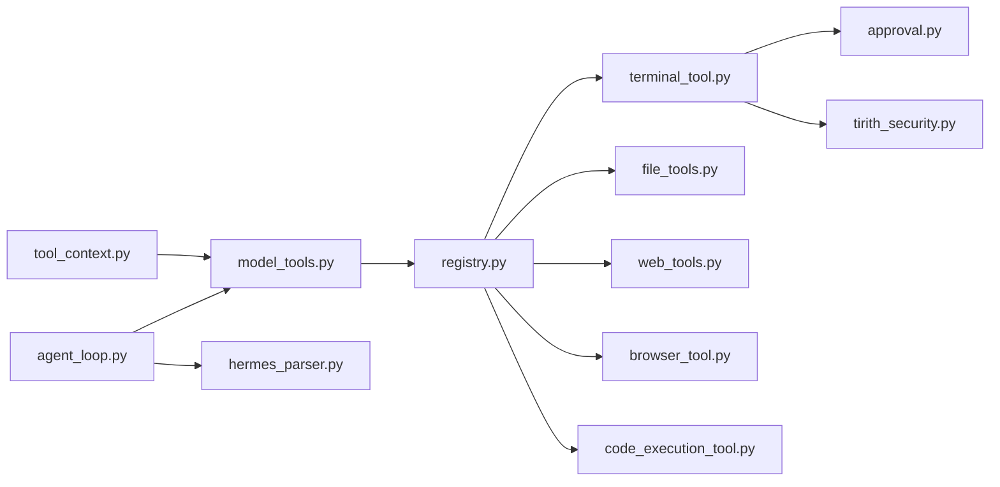

# 工具调用机制

<cite>
**本文档引用的文件**
- [agent_loop.py](file://environments/agent_loop.py)
- [model_tools.py](file://model_tools.py)
- [registry.py](file://tools/registry.py)
- [tool_context.py](file://environments/tool_context.py)
- [terminal_tool.py](file://tools/terminal_tool.py)
- [file_tools.py](file://tools/file_tools.py)
- [code_execution_tool.py](file://tools/code_execution_tool.py)
- [approval.py](file://tools/approval.py)
- [tirith_security.py](file://tools/tirith_security.py)
- [hermes_parser.py](file://environments/tool_call_parsers/hermes_parser.py)
- [web_tools.py](file://tools/web_tools.py)
- [browser_tool.py](file://tools/browser_tool.py)
</cite>

## 目录
1. [简介](#简介)
2. [项目结构](#项目结构)
3. [核心组件](#核心组件)
4. [架构总览](#架构总览)
5. [详细组件分析](#详细组件分析)
6. [依赖关系分析](#依赖关系分析)
7. [性能考虑](#性能考虑)
8. [故障排查指南](#故障排查指南)
9. [结论](#结论)
10. [附录](#附录)

## 简介
本文件系统化阐述 Hermes Agent 的工具调用机制，覆盖从工具发现、参数解析、并发执行到结果处理的完整闭环；详述安全机制（破坏性命令检测、路径安全验证、资源限制）；解释并发控制策略（并行安全工具识别、路径作用域隔离、线程池管理）；分析错误处理与重试机制（超时处理、失败回退、状态恢复）；并提供工具开发指南、性能优化建议与安全最佳实践。

## 项目结构
围绕工具调用的关键模块分布如下：
- 环境层：环境循环与上下文，负责工具调用循环、并发执行与结果收集
- 调度层：模型工具调度器，统一工具注册、发现与分发
- 注册中心：集中式工具注册表，提供查询、校验与分发
- 工具实现：各类具体工具（终端、文件、浏览器、网络等）
- 安全与解析：危险命令检测、路径安全、内容解析器

**图表来源**
- [agent_loop.py:117-512](file://environments/agent_loop.py#L117-L512)
- [model_tools.py:132-578](file://model_tools.py#L132-L578)
- [registry.py:45-321](file://tools/registry.py#L45-L321)
- [terminal_tool.py:137-200](file://tools/terminal_tool.py#L137-L200)
- [file_tools.py:1-200](file://tools/file_tools.py#L1-L200)
- [web_tools.py:1-200](file://tools/web_tools.py#L1-L200)
- [browser_tool.py:1-200](file://tools/browser_tool.py#L1-L200)
- [code_execution_tool.py:1-200](file://tools/code_execution_tool.py#L1-L200)
- [approval.py:1-200](file://tools/approval.py#L1-L200)
- [tirith_security.py:1-200](file://tools/tirith_security.py#L1-L200)
- [hermes_parser.py:1-74](file://environments/tool_call_parsers/hermes_parser.py#L1-L74)

**章节来源**
- [agent_loop.py:117-512](file://environments/agent_loop.py#L117-L512)
- [model_tools.py:132-578](file://model_tools.py#L132-L578)
- [registry.py:45-321](file://tools/registry.py#L45-L321)

## 核心组件
- 工具调用循环（HermesAgentLoop）
  - 负责构建请求、接收响应、解析工具调用、执行工具、记录错误与推理内容
  - 支持结构化 tool_calls 与原始内容中的工具标签解析
  - 使用线程池执行可能阻塞或内部使用事件循环的工具
- 模型工具调度器（model_tools）
  - 工具发现：导入各工具模块触发注册
  - 参数类型强制：将字符串参数按 JSON Schema 强制转换为期望类型
  - 分发：通过注册中心分发到具体工具处理器
  - 同步/异步桥接：保证缓存客户端生命周期稳定
- 注册中心（registry）
  - 统一管理工具元数据、Schema、可用性检查与分发
  - 提供工具集映射、可用性查询与工具集要求检查
- 工具上下文（ToolContext）
  - 奖励/验证函数在相同任务上下文中直接访问所有工具
  - 通过线程池确保后端不与宿主事件循环冲突

**章节来源**
- [agent_loop.py:167-500](file://environments/agent_loop.py#L167-L500)
- [model_tools.py:459-549](file://model_tools.py#L459-L549)
- [registry.py:144-162](file://tools/registry.py#L144-L162)
- [tool_context.py:67-475](file://environments/tool_context.py#L67-L475)

## 架构总览
下图展示了从模型生成到工具执行与结果返回的完整链路，以及安全与解析环节的嵌入点。

**图表来源**
- [agent_loop.py:254-458](file://environments/agent_loop.py#L254-L458)
- [hermes_parser.py:35-73](file://environments/tool_call_parsers/hermes_parser.py#L35-L73)
- [model_tools.py:459-549](file://model_tools.py#L459-L549)
- [registry.py:144-162](file://tools/registry.py#L144-L162)
- [approval.py:154-166](file://tools/approval.py#L154-L166)
- [tirith_security.py:68-88](file://tools/tirith_security.py#L68-L88)

## 详细组件分析

### 工具调用循环（HermesAgentLoop）
- 工具发现与过滤
  - 仅向模型暴露经可用性检查与工具集过滤后的工具定义
  - 动态调整 execute_code 与 browser_navigate 的描述，避免模型误调用不可用工具
- 参数解析与类型强制
  - 将 JSON 字符串参数按 Schema 强制转换为整数/布尔等类型
  - 非读取类工具调用会通知文件工具重置连续读计数
- 并发执行
  - 对终端、Docker、Modal、Daytona 等后端，使用独立线程池执行，避免事件循环死锁
  - 线程池大小可运行时调整，防止饥饿与长时间排队
- 结果处理与错误记录
  - 记录每个工具调用的错误、参数与结果
  - 解析工具返回的 JSON 错误与退出码，纳入工具错误列表
  - 记录每轮 API 调用耗时与工具执行耗时，便于诊断

**图表来源**
- [agent_loop.py:196-490](file://environments/agent_loop.py#L196-L490)
- [model_tools.py:372-457](file://model_tools.py#L372-L457)
- [approval.py:154-166](file://tools/approval.py#L154-L166)
- [tirith_security.py:68-88](file://tools/tirith_security.py#L68-L88)

**章节来源**
- [agent_loop.py:167-500](file://environments/agent_loop.py#L167-L500)
- [model_tools.py:372-457](file://model_tools.py#L372-L457)

### 模型工具调度器（model_tools）
- 工具发现
  - 导入工具模块触发注册，支持 MCP 与插件动态发现
- 参数类型强制
  - 针对字符串数字、布尔进行安全转换，保留原值作为兜底
- 分发与桥接
  - 同步/异步统一桥接到持久事件循环，避免“事件循环已关闭”问题
  - 执行前/后钩子（插件）用于审计与扩展
- 兼容性与工具集
  - 提供工具集映射、可用性检查与历史工具集兼容

**图表来源**
- [registry.py:45-321](file://tools/registry.py#L45-L321)
- [model_tools.py:132-578](file://model_tools.py#L132-L578)

**章节来源**
- [model_tools.py:132-578](file://model_tools.py#L132-L578)
- [registry.py:111-162](file://tools/registry.py#L111-L162)

### 注册中心（registry）
- 工具元数据存储与查询
  - 工具名称、Schema、处理器、可用性检查函数、环境变量需求
- 工具集管理
  - 工具集可用性检查、工具集要求、工具到工具集映射
- 分发策略
  - 异步工具自动桥接至持久事件循环，异常统一包装为 JSON 错误

**章节来源**
- [registry.py:45-321](file://tools/registry.py#L45-L321)

### 工具上下文（ToolContext）
- 为奖励/验证函数提供与模型相同的任务上下文
- 通过线程池执行工具，避免后端内部事件循环冲突
- 提供终端、文件、搜索、网页、浏览器等便捷方法

**章节来源**
- [tool_context.py:67-475](file://environments/tool_context.py#L67-L475)

### 安全机制与路径验证
- 危险命令检测
  - 正则模式集合覆盖删除、权限修改、服务控制、远程管道执行等高危行为
  - 归一化处理（ANSI 清理、Unicode 规范化）降低绕过风险
  - 会话级审批队列与永久白名单
- Tirith 预执行扫描
  - 内容级威胁检测（同形 URL、管道到解释器、终端注入等）
  - 可配置启用/超时/失败开/关策略，自动下载与校验
- 路径安全验证
  - 终端工作目录字符白名单，拒绝潜在 shell 元字符
  - 文件写入敏感路径前缀检查与拒绝
  - 设备路径黑名单（/dev/stdin、/proc/self/fd/0 等）

**图表来源**
- [approval.py:154-166](file://tools/approval.py#L154-L166)
- [tirith_security.py:68-88](file://tools/tirith_security.py#L68-L88)
- [terminal_tool.py:157-177](file://tools/terminal_tool.py#L157-L177)
- [file_tools.py:98-116](file://tools/file_tools.py#L98-L116)

**章节来源**
- [approval.py:68-166](file://tools/approval.py#L68-L166)
- [tirith_security.py:68-88](file://tools/tirith_security.py#L68-L88)
- [terminal_tool.py:151-177](file://tools/terminal_tool.py#L151-L177)
- [file_tools.py:98-116](file://tools/file_tools.py#L98-L116)

### 并发控制策略
- 并行安全工具识别
  - 对终端、Docker、Modal、Daytona 等后端，统一通过线程池执行，避免事件循环死锁
- 路径作用域工具隔离
  - 通过 task_id 实现终端/浏览器/进程等资源隔离，避免跨回合污染
- 线程池管理
  - 运行时可调整线程池大小，兼顾吞吐与资源占用
  - 工具执行耗时超过阈值会记录队列长度，辅助定位瓶颈

**章节来源**
- [agent_loop.py:34-46](file://environments/agent_loop.py#L34-L46)
- [agent_loop.py:395-408](file://environments/agent_loop.py#L395-L408)
- [tool_context.py:40-42](file://environments/tool_context.py#L40-L42)

### 错误处理与重试机制
- 超时处理
  - 终端命令、浏览器操作、网络请求均设置超时；超时错误统一包装
- 失败回退
  - 工具返回 JSON 错误时，记录错误详情与退出码；循环中捕获异常并记录
- 状态恢复
  - 通过任务上下文清理终端 VM、浏览器会话与后台进程，避免资源泄漏

**章节来源**
- [agent_loop.py:418-447](file://environments/agent_loop.py#L418-L447)
- [tool_context.py:440-475](file://environments/tool_context.py#L440-L475)

### 工具开发指南
- 注册与元数据
  - 在工具模块中调用注册接口，声明 Schema、处理器、可用性检查与环境变量需求
- 返回格式
  - 统一返回 JSON 字符串；可使用注册中心提供的工具错误/结果辅助函数
- 异步支持
  - 若工具为异步，注册时标记 is_async，调度器会自动桥接至持久事件循环
- 安全与合规
  - 对高危命令与敏感路径进行拦截或审批；必要时集成 Tirith 扫描
- 性能与资源
  - 控制输出大小与工具调用次数；合理设置超时与重试策略

**章节来源**
- [registry.py:24-89](file://tools/registry.py#L24-L89)
- [registry.py:294-321](file://tools/registry.py#L294-L321)
- [model_tools.py:156-161](file://model_tools.py#L156-L161)

## 依赖关系分析
- 环境循环依赖模型工具调度器进行工具分发
- 模型工具调度器依赖注册中心进行查询与分发
- 工具实现依赖安全模块（危险命令检测、Tirith扫描）与工具后端（终端、文件、浏览器、网络）
- 工具上下文依赖模型工具调度器与工具后端

**图表来源**
- [agent_loop.py:23-27](file://environments/agent_loop.py#L23-L27)
- [model_tools.py:29-31](file://model_tools.py#L29-L31)
- [registry.py:144-162](file://tools/registry.py#L144-L162)
- [terminal_tool.py:139-142](file://tools/terminal_tool.py#L139-L142)
- [tirith_security.py:68-88](file://tools/tirith_security.py#L68-L88)
- [hermes_parser.py:21-28](file://environments/tool_call_parsers/hermes_parser.py#L21-L28)
- [tool_context.py:34-36](file://environments/tool_context.py#L34-L36)

**章节来源**
- [agent_loop.py:23-27](file://environments/agent_loop.py#L23-L27)
- [model_tools.py:29-31](file://model_tools.py#L29-L31)
- [registry.py:144-162](file://tools/registry.py#L144-L162)

## 性能考虑
- 线程池规模
  - 根据并发任务量调整工具线程池大小，避免饥饿与长时间排队
- 事件循环桥接
  - 使用持久事件循环避免频繁创建/销毁导致的客户端缓存失效与 GC 抖动
- 输出与调用限制
  - 限制单次文件读取字符数、工具调用次数与输出大小，降低上下文窗口压力
- 资源清理
  - 及时清理终端 VM、浏览器会话与后台进程，避免资源泄漏影响后续性能

[本节为通用指导，无需特定文件引用]

## 故障排查指南
- 工具未被模型调用
  - 检查工具是否通过可用性检查与工具集过滤；确认 Schema 中的交叉引用是否正确
- 工具参数类型错误
  - 检查参数是否为字符串且需强制转换；确认 JSON Schema 类型定义
- 工具执行失败
  - 查看工具返回的 JSON 错误与退出码；关注循环中的工具错误记录
- 危险命令被阻断
  - 检查危险命令正则与 Tirith 扫描结果；必要时在受控场景下调整策略
- 超时或死锁
  - 确认线程池大小与超时设置；检查后端是否使用了内部事件循环

**章节来源**
- [model_tools.py:545-548](file://model_tools.py#L545-L548)
- [agent_loop.py:418-447](file://environments/agent_loop.py#L418-L447)
- [approval.py:154-166](file://tools/approval.py#L154-L166)
- [tirith_security.py:68-88](file://tools/tirith_security.py#L68-L88)

## 结论
Hermes Agent 的工具调用机制通过“环境循环 + 调度器 + 注册中心”的清晰分层，实现了工具发现、参数解析、并发执行与结果处理的完整闭环，并在安全与性能方面提供了多层保障。遵循本文的安全最佳实践与开发指南，可有效提升工具链的稳定性与安全性。

[本节为总结性内容，无需特定文件引用]

## 附录
- 工具开发清单
  - 完成注册与 Schema 定义
  - 实现可用性检查与环境变量需求
  - 编写安全检查与路径验证逻辑
  - 统一返回 JSON 字符串
  - 如为异步，注册为异步工具并测试事件循环桥接
- 性能优化建议
  - 合理设置线程池大小与超时
  - 控制工具调用次数与输出大小
  - 使用持久事件循环减少客户端重建
- 安全最佳实践
  - 启用危险命令检测与 Tirith 扫描
  - 对敏感路径与系统关键位置进行严格检查
  - 在网关/消息场景下提供 sudo 提示与配置指引

[本节为补充性内容，无需特定文件引用]