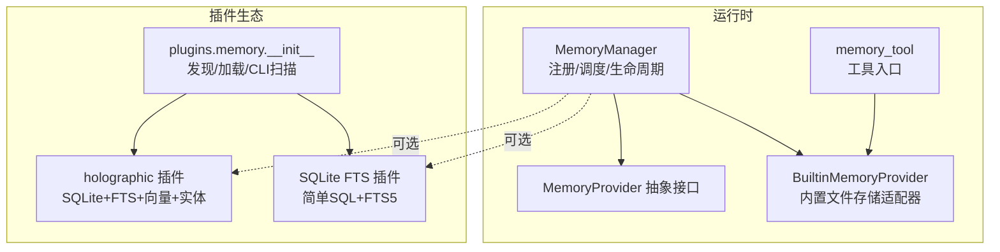
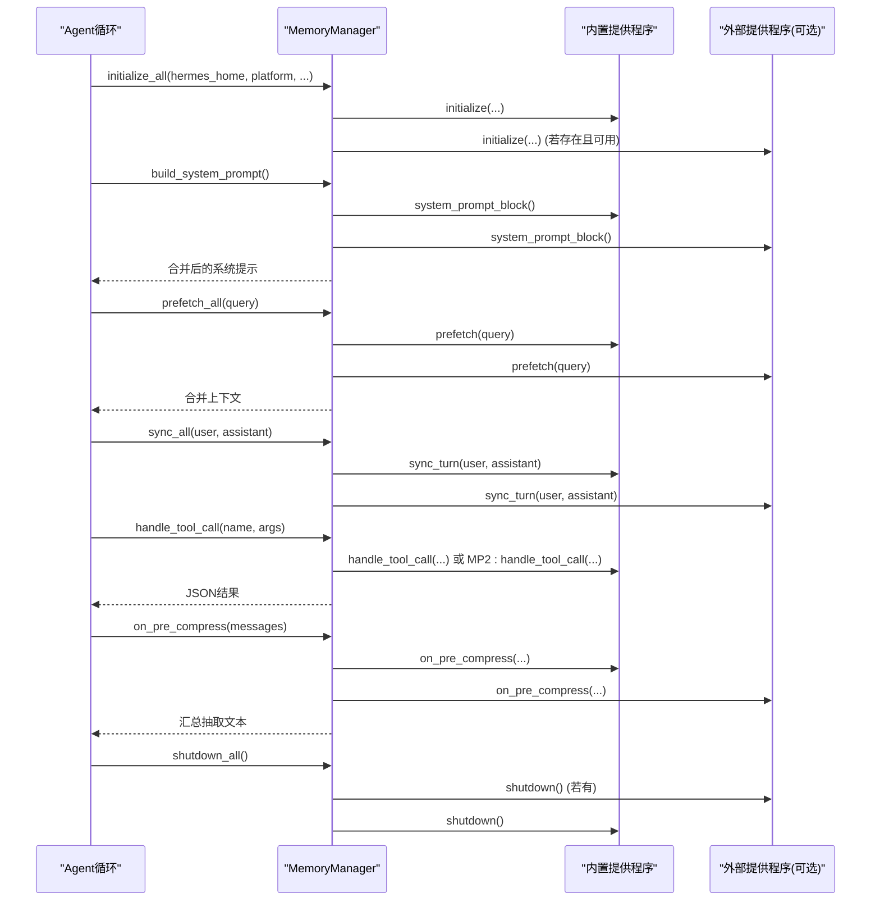
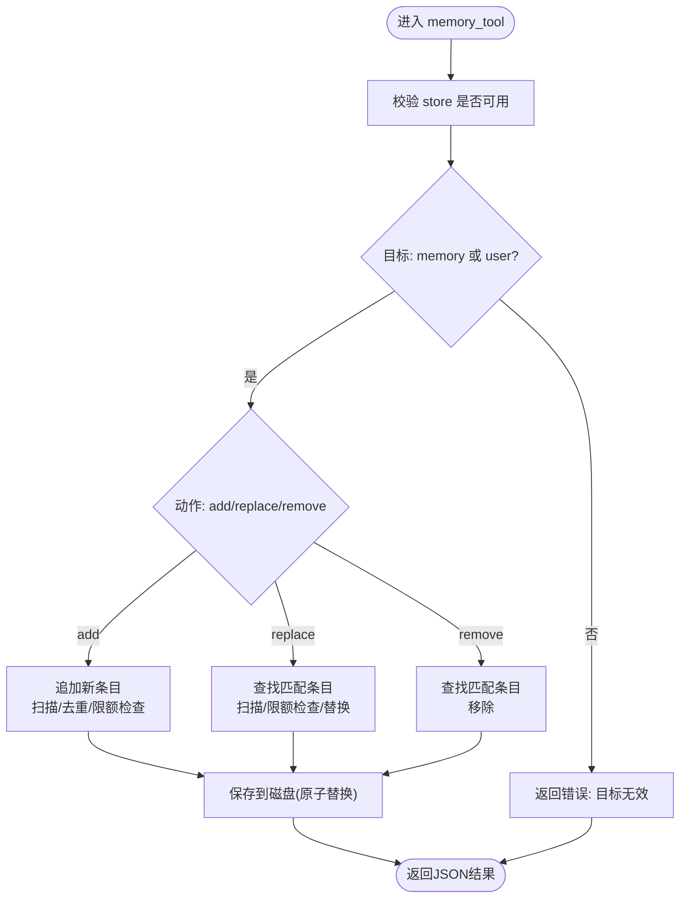
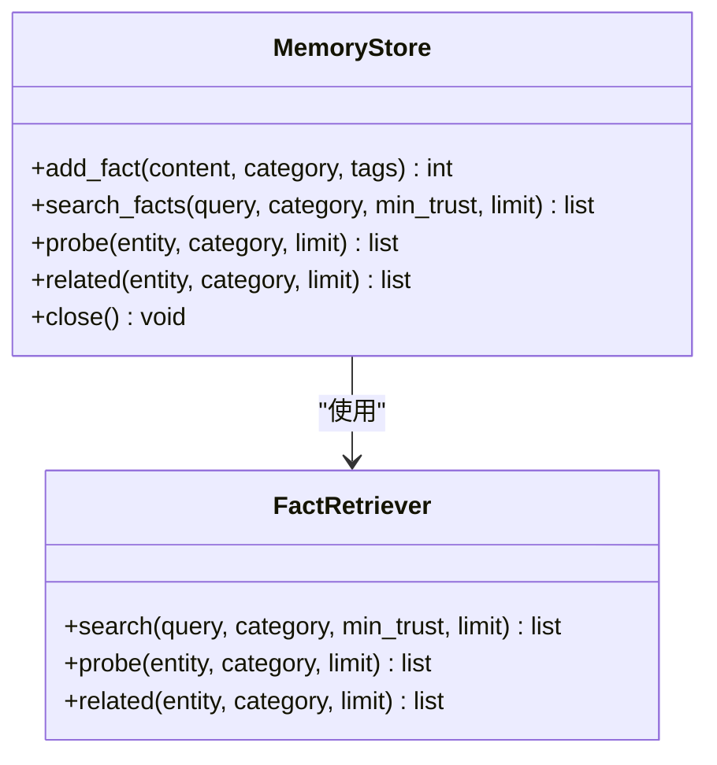
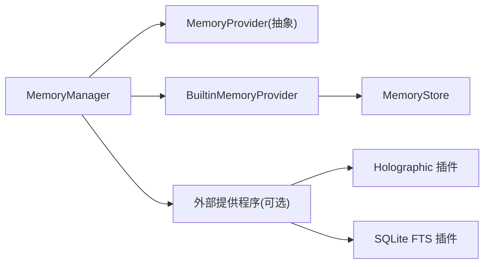

# 内存系统

<cite>
**本文引用的文件**
- [agent/memory_manager.py](file://agent/memory_manager.py)
- [agent/memory_provider.py](file://agent/memory_provider.py)
- [agent/builtin_memory_provider.py](file://agent/builtin_memory_provider.py)
- [tools/memory_tool.py](file://tools/memory_tool.py)
- [hermes_cli/memory_setup.py](file://hermes_cli/memory_setup.py)
- [plugins/memory/__init__.py](file://plugins/memory/__init__.py)
- [plugins/memory/holographic/store.py](file://plugins/memory/holographic/store.py)
- [plugins/memory/holographic/retrieval.py](file://plugins/memory/holographic/retrieval.py)
- [tests/agent/test_memory_plugin_e2e.py](file://tests/agent/test_memory_plugin_e2e.py)
- [run_agent.py](file://run_agent.py)
- [plugins/memory/holographic/__init__.py](file://plugins/memory/holographic/__init__.py)
</cite>

## 目录
1. [简介](#简介)
2. [项目结构](#项目结构)
3. [核心组件](#核心组件)
4. [架构总览](#架构总览)
5. [详细组件分析](#详细组件分析)
6. [依赖分析](#依赖分析)
7. [性能考量](#性能考量)
8. [故障排查指南](#故障排查指南)
9. [结论](#结论)
10. [附录](#附录)

## 简介
本文件面向Hermes Agent的内存系统，提供从架构设计到实现细节、从内置存储到外部插件、从检索算法到性能优化的全景式技术文档。重点覆盖：
- 内存管理器与提供程序接口（MemoryProvider）设计
- 内置文件型记忆（MEMORY.md/USER.md）与工具交互
- 外部插件（如Holographic、SQLite FTS等）的检索与存储策略
- 记忆索引机制、相似度计算、时间序列与信任评分
- 内存工具的使用方法（查询、更新、删除）
- 配置选项、性能调优参数、容量管理策略
- 插件开发指南、自定义提供程序实现、数据迁移方案

## 项目结构
内存系统由“管理器 + 提供程序 + 工具 + 插件”四部分组成：
- 管理器：统一注册、调度与生命周期管理
- 提供程序：抽象接口与内置/插件实现
- 工具：单点入口的记忆工具，对接内置存储
- 插件：可选的外部记忆后端（如Holographic、SQLite FTS）

图表来源
- [agent/memory_manager.py:72-368](file://agent/memory_manager.py#L72-L368)
- [agent/memory_provider.py:42-232](file://agent/memory_provider.py#L42-L232)
- [agent/builtin_memory_provider.py:24-115](file://agent/builtin_memory_provider.py#L24-L115)
- [tools/memory_tool.py:439-561](file://tools/memory_tool.py#L439-L561)
- [plugins/memory/__init__.py:32-318](file://plugins/memory/__init__.py#L32-L318)

章节来源
- [agent/memory_manager.py:1-368](file://agent/memory_manager.py#L1-L368)
- [agent/memory_provider.py:1-232](file://agent/memory_provider.py#L1-L232)
- [agent/builtin_memory_provider.py:1-115](file://agent/builtin_memory_provider.py#L1-L115)
- [tools/memory_tool.py:1-561](file://tools/memory_tool.py#L1-L561)
- [plugins/memory/__init__.py:1-318](file://plugins/memory/__init__.py#L1-L318)

## 核心组件
- MemoryManager：集中编排内置与最多一个外部提供程序，负责系统提示拼接、预取召回、回合同步、工具路由、生命周期钩子与关闭。
- MemoryProvider：抽象接口，定义可用性检查、初始化、系统提示块、预取、回合同步、工具模式、可选钩子（回合开始、会话结束、压缩前抽取、镜像写入、委托观察、配置模式）。
- BuiltinMemoryProvider：内置文件存储适配器，不参与标准工具注册，通过系统提示注入快照，写入即时落盘。
- MemoryStore：内置存储的核心类，双存储（MEMORY/USER），字符数限制，去重，原子写入，内容扫描，系统提示冻结快照。
- memory_tool：工具入口，统一处理 add/replace/remove/read，返回JSON结果。
- 插件发现与加载：plugins.memory.__init__ 负责扫描目录、读取元信息、按需加载、仅激活一个外部提供程序。

章节来源
- [agent/memory_manager.py:72-368](file://agent/memory_manager.py#L72-L368)
- [agent/memory_provider.py:42-232](file://agent/memory_provider.py#L42-L232)
- [agent/builtin_memory_provider.py:24-115](file://agent/builtin_memory_provider.py#L24-L115)
- [tools/memory_tool.py:100-561](file://tools/memory_tool.py#L100-L561)
- [plugins/memory/__init__.py:32-318](file://plugins/memory/__init__.py#L32-L318)

## 架构总览
内存系统在运行期通过MemoryManager串联各提供程序，并在会话中执行如下关键流程：
- 初始化：为每个提供程序注入hermes_home、平台、身份等上下文
- 系统提示：收集各提供程序静态提示块并注入
- 预取：在每轮对话前异步召回上下文
- 回合同步：每轮结束后非阻塞地持久化
- 工具调用：根据工具名路由至对应提供程序
- 压缩前抽取：在上下文压缩前抽取关键洞察
- 关闭：逆序关闭所有提供程序

图表来源
- [agent/memory_manager.py:151-368](file://agent/memory_manager.py#L151-L368)
- [agent/memory_provider.py:83-232](file://agent/memory_provider.py#L83-L232)

章节来源
- [agent/memory_manager.py:72-368](file://agent/memory_manager.py#L72-L368)
- [agent/memory_provider.py:42-232](file://agent/memory_provider.py#L42-L232)

## 详细组件分析

### 内置文件存储与工具（MemoryStore + memory_tool）
- 存储模型：两份独立文件（MEMORY.md/USER.md），以分隔符组织多条目；加载时去重并生成系统提示冻结快照。
- 容量管理：分别设置字符上限，新增/替换前进行总量校验，超限拒绝并返回当前用量。
- 安全扫描：对写入内容进行威胁模式检测与不可见字符过滤，防止注入与窃取。
- 原子写入：采用临时文件+原子替换，避免并发读取空文件窗口。
- 工具行为：统一入口，支持 add/replace/remove，返回标准化JSON；replace/remove基于短子串匹配，必要时要求更精确输入或给出候选预览。

图表来源
- [tools/memory_tool.py:439-561](file://tools/memory_tool.py#L439-L561)
- [tools/memory_tool.py:198-334](file://tools/memory_tool.py#L198-L334)

章节来源
- [tools/memory_tool.py:100-561](file://tools/memory_tool.py#L100-L561)

### 内置提供程序（BuiltinMemoryProvider）
- 角色定位：始终激活，不可禁用；不暴露标准工具，其工具由Agent层拦截。
- 系统提示：注入冻结快照，保证会话期间提示缓存稳定。
- 初始化：加载磁盘数据；写入即时落盘但不影响当前会话提示。
- 属性访问：保留对底层MemoryStore的访问以便兼容旧路径。

章节来源
- [agent/builtin_memory_provider.py:24-115](file://agent/builtin_memory_provider.py#L24-L115)

### 外部插件：Holographic（SQLite + FTS + 实体/信任/向量）
- 存储结构：facts表（内容唯一、类别、标签、信任分、检索/有用计数、时间戳、向量）、entities与关联表、FTS触发器、内存库向量。
- 检索策略：混合检索（FTS5候选 + Jaccard重排 + 信任加权 + 可选时间衰减），支持向量相似度（HRR）作为补充。
- 实体解析：从内容提取命名实体，建立别名与事实关联，提升语义召回。
- 信任评分：根据“有用/无用”反馈动态调整，带边界钳制。
- 生命周期钩子：支持 on_memory_write 镜像内置写入，确保一致性。

图表来源
- [plugins/memory/holographic/store.py:98-200](file://plugins/memory/holographic/store.py#L98-L200)
- [plugins/memory/holographic/retrieval.py:22-120](file://plugins/memory/holographic/retrieval.py#L22-L120)

章节来源
- [plugins/memory/holographic/store.py:16-123](file://plugins/memory/holographic/store.py#L16-L123)
- [plugins/memory/holographic/retrieval.py:1-200](file://plugins/memory/holographic/retrieval.py#L1-L200)
- [plugins/memory/holographic/__init__.py:157-178](file://plugins/memory/holographic/__init__.py#L157-L178)

### 外部插件：SQLite FTS（示例）
- 功能：提供 sqlite_retain/sqlite_recall 两个工具，使用FTS5全文检索。
- 行为：自动将对话合并后写入 memories 表，支持按会话隔离；召回返回内容与上下文。
- 集成：通过 MemoryManager 注册，作为外部提供程序之一。

章节来源
- [tests/agent/test_memory_plugin_e2e.py:43-160](file://tests/agent/test_memory_plugin_e2e.py#L43-L160)

### 插件发现与激活（plugins.memory）
- 发现：扫描 plugins/memory/<name>/ 目录，读取 plugin.yaml 获取描述，轻量检查可用性。
- 加载：支持 register(ctx) 模式或直接实例化类；仅加载并激活配置中指定的一个外部提供程序。
- CLI：仅对当前激活的插件注册CLI命令，避免工具schema膨胀。

章节来源
- [plugins/memory/__init__.py:32-318](file://plugins/memory/__init__.py#L32-L318)

### 记忆工具使用方法
- 查询：通过内置工具 memory 的 target/action 参数进行读取与写入；外部插件提供各自工具（如 sqlite_recall）。
- 更新：add 追加；replace 使用短子串匹配定位条目；remove 使用短子串匹配删除。
- 删除：remove 基于短子串匹配，若存在多个匹配则要求更精确输入或返回候选预览。
- 结果：统一返回JSON字符串，包含成功标志、目标、条目列表、用量百分比与条目数量等。

章节来源
- [tools/memory_tool.py:439-561](file://tools/memory_tool.py#L439-L561)
- [tests/agent/test_memory_plugin_e2e.py:166-208](file://tests/agent/test_memory_plugin_e2e.py#L166-L208)

### 内存索引机制、相似度计算与时间序列
- 索引机制：Holographic 使用 SQLite FTS5 触发器自动维护；SQLite FTS 插件直接使用 FTS5 全文索引。
- 相似度计算：混合检索中结合 FTS5 排名、Jaccard 词集相似、信任加权与可选时间衰减；向量相似（HRR）作为补充权重。
- 时间序列与信任：记录创建/更新时间，支持按半衰期的时间衰减；信任分随“有用/无用”反馈动态调整。

章节来源
- [plugins/memory/holographic/store.py:16-76](file://plugins/memory/holographic/store.py#L16-L76)
- [plugins/memory/holographic/retrieval.py:48-120](file://plugins/memory/holographic/retrieval.py#L48-L120)
- [tests/agent/test_memory_plugin_e2e.py:64-89](file://tests/agent/test_memory_plugin_e2e.py#L64-L89)

### 记忆压缩与上下文管理
- 压缩触发：当提示令牌接近阈值比例时触发压缩，先清理旧工具结果，再进行摘要与迭代更新。
- 压缩前抽取：MemoryManager 在压缩前调用各提供程序的 on_pre_compress，用于提取关键洞察。
- 上下文压力提示：在接近压缩阈值时向用户发出警告，避免体验劣化。

章节来源
- [run_agent.py:5853-5875](file://run_agent.py#L5853-L5875)
- [agent/memory_manager.py:290-307](file://agent/memory_manager.py#L290-L307)

## 依赖分析
- 组件耦合
  - MemoryManager 与 MemoryProvider：强契约（接口）；内置提供程序始终在前，外部提供程序最多一个。
  - BuiltinMemoryProvider 与 MemoryStore：组合关系，前者封装后者并注入系统提示。
  - 插件提供程序与 MemoryManager：通过工具schema与生命周期钩子解耦。
- 外部依赖
  - 插件发现依赖 YAML 元数据与模块导入；Holographic 插件依赖向量库（可选）。
  - SQLite/FTS5 依赖数据库连接与WAL模式；文件锁与原子写入保障并发安全。

图表来源
- [agent/memory_manager.py:72-140](file://agent/memory_manager.py#L72-L140)
- [agent/builtin_memory_provider.py:24-115](file://agent/builtin_memory_provider.py#L24-L115)
- [plugins/memory/__init__.py:32-196](file://plugins/memory/__init__.py#L32-L196)

章节来源
- [agent/memory_manager.py:72-140](file://agent/memory_manager.py#L72-L140)
- [plugins/memory/__init__.py:32-196](file://plugins/memory/__init__.py#L32-L196)

## 性能考量
- 写入路径
  - 内置：文件锁 + 原子替换，避免竞态；写后立即落盘，适合小规模、高可靠性场景。
  - 插件：建议在 sync_turn 中使用后台线程异步持久化，避免阻塞主循环。
- 检索路径
  - SQLite FTS：WAL模式 + FTS5触发器，适合关键词/短语检索；注意索引与触发器开销。
  - Holographic：FTS5候选 + Jaccard重排 + 信任加权 + 可选向量相似，适合复杂语义检索；向量计算依赖可选库。
- 压缩与缓存
  - 压缩阈值、目标比例、尾部保护与最近N条保护策略影响上下文长度与LLM成本。
  - 系统提示冻结快照减少前缀缓存失效，提高推理效率。

[本节为通用指导，无需特定文件来源]

## 故障排查指南
- 提供程序冲突
  - 仅允许一个外部提供程序激活；重复注册会被拒绝并记录警告。
- 工具冲突
  - 若同名工具已在其他提供程序注册，将被忽略并记录警告。
- 写入失败
  - 内置：检查文件权限、磁盘空间与锁文件；确认原子写入未被中断。
  - 插件：检查网络/服务可用性、线程池与队列状态。
- 配置问题
  - 使用 hermes memory status 查看当前激活提供程序与配置；缺失密钥会在状态中提示。
- 压缩异常
  - 若压缩失败，系统会回退并记录日志；检查阈值与目标比例设置是否合理。

章节来源
- [agent/memory_manager.py:86-131](file://agent/memory_manager.py#L86-L131)
- [hermes_cli/memory_setup.py:454-509](file://hermes_cli/memory_setup.py#L454-L509)

## 结论
Hermes 内存系统通过 MemoryManager 将“内置文件存储 + 外部插件”统一编排，既保证了本地、可靠、低门槛的默认体验，又为高级检索（FTS/实体/信任/向量）提供了扩展能力。内置存储强调简洁与稳定，插件体系强调可插拔与可定制。配合上下文压缩与冻结快照策略，系统在长上下文与多会话场景下具备良好的稳定性与性能表现。

[本节为总结，无需特定文件来源]

## 附录

### 配置选项与参数
- 内置存储
  - 字符上限：MEMORY 与 USER 分别有字符上限，超限拒绝新增/替换。
  - 冻结快照：系统提示注入时使用加载时刻的冻结快照，避免提示缓存失效。
- 插件（Holographic）
  - 数据库路径、默认信任分、向量维度、FTS/Jaccard/HRR 权重、时间衰减半衰期等。
- 插件（SQLite FTS）
  - 通过工具 sqlite_retain/sqlite_recall 使用，支持按会话隔离与上下文分类。
- CLI
  - hermes memory setup/status：交互式选择与配置外部提供程序，安装依赖，写入 .env 与 config.yaml。

章节来源
- [tools/memory_tool.py:111-118](file://tools/memory_tool.py#L111-L118)
- [plugins/memory/holographic/__init__.py:153-178](file://plugins/memory/holographic/__init__.py#L153-L178)
- [hermes_cli/memory_setup.py:291-423](file://hermes_cli/memory_setup.py#L291-L423)

### 性能调优参数
- 压缩参数（阈值、目标比例、保护条数）：控制压缩触发与尾部预算，平衡成本与信息保留。
- 插件检索权重：FTS/Jaccard/HRR 权重分配影响召回质量与速度；在缺少向量库时自动重分配。
- SQLite：WAL 模式、FTS5 触发器、索引与事务粒度影响写入与查询性能。

章节来源
- [run_agent.py:5853-5875](file://run_agent.py#L5853-L5875)
- [plugins/memory/holographic/retrieval.py:25-47](file://plugins/memory/holographic/retrieval.py#L25-L47)

### 容量管理策略
- 内置：按字符计数的硬上限，新增/替换前校验；建议优先清理冗余条目。
- 插件：SQLite 表级约束（如内容唯一）与触发器维护；建议定期清理无用事实与实体关联。
- 压缩：在达到阈值前主动清理冗余工具输出，降低上下文体积。

章节来源
- [tools/memory_tool.py:198-242](file://tools/memory_tool.py#L198-L242)
- [plugins/memory/holographic/store.py:142-186](file://plugins/memory/holographic/store.py#L142-L186)

### 插件开发指南
- 实现 MemoryProvider：至少实现 is_available/initialize/system_prompt_block/prefetch/sync_turn/get_tool_schemas；可选钩子按需实现。
- 配置模式：实现 get_config_schema/save_config，或仅使用环境变量。
- 线程与异步：sync_turn 必须非阻塞，后台线程处理慢速后端。
- 路径隔离：使用 initialize 传入的 hermes_home 构建存储路径，避免硬编码。
- CLI：在插件目录提供 cli.py 并注册命令，仅对当前激活插件生效。

章节来源
- [agent/memory_provider.py:50-232](file://agent/memory_provider.py#L50-L232)
- [plugins/memory/__init__.py:234-318](file://plugins/memory/__init__.py#L234-L318)
- [website/docs/developer-guide/memory-provider-plugin.md:117-177](file://website/docs/developer-guide/memory-provider-plugin.md#L117-L177)

### 自定义提供程序实现步骤
- 创建目录 plugins/memory/<your_provider>/，编写 __init__.py 实现 MemoryProvider。
- 在 __init__.py 中实现 register(ctx) 或导出类实例，使用 ctx.register_memory_provider 注册。
- 如需CLI，在 cli.py 中注册命令并通过 discover_plugin_cli_commands 仅对激活插件生效。
- 在 plugin.yaml 中声明描述与依赖，使用 hermes memory setup 完成配置。

章节来源
- [plugins/memory/__init__.py:175-196](file://plugins/memory/__init__.py#L175-L196)
- [plugins/memory/__init__.py:234-318](file://plugins/memory/__init__.py#L234-L318)

### 数据迁移方案
- OpenCLAW 迁移脚本支持将旧配置与工作区迁移到新格式，包含 memory 项的迁移报告与溢出文件输出，便于人工核对与后续处理。
- 建议在迁移后检查内存文件完整性与插件配置有效性。

章节来源
- [optional-skills/migration/openclaw-migration/scripts/openclaw_to_hermes.py:215-264](file://optional-skills/migration/openclaw-migration/scripts/openclaw_to_hermes.py#L215-L264)
- [tests/skills/test_openclaw_migration.py:265-304](file://tests/skills/test_openclaw_migration.py#L265-L304)