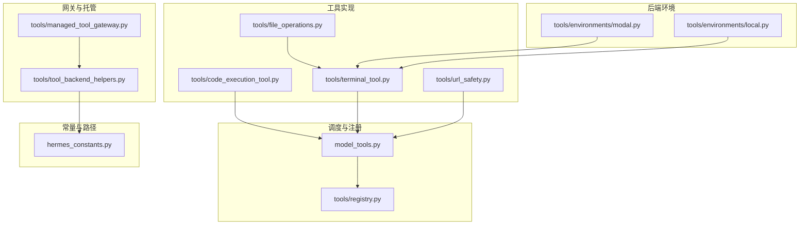
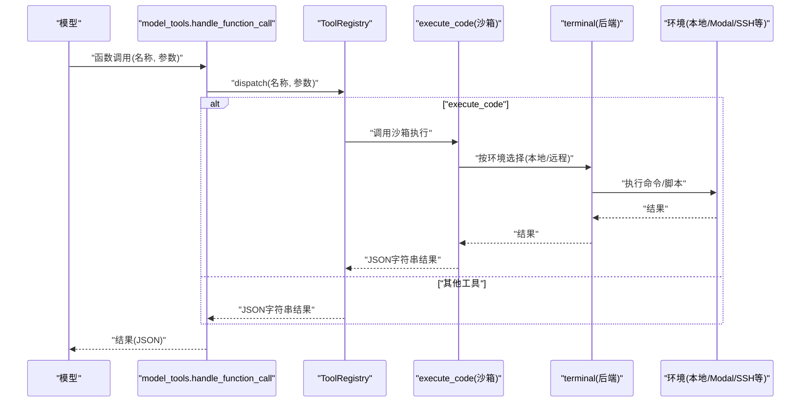
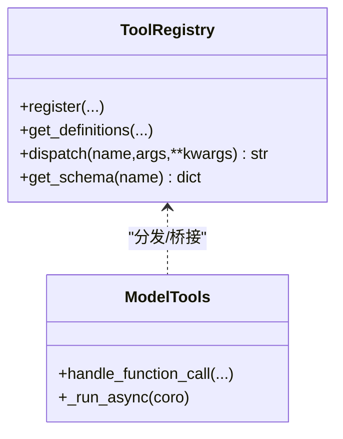
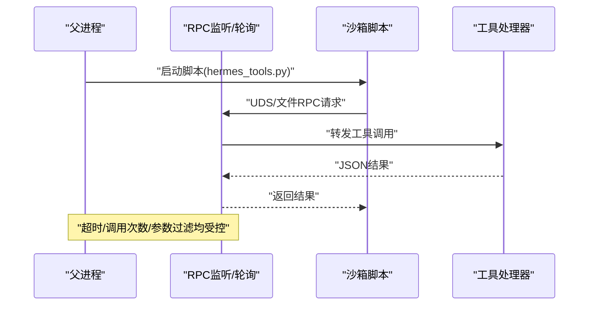
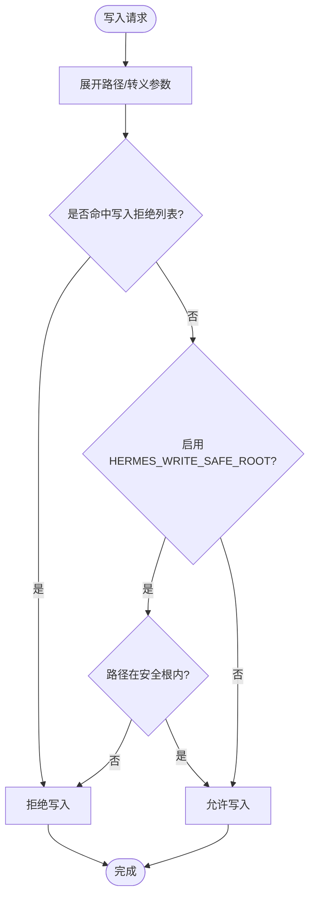
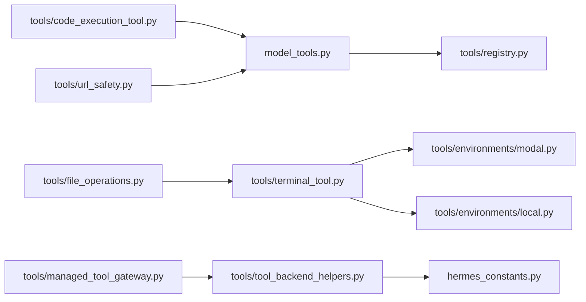

# 工具执行与安全

<cite>
**本文引用的文件**
- [tools/code_execution_tool.py](file://tools/code_execution_tool.py)
- [tools/registry.py](file://tools/registry.py)
- [model_tools.py](file://model_tools.py)
- [tools/terminal_tool.py](file://tools/terminal_tool.py)
- [tools/file_operations.py](file://tools/file_operations.py)
- [tools/url_safety.py](file://tools/url_safety.py)
- [tools/managed_tool_gateway.py](file://tools/managed_tool_gateway.py)
- [tools/tool_backend_helpers.py](file://tools/tool_backend_helpers.py)
- [hermes_constants.py](file://hermes_constants.py)
- [tools/environments/modal.py](file://tools/environments/modal.py)
- [tools/environments/local.py](file://tools/environments/local.py)
- [website/docs/developer-guide/tools-runtime.md](file://website/docs/developer-guide/tools-runtime.md)
- [tests/tools/test_code_execution.py](file://tests/tools/test_code_execution.py)
- [tests/tools/test_file_write_safety.py](file://tests/tools/test_file_write_safety.py)
- [tests/tools/test_write_deny.py](file://tests/tools/test_write_deny.py)
- [tests/tools/test_daytona_environment.py](file://tests/tools/test_daytona_environment.py)
</cite>

## 目录
1. [简介](#简介)
2. [项目结构](#项目结构)
3. [核心组件](#核心组件)
4. [架构总览](#架构总览)
5. [详细组件分析](#详细组件分析)
6. [依赖分析](#依赖分析)
7. [性能考虑](#性能考虑)
8. [故障排查指南](#故障排查指南)
9. [结论](#结论)
10. [附录：安全配置指南](#附录安全配置指南)

## 简介
本文件面向Hermes Agent的“工具执行与安全”子系统，系统性阐述以下主题：
- 工具执行调度机制：同步与异步处理器桥接、异常捕获与错误格式化、返回值序列化
- 安全防护策略：代码执行沙箱、文件操作限制、网络请求白名单、环境变量隔离
- 并发执行模型：线程池管理、任务超时控制、资源使用监控
- 工具调用安全边界：参数验证、输入过滤、输出清理
- 安全配置指南：安全策略设置、违规检测、审计日志记录

## 项目结构
围绕工具执行与安全的关键模块分布如下：
- 调度与注册层：tools/registry.py、model_tools.py
- 工具实现层：tools/code_execution_tool.py、tools/terminal_tool.py、tools/file_operations.py、tools/url_safety.py
- 后端环境层：tools/environments/modal.py、tools/environments/local.py
- 网关与托管：tools/managed_tool_gateway.py、tools/tool_backend_helpers.py
- 常量与路径：hermes_constants.py
- 文档与测试：website/docs/developer-guide/tools-runtime.md、tests/tools/test_*.py

图示来源
- [tools/registry.py:1-321](file://tools/registry.py#L1-L321)
- [model_tools.py:1-578](file://model_tools.py#L1-L578)
- [tools/code_execution_tool.py:1-1347](file://tools/code_execution_tool.py#L1-L1347)
- [tools/terminal_tool.py:1-1621](file://tools/terminal_tool.py#L1-L1621)
- [tools/file_operations.py:1-1102](file://tools/file_operations.py#L1-L1102)
- [tools/url_safety.py:1-97](file://tools/url_safety.py#L1-L97)
- [tools/environments/modal.py:1-446](file://tools/environments/modal.py#L1-L446)
- [tools/environments/local.py:97-138](file://tools/environments/local.py#L97-L138)
- [tools/managed_tool_gateway.py:1-168](file://tools/managed_tool_gateway.py#L1-L168)
- [tools/tool_backend_helpers.py:1-90](file://tools/tool_backend_helpers.py#L1-L90)
- [hermes_constants.py:1-106](file://hermes_constants.py#L1-L106)

章节来源
- [tools/registry.py:1-321](file://tools/registry.py#L1-L321)
- [model_tools.py:1-578](file://model_tools.py#L1-L578)

## 核心组件
- 工具注册中心（ToolRegistry）：集中注册、查询、分发工具；统一处理异步桥接与错误格式化
- 模型工具适配器（model_tools.handle_function_call）：参数类型强制、工具拦截、插件钩子、动态schema
- 代码执行工具（execute_code）：本地Unix域套接字与远程文件RPC双通道沙箱；工具白名单与调用限制
- 终端工具（terminal）：多后端执行环境生命周期管理、磁盘用量告警、危险命令审批
- 文件操作（file_operations）：写入拒绝列表、HERMES_WRITE_SAFE_ROOT沙箱、二进制/图片检测
- 网络安全（url_safety）：私有/回环/保留地址阻断、已知内部主机名阻断
- 环境隔离（Modal/Local）：容器/云沙箱快照与清理、子进程环境变量过滤
- 托管网关（managed_tool_gateway）：令牌解析与网关URL构建、托管模式可用性判定

章节来源
- [tools/registry.py:144-162](file://tools/registry.py#L144-L162)
- [model_tools.py:459-548](file://model_tools.py#L459-L548)
- [tools/code_execution_tool.py:53-63](file://tools/code_execution_tool.py#L53-L63)
- [tools/terminal_tool.py:430-800](file://tools/terminal_tool.py#L430-L800)
- [tools/file_operations.py:44-116](file://tools/file_operations.py#L44-L116)
- [tools/url_safety.py:50-97](file://tools/url_safety.py#L50-L97)
- [tools/environments/modal.py:147-446](file://tools/environments/modal.py#L147-L446)
- [tools/environments/local.py:97-138](file://tools/environments/local.py#L97-L138)
- [tools/managed_tool_gateway.py:117-168](file://tools/managed_tool_gateway.py#L117-L168)

## 架构总览
工具执行从模型到工具的完整链路如下：

图示来源
- [model_tools.py:459-548](file://model_tools.py#L459-L548)
- [tools/registry.py:144-162](file://tools/registry.py#L144-L162)
- [tools/code_execution_tool.py:685-800](file://tools/code_execution_tool.py#L685-L800)
- [tools/terminal_tool.py:583-713](file://tools/terminal_tool.py#L583-L713)

## 详细组件分析

### 组件A：工具注册与调度（同步/异步桥接）
- 注册中心职责
  - 统一schema收集与可用性检查
  - 分发时自动桥接异步处理器
  - 全局异常捕获并格式化为JSON
- 异步桥接策略
  - 主线程持久事件循环：避免“事件循环已关闭”问题
  - 工作线程独立事件循环：避免竞争与GC导致的死循环
  - 现有异步上下文：派生线程内一次性事件循环
- 错误格式化与返回值序列化
  - 统一使用工具辅助函数生成JSON字符串，确保一致性

图示来源
- [tools/registry.py:45-162](file://tools/registry.py#L45-L162)
- [model_tools.py:35-126](file://model_tools.py#L35-L126)

章节来源
- [tools/registry.py:144-162](file://tools/registry.py#L144-L162)
- [model_tools.py:81-126](file://model_tools.py#L81-L126)

### 组件B：代码执行沙箱（execute_code）
- 双通道架构
  - 本地：Unix域套接字（UDS），父进程监听RPC，子进程运行LLM脚本
  - 远程：文件RPC（req/res文件），轮询线程在父侧代理工具调用
- 工具白名单与调用限制
  - 仅允许预置的7个工具进入沙箱
  - 会话级enabled_tools交集决定最终可用工具集合
  - 单次执行最大工具调用次数限制
- 资源与超时
  - 默认超时、最大stdout/stderr大小限制
  - 远程后端要求Python3可用
- 安全要点
  - RPC请求/响应严格JSON解析与校验
  - 屏蔽终端工具的后台/通知等参数
  - 子进程标准流重定向，避免泄露

图示来源
- [tools/code_execution_tool.py:306-424](file://tools/code_execution_tool.py#L306-L424)
- [tools/code_execution_tool.py:546-683](file://tools/code_execution_tool.py#L546-L683)
- [tools/code_execution_tool.py:685-800](file://tools/code_execution_tool.py#L685-L800)

章节来源
- [tools/code_execution_tool.py:53-63](file://tools/code_execution_tool.py#L53-L63)
- [tools/code_execution_tool.py:306-424](file://tools/code_execution_tool.py#L306-L424)
- [tools/code_execution_tool.py:685-800](file://tools/code_execution_tool.py#L685-L800)

### 组件C：文件操作安全（写入拒绝、安全根目录）
- 写入拒绝列表
  - 静态路径：~/.ssh/*、~/.aws/*、/etc/sudoers*、~/.netrc、~/.pgpass、~/.npmrc、~/.pypirc等
  - 前缀匹配：~/.ssh、~/.aws、~/.gnupg、~/.kube、/etc/sudoers.d、/etc/systemd、~/.docker、~/.azure、~/.config/gh
- HERMES_WRITE_SAFE_ROOT
  - 仅允许在此目录树内进行写入/补丁操作
  - 即使目标不在静态拒绝列表，超出安全根也会被拒绝
- 读取/搜索/补丁
  - 二进制/图片检测与提示
  - 统一通过Shell命令封装，避免直接文件句柄泄漏
  - 补丁支持V4A格式与模糊匹配

图示来源
- [tools/file_operations.py:98-116](file://tools/file_operations.py#L98-L116)
- [tests/tools/test_file_write_safety.py:28-81](file://tests/tools/test_file_write_safety.py#L28-L81)
- [tests/tools/test_write_deny.py:10-83](file://tests/tools/test_write_deny.py#L10-L83)

章节来源
- [tools/file_operations.py:44-116](file://tools/file_operations.py#L44-L116)
- [tests/tools/test_file_write_safety.py:14-81](file://tests/tools/test_file_write_safety.py#L14-L81)
- [tests/tools/test_write_deny.py:10-83](file://tests/tools/test_write_deny.py#L10-L83)

### 组件D：网络请求白名单（SSRF防护）
- 主机名校验
  - 已知内部主机名（如metadata.google.internal）直接阻断
- IP范围阻断
  - 私有/回环/链路本地/保留/未指定/组播
  - 显式阻断CGNAT段（100.64.0.0/10）
- DNS失败即阻断
  - 解析失败或异常均视为高风险，拒绝请求
- 限制说明
  - DNS重绑定与重定向绕过为已知局限，采用连接级校验与第三方SDK重定向二次校验缓解

章节来源
- [tools/url_safety.py:50-97](file://tools/url_safety.py#L50-L97)

### 组件E：环境变量隔离与后端隔离
- 子进程环境过滤
  - 构建阻断清单（含平台、提供商、远端后端密钥等）
  - 支持技能/配置级白名单（tools.env_passthrough）
- Modal/本地后端
  - Modal：快照保存/恢复、文件系统推送、异步工作线程
  - 本地：持久化开关、磁盘用量告警、危险命令审批与sudo处理

章节来源
- [tools/environments/local.py:97-138](file://tools/environments/local.py#L97-L138)
- [tools/environments/modal.py:147-446](file://tools/environments/modal.py#L147-L446)
- [tools/terminal_tool.py:135-203](file://tools/terminal_tool.py#L135-L203)

### 组件F：托管工具网关与后端模式
- 网关URL与令牌
  - 支持共享域名/方案配置，读取Nous访问令牌（带过期刷新）
- 后端模式解析
  - auto/direct/managed三种模式，结合凭证与托管可用性自动选择
- 常量与路径
  - HERMES_HOME统一路径解析，便于配置与缓存定位

章节来源
- [tools/managed_tool_gateway.py:117-168](file://tools/managed_tool_gateway.py#L117-L168)
- [tools/tool_backend_helpers.py:48-82](file://tools/tool_backend_helpers.py#L48-L82)
- [hermes_constants.py:11-17](file://hermes_constants.py#L11-L17)

## 依赖分析
- 调度层对注册层强依赖，注册层对各工具模块弱依赖（延迟导入）
- execute_code依赖model_tools.handle_function_call进行工具分发
- 终端工具依赖环境类（Local/Modal/SSH等）实现跨后端执行
- 文件操作依赖终端环境execute接口，形成Shell命令封装
- URL安全与托管网关分别作为独立模块被上层工具调用

图示来源
- [model_tools.py:132-185](file://model_tools.py#L132-L185)
- [tools/code_execution_tool.py:1-1347](file://tools/code_execution_tool.py#L1-1347)
- [tools/terminal_tool.py:398-406](file://tools/terminal_tool.py#L398-L406)
- [tools/file_operations.py:1-1102](file://tools/file_operations.py#L1-L1102)
- [tools/url_safety.py:1-97](file://tools/url_safety.py#L1-L97)
- [tools/managed_tool_gateway.py:1-168](file://tools/managed_tool_gateway.py#L1-L168)
- [tools/tool_backend_helpers.py:1-90](file://tools/tool_backend_helpers.py#L1-L90)
- [hermes_constants.py:1-106](file://hermes_constants.py#L1-L106)

章节来源
- [model_tools.py:132-185](file://model_tools.py#L132-L185)

## 性能考虑
- 事件循环复用
  - 主线程与工作线程持久事件循环，避免频繁创建/销毁带来的客户端重建成本
- RPC轮询与背压
  - 文件RPC轮询采用指数退避，降低空转CPU占用
- 资源上限
  - stdout/stderr大小限制、单次工具调用上限，防止内存与I/O放大
- 后端清理
  - Modal/容器后端定期清理与快照，减少闲置资源占用

章节来源
- [model_tools.py:39-126](file://model_tools.py#L39-L126)
- [tools/code_execution_tool.py:269-294](file://tools/code_execution_tool.py#L269-L294)
- [tools/code_execution_tool.py:677-683](file://tools/code_execution_tool.py#L677-L683)
- [tools/environments/modal.py:409-446](file://tools/environments/modal.py#L409-L446)

## 故障排查指南
- execute_code不可用
  - Windows平台禁用；远程后端需Python3可用
- 远程后端清理
  - 测试覆盖：非持久沙箱清理删除、幂等清理吞错、清理线程运行
- 写入安全
  - 静态拒绝列表与HERMES_WRITE_SAFE_ROOT生效验证
- URL安全
  - DNS失败阻断、私有IP阻断、内部主机名阻断
- 磁盘用量告警
  - 终端工具扫描hermes目录总大小，超过阈值发出警告

章节来源
- [tests/tools/test_code_execution.py:70-100](file://tests/tools/test_code_execution.py#L70-L100)
- [tests/tools/test_daytona_environment.py:198-235](file://tests/tools/test_daytona_environment.py#L198-L235)
- [tests/tools/test_file_write_safety.py:14-81](file://tests/tools/test_file_write_safety.py#L14-L81)
- [tests/tools/test_write_deny.py:10-83](file://tests/tools/test_write_deny.py#L10-L83)
- [tools/url_safety.py:50-97](file://tools/url_safety.py#L50-L97)
- [tools/terminal_tool.py:82-109](file://tools/terminal_tool.py#L82-L109)

## 结论
Hermes Agent的工具执行与安全体系以“注册中心+调度适配器”为核心，配合多后端环境、严格的沙箱与安全边界（写入拒绝、URL白名单、环境变量过滤、托管网关），在保证易用性的同时实现了可审计、可扩展、可治理的工具执行闭环。

## 附录：安全配置指南
- 环境变量隔离
  - 使用技能/配置注册允许透传的环境变量，避免默认阻断清单中的敏感键
  - 参考：tools.env_passthrough的允许集合与配置加载
- 写入安全
  - 启用HERMES_WRITE_SAFE_ROOT限定工作区，仅允许在该目录树内写入
  - 避免对系统关键路径与用户凭据目录进行写入
- 网络请求
  - 仅访问公网域名；内部元数据服务与私网地址将被阻断
  - 对于需要的内部服务，请通过托管网关或可信代理
- 后端模式
  - auto优先托管网关，其次直连后端；无可用凭证时自动降级
  - 通过环境变量控制托管功能开关与网关URL/令牌
- 日志与审计
  - 关注工具调用日志与RPC轮询线程日志，定位异常与超时
  - 在生产环境开启磁盘用量告警，及时清理闲置后端

章节来源
- [tools/env_passthrough.py:83-107](file://tools/env_passthrough.py#L83-L107)
- [tools/file_operations.py:81-116](file://tools/file_operations.py#L81-L116)
- [tools/url_safety.py:50-97](file://tools/url_safety.py#L50-L97)
- [tools/tool_backend_helpers.py:48-82](file://tools/tool_backend_helpers.py#L48-L82)
- [tools/managed_tool_gateway.py:117-168](file://tools/managed_tool_gateway.py#L117-L168)
- [tools/terminal_tool.py:82-109](file://tools/terminal_tool.py#L82-L109)