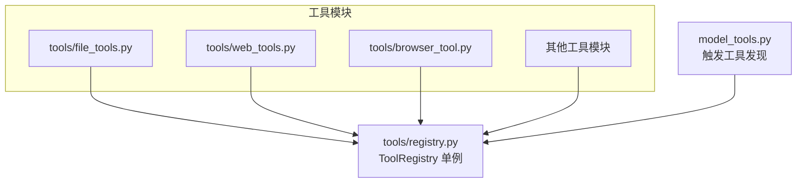
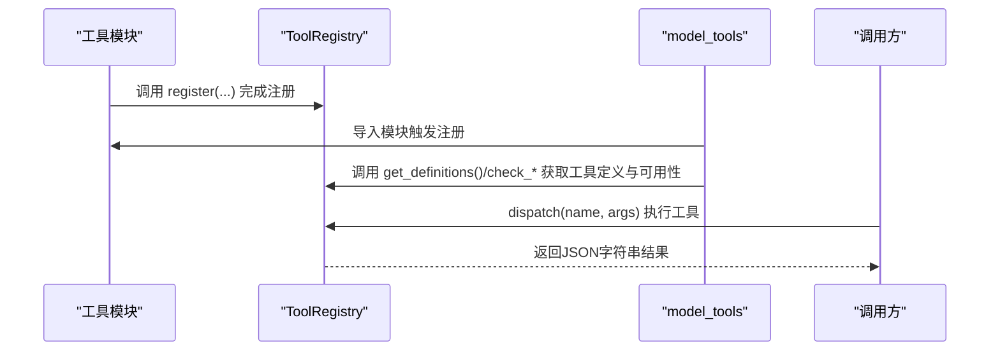
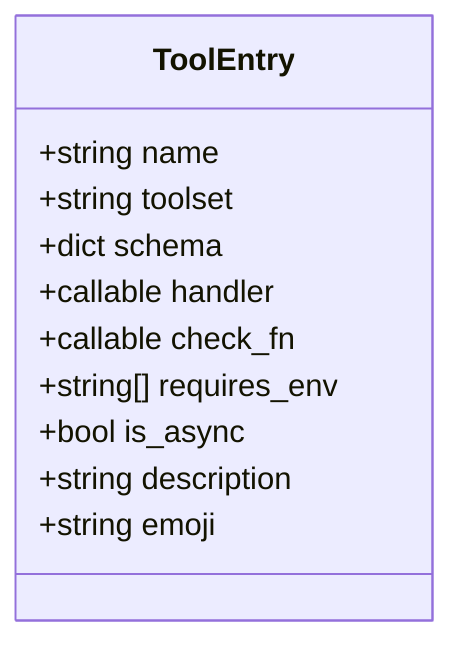
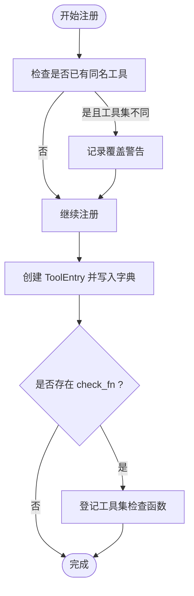
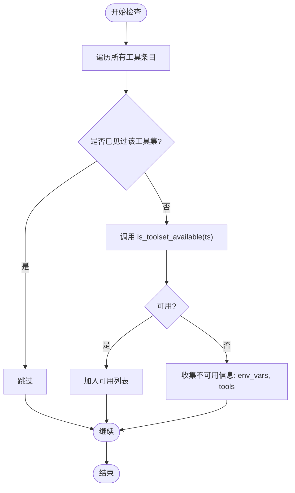
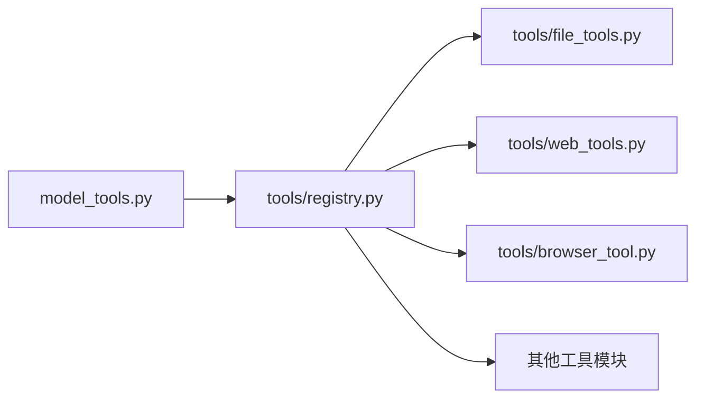

# 工具注册与管理

<cite>
**本文引用的文件**
- [tools/registry.py](file://tools/registry.py)
- [model_tools.py](file://model_tools.py)
- [tools/file_tools.py](file://tools/file_tools.py)
- [tools/web_tools.py](file://tools/web_tools.py)
- [tests/tools/test_registry.py](file://tests/tools/test_registry.py)
- [tests/tools/test_mcp_dynamic_discovery.py](file://tests/tools/test_mcp_dynamic_discovery.py)
- [website/docs/developer-guide/architecture.md](file://website/docs/developer-guide/architecture.md)
</cite>

## 目录
1. [简介](#简介)
2. [项目结构](#项目结构)
3. [核心组件](#核心组件)
4. [架构总览](#架构总览)
5. [详细组件分析](#详细组件分析)
6. [依赖关系分析](#依赖关系分析)
7. [性能考量](#性能考量)
8. [故障排查指南](#故障排查指南)
9. [结论](#结论)
10. [附录](#附录)

## 简介
本文件面向Hermes Agent的工具注册与管理系统，聚焦于ToolRegistry类的设计与实现，系统阐述工具条目(ToolEntry)的数据结构、注册与去注册流程、元数据管理、可用性检查机制、查询接口以及最佳实践。文档同时结合实际工具实现与测试用例，帮助读者从代码级到使用级全面掌握工具注册与管理。

## 项目结构
工具注册与管理的核心位于tools/registry.py，采用“模块导入时注册”的设计：每个工具模块在自身文件末尾调用registry.register()完成注册；随后由model_tools.py统一触发工具发现（导入各工具模块），从而构建全局工具定义与分发能力。该结构避免了循环依赖，并将工具发现与使用解耦。

图表来源
- [website/docs/developer-guide/architecture.md:263-276](file://website/docs/developer-guide/architecture.md#L263-L276)
- [model_tools.py:132-170](file://model_tools.py#L132-L170)
- [tools/registry.py:274-275](file://tools/registry.py#L274-L275)

章节来源
- [website/docs/developer-guide/architecture.md:263-276](file://website/docs/developer-guide/architecture.md#L263-L276)
- [model_tools.py:132-170](file://model_tools.py#L132-L170)

## 核心组件
- ToolEntry：封装单个工具的元数据，包括名称、工具集、Schema、处理器、可用性检查函数、所需环境变量、是否异步、描述与表情符号等。
- ToolRegistry：单例注册表，负责工具注册、去注册、Schema检索、工具分发、工具集可用性检查、查询辅助方法等。
- 模块级registry：全局唯一实例，供所有工具模块与上层调用方共享。

关键职责与特性
- 注册与覆盖：同名工具若来自不同工具集会发出警告并覆盖，确保工具集隔离。
- 工具集检查：通过check_fn对工具集进行一次性可用性判断，失败时记录并返回不可用。
- 异步桥接：dispatch自动桥接同步/异步处理器，保证缓存客户端生命周期稳定。
- 查询接口：支持按名称获取Schema、按工具集映射查询、可用工具集汇总、环境变量需求聚合等。

章节来源
- [tools/registry.py:24-43](file://tools/registry.py#L24-L43)
- [tools/registry.py:45-275](file://tools/registry.py#L45-L275)

## 架构总览
下图展示工具注册与使用的端到端流程：工具模块在导入时注册；model_tools统一触发发现；上层组件通过registry获取工具定义或执行工具。

图表来源
- [model_tools.py:132-170](file://model_tools.py#L132-L170)
- [tools/registry.py:56-162](file://tools/registry.py#L56-L162)

## 详细组件分析

### ToolEntry 数据结构
ToolEntry通过__slots__声明字段，确保内存占用小且属性访问稳定。字段包括：
- 基础标识：name、toolset
- 元数据：schema、description、emoji
- 运行时信息：handler、check_fn、requires_env、is_async

图表来源
- [tools/registry.py:24-43](file://tools/registry.py#L24-L43)

章节来源
- [tools/registry.py:24-43](file://tools/registry.py#L24-L43)

### ToolRegistry 类与注册流程
- register：写入工具条目，处理同名跨工具集覆盖警告；当存在check_fn且该工具集尚未登记时，登记工具集检查函数。
- deregister：移除工具条目；若该工具集不再有剩余工具，则清理对应工具集检查函数。
- dispatch：根据工具是否存在、是否异步，分别调用处理器或桥接到异步事件循环；异常被捕获并统一序列化为JSON错误。
- get_definitions：按名称集合返回OpenAI格式Schema，过滤掉check_fn失败的工具；内部对check_fn结果做缓存以避免重复计算。
- is_toolset_available：执行工具集检查函数，异常安全地返回False。
- 查询辅助：提供名称列表、Schema查询、工具集映射、可用工具集汇总、环境变量需求聚合等。

图表来源
- [tools/registry.py:56-89](file://tools/registry.py#L56-L89)

章节来源
- [tools/registry.py:56-162](file://tools/registry.py#L56-L162)
- [tools/registry.py:194-271](file://tools/registry.py#L194-L271)

### 工具可用性检查机制
- check_fn：用于工具集级别的可用性判断，ToolRegistry仅保存首个遇到的check_fn；get_definitions与is_toolset_available均对check_fn进行异常安全处理，避免崩溃。
- requires_env：工具声明的环境变量需求，ToolRegistry在构建工具集元数据时进行聚合，便于UI展示与诊断。
- check_tool_availability：返回可用工具集与不可用信息列表，包含工具集名称、缺失环境变量、该工具集下的全部工具名。

图表来源
- [tools/registry.py:253-271](file://tools/registry.py#L253-L271)

章节来源
- [tools/registry.py:194-271](file://tools/registry.py#L194-L271)
- [tests/tools/test_registry.py:184-260](file://tests/tools/test_registry.py#L184-L260)

### 工具查询接口
- 按名称获取Schema：get_schema(name)，返回原始schema（不参与check_fn过滤）。
- 按名称集合获取定义：get_definitions(names)，返回OpenAI格式函数定义，自动补全name字段。
- 工具集映射查询：get_tool_to_toolset_map()返回{name: toolset}映射。
- 工具集可用性：check_toolset_requirements()返回{toolset: available_bool}。
- 可用工具集元数据：get_available_toolsets()返回UI展示所需的工具集信息（含可用性、工具列表、环境变量需求）。

章节来源
- [tools/registry.py:111-193](file://tools/registry.py#L111-L193)
- [tools/registry.py:209-251](file://tools/registry.py#L209-L251)

### 实际工具注册示例
- 文件工具：在文件末尾多次调用registry.register()注册多个文件操作工具，并提供check_fn用于环境与权限校验。
- 网页工具：通过环境变量检测确定后端可用性，作为工具集检查函数的一部分。

章节来源
- [tools/file_tools.py:820-824](file://tools/file_tools.py#L820-L824)
- [tools/web_tools.py:184-200](file://tools/web_tools.py#L184-L200)

### 去注册与工具集完整性验证
- deregister：移除工具条目；若该工具集无剩余工具则清理工具集检查函数，避免悬挂检查。
- 测试验证：去注册后若工具集为空应清理检查函数；若仍有其他工具则保留检查函数。

章节来源
- [tools/registry.py:90-105](file://tools/registry.py#L90-L105)
- [tests/tools/test_mcp_dynamic_discovery.py:150-171](file://tests/tools/test_mcp_dynamic_discovery.py#L150-L171)

## 依赖关系分析
- 依赖链路：tools/registry.py无外部依赖，被各工具模块导入；model_tools统一触发工具发现；上层运行时组件通过registry获取工具定义与执行。
- 循环依赖规避：registry作为“被导入者”，避免了工具模块与上层模块之间的循环导入问题。

图表来源
- [website/docs/developer-guide/architecture.md:263-276](file://website/docs/developer-guide/architecture.md#L263-L276)
- [model_tools.py:132-170](file://model_tools.py#L132-L170)

章节来源
- [website/docs/developer-guide/architecture.md:263-276](file://website/docs/developer-guide/architecture.md#L263-L276)
- [model_tools.py:132-170](file://model_tools.py#L132-L170)

## 性能考量
- check_fn结果复用：get_definitions内部对check_fn结果进行缓存，避免同一调用周期内重复执行。
- 异步桥接：ToolRegistry.dispatch与model_tools的异步桥接函数共同保证缓存客户端生命周期稳定，减少“事件循环已关闭”等问题。
- 字典查找：基于哈希表的工具与工具集映射查询为O(1)平均复杂度，适合高频调用场景。

章节来源
- [tools/registry.py:117-138](file://tools/registry.py#L117-L138)
- [model_tools.py:81-126](file://model_tools.py#L81-L126)

## 故障排查指南
常见问题与定位建议
- 工具未出现在定义列表：检查工具是否成功注册（名称是否正确、是否被check_fn过滤）、是否在model_tools的工具发现列表中。
- 工具集不可用：查看工具集检查函数是否抛出异常或返回False；确认requires_env是否满足。
- 异步工具报错：确认工具声明is_async并使用统一的异步桥接；避免在非运行中事件循环上下文直接调用。
- 名称冲突告警：同名工具被不同工具集覆盖，需调整命名或工具集划分。

章节来源
- [tests/tools/test_registry.py:184-260](file://tests/tools/test_registry.py#L184-L260)
- [tools/registry.py:69-75](file://tools/registry.py#L69-L75)

## 结论
ToolRegistry通过简洁而稳健的数据结构与严格的注册/去注册流程，实现了工具元数据的集中管理与高效查询。配合check_fn的工具集可用性检查与异步桥接机制，系统在功能扩展与运行稳定性之间取得良好平衡。遵循本文最佳实践可显著降低集成成本与维护风险。

## 附录

### 最佳实践清单
- 命名规范
  - 工具名称在同一工具集内保持唯一；跨工具集重名将触发覆盖警告，建议通过工具集区分语义域。
  - 使用清晰、语义化的名称，便于用户与系统识别。
- 参数验证
  - 在工具处理器内部对输入参数进行严格校验，必要时返回结构化错误消息。
  - 对敏感参数（如密钥）避免在日志中泄露，使用工具提供的错误/结果序列化辅助函数。
- 错误处理策略
  - 工具处理器统一返回JSON字符串；使用tool_error/tool_result辅助函数，确保格式一致。
  - 对外部依赖（网络、文件系统、进程）进行异常捕获与降级处理。
- 工具集完整性验证
  - 为工具集提供check_fn，覆盖环境变量、二进制依赖、许可证状态等；确保异常安全，避免崩溃。
  - requires_env应准确反映工具集运行的最小环境条件，便于UI与诊断工具展示。
- 注册与去注册
  - 在工具模块末尾进行注册，确保导入即生效；动态发现场景（如MCP）需在去注册后清理工具集检查函数。
  - 去注册后若工具集为空，应清理对应check_fn，防止悬挂检查影响可用性判断。

章节来源
- [tools/registry.py:56-105](file://tools/registry.py#L56-L105)
- [tools/file_tools.py:820-824](file://tools/file_tools.py#L820-L824)
- [tools/web_tools.py:184-200](file://tools/web_tools.py#L184-L200)
- [tests/tools/test_registry.py:184-260](file://tests/tools/test_registry.py#L184-L260)
- [tests/tools/test_mcp_dynamic_discovery.py:150-171](file://tests/tools/test_mcp_dynamic_discovery.py#L150-L171)