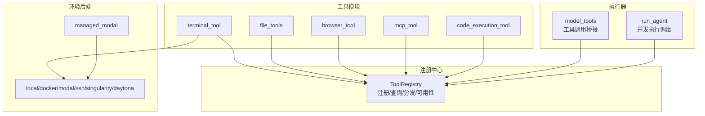
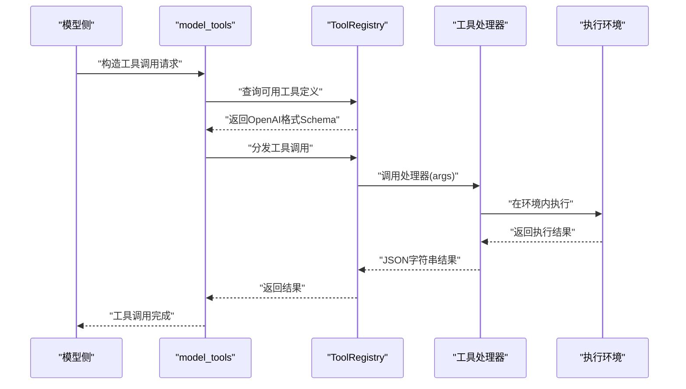
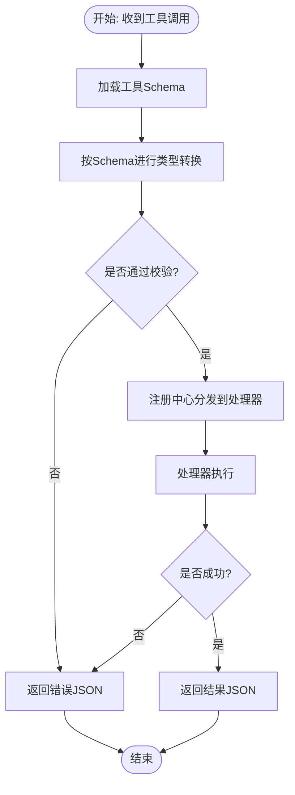
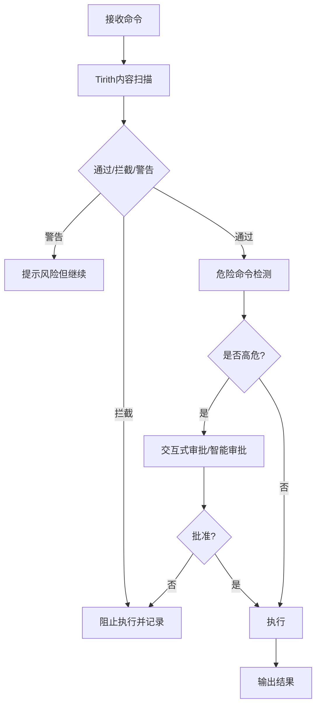
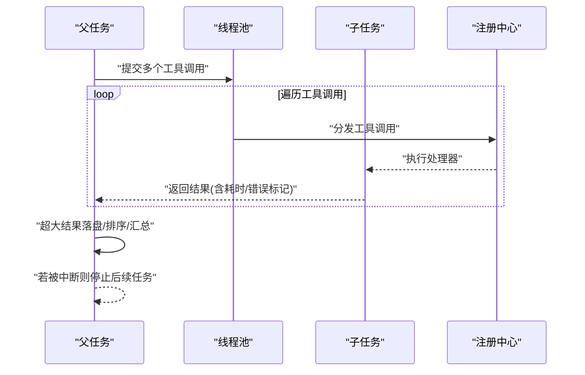
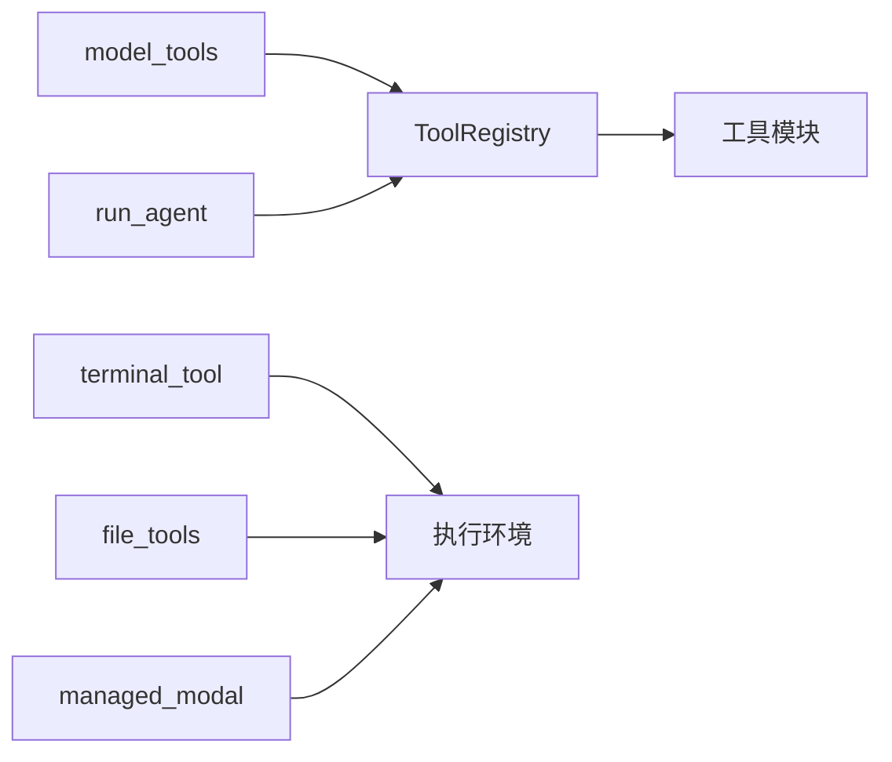

# 工具系统

<cite>
**本文引用的文件**
- [tools/registry.py](file://tools/registry.py)
- [tools/__init__.py](file://tools/__init__.py)
- [model_tools.py](file://model_tools.py)
- [run_agent.py](file://run_agent.py)
- [environments/agent_loop.py](file://environments/agent_loop.py)
- [tools/terminal_tool.py](file://tools/terminal_tool.py)
- [tools/file_tools.py](file://tools/file_tools.py)
- [tools/approval.py](file://tools/approval.py)
- [tools/tirith_security.py](file://tools/tirith_security.py)
- [tools/environments/managed_modal.py](file://tools/environments/managed_modal.py)
- [tools/environments/modal.py](file://tools/environments/modal.py)
- [tools/tool_backend_helpers.py](file://tools/tool_backend_helpers.py)
- [hermes_cli/tools_config.py](file://hermes_cli/tools_config.py)
- [toolsets.py](file://toolsets.py)
- [toolset_distributions.py](file://toolset_distributions.py)
- [tests/tools/test_registry.py](file://tests/tools/test_registry.py)
- [tests/tools/test_code_execution.py](file://tests/tools/test_code_execution.py)
- [tests/tools/test_daytona_environment.py](file://tests/tools/test_daytona_environment.py)
- [tests/run_agent/test_run_agent.py](file://tests/run_agent/test_run_agent.py)
- [website/docs/user-guide/features/delegation.md](file://website/docs/user-guide/features/delegation.md)
</cite>

## 目录
1. [简介](#简介)
2. [项目结构](#项目结构)
3. [核心组件](#核心组件)
4. [架构总览](#架构总览)
5. [详细组件分析](#详细组件分析)
6. [依赖分析](#依赖分析)
7. [性能考量](#性能考量)
8. [故障排查指南](#故障排查指南)
9. [结论](#结论)
10. [附录](#附录)

## 简介
本文件面向Hermes Agent的工具系统，提供从架构到实现细节的完整技术文档。重点覆盖以下方面：
- 工具注册机制：工具定义格式、参数校验与类型转换、可用性检查与工具集管理
- 安全策略：危险命令检测与审批、沙箱隔离、资源限制、权限控制
- 并发执行模型：线程池管理、任务调度、结果聚合
- 工具实现模式：终端工具、文件操作、网络请求、浏览器自动化等
- 开发指南：新工具创建、参数设计、错误处理、测试方法
- 最佳实践：工具集管理、性能监控、故障诊断

## 项目结构
工具系统围绕“注册中心 + 工具模块 + 执行器 + 环境后端”的分层组织：
- 注册中心：集中收集工具Schema与处理器，并提供查询、分发与可用性检查
- 工具模块：各功能域工具（终端、文件、浏览器、代码执行等）在导入时向注册中心注册
- 执行器：模型侧调用工具时通过注册中心分发至具体处理器；支持同步/异步桥接
- 环境后端：终端工具支持本地、Docker、Modal、SSH、Singularity、Daytona等多种执行环境

图表来源
- [tools/registry.py:45-275](file://tools/registry.py#L45-L275)
- [tools/terminal_tool.py:1-200](file://tools/terminal_tool.py#L1-L200)
- [tools/file_tools.py:1-200](file://tools/file_tools.py#L1-L200)
- [tools/environments/managed_modal.py:36-200](file://tools/environments/managed_modal.py#L36-L200)
- [model_tools.py:382-425](file://model_tools.py#L382-L425)
- [run_agent.py:6132-6154](file://run_agent.py#L6132-L6154)

章节来源
- [tools/registry.py:1-321](file://tools/registry.py#L1-L321)
- [tools/__init__.py:1-26](file://tools/__init__.py#L1-L26)

## 核心组件
- 工具注册中心（ToolRegistry）
  - 职责：统一注册工具、维护Schema与处理器映射、按需过滤可用工具、分发执行、查询元数据
  - 关键能力：工具Schema生成、工具集可用性检查、错误格式化返回
- 工具模块
  - 终端工具：多后端执行、后台任务、磁盘使用告警、危险命令审批
  - 文件工具：读写大小限制、设备路径阻断、敏感路径保护、读取去重与历史追踪
  - 浏览器工具：基于本地CLI或Camofox，封装导航、点击、输入、滚动、截图等
  - 代码执行工具：沙箱白名单、类型转换、结果截断与落盘
  - MCP工具：动态发现与过滤、命名前缀与冲突防护
- 执行器
  - 模型侧调用桥接：将工具调用转为注册中心分发，支持异步处理器自动桥接
  - 并发执行：线程池调度、结果聚合、超大结果落盘、中断传播
- 环境后端
  - 本地/容器/云沙箱：统一执行接口，支持持久化文件系统与快照恢复
  - 管理态Modal：通过网关创建/轮询/取消沙箱执行，支持快照与清理

章节来源
- [tools/registry.py:45-275](file://tools/registry.py#L45-L275)
- [tools/terminal_tool.py:1-200](file://tools/terminal_tool.py#L1-L200)
- [tools/file_tools.py:1-200](file://tools/file_tools.py#L1-L200)
- [tools/environments/managed_modal.py:36-200](file://tools/environments/managed_modal.py#L36-L200)
- [model_tools.py:382-425](file://model_tools.py#L382-L425)
- [run_agent.py:6132-6154](file://run_agent.py#L6132-L6154)

## 架构总览
工具系统采用“注册中心驱动 + 多后端执行”的架构。模型侧通过工具Schema发起调用，注册中心根据可用性筛选并分发到具体处理器；处理器在各自环境中执行，最终以JSON字符串返回。

图表来源
- [model_tools.py:382-425](file://model_tools.py#L382-L425)
- [tools/registry.py:144-162](file://tools/registry.py#L144-L162)

## 详细组件分析

### 工具注册机制与类型转换
- 工具定义格式
  - Schema字段：名称、描述、参数（properties/required/type）、工具集归属、可选元数据（emoji、描述）
  - 注册入口：工具模块导入时调用注册中心的register，传入schema与handler
- 参数验证与类型转换
  - 在模型侧对字符串参数进行类型强制转换，依据Schema中的参数类型进行整数/数值/联合类型尝试
  - 转换失败保持原值，避免破坏调用
- 可用性检查与工具集管理
  - 支持check_fn对工具集进行一次性可用性检查，缓存检查结果
  - 提供工具集要求清单、可用工具集列表、工具到工具集映射等查询接口
- 错误处理
  - 分发阶段捕获异常并统一返回JSON错误对象，保证对外一致的错误格式

图表来源
- [model_tools.py:382-425](file://model_tools.py#L382-L425)
- [tools/registry.py:111-162](file://tools/registry.py#L111-L162)

章节来源
- [tools/registry.py:56-89](file://tools/registry.py#L56-L89)
- [tools/registry.py:111-162](file://tools/registry.py#L111-L162)
- [model_tools.py:382-425](file://model_tools.py#L382-L425)
- [tests/tools/test_registry.py:129-289](file://tests/tools/test_registry.py#L129-L289)

### 工具执行的安全策略
- 危险命令检测与审批
  - 基于正则模式集合识别高危命令，支持会话级审批状态、永久允许列表、智能审批
  - 对终端工具的目录路径进行白名单校验，拒绝包含危险字符的路径
- 内容级威胁扫描（Tirith）
  - 自动下载并安装安全扫描二进制，支持校验与供应链证明验证
  - 通过子进程运行扫描，退出码决定放行/拦截/警告，失败时可按配置选择开/闭门
- 权限与路径保护
  - 文件写入前对敏感路径（如系统目录、套接字）进行阻断
  - 读取大文件时给出提示，建议使用偏移+限制的方式分段读取
- 沙箱隔离与资源限制
  - Modal直连与管理态两种模式，支持CPU/内存/磁盘配额、空闲超时、快照恢复
  - 管理态通过网关统一创建/轮询/终止，支持持久化文件系统与清理

图表来源
- [tools/tirith_security.py:1-200](file://tools/tirith_security.py#L1-L200)
- [tools/approval.py:68-166](file://tools/approval.py#L68-L166)
- [tools/terminal_tool.py:157-177](file://tools/terminal_tool.py#L157-L177)
- [tools/file_tools.py:98-116](file://tools/file_tools.py#L98-L116)
- [tools/environments/managed_modal.py:172-200](file://tools/environments/managed_modal.py#L172-L200)

章节来源
- [tools/approval.py:1-200](file://tools/approval.py#L1-L200)
- [tools/tirith_security.py:68-166](file://tools/tirith_security.py#L68-L166)
- [tools/terminal_tool.py:157-177](file://tools/terminal_tool.py#L157-L177)
- [tools/file_tools.py:98-116](file://tools/file_tools.py#L98-L116)
- [tools/environments/managed_modal.py:36-200](file://tools/environments/managed_modal.py#L36-L200)

### 工具并发执行模型
- 线程池与调度
  - 使用线程池执行多个工具调用，单任务直接执行避免额外开销
  - 记录每个工具的耗时与结果，慢任务与线程池队列状态用于调试
- 结果聚合与中断传播
  - 并发路径中对超大结果进行落盘保存，避免内存压力
  - 中断信号在父任务上触发时，向所有子任务传播，确保快速停止
- 进度展示与排序
  - 子任务按索引排序，保证输出顺序与输入一致
  - CLI与网关模式下分别提供实时进度与批量回调

图表来源
- [run_agent.py:6132-6154](file://run_agent.py#L6132-L6154)
- [environments/agent_loop.py:401-423](file://environments/agent_loop.py#L401-L423)
- [tests/run_agent/test_run_agent.py:1213-1239](file://tests/run_agent/test_run_agent.py#L1213-L1239)
- [website/docs/user-guide/features/delegation.md:120-130](file://website/docs/user-guide/features/delegation.md#L120-L130)

章节来源
- [run_agent.py:6132-6154](file://run_agent.py#L6132-L6154)
- [environments/agent_loop.py:401-423](file://environments/agent_loop.py#L401-L423)
- [tests/run_agent/test_run_agent.py:1213-1239](file://tests/run_agent/test_run_agent.py#L1213-L1239)
- [website/docs/user-guide/features/delegation.md:120-130](file://website/docs/user-guide/features/delegation.md#L120-L130)

### 工具实现模式
- 终端工具
  - 支持本地、Docker、Modal、SSH、Singularity、Daytona等后端
  - 后台任务通过进程注册表跟踪，支持工作目录校验与危险命令审批
- 文件操作
  - 读取限制字符数、阻断设备路径、写入敏感路径保护、读取去重与历史追踪
- 网络请求
  - 通过浏览器工具或专用Web工具进行搜索与抓取，支持快照与摘要
- 浏览器自动化
  - 本地CLI或Camofox模式，封装导航、点击、输入、滚动、截图、回退、按键等

章节来源
- [tools/terminal_tool.py:1-200](file://tools/terminal_tool.py#L1-L200)
- [tools/file_tools.py:1-200](file://tools/file_tools.py#L1-L200)
- [tools/browser_tool.py:784-2154](file://tools/browser_tool.py#L784-L2154)
- [tests/tools/test_daytona_environment.py:198-235](file://tests/tools/test_daytona_environment.py#L198-L235)

### 工具开发指南
- 新工具创建
  - 在工具模块中定义处理器函数与Schema，导入时注册到注册中心
  - 如需外部依赖，提供check_fn以声明工具集可用性
- 参数设计
  - 明确参数类型与必填项，必要时在模型侧进行类型转换
  - 返回值统一为JSON字符串，使用注册中心提供的工具错误/结果辅助函数
- 错误处理
  - 捕获异常并返回统一错误格式，便于上层统一处理
- 测试方法
  - 编写单元测试覆盖注册、可用性检查、分发错误、并发执行与结果聚合
  - 使用沙箱白名单与类型转换测试确保安全性与兼容性

章节来源
- [tools/registry.py:294-321](file://tools/registry.py#L294-L321)
- [tests/tools/test_registry.py:129-289](file://tests/tools/test_registry.py#L129-L289)
- [tests/tools/test_code_execution.py:70-100](file://tests/tools/test_code_execution.py#L70-L100)

## 依赖分析
- 注册中心与工具模块
  - 工具模块在导入时注册自身，形成“自举”式注册链，避免循环导入
- 执行器与注册中心
  - 模型侧通过注册中心查询与分发，屏蔽具体处理器差异
- 环境后端
  - 终端工具与文件工具共享环境锁与创建锁，避免重复创建与竞态
  - Modal直连与管理态通过公共基类抽象，统一执行接口

图表来源
- [tools/registry.py:1-321](file://tools/registry.py#L1-L321)
- [tools/terminal_tool.py:149-200](file://tools/terminal_tool.py#L149-L200)
- [tools/file_tools.py:149-200](file://tools/file_tools.py#L149-L200)
- [tools/environments/managed_modal.py:36-200](file://tools/environments/managed_modal.py#L36-L200)

章节来源
- [tools/registry.py:1-321](file://tools/registry.py#L1-L321)
- [tools/terminal_tool.py:149-200](file://tools/terminal_tool.py#L149-L200)
- [tools/file_tools.py:149-200](file://tools/file_tools.py#L149-L200)
- [tools/environments/managed_modal.py:36-200](file://tools/environments/managed_modal.py#L36-L200)

## 性能考量
- 类型转换与Schema查询
  - 在模型侧进行参数类型转换，减少处理器内部重复解析成本
- 并发执行
  - 单任务直连避免线程池开销；多任务使用线程池并行，注意慢任务与队列长度日志
- 结果截断与落盘
  - 对超大结果进行落盘，降低内存峰值与上下文窗口压力
- 环境生命周期
  - 通过清理线程与空闲超时回收资源，持久化文件系统提升复用效率

## 故障排查指南
- 工具不可用
  - 检查工具集check_fn是否抛出异常或返回False；查看可用性检查日志
- 分发错误
  - 确认工具名是否存在；查看分发阶段异常日志，定位处理器问题
- 并发执行异常
  - 关注慢任务日志与线程池队列长度；确认中断信号是否正确传播
- 环境清理
  - 管理态沙箱清理失败会记录警告；确保幂等清理与错误吞没逻辑生效

章节来源
- [tests/tools/test_registry.py:129-289](file://tests/tools/test_registry.py#L129-L289)
- [tests/run_agent/test_run_agent.py:1213-1239](file://tests/run_agent/test_run_agent.py#L1213-L1239)
- [tests/tools/test_daytona_environment.py:198-235](file://tests/tools/test_daytona_environment.py#L198-L235)

## 结论
Hermes Agent的工具系统以注册中心为核心，结合多后端执行与严格的安全策略，实现了高扩展、高可靠、易管理的工具生态。通过类型转换、并发调度、结果聚合与环境抽象，系统在保障安全的同时提供了强大的执行能力。建议在新增工具时遵循统一的Schema与错误处理规范，并充分利用可用性检查与测试覆盖，确保工具质量与稳定性。

## 附录
- 工具集管理
  - 通过CLI工具配置工具集启用/禁用，支持插件扩展
  - 工具集分布采样：按概率随机选择工具集组合，保证多样性与稳定性
- 配置参考
  - 工具后端助手：浏览器默认提供者、Modal模式解析、OpenAI音频密钥回退
  - 文件读取最大字符数可通过配置调整，建议结合上下文窗口合理设置

章节来源
- [hermes_cli/tools_config.py:64-138](file://hermes_cli/tools_config.py#L64-L138)
- [toolsets.py:572-615](file://toolsets.py#L572-L615)
- [toolset_distributions.py:257-290](file://toolset_distributions.py#L257-L290)
- [tools/tool_backend_helpers.py:1-90](file://tools/tool_backend_helpers.py#L1-L90)