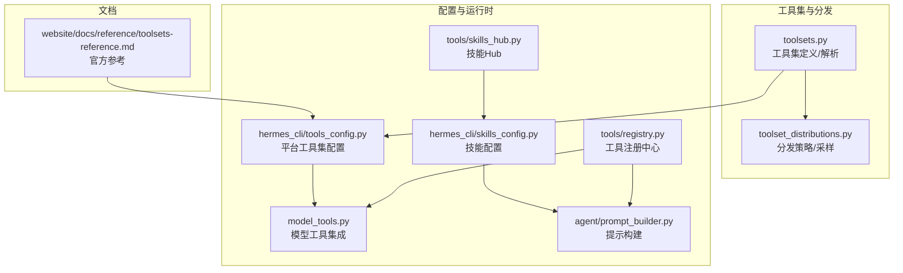
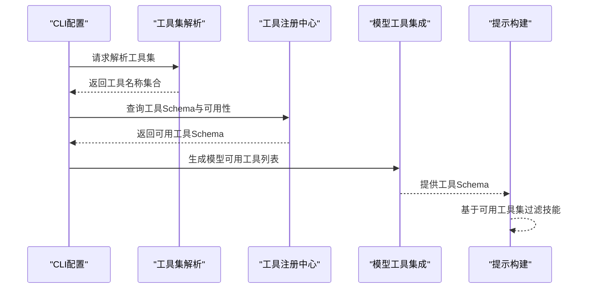
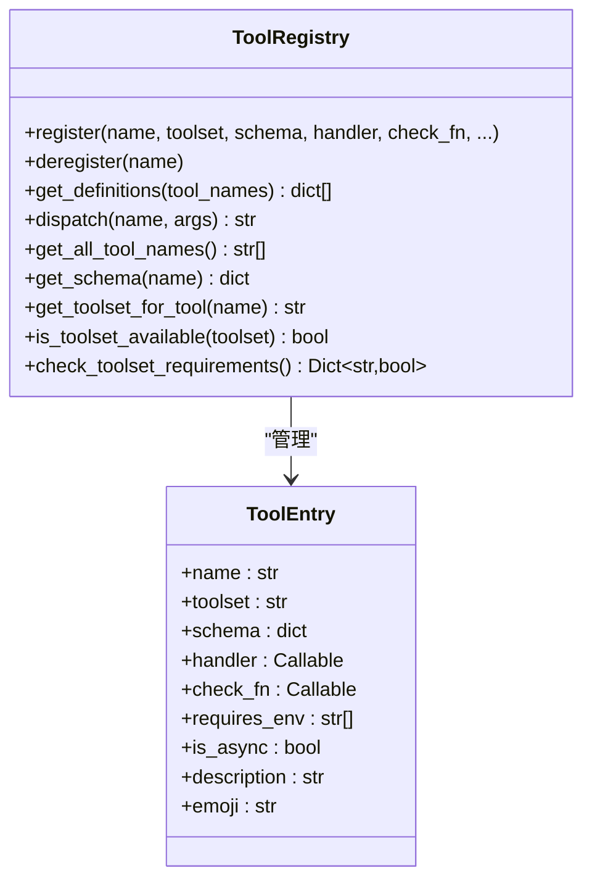
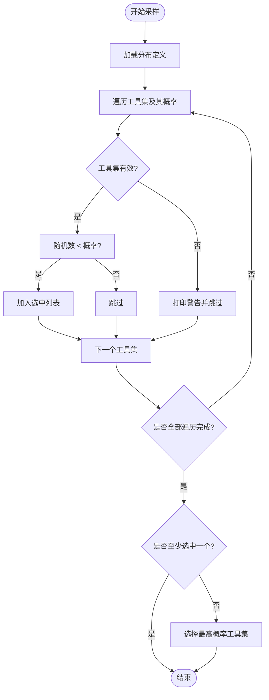
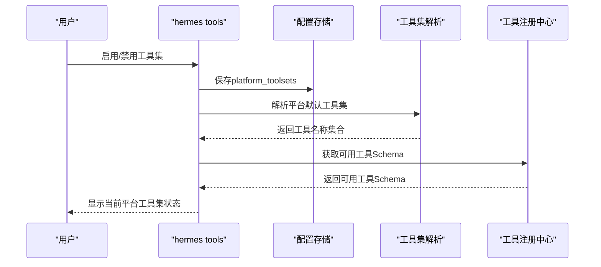
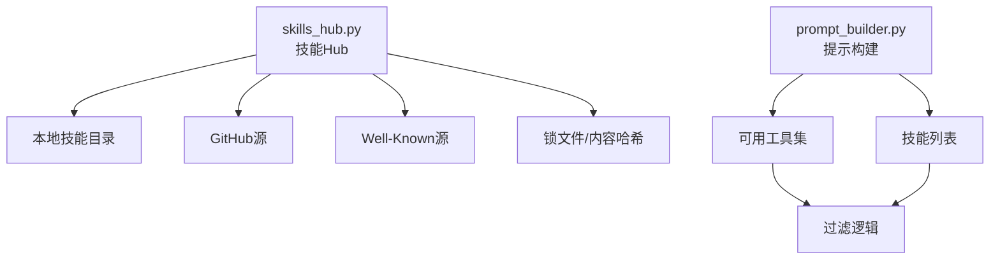
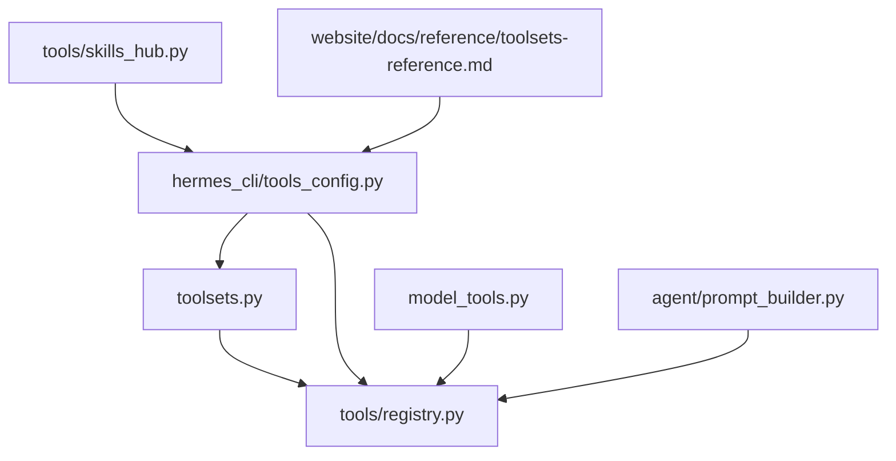

# 工具集管理

<cite>
**本文档引用的文件**
- [toolsets.py](file://toolsets.py)
- [toolset_distributions.py](file://toolset_distributions.py)
- [hermes_cli/tools_config.py](file://hermes_cli/tools_config.py)
- [hermes_cli/skills_config.py](file://hermes_cli/skills_config.py)
- [tools/registry.py](file://tools/registry.py)
- [model_tools.py](file://model_tools.py)
- [agent/prompt_builder.py](file://agent/prompt_builder.py)
- [tools/skills_hub.py](file://tools/skills_hub.py)
- [website/docs/reference/toolsets-reference.md](file://website/docs/reference/toolsets-reference.md)
</cite>

## 目录
1. [简介](#简介)
2. [项目结构](#项目结构)
3. [核心组件](#核心组件)
4. [架构总览](#架构总览)
5. [详细组件分析](#详细组件分析)
6. [依赖分析](#依赖分析)
7. [性能考虑](#性能考虑)
8. [故障排除指南](#故障排除指南)
9. [结论](#结论)
10. [附录](#附录)

## 简介
本文件面向Hermes Agent的工具集管理系统，系统性阐述工具集的概念、组织方式、检查机制、环境依赖管理，以及工具集分发系统（预定义与动态）、配置管理（启用/禁用、权重设置、继承关系）、与技能的关系（自动发现、动态扩展、版本管理），并提供定制指南（创建自定义工具集、配置优化、性能调优）。

## 项目结构
工具集管理涉及以下关键模块：
- 工具集定义与解析：toolsets.py
- 工具集分发系统：toolset_distributions.py
- CLI工具集配置：hermes_cli/tools_config.py
- 技能配置：hermes_cli/skills_config.py
- 工具注册中心：tools/registry.py
- 模型工具集成：model_tools.py
- 技能发现与构建：tools/skills_hub.py
- 提示构建中的技能过滤：agent/prompt_builder.py
- 官方参考文档：website/docs/reference/toolsets-reference.md

图表来源
- [toolsets.py:1-638](file://toolsets.py#L1-L638)
- [toolset_distributions.py:1-365](file://toolset_distributions.py#L1-L365)
- [hermes_cli/tools_config.py:1-800](file://hermes_cli/tools_config.py#L1-L800)
- [hermes_cli/skills_config.py:1-189](file://hermes_cli/skills_config.py#L1-L189)
- [tools/registry.py:1-321](file://tools/registry.py#L1-L321)
- [model_tools.py:258-307](file://model_tools.py#L258-L307)
- [agent/prompt_builder.py:557-588](file://agent/prompt_builder.py#L557-L588)
- [tools/skills_hub.py:1-800](file://tools/skills_hub.py#L1-L800)
- [website/docs/reference/toolsets-reference.md:1-49](file://website/docs/reference/toolsets-reference.md#L1-L49)

章节来源
- [toolsets.py:1-638](file://toolsets.py#L1-L638)
- [toolset_distributions.py:1-365](file://toolset_distributions.py#L1-L365)
- [hermes_cli/tools_config.py:1-800](file://hermes_cli/tools_config.py#L1-L800)
- [hermes_cli/skills_config.py:1-189](file://hermes_cli/skills_config.py#L1-L189)
- [tools/registry.py:1-321](file://tools/registry.py#L1-L321)
- [model_tools.py:258-307](file://model_tools.py#L258-L307)
- [agent/prompt_builder.py:557-588](file://agent/prompt_builder.py#L557-L588)
- [tools/skills_hub.py:1-800](file://tools/skills_hub.py#L1-L800)
- [website/docs/reference/toolsets-reference.md:1-49](file://website/docs/reference/toolsets-reference.md#L1-L49)

## 核心组件
- 工具集定义与解析：提供静态工具集字典、递归解析、组合工具集、插件工具集支持、校验与信息查询等能力。
- 工具集分发系统：定义多种分布策略（概率采样、默认全开、安全模式、浏览器专用等），支持按分布采样工具集。
- CLI工具集配置：统一管理平台工具集（hermes-cli、hermes-telegram等），支持交互式启用/禁用、MCP服务器控制、令牌估算缓存。
- 工具注册中心：集中注册工具、维护工具到工具集映射、可用性检查、错误处理与序列化辅助。
- 模型工具集成：根据启用的工具集解析工具集合，过滤不可用工具，生成模型可用的工具Schema。
- 技能配置与Hub：管理技能启用/禁用、分类切换、从Hub同步与更新技能。
- 提示构建：在生成对话内容时，基于可用工具集与技能状态进行过滤与展示。

章节来源
- [toolsets.py:377-596](file://toolsets.py#L377-L596)
- [toolset_distributions.py:223-301](file://toolset_distributions.py#L223-L301)
- [hermes_cli/tools_config.py:486-622](file://hermes_cli/tools_config.py#L486-L622)
- [tools/registry.py:45-271](file://tools/registry.py#L45-L271)
- [model_tools.py:258-307](file://model_tools.py#L258-L307)
- [hermes_cli/skills_config.py:38-74](file://hermes_cli/skills_config.py#L38-L74)
- [tools/skills_hub.py:1-800](file://tools/skills_hub.py#L1-L800)
- [agent/prompt_builder.py:557-588](file://agent/prompt_builder.py#L557-L588)

## 架构总览
工具集管理采用“定义-解析-应用-验证”的分层架构：
- 定义层：静态工具集与平台工具集、插件工具集。
- 解析层：递归解析组合工具集、插件工具集动态注入。
- 应用层：CLI配置持久化、平台默认工具集、MCP服务器控制。
- 验证层：工具可用性检查、错误处理、令牌估算缓存。
- 运行时层：模型工具集成、提示构建、技能Hub同步。

图表来源
- [hermes_cli/tools_config.py:486-622](file://hermes_cli/tools_config.py#L486-L622)
- [toolsets.py:392-468](file://toolsets.py#L392-L468)
- [tools/registry.py:111-138](file://tools/registry.py#L111-L138)
- [model_tools.py:258-307](file://model_tools.py#L258-L307)
- [agent/prompt_builder.py:557-588](file://agent/prompt_builder.py#L557-L588)

## 详细组件分析

### 工具集定义与解析
- 静态工具集：包含基础工具集（web、terminal、file、vision、image_gen、browser、cronjob、messaging、rl、skills、todo、memory、session_search、clarify、code_execution、delegation、homeassistant）与场景化工具集（如safe、debugging）。
- 平台工具集：CLI、Telegram、Discord、Slack、WhatsApp、Signal、HomeAssistant、Email、Matrix、DingTalk、Feishu、WeCom、Webhook、API Server等，均基于核心工具集组合。
- 组合工具集：通过includes字段实现工具集的组合，支持多层嵌套与循环检测。
- 插件工具集：运行时从工具注册中心动态注入，工具集名不在静态字典中但存在于注册表。
- 校验与信息：提供工具集校验、信息查询、名称枚举、全部工具集合并等接口。

图表来源
- [tools/registry.py:45-271](file://tools/registry.py#L45-L271)

章节来源
- [toolsets.py:68-373](file://toolsets.py#L68-L373)
- [toolsets.py:392-596](file://toolsets.py#L392-L596)
- [tools/registry.py:45-271](file://tools/registry.py#L45-L271)

### 工具集分发系统
- 分布定义：提供多种分布策略，如default（全开）、image_gen、research、science、development、safe、balanced、minimal、terminal_only、terminal_web、creative、reasoning、browser_use、browser_only、browser_tasks、terminal_tasks、mixed_tasks等。
- 采样逻辑：对每个工具集按概率独立采样，若未选中则保留至少一个工具集；支持校验工具集有效性并给出警告。
- 分布校验：提供分布名称校验与列表输出。

图表来源
- [toolset_distributions.py:247-288](file://toolset_distributions.py#L247-L288)

章节来源
- [toolset_distributions.py:29-220](file://toolset_distributions.py#L29-L220)
- [toolset_distributions.py:247-301](file://toolset_distributions.py#L247-L301)

### 工具集配置管理
- 平台工具集：CLI、Telegram、Discord、Slack、WhatsApp、Signal、HomeAssistant、Email、Matrix、DingTalk、Feishu、WeCom、Webhook、API Server等，默认工具集由平台决定。
- 启用/禁用：支持直接启用/禁用工具集或MCP工具，保存到配置文件platform_toolsets键下；支持“no_mcp”哨兵禁用所有MCP服务器。
- 插件工具集：首次出现时默认启用，已知但未列出则视为禁用，避免“超级工具集”覆盖用户选择。
- MCP服务器：可显式允许列表，否则使用全局启用的MCP服务器；支持“no_mcp”选项。
- 令牌估算：首次触发工具发现与令牌估算，结果缓存以提升后续性能。

图表来源
- [hermes_cli/tools_config.py:486-622](file://hermes_cli/tools_config.py#L486-L622)
- [hermes_cli/tools_config.py:752-791](file://hermes_cli/tools_config.py#L752-L791)

章节来源
- [hermes_cli/tools_config.py:69-88](file://hermes_cli/tools_config.py#L69-L88)
- [hermes_cli/tools_config.py:486-622](file://hermes_cli/tools_config.py#L486-L622)
- [hermes_cli/tools_config.py:752-791](file://hermes_cli/tools_config.py#L752-L791)

### 工具集与技能的关系
- 技能工具的自动发现：技能Hub扫描本地技能目录，读取SKILL.md元数据，支持从GitHub、Well-Known Endpoint等源拉取与更新。
- 工具集的动态扩展：工具注册中心支持动态注册/注销工具，工具集检查函数随工具增删而维护；MCP动态发现会清理不再存在的工具集检查。
- 工具集的版本管理：技能Hub通过内容哈希与锁文件记录已安装技能，支持更新检测与差异比较。
- 提示构建中的过滤：提示构建器根据可用工具集与技能状态过滤可展示的技能，确保只呈现可用内容。

图表来源
- [tools/skills_hub.py:1-800](file://tools/skills_hub.py#L1-L800)
- [agent/prompt_builder.py:557-588](file://agent/prompt_builder.py#L557-L588)

章节来源
- [hermes_cli/skills_config.py:38-74](file://hermes_cli/skills_config.py#L38-L74)
- [tools/skills_hub.py:1-800](file://tools/skills_hub.py#L1-L800)
- [agent/prompt_builder.py:557-588](file://agent/prompt_builder.py#L557-L588)

### 工具集定制指南
- 自定义工具集创建：通过运行时创建自定义工具集，指定描述、直接工具与包含的其他工具集。
- 工具集配置优化：合理使用平台默认工具集，结合插件工具集与MCP服务器，避免“超级工具集”覆盖用户选择；利用令牌估算缓存减少重复计算。
- 工具集性能调优：首次触发工具发现与令牌估算后缓存结果；仅在必要时重新解析工具集；避免不必要的工具集组合导致Schema膨胀。

章节来源
- [toolsets.py:548-568](file://toolsets.py#L548-L568)
- [hermes_cli/tools_config.py:752-791](file://hermes_cli/tools_config.py#L752-L791)
- [model_tools.py:258-307](file://model_tools.py#L258-L307)

## 依赖分析
- 工具集定义依赖：工具集解析依赖工具注册中心以支持插件工具集；CLI配置依赖工具集解析与注册中心；模型工具集成依赖注册中心与工具集解析；提示构建依赖注册中心与工具集解析。
- 循环依赖控制：工具注册中心不依赖模型工具或具体工具模块，通过延迟导入避免循环；工具集解析与CLI配置之间通过接口解耦。
- 外部依赖：HTTP客户端用于技能Hub拉取；令牌估算依赖tiktoken；MCP服务器通过命令行或URL连接。

图表来源
- [toolsets.py:1-638](file://toolsets.py#L1-L638)
- [tools/registry.py:1-321](file://tools/registry.py#L1-L321)
- [hermes_cli/tools_config.py:1-800](file://hermes_cli/tools_config.py#L1-L800)
- [model_tools.py:258-307](file://model_tools.py#L258-L307)
- [agent/prompt_builder.py:557-588](file://agent/prompt_builder.py#L557-L588)
- [tools/skills_hub.py:1-800](file://tools/skills_hub.py#L1-L800)
- [website/docs/reference/toolsets-reference.md:1-49](file://website/docs/reference/toolsets-reference.md#L1-L49)

章节来源
- [toolsets.py:1-638](file://toolsets.py#L1-L638)
- [tools/registry.py:1-321](file://tools/registry.py#L1-L321)
- [hermes_cli/tools_config.py:1-800](file://hermes_cli/tools_config.py#L1-L800)
- [model_tools.py:258-307](file://model_tools.py#L258-L307)
- [agent/prompt_builder.py:557-588](file://agent/prompt_builder.py#L557-L588)
- [tools/skills_hub.py:1-800](file://tools/skills_hub.py#L1-L800)
- [website/docs/reference/toolsets-reference.md:1-49](file://website/docs/reference/toolsets-reference.md#L1-L49)

## 性能考虑
- 令牌估算缓存：首次触发工具发现与令牌估算后缓存结果，避免重复计算。
- 工具集解析去重：解析多个工具集时使用集合去重，减少重复工具数量。
- 工具可用性检查：工具注册中心对check_fn异常进行捕获，避免崩溃并返回False，保证稳定性。
- MCP动态清理：当MCP服务器通知工具变更时，清理不再存在的工具集检查，保持检查函数最小化。

章节来源
- [hermes_cli/tools_config.py:752-791](file://hermes_cli/tools_config.py#L752-L791)
- [toolsets.py:452-468](file://toolsets.py#L452-L468)
- [tools/registry.py:111-138](file://tools/registry.py#L111-L138)
- [tools/registry.py:90-105](file://tools/registry.py#L90-L105)

## 故障排除指南
- 工具集无效：当工具集不存在或无效时，分发系统会打印警告并跳过；可通过validate_toolset确认工具集有效性。
- 工具集循环依赖：工具集解析对循环依赖进行检测并返回空集合，避免无限递归。
- 工具可用性异常：工具注册中心对check_fn异常进行捕获，标记工具集不可用而非崩溃。
- MCP服务器问题：通过“no_mcp”哨兵禁用所有MCP服务器；检查MCP服务器配置与连接状态。
- 技能Hub网络问题：技能Hub依赖HTTP客户端，网络异常时会跳过该源；可切换到其他源或离线模式。

章节来源
- [toolset_distributions.py:270-274](file://toolset_distributions.py#L270-L274)
- [toolsets.py:422-423](file://toolsets.py#L422-L423)
- [tools/registry.py:123-134](file://tools/registry.py#L123-L134)
- [hermes_cli/tools_config.py:557-578](file://hermes_cli/tools_config.py#L557-L578)
- [tools/skills_hub.py:417-421](file://tools/skills_hub.py#L417-L421)

## 结论
Hermes Agent的工具集管理系统通过清晰的分层设计实现了工具集的灵活定义、组合、分发与运行时验证。静态工具集与平台工具集提供了稳定的基线，插件工具集与MCP动态发现增强了扩展性。CLI配置与令牌估算缓存提升了用户体验与性能。技能Hub与提示构建进一步完善了工具集与技能的协同工作流。建议在生产环境中合理使用分发策略与配置缓存，并定期同步技能Hub以获得最新技能资源。

## 附录
- 官方参考文档：[Toolsets Reference:1-49](file://website/docs/reference/toolsets-reference.md#L1-L49)
- 工具集示例与说明：参见toolsets.py中的工具集定义与注释
- 分发策略示例：参见toolset_distributions.py中的分布定义与采样逻辑