# 核心工具实现

<cite>
**本文档引用的文件**
- [terminal_tool.py](file://tools/terminal_tool.py)
- [file_tools.py](file://tools/file_tools.py)
- [web_tools.py](file://tools/web_tools.py)
- [send_message_tool.py](file://tools/send_message_tool.py)
</cite>

## 目录
1. [简介](#简介)
2. [项目结构](#项目结构)
3. [核心组件](#核心组件)
4. [架构概览](#架构概览)
5. [详细组件分析](#详细组件分析)
6. [依赖分析](#依赖分析)
7. [性能考虑](#性能考虑)
8. [故障排除指南](#故障排除指南)
9. [结论](#结论)

## 简介

Hermes Agent 的核心工具实现提供了四个关键功能模块，每个模块都经过精心设计以确保安全性、可靠性和易用性：

- **终端工具 (TerminalTool)**：支持本地、Docker、Modal、SSH、Singularity 和 Daytona 环境的命令执行
- **文件操作工具 (FileTools)**：提供安全的文件读写、搜索和编辑功能
- **网络请求工具 (WebTools)**：集成多种搜索引擎和内容提取服务
- **消息发送工具 (SendMessageTool)**：跨平台消息传递，支持多种通信渠道

这些工具共同构成了 Hermes Agent 的基础能力，为智能代理提供了与环境交互的强大接口。

## 项目结构

Hermes Agent 的工具系统采用模块化设计，每个工具都是独立的 Python 模块，具有清晰的职责边界：

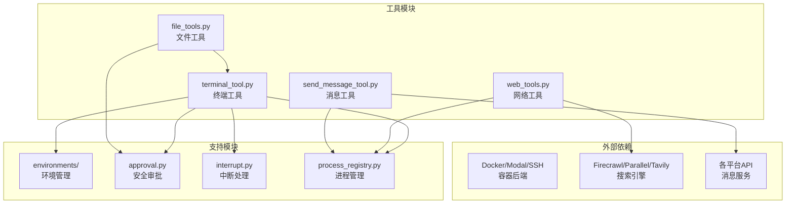

**图表来源**
- [terminal_tool.py:1-50](file://tools/terminal_tool.py#L1-L50)
- [file_tools.py:1-20](file://tools/file_tools.py#L1-L20)
- [web_tools.py:1-50](file://tools/web_tools.py#L1-L50)
- [send_message_tool.py:1-20](file://tools/send_message_tool.py#L1-L20)

## 核心组件

### 终端工具 (TerminalTool)

终端工具是 Hermes Agent 的核心执行引擎，支持多种执行环境：

#### 主要特性
- **多环境支持**：本地、Docker、Modal、SSH、Singularity、Daytona
- **安全控制**：危险命令检测、sudo 密码管理、工作目录验证
- **进程管理**：后台任务、超时控制、中断处理
- **资源管理**：自动清理、生命周期管理

#### 关键配置
- `TERMINAL_ENV`：选择执行环境（local/docker/modal/ssh）
- `TERMINAL_TIMEOUT`：默认超时时间
- `TERMINAL_LIFETIME_SECONDS`：环境生命周期
- `TERMINAL_CWD`：工作目录设置

**章节来源**
- [terminal_tool.py:495-571](file://tools/terminal_tool.py#L495-L571)
- [terminal_tool.py:991-1001](file://tools/terminal_tool.py#L991-L1001)

### 文件操作工具 (FileTools)

文件工具提供安全的文件系统操作能力：

#### 核心功能
- **文件读取**：带分页的文本文件读取，字符数限制
- **文件写入**：安全的文件覆盖写入
- **内容搜索**：基于 ripgrep 的高效搜索
- **文件补丁**：精确的内容替换和 V4A 多文件补丁

#### 安全机制
- **设备文件保护**：阻止读取特殊设备文件
- **敏感路径检查**：防止修改系统关键文件
- **重复读取检测**：避免循环读取
- **内容脱敏**：自动隐藏敏感信息

**章节来源**
- [file_tools.py:279-436](file://tools/file_tools.py#L279-L436)
- [file_tools.py:559-581](file://tools/file_tools.py#L559-L581)

### 网络请求工具 (WebTools)

网络工具集成了多个第三方服务提供商：

#### 支持的后端
- **Firecrawl**：网页抓取和内容提取
- **Parallel**：AI 驱动的搜索和提取
- **Tavily**：综合搜索和内容提取
- **Exa**：高性能搜索 API

#### 智能处理
- **LLM 后处理**：使用 Gemini 3 Flash 进行内容摘要
- **内容压缩**：大幅减少 token 使用量
- **并发处理**：异步并行处理多个 URL
- **错误重试**：智能重试机制

**章节来源**
- [web_tools.py:1034-1162](file://tools/web_tools.py#L1034-L1162)
- [web_tools.py:1164-1487](file://tools/web_tools.py#L1164-L1487)

### 消息发送工具 (SendMessageTool)

消息工具支持跨平台的消息传递：

#### 支持的平台
- **Telegram**：完整的媒体支持
- **Discord**：服务器和频道支持
- **Slack**：工作区集成
- **WhatsApp**：本地桥接
- **Signal**：隐私优先
- **其他平台**：Email、SMS、Matrix、WeCom 等

#### 智能特性
- **目标解析**：将人类可读名称转换为技术 ID
- **媒体处理**：支持图片、视频、音频和文档
- **长度限制**：自动分片处理长消息
- **重复检测**：避免重复发送

**章节来源**
- [send_message_tool.py:80-88](file://tools/send_message_tool.py#L80-L88)
- [send_message_tool.py:302-411](file://tools/send_message_tool.py#L302-L411)

## 架构概览

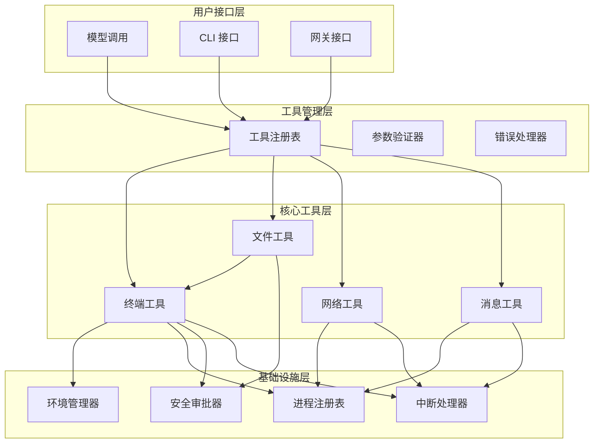

**图表来源**
- [terminal_tool.py:1553-1597](file://tools/terminal_tool.py#L1553-L1597)
- [file_tools.py:820-824](file://tools/file_tools.py#L820-L824)
- [web_tools.py:1-50](file://tools/web_tools.py#L1-L50)
- [send_message_tool.py:942-953](file://tools/send_message_tool.py#L942-L953)

## 详细组件分析

### 终端工具深度分析

#### 命令执行流程

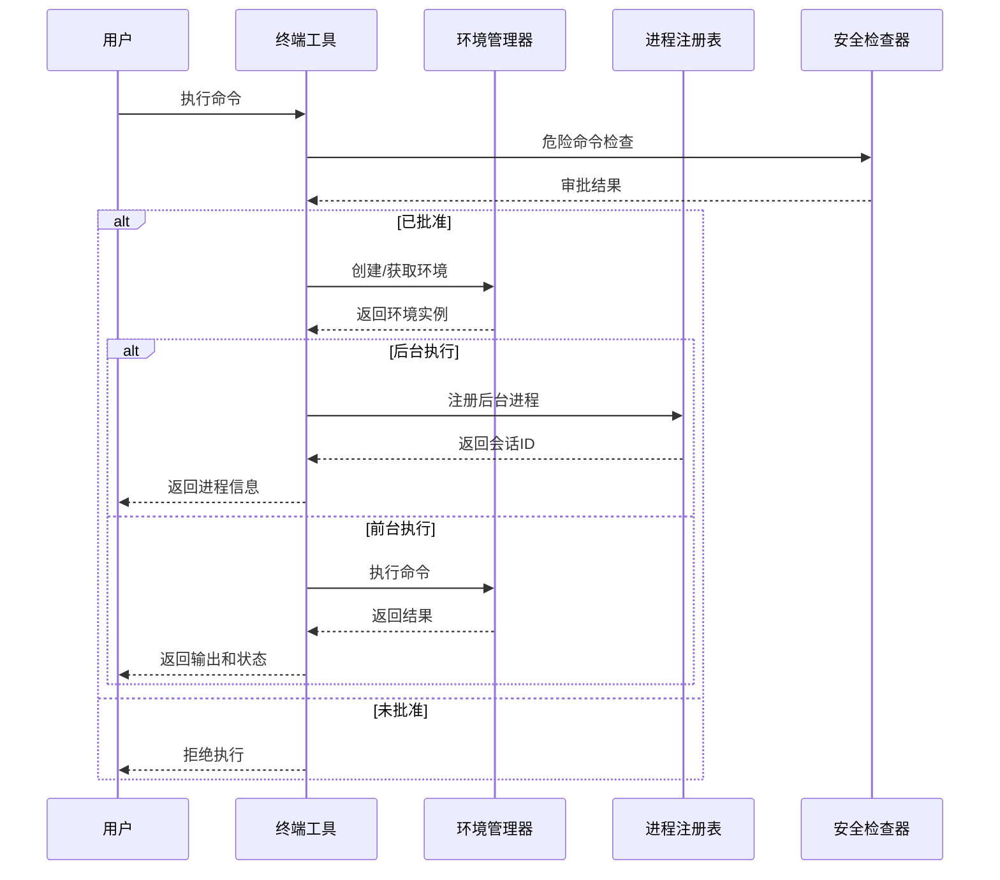

**图表来源**
- [terminal_tool.py:1148-1184](file://tools/terminal_tool.py#L1148-L1184)
- [terminal_tool.py:1200-1297](file://tools/terminal_tool.py#L1200-L1297)

#### 超时控制机制

终端工具实现了多层次的超时控制：

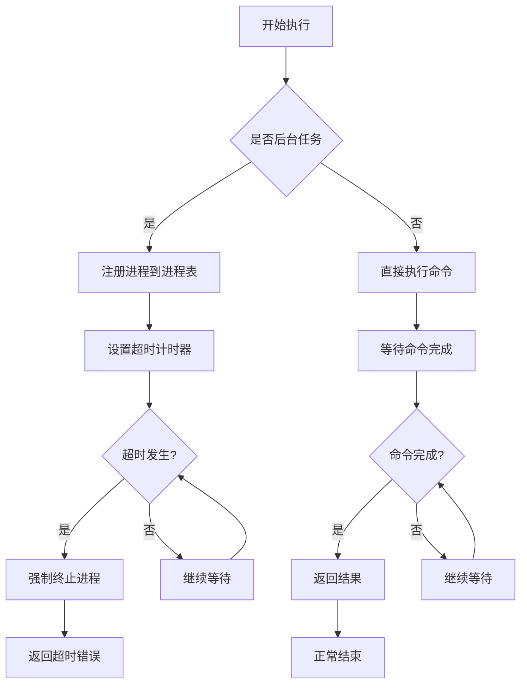

**图表来源**
- [terminal_tool.py:1305-1344](file://tools/terminal_tool.py#L1305-L1344)
- [terminal_tool.py:1315-1340](file://tools/terminal_tool.py#L1315-L1340)

**章节来源**
- [terminal_tool.py:991-1400](file://tools/terminal_tool.py#L991-L1400)

### 文件操作工具深度分析

#### 文件读取安全机制

文件工具实现了多层安全保护：

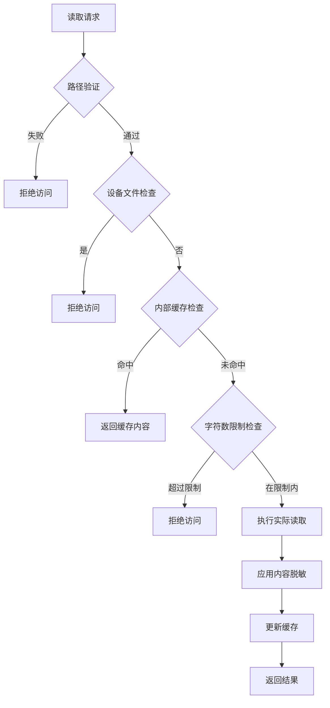

**图表来源**
- [file_tools.py:279-436](file://tools/file_tools.py#L279-L436)
- [file_tools.py:346-378](file://tools/file_tools.py#L346-L378)

#### 文件写入安全检查

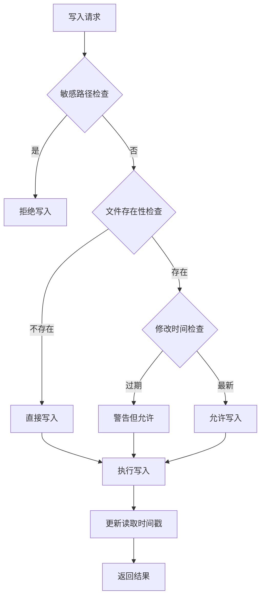

**图表来源**
- [file_tools.py:559-581](file://tools/file_tools.py#L559-L581)
- [file_tools.py:528-557](file://tools/file_tools.py#L528-L557)

**章节来源**
- [file_tools.py:149-267](file://tools/file_tools.py#L149-L267)
- [file_tools.py:559-637](file://tools/file_tools.py#L559-L637)

### 网络请求工具深度分析

#### 内容提取和处理流程

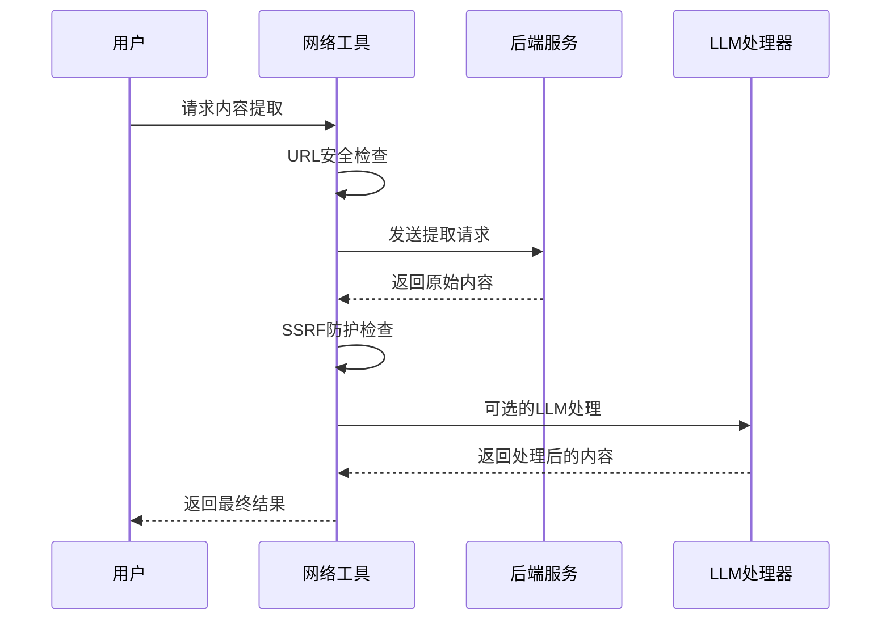

**图表来源**
- [web_tools.py:1220-1235](file://tools/web_tools.py#L1220-L1235)
- [web_tools.py:1252-1356](file://tools/web_tools.py#L1252-L1356)

#### LLM内容处理策略

网络工具采用了智能的内容处理策略：

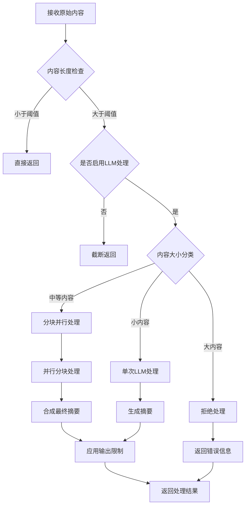

**图表来源**
- [web_tools.py:477-575](file://tools/web_tools.py#L477-L575)
- [web_tools.py:693-838](file://tools/web_tools.py#L693-L838)

**章节来源**
- [web_tools.py:1034-1487](file://tools/web_tools.py#L1034-L1487)

### 消息发送工具深度分析

#### 跨平台消息路由

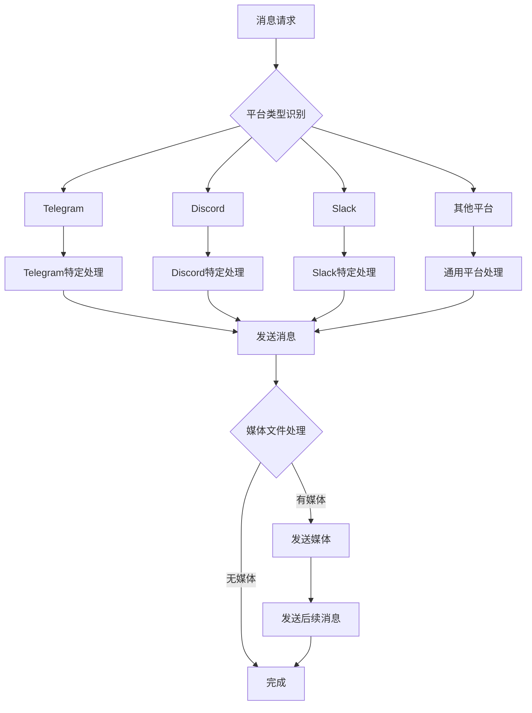

**图表来源**
- [send_message_tool.py:302-411](file://tools/send_message_tool.py#L302-L411)
- [send_message_tool.py:413-536](file://tools/send_message_tool.py#L413-L536)

#### 消息长度管理和分片

消息工具实现了智能的长度管理：

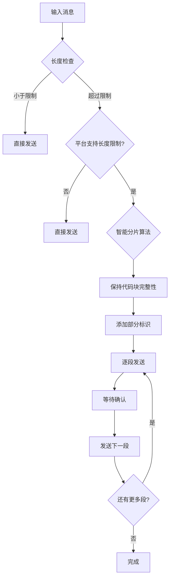

**图表来源**
- [send_message_tool.py:333-340](file://tools/send_message_tool.py#L333-L340)
- [send_message_tool.py:341-410](file://tools/send_message_tool.py#L341-L410)

**章节来源**
- [send_message_tool.py:80-953](file://tools/send_message_tool.py#L80-L953)

## 依赖分析

### 组件间依赖关系

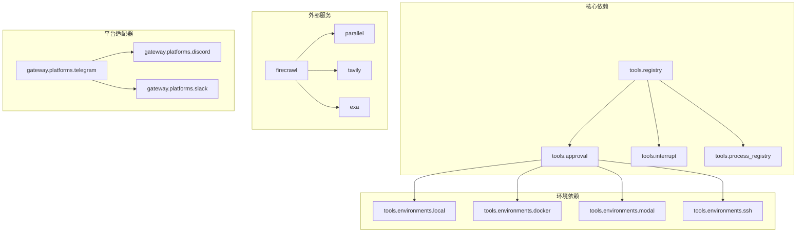

**图表来源**
- [terminal_tool.py:68-76](file://tools/terminal_tool.py#L68-L76)
- [file_tools.py:10-11](file://tools/file_tools.py#L10-L11)
- [web_tools.py:49-64](file://tools/web_tools.py#L49-L64)
- [send_message_tool.py:15-17](file://tools/send_message_tool.py#L15-L17)

### 错误处理和恢复机制

每个工具都实现了完善的错误处理策略：

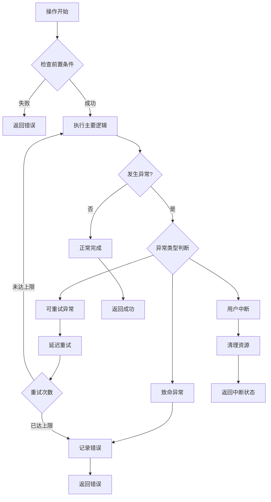

**图表来源**
- [terminal_tool.py:1305-1344](file://tools/terminal_tool.py#L1305-L1344)
- [web_tools.py:556-575](file://tools/web_tools.py#L556-L575)

**章节来源**
- [terminal_tool.py:1389-1400](file://tools/terminal_tool.py#L1389-L1400)
- [file_tools.py:575-581](file://tools/file_tools.py#L575-L581)
- [web_tools.py:1479-1487](file://tools/web_tools.py#L1479-L1487)

## 性能考虑

### 资源优化策略

1. **环境复用**：通过会话级缓存避免重复创建执行环境
2. **文件操作缓存**：智能缓存机制减少重复读取
3. **异步处理**：网络请求和消息发送采用异步模式
4. **内存管理**：及时清理临时文件和缓存数据

### 并发控制

- **线程安全**：使用锁机制保护共享资源
- **进程隔离**：每个任务使用独立的执行环境
- **资源限制**：设置合理的超时和内存限制

## 故障排除指南

### 常见问题诊断

#### 终端工具问题
- **环境不可用**：检查 `TERMINAL_ENV` 配置和依赖安装
- **权限问题**：验证 sudo 权限和用户权限
- **超时问题**：调整 `TERMINAL_TIMEOUT` 设置

#### 文件工具问题
- **读取限制**：使用 `offset` 和 `limit` 参数分页读取
- **权限拒绝**：检查文件权限和路径安全性
- **缓存问题**：使用 `clear_file_ops_cache()` 清理缓存

#### 网络工具问题
- **API密钥**：验证相关环境变量设置
- **网络连接**：检查防火墙和代理设置
- **内容过大**：调整 `min_length` 参数或禁用LLM处理

#### 消息工具问题
- **平台配置**：检查平台特定的配置要求
- **认证失败**：验证 API 密钥和令牌
- **速率限制**：遵守各平台的速率限制规则

**章节来源**
- [terminal_tool.py:1402-1504](file://tools/terminal_tool.py#L1402-L1504)
- [file_tools.py:270-277](file://tools/file_tools.py#L270-L277)
- [web_tools.py:160-172](file://tools/web_tools.py#L160-L172)
- [send_message_tool.py:930-940](file://tools/send_message_tool.py#L930-L940)

## 结论

Hermes Agent 的核心工具实现展现了现代 AI 代理系统的最佳实践：

1. **安全性优先**：通过多层安全检查和权限控制确保系统安全
2. **可靠性保障**：完善的错误处理和恢复机制
3. **性能优化**：智能缓存和异步处理提升效率
4. **扩展性强**：模块化设计支持新功能的快速集成

这些工具为 Hermes Agent 提供了坚实的基础，使其能够在各种环境中可靠地执行复杂的任务，同时保持高度的安全性和可用性。通过标准化的接口设计和严格的错误处理，这些工具为上层应用提供了稳定可靠的执行环境。