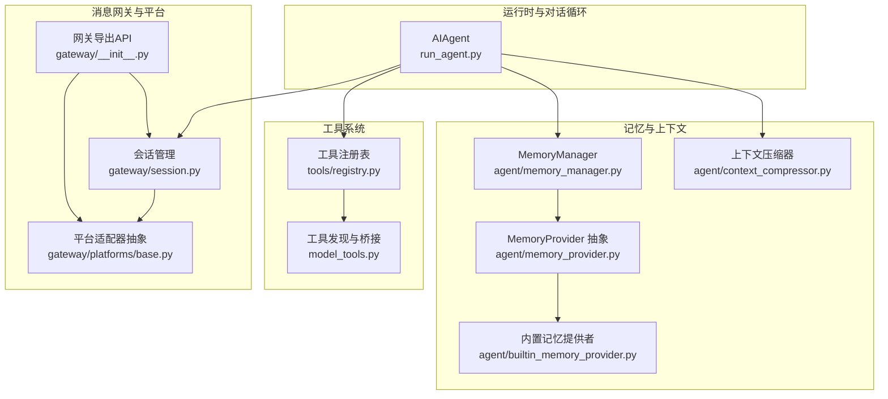
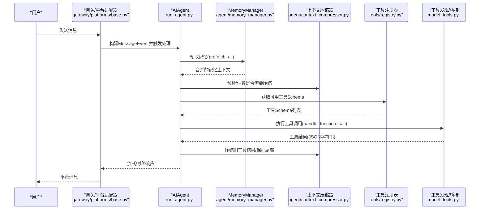
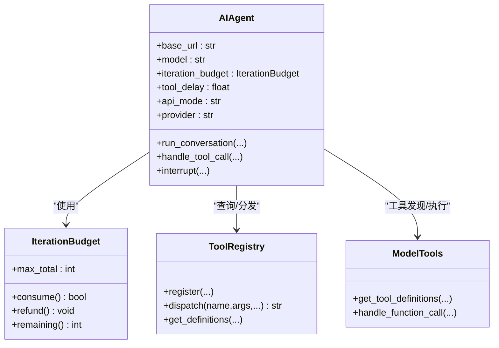
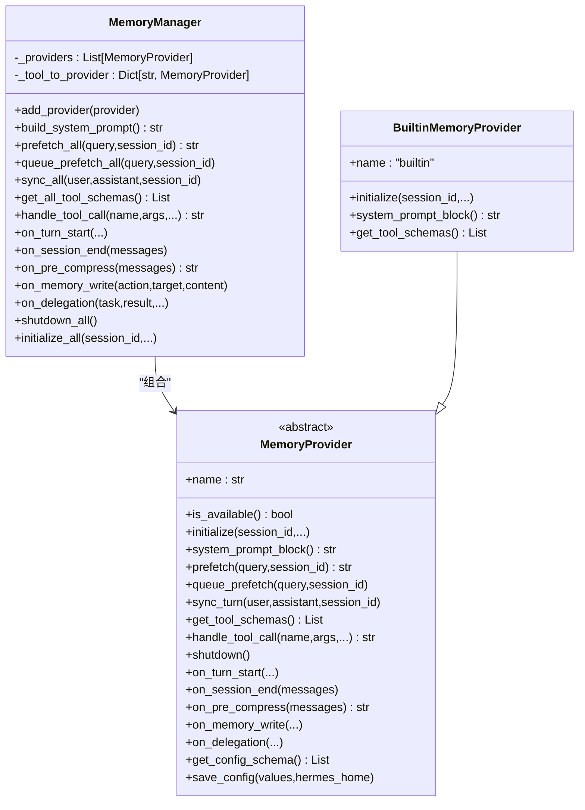
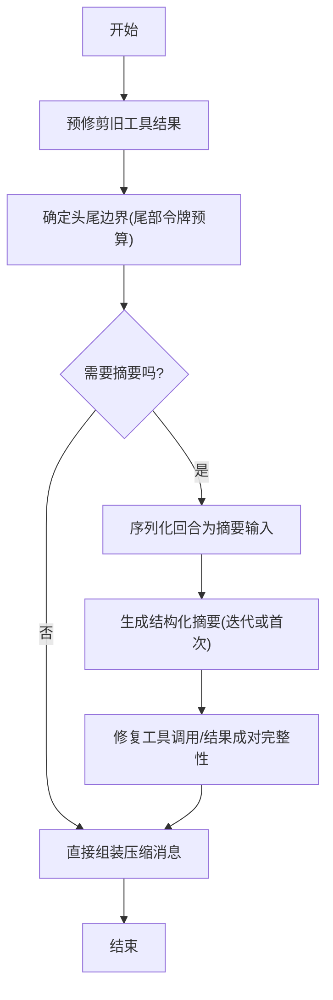
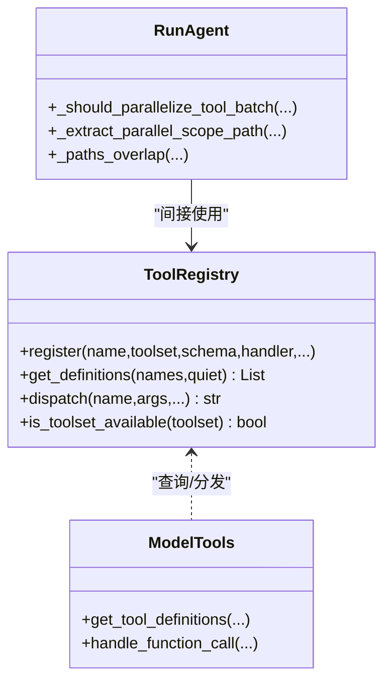
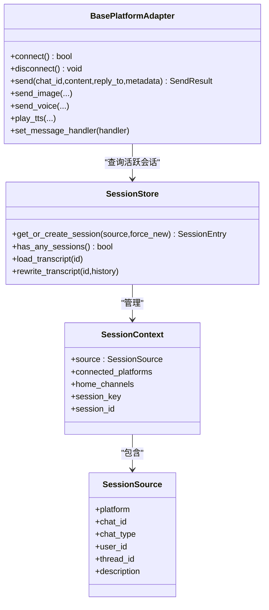
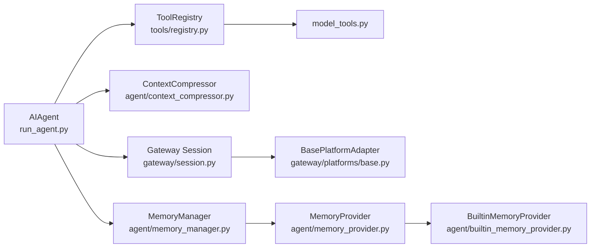

# 核心组件

<cite>
**本文引用的文件**
- [run_agent.py](file://run_agent.py)
- [agent/memory_manager.py](file://agent/memory_manager.py)
- [agent/context_compressor.py](file://agent/context_compressor.py)
- [agent/memory_provider.py](file://agent/memory_provider.py)
- [agent/builtin_memory_provider.py](file://agent/builtin_memory_provider.py)
- [gateway/session.py](file://gateway/session.py)
- [gateway/platforms/base.py](file://gateway/platforms/base.py)
- [gateway/__init__.py](file://gateway/__init__.py)
- [tools/registry.py](file://tools/registry.py)
- [model_tools.py](file://model_tools.py)
- [tools/memory_tool.py](file://tools/memory_tool.py)
</cite>

## 目录
1. [引言](#引言)
2. [项目结构](#项目结构)
3. [核心组件](#核心组件)
4. [架构总览](#架构总览)
5. [详细组件分析](#详细组件分析)
6. [依赖分析](#依赖分析)
7. [性能考虑](#性能考虑)
8. [故障排查指南](#故障排查指南)
9. [结论](#结论)

## 引言
本设计文档聚焦于Hermes Agent的核心组件，围绕代理引擎（AIAgent）的对话循环与工具调用、上下文压缩算法、内存管理与持久化、工具系统架构、消息网关与平台适配器等主题，提供代码级的结构、流程与接口说明，并辅以可视化图示帮助读者快速理解各模块之间的协作关系。

## 项目结构
Hermes Agent采用分层与模块化组织：
- 运行时与对话循环：run_agent.py 提供 AIAgent 主类，负责模型调用、工具调度、迭代预算、流式输出、错误处理与回调。
- 记忆与上下文：agent/ 下的 MemoryManager、MemoryProvider、BuiltinMemoryProvider 负责多源记忆的注册、预取、同步与持久化；ContextCompressor 实现长上下文的自动压缩。
- 工具系统：tools/registry.py 作为统一注册表，model_tools.py 作为工具发现与异步桥接层，支撑 run_agent 的函数调用能力。
- 消息网关与平台适配：gateway/ 提供会话管理、动态系统提示注入、交付路由；gateway/platforms/base.py 定义平台适配器抽象，具体平台在 platforms/ 下实现。

图表来源
- [run_agent.py:1-200](file://run_agent.py#L1-L200)
- [agent/memory_manager.py:1-120](file://agent/memory_manager.py#L1-L120)
- [agent/memory_provider.py:1-120](file://agent/memory_provider.py#L1-L120)
- [agent/builtin_memory_provider.py:1-115](file://agent/builtin_memory_provider.py#L1-L115)
- [agent/context_compressor.py:1-120](file://agent/context_compressor.py#L1-L120)
- [tools/registry.py:1-120](file://tools/registry.py#L1-L120)
- [model_tools.py:1-120](file://model_tools.py#L1-L120)
- [gateway/session.py:1-120](file://gateway/session.py#L1-L120)
- [gateway/platforms/base.py:1-120](file://gateway/platforms/base.py#L1-L120)
- [gateway/__init__.py:1-36](file://gateway/__init__.py#L1-L36)

章节来源
- [run_agent.py:1-200](file://run_agent.py#L1-L200)
- [gateway/__init__.py:1-36](file://gateway/__init__.py#L1-L36)

## 核心组件
本节概述关键组件职责与交互要点：
- AIAgent：封装模型客户端、工具调度、迭代预算、流式输出、日志与回调、上下文压力与预算警告、大结果落盘与预处理、子代理委托与中断传播。
- MemoryManager：统一编排内置与外部记忆提供者，提供系统提示拼装、预取、同步、工具Schema聚合与路由、生命周期钩子。
- MemoryProvider 抽象：定义提供者生命周期与可选钩子；BuiltinMemoryProvider 将 MEMORY.md/USER.md 通过工具Schema暴露为“非标准”工具。
- ContextCompressor：基于工具输出修剪与结构化摘要的长上下文压缩器，保护头尾、按比例分配摘要预算、迭代更新摘要。
- 工具系统：tools/registry.py 统一注册与分发；model_tools.py 负责工具发现、可用性检查与异步桥接。
- 网关与平台：gateway/session.py 管理会话键生成、过期策略、SQLite/JSONL 存储；platforms/base.py 定义平台适配器接口与媒体缓存；gateway/__init__.py 汇总导出。

章节来源
- [run_agent.py:470-760](file://run_agent.py#L470-L760)
- [agent/memory_manager.py:72-140](file://agent/memory_manager.py#L72-L140)
- [agent/memory_provider.py:42-140](file://agent/memory_provider.py#L42-L140)
- [agent/builtin_memory_provider.py:24-115](file://agent/builtin_memory_provider.py#L24-L115)
- [agent/context_compressor.py:53-140](file://agent/context_compressor.py#L53-L140)
- [tools/registry.py:45-120](file://tools/registry.py#L45-L120)
- [model_tools.py:132-200](file://model_tools.py#L132-L200)
- [gateway/session.py:503-760](file://gateway/session.py#L503-L760)
- [gateway/platforms/base.py:470-620](file://gateway/platforms/base.py#L470-L620)
- [gateway/__init__.py:11-36](file://gateway/__init__.py#L11-L36)

## 架构总览
下图展示从用户消息到响应返回的关键路径，以及与工具、记忆、上下文压缩、网关的交互。

图表来源
- [gateway/platforms/base.py:598-632](file://gateway/platforms/base.py#L598-L632)
- [run_agent.py:470-760](file://run_agent.py#L470-L760)
- [agent/memory_manager.py:172-200](file://agent/memory_manager.py#L172-L200)
- [agent/context_compressor.py:136-140](file://agent/context_compressor.py#L136-L140)
- [tools/registry.py:111-139](file://tools/registry.py#L111-L139)
- [model_tools.py:132-200](file://model_tools.py#L132-L200)

## 详细组件分析

### 代理引擎（AIAgent）设计
- 对话循环与迭代预算
  - 使用线程安全的 IterationBudget 控制总迭代次数，支持父/子代理独立预算与回退。
  - 在每次 LLM 调用后更新活动状态，用于超时与进度通知。
- 工具调用机制
  - 通过 model_tools.get_tool_definitions 与 tools/registry 获取可用工具Schema；handle_function_call 分发执行。
  - 支持同步/异步工具处理器，内部通过 _run_async 桥接，避免“事件循环已关闭”问题。
  - 大型工具结果自动落盘并返回简短预览，防止上下文爆炸。
- 上下文压力与预算警告
  - 在工具结果中注入预算压力提示（非消息结构），并在历史中清理，避免泄漏。
- 错误处理与中断
  - 提供 _SafeWriter 包装标准输出，避免管道断开导致崩溃。
  - 支持中断请求与子代理中断传播，保证多线程/子任务安全退出。
- 生命周期与回调
  - 支持多种回调（工具进度、思考、推理、状态、流增量等），便于平台集成与可观测性。

图表来源
- [run_agent.py:470-760](file://run_agent.py#L470-L760)
- [run_agent.py:165-207](file://run_agent.py#L165-L207)
- [tools/registry.py:144-162](file://tools/registry.py#L144-L162)
- [model_tools.py:132-200](file://model_tools.py#L132-L200)

章节来源
- [run_agent.py:165-207](file://run_agent.py#L165-L207)
- [run_agent.py:262-332](file://run_agent.py#L262-L332)
- [run_agent.py:408-468](file://run_agent.py#L408-L468)
- [run_agent.py:470-760](file://run_agent.py#L470-L760)
- [tools/registry.py:144-162](file://tools/registry.py#L144-L162)
- [model_tools.py:132-200](file://model_tools.py#L132-L200)

### 内存管理系统设计
- 提供者注册与路由
  - MemoryManager 统一注册内置与外部提供者，限制最多一个外部提供者，避免Schema膨胀与冲突。
  - 建立 tool 名称到提供者的映射，精确路由工具调用。
- 系统提示与预取
  - 收集所有提供者的静态提示块；在每轮开始前进行预取，合并上下文文本。
  - 预取队列支持后台预取，提升下一轮响应速度。
- 同步与生命周期
  - 每轮结束后同步用户与助手内容；支持 on_turn_start/on_session_end/on_pre_compress/on_memory_write/on_delegation 等钩子。
- 内置记忆提供者
  - BuiltinMemoryProvider 将 MEMORY.md/USER.md 作为系统提示注入，不参与标准工具Schema，避免重复暴露。

图表来源
- [agent/memory_manager.py:72-368](file://agent/memory_manager.py#L72-L368)
- [agent/memory_provider.py:42-232](file://agent/memory_provider.py#L42-L232)
- [agent/builtin_memory_provider.py:24-115](file://agent/builtin_memory_provider.py#L24-L115)

章节来源
- [agent/memory_manager.py:72-368](file://agent/memory_manager.py#L72-L368)
- [agent/memory_provider.py:42-232](file://agent/memory_provider.py#L42-L232)
- [agent/builtin_memory_provider.py:24-115](file://agent/builtin_memory_provider.py#L24-L115)

### 上下文压缩算法实现
- 目标与策略
  - 保护头尾消息，按阈值比例分配摘要预算，工具输出优先修剪，随后结构化摘要，支持迭代更新。
- 关键步骤
  - 预修剪：仅对超过阈值长度的工具结果替换占位符，避免昂贵LLM调用。
  - 边界确定：基于尾部令牌预算而非固定消息数，确保最新上下文稳定保留。
  - 结构化摘要：使用模板化的摘要输入，结合上次摘要进行迭代更新。
  - 成对完整性：修复压缩后残留的孤儿工具结果/调用，保证消息序列合法。
- 性能与稳定性
  - 通过冷却时间避免摘要失败后的反复尝试；记录压缩统计信息，便于诊断。

图表来源
- [agent/context_compressor.py:155-186](file://agent/context_compressor.py#L155-L186)
- [agent/context_compressor.py:510-560](file://agent/context_compressor.py#L510-L560)
- [agent/context_compressor.py:253-390](file://agent/context_compressor.py#L253-L390)
- [agent/context_compressor.py:412-471](file://agent/context_compressor.py#L412-L471)
- [agent/context_compressor.py:565-697](file://agent/context_compressor.py#L565-L697)

章节来源
- [agent/context_compressor.py:53-140](file://agent/context_compressor.py#L53-L140)
- [agent/context_compressor.py:155-186](file://agent/context_compressor.py#L155-L186)
- [agent/context_compressor.py:510-560](file://agent/context_compressor.py#L510-L560)
- [agent/context_compressor.py:253-390](file://agent/context_compressor.py#L253-L390)
- [agent/context_compressor.py:412-471](file://agent/context_compressor.py#L412-L471)
- [agent/context_compressor.py:565-697](file://agent/context_compressor.py#L565-L697)

### 工具系统架构
- 注册与分发
  - tools/registry.py 提供 ToolEntry 与 ToolRegistry，集中注册工具Schema、处理器、可用性检查与描述。
  - model_tools.py 在导入阶段触发工具模块自注册，提供 get_tool_definitions 与 handle_function_call。
- 并发执行策略
  - run_agent 中定义只允许并行的安全工具集合、路径隔离工具与互斥工具，批量工具调用前进行并行可行性判断。
- 安全与防护
  - 工具返回必须为JSON字符串；提供 tool_error/tool_result 辅助函数统一错误格式。
  - 内置内存内容扫描，阻断提示注入与敏感泄露模式。

图表来源
- [tools/registry.py:45-272](file://tools/registry.py#L45-L272)
- [model_tools.py:132-200](file://model_tools.py#L132-L200)
- [run_agent.py:262-332](file://run_agent.py#L262-L332)

章节来源
- [tools/registry.py:45-272](file://tools/registry.py#L45-L272)
- [model_tools.py:132-200](file://model_tools.py#L132-L200)
- [run_agent.py:262-332](file://run_agent.py#L262-L332)

### 消息网关与平台适配器
- 会话管理
  - SessionSource 描述消息来源（平台、聊天类型、线程等）；SessionContext 动态系统提示注入。
  - SessionStore 支持 SQLite 与 JSONL 双存储，维护会话键、会话ID、令牌统计、过期策略与自动重置。
- 平台适配器
  - BasePlatformAdapter 定义连接、发送、编辑、打字指示、媒体缓存（图片/音频/文档）、致命错误标记与通知。
  - 具体平台在 platforms/ 下实现，遵循统一接口。
- 动态上下文与交付路由
  - 通过 build_session_context_prompt 注入当前会话上下文与交付选项，支持多平台 home channel 默认投递。

图表来源
- [gateway/session.py:73-156](file://gateway/session.py#L73-L156)
- [gateway/session.py:158-190](file://gateway/session.py#L158-L190)
- [gateway/session.py:503-760](file://gateway/session.py#L503-L760)
- [gateway/platforms/base.py:470-620](file://gateway/platforms/base.py#L470-L620)

章节来源
- [gateway/session.py:73-156](file://gateway/session.py#L73-L156)
- [gateway/session.py:158-190](file://gateway/session.py#L158-L190)
- [gateway/session.py:503-760](file://gateway/session.py#L503-L760)
- [gateway/platforms/base.py:470-620](file://gateway/platforms/base.py#L470-L620)
- [gateway/__init__.py:11-36](file://gateway/__init__.py#L11-L36)

## 依赖分析
- 组件耦合
  - AIAgent 依赖 MemoryManager、ContextCompressor、ToolRegistry/model_tools、Gateway Session。
  - MemoryManager 依赖 MemoryProvider 抽象与具体提供者（内置/插件）。
  - 工具系统通过 registry 与 model_tools 解耦工具实现与调用方。
- 外部依赖
  - 网关平台适配器依赖 httpx、平台SDK与本地缓存目录。
  - 工具执行可能依赖外部服务（如浏览器、终端、TTS、STT等），通过异步桥接与线程池管理。

图表来源
- [run_agent.py:470-760](file://run_agent.py#L470-L760)
- [agent/memory_manager.py:72-140](file://agent/memory_manager.py#L72-L140)
- [agent/context_compressor.py:53-140](file://agent/context_compressor.py#L53-L140)
- [tools/registry.py:45-120](file://tools/registry.py#L45-L120)
- [model_tools.py:132-200](file://model_tools.py#L132-L200)
- [gateway/session.py:503-760](file://gateway/session.py#L503-L760)
- [gateway/platforms/base.py:470-620](file://gateway/platforms/base.py#L470-L620)
- [agent/memory_provider.py:42-140](file://agent/memory_provider.py#L42-L140)
- [agent/builtin_memory_provider.py:24-115](file://agent/builtin_memory_provider.py#L24-L115)

章节来源
- [run_agent.py:470-760](file://run_agent.py#L470-L760)
- [agent/memory_manager.py:72-140](file://agent/memory_manager.py#L72-L140)
- [agent/context_compressor.py:53-140](file://agent/context_compressor.py#L53-L140)
- [tools/registry.py:45-120](file://tools/registry.py#L45-L120)
- [model_tools.py:132-200](file://model_tools.py#L132-L200)
- [gateway/session.py:503-760](file://gateway/session.py#L503-L760)
- [gateway/platforms/base.py:470-620](file://gateway/platforms/base.py#L470-L620)
- [agent/memory_provider.py:42-140](file://agent/memory_provider.py#L42-L140)
- [agent/builtin_memory_provider.py:24-115](file://agent/builtin_memory_provider.py#L24-L115)

## 性能考虑
- 工具执行并行化
  - 仅在满足条件（无互斥工具、路径不重叠、均为只读/安全工具）时批量并行执行，避免资源竞争与副作用。
- 大结果落盘
  - 超长工具结果写入临时文件并返回简短预览，降低上下文占用与内存峰值。
- 上下文压缩
  - 预修剪工具输出、尾部令牌预算保护、结构化摘要与迭代更新，显著减少传输与计算成本。
- 事件循环与线程池
  - 通过持久化事件循环与线程局部循环，避免“事件循环已关闭”错误，提升异步工具稳定性。
- 会话存储
  - SQLite 优先、JSONL 回退，支持后台刷新与自动重置，兼顾可靠性与兼容性。

## 故障排查指南
- 工具执行失败
  - 使用 tools/registry 的 tool_error/tool_result 统一格式，查看日志定位异常；确认工具可用性与环境变量。
- 事件循环相关错误
  - 确保通过 _run_async 或 model_tools 的异步桥接执行异步工具；避免在已关闭循环中执行协程。
- 上下文溢出
  - 观察 ContextCompressor 的状态与日志；必要时降低工具输出复杂度或缩短历史长度。
- 网关连接问题
  - 检查 BasePlatformAdapter 的致命错误标记与通知；确认网络与凭据配置。
- 内存内容安全
  - 若被阻断，检查威胁模式匹配与不可见字符；调整内容避免触发扫描规则。

章节来源
- [tools/registry.py:294-321](file://tools/registry.py#L294-L321)
- [model_tools.py:81-126](file://model_tools.py#L81-L126)
- [agent/context_compressor.py:141-149](file://agent/context_compressor.py#L141-L149)
- [gateway/platforms/base.py:545-568](file://gateway/platforms/base.py#L545-L568)
- [tools/memory_tool.py:85-98](file://tools/memory_tool.py#L85-L98)

## 结论
Hermes Agent 的核心组件围绕“可扩展的记忆系统 + 高效的工具执行 + 智能的上下文压缩 + 稳健的消息网关”构建。AIAgent 作为协调者，通过 MemoryManager 与 ContextCompressor 管理长期记忆与上下文成本，借助工具注册表与异步桥接实现灵活且安全的工具调用，配合网关与平台适配器实现跨平台一致体验。该设计在功能完备性与工程稳健性之间取得平衡，适合在多场景、多平台的复杂应用中持续演进。