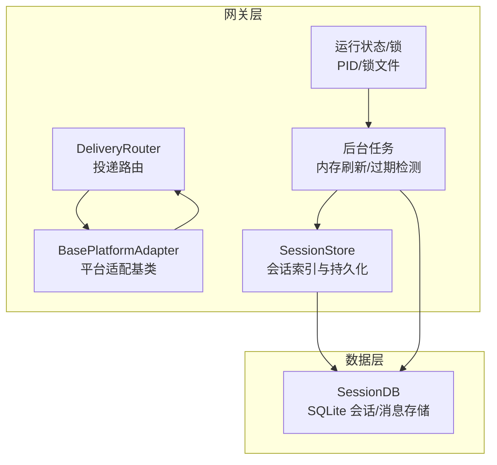
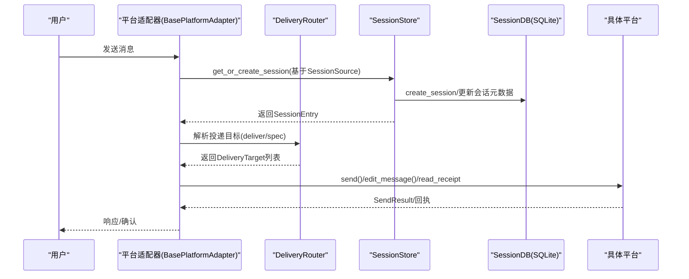
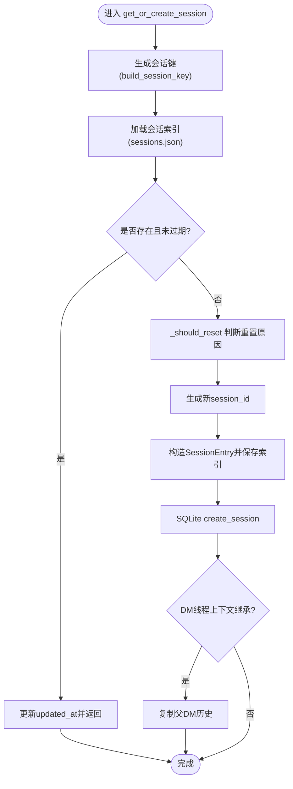
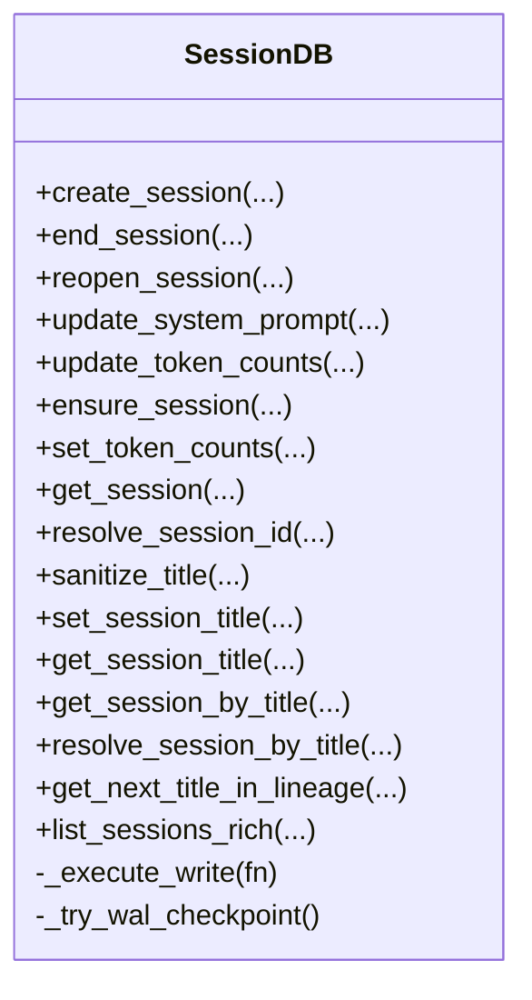
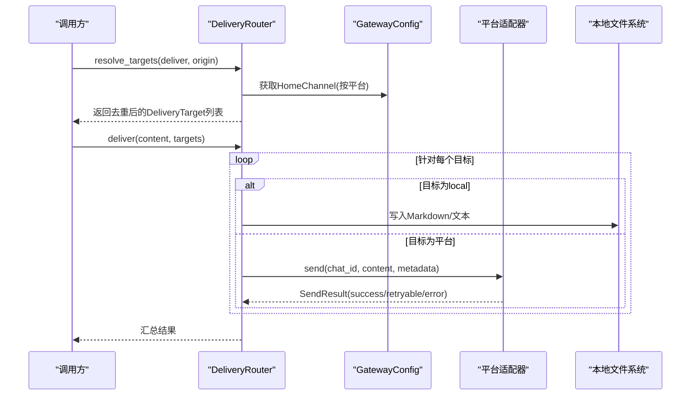
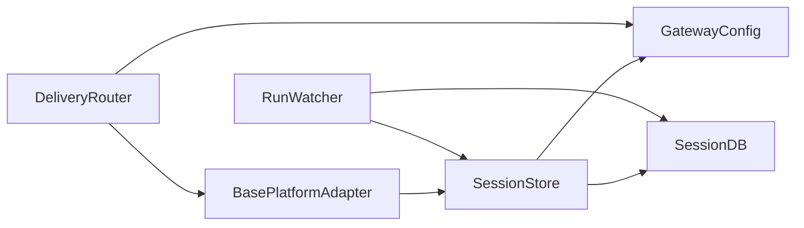

# 会话与消息管理

<cite>
**本文引用的文件**
- [gateway/session.py](file://gateway/session.py)
- [gateway/delivery.py](file://gateway/delivery.py)
- [gateway/platforms/base.py](file://gateway/platforms/base.py)
- [gateway/platforms/matrix.py](file://gateway/platforms/matrix.py)
- [hermes_state.py](file://hermes_state.py)
- [gateway/run.py](file://gateway/run.py)
- [gateway/status.py](file://gateway/status.py)
- [tests/gateway/test_session.py](file://tests/gateway/test_session.py)
- [tests/gateway/test_async_memory_flush.py](file://tests/gateway/test_async_memory_flush.py)
- [tests/gateway/test_delivery.py](file://tests/gateway/test_delivery.py)
- [tests/gateway/test_matrix.py](file://tests/gateway/test_matrix.py)
</cite>

## 目录
1. [引言](#引言)
2. [项目结构](#项目结构)
3. [核心组件](#核心组件)
4. [架构总览](#架构总览)
5. [详细组件分析](#详细组件分析)
6. [依赖分析](#依赖分析)
7. [性能考虑](#性能考虑)
8. [故障排查指南](#故障排查指南)
9. [结论](#结论)
10. [附录](#附录)

## 引言
本技术文档聚焦于 Hermes Agent 的“会话与消息管理”子系统，围绕以下目标展开：会话生命周期管理（创建、状态跟踪、超时与清理）、SessionStore 设计（持久化、状态查询、历史记录管理）、消息传递机制（DeliveryRouter 路由算法、消息队列与重试）、会话键生成规则（用户标识解析、群组会话聚合、线程会话分离）、消息状态管理（未读计数、已读标记、消息确认）、会话安全策略（权限验证、访问控制、数据隔离），以及会话监控与调试工具的使用。

## 项目结构
该子系统主要分布在 gateway 子目录中，并与 hermes_state 数据层协同工作：
- 会话建模与存储：gateway/session.py
- 消息投递与路由：gateway/delivery.py、gateway/platforms/base.py
- 平台适配器与消息确认：gateway/platforms/matrix.py 等
- 会话状态数据库：hermes_state.py
- 后台任务与内存刷新：gateway/run.py
- 运行状态与锁：gateway/status.py
- 单元测试覆盖：tests/gateway 下多文件

图示来源
- [gateway/session.py](file://gateway/session.py)
- [gateway/delivery.py](file://gateway/delivery.py)
- [gateway/platforms/base.py](file://gateway/platforms/base.py)
- [hermes_state.py](file://hermes_state.py)
- [gateway/run.py](file://gateway/run.py)
- [gateway/status.py](file://gateway/status.py)

章节来源
- [gateway/session.py](file://gateway/session.py)
- [gateway/delivery.py](file://gateway/delivery.py)
- [gateway/platforms/base.py](file://gateway/platforms/base.py)
- [hermes_state.py](file://hermes_state.py)
- [gateway/run.py](file://gateway/run.py)
- [gateway/status.py](file://gateway/status.py)

## 核心组件
- SessionStore：负责会话键生成、会话创建/更新、重置策略评估、历史记录读写、令牌与费用统计等。
- SessionDB：SQLite 会话与消息存储，提供事务重试、WAL 模式、FTS5 全文检索、标题管理等能力。
- DeliveryRouter：解析投递目标（origin/local/平台/home频道/显式聊天），按配置分发到各平台适配器。
- BasePlatformAdapter 及其子类：实现具体平台的消息发送、编辑、类型指示、媒体缓存、读回执等。
- 运行时状态与锁：PID 文件、运行状态文件、作用域锁，保障并发与替换启动的安全性。
- 后台任务：会话过期检测、内存刷新、失败重试上限控制。

章节来源
- [gateway/session.py](file://gateway/session.py)
- [hermes_state.py](file://hermes_state.py)
- [gateway/delivery.py](file://gateway/delivery.py)
- [gateway/platforms/base.py](file://gateway/platforms/base.py)
- [gateway/run.py](file://gateway/run.py)
- [gateway/status.py](file://gateway/status.py)

## 架构总览
下图展示从消息输入到会话创建、路由投递、平台发送与确认的整体流程。

图示来源
- [gateway/platforms/base.py](file://gateway/platforms/base.py)
- [gateway/delivery.py](file://gateway/delivery.py)
- [gateway/session.py](file://gateway/session.py)
- [hermes_state.py](file://hermes_state.py)

## 详细组件分析

### 会话生命周期与SessionStore设计
- 会话键生成规则
  - 支持 DM、群组、频道、线程等场景；默认对群组线程采用“共享会话”（不附加用户ID）以符合论坛/频道线程预期；可通过配置开启“每用户隔离”。
  - 生成逻辑集中在 build_session_key，确保同一来源在不同配置下的确定性。
- 会话创建与更新
  - get_or_create_session：根据重置策略决定是否新建；创建新会话时写入 SQLite 并持久化索引；支持 DM 线程上下文继承。
  - update_session：轻量更新时间戳与提示词令牌数。
  - reset_session/switch_session：强制重置或切换到已有会话ID，用于 /resume 等场景。
- 历史记录管理
  - append_to_transcript/rewrite_transcript/load_transcript：同时维护 SQLite 与旧版 JSONL，优先选择更长的历史源，避免迁移过程中的截断。
- 重置与过期
  - _should_reset/_is_session_expired：依据空闲时长与每日边界判断是否需要自动重置；活跃后台进程的会话不会被判定过期。
  - 后台 watcher：定期扫描过期会话并触发内存刷新，防止重复刷新。
- 令牌与费用统计
  - SessionEntry 中包含输入/输出/缓存命中/写入、推理令牌及费用字段；SessionDB 提供绝对值/增量两种更新模式。

图示来源
- [gateway/session.py](file://gateway/session.py)

章节来源
- [gateway/session.py](file://gateway/session.py)
- [tests/gateway/test_session.py](file://tests/gateway/test_session.py)
- [tests/gateway/test_async_memory_flush.py](file://tests/gateway/test_async_memory_flush.py)

### SessionDB（hermes_state.py）
- 数据模型
  - sessions 表：会话元数据、父子链、计费与标题等。
  - messages 表：消息明细，含推理文本与结构化细节；FTS5 虚表支持全文检索。
- 写入优化
  - WAL 模式 + 短超时 + 应用层抖动重试，避免写锁“ convoy 效应”。
  - 定期 PASSIVE checkpoint，控制 WAL 文件膨胀。
- 标题与唯一性
  - 标题清洗、唯一性约束、谱系标题生成（如“标题 #2”）。
- 事务封装
  - _execute_write 封装 BEGIN IMMEDIATE + 抖动重试 + 自动 checkpoint。

图示来源
- [hermes_state.py](file://hermes_state.py)

章节来源
- [hermes_state.py](file://hermes_state.py)

### 消息传递机制与DeliveryRouter
- 目标解析
  - 支持 "origin"（回源）、"local"（本地文件）、"平台"（home 频道）、"平台:聊天ID"（显式聊天）、"平台:聊天ID:线程ID"（显式线程）。
  - 解析后去重并结合 always_log_local 配置追加本地输出。
- 平台投递
  - 本地：写入 {HERMES_HOME}/cron/output，带作业元信息。
  - 平台：调用对应适配器 send，必要时截断超长输出并保存完整内容。
- 重试与退避
  - 平台适配器内部实现指数退避与可重试错误识别（连接类瞬时错误自动重试）。

图示来源
- [gateway/delivery.py](file://gateway/delivery.py)
- [gateway/platforms/base.py](file://gateway/platforms/base.py)

章节来源
- [gateway/delivery.py](file://gateway/delivery.py)
- [tests/gateway/test_delivery.py](file://tests/gateway/test_delivery.py)

### 会话键生成规则详解
- DM 场景
  - 若存在 chat_id，则按私聊隔离；若存在 thread_id，则进一步区分线程；均不存在则共享单一会话。
- 群组/频道场景
  - 默认按 chat_id 区分；当 thread_id 存在且未启用 per-user 隔离时，线程内共享会话；否则附加用户ID进行隔离。
- 配置开关
  - group_sessions_per_user：控制群组内是否按用户隔离。
  - thread_sessions_per_user：控制线程内是否按用户隔离（默认关闭，线程共享）。

章节来源
- [gateway/session.py](file://gateway/session.py)
- [tests/gateway/test_session.py](file://tests/gateway/test_session.py)

### 消息状态管理（未读计数、已读标记、确认机制）
- 已读标记（Read Receipts）
  - Matrix 适配器支持发送 m.read 事件并设置完全已读标记；提供后台异步发送与错误日志。
- 消息确认与反应
  - 处理开始/完成时可发送反应（如 ✅），可按配置禁用。
- 令牌与费用
  - SessionEntry 与 SessionDB 提供输入/输出/缓存/推理令牌与费用统计字段，支持绝对值与增量两种更新方式。

章节来源
- [gateway/platforms/matrix.py](file://gateway/platforms/matrix.py)
- [tests/gateway/test_matrix.py](file://tests/gateway/test_matrix.py)
- [gateway/platforms/base.py](file://gateway/platforms/base.py)
- [gateway/session.py](file://gateway/session.py)
- [hermes_state.py](file://hermes_state.py)

### 会话安全策略
- 权限与访问控制
  - 作用域锁：跨进程/跨 HERMES_HOME 防止同一外部身份（如 Telegram Bot Token）被多个实例同时使用。
  - 运行状态文件：记录网关 PID、启动时间、平台状态与错误信息，便于诊断。
- 数据隔离
  - 不同 HERMES_HOME 对应独立 PID 文件与锁目录，天然隔离。
  - 会话键按来源平台/聊天/线程/用户ID构建，确保上下文隔离。
- 平台侧安全
  - URL 安全检查（SSRF 防护）在媒体下载时执行；平台适配器对私有/内部网络 URL 进行阻断。

章节来源
- [gateway/status.py](file://gateway/status.py)
- [gateway/platforms/base.py](file://gateway/platforms/base.py)
- [gateway/session.py](file://gateway/session.py)

### 会话监控与调试工具
- 运行状态
  - write_runtime_status/read_runtime_status：持久化网关与平台状态，包含更新时间、错误码/信息。
  - acquire_scoped_lock/release_scoped_lock：跨进程作用域锁，防止资源冲突。
- 后台任务与内存刷新
  - run.py 中的后台 watcher 扫描过期会话并触发内存刷新，失败具备重试上限与失败计数，避免无限循环。
- 日志与可观测性
  - 关键路径均有日志输出（如内存刷新完成、重试次数、平台发送失败等），便于问题定位。

章节来源
- [gateway/status.py](file://gateway/status.py)
- [gateway/run.py](file://gateway/run.py)
- [tests/gateway/test_async_memory_flush.py](file://tests/gateway/test_async_memory_flush.py)

## 依赖分析
- 组件耦合
  - SessionStore 依赖 GatewayConfig（重置策略、HomeChannel）、SessionDB（SQLite 存储）、线程锁与临时文件写入。
  - DeliveryRouter 依赖 GatewayConfig（always_log_local、HomeChannel）、平台适配器字典。
  - 平台适配器依赖 SessionStore（会话状态查询）、BasePlatformAdapter（统一接口）。
- 外部依赖
  - hermes_state.py 提供 SQLite 访问与 FTS5 检索；httpx 用于媒体下载；路径与环境变量来自 hermes_constants。

图示来源
- [gateway/session.py](file://gateway/session.py)
- [gateway/delivery.py](file://gateway/delivery.py)
- [gateway/platforms/base.py](file://gateway/platforms/base.py)
- [hermes_state.py](file://hermes_state.py)
- [gateway/run.py](file://gateway/run.py)

章节来源
- [gateway/session.py](file://gateway/session.py)
- [gateway/delivery.py](file://gateway/delivery.py)
- [gateway/platforms/base.py](file://gateway/platforms/base.py)
- [hermes_state.py](file://hermes_state.py)
- [gateway/run.py](file://gateway/run.py)

## 性能考虑
- 写入竞争缓解
  - SQLite 使用 WAL + 短超时 + 应用层抖动重试，降低写锁“ convoy 效应”风险；定期 PASSIVE checkpoint 控制 WAL 膨胀。
- I/O 与序列化
  - sessions.json 使用临时文件 + 原子替换，减少部分写入失败导致的数据损坏风险。
- 路由与投递
  - DeliveryRouter 在解析阶段去重并结合 always_log_local，避免重复投递；平台侧对超长输出截断并落盘，平衡平台限制与完整性。
- 历史加载策略
  - 优先选择更长的历史源（JSONL 或 SQLite），避免迁移期间上下文丢失。

## 故障排查指南
- 会话未按预期重置
  - 检查重置策略（idle/daily/none）与当前时间边界；确认活跃后台进程函数是否返回真值导致跳过重置。
  - 参考：_should_reset、_is_session_expired、get_or_create_session。
- 内存刷新失败或无限重试
  - 查看后台 watcher 的失败计数与重试上限；确认 memory_flushed 标记是否正确持久化。
  - 参考：run.py 中的 _async_flush_memories 与失败处理逻辑。
- 投递失败或平台不可达
  - 查看 SendResult.retryable 标志与平台错误字符串；确认平台适配器是否实现指数退避。
  - 参考：BasePlatformAdapter.send 与平台实现。
- 已读标记无效
  - 检查平台客户端可用性与 API 支持；确认房间/事件 ID 正确。
  - 参考：Matrix 适配器的 read_receipt 与后台发送。
- 运行状态异常
  - 检查 PID 文件与运行状态文件；确认作用域锁是否被其他实例占用。
  - 参考：gateway/status.py。

章节来源
- [gateway/session.py](file://gateway/session.py)
- [gateway/run.py](file://gateway/run.py)
- [gateway/platforms/base.py](file://gateway/platforms/base.py)
- [gateway/platforms/matrix.py](file://gateway/platforms/matrix.py)
- [gateway/status.py](file://gateway/status.py)

## 结论
该子系统通过明确的会话键规则、健壮的 SessionStore/SessionDB 设计、可扩展的 DeliveryRouter 与平台适配器、完善的后台任务与可观测性，实现了跨平台、可扩展、可审计的会话与消息管理体系。在性能方面，采用 WAL + 抖动重试与原子写入策略有效缓解了并发写入与 I/O 风险；在安全方面，作用域锁、运行状态文件与 URL 安全检查提供了多层防护。建议在生产环境中结合重置策略、内存刷新与日志监控，持续优化会话生命周期与投递可靠性。

## 附录
- 关键流程图与类图已在前述章节中给出，读者可据此快速定位实现位置与调用关系。
- 测试用例覆盖了会话键规则、重置行为、内存刷新、投递目标解析与平台特性（如 Matrix 已读标记），可作为回归与集成测试参考。