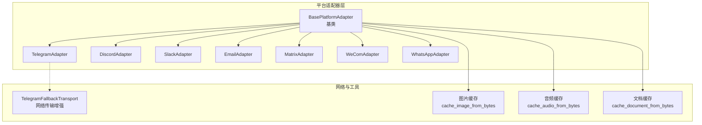
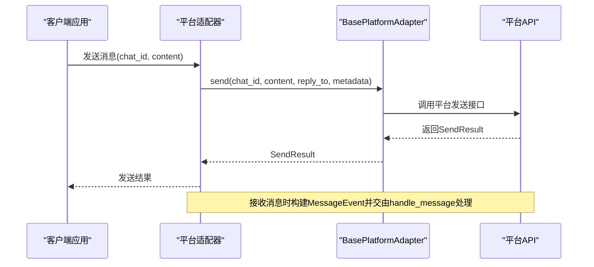
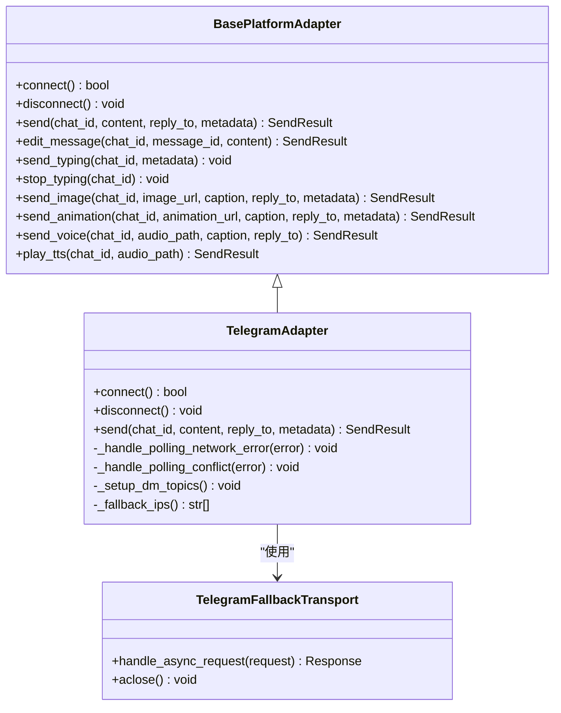
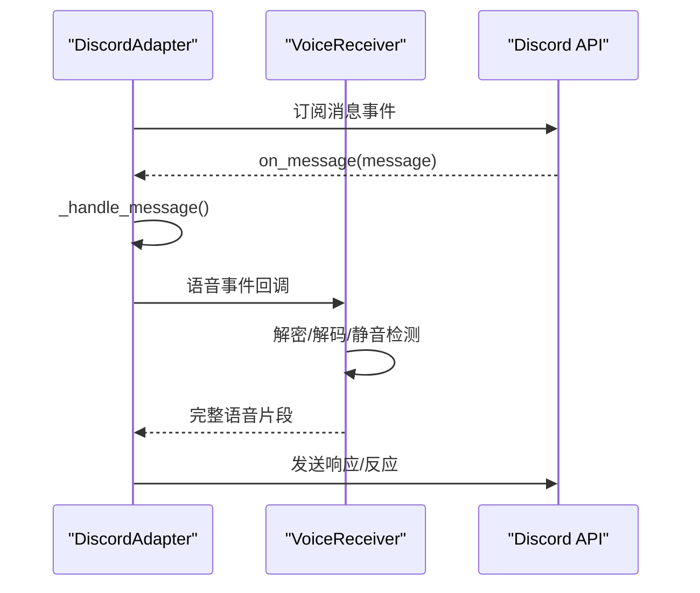
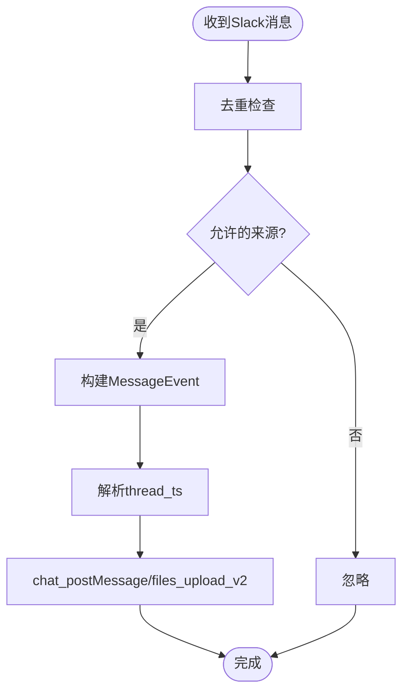
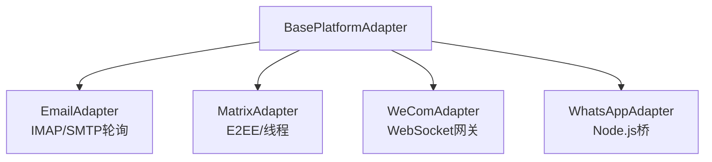
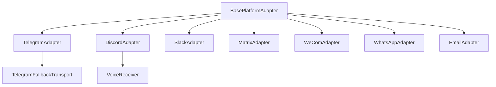
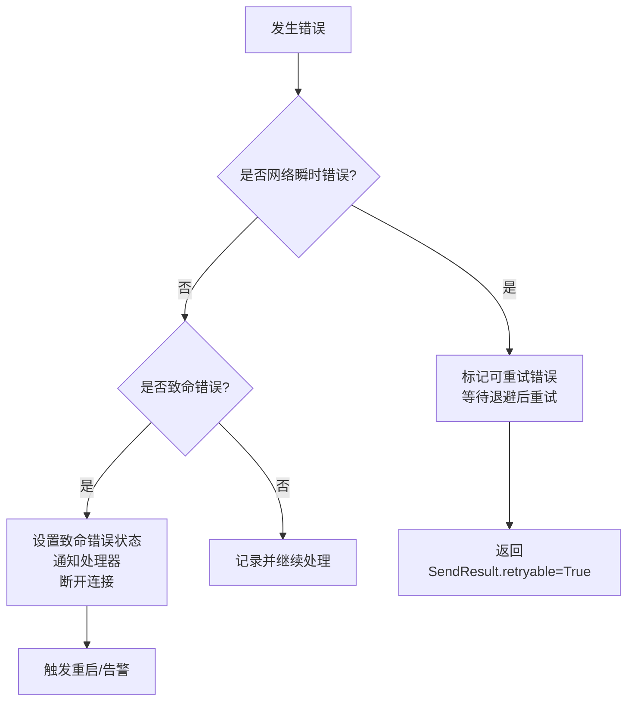

# 平台适配器开发

<cite>
**本文档引用的文件**
- [gateway/platforms/base.py](file://gateway/platforms/base.py)
- [gateway/platforms/__init__.py](file://gateway/platforms/__init__.py)
- [gateway/platforms/telegram.py](file://gateway/platforms/telegram.py)
- [gateway/platforms/discord.py](file://gateway/platforms/discord.py)
- [gateway/platforms/slack.py](file://gateway/platforms/slack.py)
- [gateway/platforms/telegram_network.py](file://gateway/platforms/telegram_network.py)
- [gateway/platforms/email.py](file://gateway/platforms/email.py)
- [gateway/platforms/matrix.py](file://gateway/platforms/matrix.py)
- [gateway/platforms/wecom.py](file://gateway/platforms/wecom.py)
- [gateway/platforms/whatsapp.py](file://gateway/platforms/whatsapp.py)
</cite>

## 目录
1. [简介](#简介)
2. [项目结构](#项目结构)
3. [核心组件](#核心组件)
4. [架构概览](#架构概览)
5. [详细组件分析](#详细组件分析)
6. [依赖分析](#依赖分析)
7. [性能考虑](#性能考虑)
8. [故障排除指南](#故障排除指南)
9. [结论](#结论)
10. [附录](#附录)

## 简介
本指南面向Hermes Agent平台适配器开发者，系统阐述BasePlatformAdapter基类设计模式、消息事件模型、平台适配器实现差异与生命周期管理，并提供新平台适配器开发指南、安全考虑与性能优化建议。文档以代码为依据，结合图示帮助读者快速理解并高效扩展支持新的通信平台。

## 项目结构
平台适配器位于gateway/platforms目录，采用“基类 + 多平台实现”的分层设计：
- 基类与通用模型：gateway/platforms/base.py
- 平台适配器：Telegram、Discord、Slack、Email、Matrix、WeCom、WhatsApp等
- 平台网络辅助：Telegram专用网络传输增强
- 导出入口：gateway/platforms/__init__.py

**图表来源**
- [gateway/platforms/base.py:470-800](file://gateway/platforms/base.py#L470-L800)
- [gateway/platforms/telegram.py:111-150](file://gateway/platforms/telegram.py#L111-L150)
- [gateway/platforms/telegram_network.py:55-122](file://gateway/platforms/telegram_network.py#L55-L122)

**章节来源**
- [gateway/platforms/__init__.py:11-17](file://gateway/platforms/__init__.py#L11-L17)
- [gateway/platforms/base.py:470-800](file://gateway/platforms/base.py#L470-L800)

## 核心组件
本节聚焦BasePlatformAdapter基类的设计要点与消息事件模型。

- 抽象方法定义
  - 连接与断开：connect()、disconnect()
  - 消息发送：send()、edit_message()（可选）
  - 输入指示：send_typing()、stop_typing()（可选）
  - 媒体发送：send_image()、send_animation()、send_voice()、play_tts()（可选）
  - 文本解析与截断：format_message()、truncate_message()（由子类实现或继承默认行为）

- 消息事件模型
  - MessageEvent：统一的消息载体，包含文本、类型、来源、原始数据、媒体列表、回复上下文、时间戳等
  - MessageType：枚举类型，覆盖文本、位置、照片、视频、音频、语音、文档、贴纸、命令等
  - SendResult：发送结果封装，包含成功状态、消息ID、错误信息与是否可重试

- 缓存与安全
  - 图片/音频/文档本地缓存：避免平台URL过期与提升性能
  - SSRF防护：URL下载前进行安全校验
  - 令牌锁：防止同一平台令牌被重复使用

- 生命周期管理
  - 运行状态：_running、_mark_connected()、_mark_disconnected()
  - 致命错误：_set_fatal_error()、_notify_fatal_error()、重连策略
  - 后台任务：取消与清理，确保优雅关闭

**章节来源**
- [gateway/platforms/base.py:367-444](file://gateway/platforms/base.py#L367-L444)
- [gateway/platforms/base.py:380-434](file://gateway/platforms/base.py#L380-L434)
- [gateway/platforms/base.py:470-662](file://gateway/platforms/base.py#L470-L662)
- [gateway/platforms/base.py:89-191](file://gateway/platforms/base.py#L89-L191)
- [gateway/platforms/base.py:204-364](file://gateway/platforms/base.py#L204-L364)

## 架构概览
下图展示平台适配器的整体交互：客户端通过具体平台适配器接入，经由统一的MessageEvent模型与消息处理管线，最终调用平台API完成收发。

**图表来源**
- [gateway/platforms/base.py:612-632](file://gateway/platforms/base.py#L612-L632)
- [gateway/platforms/base.py:598-611](file://gateway/platforms/base.py#L598-L611)

## 详细组件分析

### Telegram适配器
- 特性
  - 支持轮询与Webhook两种接入方式，具备网络异常自动重连能力
  - DM主题（Forum Topics）支持，按主题隔离对话
  - 长文本分片与MarkdownV2转义，图片/文档/语音原生发送
  - 令牌锁防重复使用，网络错误指数退避重连
- 关键实现
  - TelegramFallbackTransport：在主域名不可达时切换备用IP，保持TLS SNI不变
  - _handle_polling_network_error/_handle_polling_conflict：网络中断与冲突检测与恢复
  - DM主题映射与持久化：首次创建后写回配置文件，重启后复用

**图表来源**
- [gateway/platforms/base.py:470-662](file://gateway/platforms/base.py#L470-L662)
- [gateway/platforms/telegram.py:111-150](file://gateway/platforms/telegram.py#L111-L150)
- [gateway/platforms/telegram_network.py:55-122](file://gateway/platforms/telegram_network.py#L55-L122)

**章节来源**
- [gateway/platforms/telegram.py:469-690](file://gateway/platforms/telegram.py#L469-L690)
- [gateway/platforms/telegram.py:691-728](file://gateway/platforms/telegram.py#L691-L728)
- [gateway/platforms/telegram.py:750-800](file://gateway/platforms/telegram.py#L750-L800)
- [gateway/platforms/telegram_network.py:55-122](file://gateway/platforms/telegram_network.py#L55-L122)

### Discord适配器
- 特性
  - 基于discord.py，支持服务器与私聊消息、线程、Slash命令、反应反馈
  - 语音接收：基于RTP解密与Opus解码，支持静音检测与PCM转WAV
  - 令牌锁防重复使用，消息去重（RESUME重放）
  - 可配置允许用户列表与提及策略
- 关键实现
  - VoiceReceiver：捕获与解码语音包，按静默阈值输出完整语句
  - 反应反馈：处理👀✅❌等反应，反映处理状态
  - 机器人权限：谨慎申请Privileged Intent，避免启动失败

**图表来源**
- [gateway/platforms/discord.py:409-706](file://gateway/platforms/discord.py#L409-L706)
- [gateway/platforms/discord.py:83-375](file://gateway/platforms/discord.py#L83-L375)

**章节来源**
- [gateway/platforms/discord.py:459-706](file://gateway/platforms/discord.py#L459-L706)
- [gateway/platforms/discord.py:83-375](file://gateway/platforms/discord.py#L83-L375)

### Slack适配器
- 特性
  - 使用slack-bolt与Socket Mode，支持多工作区
  - 线程回复、文件上传、Markdown到mrkdwn转换、打字指示（assistant.threads.setStatus）
  - 批准按钮与去重机制，支持reply_broadcast
- 关键实现
  - 多工作区：每个工作区维护独立AsyncWebClient与bot_user_id
  - 线程TS解析：优先metadata.thread_id，其次reply_to；可禁用线程回复
  - 文件上传：files_upload_v2，支持图片/音频/视频/文档

**图表来源**
- [gateway/platforms/slack.py:53-98](file://gateway/platforms/slack.py#L53-L98)
- [gateway/platforms/slack.py:172-208](file://gateway/platforms/slack.py#L172-L208)
- [gateway/platforms/slack.py:241-296](file://gateway/platforms/slack.py#L241-L296)

**章节来源**
- [gateway/platforms/slack.py:99-213](file://gateway/platforms/slack.py#L99-L213)
- [gateway/platforms/slack.py:214-232](file://gateway/platforms/slack.py#L214-L232)
- [gateway/platforms/slack.py:241-330](file://gateway/platforms/slack.py#L241-L330)
- [gateway/platforms/slack.py:387-410](file://gateway/platforms/slack.py#L387-L410)

### 其他平台适配器（概念性说明）
- Email适配器：基于IMAP轮询与SMTP发送，支持附件缓存与自动去噪
- Matrix适配器：基于matrix-nio，支持E2EE与线程，具备加密存储与密钥导出
- WeCom适配器：基于WebSocket网关，支持媒体下载与上传、去重与重连
- WhatsApp适配器：通过Node.js桥接（whatsapp-web.js/Baileys），HTTP桥通信

**图表来源**
- [gateway/platforms/email.py:217-246](file://gateway/platforms/email.py#L217-L246)
- [gateway/platforms/matrix.py:120-174](file://gateway/platforms/matrix.py#L120-L174)
- [gateway/platforms/wecom.py:142-174](file://gateway/platforms/wecom.py#L142-L174)
- [gateway/platforms/whatsapp.py:103-149](file://gateway/platforms/whatsapp.py#L103-L149)

**章节来源**
- [gateway/platforms/email.py:217-246](file://gateway/platforms/email.py#L217-L246)
- [gateway/platforms/matrix.py:120-174](file://gateway/platforms/matrix.py#L120-L174)
- [gateway/platforms/wecom.py:142-174](file://gateway/platforms/wecom.py#L142-L174)
- [gateway/platforms/whatsapp.py:103-149](file://gateway/platforms/whatsapp.py#L103-L149)

## 依赖分析
- 组件耦合
  - 所有平台适配器均继承BasePlatformAdapter，共享统一的抽象接口与消息事件模型
  - Telegram适配器依赖TelegramFallbackTransport进行网络容错
  - Discord适配器依赖VoiceReceiver进行语音解码
  - Slack适配器依赖slack-bolt与Socket Mode
  - Matrix适配器依赖matrix-nio与可选的E2EE库
  - WeCom适配器依赖aiohttp/httpx进行WebSocket与HTTP通信
  - WhatsApp适配器依赖Node.js桥接进程

**图表来源**
- [gateway/platforms/base.py:470-662](file://gateway/platforms/base.py#L470-L662)
- [gateway/platforms/telegram.py:111-150](file://gateway/platforms/telegram.py#L111-L150)
- [gateway/platforms/telegram_network.py:55-122](file://gateway/platforms/telegram_network.py#L55-L122)
- [gateway/platforms/discord.py:83-159](file://gateway/platforms/discord.py#L83-L159)
- [gateway/platforms/slack.py:53-98](file://gateway/platforms/slack.py#L53-L98)
- [gateway/platforms/matrix.py:120-174](file://gateway/platforms/matrix.py#L120-L174)
- [gateway/platforms/wecom.py:142-174](file://gateway/platforms/wecom.py#L142-L174)
- [gateway/platforms/whatsapp.py:103-149](file://gateway/platforms/whatsapp.py#L103-L149)

**章节来源**
- [gateway/platforms/telegram_network.py:55-122](file://gateway/platforms/telegram_network.py#L55-L122)
- [gateway/platforms/discord.py:83-159](file://gateway/platforms/discord.py#L83-L159)

## 性能考虑
- 缓存策略
  - 图片/音频/文档本地缓存减少平台URL过期影响，提高视觉与STT工具访问效率
  - Telegram图片缓存支持重试与指数退避，提升网络抖动环境下的稳定性
- 消息分片与格式化
  - 长文本按平台限制分片发送，避免超限错误
  - 平台间Markdown转换（如Slack mrkdwn、Telegram MDV2）减少渲染失败
- 异步与并发
  - 平台适配器普遍采用异步I/O与后台任务管理，确保消息处理不阻塞主线程
- 网络容错
  - Telegram网络错误指数退避重连，Discord消息去重避免重复处理
- 资源管理
  - 适配器在断开连接时清理会话、关闭HTTP/WS客户端与日志句柄，防止资源泄漏

[本节为通用指导，无需列出具体文件来源]

## 故障排除指南
- 常见致命错误
  - Telegram：轮询冲突、网络错误、令牌锁冲突
  - Discord：令牌锁冲突、连接超时、Opus加载失败
  - Slack：令牌锁冲突、Socket Mode连接失败、多工作区认证失败
  - Matrix：E2EE依赖缺失、访问令牌失效、同步错误
  - WeCom：依赖缺失、WebSocket认证失败、重连退避
  - WhatsApp：Node.js缺失、桥接进程退出、端口占用
- 处理流程
  - 设置致命错误状态并记录运行状态
  - 触发致命错误处理器（如重启网关）
  - 断开连接并释放锁与资源

**图表来源**
- [gateway/platforms/base.py:545-568](file://gateway/platforms/base.py#L545-L568)
- [gateway/platforms/telegram.py:189-255](file://gateway/platforms/telegram.py#L189-L255)
- [gateway/platforms/discord.py:496-504](file://gateway/platforms/discord.py#L496-L504)
- [gateway/platforms/slack.py:136-145](file://gateway/platforms/slack.py#L136-L145)
- [gateway/platforms/matrix.py:308-310](file://gateway/platforms/matrix.py#L308-L310)
- [gateway/platforms/wecom.py:182-195](file://gateway/platforms/wecom.py#L182-L195)
- [gateway/platforms/whatsapp.py:280-312](file://gateway/platforms/whatsapp.py#L280-L312)

**章节来源**
- [gateway/platforms/base.py:545-568](file://gateway/platforms/base.py#L545-L568)
- [gateway/platforms/telegram.py:189-255](file://gateway/platforms/telegram.py#L189-L255)
- [gateway/platforms/discord.py:496-504](file://gateway/platforms/discord.py#L496-L504)
- [gateway/platforms/slack.py:136-145](file://gateway/platforms/slack.py#L136-L145)
- [gateway/platforms/matrix.py:308-310](file://gateway/platforms/matrix.py#L308-L310)
- [gateway/platforms/wecom.py:182-195](file://gateway/platforms/wecom.py#L182-L195)
- [gateway/platforms/whatsapp.py:280-312](file://gateway/platforms/whatsapp.py#L280-L312)

## 结论
Hermes Agent平台适配器体系以BasePlatformAdapter为核心，通过统一的抽象接口与消息事件模型，屏蔽各平台差异，实现一致的接入体验。Telegram、Discord、Slack等主流平台适配器展示了不同接入方式（轮询/Webhook/Socket Mode）、特性（线程/语音/多媒体）与安全策略（令牌锁/SSRF防护）。遵循本文档的开发指南与最佳实践，可高效扩展新的平台适配器并确保稳定性与安全性。

[本节为总结性内容，无需列出具体文件来源]

## 附录

### 新平台适配器开发指南
- 接口实现要求
  - 必须实现：connect()、disconnect()、send()
  - 可选实现：edit_message()、send_typing()/stop_typing()、send_image()/send_animation()/send_voice()/play_tts()
  - 使用MessageEvent与MessageType作为消息标准化载体
- 配置管理
  - 从PlatformConfig读取令牌与额外参数，支持环境变量降级
  - 对外暴露check_<platform>_requirements()用于运行时依赖检测
- 测试策略
  - 单元测试：覆盖send()/edit_message()与错误路径
  - 集成测试：模拟平台API行为，验证消息分片、格式化与去重
  - 安全测试：SSRF防护、令牌锁冲突、网络异常重连
- 安全与合规
  - URL下载前进行安全校验，避免内网/私网地址
  - 令牌锁防止重复使用，必要时记录PID与平台信息
  - 对敏感日志进行脱敏（如URL隐藏凭据）
- 性能优化
  - 合理分片与缓存，降低平台API调用频率
  - 异步I/O与后台任务管理，避免阻塞
  - 适度退避重连，避免雪崩效应

[本节为通用指导，无需列出具体文件来源]