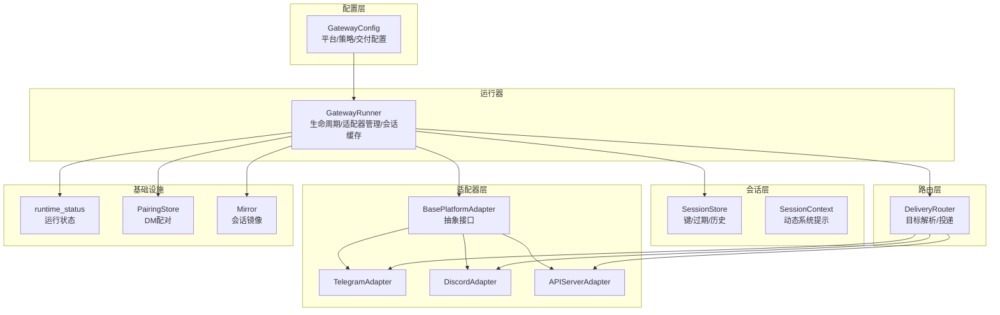
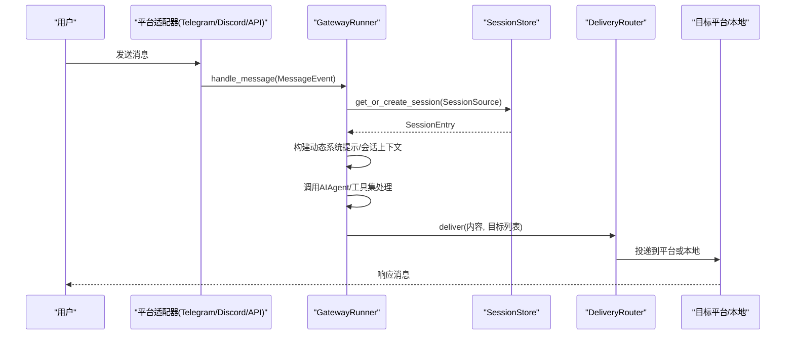
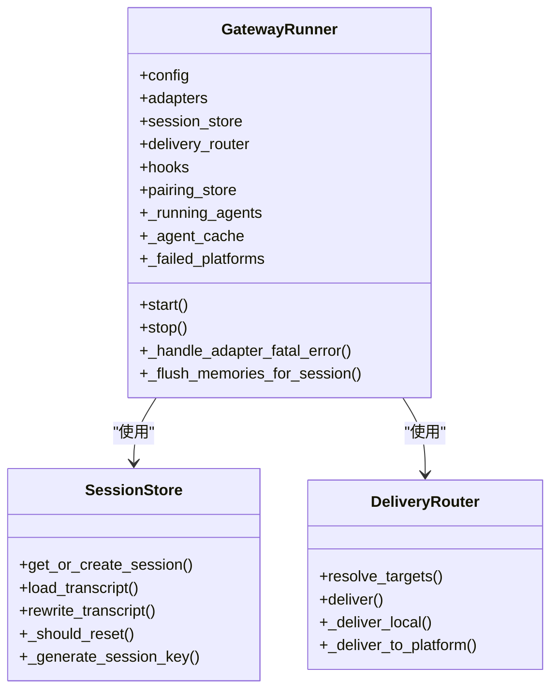
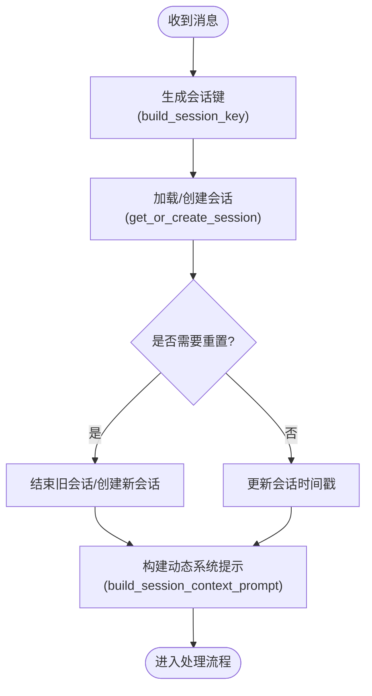
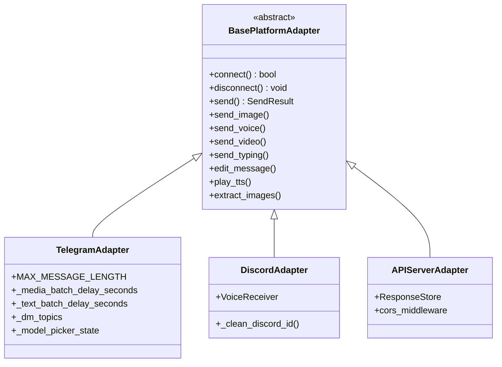
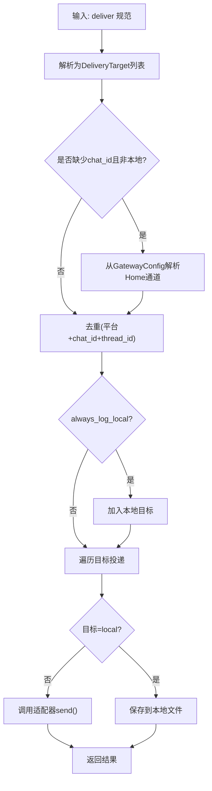
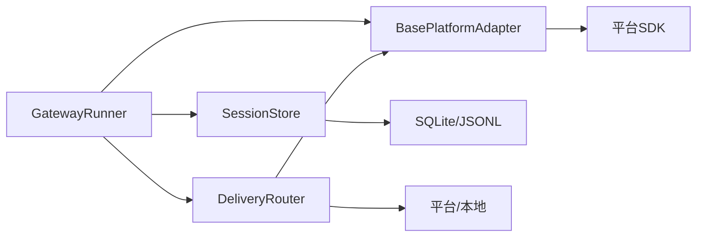

# 消息网关

<cite>
**本文引用的文件**
- [gateway/__init__.py](file://gateway/__init__.py)
- [gateway/run.py](file://gateway/run.py)
- [gateway/session.py](file://gateway/session.py)
- [gateway/config.py](file://gateway/config.py)
- [gateway/delivery.py](file://gateway/delivery.py)
- [gateway/platforms/base.py](file://gateway/platforms/base.py)
- [gateway/platforms/telegram.py](file://gateway/platforms/telegram.py)
- [gateway/platforms/discord.py](file://gateway/platforms/discord.py)
- [gateway/platforms/api_server.py](file://gateway/platforms/api_server.py)
- [gateway/platforms/ADDING_A_PLATFORM.md](file://gateway/platforms/ADDING_A_PLATFORM.md)
- [gateway/status.py](file://gateway/status.py)
- [gateway/pairing.py](file://gateway/pairing.py)
- [gateway/mirror.py](file://gateway/mirror.py)
</cite>

## 目录
1. [简介](#简介)
2. [项目结构](#项目结构)
3. [核心组件](#核心组件)
4. [架构总览](#架构总览)
5. [详细组件分析](#详细组件分析)
6. [依赖分析](#依赖分析)
7. [性能考虑](#性能考虑)
8. [故障排查指南](#故障排查指南)
9. [结论](#结论)
10. [附录](#附录)

## 简介
本技术文档面向Hermes Agent的消息网关系统，系统性阐述其运行器设计与平台适配器模式、会话管理、消息路由机制，并给出平台集成规范、部署配置与安全加固建议。目标是帮助开发者快速理解并扩展多平台消息接入能力。

## 项目结构
消息网关位于gateway目录，采用“配置驱动 + 平台适配器 + 会话存储 + 路由投递”的分层架构：
- 配置层：统一加载与合并环境变量、旧版JSON与新式YAML配置，生成GatewayConfig。
- 适配器层：各平台继承BasePlatformAdapter，实现连接、收发、媒体缓存等能力。
- 会话层：SessionStore负责会话键生成、过期策略、历史记录与上下文注入。
- 路由层：DeliveryRouter解析目标、去重、本地落盘与平台投递。
- 运行器：GatewayRunner协调适配器生命周期、会话与投递、后台任务与状态上报。

图示来源
- [gateway/run.py](file://gateway/run.py)
- [gateway/config.py](file://gateway/config.py)
- [gateway/platforms/base.py](file://gateway/platforms/base.py)
- [gateway/platforms/telegram.py](file://gateway/platforms/telegram.py)
- [gateway/platforms/discord.py](file://gateway/platforms/discord.py)
- [gateway/platforms/api_server.py](file://gateway/platforms/api_server.py)
- [gateway/session.py](file://gateway/session.py)
- [gateway/delivery.py](file://gateway/delivery.py)
- [gateway/status.py](file://gateway/status.py)
- [gateway/pairing.py](file://gateway/pairing.py)
- [gateway/mirror.py](file://gateway/mirror.py)

章节来源
- [gateway/__init__.py](file://gateway/__init__.py)
- [gateway/run.py](file://gateway/run.py)
- [gateway/config.py](file://gateway/config.py)

## 核心组件
- 运行器GatewayRunner：集中管理适配器生命周期、会话缓存、模型路由、内存刷新、语音模式持久化、后台任务与失败平台重连队列。
- 会话管理SessionStore：基于会话键构建规则，支持按策略自动重置、线程隔离、历史复制（DM子线程种子）、SQLite/JSONL双轨存储。
- 配置GatewayConfig：统一平台配置、默认与按类型/平台覆盖的重置策略、快速命令、STT开关、流式传输配置、交付偏好。
- 平台适配器BasePlatformAdapter：定义消息事件、发送结果、媒体缓存、打字指示、编辑消息、语音播放等通用能力；各平台实现具体连接与收发。
- 投递DeliveryRouter：解析“origin/local/平台/平台:chat_id”等目标，去重并投递到平台或本地文件，支持超长输出截断与全量保存。

章节来源
- [gateway/run.py](file://gateway/run.py)
- [gateway/session.py](file://gateway/session.py)
- [gateway/config.py](file://gateway/config.py)
- [gateway/platforms/base.py](file://gateway/platforms/base.py)
- [gateway/delivery.py](file://gateway/delivery.py)

## 架构总览
下图展示从消息进入、会话判定、适配器处理到响应投递的端到端流程。

图示来源
- [gateway/run.py](file://gateway/run.py)
- [gateway/platforms/base.py](file://gateway/platforms/base.py)
- [gateway/session.py](file://gateway/session.py)
- [gateway/delivery.py](file://gateway/delivery.py)

## 详细组件分析

### 运行器GatewayRunner
- 生命周期管理：启动/关闭、进程锁、运行状态写入、失败平台重连队列。
- 会话与缓存：会话存储、会话键生成、会话上下文构建、会话重置策略、预重置内存刷新（异步线程池）。
- 模型与路由：智能模型路由、主备模型切换、会话级模型覆盖、快速命令与触发词。
- 交互增强：语音模式持久化、自动TTS禁用集合、打字指示暂停、背景任务集合。
- 安全与合规：执行审批、危险命令拦截、PII脱敏、SSRf防护、URL白名单。

图示来源
- [gateway/run.py](file://gateway/run.py)
- [gateway/session.py](file://gateway/session.py)
- [gateway/delivery.py](file://gateway/delivery.py)

章节来源
- [gateway/run.py](file://gateway/run.py)

### 会话管理SessionStore与上下文
- 会话键规则：支持DM/群组/频道/线程组合，可按用户ID隔离或共享；线程默认共享，可通过配置开启每用户隔离。
- 重置策略：按空闲分钟数或每日固定时刻重置，支持通知策略与排除平台。
- 历史与镜像：支持DM子线程历史复制、镜像写入、SQLite/JSONL双轨存储、令牌统计与成本估算。
- 上下文注入：动态系统提示包含来源平台、聊天主题、用户身份、可用平台与交付选项。

图示来源
- [gateway/session.py](file://gateway/session.py)

章节来源
- [gateway/session.py](file://gateway/session.py)

### 配置GatewayConfig
- 平台配置：启用标志、令牌/API密钥、Home通道、回复线程模式等。
- 重置策略：默认/按类型/按平台覆盖，支持空闲与每日边界。
- 快速命令：斜杠命令绕过代理直接执行。
- 流式传输：编辑式增量推送、节流阈值、光标样式。
- 交付偏好：总是本地日志、STT开关、会话隔离策略、未授权DM行为。

章节来源
- [gateway/config.py](file://gateway/config.py)

### 平台适配器BasePlatformAdapter与典型实现
- 抽象接口：连接/断开、发送文本/图片/语音/视频、媒体缓存、打字指示、消息编辑、语音播放。
- 通用能力：图像/音频/文档缓存、URL安全检查、SSRf防护、错误重试模式识别、会话活动跟踪、后台任务集合。
- Telegram实现要点：MarkdownV2转义、DM话题映射、相册/长文本批处理、轮询网络错误自恢复、回复线程模式。
- Discord实现要点：语音接收器（DAVE解密/Opus解码）、静音检测、最小语音时长、SSRC到用户映射、线程归档策略。
- API Server实现要点：OpenAI兼容端点、响应存储（LRU SQLite）、SSE事件流、CORS中间件、安全签名。

图示来源
- [gateway/platforms/base.py](file://gateway/platforms/base.py)
- [gateway/platforms/telegram.py](file://gateway/platforms/telegram.py)
- [gateway/platforms/discord.py](file://gateway/platforms/discord.py)
- [gateway/platforms/api_server.py](file://gateway/platforms/api_server.py)

章节来源
- [gateway/platforms/base.py](file://gateway/platforms/base.py)
- [gateway/platforms/telegram.py](file://gateway/platforms/telegram.py)
- [gateway/platforms/discord.py](file://gateway/platforms/discord.py)
- [gateway/platforms/api_server.py](file://gateway/platforms/api_server.py)

### 消息路由DeliveryRouter
- 目标解析：origin/local/平台/平台:chat_id:thread_id，自动解析Home通道，去重后返回目标列表。
- 本地投递：按作业ID/名称生成带元数据的Markdown文件，支持全量TXT保存。
- 平台投递：截断超长输出，补充线程ID元数据，调用对应适配器发送。

图示来源
- [gateway/delivery.py](file://gateway/delivery.py)
- [gateway/config.py](file://gateway/config.py)

章节来源
- [gateway/delivery.py](file://gateway/delivery.py)

### 平台集成指南
- 新平台适配器开发清单：实现必需方法、注册依赖检查函数、在运行器工厂中创建实例、完善授权映射、扩展SessionSource字段、添加系统提示、工具集、Cron投递映射、发送消息工具路由、频道目录、状态显示、安装向导、PII脱敏、测试覆盖。
- 关键集成点：平台枚举、环境变量覆盖、连接平台、消息处理、媒体缓存、错误重试、消息长度限制、线程/话题支持。

章节来源
- [gateway/platforms/ADDING_A_PLATFORM.md](file://gateway/platforms/ADDING_A_PLATFORM.md)
- [gateway/platforms/base.py](file://gateway/platforms/base.py)
- [gateway/run.py](file://gateway/run.py)

### 会话生命周期管理
- 创建：根据SessionSource生成稳定会话键，首次创建写入SQLite/JSONL索引。
- 维护：每次消息到达更新updated_at；线程内消息聚合减少中断；DM子线程复制父会话历史。
- 超时：按空闲分钟数或每日边界判断是否重置；重置前触发内存预刷。
- 清理：会话过期Watcher；媒体缓存定期清理；配对请求过期清理；锁文件清理。

章节来源
- [gateway/session.py](file://gateway/session.py)
- [gateway/run.py](file://gateway/run.py)
- [gateway/pairing.py](file://gateway/pairing.py)

### 消息传递协议与可靠性
- 实时通信：平台原生流式/编辑式推送；可配置编辑间隔与缓冲阈值；语音播放与TTS。
- 批量处理：Telegram相册/长文本批处理；Discord语音帧解码与静音检测。
- 错误重试：识别可重试连接错误；平台轮询网络错误自恢复；失败平台后台重连队列。
- 确认机制：SendResult携带成功/错误/可重试标记；平台侧消息ID回填；镜像记录用于跨平台溯源。

章节来源
- [gateway/platforms/base.py](file://gateway/platforms/base.py)
- [gateway/platforms/telegram.py](file://gateway/platforms/telegram.py)
- [gateway/platforms/discord.py](file://gateway/platforms/discord.py)
- [gateway/mirror.py](file://gateway/mirror.py)

## 依赖分析
- 组件耦合：运行器对适配器、会话与路由存在强依赖；适配器对平台库强依赖；路由对适配器字典弱依赖。
- 外部依赖：各平台SDK（如Telegram、Discord），HTTP客户端（aiohttp），SQLite（会话数据库），URL安全检查工具。
- 循环依赖：未见循环导入；适配器通过回调与运行器交互，避免反向强依赖。

图示来源
- [gateway/run.py](file://gateway/run.py)
- [gateway/platforms/base.py](file://gateway/platforms/base.py)
- [gateway/session.py](file://gateway/session.py)
- [gateway/delivery.py](file://gateway/delivery.py)

章节来源
- [gateway/run.py](file://gateway/run.py)
- [gateway/platforms/base.py](file://gateway/platforms/base.py)
- [gateway/session.py](file://gateway/session.py)
- [gateway/delivery.py](file://gateway/delivery.py)

## 性能考虑
- 会话缓存：运行器按会话缓存AIAgent实例，避免重复构建系统提示与前缀缓存失效。
- I/O分离：SQLite操作在锁外进行，会话索引保存采用原子替换，降低竞争。
- 媒体缓存：图片/音频/文档本地缓存，避免平台URL过期与CDN抖动影响。
- 流式传输：编辑式增量推送与缓冲阈值控制，平衡实时性与平台限制。
- 背景任务：统一集合防止GC提前回收，确保优雅关闭时取消未完成任务。

## 故障排查指南
- 运行状态：通过runtime_status文件查看网关与各平台状态、错误码与更新时间。
- PID文件：检测网关进程是否存在、是否被替换重启；清理遗留锁文件。
- 平台连接：检查令牌/密钥是否为空、轮询冲突、网络错误与DNS解析；Telegram支持备用IP与错误回调自恢复。
- 投递失败：确认目标解析、Home通道配置、本地磁盘权限；超长输出截断与全量TXT保存路径。
- DM配对：核对配对码生成/批准流程、速率限制与锁定；确认文件权限与过期清理。

章节来源
- [gateway/status.py](file://gateway/status.py)
- [gateway/pairing.py](file://gateway/pairing.py)
- [gateway/platforms/telegram.py](file://gateway/platforms/telegram.py)
- [gateway/delivery.py](file://gateway/delivery.py)

## 结论
Hermes消息网关以清晰的分层架构与平台适配器模式实现了多平台统一接入，结合灵活的会话管理与可靠的投递路由，既满足日常消息交互，也为复杂场景（语音、媒体、Cron投递）提供了稳健支撑。通过本文档的规范与最佳实践，团队可以高效扩展新平台并持续优化性能与安全性。

## 附录
- 部署配置要点
  - 环境变量优先级：环境变量覆盖配置文件；平台特定环境变量（如TELEGRAM_BOT_TOKEN）自动注入。
  - 配置来源：config.yaml为主，gateway.json为降级基线；平台段落支持嵌套extra合并。
  - 安全加固：PII脱敏、URL安全检查、SSRf防护、配对码加密随机、文件权限0600、速率限制与锁定。
- 性能优化建议
  - 合理设置会话重置策略，避免频繁重置导致上下文丢失与成本上升。
  - 使用媒体缓存与编辑式流式传输，提升用户体验与平台兼容性。
  - 在高并发场景下，合理划分会话隔离策略，减少不必要的上下文重建。
- 平台集成清单
  - 实现BasePlatformAdapter必要方法与依赖检查函数。
  - 在运行器工厂中注册适配器；完善授权映射与SessionSource扩展。
  - 补充系统提示、工具集、Cron投递映射、发送消息工具路由与频道目录。
  - 更新状态显示、安装向导、PII脱敏与测试覆盖。