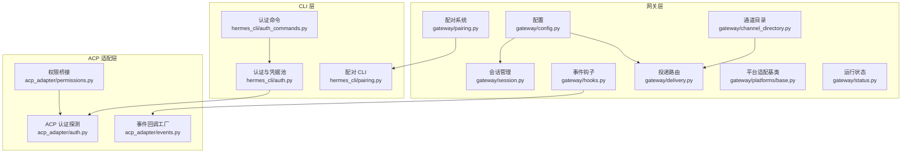
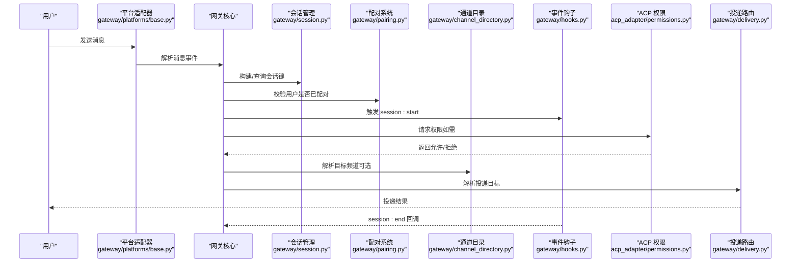
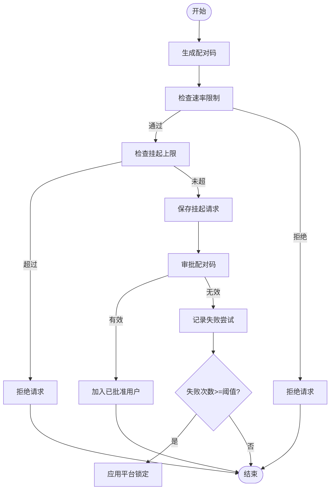
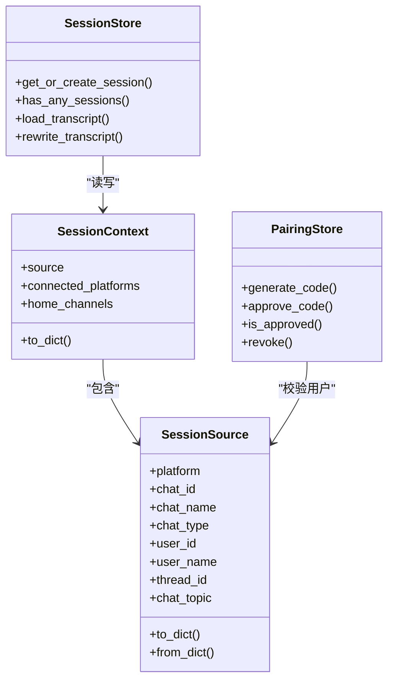
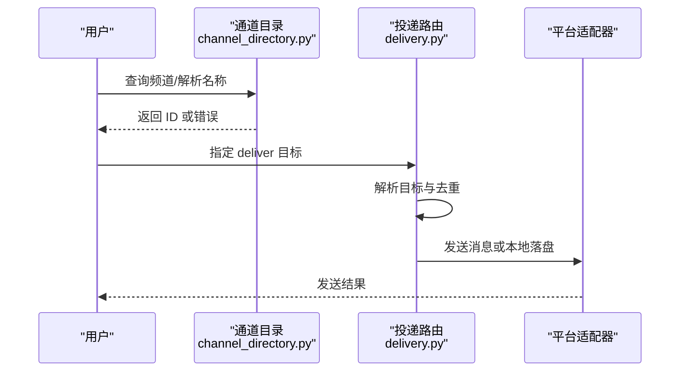
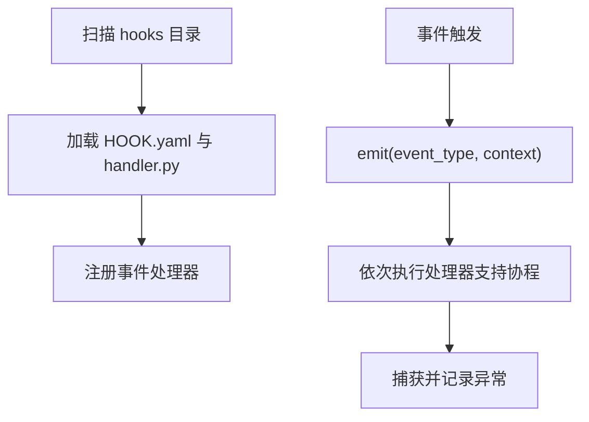
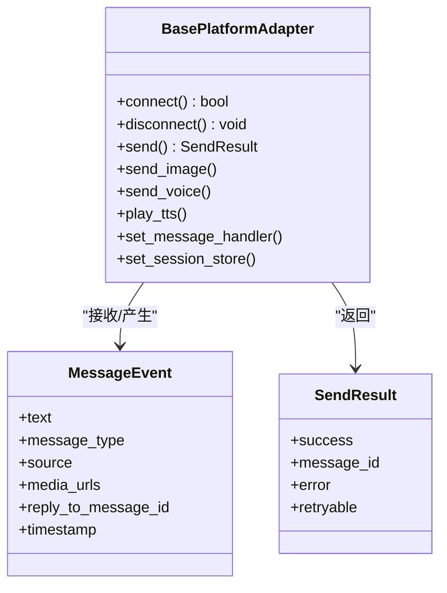
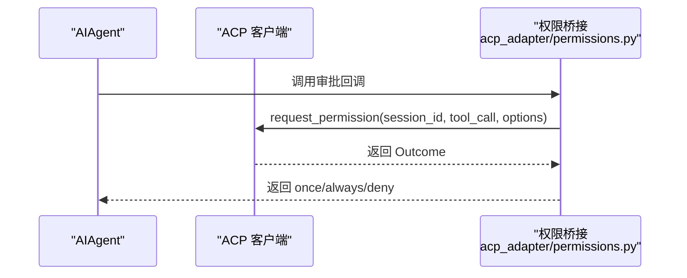
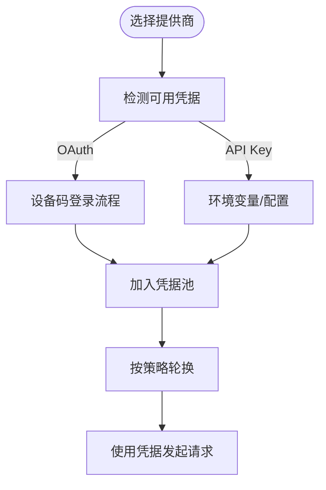
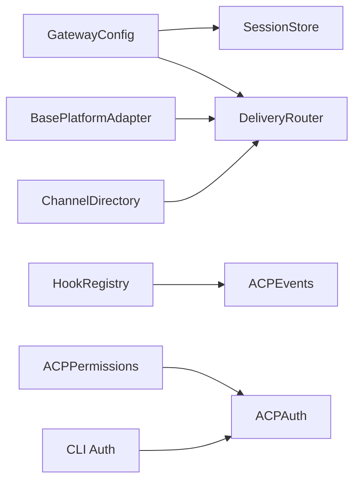

# 网关安全与权限

<cite>
**本文引用的文件**
- [gateway/__init__.py](file://gateway/__init__.py)
- [gateway/pairing.py](file://gateway/pairing.py)
- [gateway/session.py](file://gateway/session.py)
- [gateway/channel_directory.py](file://gateway/channel_directory.py)
- [gateway/config.py](file://gateway/config.py)
- [gateway/hooks.py](file://gateway/hooks.py)
- [gateway/delivery.py](file://gateway/delivery.py)
- [gateway/platforms/base.py](file://gateway/platforms/base.py)
- [gateway/status.py](file://gateway/status.py)
- [acp_adapter/auth.py](file://acp_adapter/auth.py)
- [acp_adapter/permissions.py](file://acp_adapter/permissions.py)
- [acp_adapter/events.py](file://acp_adapter/events.py)
- [hermes_cli/auth.py](file://hermes_cli/auth.py)
- [hermes_cli/auth_commands.py](file://hermes_cli/auth_commands.py)
- [hermes_cli/pairing.py](file://hermes_cli/pairing.py)
</cite>

## 目录
1. [简介](#简介)
2. [项目结构](#项目结构)
3. [核心组件](#核心组件)
4. [架构总览](#架构总览)
5. [详细组件分析](#详细组件分析)
6. [依赖关系分析](#依赖关系分析)
7. [性能考量](#性能考量)
8. [故障排查指南](#故障排查指南)
9. [结论](#结论)
10. [附录](#附录)

## 简介
本技术文档聚焦于 Hermes Agent 网关的安全与权限体系，覆盖以下关键主题：
- 用户身份认证与授权：DM 配对流程、平台令牌管理、会话绑定策略
- 权限控制：频道访问控制、用户角色管理、权限继承规则
- 安全钩子系统：事件拦截、内容过滤、威胁检测机制
- 通道目录管理：频道白名单/黑名单维护、动态权限更新
- 安全配置指南：SSL 证书管理、API 密钥轮换、访问日志审计
- 常见安全威胁防护：注入攻击防护、速率限制、IP 封禁策略
- 安全事件响应与取证分析最佳实践

## 项目结构
网关安全与权限相关代码主要分布在 gateway、acp_adapter 和 hermes_cli 三个模块中：
- gateway：会话管理、通道目录、配置与路由、钩子系统、状态管理
- acp_adapter：ACP（Agent Interaction Adapter）适配层，桥接权限请求与会话事件
- hermes_cli：认证与凭据池管理、配对命令行工具

**图表来源**
- [gateway/config.py](file://gateway/config.py)
- [gateway/session.py](file://gateway/session.py)
- [gateway/pairing.py](file://gateway/pairing.py)
- [gateway/channel_directory.py](file://gateway/channel_directory.py)
- [gateway/hooks.py](file://gateway/hooks.py)
- [gateway/delivery.py](file://gateway/delivery.py)
- [gateway/platforms/base.py](file://gateway/platforms/base.py)
- [gateway/status.py](file://gateway/status.py)
- [acp_adapter/auth.py](file://acp_adapter/auth.py)
- [acp_adapter/permissions.py](file://acp_adapter/permissions.py)
- [acp_adapter/events.py](file://acp_adapter/events.py)
- [hermes_cli/auth.py](file://hermes_cli/auth.py)
- [hermes_cli/auth_commands.py](file://hermes_cli/auth_commands.py)
- [hermes_cli/pairing.py](file://hermes_cli/pairing.py)

**章节来源**
- [gateway/__init__.py](file://gateway/__init__.py)
- [gateway/config.py](file://gateway/config.py)
- [gateway/session.py](file://gateway/session.py)
- [gateway/pairing.py](file://gateway/pairing.py)
- [gateway/channel_directory.py](file://gateway/channel_directory.py)
- [gateway/hooks.py](file://gateway/hooks.py)
- [gateway/delivery.py](file://gateway/delivery.py)
- [gateway/platforms/base.py](file://gateway/platforms/base.py)
- [gateway/status.py](file://gateway/status.py)
- [acp_adapter/auth.py](file://acp_adapter/auth.py)
- [acp_adapter/permissions.py](file://acp_adapter/permissions.py)
- [acp_adapter/events.py](file://acp_adapter/events.py)
- [hermes_cli/auth.py](file://hermes_cli/auth.py)
- [hermes_cli/auth_commands.py](file://hermes_cli/auth_commands.py)
- [hermes_cli/pairing.py](file://hermes_cli/pairing.py)

## 核心组件
- 配置与策略：集中式配置加载与合并、平台令牌与会话重置策略、流式传输配置
- 会话与上下文：会话键构建、上下文注入、PII 脱敏、过期与自动重置
- 频道目录：平台频道缓存、名称解析、显示格式化
- 钩子系统：事件驱动扩展点、插件化处理、错误隔离
- 投递路由：目标解析、本地落盘、平台投递、输出截断
- 平台适配：媒体缓存、URL 安全性检查、致命错误处理
- 运行状态：PID 文件、运行时健康状态、作用域锁
- ACP 权限桥接：外部权限请求、超时处理、结果映射
- CLI 认证与配对：凭据池、OAuth 设备码登录、配对命令

**章节来源**
- [gateway/config.py](file://gateway/config.py)
- [gateway/session.py](file://gateway/session.py)
- [gateway/channel_directory.py](file://gateway/channel_directory.py)
- [gateway/hooks.py](file://gateway/hooks.py)
- [gateway/delivery.py](file://gateway/delivery.py)
- [gateway/platforms/base.py](file://gateway/platforms/base.py)
- [gateway/status.py](file://gateway/status.py)
- [acp_adapter/permissions.py](file://acp_adapter/permissions.py)
- [hermes_cli/auth.py](file://hermes_cli/auth.py)
- [hermes_cli/pairing.py](file://hermes_cli/pairing.py)

## 架构总览
下图展示从消息入口到权限决策与内容投递的关键路径，以及安全钩子与状态监控的集成。

**图表来源**
- [gateway/platforms/base.py](file://gateway/platforms/base.py)
- [gateway/session.py](file://gateway/session.py)
- [gateway/pairing.py](file://gateway/pairing.py)
- [gateway/channel_directory.py](file://gateway/channel_directory.py)
- [gateway/hooks.py](file://gateway/hooks.py)
- [acp_adapter/permissions.py](file://acp_adapter/permissions.py)
- [gateway/delivery.py](file://gateway/delivery.py)

## 详细组件分析

### 组件一：DM 配对系统（Pairing）
- 功能要点
  - 一次性配对码生成与审批，支持速率限制与失败锁定
  - 每平台最大挂起请求数限制，防止滥用
  - 文件级安全写入与权限保护，避免明文泄露
  - CLI 命令行管理配对列表、审批与撤销
- 安全特性
  - 使用无歧义字符集与加密安全随机数
  - 严格的时间窗口与失败次数阈值
  - 文件权限强制 0600，临时文件原子替换
- 数据持久化
  - 按平台分文件存储：{platform}-pending.json、{platform}-approved.json、_rate_limits.json
  - 自动清理过期挂起请求

**图表来源**
- [gateway/pairing.py](file://gateway/pairing.py)
- [hermes_cli/pairing.py](file://hermes_cli/pairing.py)

**章节来源**
- [gateway/pairing.py](file://gateway/pairing.py)
- [hermes_cli/pairing.py](file://hermes_cli/pairing.py)

### 组件二：会话与上下文（Session）
- 会话键构建规则
  - DM：优先使用 chat_id，其次 thread_id，最后按平台聚合
  - 群组/频道：以 chat_id 为主，可按 user_id 或 thread_id 进一步隔离
  - 默认共享会话，可通过配置切换为每用户隔离或线程内共享
- 上下文注入
  - 动态系统提示注入当前来源、平台、家频道、投递选项
  - 可选 PII 脱敏（在不依赖提及 ID 的平台上）
- 过期与自动重置
  - 支持按空闲时长与每日边界两种模式
  - 后台看门狗定期检查并触发内存刷新与会话结束
- 存储与并发
  - 会话索引持久化，SQLite 备用存储会话历史
  - 写入采用临时文件 + 原子替换，避免部分写入

**图表来源**
- [gateway/session.py](file://gateway/session.py)
- [gateway/pairing.py](file://gateway/pairing.py)

**章节来源**
- [gateway/session.py](file://gateway/session.py)
- [gateway/config.py](file://gateway/config.py)

### 组件三：通道目录与投递（Channel Directory + Delivery）
- 通道目录
  - 启动时构建，周期刷新，缓存至本地 JSON
  - 支持按平台枚举频道，回退到会话历史数据
  - 名称解析与显示格式化，支持多平台差异化标签
- 投递路由
  - 目标解析：origin、local、平台名、平台:chat_id、平台:chat_id:thread_id
  - 自动解析家频道，去重与本地落盘
  - 输出截断与完整版落盘，避免平台限额问题

**图表来源**
- [gateway/channel_directory.py](file://gateway/channel_directory.py)
- [gateway/delivery.py](file://gateway/delivery.py)

**章节来源**
- [gateway/channel_directory.py](file://gateway/channel_directory.py)
- [gateway/delivery.py](file://gateway/delivery.py)

### 组件四：事件钩子系统（Hooks）
- 事件类型
  - 网关生命周期：gateway:startup
  - 会话生命周期：session:start、session:end、session:reset
  - 代理执行：agent:start、agent:step、agent:end
  - 命令执行：command:*
- 插件发现与加载
  - 扫描 ~/.hermes/hooks/ 下的目录，要求 HOOK.yaml 与 handler.py
  - 支持通配符匹配（如 command:*）
- 错误隔离
  - 钩子异常被捕获并记录，不影响主流程

**图表来源**
- [gateway/hooks.py](file://gateway/hooks.py)

**章节来源**
- [gateway/hooks.py](file://gateway/hooks.py)

### 组件五：平台适配与安全基线（Base Platform Adapter）
- 媒体缓存
  - 图片/音频/文档缓存，避免平台 URL 过期导致资源丢失
  - 缓存清理策略（按时间）
- URL 安全性
  - SSRF 防护：仅允许安全 URL，阻断私有/内部网络地址
- 致命错误处理
  - 连接失败、鉴权失败等致命错误上报与状态写入
- 类型与元数据
  - 消息类型枚举、发送结果封装、重试策略模式

**图表来源**
- [gateway/platforms/base.py](file://gateway/platforms/base.py)

**章节来源**
- [gateway/platforms/base.py](file://gateway/platforms/base.py)

### 组件六：ACP 权限与事件桥接
- 权限桥接
  - 将外部 ACP 的 request_permission 映射为内部审批回调
  - 超时自动拒绝，结果映射 allow_once/allow_always/deny
- 事件桥接
  - 工具进度、思考过程、步骤完成、消息文本等事件推送至 ACP
  - 线程安全地通过 asyncio.run_coroutine_threadsafe 推送

**图表来源**
- [acp_adapter/permissions.py](file://acp_adapter/permissions.py)
- [acp_adapter/events.py](file://acp_adapter/events.py)

**章节来源**
- [acp_adapter/permissions.py](file://acp_adapter/permissions.py)
- [acp_adapter/events.py](file://acp_adapter/events.py)

### 组件七：认证与凭据池（CLI）
- 提供商注册与解析
  - 多提供商注册表（OAuth 设备码、外部 OAuth、API Key）
  - 优先级链：显式指定 > 环境变量 > 配置文件 > 默认值
- 凭据池
  - 支持多种轮换策略（填满优先、轮询、最少使用、随机）
  - 支持 Exhausted 状态与冷却时间
- OAuth 设备码登录
  - Nous Portal、OpenAI Codex、GitHub Copilot 等
  - CLI 交互添加/移除凭据，支持标签与来源追踪

**图表来源**
- [hermes_cli/auth.py](file://hermes_cli/auth.py)
- [hermes_cli/auth_commands.py](file://hermes_cli/auth_commands.py)

**章节来源**
- [hermes_cli/auth.py](file://hermes_cli/auth.py)
- [hermes_cli/auth_commands.py](file://hermes_cli/auth_commands.py)

## 依赖关系分析
- 组件耦合
  - 配置中心（GatewayConfig）被会话、投递、平台适配广泛依赖
  - 钩子系统与 ACP 事件解耦，通过回调接口连接
  - 通道目录与投递路由弱耦合，仅在解析目标时交互
- 外部依赖
  - httpx、yaml、asyncio、fcntl/msvcrt（跨进程锁）
  - 平台 SDK（Discord、Slack 等）用于枚举与发送
- 循环依赖
  - 未发现直接循环；钩子与 ACP 通过接口回调避免循环

**图表来源**
- [gateway/config.py](file://gateway/config.py)
- [gateway/session.py](file://gateway/session.py)
- [gateway/delivery.py](file://gateway/delivery.py)
- [gateway/platforms/base.py](file://gateway/platforms/base.py)
- [gateway/channel_directory.py](file://gateway/channel_directory.py)
- [gateway/hooks.py](file://gateway/hooks.py)
- [acp_adapter/permissions.py](file://acp_adapter/permissions.py)
- [acp_adapter/events.py](file://acp_adapter/events.py)
- [acp_adapter/auth.py](file://acp_adapter/auth.py)
- [hermes_cli/auth.py](file://hermes_cli/auth.py)

**章节来源**
- [gateway/config.py](file://gateway/config.py)
- [gateway/delivery.py](file://gateway/delivery.py)
- [gateway/platforms/base.py](file://gateway/platforms/base.py)
- [gateway/channel_directory.py](file://gateway/channel_directory.py)
- [gateway/hooks.py](file://gateway/hooks.py)
- [acp_adapter/permissions.py](file://acp_adapter/permissions.py)
- [acp_adapter/events.py](file://acp_adapter/events.py)
- [acp_adapter/auth.py](file://acp_adapter/auth.py)
- [hermes_cli/auth.py](file://hermes_cli/auth.py)

## 性能考量
- I/O 优化
  - 会话索引与 SQLite 操作分离，减少锁竞争
  - 投递前进行输出长度预检，避免平台限额导致的失败重试
- 并发与锁
  - 配对系统使用可重入锁保护读改写
  - 钩子异步执行，避免阻塞主消息处理管线
- 缓存与清理
  - 媒体缓存定期清理，降低磁盘占用
  - 通道目录缓存减少平台枚举开销

[本节为通用指导，无需特定文件引用]

## 故障排查指南
- 配对相关
  - 检查挂起请求是否过期、速率限制是否触发、平台是否被锁定
  - 确认配对数据文件权限与原子写入是否成功
- 会话相关
  - 查看会话键构建规则是否符合预期（DM/群组/线程）
  - 检查 PII 脱敏策略是否影响平台功能（如 Discord 提及）
- 投递相关
  - 确认目标解析是否正确（origin/local/平台名/平台:chat_id）
  - 检查输出截断与完整版落盘路径
- 平台适配
  - 关注 SSRF 阻断日志与媒体缓存错误
  - 致命错误状态写入与恢复
- 钩子与 ACP
  - 检查 HOOK.yaml 与 handler.py 是否存在且可导入
  - ACP 超时与结果映射是否按预期工作
- CLI 认证
  - 凭据池策略与 Exhausted 状态是否导致轮换失败
  - OAuth 登录流程中的浏览器打开与回调

**章节来源**
- [gateway/pairing.py](file://gateway/pairing.py)
- [gateway/session.py](file://gateway/session.py)
- [gateway/delivery.py](file://gateway/delivery.py)
- [gateway/platforms/base.py](file://gateway/platforms/base.py)
- [gateway/hooks.py](file://gateway/hooks.py)
- [acp_adapter/permissions.py](file://acp_adapter/permissions.py)
- [hermes_cli/auth.py](file://hermes_cli/auth.py)

## 结论
Hermes Agent 网关安全与权限体系通过“配对 + 会话 + 目录 + 钩子 + ACP 权限”的组合，实现了细粒度的用户授权、上下文感知与可扩展的安全扩展点。结合严格的文件权限、URL 安全性检查、速率限制与失败锁定，以及可审计的日志与状态文件，整体具备良好的安全性与可运维性。建议在生产环境中配合 SSL 证书管理、API 密钥轮换与访问日志审计，持续完善安全基线。

[本节为总结性内容，无需特定文件引用]

## 附录

### 安全配置指南（摘要）
- SSL 证书管理
  - 平台适配器使用 httpx 异步客户端，确保 HTTPS 与证书校验
  - 如需自定义 CA Bundle，可在 OAuth 流程中传入参数
- API 密钥轮换
  - 凭据池支持多种轮换策略，结合 Exhausted 状态实现平滑切换
  - CLI 支持添加/移除凭据，并清理环境变量种子
- 访问日志审计
  - 钩子系统提供事件拦截能力，可用于记录权限请求、会话生命周期等
  - 运行状态文件记录网关健康与平台状态，便于诊断

**章节来源**
- [gateway/platforms/base.py](file://gateway/platforms/base.py)
- [hermes_cli/auth.py](file://hermes_cli/auth.py)
- [hermes_cli/auth_commands.py](file://hermes_cli/auth_commands.py)
- [gateway/hooks.py](file://gateway/hooks.py)
- [gateway/status.py](file://gateway/status.py)

### 常见安全威胁防护（摘要）
- 注入攻击防护
  - URL 安全性检查（SSRF），阻断私有/内部网络地址
  - 路径遍历保护（文档缓存）
- 速率限制与 IP 封禁
  - 配对系统内置速率限制与失败锁定
  - 平台适配器对连接错误进行重试策略区分
- 会话绑定与上下文
  - 会话键基于来源信息构建，避免跨会话混淆
  - PII 脱敏策略按平台差异启用

**章节来源**
- [gateway/platforms/base.py](file://gateway/platforms/base.py)
- [gateway/pairing.py](file://gateway/pairing.py)
- [gateway/session.py](file://gateway/session.py)

### 安全事件响应与取证（摘要）
- 事件响应
  - 钩子系统提供统一事件入口，便于接入 SIEM 或审计系统
  - ACP 事件回调可作为外部权限系统的审计证据
- 取证分析
  - 会话索引与 SQLite 历史记录保留会话轨迹
  - 运行状态文件与 PID 文件可用于进程存活与重启取证
  - 通道目录缓存可辅助定位投递失败原因

**章节来源**
- [gateway/hooks.py](file://gateway/hooks.py)
- [acp_adapter/events.py](file://acp_adapter/events.py)
- [gateway/status.py](file://gateway/status.py)
- [gateway/session.py](file://gateway/session.py)