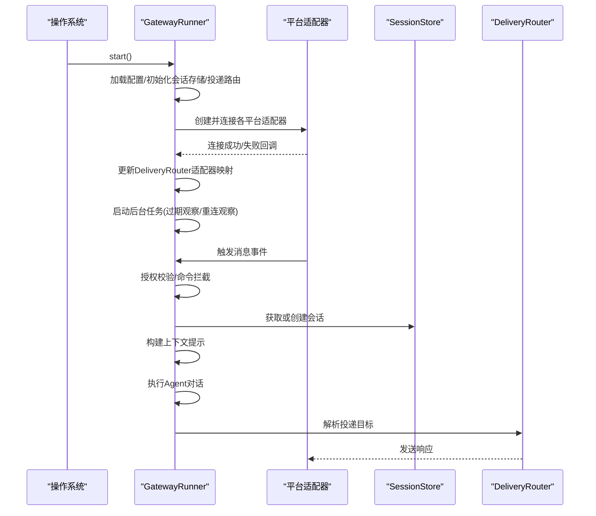
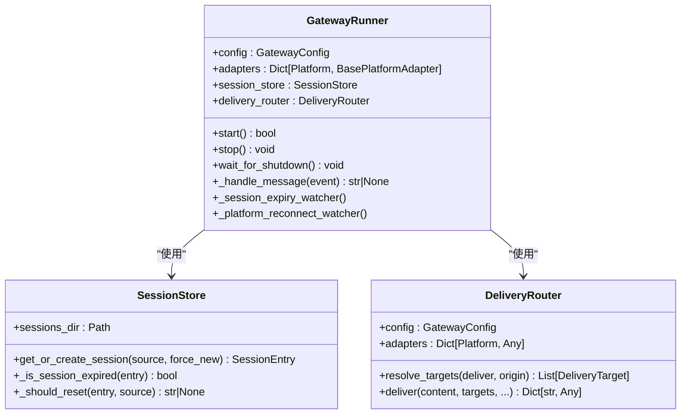
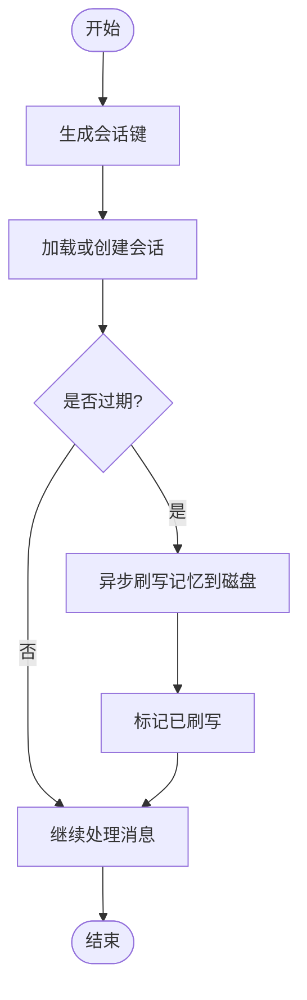
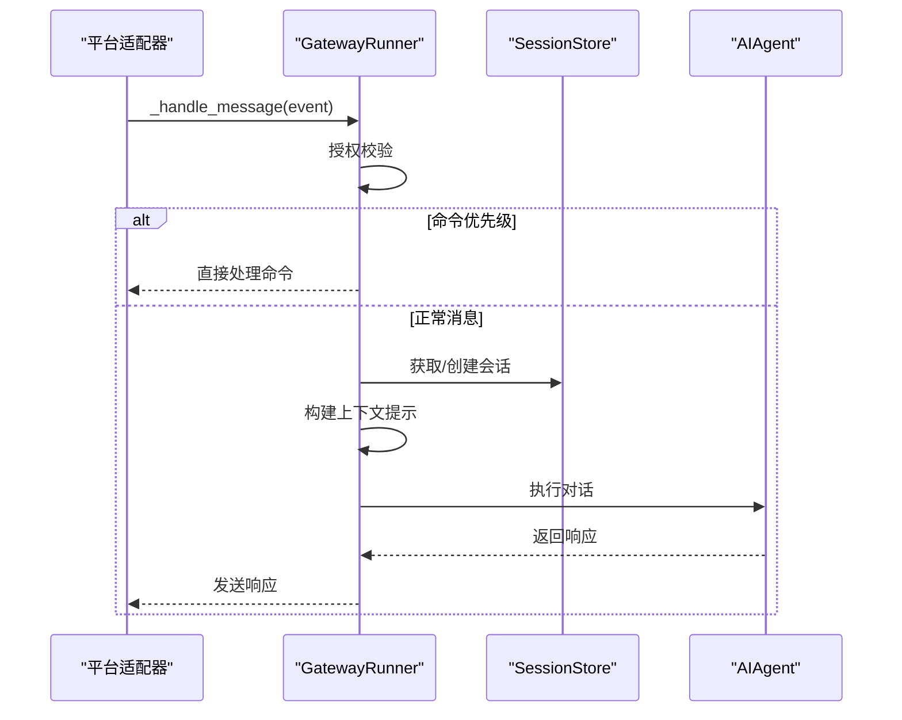
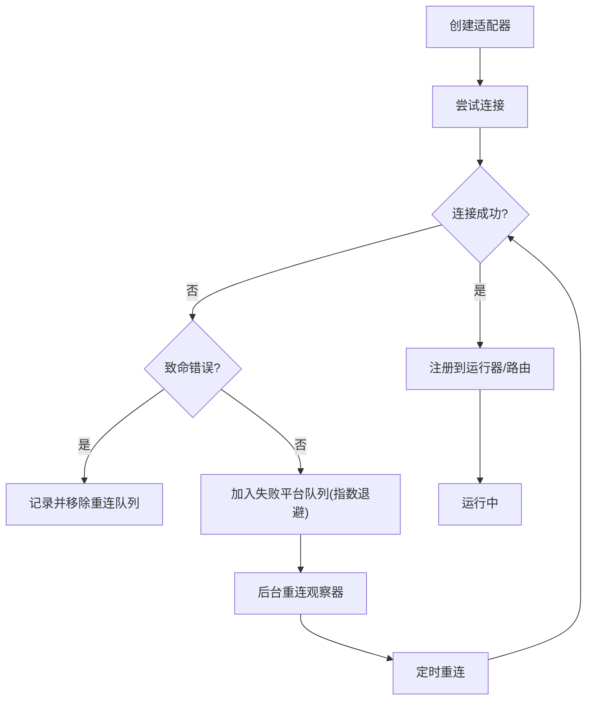
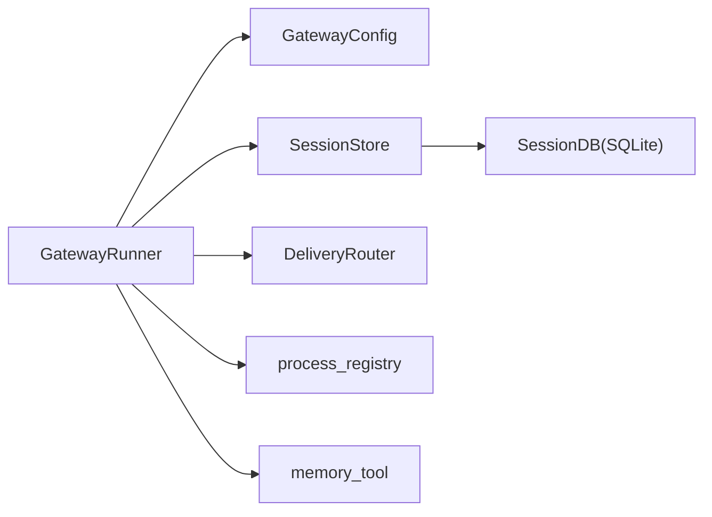

# 网关运行器架构

<cite>
**本文档引用的文件**
- [gateway/run.py](file://gateway/run.py)
- [gateway/session.py](file://gateway/session.py)
- [gateway/config.py](file://gateway/config.py)
- [gateway/delivery.py](file://gateway/delivery.py)
- [gateway/__init__.py](file://gateway/__init__.py)
</cite>

## 目录
1. [简介](#简介)
2. [项目结构](#项目结构)
3. [核心组件](#核心组件)
4. [架构总览](#架构总览)
5. [详细组件分析](#详细组件分析)
6. [依赖关系分析](#依赖关系分析)
7. [性能考虑](#性能考虑)
8. [故障排除指南](#故障排除指南)
9. [结论](#结论)

## 简介
本文件面向Hermes Agent网关运行器（GatewayRunner）的架构与实现，系统性阐述其生命周期管理、适配器协调、会话缓存机制、消息处理流程、并发控制与中断处理、适配器管理模式、配置选项与性能调优、以及部署最佳实践与故障排除。目标是帮助开发者与运维人员全面理解GatewayRunner如何在多平台消息渠道间协调Agent执行，并确保稳定性与可维护性。

## 项目结构
Gateway子系统位于`gateway/`目录，主要模块职责如下：
- `run.py`: 网关入口与运行器主控，包含GatewayRunner类、启动/停止逻辑、消息处理流水线、后台任务调度等
- `session.py`: 会话管理与持久化，含会话键生成、重置策略、上下文注入、SQLite/JSON回退存储
- `config.py`: 配置模型与加载，含平台配置、会话重置策略、流式传输配置、环境变量覆盖
- `delivery.py`: 投递路由，解析目标、本地落盘与平台投递、输出截断与元数据传递
- `__init__.py`: 对外导出配置、会话与投递相关类型

```mermaid
graph TB
subgraph "网关核心"
Runner["GatewayRunner<br/>运行器主控"]
Config["GatewayConfig<br/>配置模型"]
Session["SessionStore<br/>会话存储"]
Router["DeliveryRouter<br/>投递路由"]
end
subgraph "平台适配器"
TA["TelegramAdapter"]
DA["DiscordAdapter"]
WA["WhatsAppAdapter"]
SA["SlackAdapter"]
SIGA["SignalAdapter"]
EA["EmailAdapter"]
SMA["SmsAdapter"]
MA["MattermostAdapter"]
MXA["MatrixAdapter"]
DKA["DingTalkAdapter"]
FA["FeishuAdapter"]
WCA["WeComAdapter"]
HA["HomeAssistantAdapter"]
APIA["APIServerAdapter"]
WH["WebhookAdapter"]
end
Runner --> Config
Runner --> Session
Runner --> Router
Runner --> TA
Runner --> DA
Runner --> WA
Runner --> SA
Runner --> SIGA
Runner --> EA
Runner --> SMA
Runner --> MA
Runner --> MXA
Runner --> DKA
Runner --> FA
Runner --> WCA
Runner --> HA
Runner --> APIA
Runner --> WH
```

图表来源
- [gateway/run.py:461-1652](file://gateway/run.py#L461-L1652)
- [gateway/config.py:218-401](file://gateway/config.py#L218-L401)
- [gateway/session.py:503-800](file://gateway/session.py#L503-L800)
- [gateway/delivery.py:107-318](file://gateway/delivery.py#L107-L318)

章节来源
- [gateway/__init__.py:1-36](file://gateway/__init__.py#L1-L36)
- [gateway/config.py:1-200](file://gateway/config.py#L1-L200)
- [gateway/session.py:1-120](file://gateway/session.py#L1-L120)
- [gateway/delivery.py:1-60](file://gateway/delivery.py#L1-L60)
- [gateway/run.py:1-120](file://gateway/run.py#L1-L120)

## 核心组件
- GatewayRunner：网关生命周期与消息处理中枢，负责适配器创建/连接、消息分发、会话管理、后台任务、错误处理与优雅停机
- SessionStore：会话持久化与重置策略执行，支持SQLite与JSONL双轨存储，提供过期检测与内存预刷
- GatewayConfig：统一配置模型，支持多源合并（环境变量、config.yaml、legacy gateway.json），并提供平台连接性判定
- DeliveryRouter：投递目标解析与路由，支持origin/local/平台home/显式平台:chat_id格式，本地落盘与平台投递

章节来源
- [gateway/run.py:461-570](file://gateway/run.py#L461-L570)
- [gateway/session.py:503-625](file://gateway/session.py#L503-L625)
- [gateway/config.py:218-401](file://gateway/config.py#L218-L401)
- [gateway/delivery.py:107-173](file://gateway/delivery.py#L107-L173)

## 架构总览
GatewayRunner采用“事件驱动 + 平台适配器 + 会话缓存”的架构模式：
- 启动阶段：加载配置、初始化会话存储、构建投递路由、按平台创建适配器并建立连接；失败平台进入后台重连队列
- 运行阶段：适配器回调触发消息处理，进行授权校验、命令拦截、会话获取/创建、上下文构建、Agent执行、响应投递
- 停止阶段：中断运行中Agent、断开适配器、清理后台任务、写入运行时状态

图表来源
- [gateway/run.py:1047-1267](file://gateway/run.py#L1047-L1267)
- [gateway/run.py:1762-2296](file://gateway/run.py#L1762-L2296)
- [gateway/session.py:692-771](file://gateway/session.py#L692-L771)
- [gateway/delivery.py:174-214](file://gateway/delivery.py#L174-L214)

## 详细组件分析

### GatewayRunner类设计与生命周期
- 初始化阶段
  - 加载临时配置（预填充消息、系统提示、推理配置、智能路由、回退模型等）
  - 构造SessionStore（支持进程活跃性检查）、DeliveryRouter
  - 初始化运行中Agent跟踪、待处理消息队列、待审批执行、失败平台重连队列、更新提示等待、语音模式持久化、后台任务集合
- 启动阶段
  - 遍历已启用平台，创建对应适配器实例，设置消息处理器、致命错误处理器、会话存储
  - 尝试连接，记录成功/失败；对可重试错误加入失败平台队列，非可重试错误记录并可能直接退出
  - 更新DeliveryRouter适配器映射，启动后台任务：会话过期观察者（预刷记忆）、平台重连观察者
- 运行阶段
  - 消息处理主流程：授权校验、命令优先级处理、中断/排队、会话获取/创建、上下文构建、Agent执行、响应投递
  - 后台任务：定期检查会话过期并异步刷写记忆，指数退避重连失败平台
- 停止阶段
  - 中断所有运行中Agent、取消后台任务、断开适配器、清理状态、写入运行时状态

图表来源
- [gateway/run.py:461-570](file://gateway/run.py#L461-L570)
- [gateway/session.py:503-625](file://gateway/session.py#L503-L625)
- [gateway/delivery.py:107-173](file://gateway/delivery.py#L107-L173)

章节来源
- [gateway/run.py:461-570](file://gateway/run.py#L461-L570)
- [gateway/run.py:1047-1267](file://gateway/run.py#L1047-L1267)
- [gateway/run.py:1269-1371](file://gateway/run.py#L1269-L1371)
- [gateway/run.py:1372-1473](file://gateway/run.py#L1372-L1473)
- [gateway/run.py:1474-1524](file://gateway/run.py#L1474-L1524)

### 会话缓存机制与生命周期
- 会话键生成：基于平台、聊天类型、用户标识、线程标识等，确保DM隔离、群组/频道共享或按用户隔离策略
- 会话存储：优先SQLite（SessionDB），回退JSONL；支持会话过期检测、自动重置通知、历史计数判断
- Agent缓存：按会话键缓存AIAgent实例，避免每次消息重建系统提示导致前缀缓存失效，显著降低成本
- 内存预刷：过期观察者周期性将即将过期会话的记忆写入磁盘，避免下次消息到达时阻塞等待

图表来源
- [gateway/session.py:444-501](file://gateway/session.py#L444-L501)
- [gateway/session.py:692-771](file://gateway/session.py#L692-L771)
- [gateway/run.py:1269-1371](file://gateway/run.py#L1269-L1371)

章节来源
- [gateway/session.py:444-501](file://gateway/session.py#L444-L501)
- [gateway/session.py:503-625](file://gateway/session.py#L503-L625)
- [gateway/session.py:692-771](file://gateway/session.py#L692-L771)
- [gateway/run.py:1269-1371](file://gateway/run.py#L1269-L1371)

### 消息处理流程与并发控制
- 授权校验：支持平台级允许列表、全局允许、DM配对码、允许全部开关
- 命令拦截优先级：/new、/reset、/stop、/approve、/deny、/queue、/model等，避免与运行中Agent冲突
- 中断与排队：同一会话内新消息到达时，若Agent正在运行则中断；图片/媒体事件特殊处理，避免过度中断
- 会话边界保护：使用_sentinel占位，防止并发消息同时创建重复Agent
- 异步执行：后台任务以协程方式运行，避免阻塞事件循环；线程池用于内存刷写等阻塞操作

图表来源
- [gateway/run.py:1762-2296](file://gateway/run.py#L1762-L2296)
- [gateway/session.py:692-771](file://gateway/session.py#L692-L771)

章节来源
- [gateway/run.py:1762-2296](file://gateway/run.py#L1762-L2296)
- [gateway/run.py:2276-2296](file://gateway/run.py#L2276-L2296)

### 适配器管理模式
- 动态创建：根据平台枚举选择对应适配器，必要时检查依赖与环境变量
- 错误分类：致命错误（如认证失败）与可重试错误（网络抖动）分别处理
- 后台重连：失败平台按指数退避重连，最多尝试次数限制；非可重试错误直接移除
- 连接状态管理：连接成功后同步语音模式、更新通道目录、接入投递路由

图表来源
- [gateway/run.py:1529-1652](file://gateway/run.py#L1529-L1652)
- [gateway/run.py:1372-1473](file://gateway/run.py#L1372-L1473)

章节来源
- [gateway/run.py:1529-1652](file://gateway/run.py#L1529-L1652)
- [gateway/run.py:1372-1473](file://gateway/run.py#L1372-L1473)

### 配置选项详解
- 平台配置
  - 平台启用标志、令牌/密钥、Home频道、回复线程模式等
  - 支持通过环境变量覆盖，优先级高于legacy gateway.json
- 会话重置策略
  - 模式：daily/idle/both/none；每日重置小时、空闲分钟、通知开关与排除平台
- 流式传输
  - 编辑传输、编辑间隔、缓冲阈值、光标样式
- 会话隔离
  - 群组按用户隔离、线程按用户隔离策略
- 其他
  - STT开关、Unauthorized DM行为、快速命令、always_log_local、语音模式持久化路径

章节来源
- [gateway/config.py:218-401](file://gateway/config.py#L218-L401)
- [gateway/config.py:415-662](file://gateway/config.py#L415-L662)
- [gateway/run.py:863-1046](file://gateway/run.py#L863-L1046)

### 性能调优参数与资源限制
- Agent超时控制：HERMES_AGENT_TIMEOUT控制“空闲超时”与“墙钟超时”，避免长时间挂起任务
- 线程池与异步：内存刷写使用线程池，避免阻塞事件循环；后台任务以小步睡眠快速响应停止信号
- 提示缓存：Agent缓存按会话键复用，减少系统提示重建成本
- 输出截断：平台输出超过阈值时截断并保存全文，平衡平台限制与可观测性

章节来源
- [gateway/run.py:1855-1898](file://gateway/run.py#L1855-L1898)
- [gateway/run.py:1310-1371](file://gateway/run.py#L1310-L1371)
- [gateway/delivery.py:286-294](file://gateway/delivery.py#L286-L294)

## 依赖关系分析
- 组件耦合
  - GatewayRunner强依赖SessionStore与DeliveryRouter，弱依赖各平台适配器
  - 适配器仅通过回调与运行器交互，解耦良好
- 外部依赖
  - hermes_state.SessionDB（SQLite会话存储）
  - tools.process_registry（后台进程恢复与检查点）
  - tools.memory_tool（内存刷写辅助）
  - hermes_cli.config/env_loader（配置桥接与环境变量）

图表来源
- [gateway/run.py:488-493](file://gateway/run.py#L488-L493)
- [gateway/session.py:521-528](file://gateway/session.py#L521-L528)

章节来源
- [gateway/run.py:488-493](file://gateway/run.py#L488-L493)
- [gateway/session.py:521-528](file://gateway/session.py#L521-L528)

## 性能考虑
- 会话缓存与提示缓存：通过Agent缓存避免重复构建系统提示，显著降低大模型调用成本
- 异步与线程池：后台任务与内存刷写分离，避免主线程阻塞
- 指数退避重连：失败平台采用指数退避，降低无效重试压力
- 输出截断与本地落盘：避免平台限流与长文本传输带来的延迟

## 故障排除指南
- 启动失败
  - 若无任何平台连接成功且存在不可重试错误，运行器会记录原因并请求干净退出
  - 若存在可重试错误，返回False并等待后台重连观察器处理
- 平台连接失败
  - 可重试错误：加入失败平台队列，按指数退避重连
  - 不可重试错误：移除队列并记录警告
- 适配器致命错误
  - 若所有适配器断开，根据错误类型决定是否以失败退出（便于服务重启）
- 授权问题
  - 未配置允许列表或未开启允许全部时，默认拒绝所有用户；DM场景可使用配对码
- 会话过期与记忆丢失
  - 使用过期观察者预刷写记忆；若多次失败，最终标记为已刷写以防无限重试
- 停止与中断
  - 停止时会中断运行中Agent、断开适配器、取消后台任务；强制停止命令可清空会话锁

章节来源
- [gateway/run.py:1178-1267](file://gateway/run.py#L1178-L1267)
- [gateway/run.py:800-856](file://gateway/run.py#L800-L856)
- [gateway/run.py:1474-1524](file://gateway/run.py#L1474-L1524)
- [gateway/run.py:1269-1371](file://gateway/run.py#L1269-L1371)

## 结论
GatewayRunner通过清晰的生命周期管理、健壮的适配器协调、高效的会话缓存与消息处理流水线，实现了跨平台消息网关的稳定运行。其后台任务与错误恢复机制确保了在复杂网络环境下仍能保持高可用；配置体系与性能调优参数为不同规模部署提供了灵活的优化空间。建议在生产环境中结合日志与运行时状态监控，配合合理的会话重置策略与平台授权配置，获得最佳的稳定性与用户体验。