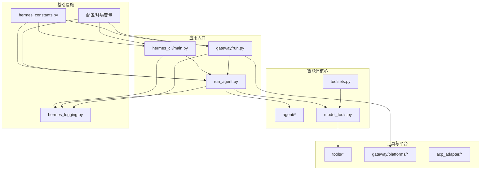
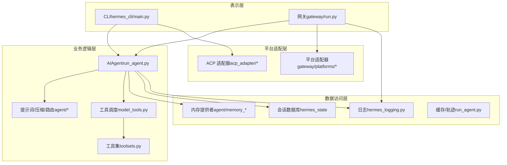
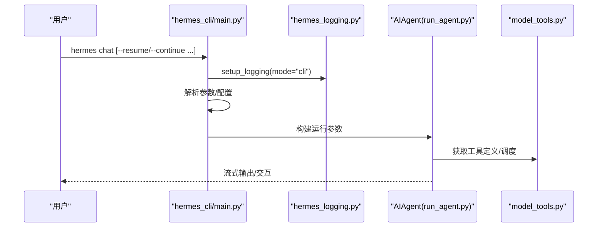
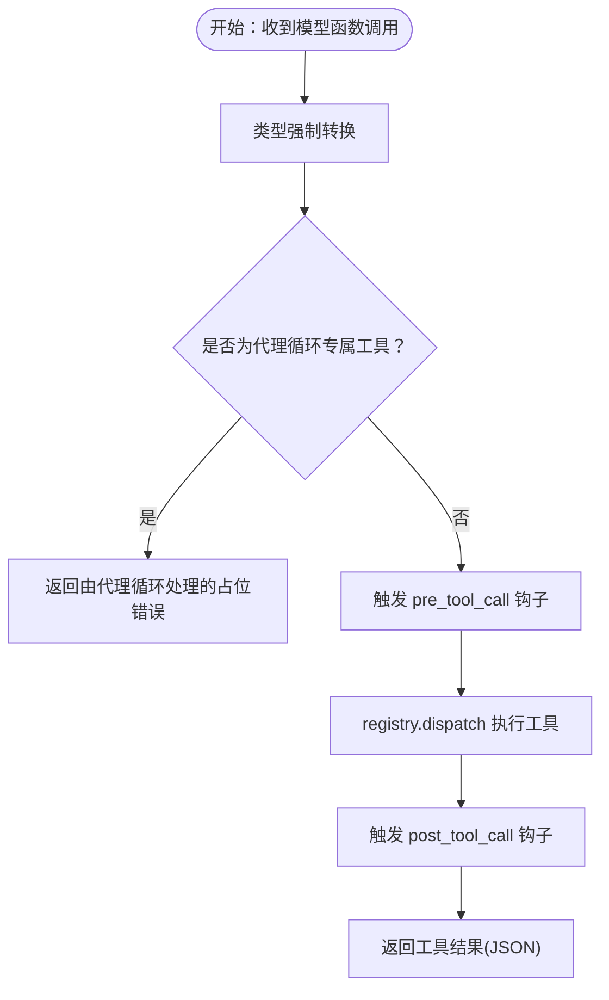
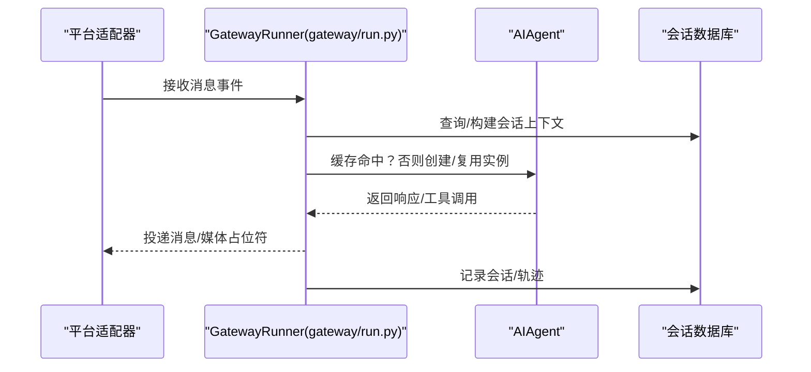
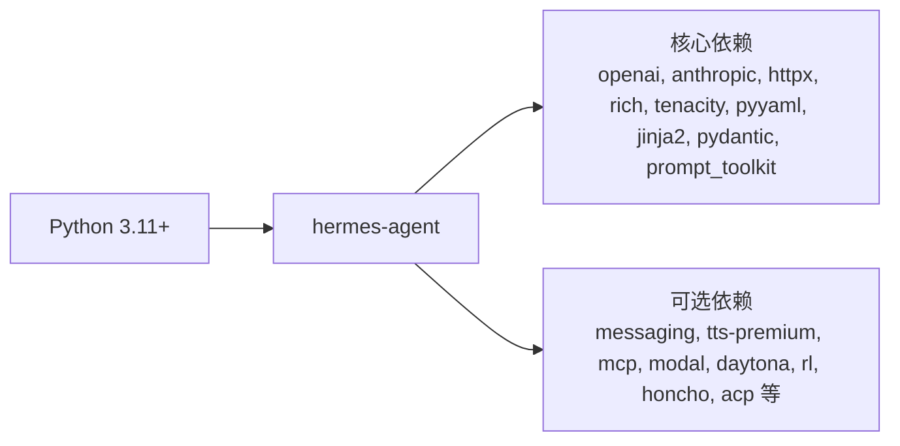

# 系统概览

<cite>
**本文引用的文件**
- [README.md](file://README.md)
- [pyproject.toml](file://pyproject.toml)
- [requirements.txt](file://requirements.txt)
- [cli.py](file://cli.py)
- [run_agent.py](file://run_agent.py)
- [hermes_cli/main.py](file://hermes_cli/main.py)
- [gateway/run.py](file://gateway/run.py)
- [agent/__init__.py](file://agent/__init__.py)
- [tools/__init__.py](file://tools/__init__.py)
- [acp_adapter/__init__.py](file://acp_adapter/__init__.py)
- [hermes_constants.py](file://hermes_constants.py)
- [hermes_logging.py](file://hermes_logging.py)
- [model_tools.py](file://model_tools.py)
- [toolsets.py](file://toolsets.py)
</cite>

## 目录
1. [引言](#引言)
2. [项目结构](#项目结构)
3. [核心组件](#核心组件)
4. [架构总览](#架构总览)
5. [详细组件分析](#详细组件分析)
6. [依赖分析](#依赖分析)
7. [性能考虑](#性能考虑)
8. [故障排查指南](#故障排查指南)
9. [结论](#结论)
10. [附录](#附录)

## 引言
本文件面向 Hermes Agent 的系统架构与设计理念，提供从高层到代码级的系统概览。重点阐述：
- 整体架构理念：以“工具即能力”的模块化思想为核心，通过统一的工具注册与调度机制，将模型推理与外部能力解耦。
- 分层架构：表示层（CLI/网关）、业务逻辑层（智能体循环与工具执行）、数据访问层（内存/会话/日志）。
- 模块化设计：通过清晰的组件边界（工具集、平台适配器、内存提供者）实现高内聚低耦合。
- 技术栈与第三方依赖：围绕 Python 生态构建，结合 OpenAI 兼容接口、多平台消息网关、可插拔工具体系。
- 架构决策对性能、可扩展性、可维护性的影响。

## 项目结构
Hermes Agent 采用按功能域划分的包结构，核心目录与职责如下：
- agent：智能体内部模块（记忆、提示词、压缩、路由等），从 run_agent 中抽取，保持主循环类的简洁。
- tools：工具注册与发现、工具集定义与解析、工具实现与运行时桥接。
- hermes_cli：命令行入口与子命令管理（聊天、网关、设置、诊断等）。
- gateway：消息平台网关，负责多平台适配、会话管理、投递路由。
- cron：定时任务调度与作业管理。
- acp_adapter：编辑器集成（Agent Communication Protocol）适配器。
- optional-skills、skills：可选技能与内置技能生态。
- plugins：插件系统，支持扩展工具集与钩子。
- docs、website：文档与站点资源。

图表来源
- [hermes_cli/main.py:1-800](file://hermes_cli/main.py#L1-L800)
- [run_agent.py:1-800](file://run_agent.py#L1-L800)
- [gateway/run.py:1-800](file://gateway/run.py#L1-L800)
- [model_tools.py:1-578](file://model_tools.py#L1-L578)
- [toolsets.py:1-638](file://toolsets.py#L1-L638)
- [hermes_logging.py:1-230](file://hermes_logging.py#L1-L230)
- [hermes_constants.py:1-106](file://hermes_constants.py#L1-L106)

章节来源
- [README.md:1-176](file://README.md#L1-L176)
- [pyproject.toml:1-116](file://pyproject.toml#L1-L116)

## 核心组件
- 命令行入口与子命令（hermes_cli/main.py）
  - 提供聊天、网关、设置、诊断、版本、更新、ACPI 服务等命令。
  - 在启动前加载 .env、初始化集中式日志，并根据参数构建运行上下文。
- 智能体运行器（run_agent.py）
  - AIAgent 类封装对话循环、工具调用、上下文压缩、预算控制、并发工具执行、流式输出回调等。
  - 负责与模型提供商对接、处理工具结果、内存与轨迹持久化。
- 工具系统（model_tools.py + toolsets.py + tools/*）
  - model_tools：工具注册发现、异步桥接、函数调用分发、类型强制转换、可用性检查。
  - toolsets：工具集定义与组合解析，支持静态与插件动态工具集。
  - tools：具体工具实现（终端、文件、浏览器、网络、语音、技能、委托等）。
- 网关（gateway/run.py）
  - 多平台适配器（Telegram、Discord、Slack、WhatsApp、Signal、邮件等）统一接入。
  - 会话管理、消息投递、权限与安全、后台任务与重连、语音模式与 TTS 配置。
- 日志与常量（hermes_logging.py、hermes_constants.py）
  - 统一日志文件与格式、轮转与脱敏；常量与路径解析（HERMES_HOME、推理端点等）。
- ACP 适配器（acp_adapter/*）
  - 支持 VS Code、Zed、JetBrains 等编辑器的 Agent 集成。

章节来源
- [hermes_cli/main.py:1-800](file://hermes_cli/main.py#L1-L800)
- [run_agent.py:1-800](file://run_agent.py#L1-L800)
- [model_tools.py:1-578](file://model_tools.py#L1-L578)
- [toolsets.py:1-638](file://toolsets.py#L1-L638)
- [gateway/run.py:1-800](file://gateway/run.py#L1-L800)
- [hermes_logging.py:1-230](file://hermes_logging.py#L1-L230)
- [hermes_constants.py:1-106](file://hermes_constants.py#L1-L106)
- [acp_adapter/__init__.py:1-2](file://acp_adapter/__init__.py#L1-L2)

## 架构总览
Hermes Agent 采用“工具即能力”的模块化架构：
- 表示层：CLI 与网关分别面向终端用户与多平台消息用户，二者共享同一智能体内核。
- 业务逻辑层：AIAgent 负责对话循环、工具调度、上下文管理、预算与流控。
- 数据访问层：内存提供者、会话数据库、日志与缓存、轨迹存储。
- 平台适配层：各消息平台适配器，统一事件模型与交付路由。
- 工具层：工具注册中心与工具集系统，支持静态与插件动态扩展。

图表来源
- [hermes_cli/main.py:1-800](file://hermes_cli/main.py#L1-L800)
- [run_agent.py:1-800](file://run_agent.py#L1-L800)
- [gateway/run.py:1-800](file://gateway/run.py#L1-L800)
- [model_tools.py:1-578](file://model_tools.py#L1-L578)
- [toolsets.py:1-638](file://toolsets.py#L1-L638)
- [hermes_logging.py:1-230](file://hermes_logging.py#L1-L230)

## 详细组件分析

### 命令行入口与生命周期（hermes_cli/main.py）
- 启动流程：解析参数、应用配置文件覆盖、加载 .env、初始化集中式日志。
- 子命令路由：chat、gateway、setup、doctor、cron、acp 等。
- 首次运行保护：检测是否已配置提供商，未配置则引导 setup。
- 会话解析：支持 --continue/--resume 参数解析历史会话。

图表来源
- [hermes_cli/main.py:556-663](file://hermes_cli/main.py#L556-L663)
- [hermes_logging.py:50-142](file://hermes_logging.py#L50-L142)
- [run_agent.py:470-800](file://run_agent.py#L470-L800)
- [model_tools.py:234-354](file://model_tools.py#L234-L354)

章节来源
- [hermes_cli/main.py:1-800](file://hermes_cli/main.py#L1-L800)
- [hermes_logging.py:1-230](file://hermes_logging.py#L1-L230)

### 智能体运行器与工具调度（run_agent.py + model_tools.py）
- AIAgent 职责
  - 对话循环、工具调用、上下文压缩、预算控制、并发工具执行、流式回调、内存与轨迹持久化。
  - 运行期状态：迭代预算、活动跟踪、流式输出、中断机制、子代理委托。
- 工具系统
  - 注册发现：导入工具模块触发注册，支持 MCP 与插件动态发现。
  - 异步桥接：持久事件循环避免“事件循环已关闭”错误，保障缓存客户端生命周期。
  - 函数调用分发：类型强制转换、前置/后置钩子、可用性过滤、动态 execute_code 架构。
- 工具集
  - 定义与组合：静态工具集与插件动态工具集统一解析，支持别名 all/* 自动包含未来工具集。

图表来源
- [model_tools.py:459-549](file://model_tools.py#L459-L549)
- [run_agent.py:470-800](file://run_agent.py#L470-L800)

章节来源
- [run_agent.py:1-800](file://run_agent.py#L1-L800)
- [model_tools.py:1-578](file://model_tools.py#L1-L578)
- [toolsets.py:1-638](file://toolsets.py#L1-L638)

### 网关与多平台适配（gateway/run.py）
- 生命周期与配置
  - 加载 .env 与 config.yaml，桥接终端与辅助模型配置到环境变量。
  - 初始化集中式日志、会话数据库、配对存储、钩子系统。
- 适配器与会话
  - 统一平台适配器接口，消息入队/出队、媒体占位符、命令可用性检查。
  - 会话键生成、会话上下文构建、会话搜索工具支持。
- 运行期优化
  - AIAgent 实例缓存（保留提示词缓存）、失败平台重连、语音模式持久化。

图表来源
- [gateway/run.py:461-800](file://gateway/run.py#L461-L800)
- [run_agent.py:470-800](file://run_agent.py#L470-L800)

章节来源
- [gateway/run.py:1-800](file://gateway/run.py#L1-L800)

### 日志与常量（hermes_logging.py、hermes_constants.py）
- 日志
  - 统一 agent.log 与 errors.log，轮转与脱敏，抑制噪声日志，支持 verbose 模式。
- 常量
  - HERMES_HOME 解析、可选技能目录、推理端点常量、推理努力级别解析。

章节来源
- [hermes_logging.py:1-230](file://hermes_logging.py#L1-L230)
- [hermes_constants.py:1-106](file://hermes_constants.py#L1-L106)

### ACP 适配器（acp_adapter/*）
- 为编辑器提供 Agent 集成能力，支持 VS Code、Zed、JetBrains 等。
- 与 hermes_cli/main.py 的命令行入口协同工作。

章节来源
- [acp_adapter/__init__.py:1-2](file://acp_adapter/__init__.py#L1-L2)
- [hermes_cli/main.py:1-800](file://hermes_cli/main.py#L1-L800)

## 依赖分析
- 语言与运行时
  - Python 3.11+，使用 setuptools 构建，脚本入口通过 pyproject.toml 定义。
- 核心依赖
  - openai、anthropic、httpx、rich、tenacity、pyyaml、jinja2、pydantic、prompt_toolkit 等。
- 可选依赖
  - 消息平台（Telegram、Discord、Slack 等）、语音（ElevenLabs、Edge TTS）、MCP、Modal、Daytona、RL 等。
- 依赖策略
  - 通过 extras 控制安装范围，按需启用平台或功能；核心依赖严格版本范围以降低供应链风险。

图表来源
- [pyproject.toml:13-97](file://pyproject.toml#L13-L97)
- [requirements.txt:1-37](file://requirements.txt#L1-L37)

章节来源
- [pyproject.toml:1-116](file://pyproject.toml#L1-L116)
- [requirements.txt:1-37](file://requirements.txt#L1-L37)

## 性能考虑
- 工具并发与流控
  - 并发工具批处理的安全判定、最大并发线程数限制、只读工具并行、路径作用域去重。
- 上下文与成本
  - 上下文压缩、提示词缓存（Anthropic）、推理努力级别控制、预算压力告警。
- I/O 与网络
  - 异步桥接与持久事件循环，避免“事件循环已关闭”错误；HTTP 客户端缓存与连接复用。
- 网关与平台
  - AIAgent 实例缓存减少重复系统提示词计算；失败平台后台重连；媒体占位符避免消息丢失。

章节来源
- [run_agent.py:165-407](file://run_agent.py#L165-L407)
- [model_tools.py:44-126](file://model_tools.py#L44-L126)
- [gateway/run.py:506-548](file://gateway/run.py#L506-L548)

## 故障排查指南
- 配置与依赖
  - 使用 hermes doctor 检查配置与依赖；首次运行无提供商配置时引导 setup。
- 日志定位
  - 查看 ~/.hermes/logs/agent.log 与 errors.log；verbose 模式下输出更详细。
- 网关问题
  - 平台连接失败时查看失败平台重试队列；检查 SSL 证书环境变量；确认 .env 与 config.yaml 的桥接值。
- 工具问题
  - 工具可用性检查与要求验证；MCP/插件工具发现失败时查看日志调试信息。

章节来源
- [hermes_cli/main.py:181-280](file://hermes_cli/main.py#L181-L280)
- [hermes_logging.py:50-142](file://hermes_logging.py#L50-L142)
- [gateway/run.py:1-800](file://gateway/run.py#L1-L800)
- [model_tools.py:172-184](file://model_tools.py#L172-L184)

## 结论
Hermes Agent 通过“工具即能力”的模块化设计，实现了跨平台、可扩展、可维护的智能体系统。其分层架构与清晰的组件边界，使得：
- 表示层与业务逻辑层解耦，便于扩展新的交互入口；
- 工具系统支持静态与插件动态扩展，满足多样化场景；
- 网关统一多平台适配，降低平台差异带来的复杂度；
- 日志与常量体系提供一致的可观测性与配置管理。

这些设计在性能（并发、缓存、预算）、可扩展性（工具集、插件、平台）与可维护性（模块化、日志、诊断）方面均提供了稳健支撑。

## 附录
- 快速安装与入门参考见 README。
- 技术栈与依赖详见 pyproject.toml 与 requirements.txt。
- 项目结构与模块职责参见各文件头部注释与目录说明。

章节来源
- [README.md:1-176](file://README.md#L1-L176)
- [pyproject.toml:1-116](file://pyproject.toml#L1-L116)
- [requirements.txt:1-37](file://requirements.txt#L1-L37)