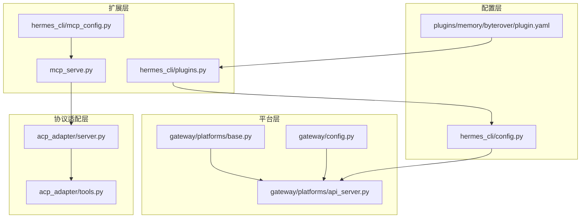
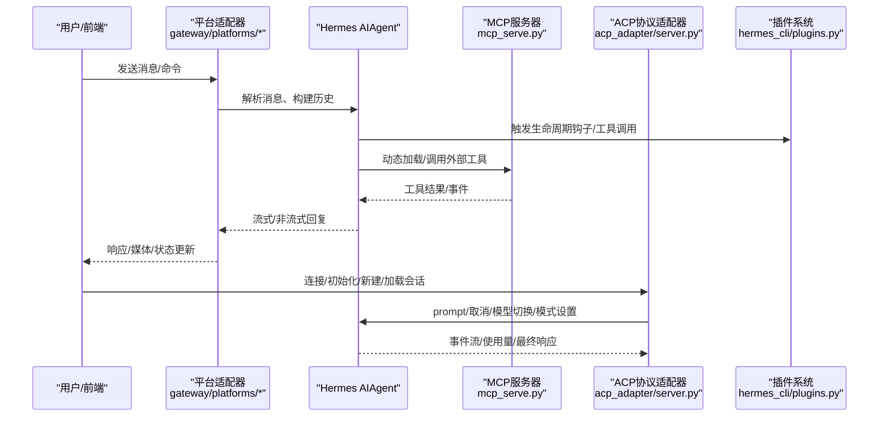
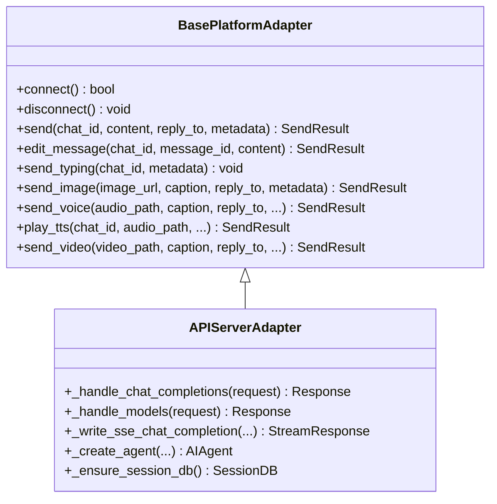
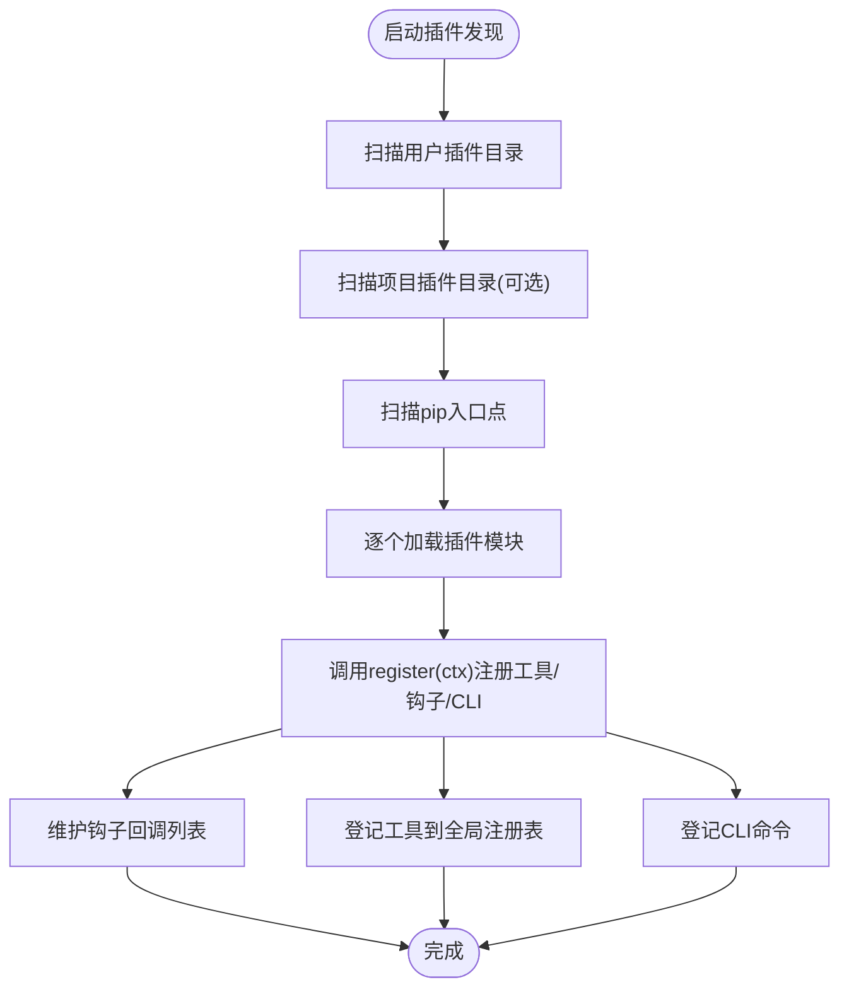
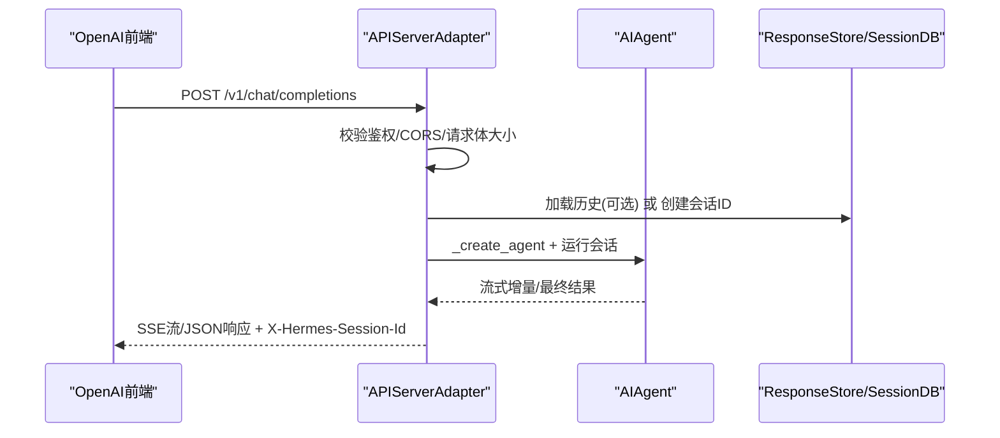
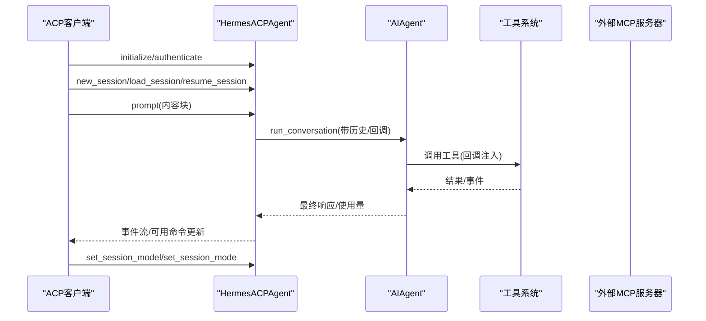
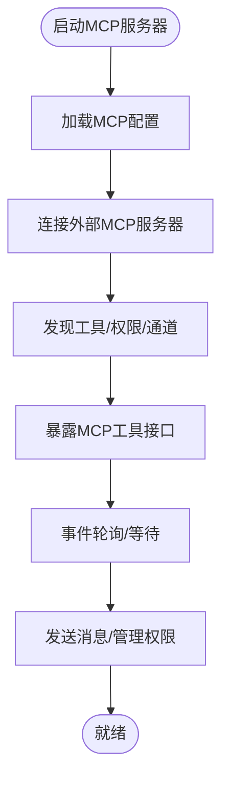
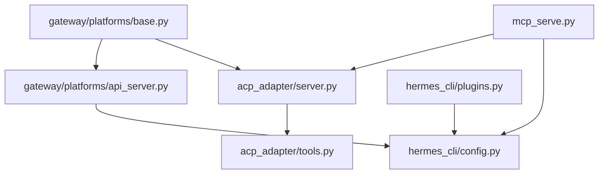

# 集成模式

<cite>
**本文档引用的文件**
- [acp_adapter/__init__.py](file://acp_adapter/__init__.py)
- [acp_adapter/server.py](file://acp_adapter/server.py)
- [acp_adapter/tools.py](file://acp_adapter/tools.py)
- [gateway/platforms/base.py](file://gateway/platforms/base.py)
- [gateway/platforms/api_server.py](file://gateway/platforms/api_server.py)
- [gateway/config.py](file://gateway/config.py)
- [hermes_cli/plugins.py](file://hermes_cli/plugins.py)
- [hermes_cli/mcp_config.py](file://hermes_cli/mcp_config.py)
- [mcp_serve.py](file://mcp_serve.py)
- [plugins/memory/byterover/plugin.yaml](file://plugins/memory/byterover/plugin.yaml)
- [hermes_cli/config.py](file://hermes_cli/config.py)
</cite>

## 目录
1. [简介](#简介)
2. [项目结构](#项目结构)
3. [核心组件](#核心组件)
4. [架构总览](#架构总览)
5. [详细组件分析](#详细组件分析)
6. [依赖分析](#依赖分析)
7. [性能考虑](#性能考虑)
8. [故障排查指南](#故障排查指南)
9. [结论](#结论)
10. [附录](#附录)

## 简介
本文件面向Hermes Agent的集成与扩展场景，系统化阐述其扩展点与集成机制，覆盖以下主题：
- 平台适配器模式：统一多平台接入、消息收发、媒体处理与会话状态管理
- 插件系统架构：插件发现、加载、生命周期钩子、工具注册与依赖注入
- API扩展机制：基于OpenAI兼容接口的HTTP服务、会话连续性与流式输出
- ACPI协议集成：协议适配器、消息转换、状态同步与工具调用事件桥接
- MCP（Meta-Client Protocol）集成：工具发现、动态加载、安全控制与运行时桥接

目标是帮助开发者快速完成新平台接入、自定义工具开发与第三方服务集成，并提供测试策略、兼容性与版本管理建议。

## 项目结构
Hermes Agent采用分层模块化组织：
- 平台层：gateway/platforms 提供多种消息平台适配器（Telegram、Discord、API Server等）
- 协议适配层：acp_adapter 实现Agent Client Protocol（ACP）适配
- 扩展层：hermes_cli/plugins 提供插件系统；mcp_serve 提供MCP服务器能力
- 配置层：hermes_cli/config 与 gateway/config 统一配置来源与优先级

图示来源
- [gateway/platforms/base.py](file://gateway/platforms/base.py)
- [gateway/platforms/api_server.py](file://gateway/platforms/api_server.py)
- [gateway/config.py](file://gateway/config.py)
- [acp_adapter/server.py](file://acp_adapter/server.py)
- [acp_adapter/tools.py](file://acp_adapter/tools.py)
- [hermes_cli/plugins.py](file://hermes_cli/plugins.py)
- [mcp_serve.py](file://mcp_serve.py)
- [hermes_cli/mcp_config.py](file://hermes_cli/mcp_config.py)
- [hermes_cli/config.py](file://hermes_cli/config.py)
- [plugins/memory/byterover/plugin.yaml](file://plugins/memory/byterover/plugin.yaml)

章节来源
- [gateway/platforms/base.py](file://gateway/platforms/base.py)
- [gateway/platforms/api_server.py](file://gateway/platforms/api_server.py)
- [gateway/config.py](file://gateway/config.py)
- [acp_adapter/server.py](file://acp_adapter/server.py)
- [acp_adapter/tools.py](file://acp_adapter/tools.py)
- [hermes_cli/plugins.py](file://hermes_cli/plugins.py)
- [mcp_serve.py](file://mcp_serve.py)
- [hermes_cli/mcp_config.py](file://hermes_cli/mcp_config.py)
- [hermes_cli/config.py](file://hermes_cli/config.py)
- [plugins/memory/byterover/plugin.yaml](file://plugins/memory/byterover/plugin.yaml)

## 核心组件
- 平台适配器基类与具体实现：统一消息收发、媒体缓存、会话状态与错误处理
- ACP协议适配器：连接生命周期、会话管理、提示处理、命令与工具事件桥接
- 插件系统：三类插件源（用户、项目、pip-entrypoint）、生命周期钩子、工具注册与CLI命令扩展
- MCP服务器：会话列表、消息读取、附件提取、事件轮询/等待、消息发送、通道列表与权限管理
- API服务器：OpenAI兼容接口、响应存储、SSE流式输出、幂等请求与CORS安全头

章节来源
- [gateway/platforms/base.py](file://gateway/platforms/base.py)
- [acp_adapter/server.py](file://acp_adapter/server.py)
- [hermes_cli/plugins.py](file://hermes_cli/plugins.py)
- [mcp_serve.py](file://mcp_serve.py)
- [gateway/platforms/api_server.py](file://gateway/platforms/api_server.py)

## 架构总览
下图展示从平台适配到协议适配再到扩展与外部服务的整体交互：

图示来源
- [gateway/platforms/api_server.py](file://gateway/platforms/api_server.py)
- [acp_adapter/server.py](file://acp_adapter/server.py)
- [mcp_serve.py](file://mcp_serve.py)
- [hermes_cli/plugins.py](file://hermes_cli/plugins.py)

## 详细组件分析

### 平台适配器模式
- 抽象基类职责：统一连接、断开、发送、编辑、打字指示、图片/音频/视频发送、媒体缓存与清理
- 具体实现要点：API Server适配器提供OpenAI兼容端点、SSE流、响应存储、CORS与安全头、幂等请求与会话数据库集成
- 配置与环境：GatewayConfig支持多平台配置、会话重置策略、流式传输、STT开关、未授权DM行为等

图示来源
- [gateway/platforms/base.py](file://gateway/platforms/base.py)
- [gateway/platforms/api_server.py](file://gateway/platforms/api_server.py)

章节来源
- [gateway/platforms/base.py](file://gateway/platforms/base.py)
- [gateway/platforms/api_server.py](file://gateway/platforms/api_server.py)
- [gateway/config.py](file://gateway/config.py)

### 插件系统架构
- 插件源与发现：用户目录、项目目录（可选）、pip入口点；通过plugin.yaml与__init__.py中的register(ctx)函数进行注册
- 生命周期钩子：pre_tool_call、post_tool_call、pre_llm_call、post_llm_call、pre_api_request、post_api_request、on_session_start、on_session_end
- 工具注册：PluginContext.register_tool委托至全局工具注册表，支持异步工具与消息注入
- CLI命令扩展：PluginContext.register_cli_command注册子命令，便于桥接外部工具或远程控制
- 插件清单：记录名称、版本、描述、作者、所需环境变量、提供的工具与钩子、来源路径等

图示来源
- [hermes_cli/plugins.py](file://hermes_cli/plugins.py)

章节来源
- [hermes_cli/plugins.py](file://hermes_cli/plugins.py)
- [plugins/memory/byterover/plugin.yaml](file://plugins/memory/byterover/plugin.yaml)

### API扩展机制（OpenAI兼容）
- 端点与功能：聊天补全（支持流式SSE）、响应API（状态持久化）、模型列表、运行管理（SSE事件流）、健康检查
- 会话连续性：通过X-Hermes-Session-Id头在请求间延续对话历史；API Server适配器从SessionDB加载历史
- 安全与合规：CORS中间件、安全头、请求体大小限制、Idempotency-Key去重、HMAC鉴权
- 流式输出：SSE写入，客户端断连时中断代理任务并清理资源

图示来源
- [gateway/platforms/api_server.py](file://gateway/platforms/api_server.py)
- [hermes_cli/config.py](file://hermes_cli/config.py)

章节来源
- [gateway/platforms/api_server.py](file://gateway/platforms/api_server.py)
- [hermes_cli/config.py](file://hermes_cli/config.py)

### ACPI协议集成
- 协议适配器：HermesACPAgent实现initialize/authenticate/new_session/load_session/resume_session/cancel/fork_session/list_sessions/prompt/set_session_model/set_session_mode/set_config_option
- 消息转换：将ACP内容块转换为文本，拦截斜杠命令本地处理，其余交由AIAgent执行
- 工具事件桥接：通过make_tool_progress_cb、make_thinking_cb、make_step_cb、make_message_cb将工具调用进度、思考过程与消息流回传给ACP客户端
- MCP服务器注册：在会话中动态注册外部MCP服务器，刷新工具表面并使能新工具

图示来源
- [acp_adapter/server.py](file://acp_adapter/server.py)
- [acp_adapter/tools.py](file://acp_adapter/tools.py)

章节来源
- [acp_adapter/server.py](file://acp_adapter/server.py)
- [acp_adapter/tools.py](file://acp_adapter/tools.py)

### MCP集成（工具发现、动态加载、安全控制）
- MCP服务器：提供会话列表、会话详情、消息读取、附件提取、事件轮询/等待、消息发送、通道列表、权限管理等工具
- 事件桥接：基于SQLite会话数据库的轮询队列，维护事件游标、待决审批与内存队列上限
- CLI管理：hermes mcp add/remove/list/test/configure，支持OAuth与HTTP头认证、工具选择与保存
- 安全控制：CORS、安全头、鉴权失败返回、连接超时与异常组解包

图示来源
- [mcp_serve.py](file://mcp_serve.py)
- [hermes_cli/mcp_config.py](file://hermes_cli/mcp_config.py)

章节来源
- [mcp_serve.py](file://mcp_serve.py)
- [hermes_cli/mcp_config.py](file://hermes_cli/mcp_config.py)

## 依赖分析
- 平台适配器依赖：BasePlatformAdapter抽象、消息事件模型、媒体缓存工具、会话状态与运行状态写入
- ACP适配器依赖：acp协议库、会话管理器、工具事件构建器、权限回调、工具定义刷新
- 插件系统依赖：yaml解析、entry-points元数据、工具注册表、CLI命令注册、钩子执行隔离
- API服务器依赖：aiohttp、sqlite3、CORS/安全中间件、会话数据库、幂等缓存
- MCP集成依赖：fastmcp SDK、会话索引与通道目录、事件桥接线程池

图示来源
- [gateway/platforms/base.py](file://gateway/platforms/base.py)
- [gateway/platforms/api_server.py](file://gateway/platforms/api_server.py)
- [acp_adapter/server.py](file://acp_adapter/server.py)
- [acp_adapter/tools.py](file://acp_adapter/tools.py)
- [hermes_cli/plugins.py](file://hermes_cli/plugins.py)
- [mcp_serve.py](file://mcp_serve.py)
- [hermes_cli/config.py](file://hermes_cli/config.py)

章节来源
- [gateway/platforms/base.py](file://gateway/platforms/base.py)
- [gateway/platforms/api_server.py](file://gateway/platforms/api_server.py)
- [acp_adapter/server.py](file://acp_adapter/server.py)
- [acp_adapter/tools.py](file://acp_adapter/tools.py)
- [hermes_cli/plugins.py](file://hermes_cli/plugins.py)
- [mcp_serve.py](file://mcp_serve.py)
- [hermes_cli/config.py](file://hermes_cli/config.py)

## 性能考虑
- 平台适配器
  - 媒体缓存：图片/音频/文档缓存目录与定期清理，避免重复下载与过期URL
  - 重试策略：网络请求指数退避重试，区分瞬时错误与不可重试错误
- API服务器
  - SSE流式输出：按增量写入，客户端断连时及时中断代理任务
  - 幂等缓存：基于请求指纹的内存缓存，限制最大项数与TTL
  - 数据库存储：LRU响应存储与会话数据库分离，减少磁盘争用
- ACP/MCP
  - 事件轮询：基于mtime检查跳过空闲轮询，降低CPU占用
  - 线程池：ACP代理调用使用线程池并发执行，避免阻塞事件循环
- 插件系统
  - 钩子隔离：每个回调独立try/except，防止单个插件崩溃影响主流程
  - 工具注册：延迟加载与按需注册，减少启动时间

## 故障排查指南
- 平台适配器
  - SSRF保护：URL安全校验失败会抛出异常，检查URL是否指向私有/内部网络
  - 发送失败：根据错误类型判断是否可重试（连接错误可自动重试，429等非幂等错误不重试）
- API服务器
  - 鉴权失败：检查API密钥与CORS允许来源配置
  - 请求过大：Content-Length超过限制会被拒绝
  - SSE断连：客户端断开后会中断代理任务，确认代理中断逻辑生效
- ACP/MCP
  - MCP连接失败：检查URL/命令、认证方式与工具发现；异常组解包以定位真实原因
  - 权限与审批：事件桥接维护待决审批，确保审批流程闭环
- 插件系统
  - 插件加载失败：查看日志中的错误信息，确认plugin.yaml格式与register函数存在
  - 钩子异常：单个回调异常不会影响其他回调，但需关注日志警告

章节来源
- [gateway/platforms/base.py](file://gateway/platforms/base.py)
- [gateway/platforms/api_server.py](file://gateway/platforms/api_server.py)
- [acp_adapter/server.py](file://acp_adapter/server.py)
- [mcp_serve.py](file://mcp_serve.py)
- [hermes_cli/plugins.py](file://hermes_cli/plugins.py)

## 结论
Hermes Agent通过平台适配器模式、插件系统与API扩展机制，实现了对多平台、多协议与多工具生态的统一集成。ACP与MCP作为关键扩展点，提供了强大的工具发现、动态加载与安全控制能力。结合完善的配置体系与性能优化策略，开发者可以高效地完成新平台接入、自定义工具开发与第三方服务集成，并具备可靠的测试与兼容保障。

## 附录
- 集成示例与最佳实践
  - 新平台接入：参考BasePlatformAdapter抽象，实现connect/disconnect/send等方法，注册到GatewayConfig
  - 自定义工具开发：在插件中通过PluginContext.register_tool注册工具，或在hermes_cli/plugins.py中扩展工具集
  - 第三方服务集成：通过hermes mcp add添加MCP服务器，使用OAuth或HTTP头认证，再在会话中启用相应工具
- 集成测试策略
  - 单元测试：针对平台适配器的消息转换、媒体缓存与错误处理
  - 集成测试：API Server端到端SSE流、会话历史加载与CORS鉴权
  - ACP/MCP：模拟客户端连接、工具发现、事件轮询与权限审批
  - 插件测试：插件加载、钩子触发、工具注册与CLI命令扩展
- 兼容性与版本管理
  - 配置迁移：遵循hermes_cli/config.py中的配置版本与迁移规则
  - MCP配置：通过hermes_cli/mcp_config.py管理服务器与工具选择，支持OAuth与环境变量替换
  - 插件清单：使用plugins/memory/byterover/plugin.yaml等模板规范插件元数据与钩子声明

章节来源
- [gateway/platforms/base.py](file://gateway/platforms/base.py)
- [gateway/platforms/api_server.py](file://gateway/platforms/api_server.py)
- [acp_adapter/server.py](file://acp_adapter/server.py)
- [mcp_serve.py](file://mcp_serve.py)
- [hermes_cli/plugins.py](file://hermes_cli/plugins.py)
- [hermes_cli/mcp_config.py](file://hermes_cli/mcp_config.py)
- [hermes_cli/config.py](file://hermes_cli/config.py)
- [plugins/memory/byterover/plugin.yaml](file://plugins/memory/byterover/plugin.yaml)