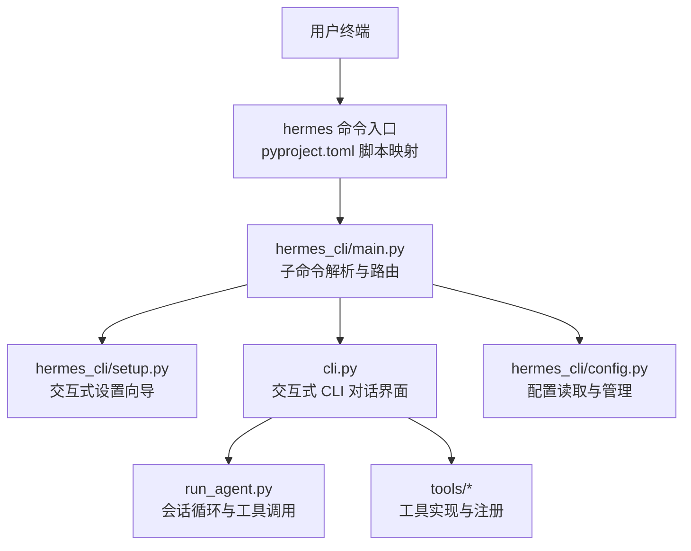
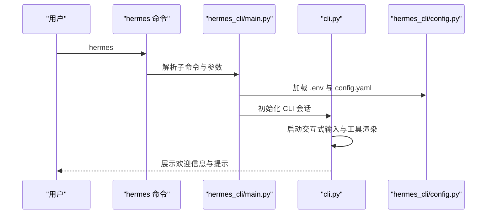
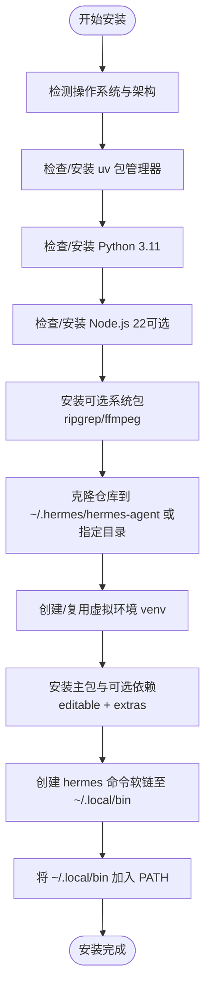
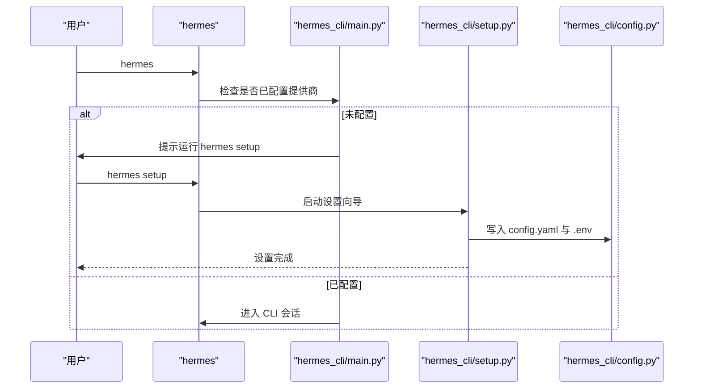
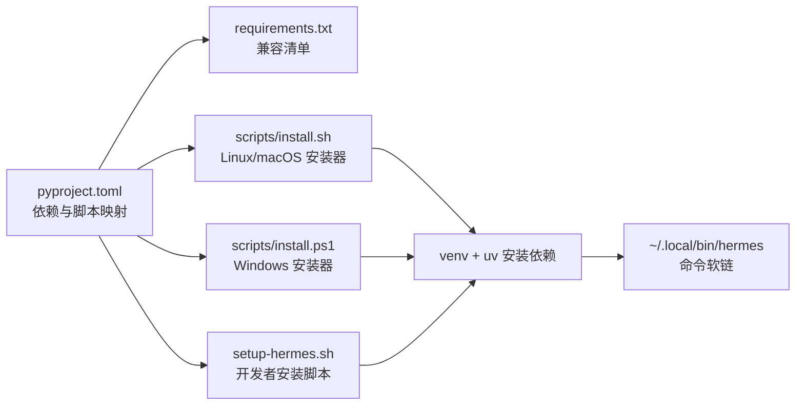

# 快速开始

<cite>
**本文引用的文件**
- [README.md](file://README.md)
- [install.sh](file://scripts/install.sh)
- [install.ps1](file://scripts/install.ps1)
- [install.cmd](file://scripts/install.cmd)
- [setup-hermes.sh](file://setup-hermes.sh)
- [pyproject.toml](file://pyproject.toml)
- [requirements.txt](file://requirements.txt)
- [hermes_cli/main.py](file://hermes_cli/main.py)
- [hermes_cli/setup.py](file://hermes_cli/setup.py)
- [hermes_cli/config.py](file://hermes_cli/config.py)
- [cli.py](file://cli.py)
- [cli-config.yaml.example](file://cli-config.yaml.example)
- [hermes_constants.py](file://hermes_constants.py)
- [AGENTS.md](file://AGENTS.md)
</cite>

## 目录
1. [简介](#简介)
2. [项目结构](#项目结构)
3. [核心组件](#核心组件)
4. [架构总览](#架构总览)
5. [详细组件分析](#详细组件分析)
6. [依赖关系分析](#依赖关系分析)
7. [性能考虑](#性能考虑)
8. [故障排除指南](#故障排除指南)
9. [结论](#结论)
10. [附录](#附录)

## 简介
本指南面向首次接触 Hermes Agent 的用户，目标是在 2 分钟内完成安装与首次对话。内容覆盖：
- 在 Linux、macOS、WSL2（以及 Windows）上的安装流程
- 安装脚本工作原理与依赖处理
- 首次运行：设置向导、模型配置、工具启用
- 基本 CLI 命令：启动聊天、模型切换、配置设置
- 常见初始配置选项与最佳实践
- 故障排除与常见问题

## 项目结构
Hermes Agent 采用模块化设计，核心入口为 hermes 命令，CLI 交互由 hermes_cli/main.py 提供，实际对话逻辑在 cli.py 中实现。安装脚本负责环境准备、依赖安装与命令链接。

图示来源
- [pyproject.toml:99-102](file://pyproject.toml#L99-L102)
- [hermes_cli/main.py:1-80](file://hermes_cli/main.py#L1-L80)
- [cli.py:1-60](file://cli.py#L1-L60)
- [hermes_cli/config.py:1-60](file://hermes_cli/config.py#L1-L60)

章节来源
- [AGENTS.md:11-64](file://AGENTS.md#L11-L64)

## 核心组件
- hermes 命令：通过 pyproject.toml 的脚本映射，将 hermes 指向 hermes_cli/main.py 的 main 函数。
- hermes_cli/main.py：解析子命令（chat、setup、gateway、config 等），加载 .env 并初始化日志。
- cli.py：提供交互式 CLI 界面，支持多平台工具集、皮肤主题、流式输出等。
- hermes_cli/setup.py：交互式设置向导，引导完成模型提供商选择、终端后端、消息平台、工具启用等。
- hermes_cli/config.py：统一管理 config.yaml 与 .env，提供配置读写、权限安全、迁移等能力。
- 工具系统：tools/* 下的工具通过 registry 注册，model_tools 统一发现与调度。

章节来源
- [pyproject.toml:99-102](file://pyproject.toml#L99-L102)
- [hermes_cli/main.py:1-80](file://hermes_cli/main.py#L1-L80)
- [cli.py:1-60](file://cli.py#L1-L60)
- [hermes_cli/setup.py:1-40](file://hermes_cli/setup.py#L1-L40)
- [hermes_cli/config.py:1-60](file://hermes_cli/config.py#L1-L60)

## 架构总览
下图展示了从用户执行 hermes 到进入 CLI 会话的关键路径，以及配置与环境变量的加载顺序。

图示来源
- [hermes_cli/main.py:139-152](file://hermes_cli/main.py#L139-L152)
- [cli.py:70-80](file://cli.py#L70-L80)
- [hermes_cli/config.py:147-158](file://hermes_cli/config.py#L147-L158)

## 详细组件分析

### 安装与环境准备
- 支持平台：Linux、macOS、WSL2；Windows 需通过 PowerShell 安装器或 WSL2。
- 自动化安装器：
  - Linux/macOS：scripts/install.sh，自动检测系统、安装 uv、Python 3.11、Node.js、可选系统包（ripgrep、ffmpeg），克隆仓库、创建虚拟环境、安装依赖、创建 hermes 命令软链并加入 PATH。
  - Windows：scripts/install.ps1，功能等价于 install.sh，支持 winget/choco/scoop 安装可选系统包，并设置 HERMES_HOME。
  - Windows CMD 包装：scripts/install.cmd，调用 PowerShell 安装器。
- 开发者手动安装：setup-hermes.sh，适用于已克隆仓库的开发者，自动创建 venv、安装依赖、同步技能、创建 hermes 命令软链并可直接运行 setup 向导。

图示来源
- [install.sh:124-154](file://scripts/install.sh#L124-L154)
- [install.sh:297-390](file://scripts/install.sh#L297-L390)
- [install.sh:392-555](file://scripts/install.sh#L392-L555)
- [install.sh:643-727](file://scripts/install.sh#L643-L727)
- [install.sh:729-800](file://scripts/install.sh#L729-L800)
- [install.ps1:72-130](file://scripts/install.ps1#L72-L130)
- [install.ps1:209-287](file://scripts/install.ps1#L209-L287)
- [install.ps1:289-406](file://scripts/install.ps1#L289-L406)
- [install.ps1:520-578](file://scripts/install.ps1#L520-L578)
- [install.ps1:580-618](file://scripts/install.ps1#L580-L618)
- [install.cmd:1-29](file://scripts/install.cmd#L1-L29)
- [setup-hermes.sh:160-209](file://setup-hermes.sh#L160-L209)
- [setup-hermes.sh:213-254](file://setup-hermes.sh#L213-L254)
- [setup-hermes.sh:256-274](file://setup-hermes.sh#L256-L274)

章节来源
- [README.md:30-61](file://README.md#L30-L61)
- [install.sh:1-120](file://scripts/install.sh#L1-L120)
- [install.ps1:1-46](file://scripts/install.ps1#L1-L46)
- [install.cmd:1-29](file://scripts/install.cmd#L1-L29)
- [setup-hermes.sh:1-30](file://setup-hermes.sh#L1-L30)

### 首次运行与设置向导
- 首次运行 hermes 时，若未检测到任何提供商配置，将提示运行 hermes setup 进入交互式设置向导。
- 设置向导涵盖：模型与提供商选择、终端后端（本地/SSH/Docker/Modal/Daytona/Singularity）、代理行为（最大轮次、推理强度、记忆）、消息平台（Telegram/Discord/Slack/WhatsApp/Signal/Home Assistant）、工具启用（Web 搜索、终端、文件、浏览器、图像生成、TTS、技能、定时任务等）。
- 设置完成后，配置写入 ~/.hermes/config.yaml 与 ~/.hermes/.env，技能目录同步至 ~/.hermes/skills。

图示来源
- [hermes_cli/main.py:588-614](file://hermes_cli/main.py#L588-L614)
- [hermes_cli/setup.py:1-40](file://hermes_cli/setup.py#L1-L40)
- [hermes_cli/config.py:185-195](file://hermes_cli/config.py#L185-L195)

章节来源
- [hermes_cli/main.py:588-614](file://hermes_cli/main.py#L588-L614)
- [hermes_cli/setup.py:1-40](file://hermes_cli/setup.py#L1-L40)

### 基本 CLI 使用
- 启动聊天：hermes 或 hermes chat
- 模型切换：/model [provider:model]（在会话中）
- 配置查看与编辑：hermes config
- 工具管理：hermes tools（按平台启用/禁用工具集）
- 状态与诊断：hermes status、hermes doctor
- 网关服务：hermes gateway（支持 Telegram/Discord/Slack/WhatsApp/Signal/Home Assistant）

章节来源
- [README.md:49-82](file://README.md#L49-L82)
- [cli.py:1-40](file://cli.py#L1-L40)

### 常见初始配置选项与最佳实践
- 模型与提供商
  - 默认模型：anthropic/claude-opus-4.6
  - 支持提供商：OpenRouter、Nous Portal、Anthropic、OpenAI、Copilot、Gemini、Z.ai、Kimi/Moonshot、MiniMax、Hugging Face、自定义本地端点等
  - 可通过 hermes model 或 config.yaml 进行切换
- 终端后端
  - 本地执行（默认）、SSH、Docker、Singularity、Modal、Daytona
  - 可配置超时、生命周期、资源限制、持久卷等
- 工具集
  - 平台工具集：cli、telegram、discord、whatsapp、slack、signal、homeassistant
  - 可组合工具集：web、terminal、file、browser、vision、image_gen、skills、moa、todo、tts、cronjob、rl 等
- 显示与皮肤
  - 支持皮肤主题（default/ares/mono/slate），可通过 display.skin 或 /skin 切换
- 记忆与会话
  - 内置持久记忆（MEMORY.md、USER.md），可配置字符上限与提醒策略
  - 会话重置策略（空闲超时、每日边界、两者皆是、从不）

章节来源
- [cli-config.yaml.example:8-50](file://cli-config.yaml.example#L8-L50)
- [cli-config.yaml.example:114-225](file://cli-config.yaml.example#L114-L225)
- [cli-config.yaml.example:480-590](file://cli-config.yaml.example#L480-L590)
- [cli-config.yaml.example:715-800](file://cli-config.yaml.example#L715-L800)

## 依赖关系分析
- 语言与包管理
  - Python 3.11（pyproject.toml requires-python）
  - uv 作为包管理器（install.sh/install.ps1 会自动安装）
  - 可选系统包：ripgrep（文件搜索）、ffmpeg（TTS 语音消息）
- 依赖来源
  - pyproject.toml：核心依赖与可选 extras（messaging、cron、voice、tts-premium、acp、mcp 等）
  - requirements.txt：历史兼容清单（推荐使用 pip install -e ".[all]"）
- 命令入口
  - pyproject.toml 的 scripts 将 hermes 指向 hermes_cli.main:main

图示来源
- [pyproject.toml:1-116](file://pyproject.toml#L1-L116)
- [requirements.txt:1-37](file://requirements.txt#L1-L37)
- [install.sh:160-209](file://scripts/install.sh#L160-L209)
- [install.ps1:72-130](file://scripts/install.ps1#L72-L130)
- [setup-hermes.sh:160-209](file://setup-hermes.sh#L160-L209)

章节来源
- [pyproject.toml:1-116](file://pyproject.toml#L1-L116)
- [requirements.txt:1-37](file://requirements.txt#L1-L37)

## 性能考虑
- 上下文压缩：当接近模型上下文阈值时自动压缩中间段落，保留最近与系统提示，减少 token 消耗。
- 推理强度：通过 reasoning_effort 控制模型“思考”深度，平衡响应质量与成本。
- 流式输出：CLI 与网关均支持流式输出，提升交互体验。
- 本地/远程后端：根据任务复杂度选择本地或容器/云端后端，避免不必要的网络延迟。

## 故障排除指南
- 无法找到 hermes 命令
  - 确认 ~/.local/bin 已加入 PATH；重新加载 shell 配置后重试
  - Windows：确认已设置 HERMES_HOME 并将 venv/Scripts 添加到 PATH
- Python 版本问题
  - 安装器会自动安装/查找 Python 3.11；若失败，手动安装 Python 3.11 并重试
- 权限与安全
  - .env 与 ~/.hermes 目录设置为仅所有者可读写（0600/0700）
- 网络与代理
  - 若使用自定义端点（OPENAI_BASE_URL），确保网络可达且凭据正确
- Windows 安装
  - 使用 PowerShell 安装器；若失败，尝试以管理员身份运行或使用包管理器（winget/choco/scoop）安装 Node.js/ripgrep/ffmpeg

章节来源
- [hermes_cli/config.py:159-174](file://hermes_cli/config.py#L159-L174)
- [install.sh:729-800](file://scripts/install.sh#L729-L800)
- [install.ps1:580-618](file://scripts/install.ps1#L580-L618)

## 结论
通过本指南，您可以在 Linux、macOS、WSL2 或 Windows（WSL2）上快速完成 Hermes Agent 的安装与首次对话。建议优先完成设置向导，选择合适的模型与工具集，并根据需要启用网关服务以跨平台使用。遇到问题时，可借助 hermes doctor 与日志定位原因。

## 附录

### 快速开始清单（2 分钟）
- Linux/macOS/WSL2
  - 执行安装脚本：curl -fsSL https://raw.githubusercontent.com/NousResearch/hermes-agent/main/scripts/install.sh | bash
  - 重新加载 shell 配置：source ~/.bashrc 或 source ~/.zshrc
  - 运行设置向导：hermes setup
  - 启动聊天：hermes
- Windows
  - 使用 PowerShell 安装器：irm https://raw.githubusercontent.com/NousResearch/hermes-agent/main/scripts/install.ps1 | iex
  - 运行设置向导：hermes setup
  - 启动聊天：hermes

章节来源
- [README.md:30-61](file://README.md#L30-L61)
- [install.sh:1-120](file://scripts/install.sh#L1-L120)
- [install.ps1:1-46](file://scripts/install.ps1#L1-L46)