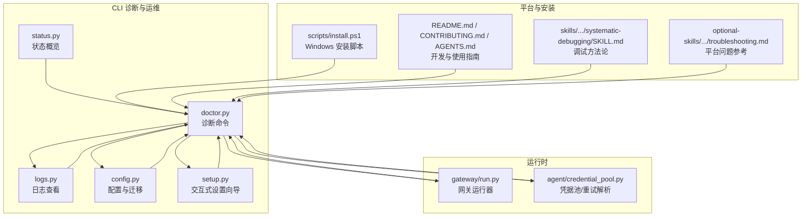
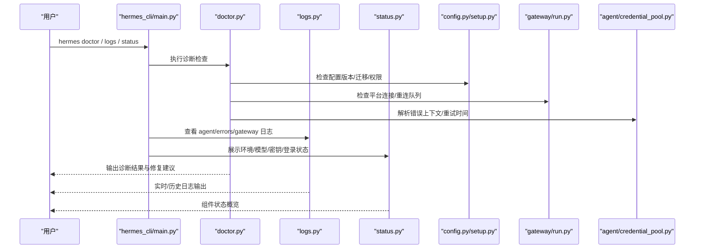
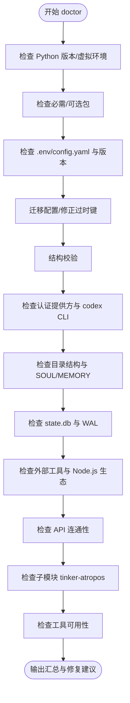
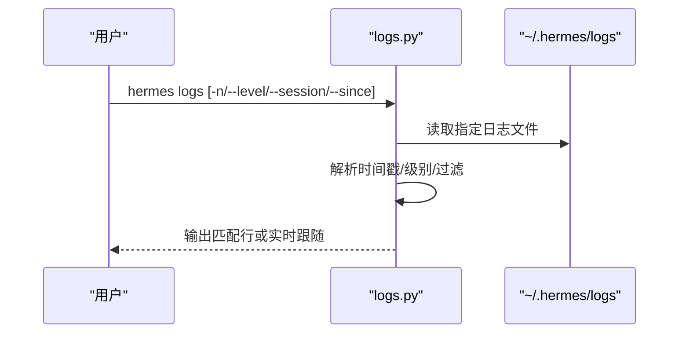
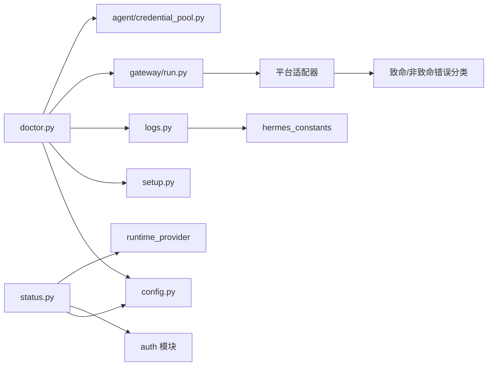

# 故障排除

<cite>
**本文引用的文件**
- [hermes_cli/doctor.py](file://hermes_cli/doctor.py)
- [hermes_cli/logs.py](file://hermes_cli/logs.py)
- [hermes_cli/main.py](file://hermes_cli/main.py)
- [hermes_cli/status.py](file://hermes_cli/status.py)
- [hermes_cli/config.py](file://hermes_cli/config.py)
- [hermes_cli/setup.py](file://hermes_cli/setup.py)
- [gateway/run.py](file://gateway/run.py)
- [agent/credential_pool.py](file://agent/credential_pool.py)
- [README.md](file://README.md)
- [CONTRIBUTING.md](file://CONTRIBUTING.md)
- [AGENTS.md](file://AGENTS.md)
- [scripts/install.ps1](file://scripts/install.ps1)
- [skills/software-development/systematic-debugging/SKILL.md](file://skills/software-development/systematic-debugging/SKILL.md)
- [optional-skills/mlops/lambda-labs/references/troubleshooting.md](file://optional-skills/mlops/lambda-labs/references/troubleshooting.md)
- [tests/run_agent/test_exit_cleanup_interrupt.py](file://tests/run_agent/test_exit_cleanup_interrupt.py)
</cite>

## 目录
1. [简介](#简介)
2. [项目结构](#项目结构)
3. [核心组件](#核心组件)
4. [架构总览](#架构总览)
5. [详细组件分析](#详细组件分析)
6. [依赖分析](#依赖分析)
7. [性能考虑](#性能考虑)
8. [故障排除指南](#故障排除指南)
9. [结论](#结论)
10. [附录](#附录)

## 简介
本指南面向使用 Hermes Agent 的用户与开发者，提供系统化的故障排除方法，覆盖安装问题、配置错误、网络连接异常、工具调用失败、性能问题、平台兼容性、日志分析与调试技巧，并给出预防性维护建议与最佳实践。所有建议均基于仓库中的实现与测试代码进行提炼总结。

## 项目结构
Hermes Agent 的故障排除相关能力主要分布在以下模块：
- 诊断与健康检查：hermes_cli/doctor.py（doctor 命令）
- 日志查看与过滤：hermes_cli/logs.py（logs 命令）
- 运行状态概览：hermes_cli/status.py（status 命令）
- 配置管理与迁移：hermes_cli/config.py、hermes_cli/setup.py
- 网关运行时与平台适配：gateway/run.py
- 凭据池与重试策略：agent/credential_pool.py
- 安装脚本与平台差异：scripts/install.ps1
- 开发与贡献参考：README.md、CONTRIBUTING.md、AGENTS.md
- 调试与排错方法论：skills/software-development/systematic-debugging/SKILL.md
- 平台特定问题参考：optional-skills/mlops/lambda-labs/references/troubleshooting.md
- 关键中断与清理路径验证：tests/run_agent/test_exit_cleanup_interrupt.py

图表来源
- [hermes_cli/doctor.py:135-957](file://hermes_cli/doctor.py#L135-L957)
- [hermes_cli/logs.py:1-336](file://hermes_cli/logs.py#L1-L336)
- [hermes_cli/status.py:1-426](file://hermes_cli/status.py#L1-L426)
- [hermes_cli/config.py:1-2745](file://hermes_cli/config.py#L1-L2745)
- [hermes_cli/setup.py:1-3062](file://hermes_cli/setup.py#L1-L3062)
- [gateway/run.py:1142-1168](file://gateway/run.py#L1142-L1168)
- [agent/credential_pool.py:228-261](file://agent/credential_pool.py#L228-L261)
- [README.md:1-176](file://README.md#L1-L176)
- [CONTRIBUTING.md:1-200](file://CONTRIBUTING.md#L1-L200)
- [AGENTS.md:1-200](file://AGENTS.md#L1-L200)
- [scripts/install.ps1:409-438](file://scripts/install.ps1#L409-L438)
- [skills/software-development/systematic-debugging/SKILL.md:63-190](file://skills/software-development/systematic-debugging/SKILL.md#L63-L190)
- [optional-skills/mlops/lambda-labs/references/troubleshooting.md:301-375](file://optional-skills/mlops/lambda-labs/references/troubleshooting.md#L301-L375)

章节来源
- [README.md:1-176](file://README.md#L1-L176)
- [CONTRIBUTING.md:114-200](file://CONTRIBUTING.md#L114-L200)
- [AGENTS.md:114-200](file://AGENTS.md#L114-L200)

## 核心组件
- doctor 命令：对 Python 版本、包依赖、配置文件、认证状态、目录结构、外部工具、API 连通性、子模块、工具可用性等进行系统性检查；支持自动修复模式。
- logs 命令：按文件名、级别、会话、相对时间范围过滤查看日志，支持实时跟随输出。
- status 命令：展示环境、模型与提供方、密钥状态、OAuth 登录状态、订阅特性等。
- config 与 setup：提供配置加载、版本校验与迁移、安全权限设置、默认 persona 文件生成等。
- gateway：平台生命周期管理、消息路由、重连与致命错误处理。
- 凭据池：从错误上下文中解析重试等待与恢复时间，支持统一的重试策略。

章节来源
- [hermes_cli/doctor.py:135-957](file://hermes_cli/doctor.py#L135-L957)
- [hermes_cli/logs.py:108-336](file://hermes_cli/logs.py#L108-L336)
- [hermes_cli/status.py:82-426](file://hermes_cli/status.py#L82-L426)
- [hermes_cli/config.py:147-200](file://hermes_cli/config.py#L147-L200)
- [hermes_cli/setup.py:1-200](file://hermes_cli/setup.py#L1-L200)
- [gateway/run.py:1142-1168](file://gateway/run.py#L1142-L1168)
- [agent/credential_pool.py:228-261](file://agent/credential_pool.py#L228-L261)

## 架构总览
下图展示了故障排除相关的关键交互：CLI 子命令通过 doctor/logs/status 汇总信息，结合 config/setup 完成修复与迁移，gateway 提供平台运行时状态，凭据池解析错误上下文以指导重试。

图表来源
- [hermes_cli/main.py:1-800](file://hermes_cli/main.py#L1-L800)
- [hermes_cli/doctor.py:135-957](file://hermes_cli/doctor.py#L135-L957)
- [hermes_cli/logs.py:108-336](file://hermes_cli/logs.py#L108-L336)
- [hermes_cli/status.py:82-426](file://hermes_cli/status.py#L82-L426)
- [hermes_cli/config.py:147-200](file://hermes_cli/config.py#L147-L200)
- [hermes_cli/setup.py:1-200](file://hermes_cli/setup.py#L1-L200)
- [gateway/run.py:1142-1168](file://gateway/run.py#L1142-L1168)
- [agent/credential_pool.py:228-261](file://agent/credential_pool.py#L228-L261)

## 详细组件分析

### 诊断命令 doctor：系统化健康检查与自动修复
- 检查项
  - Python 版本与虚拟环境
  - 必需/可选第三方库
  - ~/.hermes/.env 与 config.yaml 存在性与内容
  - 配置版本与迁移、过时根级键迁移
  - 配置结构校验（含错误提示）
  - 认证提供方状态（Nous Portal、OpenAI Codex）与 codex CLI 可用性
  - 目录结构完整性（cron/sessions/logs/skills/memories）
  - SOUL.md 与 MEMORY.md/USER.md 初始化
  - SQLite state.db 与 WAL 文件大小
  - 外部工具：git、ripgrep、Docker、SSH、Daytona、Node.js/agent-browser、npm audit
  - API 连通性：OpenRouter、Anthropic、多家国内/国际提供商
  - 子模块：tinker-atropos
  - 工具可用性：按环境变量与系统依赖检测
- 自动修复
  - 创建缺失的 .env/config.yaml
  - 迁移配置版本
  - 将过时根级键迁移到 model: 下
  - 执行 SQLite WAL checkpoint
  - 创建缺失目录与默认 persona 文件

图表来源
- [hermes_cli/doctor.py:135-957](file://hermes_cli/doctor.py#L135-L957)

章节来源
- [hermes_cli/doctor.py:135-957](file://hermes_cli/doctor.py#L135-L957)

### 日志命令 logs：按条件筛选与实时跟踪
- 支持的日志类型：agent、errors、gateway
- 过滤条件：级别（DEBUG/INFO/WARNING/ERROR/CRITICAL）、会话 ID 子串、相对时间范围（如 1h/30m/2d）
- 行为：读取尾部若干行或实时跟随输出，支持权限错误与参数校验提示

图表来源
- [hermes_cli/logs.py:108-336](file://hermes_cli/logs.py#L108-L336)

章节来源
- [hermes_cli/logs.py:108-336](file://hermes_cli/logs.py#L108-L336)

### 状态命令 status：快速掌握运行状态
- 展示环境、项目路径、Python 版本、.env 是否存在、已配置模型与生效提供方
- 列出各密钥是否配置（含 Anthropic），显示 OAuth 登录状态与过期时间
- 在受管理模式下给出升级建议

章节来源
- [hermes_cli/status.py:82-426](file://hermes_cli/status.py#L82-L426)
- [hermes_cli/config.py:67-138](file://hermes_cli/config.py#L67-L138)

### 配置与设置：迁移、安全与默认值
- 配置路径与安全权限：确保 ~/.hermes 与子目录权限为 0700/0600
- 默认 persona 文件：若不存在则写入默认模板
- 管理模式：NixOS/Homebrew 等场景下的升级命令与错误提示
- 设置向导：模型与提供方选择、终端后端、代理设置、平台集成、工具启用等

章节来源
- [hermes_cli/config.py:147-200](file://hermes_cli/config.py#L147-L200)
- [hermes_cli/config.py:176-195](file://hermes_cli/config.py#L176-L195)
- [hermes_cli/config.py:67-138](file://hermes_cli/config.py#L67-L138)
- [hermes_cli/setup.py:1-200](file://hermes_cli/setup.py#L1-L200)

### 网关运行与平台适配：重连与致命错误
- 平台启动阶段根据适配器返回的致命错误类型决定是否重试与排队
- 对未致命但可恢复的错误进行延迟重试调度

章节来源
- [gateway/run.py:1142-1168](file://gateway/run.py#L1142-L1168)

### 凭据池与重试策略：从错误上下文解析重试
- 从错误原因、消息中提取重试等待时间或绝对恢复时间
- 规范化为统一的时间戳，用于后续重试决策

章节来源
- [agent/credential_pool.py:228-261](file://agent/credential_pool.py#L228-L261)

## 依赖分析
- doctor 依赖 config、setup、gateway、agent 等模块进行综合诊断
- logs 依赖 hermes_home 与日志文件命名约定
- status 依赖 config、auth、runtime_provider 等模块
- gateway 与平台适配器之间存在致命错误分类与重试队列
- 凭据池与错误上下文解析为重试策略提供数据支撑

图表来源
- [hermes_cli/doctor.py:135-957](file://hermes_cli/doctor.py#L135-L957)
- [hermes_cli/logs.py:25-40](file://hermes_cli/logs.py#L25-L40)
- [hermes_cli/status.py:14-21](file://hermes_cli/status.py#L14-L21)
- [gateway/run.py:1142-1168](file://gateway/run.py#L1142-L1168)
- [agent/credential_pool.py:228-261](file://agent/credential_pool.py#L228-L261)

章节来源
- [hermes_cli/doctor.py:135-957](file://hermes_cli/doctor.py#L135-L957)
- [hermes_cli/logs.py:25-40](file://hermes_cli/logs.py#L25-L40)
- [hermes_cli/status.py:14-21](file://hermes_cli/status.py#L14-L21)
- [gateway/run.py:1142-1168](file://gateway/run.py#L1142-L1168)
- [agent/credential_pool.py:228-261](file://agent/credential_pool.py#L228-L261)

## 性能考虑
- 内存使用
  - WAL 文件过大可能指示未执行 checkpoint，doctor 会提示并支持自动执行
  - 平台特定优化参考（如 ASCII 视频渲染）建议按硬件动态调整工作线程与内存上限
- CPU 占用
  - 避免在非交互场景运行需要 TUI 的命令（doctor 会提示）
  - 使用 logs 的级别过滤减少解析开销
- 网络延迟
  - doctor 对多家提供方的 /models 或健康端点进行探测，定位网络/鉴权问题
  - status 展示生效提供方与模型，便于确认是否命中本地自建端点

章节来源
- [hermes_cli/doctor.py:462-485](file://hermes_cli/doctor.py#L462-L485)
- [skills/creative/ascii-video/references/optimization.md:1-66](file://skills/creative/ascii-video/references/optimization.md#L1-L66)
- [hermes_cli/status.py:68-80](file://hermes_cli/status.py#L68-L80)

## 故障排除指南

### 安装问题
- Windows 原生不支持，需使用 WSL2；安装脚本对 Git 原子写入做了兼容处理
- 快速验证：doctor 检查 Python 版本、必需包、.env/config.yaml 是否存在
- 若缺失 .env/config.yaml，doctor 支持自动创建或提示手动创建

章节来源
- [README.md:36-46](file://README.md#L36-L46)
- [scripts/install.ps1:409-438](file://scripts/install.ps1#L409-L438)
- [hermes_cli/doctor.py:218-267](file://hermes_cli/doctor.py#L218-L267)

### 配置错误
- 配置版本过旧：doctor 提示并支持自动迁移；必要时手动执行 setup
- 过时根级键（provider/base_url）：doctor 检测并迁移至 model: 分组
- 结构校验错误：doctor 输出具体提示与修复建议
- 权限问题：确保 ~/.hermes 与子目录权限正确

章节来源
- [hermes_cli/doctor.py:268-338](file://hermes_cli/doctor.py#L268-L338)
- [hermes_cli/config.py:176-195](file://hermes_cli/config.py#L176-L195)

### 网络连接问题
- API 密钥无效：doctor 对 OpenRouter、Anthropic、多家提供方进行健康探测，直接反馈 401
- 网络不可达：doctor 捕获异常并提示检查网络
- 本地自建端点：status 显示生效提供方，确认是否命中自建 base_url

章节来源
- [hermes_cli/doctor.py:616-727](file://hermes_cli/doctor.py#L616-L727)
- [hermes_cli/status.py:68-80](file://hermes_cli/status.py#L68-L80)

### 工具调用失败
- 缺少系统依赖：doctor 检测 git、ripgrep、Docker、SSH、Daytona、Node.js、agent-browser 等
- 缺少 API 密钥：doctor 列出缺失的 env 变量并建议运行 setup
- npm 依赖漏洞：doctor 对 agent-browser 与 WhatsApp bridge 执行 npm audit 并提示修复

章节来源
- [hermes_cli/doctor.py:489-615](file://hermes_cli/doctor.py#L489-L615)

### 平台特定问题
- Linux systemd 用户服务：doctor 检查 linger，避免注销后服务停止
- Windows：使用 WSL2；安装脚本处理 Git 原子写入兼容
- 云平台实例：参考平台特定疑难解答（如 Lambda 实例消失、GPU 不足、SSH 密钥不匹配）

章节来源
- [hermes_cli/doctor.py:102-133](file://hermes_cli/doctor.py#L102-L133)
- [README.md:36-46](file://README.md#L36-L46)
- [scripts/install.ps1:409-438](file://scripts/install.ps1#L409-L438)
- [optional-skills/mlops/lambda-labs/references/troubleshooting.md:490-512](file://optional-skills/mlops/lambda-labs/references/troubleshooting.md#L490-L512)

### 日志分析与调试技巧
- 使用 logs 命令按级别、会话、时间段过滤；实时跟随输出
- 常见日志位置：~/.hermes/logs/agent.log、errors.log、gateway.log
- 结合 doctor 的“配置结构”与“API 连通性”检查定位问题

章节来源
- [hermes_cli/logs.py:108-336](file://hermes_cli/logs.py#L108-L336)
- [hermes_cli/doctor.py:321-338](file://hermes_cli/doctor.py#L321-L338)

### 错误信息解读与修复步骤
- 从错误上下文中提取重试等待或恢复时间，用于后续重试策略
- status 展示 OAuth 登录状态与过期时间，便于判断认证失效
- 对于致命错误，gateway 会区分可重试与不可重试并排队重试

章节来源
- [agent/credential_pool.py:228-261](file://agent/credential_pool.py#L228-L261)
- [hermes_cli/status.py:155-191](file://hermes_cli/status.py#L155-L191)
- [gateway/run.py:1142-1168](file://gateway/run.py#L1142-L1168)

### 性能问题诊断与优化
- WAL 文件过大：doctor 提示并支持自动 checkpoint
- 日志级别过滤：logs 使用级别过滤减少解析成本
- 平台优化：参考技能优化文档按硬件动态调整资源

章节来源
- [hermes_cli/doctor.py:462-485](file://hermes_cli/doctor.py#L462-L485)
- [hermes_cli/logs.py:82-106](file://hermes_cli/logs.py#L82-L106)
- [skills/creative/ascii-video/references/optimization.md:1-66](file://skills/creative/ascii-video/references/optimization.md#L1-L66)

### 社区支持与问题报告
- 文档与快速入门：README 提供完整文档入口与 CLI 快速参考
- 贡献与优先级：CONTRIBUTING 明确优先级与贡献方向
- 开发指南：AGENTS 提供项目结构与关键类说明
- 平台与问题：README 提供 Discord、Issues、Discussions 等渠道

章节来源
- [README.md:85-106](file://README.md#L85-L106)
- [README.md:162-168](file://README.md#L162-L168)
- [CONTRIBUTING.md:7-18](file://CONTRIBUTING.md#L7-L18)
- [AGENTS.md:114-200](file://AGENTS.md#L114-L200)

### 预防性维护与最佳实践
- 定期运行 doctor --fix 保持配置与目录结构最新
- 使用 logs 的级别过滤与时间段筛选，避免全量扫描
- 在 managed 模式下遵循推荐升级命令
- 对关键平台（Linux systemd）启用 linger，避免服务随注销停止
- 对 npm 依赖定期审计并修复

章节来源
- [hermes_cli/doctor.py:135-957](file://hermes_cli/doctor.py#L135-L957)
- [hermes_cli/logs.py:82-106](file://hermes_cli/logs.py#L82-L106)
- [hermes_cli/config.py:92-104](file://hermes_cli/config.py#L92-L104)
- [hermes_cli/doctor.py:102-133](file://hermes_cli/doctor.py#L102-L133)
- [hermes_cli/doctor.py:581-615](file://hermes_cli/doctor.py#L581-L615)

## 结论
通过 doctor、logs、status 等 CLI 工具与配置、网关、凭据池等运行时组件的协同，Hermes Agent 提供了从安装到运行的全链路故障排除能力。建议将 doctor 作为日常维护的首要命令，配合 logs 的条件过滤与 status 的状态概览，快速定位并解决问题；同时遵循平台与性能优化建议，提升稳定性与效率。

## 附录
- 调试方法论：系统化阅读错误消息、复现问题、追踪数据流、对比参照实现
- 关键中断与清理路径：测试覆盖了 KeyboardInterrupt 场景下的清理保证

章节来源
- [skills/software-development/systematic-debugging/SKILL.md:63-190](file://skills/software-development/systematic-debugging/SKILL.md#L63-L190)
- [tests/run_agent/test_exit_cleanup_interrupt.py:1-37](file://tests/run_agent/test_exit_cleanup_interrupt.py#L1-L37)