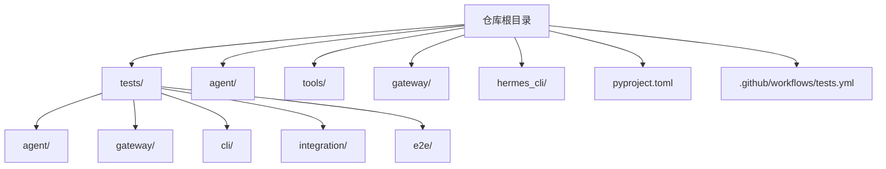
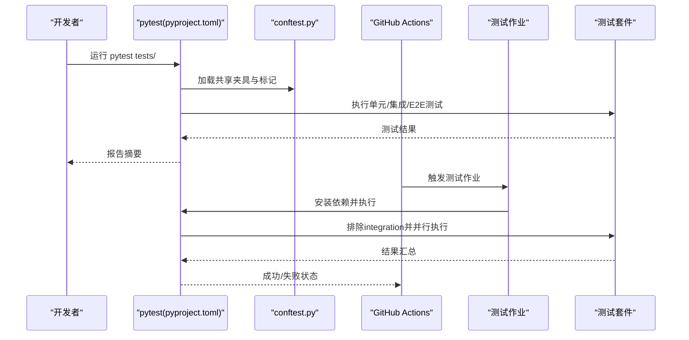
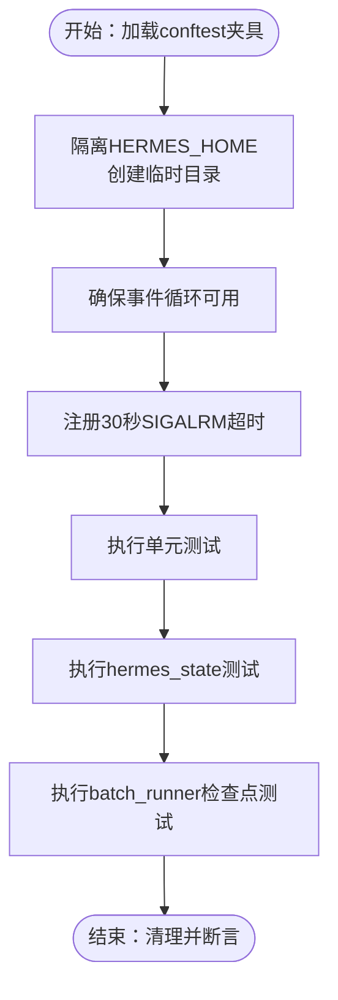
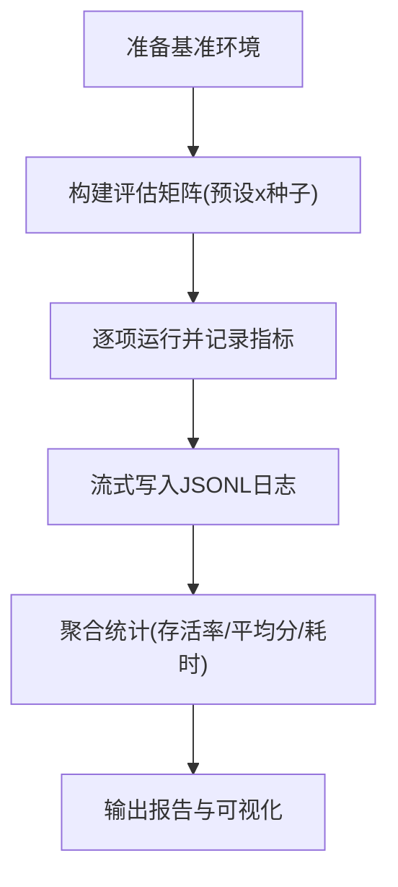
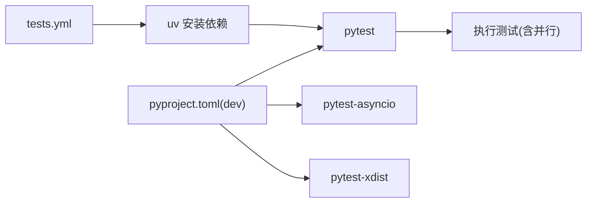

# 测试与质量保证

<cite>
**本文引用的文件**
- [pyproject.toml](file://pyproject.toml)
- [tests/conftest.py](file://tests/conftest.py)
- [tests/test_batch_runner_checkpoint.py](file://tests/test_batch_runner_checkpoint.py)
- [tests/test_hermes_state.py](file://tests/test_hermes_state.py)
- [.github/workflows/tests.yml](file://.github/workflows/tests.yml)
- [CONTRIBUTING.md](file://CONTRIBUTING.md)
- [environments/benchmarks/yc_bench/yc_bench_env.py](file://environments/benchmarks/yc_bench/yc_bench_env.py)
- [website/docs/developer-guide/environments.md](file://website/docs/developer-guide/environments.md)
- [skills/software-development/test-driven-development/SKILL.md](file://skills/software-development/test-driven-development/SKILL.md)
</cite>

## 目录
1. [引言](#引言)
2. [项目结构](#项目结构)
3. [核心组件](#核心组件)
4. [架构总览](#架构总览)
5. [详细组件分析](#详细组件分析)
6. [依赖分析](#依赖分析)
7. [性能考虑](#性能考虑)
8. [故障排查指南](#故障排查指南)
9. [结论](#结论)
10. [附录](#附录)

## 引言
本文件面向Hermes Agent项目的测试与质量保证工作，系统化阐述测试策略（单元测试、集成测试、端到端测试、性能测试）、测试框架与配置（pytest、标记与并行执行）、代码质量要求（规范、静态分析、覆盖率与CI）、测试环境搭建（数据库、模拟服务、工具配置），以及性能测试与基准测试方法（负载/压力/回归）。同时提供最佳实践与常见问题解决方案，帮助贡献者高效、稳定地交付高质量功能。

## 项目结构
Hermes Agent采用模块化分层组织：核心运行时在agent/与tools/中，网关与平台适配在gateway/，CLI命令在hermes_cli/，测试集中在tests/下按领域划分（如agent、gateway、cli、integration、e2e等）。pytest通过pyproject.toml集中配置，tests/conftest.py提供共享夹具与全局超时控制，GitHub Actions在CI中执行测试作业。

图示来源
- [pyproject.toml](file://pyproject.toml)
- [.github/workflows/tests.yml](file://.github/workflows/tests.yml)

章节来源
- [pyproject.toml](file://pyproject.toml)
- [.github/workflows/tests.yml](file://.github/workflows/tests.yml)

## 核心组件
- 测试框架与配置
  - pytest集中配置于pyproject.toml，启用自动并行(-n auto)、排除集成测试默认执行、自定义标记“integration”用于外部服务依赖。
  - tests/conftest.py提供：
    - 全局事件循环夹具，兼容同步测试对事件循环的需求；
    - 超时夹具，Unix平台使用SIGALRM强制终止超时单测（30秒）；
    - 隔离HERMES_HOME的临时目录夹具，避免写入用户主目录；
    - 基础配置字典mock_config，便于单元测试快速构建最小配置。
- 测试分类与覆盖
  - 单元测试：针对函数/类的最小可验证行为，强调隔离与mock。
  - 集成测试：跨模块协作、外部服务（需标记“integration”），默认CI不执行。
  - 端到端测试：真实或高度仿真的用户场景，CI中独立作业运行。
  - 性能测试：批处理、基准评估、压力与回归测试，结合专用环境与脚本。

章节来源
- [pyproject.toml](file://pyproject.toml)
- [tests/conftest.py](file://tests/conftest.py)

## 架构总览
下图展示测试执行在本地与CI中的关键路径，以及与pytest配置、标记与并行执行的关系。

图示来源
- [pyproject.toml](file://pyproject.toml)
- [tests/conftest.py](file://tests/conftest.py)
- [.github/workflows/tests.yml](file://.github/workflows/tests.yml)

## 详细组件分析

### 单元测试策略与实践
- 夹具与隔离
  - 使用临时目录隔离HERMES_HOME，确保会话、记忆、技能等持久化路径指向测试目录，避免污染用户环境。
  - 自动事件循环夹具确保同步测试也能调用事件循环；Unix平台设置30秒超时，防止阻塞导致整个测试套件卡死。
- 模拟与最小配置
  - 提供mock_config，快速构造最小可用配置，减少外部依赖初始化成本。
- 数据库与状态
  - hermes_state.py的SessionDB测试覆盖会话生命周期、消息存储、全文检索、导出与清理等，强调SQL约束、FTS5查询安全与一致性。
- 批处理与检查点
  - batch_runner的检查点测试覆盖原子写入、增量恢复、锁保护与错误容错（损坏JSON回退为空状态）。

图示来源
- [tests/conftest.py](file://tests/conftest.py)
- [tests/test_hermes_state.py](file://tests/test_hermes_state.py)
- [tests/test_batch_runner_checkpoint.py](file://tests/test_batch_runner_checkpoint.py)

章节来源
- [tests/conftest.py](file://tests/conftest.py)
- [tests/test_hermes_state.py](file://tests/test_hermes_state.py)
- [tests/test_batch_runner_checkpoint.py](file://tests/test_batch_runner_checkpoint.py)

### 集成测试策略与外部依赖
- 标记与排除
  - 在pyproject.toml中定义“integration”标记，用于需要外部服务（如API密钥、Modal、第三方平台）的测试。
  - 默认CI仅运行非集成测试，避免外部依赖波动影响稳定性。
- 实施建议
  - 将外部服务调用封装为可替换的接口或客户端，使用mock或本地服务镜像替代真实后端。
  - 对必须的集成测试，单独维护触发条件（如设置特定环境变量）并在CI中按需开启。

章节来源
- [pyproject.toml](file://pyproject.toml)
- [.github/workflows/tests.yml](file://.github/workflows/tests.yml)

### 端到端测试策略
- 作业分离
  - CI中独立定义e2e作业，确保端到端场景与常规单元/集成测试解耦。
- 场景设计
  - 覆盖真实用户路径（如Telegram命令链路），结合平台适配器与消息路由逻辑进行验证。
- 环境与数据
  - 使用最小化配置与受控输入，必要时使用内存型数据库或临时文件，避免持久化副作用。

章节来源
- [.github/workflows/tests.yml](file://.github/workflows/tests.yml)

### 性能测试与基准测试
- 批处理与吞吐
  - 使用批量运行器（batch_runner）进行并行批处理，关注完成进度、原子写入与崩溃恢复能力。
- 基准环境
  - ycbench环境提供预置评估矩阵、日志流式持久化与指标聚合，适合大规模回归与对比实验。
- 文档参考
  - 开发者文档提供终端基准、工具调用解析器与可用基准列表，便于选择合适的评估维度与方法。

图示来源
- [environments/benchmarks/yc_bench/yc_bench_env.py](file://environments/benchmarks/yc_bench/yc_bench_env.py)
- [website/docs/developer-guide/environments.md](file://website/docs/developer-guide/environments.md)

章节来源
- [environments/benchmarks/yc_bench/yc_bench_env.py](file://environments/benchmarks/yc_bench/yc_bench_env.py)
- [website/docs/developer-guide/environments.md](file://website/docs/developer-guide/environments.md)

## 依赖分析
- 测试框架与并行
  - pytest、pytest-asyncio、pytest-xdist在pyproject.toml的dev可选依赖中声明，支持异步测试与自动并行。
- CI与依赖安装
  - GitHub Actions使用uv安装Python与依赖，以“[all,dev]”组合满足测试与开发需求。
- 测试标记与过滤
  - 通过“-m not integration”默认排除集成测试，确保CI稳定与快速反馈。

图示来源
- [pyproject.toml](file://pyproject.toml)
- [.github/workflows/tests.yml](file://.github/workflows/tests.yml)

章节来源
- [pyproject.toml](file://pyproject.toml)
- [.github/workflows/tests.yml](file://.github/workflows/tests.yml)

## 性能考虑
- 并行执行
  - 使用pytest-xdist的自动并行(-n auto)，提升测试吞吐；注意资源竞争与共享状态的隔离。
- 超时与健壮性
  - 30秒单测超时可有效避免长时间阻塞；对可能阻塞的外部调用，务必配合mock或超时控制。
- 数据库与I/O
  - 使用临时数据库与文件，避免磁盘争用；对FTS5查询进行安全清洗，防止异常字符引发错误。
- 回归与对比
  - 利用基准环境与日志流式持久化，建立回归基线与趋势监控。

## 故障排查指南
- 常见问题
  - 同步测试无法获取事件循环：确认conftest的事件循环夹具已生效。
  - 单测卡住：检查是否超过30秒超时；定位阻塞的I/O或外部调用。
  - 集成测试失败：确认是否正确设置外部服务密钥或本地镜像；必要时在本地禁用集成测试。
  - FTS5查询异常：确保查询字符串经过清洗，避免特殊字符导致解析错误。
- 解决方案
  - 使用mock_config快速复现问题；将外部依赖替换为本地桩或内存实现。
  - 对批处理检查点问题，验证原子写入与损坏JSON回退逻辑。
  - 在CI中单独运行失败的测试文件或类，缩小问题范围。

章节来源
- [tests/conftest.py](file://tests/conftest.py)
- [tests/test_hermes_state.py](file://tests/test_hermes_state.py)
- [tests/test_batch_runner_checkpoint.py](file://tests/test_batch_runner_checkpoint.py)

## 结论
通过明确的测试分层（单元/集成/端到端/性能）、规范化的pytest配置与CI流水线、严格的夹具与隔离机制，以及完善的故障排查流程，Hermes Agent能够持续产出高质量、可维护的代码。建议在新增功能时遵循TDD思想，优先编写可验证的测试，并结合基准环境进行回归与性能评估。

## 附录
- 测试最佳实践
  - 以TDD为核心：先写失败的测试，再写出最小实现并通过测试；覆盖边界与错误路径。
  - 最小化外部依赖：优先使用mock与本地服务镜像；对必须的集成测试使用标记隔离。
  - 可重复与可观察：使用临时目录与最小配置；为关键路径添加断言与日志。
- 代码质量要求
  - 规范与静态分析：遵循项目风格与类型提示；结合静态分析工具（如flake8/ruff）保持一致性。
  - 覆盖率：尽量覆盖关键分支与异常路径；对数据库与I/O路径进行重点保障。
  - CI流程：确保本地测试通过后再提交；在CI中验证不同平台与Python版本的兼容性。

章节来源
- [skills/software-development/test-driven-development/SKILL.md](file://skills/software-development/test-driven-development/SKILL.md)
- [CONTRIBUTING.md](file://CONTRIBUTING.md)