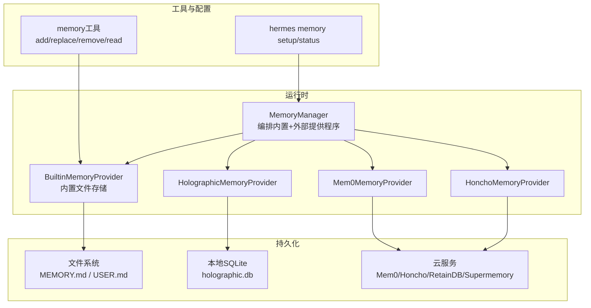
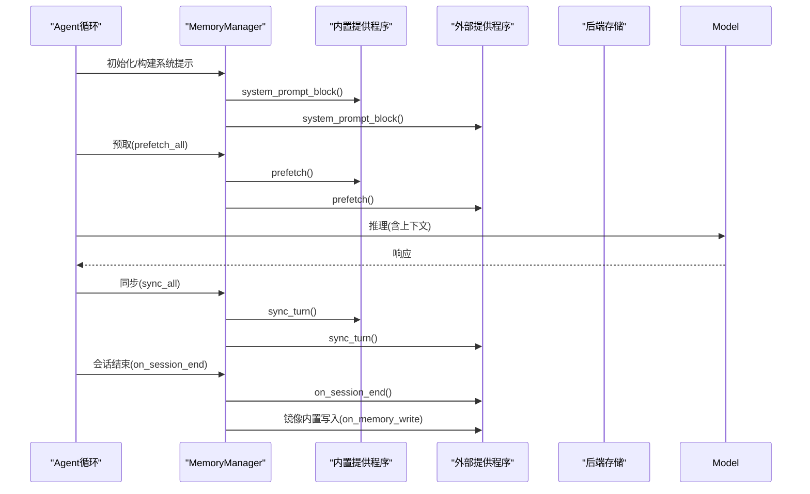
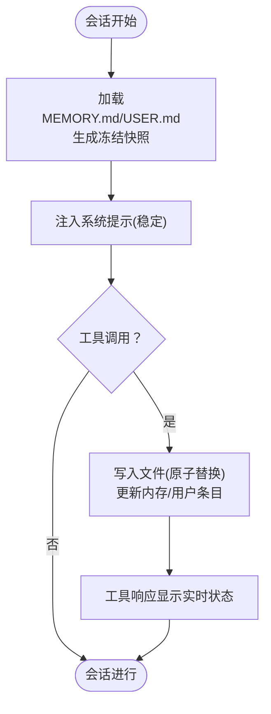
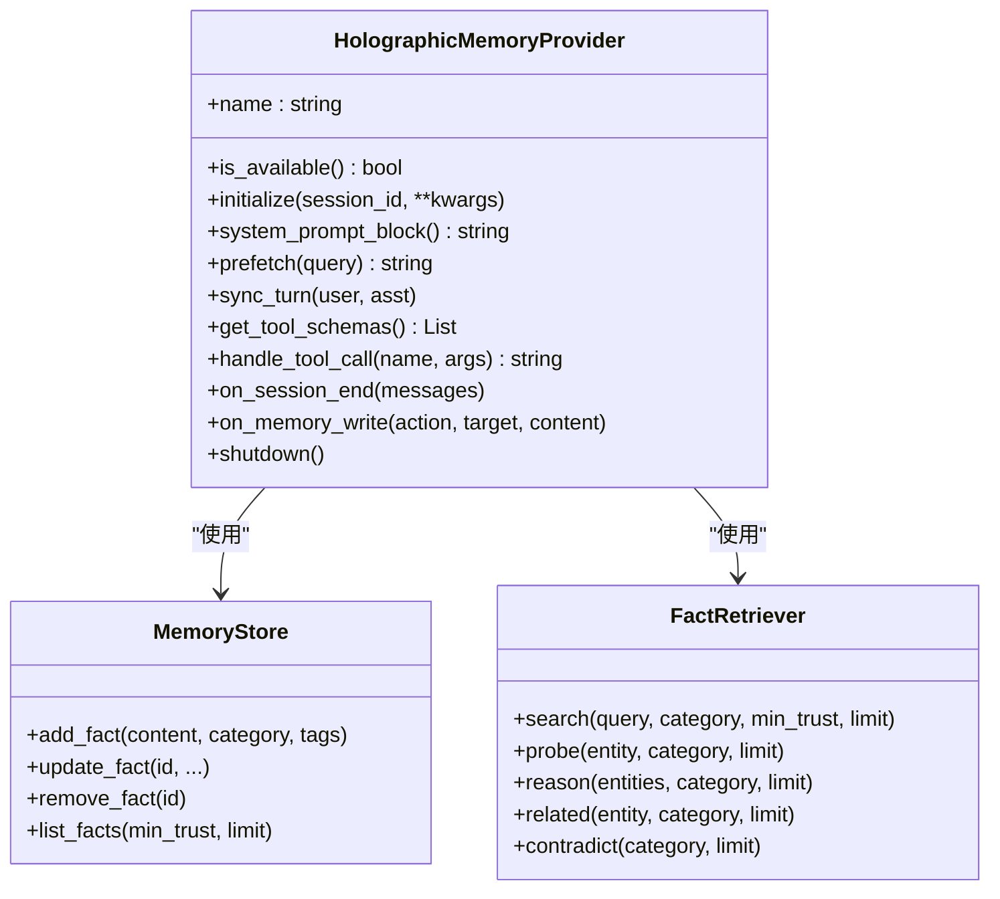
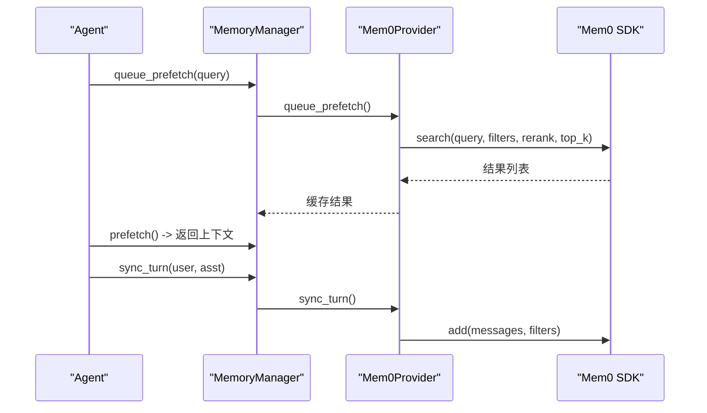
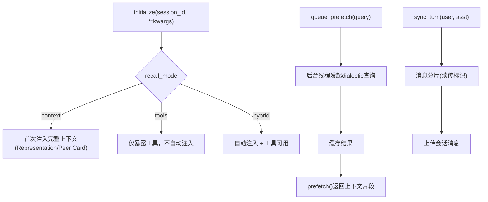
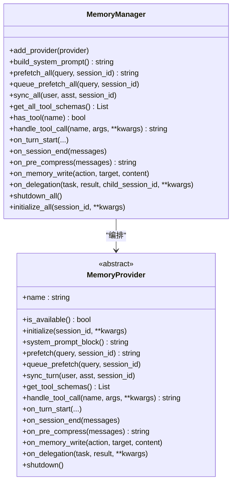
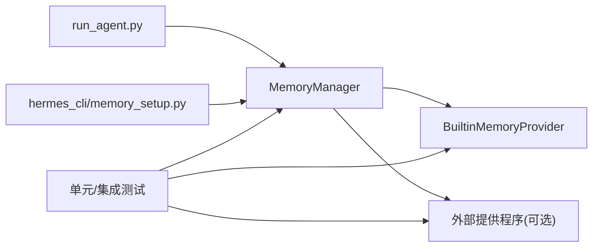

# 内存管理

<cite>
**本文引用的文件**
- [agent/memory_manager.py](file://agent/memory_manager.py)
- [agent/memory_provider.py](file://agent/memory_provider.py)
- [agent/builtin_memory_provider.py](file://agent/builtin_memory_provider.py)
- [tools/memory_tool.py](file://tools/memory_tool.py)
- [plugins/memory/holographic/__init__.py](file://plugins/memory/holographic/__init__.py)
- [plugins/memory/mem0/__init__.py](file://plugins/memory/mem0/__init__.py)
- [plugins/memory/honcho/__init__.py](file://plugins/memory/honcho/__init__.py)
- [hermes_cli/memory_setup.py](file://hermes_cli/memory_setup.py)
- [run_agent.py](file://run_agent.py)
- [website/docs/user-guide/features/memory-providers.md](file://website/docs/user-guide/features/memory-providers.md)
- [website/docs/user-guide/features/memory.md](file://website/docs/user-guide/features/memory.md)
- [tests/tools/test_memory_tool.py](file://tests/tools/test_memory_tool.py)
- [tests/agent/test_memory_provider.py](file://tests/agent/test_memory_provider.py)
</cite>

## 目录
1. [简介](#简介)
2. [项目结构](#项目结构)
3. [核心组件](#核心组件)
4. [架构总览](#架构总览)
5. [详细组件分析](#详细组件分析)
6. [依赖分析](#依赖分析)
7. [性能考虑](#性能考虑)
8. [故障排除指南](#故障排除指南)
9. [结论](#结论)
10. [附录](#附录)

## 简介
本指南面向Hermes Agent的内存管理与使用，系统讲解记忆系统的概念、短期与长期记忆的边界与管理方式；覆盖内置内存（MEMORY.md/USER.md）与外部内存提供程序（如Holographic、Mem0、Honcho等）的选择与配置；详解查询与检索能力（语义搜索、时间过滤、标签筛选等）；提供容量管理、过期清理、压缩策略与同步备份机制；最后给出故障排除与性能优化建议。

## 项目结构
Hermes内存体系由“管理器 + 提供程序接口 + 内置提供程序 + 外部插件提供程序 + 工具与CLI”构成：
- 管理器：统一编排内置与最多一个外部提供程序，负责生命周期、预取、同步、工具路由等
- 提供程序接口：定义统一的生命周期钩子与可选工具schema
- 内置提供程序：基于文件的MEMORY.md/USER.md，始终激活
- 外部提供程序：通过插件实现，按需启用（同一时刻仅一个）
- 工具与CLI：提供memory工具与交互式设置向导

图示来源
- [agent/memory_manager.py:72-368](file://agent/memory_manager.py#L72-L368)
- [agent/builtin_memory_provider.py:24-115](file://agent/builtin_memory_provider.py#L24-L115)
- [plugins/memory/holographic/__init__.py:114-408](file://plugins/memory/holographic/__init__.py#L114-L408)
- [plugins/memory/mem0/__init__.py:119-374](file://plugins/memory/mem0/__init__.py#L119-L374)
- [plugins/memory/honcho/__init__.py:119-715](file://plugins/memory/honcho/__init__.py#L119-L715)
- [tools/memory_tool.py:100-561](file://tools/memory_tool.py#L100-L561)
- [hermes_cli/memory_setup.py:291-524](file://hermes_cli/memory_setup.py#L291-L524)

章节来源
- [agent/memory_manager.py:1-368](file://agent/memory_manager.py#L1-L368)
- [agent/memory_provider.py:1-232](file://agent/memory_provider.py#L1-L232)
- [agent/builtin_memory_provider.py:1-115](file://agent/builtin_memory_provider.py#L1-L115)
- [tools/memory_tool.py:1-561](file://tools/memory_tool.py#L1-L561)
- [plugins/memory/holographic/__init__.py:1-408](file://plugins/memory/holographic/__init__.py#L1-L408)
- [plugins/memory/mem0/__init__.py:1-374](file://plugins/memory/mem0/__init__.py#L1-L374)
- [plugins/memory/honcho/__init__.py:1-715](file://plugins/memory/honcho/__init__.py#L1-L715)
- [hermes_cli/memory_setup.py:1-524](file://hermes_cli/memory_setup.py#L1-L524)

## 核心组件
- MemoryManager：统一注册与编排所有提供程序，负责系统提示拼接、预取、同步、工具分发、生命周期钩子与关闭
- MemoryProvider：抽象接口，定义可用性检查、初始化、系统提示块、预取、队列预取、回合同步、工具schema与调用、可选钩子（回合开始、会话结束、压缩前提取、镜像写入、委托完成）
- BuiltinMemoryProvider：内置文件存储适配器，始终激活，不参与标准工具注册，通过系统提示注入静态快照
- 外部提供程序：Holographic/Mem0/Honcho等，按需启用，提供语义检索、实体推理、结论/事实存储等高级能力

章节来源
- [agent/memory_manager.py:72-368](file://agent/memory_manager.py#L72-L368)
- [agent/memory_provider.py:42-232](file://agent/memory_provider.py#L42-L232)
- [agent/builtin_memory_provider.py:24-115](file://agent/builtin_memory_provider.py#L24-L115)

## 架构总览
Hermes在每次对话回合中，先由MemoryManager收集各提供程序的系统提示块与预取上下文，再进行模型推理，随后异步同步本轮对话到后端，并在会话结束时触发抽取与清理。

图示来源
- [agent/memory_manager.py:151-214](file://agent/memory_manager.py#L151-L214)
- [agent/builtin_memory_provider.py:56-84](file://agent/builtin_memory_provider.py#L56-L84)
- [plugins/memory/mem0/__init__.py:229-296](file://plugins/memory/mem0/__init__.py#L229-L296)
- [plugins/memory/honcho/__init__.py:362-423](file://plugins/memory/honcho/__init__.py#L362-L423)

## 详细组件分析

### 内置内存（MEMORY.md / USER.md）
- 存储与格式：两份文件分别承载“个人笔记/环境事实/技能约定”与“用户画像/偏好/沟通风格”。采用定界符分隔多行条目，字符计数而非token计数以保持跨模型一致性
- 系统提示注入：加载时生成“冻结快照”，贯穿整个会话，避免提示缓存失效；工具变更即时落盘但不改变已注入的快照
- 容量与安全：严格字符上限，写入前进行威胁扫描与去重，支持add/replace/remove操作
- 访问入口：memory工具；不参与标准工具注册，由Agent层拦截处理

图示来源
- [tools/memory_tool.py:119-136](file://tools/memory_tool.py#L119-L136)
- [tools/memory_tool.py:198-241](file://tools/memory_tool.py#L198-L241)
- [tools/memory_tool.py:335-346](file://tools/memory_tool.py#L335-L346)
- [tools/memory_tool.py:408-436](file://tools/memory_tool.py#L408-L436)

章节来源
- [tools/memory_tool.py:1-561](file://tools/memory_tool.py#L1-L561)
- [agent/builtin_memory_provider.py:56-76](file://agent/builtin_memory_provider.py#L56-L76)

### 外部提供程序：Holographic（本地SQLite）
- 能力：结构化事实存储、FTS5全文检索、信任评分、HRR代数查询（probe/reason/related/contradict）、自动抽取
- 配置：db_path、auto_extract、default_trust、hrr_dim等
- 生命周期：initialize加载数据库与检索器；prefetch基于最小信任阈值返回高可信结果；on_memory_write镜像内置写入为事实

图示来源
- [plugins/memory/holographic/__init__.py:114-255](file://plugins/memory/holographic/__init__.py#L114-L255)
- [plugins/memory/holographic/__init__.py:258-355](file://plugins/memory/holographic/__init__.py#L258-L355)

章节来源
- [plugins/memory/holographic/__init__.py:1-408](file://plugins/memory/holographic/__init__.py#L1-L408)

### 外部提供程序：Mem0（云端平台）
- 能力：服务端LLM抽取、语义搜索、重排序、自动去重；支持profile/search/conclude工具
- 配置：MEM0_API_KEY、MEM0_USER_ID、MEM0_AGENT_ID，或$HERMES_HOME/mem0.json
- 安全与稳定性：失败熔断（连续失败后冷却），后台线程异步预取与同步，避免阻塞主流程

图示来源
- [plugins/memory/mem0/__init__.py:247-296](file://plugins/memory/mem0/__init__.py#L247-L296)
- [plugins/memory/mem0/__init__.py:300-361](file://plugins/memory/mem0/__init__.py#L300-L361)

章节来源
- [plugins/memory/mem0/__init__.py:1-374](file://plugins/memory/mem0/__init__.py#L1-L374)

### 外部提供程序：Honcho（云端/自托管）
- 能力：用户建模、对话式检索、语义合成、结论持久化；支持profile/search/context/conclude工具
- 模式：context/tools/hybrid三种召回模式；成本感知的注入频率与调用节流
- 用户域隔离：优先使用网关user_id作为peer_name，确保跨会话用户记忆独立

图示来源
- [plugins/memory/honcho/__init__.py:195-311](file://plugins/memory/honcho/__init__.py#L195-L311)
- [plugins/memory/honcho/__init__.py:424-515](file://plugins/memory/honcho/__init__.py#L424-L515)
- [plugins/memory/honcho/__init__.py:565-594](file://plugins/memory/honcho/__init__.py#L565-L594)

章节来源
- [plugins/memory/honcho/__init__.py:1-715](file://plugins/memory/honcho/__init__.py#L1-L715)

### MemoryManager与工具路由
- 注册限制：内置提供程序始终存在且不可移除；最多仅允许一个外部提供程序
- 工具路由：根据工具名映射到具体提供程序实例，避免冲突
- 生命周期：initialize_all自动注入hermes_home；on_delegation/on_memory_write/on_pre_compress等钩子贯穿会话

图示来源
- [agent/memory_manager.py:72-368](file://agent/memory_manager.py#L72-L368)
- [agent/memory_provider.py:42-232](file://agent/memory_provider.py#L42-L232)

章节来源
- [agent/memory_manager.py:1-368](file://agent/memory_manager.py#L1-L368)
- [agent/memory_provider.py:1-232](file://agent/memory_provider.py#L1-L232)

## 依赖分析
- 运行时集成点：run_agent.py在启动阶段通过MemoryManager初始化提供程序，并在每轮前后调用prefetch/sync
- 插件发现与选择：hermes_cli/memory_setup.py提供交互式向导，安装依赖并写入配置；支持post_setup钩子
- 测试验证：测试覆盖工具行为、容量限制、注入防护、提供程序可用性与发现逻辑

图示来源
- [run_agent.py:1092-1114](file://run_agent.py#L1092-L1114)
- [hermes_cli/memory_setup.py:291-524](file://hermes_cli/memory_setup.py#L291-L524)
- [tests/agent/test_memory_provider.py:496-533](file://tests/agent/test_memory_provider.py#L496-L533)

章节来源
- [run_agent.py:1092-1114](file://run_agent.py#L1092-L1114)
- [hermes_cli/memory_setup.py:1-524](file://hermes_cli/memory_setup.py#L1-L524)
- [tests/agent/test_memory_provider.py:496-533](file://tests/agent/test_memory_provider.py#L496-L533)

## 性能考虑
- 上下文冻结与提示缓存：内置内存采用“冻结快照”注入系统提示，避免频繁变化导致的前缀缓存失效
- 异步与后台线程：Mem0/Honcho均使用后台线程执行预取与同步，避免阻塞主推理
- 成本感知与节流：Honcho支持注入频率、调用节律与推理级别上限，降低API开销
- 文件写入原子性：内置内存采用临时文件+原子替换，避免竞态与部分写入
- 会话结束抽取：部分提供程序在会话结束时提取要点，减少后续检索负担

章节来源
- [tools/memory_tool.py:119-136](file://tools/memory_tool.py#L119-L136)
- [tools/memory_tool.py:408-436](file://tools/memory_tool.py#L408-L436)
- [plugins/memory/mem0/__init__.py:247-296](file://plugins/memory/mem0/__init__.py#L247-L296)
- [plugins/memory/honcho/__init__.py:469-515](file://plugins/memory/honcho/__init__.py#L469-L515)

## 故障排除指南
- 提供程序不可用：当配置的外部提供程序不可用或未安装依赖时，MemoryManager会跳过该提供程序，仅保留内置提供程序
- 注入与泄露防护：内置内存对潜在注入/窃取模式进行扫描，拒绝危险内容
- 容量超限：当新增条目会使字符上限超限，返回错误并提示先清理或合并条目
- 会话迁移与镜像：Honcho支持从内置文件迁移记忆；内置写入可通过on_memory_write镜像到外部提供程序
- 熔断与重试：Mem0在连续失败后进入冷却熔断，避免雪崩；Honcho异步队列具备重试与关闭流程

章节来源
- [tests/agent/test_memory_provider.py:496-533](file://tests/agent/test_memory_provider.py#L496-L533)
- [tools/memory_tool.py:85-98](file://tools/memory_tool.py#L85-L98)
- [website/docs/user-guide/features/memory.md:124-143](file://website/docs/user-guide/features/memory.md#L124-L143)
- [plugins/memory/honcho/__init__.py:614-627](file://plugins/memory/honcho/__init__.py#L614-L627)
- [plugins/memory/mem0/__init__.py:180-202](file://plugins/memory/mem0/__init__.py#L180-L202)

## 结论
Hermes内存体系通过“内置文件存储 + 外部插件提供程序”的组合，实现了稳定、可扩展、可配置的记忆管理。内置存储保证跨会话的提示稳定性与低门槛使用；外部提供程序则按需增强语义检索、实体推理与结论持久化能力。通过MemoryManager统一编排，配合异步预取与同步、成本感知与熔断机制，可在不同场景下取得良好的性能与可靠性。

## 附录

### 内存提供程序选择与配置
- 交互式设置：hermes memory setup提供插件发现与配置向导，自动安装依赖并写入config.yaml与.env
- 手动配置：在~/.hermes/config.yaml中设置memory.provider为所需插件名称
- 配置位置与隔离：不同提供程序的配置文件位于$HERMES_HOME/下，按Profile隔离

章节来源
- [hermes_cli/memory_setup.py:291-524](file://hermes_cli/memory_setup.py#L291-L524)
- [website/docs/user-guide/features/memory-providers.md:19-25](file://website/docs/user-guide/features/memory-providers.md#L19-L25)

### 查询与检索能力
- Holographic：支持关键词搜索、实体探针、关系关联、代数合取、矛盾检测、信任评分反馈
- Mem0：语义搜索（可开启重排序）、概览检索、结论存储
- Honcho：快速概览、语义检索、对话式合成、结论存储

章节来源
- [plugins/memory/holographic/__init__.py:226-355](file://plugins/memory/holographic/__init__.py#L226-L355)
- [plugins/memory/mem0/__init__.py:297-361](file://plugins/memory/mem0/__init__.py#L297-L361)
- [plugins/memory/honcho/__init__.py:628-694](file://plugins/memory/honcho/__init__.py#L628-L694)

### 内存优化与清理策略
- 容量管理：内置内存按字符上限控制，接近阈值时建议合并条目
- 过期清理：外部提供程序通常由其自身策略管理；可结合会话结束抽取与镜像策略减少冗余
- 压缩算法：内置内存采用原子写入与冻结快照，外部提供程序可利用会话级抽取与重排序降低上下文噪声

章节来源
- [website/docs/user-guide/features/memory.md:115-143](file://website/docs/user-guide/features/memory.md#L115-L143)
- [tools/memory_tool.py:198-241](file://tools/memory_tool.py#L198-L241)

### 同步与备份机制
- 内置：文件原子替换，跨进程可见
- 外部：Mem0/Honcho等通过SDK异步上传；Honcho支持从内置文件迁移至云端

章节来源
- [tools/memory_tool.py:408-436](file://tools/memory_tool.py#L408-L436)
- [plugins/memory/honcho/__init__.py:293-311](file://plugins/memory/honcho/__init__.py#L293-L311)