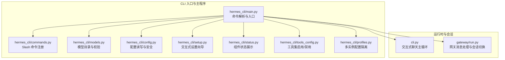
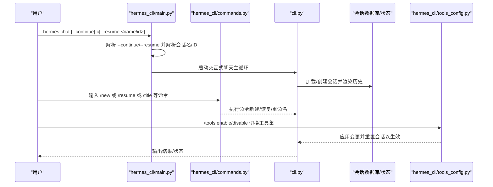
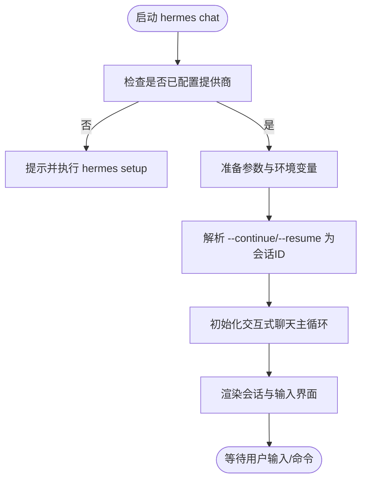
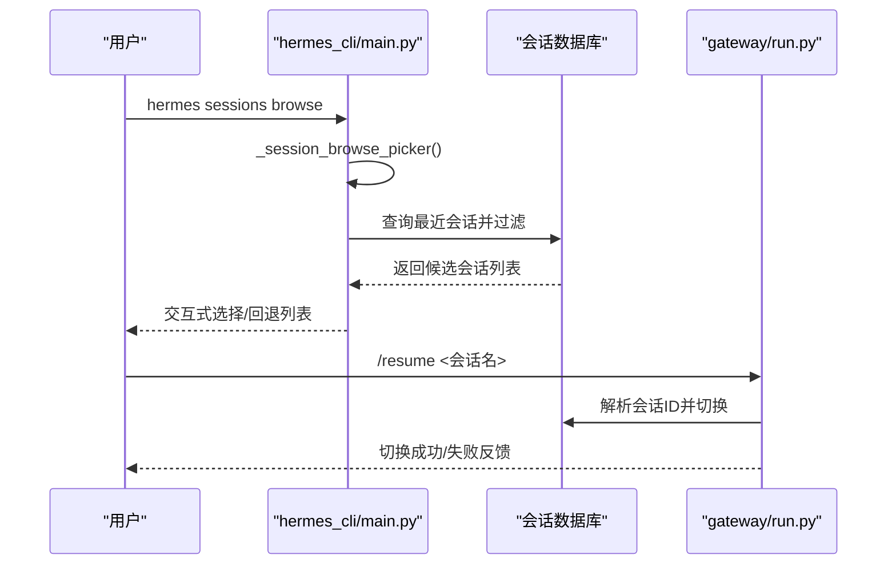
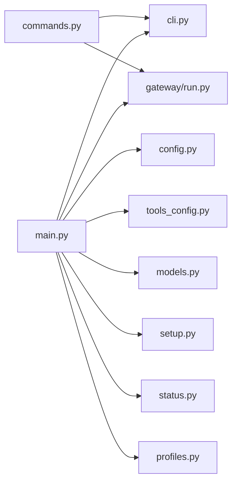

# 基础使用

<cite>
**本文引用的文件**
- [README.md](file://README.md)
- [hermes_cli/main.py](file://hermes_cli/main.py)
- [hermes_cli/commands.py](file://hermes_cli/commands.py)
- [hermes_cli/setup.py](file://hermes_cli/setup.py)
- [hermes_cli/status.py](file://hermes_cli/status.py)
- [hermes_cli/models.py](file://hermes_cli/models.py)
- [hermes_cli/config.py](file://hermes_cli/config.py)
- [hermes_cli/profiles.py](file://hermes_cli/profiles.py)
- [hermes_cli/tools_config.py](file://hermes_cli/tools_config.py)
- [cli.py](file://cli.py)
- [gateway/run.py](file://gateway/run.py)
</cite>

## 目录
1. [简介](#简介)
2. [项目结构](#项目结构)
3. [核心组件](#核心组件)
4. [架构总览](#架构总览)
5. [详细组件分析](#详细组件分析)
6. [依赖分析](#依赖分析)
7. [性能考虑](#性能考虑)
8. [故障排除指南](#故障排除指南)
9. [结论](#结论)
10. [附录](#附录)

## 简介
本指南面向首次使用 Hermes Agent 的用户，聚焦 CLI 基础用法与快速上手路径，涵盖以下主题：
- hermes 命令族：chat 交互式聊天、setup 配置向导、status 状态检查等核心命令
- 会话管理：创建新会话、继续对话、浏览历史会话、重命名与恢复
- 基本配置：模型选择、API 密钥配置、工具集启用与禁用
- 快速上手示例：从安装到第一次对话的完整流程
- 常见问题与故障排除

## 项目结构
Hermes Agent 的 CLI 能力主要由 hermes_cli 子模块提供，并通过入口脚本与主程序协同工作；会话与状态持久化由独立模块支持；工具与技能系统通过配置与命令进行管理。

图表来源
- [hermes_cli/main.py](file://hermes_cli/main.py)
- [hermes_cli/commands.py](file://hermes_cli/commands.py)
- [hermes_cli/models.py](file://hermes_cli/models.py)
- [hermes_cli/config.py](file://hermes_cli/config.py)
- [hermes_cli/setup.py](file://hermes_cli/setup.py)
- [hermes_cli/status.py](file://hermes_cli/status.py)
- [hermes_cli/tools_config.py](file://hermes_cli/tools_config.py)
- [hermes_cli/profiles.py](file://hermes_cli/profiles.py)
- [cli.py](file://cli.py)
- [gateway/run.py](file://gateway/run.py)

章节来源
- [README.md](file://README.md)
- [hermes_cli/main.py](file://hermes_cli/main.py)
- [hermes_cli/commands.py](file://hermes_cli/commands.py)

## 核心组件
- hermes chat：启动交互式聊天界面，支持继续上次对话、指定会话、工作树与检查点等参数
- hermes setup：交互式配置向导，覆盖模型/提供商、终端后端、代理设置、平台连接、工具配置等
- hermes status：显示环境、API 密钥、认证状态、终端后端、平台、网关服务、计划任务与会话数量等
- hermes sessions：浏览与恢复历史会话（含交互式选择器）
- hermes config：查看/编辑/设置配置项（模型、工具集、终端后端等）
- hermes tools：列出、启用/禁用工具集或 MCP 工具
- hermes model：切换当前会话使用的模型与提供商
- hermes doctor：诊断配置与依赖问题（在 status 中可触发更深入检查）

章节来源
- [hermes_cli/main.py](file://hermes_cli/main.py)
- [hermes_cli/commands.py](file://hermes_cli/commands.py)
- [hermes_cli/setup.py](file://hermes_cli/setup.py)
- [hermes_cli/status.py](file://hermes_cli/status.py)
- [hermes_cli/tools_config.py](file://hermes_cli/tools_config.py)
- [hermes_cli/models.py](file://hermes_cli/models.py)
- [hermes_cli/config.py](file://hermes_cli/config.py)
- [cli.py](file://cli.py)

## 架构总览
下图展示了 CLI 命令如何驱动会话生命周期与工具配置：

图表来源
- [hermes_cli/main.py](file://hermes_cli/main.py)
- [hermes_cli/commands.py](file://hermes_cli/commands.py)
- [cli.py](file://cli.py)
- [hermes_cli/tools_config.py](file://hermes_cli/tools_config.py)

## 详细组件分析

### hermes chat：交互式聊天
- 功能要点
  - 支持 --continue/-c 继续最近一次 CLI 会话，或指定会话名/ID 继续
  - 自动检测是否已配置至少一个推理提供商，未配置则引导执行 hermes setup
  - 支持 --yolo、--source、--worktree、--checkpoints、--max-turns 等参数
  - 首次启动会后台检查更新并同步内置技能
- 会话解析
  - 若传入 --continue 且无 --resume，则尝试解析最近 CLI 会话或按名称解析
  - 若传入 --resume，则优先按 ID 解析，否则按标题解析（自动最新）
- 运行流程
  - 参数预处理与环境准备
  - 初始化 CLI 主循环
  - 渲染会话历史与输入界面

图表来源
- [hermes_cli/main.py](file://hermes_cli/main.py)

章节来源
- [hermes_cli/main.py](file://hermes_cli/main.py)
- [cli.py](file://cli.py)

### hermes setup：配置向导
- 功能要点
  - 模型与提供商选择：自动探测可用模型列表，支持 Copilot/OpenRouter 等生态
  - 终端后端：本地/SSH/Docker/Daytona/Singularity/Modal 等
  - 代理设置：迭代次数、上下文压缩、会话重置策略
  - 消息平台：Telegram/Discord/WhatsApp/Signal/Slack/Email/SMS 等
  - 工具：TTS、网络搜索、图像生成、浏览器自动化、Modal 执行等
- 交互设计
  - 使用 curses 菜单与问答，支持默认值、Esc 取消、Ctrl+C 退出
  - 非交互环境提供替代配置方式指引

章节来源
- [hermes_cli/setup.py](file://hermes_cli/setup.py)
- [hermes_cli/models.py](file://hermes_cli/models.py)

### hermes status：状态检查
- 显示内容
  - 环境信息、模型与提供商、API 密钥（可选显示全部）
  - 认证提供商（Nous Portal、OpenAI Codex）登录状态与过期时间
  - Nous 订阅特性（受管理/激活/默认包含）
  - API Key 提供商配置（Z.AI/GLM、Kimi/Moonshot、MiniMax 等）
  - 终端后端（local/ssh/docker/daytona/singularity/modal）与 sudo 权限
  - 消息平台（Telegram/Discord/WhatsApp/Signal/Slack/Email/SMS/DingTalk/Feishu/WeCom）
  - 网关服务状态（systemd/launchd 用户态）
  - 计划任务与活动会话数量
  - 深度检查（可选）：OpenRouter 连通性、本地端口占用
- 使用建议
  - 出现问题时先运行 hermes status，再运行 hermes doctor 获取更详细的诊断

章节来源
- [hermes_cli/status.py](file://hermes_cli/status.py)

### hermes sessions：会话浏览与恢复
- 交互式浏览
  - 支持基于 curses 的交互式浏览，带实时过滤与键盘导航
  - 不支持 curses 时回退为数字列表输入
- 关键能力
  - 按标题或 ID 解析目标会话
  - 列出最近会话并格式化输出
  - 在 CLI 与网关中均可使用 /resume 切换会话

图表来源
- [hermes_cli/main.py](file://hermes_cli/main.py)
- [gateway/run.py](file://gateway/run.py)

章节来源
- [hermes_cli/main.py](file://hermes_cli/main.py)
- [gateway/run.py](file://gateway/run.py)

### hermes config：配置管理
- 能力概览
  - 查看当前配置、打开编辑器、设置单项值、重新运行设置向导
  - 安全权限：确保 ~/.hermes 目录与子目录仅属主可读写
  - 管理模式：对 Homebrew/NixOS 等包管理器托管的安装给出友好提示
- 常用场景
  - 设置模型提供商与默认模型
  - 配置终端后端（local/ssh/docker/daytona/singularity/modal）
  - 开启/关闭特定平台的消息通道

章节来源
- [hermes_cli/config.py](file://hermes_cli/config.py)

### hermes tools：工具集启用/禁用
- 能力概览
  - 列出平台可用工具集（内置工具集、插件工具集、MCP 服务器工具）
  - 启用/禁用工具集或 MCP 工具（如 github:create_issue）
  - 应用变更后重置会话以避免缓存影响
- 使用建议
  - 优先启用常用工具集（如 web、memory），按需扩展 MCP 工具

章节来源
- [hermes_cli/tools_config.py](file://hermes_cli/tools_config.py)
- [cli.py](file://cli.py)

### hermes model：模型与提供商选择
- 能力概览
  - 为当前会话切换模型与提供商
  - 对 Copilot/OpenRouter 等生态提供推理努力级别选择
  - 支持自定义模型名称与 API 模式
- 与 setup 的关系
  - setup 中的模型选择会写入配置文件，后续可通过 hermes model 快速切换

章节来源
- [hermes_cli/models.py](file://hermes_cli/models.py)
- [hermes_cli/setup.py](file://hermes_cli/setup.py)

### hermes doctor：诊断
- 能力概览
  - 与 hermes status 协同，提供更深入的连通性与端口检查
  - 建议在出现异常时先运行 hermes status，再运行 hermes doctor 获取详细日志

章节来源
- [hermes_cli/status.py](file://hermes_cli/status.py)

## 依赖分析
- 命令注册与分发
  - hermes_cli/commands.py 维护统一的 Slash 命令注册表，CLI 与网关共享同一套命令语义
- 会话解析与切换
  - hermes_cli/main.py 提供会话 ID/名称解析逻辑
  - gateway/run.py 实现跨平台的 /resume 命令处理
- 配置与安全
  - hermes_cli/config.py 统一管理配置文件与 .env 的读写与权限
  - hermes_cli/profiles.py 支持多实例隔离（不同 HERMES_HOME）
- 工具集与模型
  - hermes_cli/tools_config.py 管理工具集启用/禁用
  - hermes_cli/models.py 提供模型目录与校验辅助

图表来源
- [hermes_cli/commands.py](file://hermes_cli/commands.py)
- [hermes_cli/main.py](file://hermes_cli/main.py)
- [cli.py](file://cli.py)
- [gateway/run.py](file://gateway/run.py)
- [hermes_cli/config.py](file://hermes_cli/config.py)
- [hermes_cli/tools_config.py](file://hermes_cli/tools_config.py)
- [hermes_cli/models.py](file://hermes_cli/models.py)
- [hermes_cli/setup.py](file://hermes_cli/setup.py)
- [hermes_cli/status.py](file://hermes_cli/status.py)
- [hermes_cli/profiles.py](file://hermes_cli/profiles.py)

章节来源
- [hermes_cli/commands.py](file://hermes_cli/commands.py)
- [hermes_cli/main.py](file://hermes_cli/main.py)
- [hermes_cli/config.py](file://hermes_cli/config.py)
- [hermes_cli/tools_config.py](file://hermes_cli/tools_config.py)
- [hermes_cli/models.py](file://hermes_cli/models.py)
- [hermes_cli/setup.py](file://hermes_cli/setup.py)
- [hermes_cli/status.py](file://hermes_cli/status.py)
- [hermes_cli/profiles.py](file://hermes_cli/profiles.py)
- [cli.py](file://cli.py)
- [gateway/run.py](file://gateway/run.py)

## 性能考虑
- 会话上下文压缩：在长对话中使用 /compress 控制上下文长度，降低 token 消耗
- 工具集按需启用：仅启用必要的工具集，减少不必要的工具调用与缓存开销
- 终端后端选择：根据资源情况选择 local/ssh/docker/daytona/modal 等后端
- 模型与推理努力：在保证质量的前提下，适当降低推理努力级别以提升响应速度

## 故障排除指南
- 无法启动聊天
  - 现象：提示“尚未配置提供商”，要求运行 hermes setup
  - 处理：运行 hermes setup 完成模型与提供商配置
- 会话恢复失败
  - 现象：/resume 报错“未找到会话”
  - 处理：使用 hermes sessions browse 浏览并确认会话名/ID；或使用 --resume <name/id> 参数
- 工具不可用
  - 现象：/tools list 显示某些工具被禁用或缺失
  - 处理：使用 /tools enable <name> 启用所需工具集；必要时运行 hermes setup 完整配置
- 网关服务状态异常
  - 现象：hermes status 显示网关未运行
  - 处理：在 Linux/macOS 上检查 systemd/launchd 用户服务状态；按平台使用 hermes gateway start/stop/status
- 深度诊断
  - 现象：网络或端口问题导致服务不可达
  - 处理：运行 hermes doctor 或在 hermes status 中开启深度检查，查看 OpenRouter 连通性与本地端口占用

章节来源
- [hermes_cli/main.py](file://hermes_cli/main.py)
- [hermes_cli/status.py](file://hermes_cli/status.py)
- [hermes_cli/tools_config.py](file://hermes_cli/tools_config.py)
- [cli.py](file://cli.py)

## 结论
通过本指南，您已了解 Hermes Agent 的 CLI 基础用法与关键命令，掌握了会话管理、配置与工具集启用的基本流程。建议在首次使用时先运行 hermes setup 完成配置，随后使用 hermes chat 进行交互式聊天，并结合 hermes status 与 hermes doctor 进行日常维护与故障排查。

## 附录

### 快速上手示例
- 安装与初始化
  - 安装后加载 shell 配置，运行 hermes 启动交互式聊天
  - 首次运行若未配置提供商，将被引导执行 hermes setup
- 基本会话操作
  - 新建会话：/new 或 /reset
  - 继续上次对话：/resume 或 hermes chat -c
  - 重命名会话：/title <名称>
  - 查看历史：/history
- 配置与工具
  - 切换模型：/model <provider:model>
  - 启用工具：/tools enable <toolset>
  - 查看状态：hermes status
- 常用命令清单
  - hermes：交互式聊天
  - hermes setup：配置向导
  - hermes status：组件状态
  - hermes sessions browse：浏览与恢复会话
  - hermes config set：设置配置项
  - hermes tools：工具集管理
  - hermes model：模型与提供商切换
  - hermes doctor：诊断

章节来源
- [README.md](file://README.md)
- [hermes_cli/main.py](file://hermes_cli/main.py)
- [hermes_cli/commands.py](file://hermes_cli/commands.py)
- [hermes_cli/status.py](file://hermes_cli/status.py)
- [hermes_cli/tools_config.py](file://hermes_cli/tools_config.py)
- [hermes_cli/models.py](file://hermes_cli/models.py)