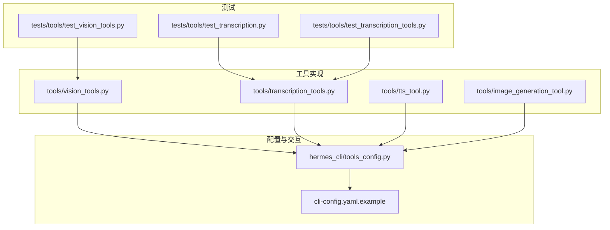
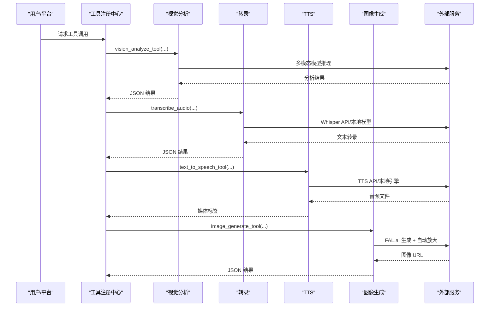
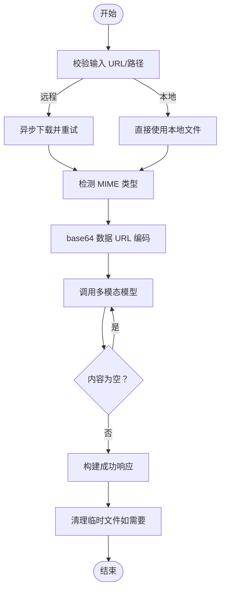
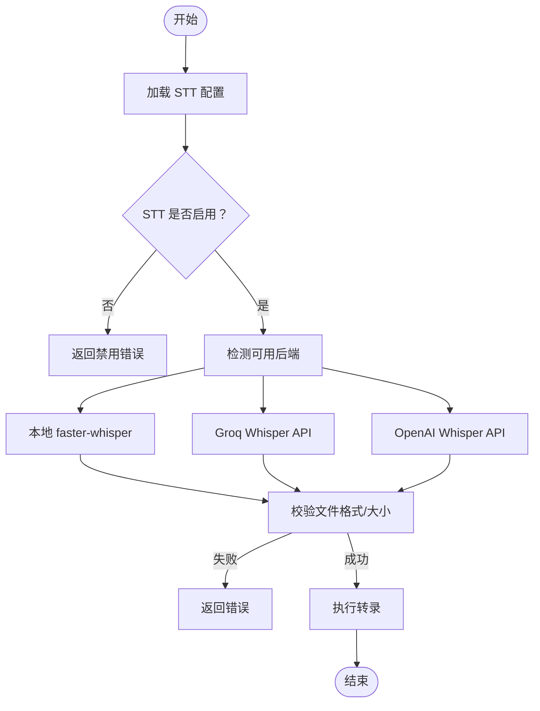
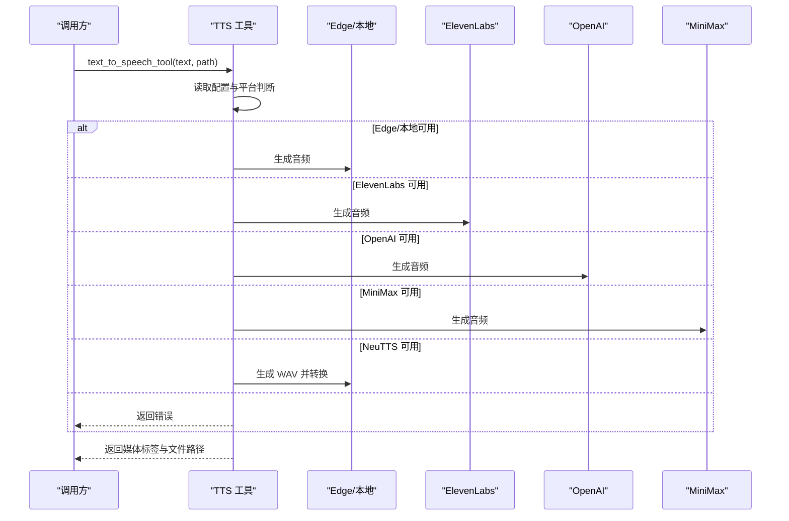
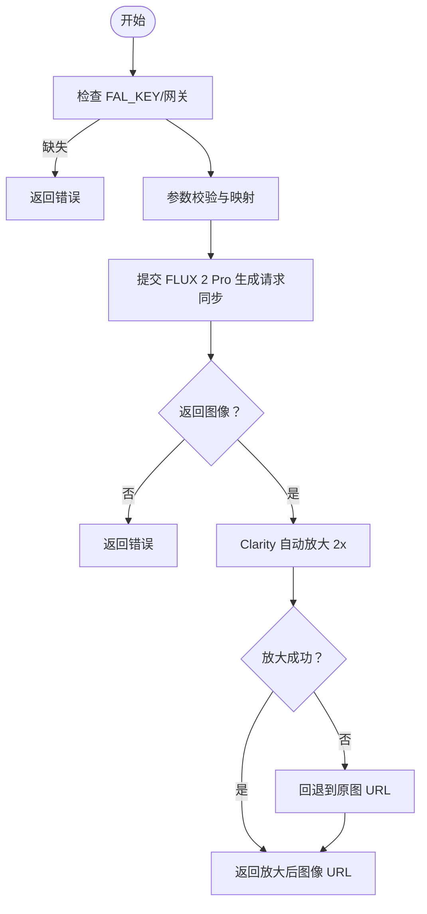
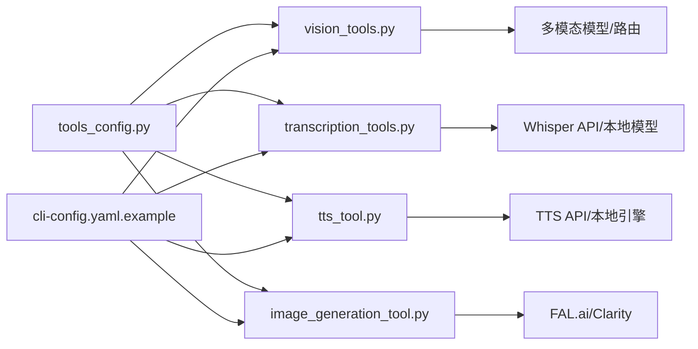

# 专用工具

<cite>
**本文引用的文件**
- [vision_tools.py](file://tools/vision_tools.py)
- [transcription_tools.py](file://tools/transcription_tools.py)
- [tts_tool.py](file://tools/tts_tool.py)
- [image_generation_tool.py](file://tools/image_generation_tool.py)
- [tools_config.py](file://hermes_cli/tools_config.py)
- [cli-config.yaml.example](file://cli-config.yaml.example)
- [test_vision_tools.py](file://tests/tools/test_vision_tools.py)
- [test_transcription.py](file://tests/tools/test_transcription.py)
- [test_transcription_tools.py](file://tests/tools/test_transcription_tools.py)
- [image-generation.md](file://website/docs/user-guide/features/image-generation.md)
</cite>

## 目录
1. [简介](#简介)
2. [项目结构](#项目结构)
3. [核心组件](#核心组件)
4. [架构总览](#架构总览)
5. [详细组件分析](#详细组件分析)
6. [依赖关系分析](#依赖关系分析)
7. [性能考虑](#性能考虑)
8. [故障排查指南](#故障排查指南)
9. [结论](#结论)
10. [附录](#附录)

## 简介
本指南聚焦于 Hermes Agent 的专用多媒体工具：视觉分析（图像理解）、语音转文字（转录）、文本转语音（TTS）与图像生成。文档覆盖以下内容：
- 工具能力与适用场景
- 输入输出与数据流
- 配置项与环境变量
- 使用示例与最佳实践
- 性能特征与使用限制

## 项目结构
与专用工具相关的核心代码位于 tools 目录，配置与交互入口在 hermes_cli 中，测试用例覆盖关键行为与边界条件。

图表来源
- [vision_tools.py:1-615](file://tools/vision_tools.py#L1-L615)
- [transcription_tools.py:1-634](file://tools/transcription_tools.py#L1-L634)
- [tts_tool.py:1-984](file://tools/tts_tool.py#L1-L984)
- [image_generation_tool.py:1-704](file://tools/image_generation_tool.py#L1-L704)
- [tools_config.py:1-1791](file://hermes_cli/tools_config.py#L1-L1791)
- [cli-config.yaml.example:1-831](file://cli-config.yaml.example#L1-L831)
- [test_vision_tools.py:169-201](file://tests/tools/test_vision_tools.py#L169-L201)
- [test_transcription.py:209-247](file://tests/tools/test_transcription.py#L209-L247)
- [test_transcription_tools.py:704-800](file://tests/tools/test_transcription_tools.py#L704-L800)

章节来源
- [vision_tools.py:1-615](file://tools/vision_tools.py#L1-L615)
- [transcription_tools.py:1-634](file://tools/transcription_tools.py#L1-L634)
- [tts_tool.py:1-984](file://tools/tts_tool.py#L1-L984)
- [image_generation_tool.py:1-704](file://tools/image_generation_tool.py#L1-L704)
- [tools_config.py:1-1791](file://hermes_cli/tools_config.py#L1-L1791)
- [cli-config.yaml.example:1-831](file://cli-config.yaml.example#L1-L831)

## 核心组件
- 视觉分析工具（vision_analyze_tool）
  - 支持本地路径或远程 URL 图像输入，自动下载与安全校验，转换为 base64 数据 URL，调用多模态模型进行分析，返回结构化结果。
  - 关键特性：URL 安全检查、重试下载、临时文件清理、调试日志、错误提示优化。
- 转录工具（transcribe_audio）
  - 提供三路后端：本地 faster-whisper、Groq Whisper API、OpenAI Whisper API；自动检测可用性并按优先级选择；支持格式校验与大小限制。
  - 关键特性：模型自动纠错、命令行 fallback、ffmpeg 转码、错误信息可诊断。
- 文本转语音（text_to_speech_tool）
  - 多供应商：Edge TTS（免费）、ElevenLabs、OpenAI TTS、MiniMax TTS、NeuTTS（本地）。根据平台自动选择输出格式（Opus 适配 Telegram），必要时通过 ffmpeg 转换。
  - 关键特性：语音兼容标记、流式播放支持（ElevenLabs）、文本截断保护。
- 图像生成（image_generate_tool）
  - 基于 FAL.ai FLUX 2 Pro 模型生成图像，并自动 2x 放大增强质量；支持同步模式与参数校验；失败时回退到原图。
  - 关键特性：参数校验、自动 upscaler、调试日志、受限并发与超时控制。

章节来源
- [vision_tools.py:264-495](file://tools/vision_tools.py#L264-L495)
- [transcription_tools.py:524-590](file://tools/transcription_tools.py#L524-L590)
- [tts_tool.py:447-621](file://tools/tts_tool.py#L447-L621)
- [image_generation_tool.py:352-534](file://tools/image_generation_tool.py#L352-L534)

## 架构总览
下图展示工具调用链与外部依赖：

图表来源
- [vision_tools.py:264-495](file://tools/vision_tools.py#L264-L495)
- [transcription_tools.py:524-590](file://tools/transcription_tools.py#L524-L590)
- [tts_tool.py:447-621](file://tools/tts_tool.py#L447-L621)
- [image_generation_tool.py:352-534](file://tools/image_generation_tool.py#L352-L534)

## 详细组件分析

### 视觉分析工具（图像理解）
- 功能要点
  - 输入：HTTP/HTTPS URL 或本地文件路径；自动下载与 MIME 类型检测；base64 数据 URL 封装。
  - 推理：通过集中式辅助路由调用多模态模型；支持温度、最大令牌数与超时配置。
  - 输出：JSON 包含 success 与 analysis 字段；空内容自动重试一次。
  - 安全：URL SSRF 防护、网站访问策略检查、临时文件清理。
- 参数与配置
  - 环境变量：AUXILIARY_VISION_MODEL（覆盖默认模型）、VISION_TOOLS_DEBUG（调试日志）。
  - 配置文件：auxiliary.vision.timeout/download_timeout 控制超时。
- 使用示例
  - 直接调用 vision_analyze_tool，传入 image_url 与 user_prompt；或通过工具注册器以 vision_analyze 名称调用。
- 最佳实践
  - 优先使用 HTTPS URL 并确保可达；对长提示词先做预处理；开启调试模式定位问题。
- 性能与限制
  - 远程下载受 HERMES_VISION_DOWNLOAD_TIMEOUT 控制；模型推理受 auxiliary.vision.timeout 控制；仅支持真实图像文件。

图表来源
- [vision_tools.py:124-495](file://tools/vision_tools.py#L124-L495)

章节来源
- [vision_tools.py:71-495](file://tools/vision_tools.py#L71-L495)
- [test_vision_tools.py:169-201](file://tests/tools/test_vision_tools.py#L169-L201)

### 转录工具（语音转文字）
- 功能要点
  - 三路后端：本地 faster-whisper（免费）、Groq Whisper API（免费额度）、OpenAI Whisper API（付费）。
  - 自动检测：优先本地，其次 Groq，最后 OpenAI；支持命令行 whisper fallback。
  - 校验与限制：格式白名单、文件大小上限、语言自动检测或强制。
- 参数与配置
  - 环境变量：GROQ_API_KEY、VOICE_TOOLS_OPENAI_KEY/OPENAI_API_KEY、STT_OPENAI_MODEL/GROQ_MODEL、STT_OPENAI_BASE_URL。
  - 配置文件：stt.enabled、stt.provider、stt.local.language、stt.local.model。
- 使用示例
  - 直接调用 transcribe_audio(file_path, model)，返回包含 success/transcript/provider 的字典。
- 最佳实践
  - 优先安装 faster-whisper 以获得离线体验；Telegram 平台建议使用 Groq/OpenAI 以提升速度；注意文件格式与大小限制。
- 性能与限制
  - 本地模型首次加载会自动下载；Groq/OpenAI 有请求超时与配额限制。

图表来源
- [transcription_tools.py:108-590](file://tools/transcription_tools.py#L108-L590)

章节来源
- [transcription_tools.py:108-590](file://tools/transcription_tools.py#L108-L590)
- [test_transcription.py:209-247](file://tests/tools/test_transcription.py#L209-L247)
- [test_transcription_tools.py:704-800](file://tests/tools/test_transcription_tools.py#L704-L800)

### 文本转语音（TTS）
- 功能要点
  - 五路供应商：Edge TTS（免费）、ElevenLabs、OpenAI TTS、MiniMax TTS、NeuTTS（本地）。
  - 自动格式选择：Telegram 平台优先 Opus；其他平台默认 MP3；必要时 ffmpeg 转换。
  - 流式播放：ElevenLabs 支持实时句子级播放与去重。
- 参数与配置
  - 环境变量：ELEVENLABS_API_KEY、VOICE_TOOLS_OPENAI_KEY/OPENAI_API_KEY、MINIMAX_API_KEY、ffmpeg 可执行路径。
  - 配置文件：tts.provider、tts.edge.voice、tts.elevenlabs.voice_id/model_id、tts.openai.model/voice/base_url、tts.minimax.*。
- 使用示例
  - 直接调用 text_to_speech_tool(text, output_path)，返回包含 file_path/media_tag/provider 的 JSON。
- 最佳实践
  - Telegram 发送语音消息需 Opus；优先 ElevenLabs/OpenAI 以获得原生 Opus；本地部署建议使用 Edge TTS 或 NeuTTS。
- 性能与限制
  - Edge TTS 默认 MP3，需 ffmpeg 转换；NeuTTS 输出 WAV，可选转换；MiniMax 返回十六进制音频需解码。

图表来源
- [tts_tool.py:447-621](file://tools/tts_tool.py#L447-L621)

章节来源
- [tts_tool.py:447-621](file://tools/tts_tool.py#L447-L621)

### 图像生成工具（文生图 + 自动放大）
- 功能要点
  - 使用 FAL.ai FLUX 2 Pro 生成图像，随后自动 2x 放大（Clarity Upscaler）；支持参数校验与同步模式。
  - 回退机制：放大失败时保留原图；调试日志记录生成与放大过程。
- 参数与配置
  - 环境变量：FAL_KEY（或通过管理网关）。
  - 配置文件：image.size、steps、guidance、num_images、output_format、acceleration 等。
- 使用示例
  - 直接调用 image_generate_tool(prompt, aspect_ratio, ...)，返回包含 image URL 的 JSON。
- 最佳实践
  - 合理设置 steps 与 guidance；Telegram 平台建议使用 Opus（由上游提供）；注意 num_images 上限与放大延迟。
- 性能与限制
  - 需要 FAL_KEY；放大步骤增加延迟；最大 4 张图/请求；URL 有效期有限。

图表来源
- [image_generation_tool.py:218-534](file://tools/image_generation_tool.py#L218-L534)

章节来源
- [image_generation_tool.py:218-534](file://tools/image_generation_tool.py#L218-L534)
- [image-generation.md:159-166](file://website/docs/user-guide/features/image-generation.md#L159-L166)

## 依赖关系分析
- 工具注册与配置
  - hermes_cli/tools_config.py 提供工具集配置界面，定义 vision、image_gen、tts 等工具集的提供商与环境变量要求。
  - cli-config.yaml.example 展示了 stt、tts、platform_toolsets 等关键配置项。
- 工具内部依赖
  - 视觉分析：依赖辅助客户端路由、网站策略检查、HTTP 下载与 base64 编码。
  - 转录：依赖 faster-whisper、openai 包、ffmpeg；支持命令行 whisper。
  - TTS：依赖 edge_tts、elevenlabs、openai、requests、ffmpeg、subprocess（NeuTTS）。
  - 图像生成：依赖 fal_client、同步客户端封装、队列网关（可选）。

图表来源
- [tools_config.py:146-361](file://hermes_cli/tools_config.py#L146-L361)
- [cli-config.yaml.example:644-651](file://cli-config.yaml.example#L644-L651)
- [vision_tools.py:1-615](file://tools/vision_tools.py#L1-L615)
- [transcription_tools.py:1-634](file://tools/transcription_tools.py#L1-L634)
- [tts_tool.py:1-984](file://tools/tts_tool.py#L1-L984)
- [image_generation_tool.py:1-704](file://tools/image_generation_tool.py#L1-L704)

章节来源
- [tools_config.py:146-361](file://hermes_cli/tools_config.py#L146-L361)
- [cli-config.yaml.example:644-651](file://cli-config.yaml.example#L644-L651)

## 性能考虑
- 视觉分析
  - 远程下载超时与模型推理超时均可配置；建议在弱网环境下适当提高超时值。
  - 临时文件清理避免磁盘占用；调试模式会记录详细日志，生产环境建议关闭。
- 转录
  - 本地 faster-whisper 首次加载模型会占用内存与时间；Telegram 场景建议云端 API 以降低延迟。
  - 文件大小限制为 25MB，超出将直接报错。
- TTS
  - Edge TTS 生成 MP3，Telegram 需要 Opus；ffmpeg 转换可能带来额外开销。
  - ElevenLabs 支持流式播放，适合连续语音场景。
- 图像生成
  - 自动放大显著增加处理时间；FAL_KEY 用量与 API 成本相关；URL 有效期有限，需及时消费。

## 故障排查指南
- 视觉分析
  - 症状：无法分析或返回空内容
  - 排查：确认已配置多模态后端（OPENROUTER_API_KEY 等）；检查 URL 可达性与 MIME 类型；查看调试日志。
- 转录
  - 症状：返回“未启用”或“无可用后端”
  - 排查：检查 stt.enabled 与 stt.provider；确认 GROQ_API_KEY 或 OpenAI 凭证；验证文件格式与大小。
- TTS
  - 症状：返回依赖缺失或配置错误
  - 排查：安装对应包（edge-tts、elevenlabs、openai、requests）；设置 ffmpeg；检查平台环境变量。
- 图像生成
  - 症状：返回 API key 缺失或无图像
  - 排查：设置 FAL_KEY；确认 fal_client 可用；检查参数范围与 num_images 上限。

章节来源
- [vision_tools.py:443-483](file://tools/vision_tools.py#L443-L483)
- [transcription_tools.py:580-590](file://tools/transcription_tools.py#L580-L590)
- [tts_tool.py:504-621](file://tools/tts_tool.py#L504-L621)
- [image_generation_tool.py:418-424](file://tools/image_generation_tool.py#L418-L424)

## 结论
Hermes Agent 的专用工具围绕“多模态输入 + 多源后端”的设计，兼顾易用性与灵活性。通过统一的工具注册与配置系统，用户可在不同平台与场景中高效使用视觉分析、语音转文字、文本转语音与图像生成能力。建议结合平台特性与资源约束选择合适的后端与参数，以获得最佳体验。

## 附录
- 配置参考
  - STT：stt.enabled、stt.provider、stt.local.language、stt.local.model、STT_OPENAI_MODEL/GROQ_MODEL、STT_OPENAI_BASE_URL、GROQ_API_KEY、VOICE_TOOLS_OPENAI_KEY/OPENAI_API_KEY。
  - TTS：tts.provider、tts.edge.voice、tts.elevenlabs.voice_id/model_id、tts.openai.model/voice/base_url、tts.minimax.*、ELEVENLABS_API_KEY、MINIMAX_API_KEY。
  - 视觉：auxiliary.vision.timeout/download_timeout、AUXILIARY_VISION_MODEL、OPENROUTER_API_KEY。
  - 图像生成：FAL_KEY、image.size、steps、guidance、num_images、output_format、acceleration。
- 平台工具集
  - vision、image_gen、tts 等工具集可通过 hermes tools 交互式启用，并按提供商完成密钥配置。

章节来源
- [cli-config.yaml.example:644-651](file://cli-config.yaml.example#L644-L651)
- [tools_config.py:146-361](file://hermes_cli/tools_config.py#L146-L361)