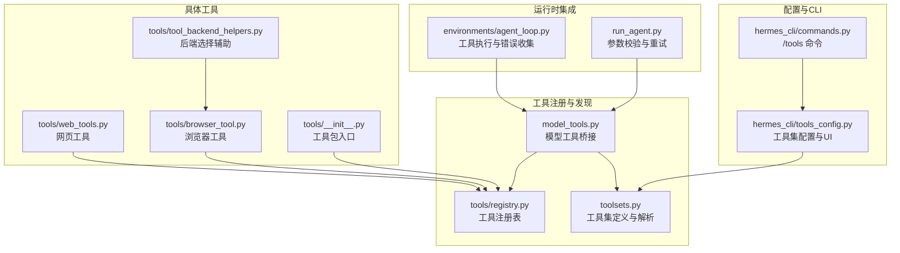
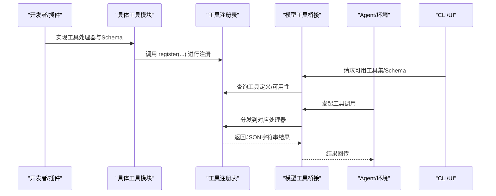
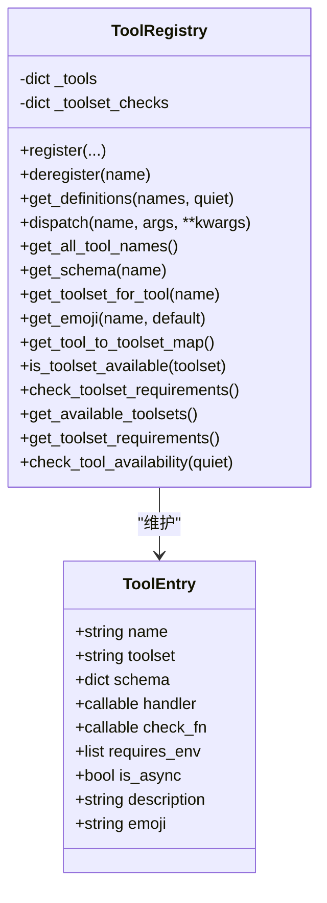
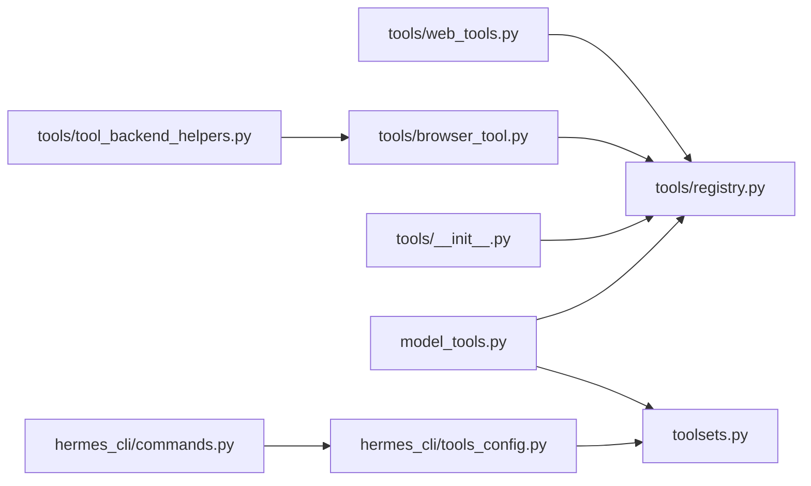

# 工具管理

<cite>
**本文引用的文件**
- [tools/registry.py](file://tools/registry.py)
- [model_tools.py](file://model_tools.py)
- [toolsets.py](file://toolsets.py)
- [hermes_cli/tools_config.py](file://hermes_cli/tools_config.py)
- [tools/web_tools.py](file://tools/web_tools.py)
- [tools/browser_tool.py](file://tools/browser_tool.py)
- [tools/__init__.py](file://tools/__init__.py)
- [tools/tool_backend_helpers.py](file://tools/tool_backend_helpers.py)
- [environments/agent_loop.py](file://environments/agent_loop.py)
- [run_agent.py](file://run_agent.py)
- [website/docs/reference/toolsets-reference.md](file://website/docs/reference/toolsets-reference.md)
- [website/docs/developer-guide/tools-runtime.md](file://website/docs/developer-guide/tools-runtime.md)
- [hermes_cli/commands.py](file://hermes_cli/commands.py)
</cite>

## 目录
1. [简介](#简介)
2. [项目结构](#项目结构)
3. [核心组件](#核心组件)
4. [架构总览](#架构总览)
5. [详细组件分析](#详细组件分析)
6. [依赖分析](#依赖分析)
7. [性能考虑](#性能考虑)
8. [故障排查指南](#故障排查指南)
9. [结论](#结论)
10. [附录](#附录)

## 简介
本指南面向Hermes Agent的工具管理系统，聚焦于工具注册机制、工具集（toolset）管理、工具可用性检查与生命周期管理，以及工具的启用/禁用/更新操作。文档还涵盖工具注册表的工作原理（元数据管理、调用分发、错误处理）、性能监控与调试方法，以及如何扩展与自定义工具。

## 项目结构
工具管理涉及以下关键模块：
- 注册表：集中管理工具元数据、Schema、处理器与可用性检查函数
- 工具集：对工具进行逻辑分组与平台化预设
- 模型层桥接：在运行时触发工具发现、生成模型可用Schema、分发工具调用
- CLI与配置：提供交互式工具集配置、环境变量要求与后置安装步骤
- 具体工具：如网页搜索、浏览器自动化等，按需注册到注册表

图示来源
- [tools/registry.py](file://tools/registry.py)
- [model_tools.py](file://model_tools.py)
- [toolsets.py](file://toolsets.py)
- [hermes_cli/tools_config.py](file://hermes_cli/tools_config.py)
- [hermes_cli/commands.py](file://hermes_cli/commands.py)
- [tools/web_tools.py](file://tools/web_tools.py)
- [tools/browser_tool.py](file://tools/browser_tool.py)
- [tools/__init__.py](file://tools/__init__.py)
- [tools/tool_backend_helpers.py](file://tools/tool_backend_helpers.py)
- [environments/agent_loop.py](file://environments/agent_loop.py)
- [run_agent.py](file://run_agent.py)

章节来源
- [tools/registry.py](file://tools/registry.py)
- [model_tools.py](file://model_tools.py)
- [toolsets.py](file://toolsets.py)
- [hermes_cli/tools_config.py](file://hermes_cli/tools_config.py)
- [hermes_cli/commands.py](file://hermes_cli/commands.py)
- [tools/web_tools.py](file://tools/web_tools.py)
- [tools/browser_tool.py](file://tools/browser_tool.py)
- [tools/__init__.py](file://tools/__init__.py)
- [tools/tool_backend_helpers.py](file://tools/tool_backend_helpers.py)
- [environments/agent_loop.py](file://environments/agent_loop.py)
- [run_agent.py](file://run_agent.py)

## 核心组件
- 工具注册表（ToolRegistry）
  - 维护工具名称到工具条目（ToolEntry）的映射
  - 提供注册、反注册、Schema检索、工具分发、工具集可用性检查等能力
- 模型工具桥接（model_tools）
  - 触发工具模块导入以完成注册
  - 对外暴露统一API：生成可用Schema、执行工具、查询工具集信息
- 工具集系统（toolsets）
  - 定义核心、复合与平台工具集
  - 支持动态解析与插件扩展
- 配置与CLI（hermes_cli/tools_config）
  - 提供交互式工具集开关、平台维度配置、环境变量要求与后置安装步骤
- 具体工具实现
  - 如网页工具、浏览器工具等，通过模块级注册向注册表上报元数据与处理器

章节来源
- [tools/registry.py](file://tools/registry.py)
- [model_tools.py](file://model_tools.py)
- [toolsets.py](file://toolsets.py)
- [hermes_cli/tools_config.py](file://hermes_cli/tools_config.py)

## 架构总览
工具从“注册—发现—可用性检查—Schema生成—调用分发—结果返回”形成闭环。注册表是核心枢纽，模型工具桥接负责在运行期触发发现与调度，CLI负责配置与展示。

图示来源
- [tools/registry.py](file://tools/registry.py)
- [model_tools.py](file://model_tools.py)
- [hermes_cli/tools_config.py](file://hermes_cli/tools_config.py)

## 详细组件分析

### 工具注册表（ToolRegistry）
- 注册与反注册
  - register：登记工具名称、所属工具集、Schema、处理器、可选check_fn、环境需求、是否异步、描述与表情符号
  - deregister：移除工具；若该工具集内无其他工具，则清理对应工具集check_fn
- Schema检索与过滤
  - get_definitions：按工具名集合返回OpenAI格式Schema，仅包含check_fn返回True或无check_fn的工具
  - get_schema：直接返回原始Schema（不参与可用性过滤）
- 调度与错误处理
  - dispatch：根据名称查找处理器，支持同步/异步自动桥接；异常统一包装为JSON错误字符串
- 工具集可用性与元数据
  - is_toolset_available/check_toolset_requirements/get_available_toolsets/get_toolset_requirements/check_tool_availability
- 辅助序列化
  - tool_error/tool_result：简化工具返回值序列化

图示来源
- [tools/registry.py](file://tools/registry.py)

章节来源
- [tools/registry.py](file://tools/registry.py)

### 模型工具桥接（model_tools）
- 工具发现
  - 导入各工具模块以触发其模块级注册调用
  - MCP与插件工具发现
- 异步桥接
  - _run_async：在不同线程/事件循环上下文中安全运行异步工具处理器
- 对外API
  - get_tool_definitions、handle_function_call、TOOL_TO_TOOLSET_MAP、TOOLSET_REQUIREMENTS、工具集可用性查询等

章节来源
- [model_tools.py](file://model_tools.py)

### 工具集系统（toolsets）
- 定义
  - 核心工具集：如web、file、terminal、browser、vision、image_gen、tts、todo、memory、session_search、clarify、code_execution、delegation、cronjob、messaging、rl、homeassistant等
  - 复合工具集：如safe、debugging等
  - 平台工具集：hermes-cli、hermes-telegram、hermes-discord等，覆盖所有平台
- 解析
  - resolve_toolset：递归展开工具集，支持循环检测与插件工具集
  - get_all_toolsets/get_toolset_names：合并静态与插件工具集
  - validate_toolset：校验工具集名称有效性
  - create_custom_toolset：运行时创建自定义工具集

章节来源
- [toolsets.py](file://toolsets.py)

### 配置与CLI（hermes_cli/tools_config）
- 工具集清单与平台映射
  - CONFIGURABLE_TOOLSETS：内置可配置工具集列表
  - PLATFORMS：平台到默认工具集的映射
- 工具集分类与提供商
  - TOOL_CATEGORIES：按工具集聚合提供商选项（如web、browser、tts、image_gen），用于首次启用时引导用户选择与配置
  - TOOLSET_ENV_REQUIREMENTS：简单工具集的环境变量要求
- 平台维度解析
  - _get_platform_tools/_save_platform_tools：解析/保存平台已启用工具集，兼容插件工具集与MCP服务器
- 后置安装步骤
  - _run_post_setup：针对browser、camofox、rl等工具的额外安装/启动指引
- 令牌估算
  - _estimate_tool_tokens：基于tiktoken估算单个工具Schema的token数，缓存复用

章节来源
- [hermes_cli/tools_config.py](file://hermes_cli/tools_config.py)

### 具体工具示例
- 网页工具（web_tools）
  - 后端选择：支持Exa、Firecrawl、Parallel、Tavily，优先级与可用性检查
  - 管理态路由：在订阅者场景下可走托管网关
  - 环境要求：多套API Key与URL变量
- 浏览器工具（browser_tool）
  - 多后端：Browser Use、Browserbase、本地Chromium、Camofox
  - 会话隔离、超时、清理策略
  - 环境变量与路径处理

章节来源
- [tools/web_tools.py](file://tools/web_tools.py)
- [tools/browser_tool.py](file://tools/browser_tool.py)
- [tools/tool_backend_helpers.py](file://tools/tool_backend_helpers.py)

## 依赖分析
- 注册表与工具模块
  - 工具模块在导入时调用注册表register，形成“工具模块→注册表”的单向依赖
- 模型工具桥接
  - 依赖注册表与工具集解析，负责运行期发现与调度
- CLI与配置
  - 依赖工具集与注册表，提供交互式工具集开关与提供商配置
- 具体工具
  - 依赖后端选择辅助与安全策略模块

图示来源
- [tools/web_tools.py](file://tools/web_tools.py)
- [tools/browser_tool.py](file://tools/browser_tool.py)
- [tools/__init__.py](file://tools/__init__.py)
- [tools/tool_backend_helpers.py](file://tools/tool_backend_helpers.py)
- [tools/registry.py](file://tools/registry.py)
- [model_tools.py](file://model_tools.py)
- [toolsets.py](file://toolsets.py)
- [hermes_cli/tools_config.py](file://hermes_cli/tools_config.py)
- [hermes_cli/commands.py](file://hermes_cli/commands.py)

章节来源
- [tools/web_tools.py](file://tools/web_tools.py)
- [tools/browser_tool.py](file://tools/browser_tool.py)
- [tools/__init__.py](file://tools/__init__.py)
- [tools/tool_backend_helpers.py](file://tools/tool_backend_helpers.py)
- [tools/registry.py](file://tools/registry.py)
- [model_tools.py](file://model_tools.py)
- [toolsets.py](file://toolsets.py)
- [hermes_cli/tools_config.py](file://hermes_cli/tools_config.py)
- [hermes_cli/commands.py](file://hermes_cli/commands.py)

## 性能考虑
- 工具Schema估算
  - 使用tiktoken估算每个工具Schema的token数，避免重复计算，适合在进程内缓存
- 异步执行桥接
  - 通过持久事件循环避免“事件循环已关闭”问题，减少异步客户端GC引发的错误与资源抖动
- 工具可用性检查缓存
  - 单次调用内共享check_fn结果，降低重复检查成本
- 工具集解析
  - 递归展开时使用visited集合避免环与重复解析

章节来源
- [hermes_cli/tools_config.py](file://hermes_cli/tools_config.py)
- [model_tools.py](file://model_tools.py)
- [tools/registry.py](file://tools/registry.py)

## 故障排查指南
- 工具不可用
  - 检查工具的check_fn是否抛出异常或返回False；注册表会将其视为不可用并跳过
  - 工具集可用性：使用check_toolset_requirements或UI查看工具集状态
- 工具调用失败
  - 注册表会捕获异常并返回统一JSON错误；运行时也会记录错误并可能作为ToolError收集
  - 参数校验：run_agent会对工具调用参数进行JSON校验，失败时会提示并重试
- 环境变量缺失
  - CLI配置模块会根据工具集要求检查环境变量；未满足时工具集会被标记为不可用
- 后端安装/启动问题
  - 针对browser、camofox、rl等工具，CLI提供后置安装步骤指引

章节来源
- [tools/registry.py](file://tools/registry.py)
- [environments/agent_loop.py](file://environments/agent_loop.py)
- [run_agent.py](file://run_agent.py)
- [hermes_cli/tools_config.py](file://hermes_cli/tools_config.py)

## 结论
Hermes Agent的工具管理以注册表为核心，结合工具集系统与模型工具桥接，实现了灵活、可扩展且可配置的工具生命周期管理。通过check_fn与环境变量约束保障可用性，借助CLI提供直观的启用/禁用/更新体验，并通过异步桥接与性能优化确保运行时稳定与高效。

## 附录

### 工具注册机制与元数据
- 注册项字段
  - 名称、工具集、Schema、处理器、check_fn、环境需求、是否异步、描述、表情符号
- 元数据用途
  - 生成模型可用Schema、UI展示、工具集汇总、可用性检查

章节来源
- [tools/registry.py](file://tools/registry.py)

### 工具集管理与平台配置
- 工具集类型
  - 核心、复合、平台预设
- 平台维度
  - CLI、Telegram、Discord、Slack、WhatsApp、Signal、Home Assistant、Email、SMS、Mattermost、Matrix、DingTalk、Feishu、WeCom、Webhook等
- 可配置工具集
  - web、browser、terminal、file、code_execution、vision、image_gen、moa、tts、skills、todo、memory、session_search、clarify、delegation、cronjob、rl、homeassistant

章节来源
- [toolsets.py](file://toolsets.py)
- [hermes_cli/tools_config.py](file://hermes_cli/tools_config.py)
- [website/docs/reference/toolsets-reference.md](file://website/docs/reference/toolsets-reference.md)

### 工具可用性检查
- check_fn语义
  - True表示可用，False或异常表示不可用
- 缓存与容错
  - 单次调用内复用check_fn结果；异常按不可用处理
- 工具集级别检查
  - is_toolset_available用于UI与工具集解析

章节来源
- [website/docs/developer-guide/tools-runtime.md](file://website/docs/developer-guide/tools-runtime.md)
- [tools/registry.py](file://tools/registry.py)

### 工具调用分发与错误处理
- 分发流程
  - 通过名称定位处理器；异步处理器由_run_async桥接
- 错误处理
  - 统一返回JSON错误字符串；运行时也记录日志并可能转换为ToolError

章节来源
- [tools/registry.py](file://tools/registry.py)
- [model_tools.py](file://model_tools.py)
- [environments/agent_loop.py](file://environments/agent_loop.py)

### 工具启用/禁用/更新操作
- 启用/禁用
  - hermes tools交互式UI；/tools enable/disable命令
- 更新
  - 插件与外部MCP工具可通过hermes plugins与reload-mcp命令管理
- 平台维度
  - 不同平台可独立配置工具集

章节来源
- [hermes_cli/commands.py](file://hermes_cli/commands.py)
- [hermes_cli/tools_config.py](file://hermes_cli/tools_config.py)

### 工具生命周期与版本控制
- 生命周期
  - 注册→发现→可用性检查→Schema生成→调用→结果返回→反注册（动态MCP）
- 版本控制
  - 通过插件与MCP服务器版本管理工具；CLI提供reload-mcp刷新工具集

章节来源
- [tools/registry.py](file://tools/registry.py)
- [model_tools.py](file://model_tools.py)
- [hermes_cli/commands.py](file://hermes_cli/commands.py)

### 性能监控与调试
- Schema估算
  - _estimate_tool_tokens基于tiktoken估算token数
- 调试
  - 具体工具模块提供调试模式与日志输出
  - 运行时参数校验与重试机制

章节来源
- [hermes_cli/tools_config.py](file://hermes_cli/tools_config.py)
- [tools/web_tools.py](file://tools/web_tools.py)
- [run_agent.py](file://run_agent.py)

### 工具扩展与自定义开发
- 扩展点
  - 在tools目录新增模块，按约定注册工具
  - 使用create_custom_toolset创建自定义工具集
  - 通过插件与MCP服务器扩展工具集
- 开发建议
  - 明确check_fn与环境变量要求
  - 使用tool_error/tool_result规范返回值
  - 适配异步处理器并确保事件循环安全

章节来源
- [toolsets.py](file://toolsets.py)
- [tools/registry.py](file://tools/registry.py)
- [tools/web_tools.py](file://tools/web_tools.py)
- [tools/browser_tool.py](file://tools/browser_tool.py)
- [tools/tool_backend_helpers.py](file://tools/tool_backend_helpers.py)