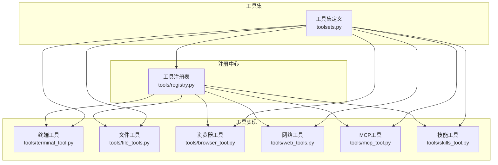
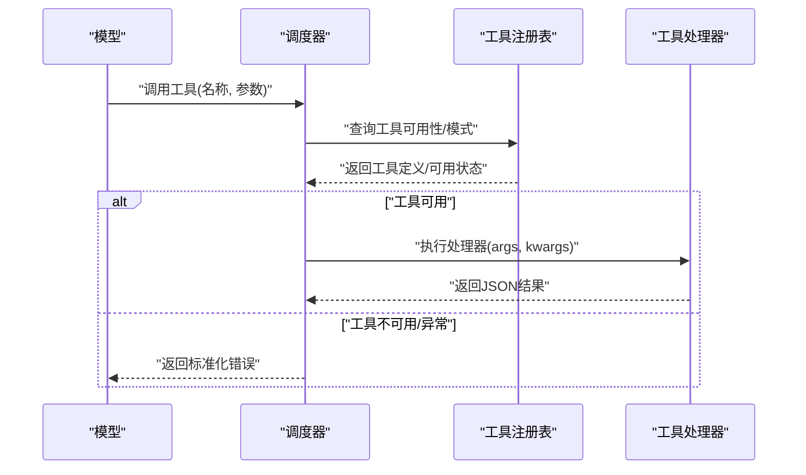
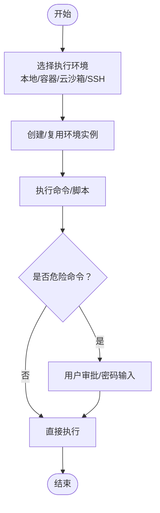
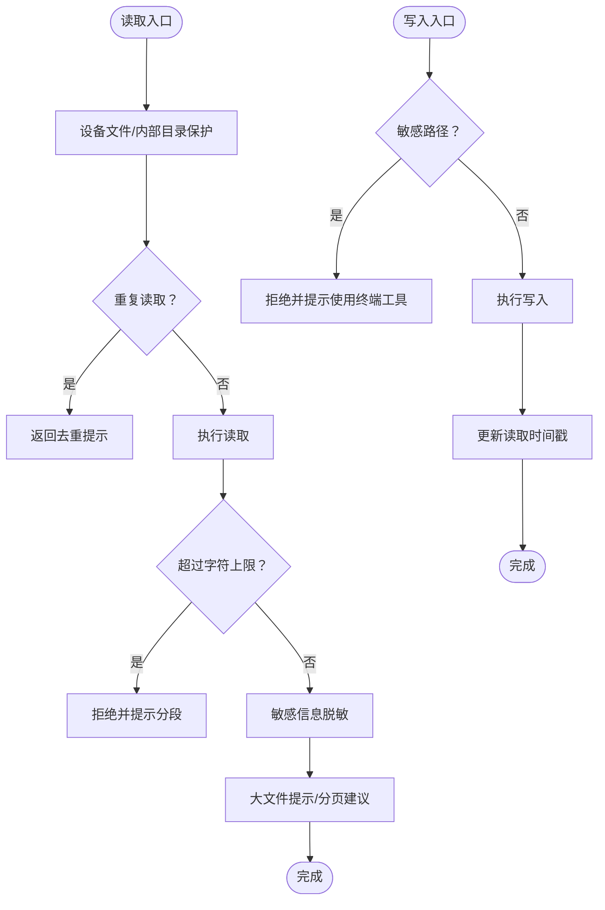
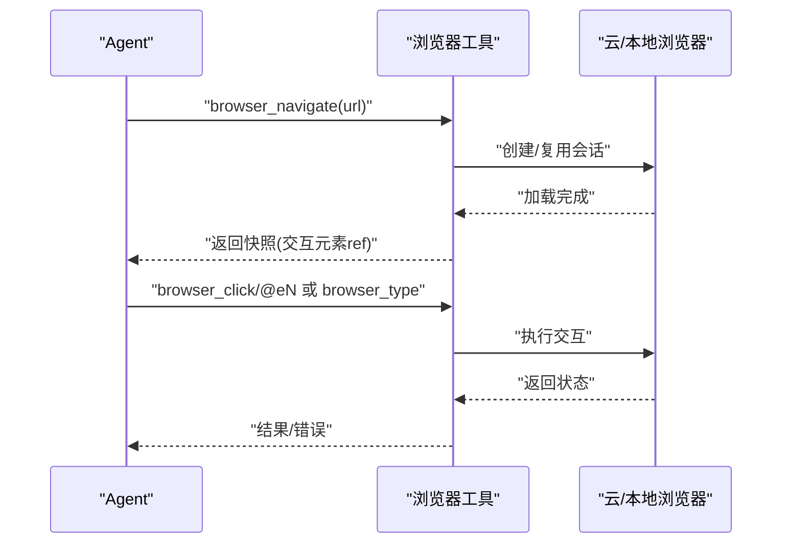
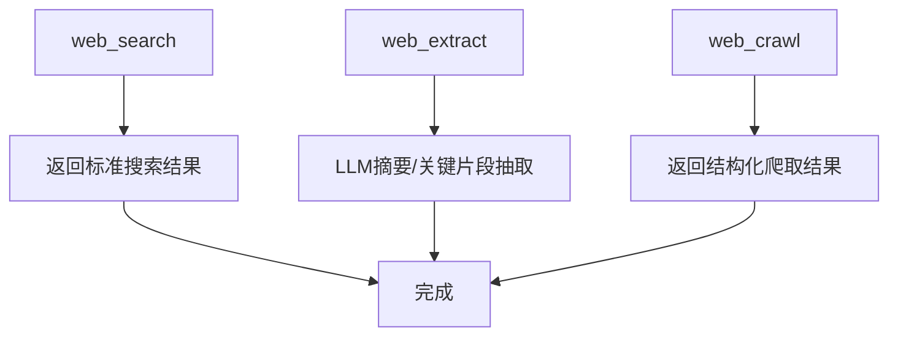
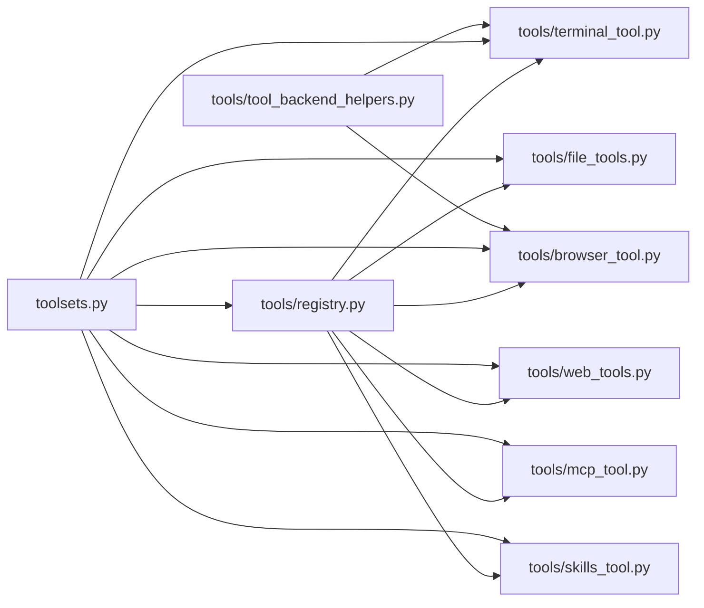

# 工具系统

<cite>
**本文档引用的文件**
- [tools/registry.py](file://tools/registry.py)
- [tools/terminal_tool.py](file://tools/terminal_tool.py)
- [tools/file_tools.py](file://tools/file_tools.py)
- [tools/browser_tool.py](file://tools/browser_tool.py)
- [tools/web_tools.py](file://tools/web_tools.py)
- [tools/mcp_tool.py](file://tools/mcp_tool.py)
- [tools/skills_tool.py](file://tools/skills_tool.py)
- [tools/tool_backend_helpers.py](file://tools/tool_backend_helpers.py)
- [toolsets.py](file://toolsets.py)
</cite>

## 目录
1. [简介](#简介)
2. [项目结构](#项目结构)
3. [核心组件](#核心组件)
4. [架构总览](#架构总览)
5. [详细组件分析](#详细组件分析)
6. [依赖关系分析](#依赖关系分析)
7. [性能考虑](#性能考虑)
8. [故障排查指南](#故障排查指南)
9. [结论](#结论)
10. [附录](#附录)

## 简介
本指南面向Hermes Agent的工具系统使用者与扩展开发者，系统性讲解内置工具的功能、使用方式与安全机制，并深入说明工具集（toolset）的概念、管理与组合策略。内容涵盖：
- 终端工具：多后端执行、进程管理、持久化与清理
- 文件操作工具：读写、补丁、搜索与安全防护
- 浏览器工具：本地/云浏览器会话、页面快照与交互
- 网络工具：多供应商网页检索与内容抽取
- 工具调用机制与参数传递
- 工具集的启用、禁用与组合
- 安全限制与沙箱机制
- 自定义工具开发与扩展方法

## 项目结构
工具系统由“注册中心 + 工具实现 + 工具集”三层构成：
- 注册中心：集中登记工具元数据、可用性检查与分发
- 工具实现：各功能模块（终端、文件、浏览器、网络、技能、MCP等）
- 工具集：对工具进行分组与组合，便于按场景启用

图表来源
- [tools/registry.py:45-275](file://tools/registry.py#L45-L275)
- [tools/terminal_tool.py:1-120](file://tools/terminal_tool.py#L1-L120)
- [tools/file_tools.py:1-120](file://tools/file_tools.py#L1-L120)
- [tools/browser_tool.py:1-120](file://tools/browser_tool.py#L1-L120)
- [tools/web_tools.py:1-120](file://tools/web_tools.py#L1-L120)
- [tools/mcp_tool.py:1-120](file://tools/mcp_tool.py#L1-L120)
- [tools/skills_tool.py:1-120](file://tools/skills_tool.py#L1-L120)
- [toolsets.py:66-373](file://toolsets.py#L66-L373)

章节来源
- [tools/registry.py:1-321](file://tools/registry.py#L1-L321)
- [toolsets.py:1-638](file://toolsets.py#L1-L638)

## 核心组件
- 工具注册表（Registry）：统一收集工具的模式定义、处理器、可用性检查与描述信息；支持动态卸载与错误格式化
- 工具集（Toolsets）：以命名集合的方式组织工具，支持直接工具列表与组合其他工具集
- 各类工具模块：终端、文件、浏览器、网络、MCP、技能等

章节来源
- [tools/registry.py:45-275](file://tools/registry.py#L45-L275)
- [toolsets.py:66-373](file://toolsets.py#L66-L373)

## 架构总览
工具调用链路如下：
- 模型生成工具调用请求（名称 + 参数）
- 调度器通过注册表查询可用工具与模式
- 可用时调用对应工具处理器，返回JSON字符串结果
- 不可用或异常时返回标准化错误消息

图表来源
- [tools/registry.py:144-162](file://tools/registry.py#L144-L162)
- [tools/registry.py:111-138](file://tools/registry.py#L111-L138)

章节来源
- [tools/registry.py:144-162](file://tools/registry.py#L144-L162)
- [tools/registry.py:111-138](file://tools/registry.py#L111-L138)

## 详细组件分析

### 终端工具（terminal_tool）
- 功能要点
  - 多后端执行：本地、Docker、Singularity、Modal、Daytona、SSH
  - 进程生命周期管理：自动创建、空闲清理、后台任务
  - 安全增强：危险命令审批、sudo密码缓存与提示、路径白名单校验
  - 环境配置：超时、资源配额、持久化文件系统、容器卷挂载
- 关键能力
  - 执行命令（前台/后台）、查看/等待进程状态
  - 任务级环境复用与清理线程
  - 与文件工具共享底层环境实例
- 使用建议
  - 长任务设置后台执行并使用通知回调
  - 交互式工具务必开启伪终端（pty=true）
  - 云沙箱不保证进程常驻，适合任务执行而非长期托管

图表来源
- [tools/terminal_tool.py:583-713](file://tools/terminal_tool.py#L583-L713)
- [tools/terminal_tool.py:145-149](file://tools/terminal_tool.py#L145-L149)

章节来源
- [tools/terminal_tool.py:1-800](file://tools/terminal_tool.py#L1-L800)

### 文件操作工具（file_tools）
- 功能要点
  - 读取：带行号、分页、字符数上限、重复读取去重
  - 写入：覆盖写、敏感路径保护、修改时间戳跟踪
  - 补丁：替换/模糊匹配、V4A多文件补丁、语法检查
  - 搜索：内容/文件名、正则/Glob、上下文输出、分页提示
- 安全与效率
  - 设备文件阻断（/dev/zero等）、内部缓存目录禁止直读
  - 大文件截断与提示、连续重复读取警告/阻断
  - 与终端工具共享环境，避免重复沙箱创建
- 使用建议
  - 大文件使用offset/limit分段读取
  - 修改前先read_file确认当前内容，避免旧文本未找到导致的反复尝试

图表来源
- [tools/file_tools.py:279-436](file://tools/file_tools.py#L279-L436)
- [tools/file_tools.py:559-581](file://tools/file_tools.py#L559-L581)

章节来源
- [tools/file_tools.py:1-824](file://tools/file_tools.py#L1-L824)

### 浏览器工具（browser_tool）
- 功能要点
  - 本地/云浏览器会话：Browser Use/Browserbase/Firecrawl
  - 页面快照：可选完整内容或仅交互元素
  - 元素交互：点击、输入、滚动、回退、按键
  - 视觉分析：截图+AI分析，支持标注交互元素ref
  - 会话清理：空闲超时自动回收
- 安全与配置
  - 私网地址访问控制开关
  - CDP端点直连覆盖
  - 云端提供商凭据与代理选项
- 使用建议
  - 先navigate再snapshot，必要时使用full=true获取完整内容
  - 交互后如页面变化，重新snapshot刷新ref

图表来源
- [tools/browser_tool.py:500-656](file://tools/browser_tool.py#L500-L656)
- [tools/browser_tool.py:690-744](file://tools/browser_tool.py#L690-L744)

章节来源
- [tools/browser_tool.py:1-800](file://tools/browser_tool.py#L1-L800)

### 网络工具（web_tools）
- 功能要点
  - 多后端：Exa、Firecrawl、Parallel、Tavily
  - 搜索、提取、爬取；支持通过Nous托管网关路由（订阅用户）
  - 内容智能摘要：LLM抽取关键片段与Markdown总结，降低token消耗
- 配置与调试
  - 后端自动探测与优先级回退
  - 支持调试日志与性能指标记录
- 使用建议
  - 大内容采用分块处理与合成摘要
  - 对于长文本，优先使用web_extract以减少上下文开销

图表来源
- [tools/web_tools.py:1-200](file://tools/web_tools.py#L1-L200)
- [tools/web_tools.py:477-790](file://tools/web_tools.py#L477-L790)

章节来源
- [tools/web_tools.py:1-800](file://tools/web_tools.py#L1-L800)

### 技能工具（skills_tool）
- 功能要点
  - 技能目录结构：SKILL.md主文档 + references/templates/assets
  - 渐进披露：skills_list仅返回元数据，skill_view按需加载全文
  - 平台兼容与前置条件：平台过滤、环境变量要求、密钥采集
- 使用建议
  - 使用skills_list快速发现相关技能，再用skill_view查看细节
  - 注意平台限制与所需环境变量，必要时在本地CLI中完成密钥录入

章节来源
- [tools/skills_tool.py:1-800](file://tools/skills_tool.py#L1-L800)

### MCP工具（mcp_tool）
- 功能要点
  - 连接外部MCP服务器（stdio或HTTP/StreamableHTTP）
  - 自动发现工具清单，动态注册到注册表
  - 采样回调：服务器可请求LLM完成消息（含工具调用）
  - 安全：环境变量过滤、凭据清洗、错误消息脱敏
- 使用建议
  - 为不同服务器配置独立超时与连接超时
  - 启用采样时注意速率限制与模型白名单

章节来源
- [tools/mcp_tool.py:1-800](file://tools/mcp_tool.py#L1-L800)

## 依赖关系分析
- 工具注册表作为中心枢纽，被所有工具模块导入并注册自身模式与处理器
- 工具集定义与注册表相互独立，但运行时通过解析工具集名称获取工具列表
- 工具后端辅助模块提供跨工具的通用配置与模式选择逻辑

图表来源
- [tools/registry.py:1-321](file://tools/registry.py#L1-L321)
- [toolsets.py:1-638](file://toolsets.py#L1-L638)
- [tools/tool_backend_helpers.py:1-90](file://tools/tool_backend_helpers.py#L1-L90)

章节来源
- [tools/registry.py:1-321](file://tools/registry.py#L1-L321)
- [toolsets.py:1-638](file://toolsets.py#L1-L638)
- [tools/tool_backend_helpers.py:1-90](file://tools/tool_backend_helpers.py#L1-L90)

## 性能考虑
- 上下文压缩：文件读取与搜索具备连续重复检测与去重提示，避免无意义的重复传输
- 大内容处理：网络工具对超大文本采用分块摘要与合成摘要，严格控制最终输出长度
- 环境复用：终端与文件工具共享底层环境实例，减少沙箱创建成本
- 异步与并发：MCP工具在专用事件循环中运行，避免阻塞主线程

章节来源
- [tools/file_tools.py:438-508](file://tools/file_tools.py#L438-L508)
- [tools/web_tools.py:477-790](file://tools/web_tools.py#L477-L790)
- [tools/terminal_tool.py:1792-1800](file://tools/terminal_tool.py#L1792-L1800)
- [tools/mcp_tool.py:716-750](file://tools/mcp_tool.py#L716-L750)

## 故障排查指南
- 工具不可用
  - 检查工具可用性检查函数（check_fn）是否返回True
  - 查看工具集可用性映射，确认依赖环境变量已满足
- 终端工具
  - 危险命令被阻断：通过审批流程或调整命令
  - sudo失败：检查SUDO_PASSWORD或交互式密码输入
  - 云沙箱清理：确认idle超时与清理线程运行
- 文件工具
  - 重复读取被阻断：停止循环读取，改用write/patch
  - 大文件报错：使用offset/limit分段读取
- 浏览器工具
  - 会话泄漏：检查空闲超时与清理线程
  - CDP端点：确认端点可解析为WebSocket URL
- 网络工具
  - 后端配置缺失：检查API Key或托管网关配置
  - 大内容超时：增大辅助模型超时或切换更快模型
- MCP工具
  - 连接失败：检查命令/URL、凭据与网络可达性
  - 采样限流：调整RPM与最大轮次限制

章节来源
- [tools/registry.py:194-271](file://tools/registry.py#L194-L271)
- [tools/terminal_tool.py:179-203](file://tools/terminal_tool.py#L179-L203)
- [tools/file_tools.py:415-436](file://tools/file_tools.py#L415-L436)
- [tools/browser_tool.py:414-440](file://tools/browser_tool.py#L414-L440)
- [tools/web_tools.py:160-172](file://tools/web_tools.py#L160-L172)
- [tools/mcp_tool.py:270-328](file://tools/mcp_tool.py#L270-L328)

## 结论
Hermes工具系统通过注册表实现统一调度、通过工具集实现灵活组合、通过多后端与安全机制保障可用性与安全性。推荐在实际使用中：
- 明确任务场景，选择合适的工具集
- 优先使用文件与网络工具的摘要能力，降低上下文开销
- 重视安全限制与审批流程，谨慎执行危险命令与写入操作
- 善用工具集组合与动态工具发现，提升Agent的适应性与扩展性

## 附录

### 工具集管理与组合
- 获取工具集定义与解析后的工具列表
- 支持组合多个工具集并去重
- 支持运行时创建自定义工具集

章节来源
- [toolsets.py:377-596](file://toolsets.py#L377-L596)

### 工具调用机制与参数传递
- 注册表负责模式校验与可用性检查
- 工具处理器接收参数字典并返回JSON字符串
- 错误统一格式化，便于上层处理

章节来源
- [tools/registry.py:111-162](file://tools/registry.py#L111-L162)

### 安全限制与沙箱机制
- 终端：危险命令审批、sudo密码缓存、路径白名单
- 文件：敏感路径保护、设备文件阻断、重复读取限制
- 浏览器：私网地址访问控制、CDP端点直连、会话空闲清理
- 网络：凭据清洗、错误消息脱敏
- MCP：环境变量过滤、采样速率限制

章节来源
- [tools/terminal_tool.py:138-177](file://tools/terminal_tool.py#L138-L177)
- [tools/file_tools.py:92-125](file://tools/file_tools.py#L92-L125)
- [tools/browser_tool.py:308-327](file://tools/browser_tool.py#L308-L327)
- [tools/web_tools.py:174-182](file://tools/web_tools.py#L174-L182)
- [tools/mcp_tool.py:192-218](file://tools/mcp_tool.py#L192-L218)

### 自定义工具开发指南
- 在工具模块中定义处理器函数与OpenAI格式的工具模式
- 在模块导入时调用注册表的register方法完成注册
- 提供check_fn用于可用性检查，确保在不可用时不会被调度
- 返回值必须为JSON字符串，可使用注册表提供的tool_error/tool_result辅助函数

章节来源
- [tools/registry.py:56-89](file://tools/registry.py#L56-L89)
- [tools/registry.py:294-321](file://tools/registry.py#L294-L321)