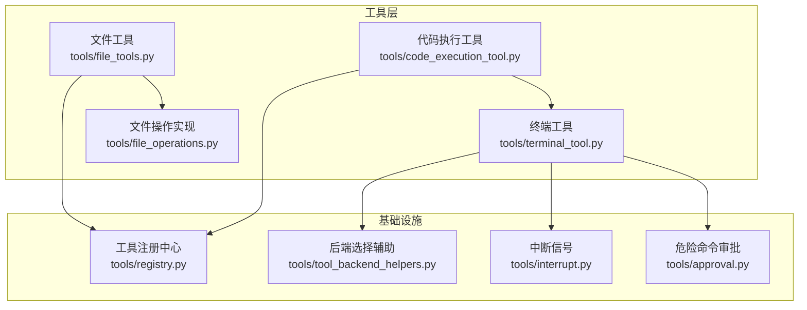
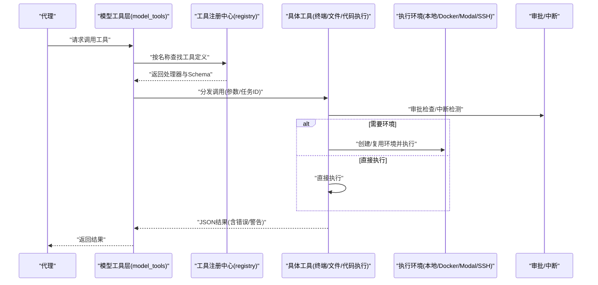
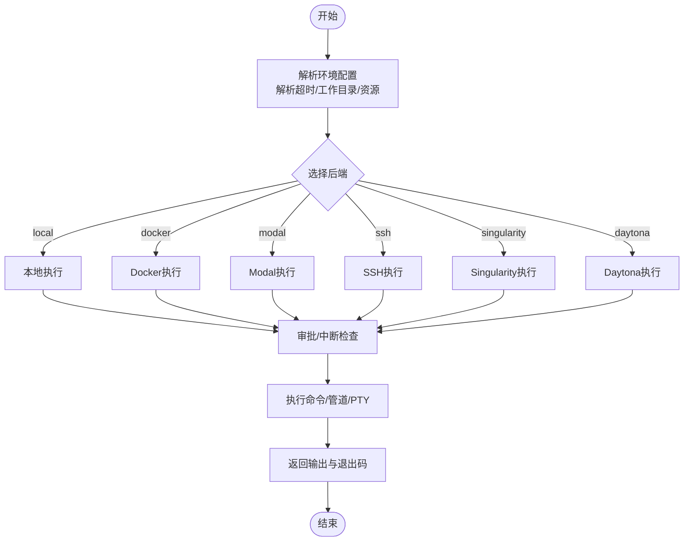
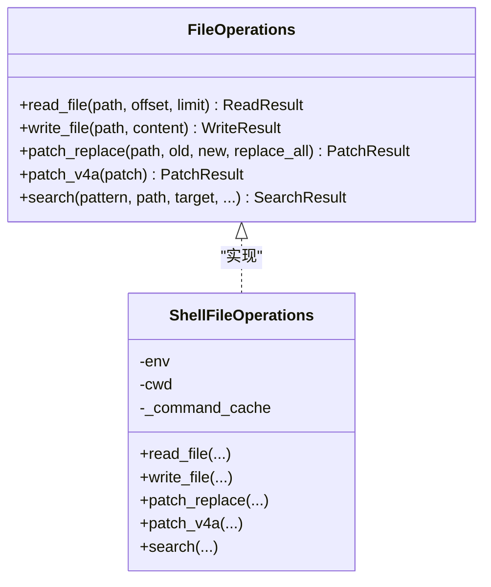
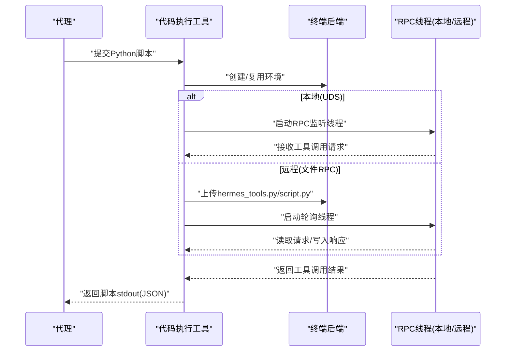
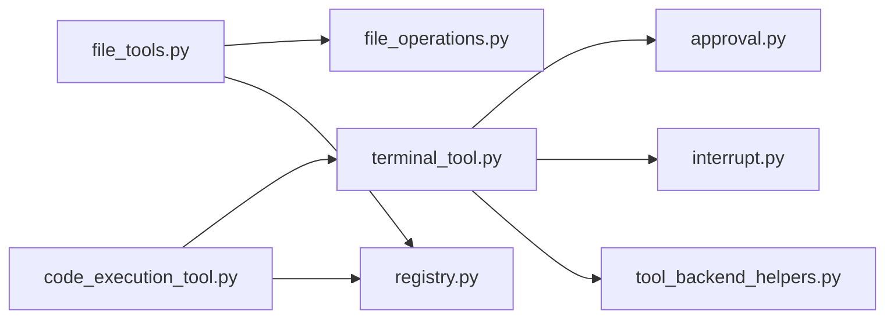

# 核心工具

<cite>
**本文引用的文件**
- [tools/terminal_tool.py](file://tools/terminal_tool.py)
- [tools/file_operations.py](file://tools/file_operations.py)
- [tools/file_tools.py](file://tools/file_tools.py)
- [tools/code_execution_tool.py](file://tools/code_execution_tool.py)
- [tools/approval.py](file://tools/approval.py)
- [tools/interrupt.py](file://tools/interrupt.py)
- [tools/tool_backend_helpers.py](file://tools/tool_backend_helpers.py)
- [tools/registry.py](file://tools/registry.py)
</cite>

## 目录
1. [简介](#简介)
2. [项目结构](#项目结构)
3. [核心组件](#核心组件)
4. [架构总览](#架构总览)
5. [详细组件分析](#详细组件分析)
6. [依赖分析](#依赖分析)
7. [性能考虑](#性能考虑)
8. [故障排查指南](#故障排查指南)
9. [结论](#结论)
10. [附录](#附录)

## 简介
本指南面向Hermes Agent的核心工具使用，重点覆盖以下基础能力：
- 终端工具：在本地、Docker、Modal、SSH、Singularity、Daytona等多后端执行命令，支持前台/后台、交互式PTY、超时与中断、危险命令审批、磁盘用量告警等。
- 文件操作工具：统一的跨后端文件读写、补丁（patch）与搜索接口，内置路径安全检查、写入白名单/黑名单、重复读去重、大文件字符数限制、敏感路径保护等。
- 代码执行工具（Programmatic Tool Calling，PTC）：允许LLM生成Python脚本在沙箱中调用受限工具集，本地通过Unix域套接字、远程通过文件RPC，屏蔽中间结果进入上下文窗口。

本指南解释工具与代理的交互方式（参数传递、结果处理、错误处理）、安全限制与沙箱机制、调用流程与注意事项，并提供最佳实践与排障建议。

## 项目结构
核心工具位于tools目录下，围绕“终端执行”“文件操作”“代码执行”三大类构建，配套有“审批系统”“中断信号”“后端选择辅助”“工具注册中心”等基础设施模块。

图示来源
- [tools/terminal_tool.py](file://tools/terminal_tool.py)
- [tools/file_tools.py](file://tools/file_tools.py)
- [tools/file_operations.py](file://tools/file_operations.py)
- [tools/code_execution_tool.py](file://tools/code_execution_tool.py)
- [tools/approval.py](file://tools/approval.py)
- [tools/interrupt.py](file://tools/interrupt.py)
- [tools/tool_backend_helpers.py](file://tools/tool_backend_helpers.py)
- [tools/registry.py](file://tools/registry.py)

章节来源
- [tools/terminal_tool.py](file://tools/terminal_tool.py)
- [tools/file_tools.py](file://tools/file_tools.py)
- [tools/file_operations.py](file://tools/file_operations.py)
- [tools/code_execution_tool.py](file://tools/code_execution_tool.py)
- [tools/approval.py](file://tools/approval.py)
- [tools/interrupt.py](file://tools/interrupt.py)
- [tools/tool_backend_helpers.py](file://tools/tool_backend_helpers.py)
- [tools/registry.py](file://tools/registry.py)

## 核心组件
- 终端工具（terminal_tool）
  - 支持后端选择（local/docker/modal/ssh/singularity/daytona），环境生命周期管理与自动清理，sudo密码缓存与提示，危险命令审批与阻断，工作目录校验，磁盘用量告警。
  - 提供描述文本用于LLM调用意图对齐。
- 文件工具（file_tools）
  - 对外暴露read_file/write_file/patch/search_files四个工具，封装ShellFileOperations，内置设备路径阻断、敏感路径保护、重复读去重、大文件字符数限制、读写前后时间戳跟踪以检测外部修改。
- 文件操作实现（file_operations）
  - 基于Shell命令的跨后端文件操作抽象，统一读写/补丁/搜索接口；内置二进制/图片识别、内容采样与行号格式化、lint自动检查、路径转义与命令可用性缓存等。
- 代码执行工具（code_execution_tool）
  - 在本地（UDS）或远程（文件RPC）沙箱中运行LLM生成的Python脚本，仅返回stdout到LLM；提供hermes_tools.py桩函数集合，限制可调用工具集，RPC轮询线程与请求/响应文件管理。
- 审批系统（approval）
  - 危险命令模式匹配、会话级/永久级批准状态、智能审批（辅助LLM风险评估）、网关异步审批队列、组合安全扫描（tirith）与危险命令检测。
- 中断信号（interrupt）
  - 全局事件用于工具轮询检测用户中断，快速终止长任务。
- 后端选择辅助（tool_backend_helpers）
  - Modal后端解析（direct/managed/auto）、凭证检测、模式规范化等。
- 工具注册中心（registry）
  - 统一注册/查询/分发工具，屏蔽各工具文件内部差异，提供可用性检查与错误序列化。

章节来源
- [tools/terminal_tool.py](file://tools/terminal_tool.py)
- [tools/file_tools.py](file://tools/file_tools.py)
- [tools/file_operations.py](file://tools/file_operations.py)
- [tools/code_execution_tool.py](file://tools/code_execution_tool.py)
- [tools/approval.py](file://tools/approval.py)
- [tools/interrupt.py](file://tools/interrupt.py)
- [tools/tool_backend_helpers.py](file://tools/tool_backend_helpers.py)
- [tools/registry.py](file://tools/registry.py)

## 架构总览
下图展示工具与代理交互的关键流程：代理通过模型工具层调度工具，工具根据配置选择后端，执行前经过审批与中断检测，结果经统一JSON序列化返回。

图示来源
- [tools/registry.py](file://tools/registry.py)
- [tools/terminal_tool.py](file://tools/terminal_tool.py)
- [tools/file_tools.py](file://tools/file_tools.py)
- [tools/code_execution_tool.py](file://tools/code_execution_tool.py)
- [tools/approval.py](file://tools/approval.py)
- [tools/interrupt.py](file://tools/interrupt.py)

## 详细组件分析

### 终端工具（terminal_tool）
- 功能要点
  - 多后端执行：local/docker/modal/ssh/singularity/daytona，支持容器资源、持久化文件系统、工作目录、超时与生命周期管理。
  - 前台/后台执行：前台即时返回结果，后台返回session_id，支持notify_on_complete通知。
  - 交互式PTY：pty=true用于需要伪终端的交互式工具。
  - 危险命令审批：集成审批系统，容器后端跳过审批；支持yolo模式绕过。
  - sudo处理：支持SUDO_PASSWORD环境变量与交互式输入，-S标志注入stdin。
  - 磁盘用量告警：检测hermes目录总大小超过阈值时发出告警。
  - 工作目录校验：严格字符白名单，拒绝可疑路径。
- 参数与行为
  - 关键参数：command、timeout、workdir、background、pty、notify_on_complete等。
  - 返回：输出文本与退出码；后台任务返回会话标识。
- 安全与沙箱
  - 容器/云沙箱默认隔离，持久化文件系统不保证进程常驻；建议将长期服务改为前台任务或使用后台+通知模式。
  - 审批系统对非容器后端生效，容器后端跳过审批。
- 使用示例（路径参考）
  - 执行简单命令：[tools/terminal_tool.py](file://tools/terminal_tool.py)
  - 后台任务与通知：[tools/terminal_tool.py](file://tools/terminal_tool.py)
  - sudo密码处理：[tools/terminal_tool.py](file://tools/terminal_tool.py)
  - 危险命令审批入口：[tools/terminal_tool.py](file://tools/terminal_tool.py)
  - 环境配置解析：[tools/terminal_tool.py](file://tools/terminal_tool.py)
  - Modal后端选择：[tools/tool_backend_helpers.py](file://tools/tool_backend_helpers.py)
- 最佳实践
  - 优先使用前台执行短命令；长任务使用background并设置合理timeout。
  - 需要交互工具时开启pty=true。
  - 在消息网关场景避免sudo失败：预置SUDO_PASSWORD或通过消息通道配置。
  - 容器后端注意清理策略与快照重建导致的状态丢失。

图示来源
- [tools/terminal_tool.py](file://tools/terminal_tool.py)
- [tools/tool_backend_helpers.py](file://tools/tool_backend_helpers.py)
- [tools/approval.py](file://tools/approval.py)
- [tools/interrupt.py](file://tools/interrupt.py)

章节来源
- [tools/terminal_tool.py](file://tools/terminal_tool.py)
- [tools/tool_backend_helpers.py](file://tools/tool_backend_helpers.py)
- [tools/approval.py](file://tools/approval.py)
- [tools/interrupt.py](file://tools/interrupt.py)

### 文件工具（file_tools）与文件操作实现（file_operations）
- 功能要点
  - 统一接口：read_file、write_file、patch（替换/V4A）、search_files（内容/文件名）。
  - 跨后端：基于ShellFileOperations，适配所有终端后端。
  - 安全控制：写入黑名单/敏感路径保护、HERMES_WRITE_SAFE_ROOT沙箱、设备路径阻断、重复读去重、大文件字符数限制。
  - 智能提示：未找到文件时给出相似文件建议；搜索截断时提示下一页offset。
  - 一致性：返回统一JSON结构，错误/警告字段标准化。
- 参数与行为
  - read_file：path、offset、limit；返回带行号内容、总行数、是否截断、提示信息。
  - write_file：path、content；返回写入字节数、是否创建父目录。
  - patch：mode=replace或patch；返回diff、修改/创建/删除文件列表、lint结果。
  - search_files：pattern、target、path、file_glob、limit、offset、output_mode、context。
- 安全与沙箱
  - 写入拒绝：/etc/*、~/.ssh/*、~/.aws/*、~/.kube/*、~/.gnupg/*、~/.config/gh/*、/etc/sudoers*、/etc/passwd、/etc/shadow、~/.bashrc等。
  - 可选安全根：HERMES_WRITE_SAFE_ROOT限制写入范围。
  - 重复读去重：同一task内相同(offset,limit)的读取若文件未变更则返回轻量stub。
  - 大文件限制：超过配置上限的读取会被拒绝，建议使用offset/limit分页。
- 使用示例（路径参考）
  - 读取文件与分页：[tools/file_tools.py](file://tools/file_tools.py)
  - 写入文件与权限检查：[tools/file_tools.py](file://tools/file_tools.py)
  - 补丁编辑与lint：[tools/file_tools.py](file://tools/file_tools.py)
  - 搜索文件与内容：[tools/file_tools.py](file://tools/file_tools.py)
  - ShellFileOperations实现细节：[tools/file_operations.py](file://tools/file_operations.py)

图示来源
- [tools/file_operations.py](file://tools/file_operations.py)
- [tools/file_tools.py](file://tools/file_tools.py)

章节来源
- [tools/file_tools.py](file://tools/file_tools.py)
- [tools/file_operations.py](file://tools/file_operations.py)

### 代码执行工具（code_execution_tool，PTC）
- 功能要点
  - 在本地（Unix域套接字）或远程（文件RPC）沙箱中运行LLM生成的Python脚本。
  - 仅允许7个工具：web_search/web_extract/read_file/write_file/search_files/patch/terminal。
  - 本地通过UDS RPC，远程通过请求/响应文件；RPC线程轮询处理。
  - 限制：默认超时、最大工具调用次数、stdout/stderr大小限制。
- 参数与行为
  - 输入：脚本字符串、任务ID、启用工具集合。
  - 输出：JSON字符串，包含status、tool_calls_made、duration_seconds、错误信息等。
  - 远程要求：目标后端需具备Python3。
- 安全与沙箱
  - 仅允许白名单工具；禁止传入terminal的后台/通知参数。
  - 本地UDS仅支持POSIX；远程通过文件RPC。
- 使用示例（路径参考）
  - 生成hermes_tools桩模块：[tools/code_execution_tool.py](file://tools/code_execution_tool.py)
  - 本地RPC服务器循环：[tools/code_execution_tool.py](file://tools/code_execution_tool.py)
  - 远程执行与RPC轮询：[tools/code_execution_tool.py](file://tools/code_execution_tool.py)

图示来源
- [tools/code_execution_tool.py](file://tools/code_execution_tool.py)
- [tools/terminal_tool.py](file://tools/terminal_tool.py)

章节来源
- [tools/code_execution_tool.py](file://tools/code_execution_tool.py)
- [tools/terminal_tool.py](file://tools/terminal_tool.py)

### 审批系统（approval）与中断信号（interrupt）
- 审批系统
  - 模式匹配：检测rm -rf、chmod 777、systemctl stop、管道执行远程脚本、覆盖系统文件等高危模式。
  - 会话级/永久级批准：支持一次性、会话级、永久级批准；支持从配置加载永久允许列表。
  - 智能审批：通过辅助LLM对命令实际风险进行评估，减少误判。
  - 网关异步审批：在网关/消息场景排队等待用户批准，支持/FIFO顺序与批量批准。
- 中断信号
  - 全局Event，代理在收到中断时触发；工具轮询检测并优雅退出，返回中断状态码。
- 使用示例（路径参考）
  - 危险命令检测与审批：[tools/approval.py](file://tools/approval.py)
  - 组合安全扫描与审批：[tools/approval.py](file://tools/approval.py)
  - 中断事件设置与检测：[tools/interrupt.py](file://tools/interrupt.py)

章节来源
- [tools/approval.py](file://tools/approval.py)
- [tools/interrupt.py](file://tools/interrupt.py)

## 依赖分析
- 组件耦合
  - 终端工具依赖审批系统、中断信号、后端选择辅助；与文件工具共享环境生命周期管理。
  - 文件工具依赖文件操作实现与注册中心；与终端工具共享环境创建逻辑。
  - 代码执行工具依赖终端工具创建环境、注册中心分发、RPC线程。
  - 审批系统与中断信号被多个工具共享。
- 外部依赖
  - Modal后端需要凭证或托管网关可用性；容器后端依赖Docker/Singularity等。
  - 远程执行依赖目标后端存在Python3。

图示来源
- [tools/terminal_tool.py](file://tools/terminal_tool.py)
- [tools/file_tools.py](file://tools/file_tools.py)
- [tools/file_operations.py](file://tools/file_operations.py)
- [tools/code_execution_tool.py](file://tools/code_execution_tool.py)
- [tools/approval.py](file://tools/approval.py)
- [tools/interrupt.py](file://tools/interrupt.py)
- [tools/tool_backend_helpers.py](file://tools/tool_backend_helpers.py)
- [tools/registry.py](file://tools/registry.py)

章节来源
- [tools/terminal_tool.py](file://tools/terminal_tool.py)
- [tools/file_tools.py](file://tools/file_tools.py)
- [tools/file_operations.py](file://tools/file_operations.py)
- [tools/code_execution_tool.py](file://tools/code_execution_tool.py)
- [tools/approval.py](file://tools/approval.py)
- [tools/interrupt.py](file://tools/interrupt.py)
- [tools/tool_backend_helpers.py](file://tools/tool_backend_helpers.py)
- [tools/registry.py](file://tools/registry.py)

## 性能考虑
- 环境生命周期
  - 终端工具维护活动环境映射与最后活跃时间，定期清理长时间不活跃的沙箱，避免资源泄漏。
  - 文件工具对同一task内的文件读取进行去重与mtime缓存，减少重复传输与上下文占用。
- I/O与命令执行
  - 文件操作通过管道stdin写入大文件，绕过ARG_MAX限制；读取采用分页与行号格式化，避免一次性传输过多内容。
  - Shell命令可用性缓存减少重复探测开销。
- 远程RPC
  - 文件RPC采用原子写入与指数退避轮询，降低IO争用与CPU占用。
- 超时与中断
  - 统一的超时与中断检测机制，避免长时间阻塞与僵尸进程。

## 故障排查指南
- 终端工具
  - sudo失败：在消息网关场景提示添加SUDO_PASSWORD；本地可交互输入或通过环境变量提供。
  - 审批阻断：查看审批描述与模式键，必要时使用会话级/永久级批准；容器后端跳过审批。
  - 磁盘告警：清理环境或增大阈值；使用cleanup_all_environments清理。
  - 工作目录异常：确保路径仅包含安全字符，避免相对/宿主路径进入容器后端。
- 文件工具
  - 写入被拒：检查是否命中敏感路径/黑名单；使用write_safe_root限制写入范围。
  - 重复读被阻：停止连续读取相同区域，先写入/再读取验证；或使用更精确的offset/limit。
  - 大文件读取：按行分页offset/limit；必要时改用search_files定位目标。
- 代码执行工具
  - 远程无Python：目标后端未安装Python3；本地UDS不可用（Windows）。
  - 工具调用超限：调整max_tool_calls；拆分脚本为多次调用。
  - RPC轮询失败：检查RPC目录权限与网络连通性；确认请求/响应文件原子写入成功。
- 通用
  - 错误返回：所有工具统一返回JSON字符串，包含error字段；按需提取message与额外字段。
  - 注册中心：工具Schema与可用性由注册中心统一管理，便于调试与UI展示。

章节来源
- [tools/terminal_tool.py](file://tools/terminal_tool.py)
- [tools/file_tools.py](file://tools/file_tools.py)
- [tools/file_operations.py](file://tools/file_operations.py)
- [tools/code_execution_tool.py](file://tools/code_execution_tool.py)
- [tools/registry.py](file://tools/registry.py)

## 结论
Hermes Agent的核心工具以“统一接口+多后端+强安全”为核心设计，既满足开发与运维场景的灵活性，又通过审批、中断、沙箱与资源限制保障系统稳定与安全。建议在生产环境中：
- 明确后端选择与资源配置，优先使用容器/云沙箱隔离。
- 启用审批与智能审批，结合永久允许列表降低误判。
- 使用文件工具的分页与去重能力，避免上下文膨胀。
- 通过代码执行工具将复杂链路收敛为单次推理，提升效率与安全性。

## 附录
- 环境变量与配置要点（节选）
  - 终端：TERMINAL_ENV、TERMINAL_TIMEOUT、TERMINAL_LIFETIME_SECONDS、TERMINAL_CWD、TERMINAL_DOCKER_IMAGE、TERMINAL_MODAL_MODE、TERMINAL_SSH_*、TERMINAL_CONTAINER_*、TERMINAL_DOCKER_MOUNT_CWD_TO_WORKSPACE、TERMINAL_DISK_WARNING_GB。
  - 文件：file_read_max_chars、HERMES_WRITE_SAFE_ROOT。
  - 审批：approvals.mode（manual/smart/off）、approvals.timeout、HERMES_EXEC_ASK、HERMES_YOLO_MODE。
  - 中断：HERMES_SPINNER_PAUSE（交互提示期间暂停）。
  - Modal：MODAL_TOKEN_ID/MODAL_TOKEN_SECRET、~/.modal.toml、HERMES_ENABLE_NOUS_MANAGED_TOOLS。
- 工具Schema与可用性
  - 通过注册中心查询工具Schema与可用性，便于前端展示与令牌估算。

章节来源
- [tools/terminal_tool.py](file://tools/terminal_tool.py)
- [tools/file_tools.py](file://tools/file_tools.py)
- [tools/registry.py](file://tools/registry.py)