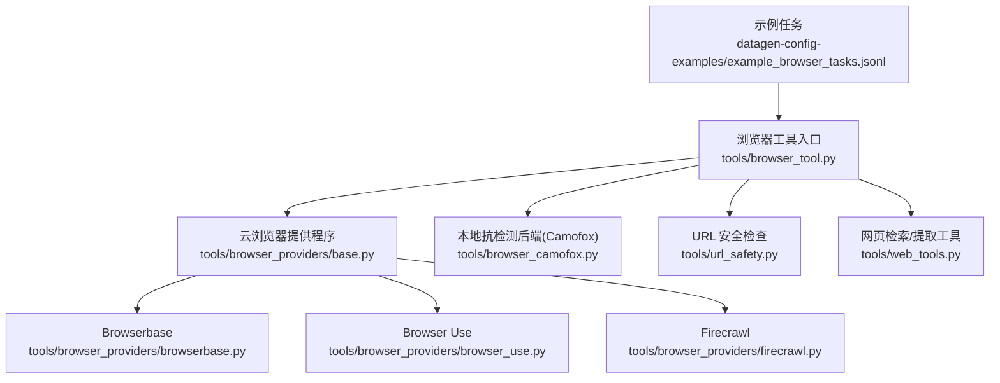
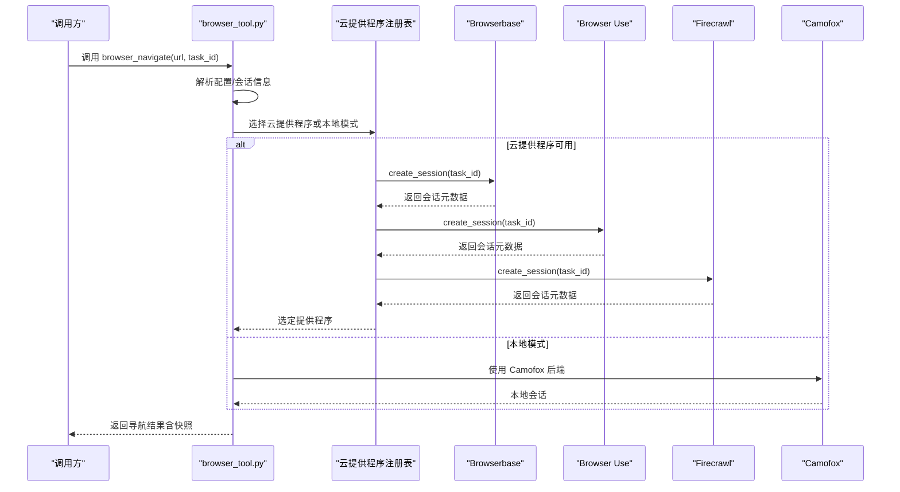
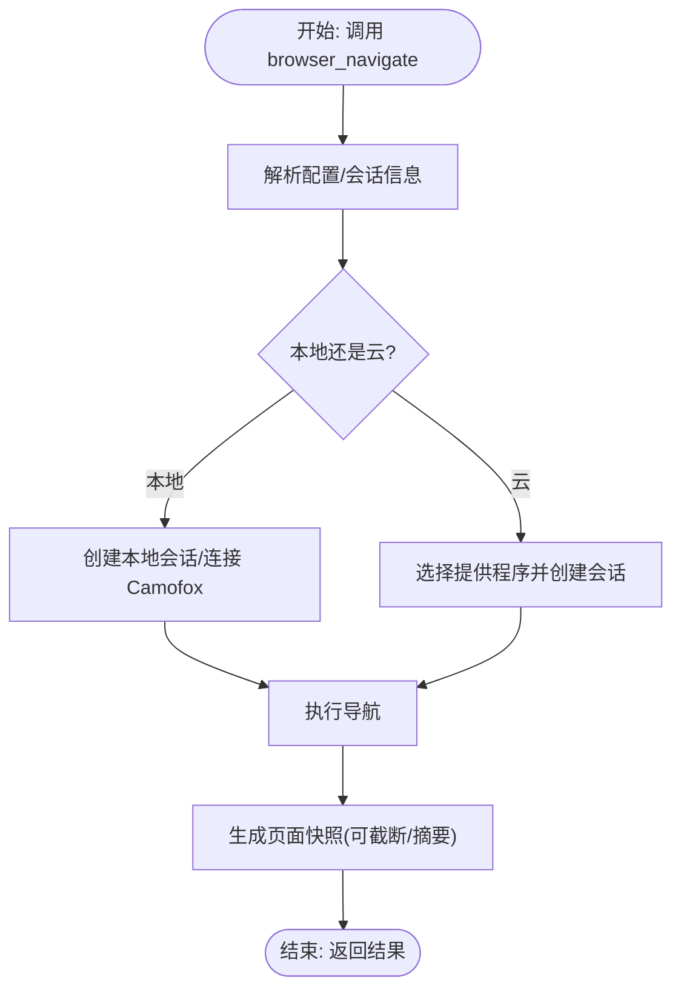
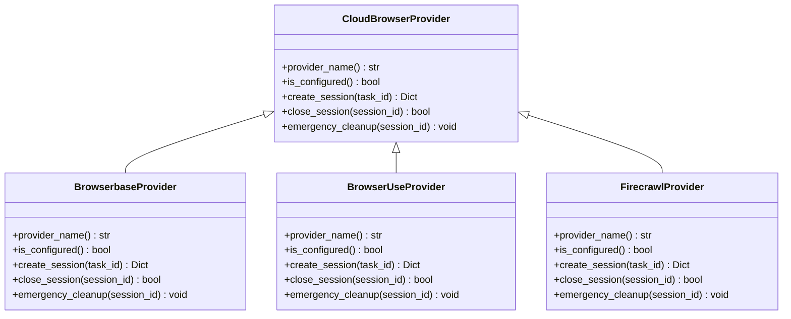
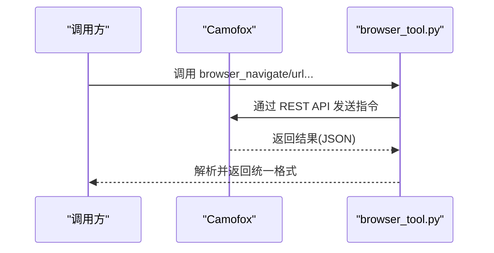
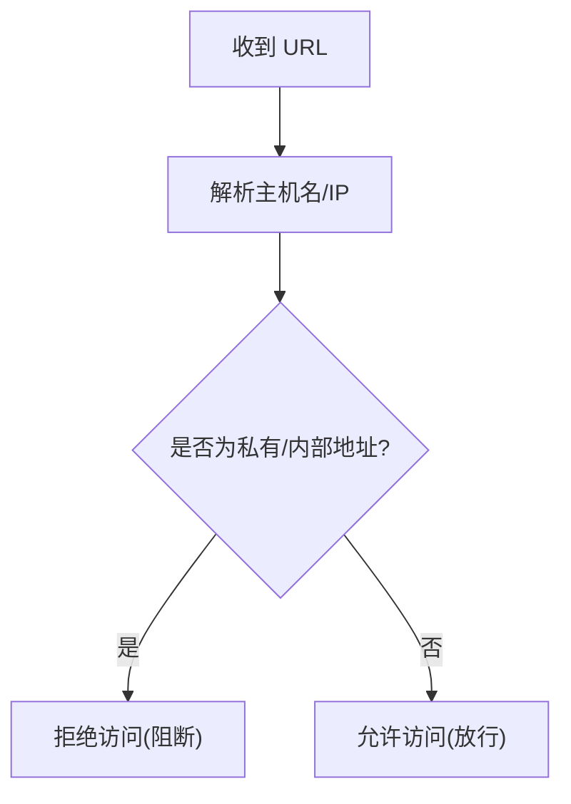
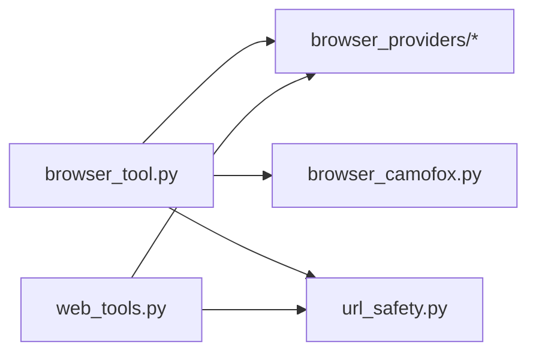

# 浏览器工具

<cite>
**本文引用的文件**
- [browser_tool.py](file://tools/browser_tool.py)
- [base.py](file://tools/browser_providers/base.py)
- [browserbase.py](file://tools/browser_providers/browserbase.py)
- [browser_use.py](file://tools/browser_providers/browser_use.py)
- [firecrawl.py](file://tools/browser_providers/firecrawl.py)
- [browser_camofox.py](file://tools/browser_camofox.py)
- [url_safety.py](file://tools/url_safety.py)
- [web_tools.py](file://tools/web_tools.py)
- [example_browser_tasks.jsonl](file://datagen-config-examples/example_browser_tasks.jsonl)
- [README.md](file://README.md)
</cite>

## 目录
1. [简介](#简介)
2. [项目结构](#项目结构)
3. [核心组件](#核心组件)
4. [架构总览](#架构总览)
5. [详细组件分析](#详细组件分析)
6. [依赖关系分析](#依赖关系分析)
7. [性能考量](#性能考量)
8. [故障排查指南](#故障排查指南)
9. [结论](#结论)
10. [附录](#附录)

## 简介
本指南面向在 Hermes Agent 中使用浏览器工具（Browser Tools）的用户与开发者，系统讲解如何通过统一接口进行页面抓取、内容提取、表单填写、截图与视觉理解、控制台调试等操作；并对比不同浏览器提供程序（Browserbase、Browser Use、Firecrawl、本地 Chromium/Camofox）的特点与适用场景。文档还涵盖配置方法、安全与限制、常见问题与性能优化建议，帮助你在不同环境中稳定高效地使用浏览器自动化能力。

## 项目结构
浏览器工具由“统一入口工具 + 多提供程序适配 + 安全与清理机制”构成，核心文件如下：
- 统一工具入口：tools/browser_tool.py
- 提供程序抽象与实现：tools/browser_providers/*
- 本地抗检测后端：tools/browser_camofox.py
- URL 安全检查：tools/url_safety.py
- 网页检索/提取工具（非浏览器自动化，但与网页内容处理相关）：tools/web_tools.py
- 示例任务数据：datagen-config-examples/example_browser_tasks.jsonl

图表来源
- [browser_tool.py](file://tools/browser_tool.py)
- [base.py](file://tools/browser_providers/base.py)
- [browserbase.py](file://tools/browser_providers/browserbase.py)
- [browser_use.py](file://tools/browser_providers/browser_use.py)
- [firecrawl.py](file://tools/browser_providers/firecrawl.py)
- [browser_camofox.py](file://tools/browser_camofox.py)
- [url_safety.py](file://tools/url_safety.py)
- [web_tools.py](file://tools/web_tools.py)
- [example_browser_tasks.jsonl](file://datagen-config-examples/example_browser_tasks.jsonl)

章节来源
- [browser_tool.py](file://tools/browser_tool.py)
- [base.py](file://tools/browser_providers/base.py)
- [browserbase.py](file://tools/browser_providers/browserbase.py)
- [browser_use.py](file://tools/browser_providers/browser_use.py)
- [firecrawl.py](file://tools/browser_providers/firecrawl.py)
- [browser_camofox.py](file://tools/browser_camofox.py)
- [url_safety.py](file://tools/url_safety.py)
- [web_tools.py](file://tools/web_tools.py)
- [example_browser_tasks.jsonl](file://datagen-config-examples/example_browser_tasks.jsonl)

## 核心组件
- 统一工具接口与会话管理：browser_tool.py 提供 browser_navigate、browser_snapshot、browser_click、browser_type、browser_scroll、browser_back、browser_press、browser_close、browser_get_images、browser_vision、browser_console 等工具，并负责会话生命周期、超时清理、命令超时、CDP 连接解析等。
- 云浏览器提供程序：通过抽象基类 CloudBrowserProvider 注册 Browserbase、Browser Use、Firecrawl 三种云服务，自动选择可用配置并创建/关闭会话。
- 本地抗检测后端：Camofox 通过 REST API 暴露与浏览器工具一致的能力，适合需要反检测指纹的本地场景。
- URL 安全检查：url_safety.py 在导航前阻断私有/内部地址访问，防止 SSRF。
- 网页检索/提取工具：web_tools.py 提供基于 Firecrawl/Tavily/Parallel/Exa 的搜索与提取能力，适合快速信息检索而非交互式页面自动化。

章节来源
- [browser_tool.py](file://tools/browser_tool.py)
- [base.py](file://tools/browser_providers/base.py)
- [browserbase.py](file://tools/browser_providers/browserbase.py)
- [browser_use.py](file://tools/browser_providers/browser_use.py)
- [firecrawl.py](file://tools/browser_providers/firecrawl.py)
- [browser_camofox.py](file://tools/browser_camofox.py)
- [url_safety.py](file://tools/url_safety.py)
- [web_tools.py](file://tools/web_tools.py)

## 架构总览
浏览器工具采用“统一接口 + 多后端适配”的架构设计，支持本地（headless 或 Camofox）与云（Browserbase/Browser Use/Firecrawl）两种模式，自动选择最佳提供程序并保持一致的工具签名。

图表来源
- [browser_tool.py](file://tools/browser_tool.py)
- [browserbase.py](file://tools/browser_providers/browserbase.py)
- [browser_use.py](file://tools/browser_providers/browser_use.py)
- [firecrawl.py](file://tools/browser_providers/firecrawl.py)
- [browser_camofox.py](file://tools/browser_camofox.py)

## 详细组件分析

### 统一工具接口与会话管理
- 工具清单与参数规范：BROWSER_TOOL_SCHEMAS 定义了所有浏览器工具的名称、描述与参数，确保工具注册、权限与平台集成的一致性。
- 会话隔离与清理：按 task_id 隔离会话；内置后台线程定期清理长时间不活跃的会话；进程退出时进行紧急清理，避免资源泄露。
- 命令超时与 CDP 连接：支持从配置读取命令超时；支持通过环境变量覆盖 CDP 地址，直接连接指定 Chrome DevTools Protocol 端点。
- 页面快照与摘要：默认对超过阈值的内容进行截断或 LLM 摘要，减少令牌消耗；支持 full=true 获取完整页面内容。
- 视觉理解：browser_vision 可截屏并结合视觉模型进行分析，返回分析文本与截图路径，便于向用户展示。

图表来源
- [browser_tool.py](file://tools/browser_tool.py)

章节来源
- [browser_tool.py](file://tools/browser_tool.py)

### 云浏览器提供程序
- 抽象基类 CloudBrowserProvider：定义 provider_name、is_configured、create_session、close_session、emergency_cleanup 等接口，确保各提供程序行为一致。
- Browserbase：支持代理、高级隐身、keepAlive、自定义会话超时等特性；当付费功能不可用时自动降级。
- Browser Use：支持直连 API Key 或通过 Nous 管理网关；短会话超时以节省配额。
- Firecrawl：通过 /v2/browser 创建会话，支持自定义 TTL；关闭时删除会话。

图表来源
- [base.py](file://tools/browser_providers/base.py)
- [browserbase.py](file://tools/browser_providers/browserbase.py)
- [browser_use.py](file://tools/browser_providers/browser_use.py)
- [firecrawl.py](file://tools/browser_providers/firecrawl.py)

章节来源
- [base.py](file://tools/browser_providers/base.py)
- [browserbase.py](file://tools/browser_providers/browserbase.py)
- [browser_use.py](file://tools/browser_providers/browser_use.py)
- [firecrawl.py](file://tools/browser_providers/firecrawl.py)

### 本地抗检测后端（Camofox）
- Camofox 通过 REST API 提供与浏览器工具一致的能力，包括导航、快照、点击、输入、滚动、回退、按键、图片提取、截图与视觉分析、控制台（有限支持）、会话清理等。
- 支持持久化配置（可选），同一任务可复用用户身份与会话键，提升稳定性。
- 当 Camofox 服务器暴露 VNC 端口时，可提供实时观看链接，便于调试。

图表来源
- [browser_camofox.py](file://tools/browser_camofox.py)
- [browser_tool.py](file://tools/browser_tool.py)

章节来源
- [browser_camofox.py](file://tools/browser_camofox.py)

### URL 安全与 SSRF 防护
- 导航前进行 URL 安全检查，阻断私有/内部地址（如 127.0.0.1、10.x.x.x、192.168.x.x、CGNAT 等），并记录失败原因。
- 本地后端（无云提供程序）跳过 SSRF 检查，因为本地已具备终端网络访问能力；云后端默认启用防护，可通过配置允许私有地址。
- 对重定向目标同样进行校验，避免通过重定向绕过限制。

图表来源
- [url_safety.py](file://tools/url_safety.py)
- [browser_tool.py](file://tools/browser_tool.py)

章节来源
- [url_safety.py](file://tools/url_safety.py)
- [browser_tool.py](file://tools/browser_tool.py)

### 网页检索/提取工具（与浏览器工具互补）
- web_tools.py 提供 web_search_tool、web_extract_tool、web_crawl_tool，支持 Firecrawl、Tavily、Parallel、Exa 等后端。
- 支持通过 Nous 管理网关路由 Firecrawl 请求（仅限订阅用户）。
- 内置 LLM 摘要与压缩逻辑，降低令牌消耗；对大内容采用分块并行摘要与合成策略。

章节来源
- [web_tools.py](file://tools/web_tools.py)

### 使用示例与任务参考
- 示例任务集合展示了典型浏览器任务：抓取新闻、维基百科、GitHub Trending、表单提交、图书网站筛选等，可作为编写技能与提示词的参考。

章节来源
- [example_browser_tasks.jsonl](file://datagen-config-examples/example_browser_tasks.jsonl)

## 依赖关系分析
- 统一工具依赖提供程序注册表与会话管理模块；提供程序实现依赖 HTTP 客户端与配置解析；本地 Camofox 后端依赖 REST API 与会话状态管理。
- 安全模块独立于浏览器工具，但在导航前被调用以进行预检。

图表来源
- [browser_tool.py](file://tools/browser_tool.py)
- [base.py](file://tools/browser_providers/base.py)
- [browserbase.py](file://tools/browser_providers/browserbase.py)
- [browser_use.py](file://tools/browser_providers/browser_use.py)
- [firecrawl.py](file://tools/browser_providers/firecrawl.py)
- [browser_camofox.py](file://tools/browser_camofox.py)
- [url_safety.py](file://tools/url_safety.py)
- [web_tools.py](file://tools/web_tools.py)

章节来源
- [browser_tool.py](file://tools/browser_tool.py)
- [base.py](file://tools/browser_providers/base.py)
- [browserbase.py](file://tools/browser_providers/browserbase.py)
- [browser_use.py](file://tools/browser_providers/browser_use.py)
- [firecrawl.py](file://tools/browser_providers/firecrawl.py)
- [browser_camofox.py](file://tools/browser_camofox.py)
- [url_safety.py](file://tools/url_safety.py)
- [web_tools.py](file://tools/web_tools.py)

## 性能考量
- 会话超时与清理：通过后台线程定期清理长时间不活跃的会话，避免资源泄漏；合理设置 BROWSER_INACTIVITY_TIMEOUT。
- 命令超时：从配置读取 browser.command_timeout，避免长命令占用；必要时提高超时值。
- 快照与摘要：对超过阈值的内容进行截断或 LLM 摘要，显著降低令牌消耗；对超大内容采用分块并行摘要与合成。
- 云提供程序选择：根据任务复杂度与成本预算选择 Browserbase/Browser Use/Firecrawl；短任务优先使用 Browser Use 管理网关以节省配额。
- 本地抗检测：Camofox 适合需要反指纹的本地场景，但需自行维护服务可用性与版本更新。

## 故障排查指南
- 无法找到 agent-browser CLI：确认已安装 agent-browser 并在 PATH 中可见；若未安装，按提示进行安装或使用 npx 方式。
- 云提供程序认证失败：检查 BROWSERBASE_API_KEY/BROWSERBASE_PROJECT_ID、BROWSER_USE_API_KEY、FIRECRAWL_API_KEY 等环境变量是否正确设置。
- 会话创建失败：查看对应提供程序的错误日志，关注 402（付费功能不可用）等状态码，按提示降级或升级计划。
- SSRF 阻断：若在云模式下被阻断私有地址，请检查 allow_private_urls 配置或切换到本地后端。
- 视觉分析异常：确认 AUXILIARY_VISION_MODEL/AUXILIARY_WEB_EXTRACT_MODEL 环境变量配置正确，或调整超时时间。
- Camofox 连接失败：确认 CAMOFOX_URL 正确且服务运行正常；检查防火墙与端口映射。

章节来源
- [browser_tool.py](file://tools/browser_tool.py)
- [browserbase.py](file://tools/browser_providers/browserbase.py)
- [browser_use.py](file://tools/browser_providers/browser_use.py)
- [firecrawl.py](file://tools/browser_providers/firecrawl.py)
- [browser_camofox.py](file://tools/browser_camofox.py)
- [url_safety.py](file://tools/url_safety.py)

## 结论
Hermes 的浏览器工具通过统一接口屏蔽多后端差异，既支持本地 headless/抗检测场景，也支持 Browserbase/Browser Use/Firecrawl 等云服务。配合安全检查、会话清理与摘要压缩等机制，可在保证安全性的同时获得良好的性能与易用性。建议根据任务类型与成本预算选择合适提供程序，并结合配置项与环境变量进行精细化调优。

## 附录

### 配置与环境变量速查
- 通用
  - BROWSER_INACTIVITY_TIMEOUT：会话不活跃清理间隔（秒）
  - BROWSER_CDP_URL：强制使用指定 CDP 端点（绕过云提供程序与本地启动器）
  - BROWSER_USE_API_KEY：Browser Use 直连 API Key
  - FIRECRAWL_API_KEY/FIRECRAWL_API_URL：Firecrawl 直连密钥与自托管实例地址
  - CAMOFOX_URL：Camofox 服务地址（启用本地抗检测后端）
- Browserbase
  - BROWSERBASE_API_KEY、BROWSERBASE_PROJECT_ID：认证
  - BROWSERBASE_PROXIES：是否启用代理（默认 true）
  - BROWSERBASE_ADVANCED_STEALTH：高级隐身（默认 false）
  - BROWSERBASE_KEEP_ALIVE：保持会话（默认 true）
  - BROWSERBASE_SESSION_TIMEOUT：自定义会话超时（毫秒）
- 辅助模型
  - AUXILIARY_VISION_MODEL：视觉分析模型
  - AUXILIARY_WEB_EXTRACT_MODEL：网页提取摘要模型

章节来源
- [browser_tool.py](file://tools/browser_tool.py)
- [browserbase.py](file://tools/browser_providers/browserbase.py)
- [browser_use.py](file://tools/browser_providers/browser_use.py)
- [firecrawl.py](file://tools/browser_providers/firecrawl.py)
- [browser_camofox.py](file://tools/browser_camofox.py)