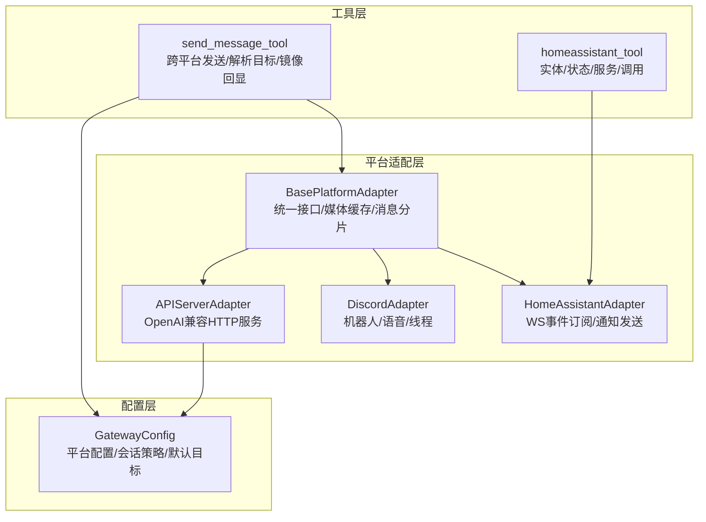
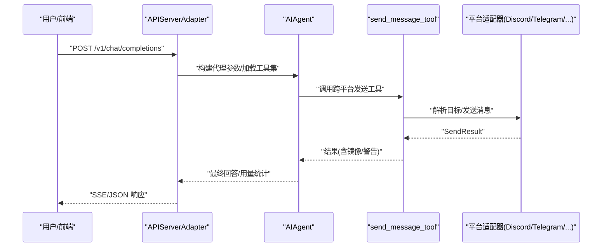
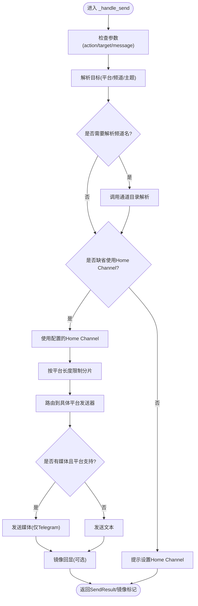
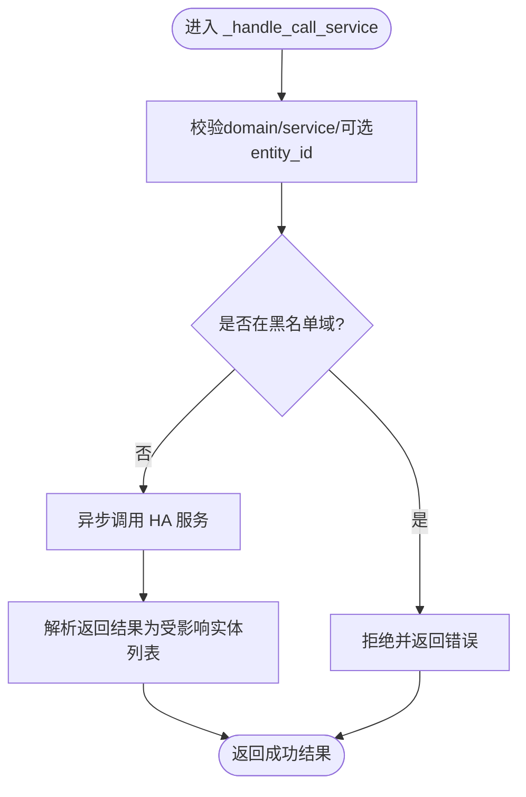
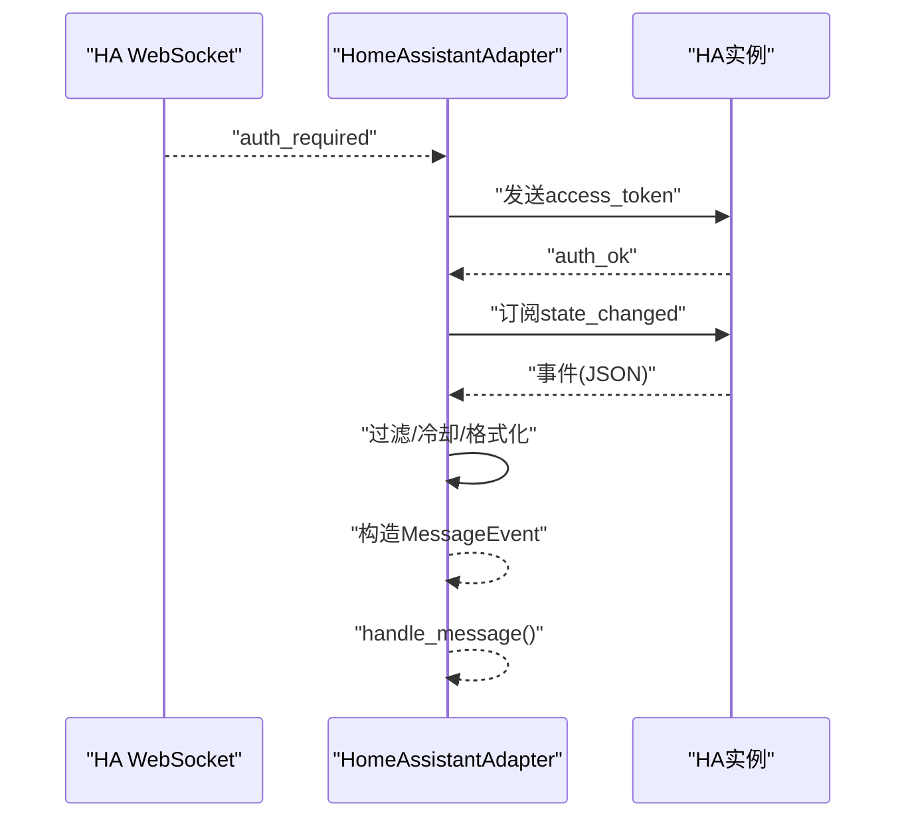
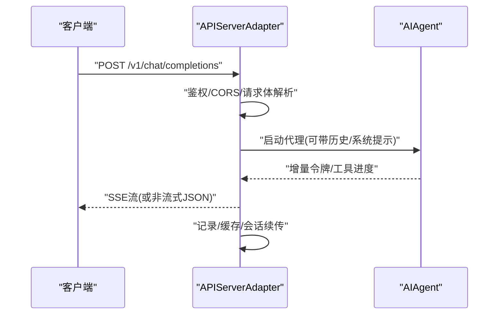
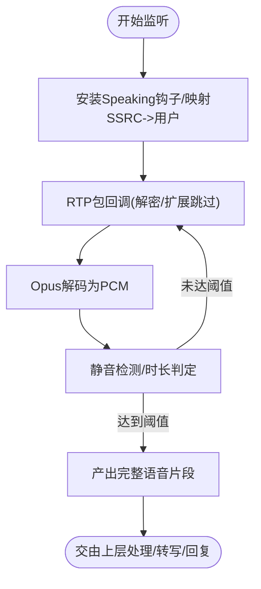
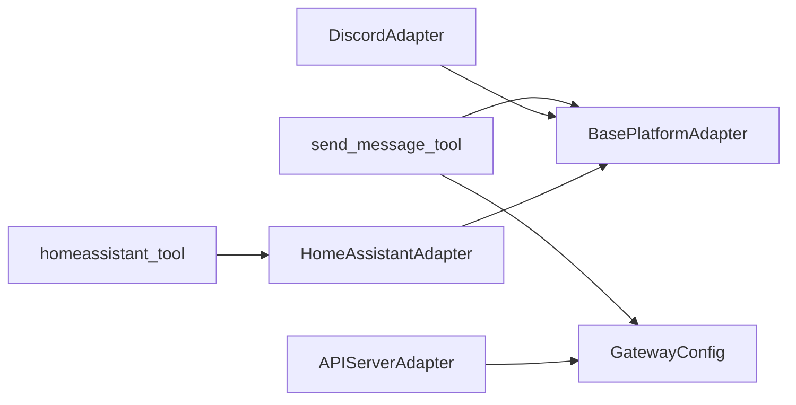

# 通信工具

<cite>
**本文引用的文件**
- [gateway/platforms/base.py](file://gateway/platforms/base.py)
- [gateway/platforms/api_server.py](file://gateway/platforms/api_server.py)
- [gateway/platforms/discord.py](file://gateway/platforms/discord.py)
- [gateway/platforms/homeassistant.py](file://gateway/platforms/homeassistant.py)
- [gateway/config.py](file://gateway/config.py)
- [tools/send_message_tool.py](file://tools/send_message_tool.py)
- [tools/homeassistant_tool.py](file://tools/homeassistant_tool.py)
</cite>

## 目录
1. [简介](#简介)
2. [项目结构](#项目结构)
3. [核心组件](#核心组件)
4. [架构总览](#架构总览)
5. [详细组件分析](#详细组件分析)
6. [依赖分析](#依赖分析)
7. [性能考量](#性能考量)
8. [故障排除指南](#故障排除指南)
9. [结论](#结论)
10. [附录](#附录)

## 简介
本指南聚焦于 Hermes Agent 的“通信工具”，涵盖两类关键能力：
- 消息发送工具：跨平台（如 Telegram、Discord、Slack、WhatsApp、Signal、Matrix、Mattermost、飞书、企业微信、邮件、短信、Webhook、Home Assistant 等）统一发送消息与媒体的能力，并支持列出可用目标、解析频道名、镜像回显到会话等。
- 家庭自动化工具：通过 Home Assistant 平台适配器与 REST API 工具，实现设备实体查询、状态获取、服务列表与调用，用于智能家庭控制。

文档将从架构、数据流、处理逻辑、集成点、安全与可靠性、性能与监控等方面，给出可操作的配置示例、使用场景与排障建议。

## 项目结构
围绕通信工具的关键模块如下：
- 平台适配层：定义统一接口与通用能力（媒体缓存、消息分片、格式化、类型枚举等），各平台（如 Discord、API Server、Home Assistant）在此基础上实现连接、接收、发送与事件处理。
- 工具层：封装对外可调用的工具函数，如跨平台发送消息、Home Assistant 实体与服务控制。
- 配置层：集中管理平台开关、凭据、默认目标、会话策略等。

图表来源
- [gateway/platforms/base.py:470-800](file://gateway/platforms/base.py#L470-L800)
- [gateway/platforms/api_server.py:285-451](file://gateway/platforms/api_server.py#L285-L451)
- [gateway/platforms/discord.py:409-800](file://gateway/platforms/discord.py#L409-L800)
- [gateway/platforms/homeassistant.py:51-450](file://gateway/platforms/homeassistant.py#L51-L450)
- [tools/send_message_tool.py:80-410](file://tools/send_message_tool.py#L80-L410)
- [tools/homeassistant_tool.py:31-491](file://tools/homeassistant_tool.py#L31-L491)
- [gateway/config.py:415-662](file://gateway/config.py#L415-L662)

章节来源
- [gateway/platforms/base.py:1-800](file://gateway/platforms/base.py#L1-L800)
- [gateway/platforms/api_server.py:1-800](file://gateway/platforms/api_server.py#L1-L800)
- [gateway/platforms/discord.py:1-800](file://gateway/platforms/discord.py#L1-L800)
- [gateway/platforms/homeassistant.py:1-450](file://gateway/platforms/homeassistant.py#L1-L450)
- [tools/send_message_tool.py:1-953](file://tools/send_message_tool.py#L1-L953)
- [tools/homeassistant_tool.py:1-491](file://tools/homeassistant_tool.py#L1-L491)
- [gateway/config.py:1-958](file://gateway/config.py#L1-L958)

## 核心组件
- 基类与通用能力
  - 统一接口：connect/disconnect/send/edit_message/send_typing/play_tts 等。
  - 媒体缓存：图片/音频/文档本地缓存，避免平台临时链接失效；支持从 URL 下载并重试。
  - 消息分片：按平台最大长度拆分长文本，保留代码块边界与分段提示。
  - 类型与事件：MessageEvent/MessageType/SendResult，标准化输入输出。
- 平台适配器
  - API Server：暴露 OpenAI 兼容端点，支持 SSE 流式响应、会话续传、幂等请求、CORS/安全头、SQLite 响应存储。
  - Discord：基于 discord.py 的机器人，支持语音包解密/Opus 解码、静音检测、线程自动建模、反应反馈、按钮审批等。
  - Home Assistant：WebSocket 认证订阅 state_changed 事件，过滤与冷却去抖；REST 发送持久通知。
- 工具
  - send_message_tool：跨平台发送、列出目标、解析目标、镜像回显、媒体清理、防重复投递（与计划任务协同）。
  - homeassistant_tool：实体/状态/服务查询与调用，带黑名单域与实体格式校验、异步 REST 调用、错误归一化。

章节来源
- [gateway/platforms/base.py:367-800](file://gateway/platforms/base.py#L367-L800)
- [gateway/platforms/api_server.py:285-760](file://gateway/platforms/api_server.py#L285-L760)
- [gateway/platforms/discord.py:409-800](file://gateway/platforms/discord.py#L409-L800)
- [gateway/platforms/homeassistant.py:51-450](file://gateway/platforms/homeassistant.py#L51-L450)
- [tools/send_message_tool.py:80-410](file://tools/send_message_tool.py#L80-L410)
- [tools/homeassistant_tool.py:31-491](file://tools/homeassistant_tool.py#L31-L491)

## 架构总览
下图展示从用户意图到平台交互与返回的总体流程，以及工具与平台适配器之间的协作关系。

图表来源
- [gateway/platforms/api_server.py:482-760](file://gateway/platforms/api_server.py#L482-L760)
- [tools/send_message_tool.py:302-410](file://tools/send_message_tool.py#L302-L410)
- [gateway/platforms/discord.py:750-800](file://gateway/platforms/discord.py#L750-L800)
- [gateway/platforms/base.py:612-632](file://gateway/platforms/base.py#L612-L632)

## 详细组件分析

### 消息发送工具（send_message_tool）
- 功能要点
  - 支持平台：Telegram、Discord、Slack、WhatsApp、Signal、Matrix、Mattermost、Home Assistant、钉钉、飞书、企业微信、邮件、短信等。
  - 目标解析：支持“平台:频道名/ID/主题”格式，必要时先列出可用目标再解析。
  - 媒体处理：提取消息中的媒体标签，清理 Markdown/HTML，对 Telegram 支持原生媒体发送。
  - 分片与长度限制：按平台最大长度拆分，保留代码块边界与分段提示。
  - 镜像回显：将发送内容镜像到目标会话，便于审计与一致性。
  - 防重复：与计划任务协同，避免同一目标重复投递。
  - 错误与脱敏：标准化错误返回，脱敏敏感信息（如 token、密钥）。
- 使用场景
  - 通过 CLI 或网关工具向任意已配置平台发送消息或媒体。
  - 在自动化任务中定向投递报告至指定频道。
  - 将模型生成内容镜像到目标会话，形成闭环。
- 关键流程（发送路径）

图表来源
- [tools/send_message_tool.py:99-221](file://tools/send_message_tool.py#L99-L221)
- [tools/send_message_tool.py:302-410](file://tools/send_message_tool.py#L302-L410)
- [gateway/platforms/base.py:706-752](file://gateway/platforms/base.py#L706-L752)

章节来源
- [tools/send_message_tool.py:80-953](file://tools/send_message_tool.py#L80-L953)
- [gateway/platforms/base.py:706-800](file://gateway/platforms/base.py#L706-L800)

### 家庭自动化工具（homeassistant_tool）
- 功能要点
  - 实体查询：按域/区域过滤，返回实体清单摘要。
  - 状态查询：获取单个实体的详细状态与属性。
  - 服务查询：列出域内可用服务及字段说明。
  - 服务调用：调用 HA 服务（如 turn_on/toggle/set_temperature 等），带实体 ID 与参数。
  - 安全限制：内置黑名单域（如 shell_command、python_script 等），防止危险命令执行。
  - 异步 REST：统一使用 aiohttp 进行 REST 请求，超时与错误处理。
- 使用场景
  - 查询客厅灯/恒温器状态，再调用服务改变其状态。
  - 列出可用服务以发现控制方式。
  - 在自动化脚本中远程控制智能设备。
- 关键流程（服务调用）

图表来源
- [tools/homeassistant_tool.py:242-265](file://tools/homeassistant_tool.py#L242-L265)
- [tools/homeassistant_tool.py:168-191](file://tools/homeassistant_tool.py#L168-L191)

章节来源
- [tools/homeassistant_tool.py:1-491](file://tools/homeassistant_tool.py#L1-L491)

### Home Assistant 平台适配器（HomeAssistantAdapter）
- 功能要点
  - WebSocket 认证：按 HA 协议顺序完成 auth_required/auth/auth_ok 订阅 state_changed。
  - 事件过滤：支持按域/实体白名单/全局开关 watch_all，配合冷却时间去抖。
  - 文本格式化：将 state_changed 事件转为人类可读描述（不同域差异化格式）。
  - 出站通知：通过 REST API 发送持久通知，避免与事件监听竞争。
  - 自动重连：指数退避重连，异常时清理资源。
- 使用场景
  - 将 HA 设备状态变化实时推送到聊天通道。
  - 通过 REST API 向 Home Assistant 发送通知。
- 关键流程（事件处理）

图表来源
- [gateway/platforms/homeassistant.py:140-185](file://gateway/platforms/homeassistant.py#L140-L185)
- [gateway/platforms/homeassistant.py:262-318](file://gateway/platforms/homeassistant.py#L262-L318)

章节来源
- [gateway/platforms/homeassistant.py:1-450](file://gateway/platforms/homeassistant.py#L1-L450)

### API Server 平台适配器（APIServerAdapter）
- 功能要点
  - OpenAI 兼容端点：/v1/chat/completions、/v1/responses、/v1/models、/v1/runs 等。
  - SSE 流式：将代理生成令牌增量写入 SSE，支持客户端断开中断。
  - 会话续传：通过 X-Hermes-Session-Id 从 state.db 加载历史。
  - 幂等：基于 Idempotency-Key 与指纹缓存避免重复计算。
  - CORS/安全头：中间件注入 CORS 与安全响应头。
  - SQLite 响应存储：Responses API 的 LRU 存储，支持会话映射。
- 使用场景
  - 作为 Open WebUI/LobeChat 等前端的后端，提供统一的聊天与响应接口。
  - 与外部系统通过标准 OpenAI 接口对接。
- 关键流程（聊天补全）

图表来源
- [gateway/platforms/api_server.py:482-760](file://gateway/platforms/api_server.py#L482-L760)
- [gateway/platforms/api_server.py:285-451](file://gateway/platforms/api_server.py#L285-L451)

章节来源
- [gateway/platforms/api_server.py:1-800](file://gateway/platforms/api_server.py#L1-L800)

### Discord 平台适配器（DiscordAdapter）
- 功能要点
  - 机器人接入：基于 discord.py，支持消息接收、回复、线程、反应反馈。
  - 语音处理：捕获 RTP 包，NaCl + DAVE 解密，Opus 解码，静音检测，PCM 转换。
  - 安全与合规：允许/忽略其他机器人消息、提及过滤、去重缓存。
- 使用场景
  - 在服务器/私聊中接收消息并自动回复。
  - 语音输入转文字与后续处理。
- 关键流程（语音接收）

图表来源
- [gateway/platforms/discord.py:83-374](file://gateway/platforms/discord.py#L83-L374)

章节来源
- [gateway/platforms/discord.py:1-800](file://gateway/platforms/discord.py#L1-L800)

## 依赖分析
- 组件耦合
  - send_message_tool 依赖 gateway.config 与各平台适配器的公共能力（消息分片、媒体提取、镜像回显）。
  - homeassistant_tool 依赖 HA REST API，内部进行实体格式校验与黑名单过滤。
  - 平台适配器（API Server、Discord、Home Assistant）均继承自 BasePlatformAdapter，共享媒体缓存与消息分片逻辑。
- 外部依赖
  - aiohttp/aiohttp.web：HTTP/WS 客户端与服务端。
  - discord.py：Discord 机器人功能。
  - httpx/httpx.AsyncClient：安全 URL 下载与异步 HTTP。
  - sqlite3：Responses API 的 LRU 存储。
- 可能的循环依赖
  - 工具与适配器之间为单向依赖（工具调用适配器），未见循环导入迹象。
- 配置与环境变量
  - 平台凭据与默认目标通过 GatewayConfig 与环境变量注入。
  - HA 依赖 HASS_TOKEN/HASS_URL；API Server 可配置 API 密钥与 CORS；Discord/Matrix/Signal 等均有对应环境变量。

图表来源
- [tools/send_message_tool.py:140-220](file://tools/send_message_tool.py#L140-L220)
- [tools/homeassistant_tool.py:31-61](file://tools/homeassistant_tool.py#L31-L61)
- [gateway/platforms/api_server.py:285-311](file://gateway/platforms/api_server.py#L285-L311)
- [gateway/platforms/discord.py:409-450](file://gateway/platforms/discord.py#L409-L450)
- [gateway/platforms/homeassistant.py:51-90](file://gateway/platforms/homeassistant.py#L51-L90)
- [gateway/config.py:415-662](file://gateway/config.py#L415-L662)

章节来源
- [gateway/config.py:1-958](file://gateway/config.py#L1-L958)
- [gateway/platforms/base.py:1-800](file://gateway/platforms/base.py#L1-L800)

## 性能考量
- 消息分片与传输
  - 对长文本按平台最大长度拆分，减少单次失败概率；Telegram 支持媒体原生发送，其他平台会丢弃媒体并给出警告。
- 媒体缓存与下载
  - 图片/音频/文档本地缓存，支持重试与 SSRF 保护；URL 下载采用异步客户端与指数退避。
- SSE 流式与中断
  - 客户端断开时中断代理任务，避免无效调用；使用队列与事件协调增量输出。
- 语音处理
  - RTP 包解密/解码与静音检测，避免无效音频占用资源；静默阈值与最小语音时长可调。
- 幂等与缓存
  - API Server 对相同请求指纹进行缓存，降低重复计算成本。

章节来源
- [gateway/platforms/base.py:113-170](file://gateway/platforms/base.py#L113-L170)
- [gateway/platforms/api_server.py:247-283](file://gateway/platforms/api_server.py#L247-L283)
- [gateway/platforms/discord.py:83-374](file://gateway/platforms/discord.py#L83-L374)

## 故障排除指南
- 平台连接问题
  - 缺少依赖：确保安装对应平台库（如 discord.py、aiohttp、httpx 等）。
  - 凭据缺失：检查环境变量（如 TELEGRAM_BOT_TOKEN、DISCORD_BOT_TOKEN、HASS_TOKEN、HASS_URL 等）。
  - 重复令牌占用：Discord 适配器对令牌加锁，若冲突需停止已有进程。
- API Server
  - 鉴权失败：确认 API 密钥配置与 Authorization 头一致。
  - CORS/安全头：检查 CORS 来源配置与浏览器预检。
  - SSE 断开：客户端断开会触发中断与任务取消，属预期行为。
- Home Assistant
  - WebSocket 认证失败：确认 access_token 与 HA 地址；检查订阅是否成功。
  - 事件风暴：启用 watch_domains/watch_entities/watch_all 并设置冷却时间。
- send_message_tool
  - 目标解析失败：先调用 list 获取可用目标，再按 ID/名称发送。
  - 媒体发送限制：当前仅 Telegram 支持原生媒体，其他平台会丢弃媒体并提示。
  - 镜像回显：若未生效，检查会话平台标签与镜像函数调用。
- homeassistant_tool
  - 黑名单域被拒：避免调用 shell_command、python_script 等高危域。
  - 实体 ID 格式错误：确保形如 domain.entity_id。
  - REST 调用失败：检查 HASS_TOKEN/HASS_URL 与网络可达性。

章节来源
- [gateway/platforms/discord.py:494-504](file://gateway/platforms/discord.py#L494-L504)
- [gateway/platforms/api_server.py:361-380](file://gateway/platforms/api_server.py#L361-L380)
- [gateway/platforms/homeassistant.py:101-138](file://gateway/platforms/homeassistant.py#L101-L138)
- [tools/send_message_tool.py:165-220](file://tools/send_message_tool.py#L165-L220)
- [tools/homeassistant_tool.py:249-253](file://tools/homeassistant_tool.py#L249-L253)

## 结论
Hermes Agent 的通信工具体系以“统一基类 + 平台适配器 + 工具函数”的分层设计实现跨平台消息传递与家庭自动化控制。通过严格的媒体缓存、消息分片、鉴权与安全头策略，以及 SSE 流式与幂等缓存等机制，既保证了可靠性也兼顾了性能。结合配置层的灵活注入与环境变量覆盖，用户可在多种外部系统间稳定地进行交互与集成。

## 附录
- 配置示例（环境变量）
  - Home Assistant：HASS_TOKEN、HASS_URL
  - API Server：API_SERVER_KEY、API_SERVER_CORS_ORIGINS、API_SERVER_HOST、API_SERVER_PORT
  - Discord：DISCORD_BOT_TOKEN、DISCORD_REQUIRE_MENTION、DISCORD_FREE_RESPONSE_CHANNELS、DISCORD_AUTO_THREAD、DISCORD_REACTIONS、DISCORD_IGNORED_CHANNELS、DISCORD_NO_THREAD_CHANNELS
  - Signal：SIGNAL_HTTP_URL、SIGNAL_ACCOUNT
  - Matrix：MATRIX_ACCESS_TOKEN、MATRIX_HOMESERVER、MATRIX_USER_ID、MATRIX_PASSWORD、MATRIX_ENCRYPTION、MATRIX_DEVICE_ID
  - Twilio（短信）：TWILIO_ACCOUNT_SID、TWILIO_AUTH_TOKEN、TWILIO_PHONE_NUMBER
  - 邮件：EMAIL_ADDRESS、EMAIL_PASSWORD、EMAIL_SMTP_HOST、EMAIL_SMTP_PORT
- 使用场景速查
  - 跨平台发送：send_message(action='send', target='telegram:123456789', message='Hello')
  - 列出目标：send_message(action='list')
  - HA 控制：ha_list_entities(domain='light') → ha_call_service(domain='light', service='turn_on', entity_id='light.living_room')

章节来源
- [gateway/config.py:665-800](file://gateway/config.py#L665-L800)
- [tools/send_message_tool.py:48-77](file://tools/send_message_tool.py#L48-L77)
- [tools/homeassistant_tool.py:330-447](file://tools/homeassistant_tool.py#L330-L447)