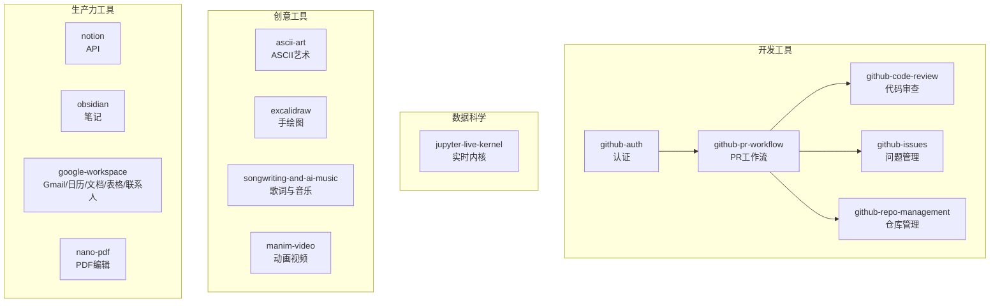
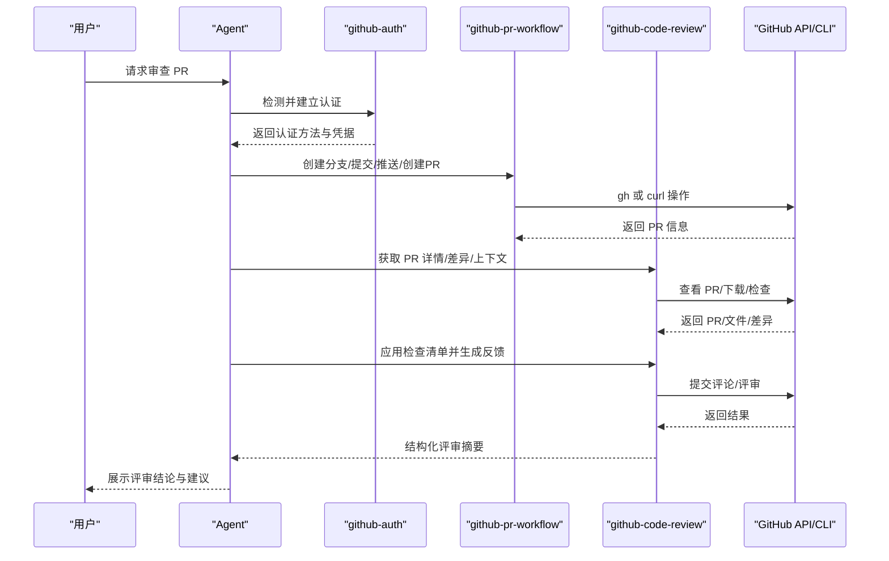
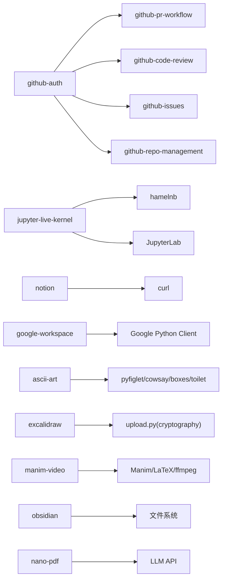

# 内置技能

<cite>
**本文引用的文件**
- [SKILL.md](file://skills/github/github-code-review/SKILL.md)
- [SKILL.md](file://skills/github/github-pr-workflow/SKILL.md)
- [SKILL.md](file://skills/github/github-auth/SKILL.md)
- [SKILL.md](file://skills/github/github-issues/SKILL.md)
- [SKILL.md](file://skills/github/github-repo-management/SKILL.md)
- [SKILL.md](file://skills/data-science/jupyter-live-kernel/SKILL.md)
- [SKILL.md](file://skills/creative/ascii-art/SKILL.md)
- [SKILL.md](file://skills/creative/excalidraw/SKILL.md)
- [SKILL.md](file://skills/creative/songwriting-and-ai-music/SKILL.md)
- [SKILL.md](file://skills/creative/manim-video/SKILL.md)
- [SKILL.md](file://skills/productivity/nano-pdf/SKILL.md)
- [SKILL.md](file://skills/productivity/notion/SKILL.md)
- [SKILL.md](file://skills/note-taking/obsidian/SKILL.md)
- [SKILL.md](file://skills/productivity/google-workspace/SKILL.md)
- [DESCRIPTION.md](file://skills/data-science/DESCRIPTION.md)
- [DESCRIPTION.md](file://skills/github/DESCRIPTION.md)
- [DESCRIPTION.md](file://skills/creative/DESCRIPTION.md)
</cite>

## 目录
1. [简介](#简介)
2. [项目结构](#项目结构)
3. [核心组件](#核心组件)
4. [架构总览](#架构总览)
5. [详细组件分析](#详细组件分析)
6. [依赖分析](#依赖分析)
7. [性能考量](#性能考量)
8. [故障排除指南](#故障排除指南)
9. [结论](#结论)
10. [附录](#附录)

## 简介
本指南系统梳理 Hermes Agent 的内置技能，覆盖开发工具、数据科学、创意工具与生产力工具四大类别，帮助用户理解每个技能的用途、参数、输出与最佳实践，并提供组合使用策略、限制与注意事项以及常见问题排查建议。文档以“技能即能力”的视角组织内容，既适合快速上手，也便于深入掌握。

## 项目结构
内置技能主要位于仓库的 skills 目录下，按功能域分组：
- 开发工具：GitHub 系列（认证、PR 工作流、代码审查、仓库管理、问题管理）
- 数据科学：Jupyter 实时内核
- 创意工具：ASCII 艺术、Excalidraw 手绘图、AI 歌词与音乐生成、Manim 视频管线
- 生产力工具：Notion API、Obsidian 笔记、Google Workspace（Gmail/日历/文档/表格/联系人）、PDF 编辑（nano-pdf）

图表来源
- [SKILL.md](file://skills/github/github-auth/SKILL.md)
- [SKILL.md](file://skills/github/github-pr-workflow/SKILL.md)
- [SKILL.md](file://skills/github/github-code-review/SKILL.md)
- [SKILL.md](file://skills/github/github-issues/SKILL.md)
- [SKILL.md](file://skills/github/github-repo-management/SKILL.md)
- [SKILL.md](file://skills/data-science/jupyter-live-kernel/SKILL.md)
- [SKILL.md](file://skills/creative/ascii-art/SKILL.md)
- [SKILL.md](file://skills/creative/excalidraw/SKILL.md)
- [SKILL.md](file://skills/creative/songwriting-and-ai-music/SKILL.md)
- [SKILL.md](file://skills/creative/manim-video/SKILL.md)
- [SKILL.md](file://skills/productivity/notion/SKILL.md)
- [SKILL.md](file://skills/note-taking/obsidian/SKILL.md)
- [SKILL.md](file://skills/productivity/google-workspace/SKILL.md)
- [SKILL.md](file://skills/productivity/nano-pdf/SKILL.md)

章节来源
- [DESCRIPTION.md](file://skills/github/DESCRIPTION.md)
- [DESCRIPTION.md](file://skills/data-science/DESCRIPTION.md)
- [DESCRIPTION.md](file://skills/creative/DESCRIPTION.md)

## 核心组件
- GitHub 认证（github-auth）：提供自动检测与切换 git/gh 的认证路径，支持 HTTPS 令牌与 SSH，覆盖凭据缓存、多账户与无安装场景。
- GitHub PR 工作流（github-pr-workflow）：从分支创建、提交、推送、创建 PR、监控 CI、自动修复失败到合并的完整生命周期，同时提供 git+curl 回退方案。
- 代码审查（github-code-review）：本地预推与 PR 在线审查双模式，提供检查清单、结构化反馈格式与评论/评审提交流程。
- 问题管理（github-issues）：创建、搜索、标注、指派、评论、关闭/重开、链接 PR 的全量操作，支持 gh 与 curl 双通道。
- 仓库管理（github-repo-management）：克隆/创建/分叉/配置/设置/保护/密钥/发布/工作流/速记等，覆盖 gh 与 curl。
- Jupyter 实时内核（jupyter-live-kernel）：通过 hamelnb 提供状态持久化的 Python REPL，适合探索式迭代、中间态检查与逐步构建。
- ASCII 艺术（ascii-art）：本地 pyfiglet、远程 asciified、cowsay、boxes、toilet、图像转 ASCII、预设搜索与 LLM 备选。
- Excalidraw 手绘图（excalidraw）：以标准 JSON 元素生成 .excalidraw 文件，可上传分享或在网站打开。
- AI 歌词与音乐（songwriting-and-ai-music）：结构设计、韵律节奏、情感弧线、Suno 提示工程与元标签体系。
- Manim 视频管线（manim-video）：数学/算法/架构可视化动画的完整生产流程，强调创意标准、色彩与排版规范。
- Notion API（notion）：基于 curl 的页面/数据库/块 CRUD 与查询，强调版本头与属性类型。
- Obsidian 笔记（obsidian）：通过环境变量定位金库，提供读取、列表、搜索、创建与追加。
- Google Workspace（google-workspace）：OAuth2 驱动的 Gmail/日历/文档/表格/联系人集成，含非交互式设置脚本与规则。
- PDF 编辑（nano-pdf）：自然语言指令修改 PDF 文本、标题与内容页，强调验证与 LLM 依赖。

章节来源
- [SKILL.md](file://skills/github/github-auth/SKILL.md)
- [SKILL.md](file://skills/github/github-pr-workflow/SKILL.md)
- [SKILL.md](file://skills/github/github-code-review/SKILL.md)
- [SKILL.md](file://skills/github/github-issues/SKILL.md)
- [SKILL.md](file://skills/github/github-repo-management/SKILL.md)
- [SKILL.md](file://skills/data-science/jupyter-live-kernel/SKILL.md)
- [SKILL.md](file://skills/creative/ascii-art/SKILL.md)
- [SKILL.md](file://skills/creative/excalidraw/SKILL.md)
- [SKILL.md](file://skills/creative/songwriting-and-ai-music/SKILL.md)
- [SKILL.md](file://skills/creative/manim-video/SKILL.md)
- [SKILL.md](file://skills/productivity/notion/SKILL.md)
- [SKILL.md](file://skills/note-taking/obsidian/SKILL.md)
- [SKILL.md](file://skills/productivity/google-workspace/SKILL.md)
- [SKILL.md](file://skills/productivity/nano-pdf/SKILL.md)

## 架构总览
以下序列图展示典型“PR 审查”工作流中各技能的协作关系与调用顺序。

图表来源
- [SKILL.md](file://skills/github/github-auth/SKILL.md)
- [SKILL.md](file://skills/github/github-pr-workflow/SKILL.md)
- [SKILL.md](file://skills/github/github-code-review/SKILL.md)

## 详细组件分析

### GitHub 认证（github-auth）
- 用途：为后续 GitHub 技能提供统一认证入口，自动选择 gh 或 git+curl 方案。
- 支持参数与环境：
  - 自动检测：git 版本、gh 是否可用、gh 认证状态、git 凭据助手。
  - 令牌来源：环境变量、~/.git-credentials、~/.hermes/.env。
  - SSH：公私钥生成、添加到 GitHub、重写 URL。
- 输出：成功后返回 AUTH_METHOD=gh 或 curl，后续技能可直接复用。
- 最佳实践：
  - 优先使用 gh；若不可用，确保 GITHUB_TOKEN 设置正确。
  - 使用 credential.helper 存储或缓存，避免重复输入。
- 限制与注意事项：
  - 若使用 HTTPS 密码认证，需改用个人访问令牌。
  - SSH 连接失败时，可尝试端口与主机别名配置。
- 故障排除：
  - 权限不足：确认 token scopes 包含 repo/workflow。
  - 凭据未持久：检查 credential.helper 配置。
  - 多账户冲突：使用不同 SSH 密钥或 per-repo URL。

章节来源
- [SKILL.md](file://skills/github/github-auth/SKILL.md)

### GitHub PR 工作流（github-pr-workflow）
- 用途：自动化 PR 生命周期，从分支到合并，支持 CI 监控与自动修复。
- 支持参数与环境：
  - 分支命名约定：feat/fix/refactor/docs/ci。
  - 提交消息：Conventional Commits 类型与格式。
  - PR 创建：标题、正文、标签、审阅者、草稿等。
  - CI 监控：gh pr checks 或 curl 查询状态/检查运行。
  - 合并：squash/rebase/merge，删除分支。
- 输出：PR 编号、CI 状态、合并结果。
- 最佳实践：
  - 先在本地验证测试与静态检查再推送。
  - CI 失败时，遵循“诊断-修复-推送-再检查”的循环。
  - 使用 auto-merge 前确保仓库已启用。
- 限制与注意事项：
  - 需要仓库权限与正确的 token scopes。
  - curl 回退需要手动解析 owner/repo 与 token。
- 故障排除：
  - CI 失败：使用 run view/log-failed 定位错误，修复后再次检查。
  - 合并冲突：先同步主干，再解决冲突并重新推送。

章节来源
- [SKILL.md](file://skills/github/github-pr-workflow/SKILL.md)

### 代码审查（github-code-review）
- 用途：本地预推审查与 PR 在线审查，提供结构化反馈模板。
- 支持参数与环境：
  - 本地：git diff/stat/log 等命令组合。
  - PR：gh 或 curl 获取 PR 详情、文件列表、差异。
  - 评论：通用评论与行内评论，支持批量评审。
  - 输出：Critical/Warnings/Suggestions/Looks Good 结构化摘要。
- 输出：评审总结、建议与结论。
- 最佳实践：
  - 先看统计与提交历史，再逐文件审查。
  - 使用检查清单覆盖正确性、安全、质量、测试、性能、文档。
  - 行内评论指向具体文件行，必要时使用 RIGHT/LEFT side。
- 限制与注意事项：
  - 评审结论需结合上下文，避免阻塞性建议过多。
  - 注意 PR 基准分支与 head SHA。
- 故障排除：
  - 无法获取 PR 详情：确认 token 与 scopes。
  - 评论失败：检查路径与行号是否匹配新版本文件。

章节来源
- [SKILL.md](file://skills/github/github-code-review/SKILL.md)

### GitHub 问题管理（github-issues）
- 用途：创建、搜索、标注、指派、评论、关闭/重开与链接 PR。
- 支持参数与环境：
  - 列表/视图/搜索：状态、标签、指派人、关键词。
  - 创建：标题、正文、标签、指派人。
  - 管理：增删标签、指派、评论、关闭/重开。
  - 链接：PR 关键字自动关闭。
- 输出：问题编号、状态、标签、评论与日志。
- 最佳实践：
  - 统一标签与优先级，明确 triage 流程。
  - 对复杂问题提供最小复现步骤与期望/实际行为。
- 限制与注意事项：
  - PR 也会出现在 /issues 接口中，注意过滤。
  - 批量操作需配合脚本循环处理。
- 故障排除：
  - 权限不足：确认 token scopes 与仓库权限。
  - 搜索无结果：检查查询语法与仓库可见性。

章节来源
- [SKILL.md](file://skills/github/github-issues/SKILL.md)

### GitHub 仓库管理（github-repo-management）
- 用途：克隆/创建/分叉/配置/设置/保护/密钥/发布/工作流/速记。
- 支持参数与环境：
  - 克隆：HTTPS/SSH/浅克隆/指定分支。
  - 创建：公开/私有、描述、许可证、组织归属。
  - 分叉：创建并添加上游，保持同步。
  - 设置：描述、可见性、wiki、默认分支、主题。
  - 密钥：Actions 秘密加密存储与管理。
  - 发布：草稿/预发布/附件上传。
  - 工作流：列出/查看/触发/重跑。
- 输出：仓库信息、密钥列表、发布信息、工作流运行。
- 最佳实践：
  - 分叉后定期同步上游，减少合并成本。
  - 使用模板仓库初始化新项目。
- 限制与注意事项：
  - 秘密设置 via API 需要公钥加密，推荐使用 gh。
  - 发布资产上传需使用上传端点与正确 MIME 类型。
- 故障排除：
  - 无法创建/分叉：确认 token scopes 与组织策略。
  - 无法设置密钥：检查公钥获取与加密流程。

章节来源
- [SKILL.md](file://skills/github/github-repo-management/SKILL.md)

### Jupyter 实时内核（jupyter-live-kernel）
- 用途：提供状态持久化的 Python REPL，适合探索式迭代与中间态检查。
- 支持参数与环境：
  - 依赖：uv、JupyterLab、hamelnb。
  - 服务器发现：servers、notebooks。
  - 执行：execute（支持多行与 --compact）。
  - 变量：list/preview。
  - 编辑：contents、insert/replace/delete。
  - 验证：restart-run-all。
  - 超时：默认 30 秒，长任务可增加。
- 输出：JSON 结果（含 traceback 字段），支持紧凑输出节省 token。
- 最佳实践：
  - 首次执行可能超时，重试一次。
  - 仅在需要时使用 restart-run-all，避免破坏状态。
- 限制与注意事项：
  - 需要在 JupyterLab 环境安装所需包。
  - 参数顺序严格，子命令标志在子子命令前。
- 故障排除：
  - 会话不存在：先通过 REST API 创建会话。
  - 错误返回 JSON：读取 ename/evalue 字段定位问题。

章节来源
- [SKILL.md](file://skills/data-science/jupyter-live-kernel/SKILL.md)

### ASCII 艺术（ascii-art）
- 用途：多种 ASCII 艺术生成方式，覆盖文本横幅、消息气泡、装饰边框、彩色效果、图像转 ASCII、预设搜索与 LLM 备选。
- 支持参数与环境：
  - pyfiglet：字体列表、宽度、样式。
  - asciified API：远程接口，无需安装。
  - cowsay：角色列表、表情/舌头修饰。
  - boxes：边框样式、对齐。
  - toilet：彩色与滤镜效果。
  - 图像转 ASCII：ascii-image-converter/jp2a。
  - 预设搜索：ascii.co.uk 主题分类。
  - LLM 备选：Unicode 字符集与尺寸约束。
- 输出：纯文本 ASCII 艺术，部分工具输出 ANSI 颜色。
- 最佳实践：
  - 先预览 2-3 种字体/样式，让用户选择。
  - 图像转 ASCII 时控制尺寸与颜色开关。
- 限制与注意事项：
  - toilet 输出 ANSI 码，渲染依赖终端。
  - 预设搜索需解析 HTML，注意签名保留礼仪。
- 故障排除：
  - 工具未安装：按需安装对应程序或回退到替代方案。

章节来源
- [SKILL.md](file://skills/creative/ascii-art/SKILL.md)

### Excalidraw 手绘图（excalidraw）
- 用途：生成 .excalidraw 文件，支持上传分享链接，适合架构图、流程图、序列图等。
- 支持参数与环境：
  - 元素格式：type/id/x/y/width/height 等。
  - 默认样式：笔触/背景/填充/透明度/粗糙度。
  - 标签绑定：容器绑定实现形状与文本互相关联。
  - 箭头连接：startBinding/endBinding 指定固定点。
  - 绘制顺序：z-order 重要，先背景再前景。
  - 尺寸与字体：最小字号与元素尺寸建议。
  - 颜色：提供常用配色表。
- 输出：标准 Excalidraw JSON 文件，可上传分享。
- 最佳实践：
  - 使用容器绑定而非 label 字段。
  - 文本对比度足够，避免浅灰配白色背景。
- 限制与注意事项：
  - 不要在文本中使用表情符号。
  - 上传脚本依赖 cryptography。
- 故障排除：
  - 无法上传：检查 cryptography 安装与网络。
  - 文本不显示：确认 containerId 与 originalText 一致。

章节来源
- [SKILL.md](file://skills/creative/excalidraw/SKILL.md)

### AI 歌词与音乐（songwriting-and-ai-music）
- 用途：提供歌曲结构、韵律节奏、情感弧线、Suno 提示工程与元标签体系。
- 支持参数与环境：
  - 结构：ABAB、AABA、AAA 等骨架，标注各段落功能。
  - 韵律：完美/家族/内韵/近韵等类型混合使用。
  - 动态：对比技巧、静默作为乐器。
  - 歌词：展示优于叙述、钩子位置、押韵与节奏适配。
  - 并且：保留原作某些元素增强识别度。
  - Suno：风格描述字段（风格/情绪/时代/乐器/人声/制作/动态）。
  - 元标签：结构/表演/动态/性别/氛围/SFX 等，置于歌词字段中。
- 输出：歌词草稿、风格描述、元标签集合。
- 最佳实践：
  - 先确定概念/钩子，再套入结构。
  - 在风格字段描述动态旅程，而非仅罗列风格。
- 限制与注意事项：
  - 避免商标化名称，描述声音而非艺术家。
  - 元标签数量适度，避免相互矛盾。
- 故障排除：
  - 生成不稳定：多轮变体比较，必要时重新表述风格。

章节来源
- [SKILL.md](file://skills/creative/songwriting-and-ai-music/SKILL.md)

### Manim 视频管线（manim-video）
- 用途：数学/算法/架构可视化动画的完整生产流程，强调创意标准与一致性。
- 支持参数与环境：
  - 创意标准：几何优先于代数、首次渲染即精品、分层透明度、留白与呼吸感、视觉语言统一。
  - 模式：概念解释、方程推导、算法可视化、数据故事、架构图、论文解释、3D 可视化。
  - 工具栈：Manim、LaTeX、ffmpeg、TTS（可选）。
  - 流程：PLAN → CODE → RENDER → STITCH → AUDIO（可选）→ REVIEW。
  - 项目结构：plan.md、script.py、concat.txt、final.mp4、media/
  - 设计：配色、动画速度、字体与字号、每场景变化。
- 输出：最终视频文件与中间帧截图。
- 最佳实践：
  - 先写计划，再写代码，始终在低质量参数下迭代。
  - 使用 monospace 字体，LaTeX 使用原始字符串。
- 限制与注意事项：
  - 依赖 Python 3.10+、Manim v0.20+、LaTeX、ffmpeg。
  - 不要对未添加的对象进行动画。
- 故障排除：
  - LaTeX 错误：检查原始字符串与宏包。
  - 动画错误：检查对象生命周期与替换顺序。

章节来源
- [SKILL.md](file://skills/creative/manim-video/SKILL.md)

### Notion API（notion）
- 用途：通过 curl 直接操作 Notion 页面、数据库与块，无需额外工具。
- 支持参数与环境：
  - 基础：Authorization: Bearer $NOTION_API_KEY，Notion-Version: 2025-09-03。
  - 常用：搜索、获取页面、获取页面内容（块）、在数据库创建页面、查询数据库、创建数据库、更新页面属性、向页面添加内容。
  - 属性类型：标题、富文本、选择、多选、日期、勾选、数字、URL、邮箱、关联等。
  - 版本差异：数据库称为“数据源”，需区分 database_id 与 data_source_id。
- 输出：JSON 响应，可配合 jq 解析。
- 最佳实践：
  - 先共享目标页面/数据库给集成，再进行操作。
  - 使用 -s 抑制进度条，配合 jq 清晰输出。
- 限制与注意事项：
  - 速率限制约 3 次/秒。
  - 无法通过 API 设置数据库视图筛选。
- 故障排除：
  - 未认证：检查 NOTION_API_KEY 与版本头。
  - 权限不足：确认集成权限与共享范围。

章节来源
- [SKILL.md](file://skills/productivity/notion/SKILL.md)

### Obsidian 笔记（obsidian）
- 用途：在 Obsidian 金库中读取、列出、搜索、创建与追加笔记。
- 支持参数与环境：
  - 位置：OBSIDIAN_VAULT_PATH 环境变量，默认 ~/Documents/Obsidian Vault。
  - 操作：cat、find、ls、grep、重定向写入、追加。
- 输出：文件内容、文件列表、搜索结果。
- 最佳实践：
  - 路径含空格时务必加引号。
  - 使用 [[wikilink]] 连接相关内容。
- 限制与注意事项：
  - 依赖正确的 VAULT 路径与权限。
- 故障排除：
  - 路径错误：检查环境变量与默认值。
  - 权限不足：确认用户对金库目录的读写权限。

章节来源
- [SKILL.md](file://skills/note-taking/obsidian/SKILL.md)

### Google Workspace（google-workspace）
- 用途：Gmail/日历/文档/表格/联系人集成，基于 Python 客户端库与 OAuth2。
- 支持参数与环境：
  - 设置：非交互式 OAuth2 设置脚本，支持检查、授权 URL、交换代码、撤销。
  - 使用：GAPI 命令封装，支持搜索/读取/发送/回复、日历事件、驱动器搜索、联系人列表、表格读写与追加、文档读取。
  - 输出：JSON，包含关键字段如 id/threadId/from/labels/summary/htmlLink 等。
- 最佳实践：
  - 先检查认证状态，再执行敏感操作。
  - 遵守速率限制，避免连续快速调用。
- 限制与注意事项：
  - 需启用相应 API 并配置客户端凭证。
  - 高级保护可能阻止 OAuth，需管理员放行。
- 故障排除：
  - 未认证：重新执行设置流程。
  - 权限不足：确认 scopes 与 API 启用状态。
  - 模块缺失：运行安装依赖命令。

章节来源
- [SKILL.md](file://skills/productivity/google-workspace/SKILL.md)

### PDF 编辑（nano-pdf）
- 用途：通过自然语言指令修改 PDF 文本、标题与内容页。
- 支持参数与环境：
  - 命令：nano-pdf edit <file.pdf> <page_number> "<instruction>"。
  - 示例：修改标题、日期、客户名称等。
- 输出：修改后的 PDF 文件。
- 最佳实践：
  - 修改后验证输出（大小或打开查看）。
  - 若页码 0/1 基不同，±1 重试。
- 限制与注意事项：
  - 依赖 LLM，需配置 API Key。
  - 适合文本修改，复杂布局需其他工具。
- 故障排除：
  - 修改无效：确认页码与指令，必要时更换页面。
  - LLM 未配置：检查配置与 API Key。

章节来源
- [SKILL.md](file://skills/productivity/nano-pdf/SKILL.md)

## 依赖分析
- 技能间耦合：
  - github-auth 是大多数 GitHub 技能的前置条件。
  - github-pr-workflow 串联 github-auth、github-code-review、github-issues、github-repo-management。
  - jupyter-live-kernel 依赖 hamelnb 与 JupyterLab 环境。
  - notion 依赖 NOTION_API_KEY 与共享权限。
  - google-workspace 依赖 OAuth2 凭证与已启用的 API。
- 外部依赖：
  - GitHub：gh CLI 或 curl + 个人访问令牌。
  - ASCII：本地工具（pyfiglet/cowsay/boxes/toilet）或远程 API。
  - Excalidraw：Python 脚本上传（cryptography）。
  - Manim：Python 3.10+、Manim、LaTeX、ffmpeg。
  - Obsidian：文件系统与 VAULT 路径。
  - Notion：curl + API Key + 共享。
  - Google Workspace：Python 依赖与 Google Cloud Console 配置。
  - PDF：nano-pdf 依赖 LLM。

图表来源
- [SKILL.md](file://skills/github/github-auth/SKILL.md)
- [SKILL.md](file://skills/github/github-pr-workflow/SKILL.md)
- [SKILL.md](file://skills/github/github-code-review/SKILL.md)
- [SKILL.md](file://skills/github/github-issues/SKILL.md)
- [SKILL.md](file://skills/github/github-repo-management/SKILL.md)
- [SKILL.md](file://skills/data-science/jupyter-live-kernel/SKILL.md)
- [SKILL.md](file://skills/creative/ascii-art/SKILL.md)
- [SKILL.md](file://skills/creative/excalidraw/SKILL.md)
- [SKILL.md](file://skills/creative/manim-video/SKILL.md)
- [SKILL.md](file://skills/productivity/notion/SKILL.md)
- [SKILL.md](file://skills/note-taking/obsidian/SKILL.md)
- [SKILL.md](file://skills/productivity/google-workspace/SKILL.md)
- [SKILL.md](file://skills/productivity/nano-pdf/SKILL.md)

## 性能考量
- GitHub 技能：
  - 优先使用 gh 以减少 curl 调用次数与解析成本。
  - CI 监控采用轮询时，合理设置间隔与上限，避免过度请求。
- Jupyter 实时内核：
  - 首次启动内核可能超时，适当重试。
  - 使用 --compact 降低输出体积，节省 token。
- ASCII 艺术：
  - 图像转 ASCII 时控制分辨率与颜色，平衡质量与速度。
- Excalidraw：
  - 元素数量与层级影响渲染时间，尽量减少不必要的绑定与箭头。
- Manim：
  - 先在低质量参数下迭代，仅在最终阶段使用高质量参数。
  - 合理设置动画时长与等待时间，避免冗余渲染。
- Notion：
  - 控制并发请求，配合 jq 解析减少网络与解析开销。
- Google Workspace：
  - 遵循速率限制，批量读取优于频繁小请求。
- PDF 编辑：
  - 修改后验证输出，避免多次往返导致的性能浪费。

## 故障排除指南
- GitHub 认证：
  - 未认证：检查 gh auth status 或 GITHUB_TOKEN。
  - 权限不足：确认 scopes（repo/workflow/read:org）。
  - SSH 连接被拒：尝试端口与主机别名配置。
- PR 工作流：
  - CI 失败：使用 run view/log-failed 定位，修复后重试。
  - 合并冲突：同步主干并解决冲突。
- 代码审查：
  - 无法获取 PR：确认 token 与 owner/repo 解析。
  - 评论失败：检查路径与行号。
- ASCII 艺术：
  - 工具未安装：按需安装或回退到替代方案。
  - toilet 渲染异常：检查终端 ANSI 支持。
- Excalidraw：
  - 上传失败：检查 cryptography 安装。
  - 文本不显示：确认 containerId 与 originalText。
- Jupyter 实时内核：
  - 会话不存在：先通过 REST API 创建会话。
  - 错误返回 JSON：读取 ename/evalue 字段。
- Notion：
  - 未认证：检查 API Key 与版本头。
  - 权限不足：确认共享与集成权限。
- Google Workspace：
  - 未认证：重新执行设置流程。
  - 权限不足：确认 scopes 与 API 启用。
  - 模块缺失：运行安装依赖命令。
- PDF 编辑：
  - 修改无效：确认页码与指令，必要时更换页面。
  - LLM 未配置：检查配置与 API Key。

章节来源
- [SKILL.md](file://skills/github/github-auth/SKILL.md)
- [SKILL.md](file://skills/github/github-pr-workflow/SKILL.md)
- [SKILL.md](file://skills/github/github-code-review/SKILL.md)
- [SKILL.md](file://skills/creative/ascii-art/SKILL.md)
- [SKILL.md](file://skills/creative/excalidraw/SKILL.md)
- [SKILL.md](file://skills/data-science/jupyter-live-kernel/SKILL.md)
- [SKILL.md](file://skills/productivity/notion/SKILL.md)
- [SKILL.md](file://skills/productivity/google-workspace/SKILL.md)
- [SKILL.md](file://skills/productivity/nano-pdf/SKILL.md)

## 结论
Hermes Agent 的内置技能围绕“可组合、可回退、可扩展”的原则设计：在具备 gh CLI 时优先使用其丰富的 API 能力，在受限环境中通过 git+curl 提供等价功能；在创意与生产力领域，提供从文本到可视化的完整工具链。通过遵循本文的最佳实践与故障排除建议，用户可以高效地完成从代码审查到数据探索、从手绘图到动画视频的多样化任务。

## 附录
- 组合使用示例（思路）：
  - “请帮我写个 PR 并自动修复 CI 失败”：先加载 github-auth，再执行 github-pr-workflow，CI 失败时使用 github-code-review 诊断并修复，最后合并。
  - “需要一个概念解释视频”：Manim 视频管线 PLAN → CODE → RENDER → STITCH → AUDIO → REVIEW。
  - “在 Notion 中创建一张数据库并写入数据”：notion API 先创建数据库，再在数据库中创建页面。
  - “生成一张手绘风格的架构图并分享”：excalidraw 生成 .excalidraw 文件并通过上传脚本分享。
- 权限与资源：
  - GitHub：token scopes、SSH 密钥、gh CLI。
  - 数据科学：JupyterLab 环境、hamelnb、uv。
  - 创意工具：本地工具或远程 API、cryptography。
  - 生产力工具：API Key、共享权限、OAuth2 凭证。
- 兼容性提示：
  - 不同平台的终端与工具链差异较大，建议在本地先行验证再在远端执行。
  - 对于远程 API，注意网络延迟与超时设置。