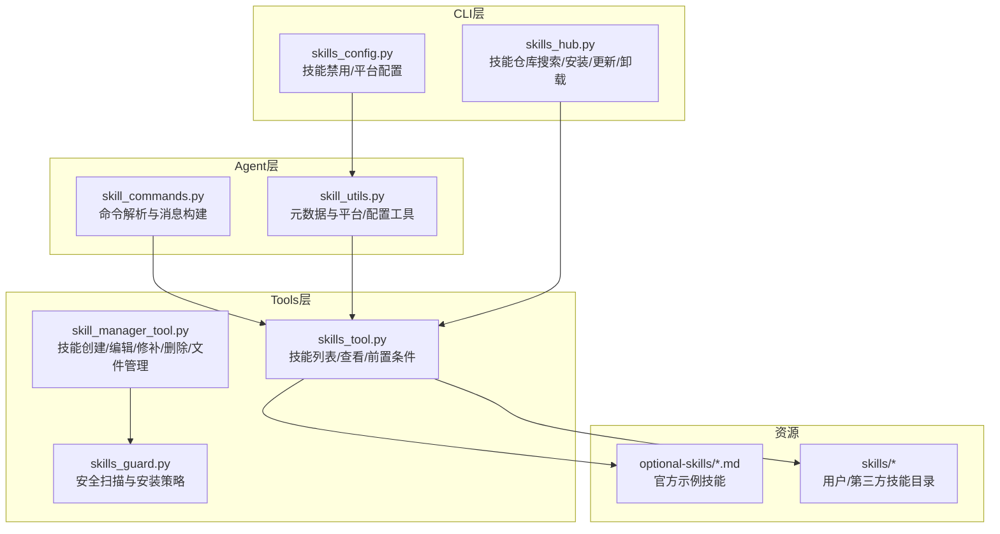
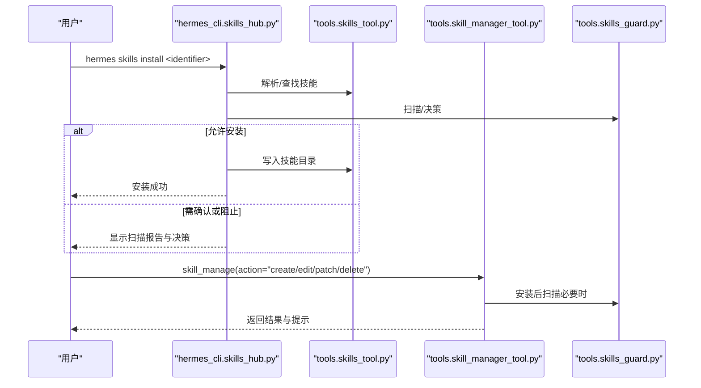
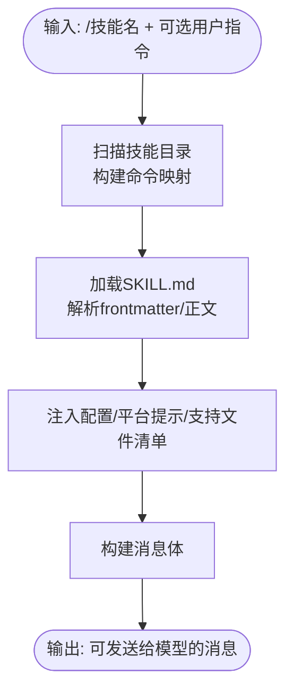
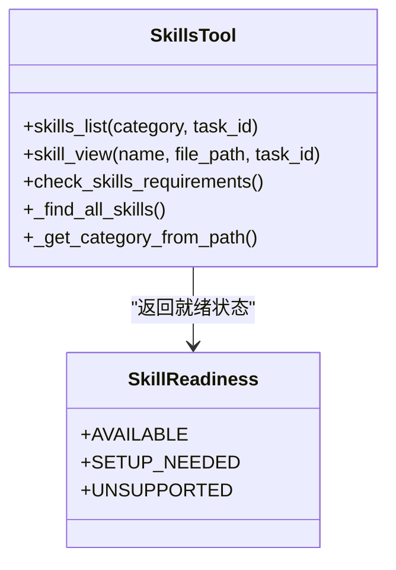
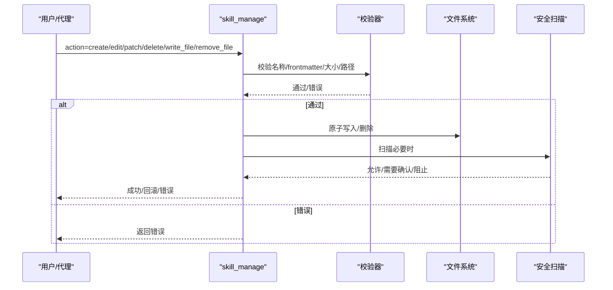
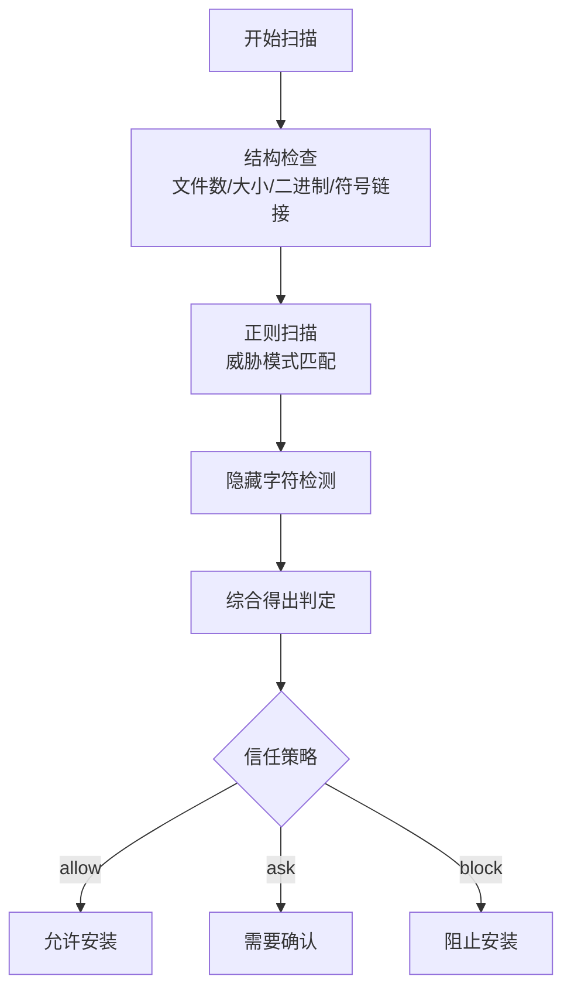
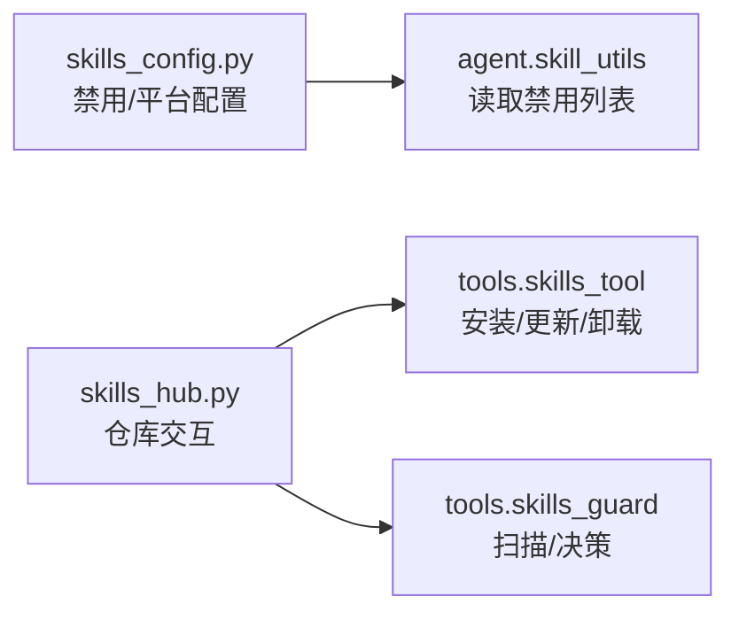
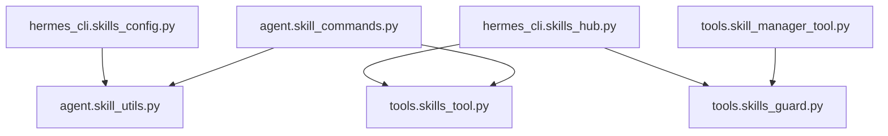

# 技能使用

<cite>
**本文引用的文件**
- [skill_commands.py](file://agent/skill_commands.py)
- [skill_utils.py](file://agent/skill_utils.py)
- [skill_manager_tool.py](file://tools/skill_manager_tool.py)
- [skills_tool.py](file://tools/skills_tool.py)
- [skills_guard.py](file://tools/skills_guard.py)
- [skills_config.py](file://hermes_cli/skills_config.py)
- [skills_hub.py](file://hermes_cli/skills_hub.py)
- [SKILL.md（示例：devops/cli）](file://optional-skills/devops/cli/SKILL.md)
- [SKILL.md（示例：creative/meme-generation）](file://optional-skills/creative/meme-generation/SKILL.md)
- [SKILL.md（示例：mlops/accelerate）](file://optional-skills/mlops/accelerate/SKILL.md)
</cite>

## 目录
1. [简介](#简介)
2. [项目结构与角色定位](#项目结构与角色定位)
3. [核心组件](#核心组件)
4. [架构总览](#架构总览)
5. [详细组件解析](#详细组件解析)
6. [依赖关系分析](#依赖关系分析)
7. [性能与安全考量](#性能与安全考量)
8. [故障排查指南](#故障排查指南)
9. [结论](#结论)
10. [附录：使用示例与最佳实践](#附录使用示例与最佳实践)

## 简介
本指南面向Hermes Agent用户与开发者，系统讲解“技能”（Skill）的概念、工作机制与使用方法。技能是代理的“程序化记忆”，用于记录并复用成功完成任务的方法，使代理在后续遇到相似任务时能快速调用已验证的流程。文档覆盖以下主题：
- 技能的基本概念与工作原理
- 使用skill_manage工具创建、编辑、修补、删除技能及管理支持文件
- 技能的查看、分类、禁用与平台适配
- 安全扫描与安装策略
- 最佳实践与常见使用场景

## 项目结构与角色定位
技能系统由多模块协同组成，职责清晰、边界明确：
- agent层：负责技能命令解析、消息构建、配置注入与平台匹配
- tools层：提供技能清单、查看、管理、安全扫描等工具能力
- hermes_cli层：提供命令行配置与技能仓库交互入口
- optional-skills与skills目录：内置与用户自定义技能资源

图表来源
- [skill_commands.py:1-369](file://agent/skill_commands.py#L1-L369)
- [skill_utils.py:1-443](file://agent/skill_utils.py#L1-L443)
- [skills_tool.py:1-800](file://tools/skills_tool.py#L1-L800)
- [skill_manager_tool.py:1-743](file://tools/skill_manager_tool.py#L1-L743)
- [skills_guard.py:1-800](file://tools/skills_guard.py#L1-L800)
- [skills_config.py:1-189](file://hermes_cli/skills_config.py#L1-L189)
- [skills_hub.py:1-800](file://hermes_cli/skills_hub.py#L1-L800)

章节来源
- [skill_commands.py:1-369](file://agent/skill_commands.py#L1-L369)
- [skill_utils.py:1-443](file://agent/skill_utils.py#L1-L443)
- [skills_tool.py:1-800](file://tools/skills_tool.py#L1-L800)
- [skill_manager_tool.py:1-743](file://tools/skill_manager_tool.py#L1-L743)
- [skills_guard.py:1-800](file://tools/skills_guard.py#L1-L800)
- [skills_config.py:1-189](file://hermes_cli/skills_config.py#L1-L189)
- [skills_hub.py:1-800](file://hermes_cli/skills_hub.py#L1-L800)

## 核心组件
- 技能命令与消息构建：将“/技能名”命令解析为技能内容，并注入配置、环境提示与支持文件清单，形成可直接交给模型的消息体。
- 技能工具：提供技能列表、查看、平台匹配、前置条件检查与环境变量收集等能力。
- 技能管理器：提供创建、编辑、修补、删除技能以及写入/删除支持文件的能力，并内置安全扫描与回滚。
- 安全扫描：对从外部来源安装的技能进行威胁模式检测与信任策略判定。
- CLI配置与仓库：提供技能禁用/启用、按平台配置、搜索/安装/更新/卸载第三方技能。

章节来源
- [skill_commands.py:200-369](file://agent/skill_commands.py#L200-L369)
- [skills_tool.py:520-800](file://tools/skills_tool.py#L520-L800)
- [skill_manager_tool.py:569-743](file://tools/skill_manager_tool.py#L569-L743)
- [skills_guard.py:595-728](file://tools/skills_guard.py#L595-L728)
- [skills_config.py:36-189](file://hermes_cli/skills_config.py#L36-L189)
- [skills_hub.py:144-666](file://hermes_cli/skills_hub.py#L144-L666)

## 架构总览
技能系统围绕“技能目录（~/.hermes/skills）”统一存储，支持本地、第三方与内置技能共存。Agent通过命令解析与工具函数加载技能内容；CLI提供配置与仓库交互；安全扫描贯穿安装与管理流程。

图表来源
- [skills_hub.py:307-447](file://hermes_cli/skills_hub.py#L307-L447)
- [skills_tool.py:520-800](file://tools/skills_tool.py#L520-L800)
- [skill_manager_tool.py:569-743](file://tools/skill_manager_tool.py#L569-L743)
- [skills_guard.py:642-712](file://tools/skills_guard.py#L642-L712)

## 详细组件解析

### 组件A：技能命令解析与消息构建（agent/skill_commands.py）
- 负责扫描本地与外部技能目录，生成“/技能名”命令映射
- 加载SKILL.md内容，注入配置值、平台提示、支持文件清单
- 支持会话预加载多个技能，构建系统提示

图表来源
- [skill_commands.py:200-327](file://agent/skill_commands.py#L200-L327)

章节来源
- [skill_commands.py:200-327](file://agent/skill_commands.py#L200-L327)

### 组件B：技能工具（tools/skills_tool.py）
- 提供skills_list与skill_view，实现“渐进披露”：先列元信息，再按需加载全文与支持文件
- 检查平台兼容性、前置条件与环境变量需求
- 支持类别描述文件（DESCRIPTION.md）增强发现体验

图表来源
- [skills_tool.py:520-800](file://tools/skills_tool.py#L520-L800)

章节来源
- [skills_tool.py:520-800](file://tools/skills_tool.py#L520-L800)

### 组件C：技能管理器（tools/skill_manager_tool.py）
- 动作集合：create、edit、patch、delete、write_file、remove_file
- 输入校验：名称/分类合法性、frontmatter完整性、内容大小限制
- 安全扫描：安装后扫描，必要时回滚
- 原子写入：临时文件+替换，避免中断导致半写
- 支持文件：仅允许写入references、templates、scripts、assets子目录

图表来源
- [skill_manager_tool.py:569-743](file://tools/skill_manager_tool.py#L569-L743)
- [skills_guard.py:595-728](file://tools/skills_guard.py#L595-L728)

章节来源
- [skill_manager_tool.py:569-743](file://tools/skill_manager_tool.py#L569-L743)
- [skills_guard.py:595-728](file://tools/skills_guard.py#L595-L728)

### 组件D：安全扫描（tools/skills_guard.py）
- 威胁模式：数据外泄、提示词注入、破坏性操作、持久化、网络通道、混淆、执行、路径穿越、挖矿、供应链、提权、配置篡改、硬编码凭据等
- 结构检查：文件数量、总大小、单文件大小、二进制文件、符号链接合法性
- 信任策略：builtin/trusted/community/agent-created不同阈值
- 输出：扫描结果、汇总与决策（允许/需要确认/阻止）

图表来源
- [skills_guard.py:595-728](file://tools/skills_guard.py#L595-L728)

章节来源
- [skills_guard.py:595-728](file://tools/skills_guard.py#L595-L728)

### 组件E：CLI配置与仓库（hermes_cli/skills_config.py、hermes_cli/skills_hub.py）
- skills_config：按平台切换技能禁用列表，支持按类别批量切换
- skills_hub：搜索、浏览、安装、更新、卸载、审计第三方技能，支持tap（自定义源）、发布本地技能到仓库

图表来源
- [skills_config.py:36-189](file://hermes_cli/skills_config.py#L36-L189)
- [skills_hub.py:144-666](file://hermes_cli/skills_hub.py#L144-L666)
- [skills_tool.py:520-800](file://tools/skills_tool.py#L520-L800)
- [skills_guard.py:642-712](file://tools/skills_guard.py#L642-L712)

章节来源
- [skills_config.py:36-189](file://hermes_cli/skills_config.py#L36-L189)
- [skills_hub.py:144-666](file://hermes_cli/skills_hub.py#L144-L666)

## 依赖关系分析
- agent层依赖tools层提供的技能元数据与工具函数
- skill_manager_tool依赖skills_guard进行安全扫描
- skills_hub依赖skills_tool与skills_guard完成仓库安装与安全策略
- CLI层通过skills_config与skills_hub提供用户界面

图表来源
- [skill_commands.py:1-369](file://agent/skill_commands.py#L1-L369)
- [skill_utils.py:1-443](file://agent/skill_utils.py#L1-L443)
- [skills_tool.py:1-800](file://tools/skills_tool.py#L1-L800)
- [skill_manager_tool.py:1-743](file://tools/skill_manager_tool.py#L1-L743)
- [skills_guard.py:1-800](file://tools/skills_guard.py#L1-L800)
- [skills_hub.py:1-800](file://hermes_cli/skills_hub.py#L1-L800)
- [skills_config.py:1-189](file://hermes_cli/skills_config.py#L1-L189)

章节来源
- [skill_commands.py:1-369](file://agent/skill_commands.py#L1-L369)
- [skill_utils.py:1-443](file://agent/skill_utils.py#L1-L443)
- [skills_tool.py:1-800](file://tools/skills_tool.py#L1-L800)
- [skill_manager_tool.py:1-743](file://tools/skill_manager_tool.py#L1-L743)
- [skills_guard.py:1-800](file://tools/skills_guard.py#L1-L800)
- [skills_hub.py:1-800](file://hermes_cli/skills_hub.py#L1-L800)
- [skills_config.py:1-189](file://hermes_cli/skills_config.py#L1-L189)

## 性能与安全考量
- 渐进披露：skills_list仅返回元信息，减少token消耗；按需skill_view加载全文
- 平台匹配：根据frontmatter的platforms字段过滤不兼容技能，避免运行时失败
- 安全扫描：安装前扫描，信任策略差异化处理；agent创建的技能同样受扫描约束
- 原子写入：临时文件+替换，降低中断风险
- 大小限制：SKILL.md与支持文件大小上限，防止异常膨胀影响性能

章节来源
- [skills_tool.py:719-784](file://tools/skills_tool.py#L719-L784)
- [skill_manager_tool.py:83-93](file://tools/skill_manager_tool.py#L83-L93)
- [skills_guard.py:486-503](file://tools/skills_guard.py#L486-L503)

## 故障排查指南
- 技能未显示或不可用
  - 检查是否被平台过滤（frontmatter.platforms）或被禁用（skills_config）
  - 使用skills_list确认技能存在且未被禁用
- 命令无法识别
  - 确认命令键为“/技能名”，空格与下划线会被归一化为连字符
- 安装/编辑失败
  - 查看扫描报告与决策原因（skills_hub.do_install）
  - 检查frontmatter完整性与内容大小限制
- 文件路径错误
  - write_file/remove_file仅允许在references、templates、scripts、assets子目录内
  - 不允许路径穿越（..），必须提供具体文件名而非仅目录

章节来源
- [skill_commands.py:272-289](file://agent/skill_commands.py#L272-L289)
- [skills_config.py:36-189](file://hermes_cli/skills_config.py#L36-L189)
- [skills_hub.py:307-447](file://hermes_cli/skills_hub.py#L307-L447)
- [skill_manager_tool.py:217-241](file://tools/skill_manager_tool.py#L217-L241)

## 结论
Hermes Agent的技能系统以“目录统一、渐进披露、安全优先”为核心设计原则，既保证了易用性与扩展性，又确保了安全性与可靠性。通过skill_manage与skills_hub，用户可以高效地创建、维护与共享技能，持续沉淀代理的程序化经验。

## 附录：使用示例与最佳实践

### 示例：查看与分类技能
- 查看技能分类与描述：skills categories
- 列出某分类下的技能：skills_list(category="mlops")
- 查看技能全文与支持文件：skill_view("meme-generation")

章节来源
- [skills_tool.py:640-784](file://tools/skills_tool.py#L640-L784)

### 示例：创建新技能（skill_manage）
- 动作：create
- 参数要点：name、content（含YAML frontmatter）、可选category
- 注意：frontmatter必须包含name与description；内容长度受限；名称唯一

章节来源
- [skill_manager_tool.py:585-589](file://tools/skill_manager_tool.py#L585-L589)

### 示例：编辑与修补（skill_manage）
- 全量重写：edit（提供完整的SKILL.md文本）
- 精准修复：patch（old_string/new_string，可选file_path与replace_all）
- 删除：delete（谨慎操作，支持自动清理空目录）

章节来源
- [skill_manager_tool.py:590-604](file://tools/skill_manager_tool.py#L590-L604)

### 示例：管理支持文件（skill_manage）
- 添加/覆盖：write_file（限定子目录与大小）
- 删除：remove_file（自动清理空目录）

章节来源
- [skill_manager_tool.py:605-616](file://tools/skill_manager_tool.py#L605-L616)

### 示例：安装/更新第三方技能（hermes skills）
- 搜索：do_search
- 浏览：do_browse
- 安装：do_install（自动扫描、策略判定、确认）
- 更新：do_update
- 卸载：do_uninstall

章节来源
- [skills_hub.py:144-598](file://hermes_cli/skills_hub.py#L144-L598)

### 示例：按平台禁用/启用技能（hermes skills）
- 切换平台：选择CLI/Telegram/Slack等
- 个体切换或按类别切换
- 保存配置后立即生效

章节来源
- [skills_config.py:136-189](file://hermes_cli/skills_config.py#L136-L189)

### 示例：技能内容参考（optional-skills）
- 开发运维类：inference.sh CLI（命令行工具驱动）
- 创意类：Meme生成（模板选择、脚本调用、输出验证）
- MLOps类：HuggingFace Accelerate（分布式训练API）

章节来源
- [SKILL.md（devops/cli）:1-156](file://optional-skills/devops/cli/SKILL.md#L1-L156)
- [SKILL.md（creative/meme-generation）:1-130](file://optional-skills/creative/meme-generation/SKILL.md#L1-L130)
- [SKILL.md（mlops/accelerate）:1-336](file://optional-skills/mlops/accelerate/SKILL.md#L1-L336)

### 最佳实践
- 何时创建技能
  - 复杂任务多次成功（≥5次调用）、解决过显著问题、用户反馈良好
  - 用户明确要求“记住这个流程”
- 如何命名
  - 小写、字母数字、点与短横线组合；避免斜杠与空格
  - 语义清晰，便于搜索与分类
- 内容组织
  - 必备：name、description、platforms（如适用）
  - 建议：触发条件、前置条件、步骤清单、常见陷阱、验证步骤、参考文件
  - 支持文件：references（文档）、templates（模板）、scripts（脚本）、assets（资源）
- 安全与合规
  - 避免硬编码凭据；尽量通过环境变量或安全收集机制
  - 保持最小权限；避免破坏性命令
  - 定期扫描与审计第三方技能