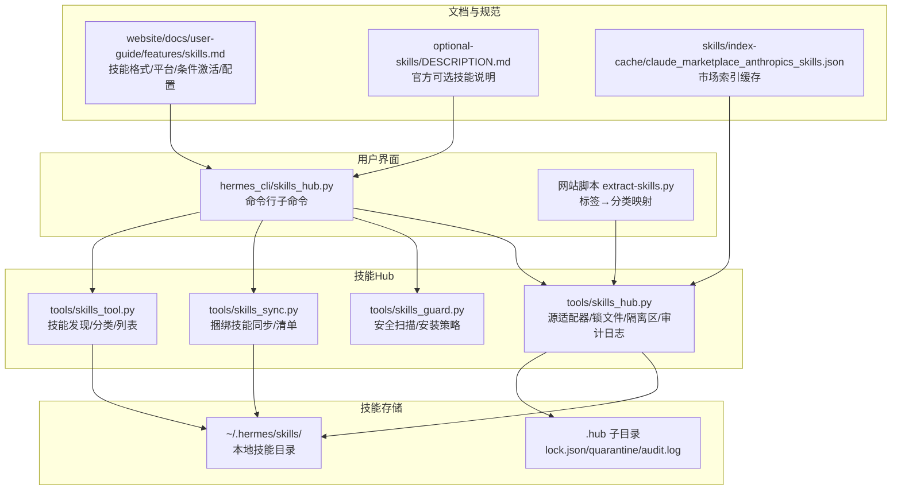
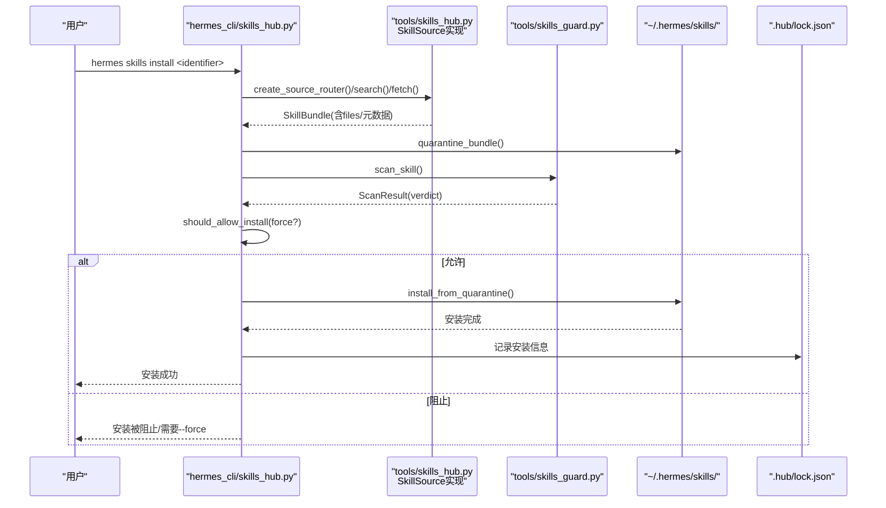
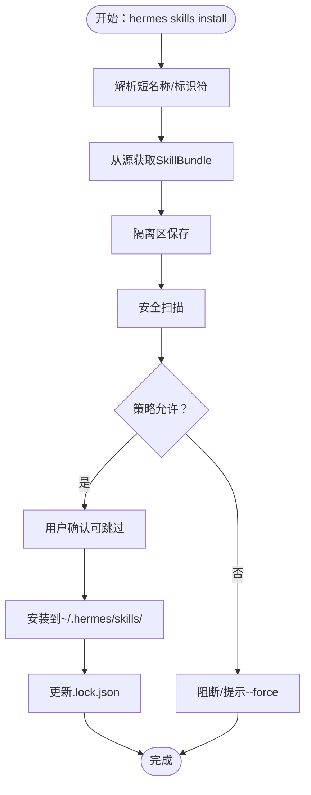
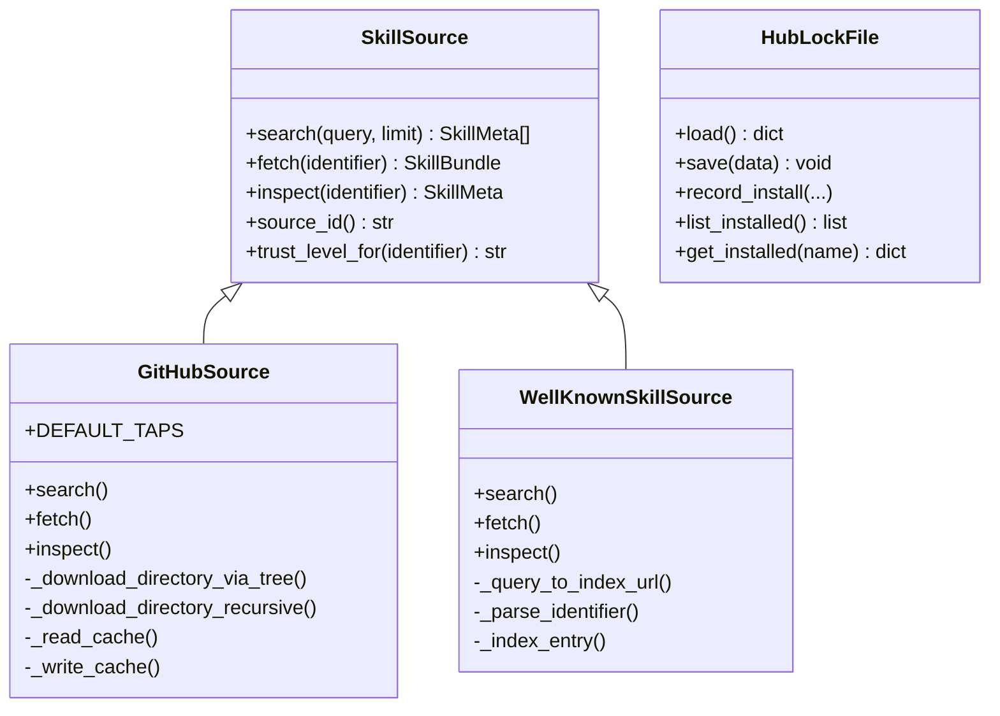
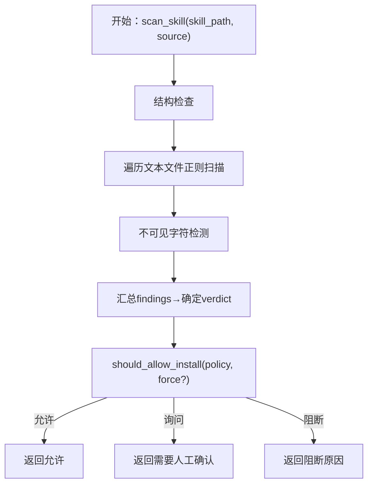
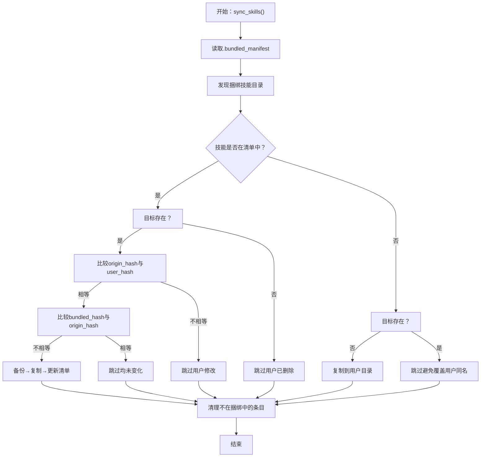
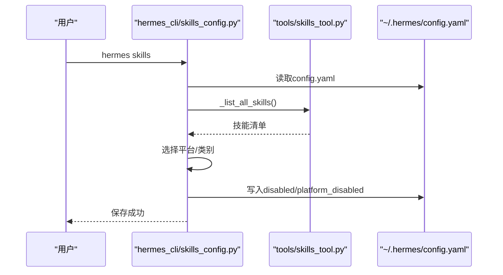
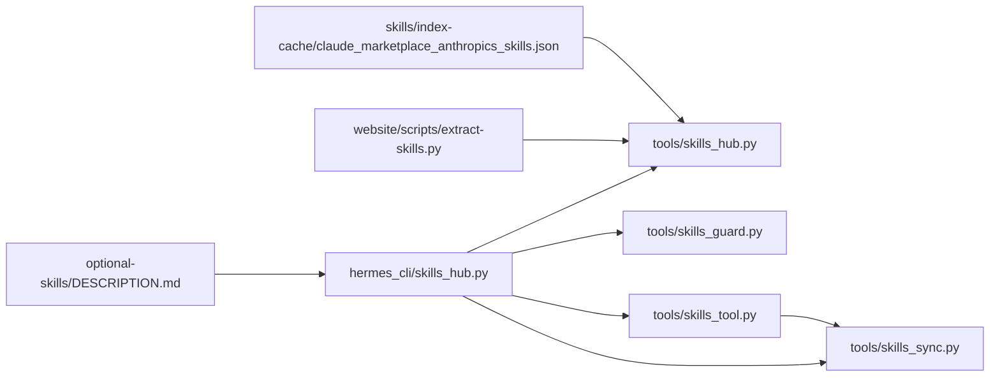

# 技能市场

<cite>
**本文引用的文件**
- [skills_hub.py](file://hermes_cli/skills_hub.py)
- [skills_config.py](file://hermes_cli/skills_config.py)
- [skills_sync.py](file://tools/skills_sync.py)
- [skills_guard.py](file://tools/skills_guard.py)
- [skills_tool.py](file://tools/skills_tool.py)
- [skills.md](file://website/docs/user-guide/features/skills.md)
- [DESCRIPTION.md（可选技能）](file://optional-skills/DESCRIPTION.md)
- [claude_marketplace_anthropics_skills.json](file://skills/index-cache/claude_marketplace_anthropics_skills.json)
- [extract-skills.py](file://website/scripts/extract-skills.py)
- [SKILL.md（示例：dogfood）](file://skills/dogfood/SKILL.md)
- [test_skills_hub.py](file://tests/hermes_cli/test_skills_hub.py)
- [test_skills_guard.py](file://tests/tools/test_skills_guard.py)
</cite>

## 目录
1. [简介](#简介)
2. [项目结构](#项目结构)
3. [核心组件](#核心组件)
4. [架构总览](#架构总览)
5. [详细组件分析](#详细组件分析)
6. [依赖分析](#依赖分析)
7. [性能考虑](#性能考虑)
8. [故障排除指南](#故障排除指南)
9. [结论](#结论)
10. [附录](#附录)

## 简介
本指南面向Hermes Agent的“技能市场”（Skills Hub），帮助用户理解技能的概念、来源与使用方式，掌握从技能中心下载、安装、更新、卸载与审计技能的完整流程，并了解内置技能的分类、版本与兼容性管理、搜索与筛选方法，以及常见问题的排查步骤。技能是“按需加载”的知识文档，遵循渐进式披露模式，既可作为斜杠命令直接调用，也可在对话中按需加载。

## 项目结构
技能系统由以下关键部分组成：
- 命令行入口与交互：hermes_cli/skills_hub.py 提供统一的技能子命令（browse/search/inspect/install/uninstall/update/audit/list/tap/publish 等）
- 源适配器与索引：tools/skills_hub.py 定义了多种技能源（GitHub、well-known、官方可选技能等）及锁文件、隔离区、审计日志等Hub状态管理
- 同步与种子：tools/skills_sync.py 负责将仓库内“捆绑技能”复制到用户目录并维护清单，避免覆盖用户自定义修改
- 安全扫描：tools/skills_guard.py 对外部来源技能进行静态安全扫描与安装策略判定
- 技能发现与列表：tools/skills_tool.py 提供技能清单与分类信息，支持按类别筛选
- 文档与规范：website/docs/user-guide/features/skills.md 描述技能格式、平台限制、条件激活、环境变量与配置注入等
- 可选技能说明：optional-skills/DESCRIPTION.md 解释“官方可选技能”的定位与安装方式
- 市场索引缓存：skills/index-cache/claude_marketplace_anthropics_skills.json 提供Anthropic技能集合索引
- 网站脚本：website/scripts/extract-skills.py 将技能标签映射到分类，用于网站展示与筛选
- 示例技能：skills/dogfood/SKILL.md 展示了标准技能文档的结构与使用指引

图表来源
- [skills_hub.py](file://hermes_cli/skills_hub.py)
- [skills_sync.py](file://tools/skills_sync.py)
- [skills_guard.py](file://tools/skills_guard.py)
- [skills_tool.py](file://tools/skills_tool.py)
- [skills.md](file://website/docs/user-guide/features/skills.md)
- [DESCRIPTION.md（可选技能）](file://optional-skills/DESCRIPTION.md)
- [claude_marketplace_anthropics_skills.json](file://skills/index-cache/claude_marketplace_anthropics_skills.json)
- [extract-skills.py](file://website/scripts/extract-skills.py)

章节来源
- [skills_hub.py](file://hermes_cli/skills_hub.py)
- [skills_sync.py](file://tools/skills_sync.py)
- [skills_guard.py](file://tools/skills_guard.py)
- [skills_tool.py](file://tools/skills_tool.py)
- [skills.md](file://website/docs/user-guide/features/skills.md)
- [DESCRIPTION.md（可选技能）](file://optional-skills/DESCRIPTION.md)
- [claude_marketplace_anthropics_skills.json](file://skills/index-cache/claude_marketplace_anthropics_skills.json)
- [extract-skills.py](file://website/scripts/extract-skills.py)

## 核心组件
- 技能Hub命令行接口：提供浏览、搜索、预览、安装、卸载、更新、审计、列出、添加/移除自定义源等能力
- 源适配器：支持GitHub仓库、well-known端点、官方可选技能等多源聚合
- 安全扫描与安装策略：对第三方来源技能进行结构与内容扫描，结合信任级别决定是否允许安装
- 捆绑技能同步：将仓库内的技能复制到用户目录，记录清单，尊重用户自定义修改
- 技能发现与分类：列出技能、统计分类、按类别过滤，辅助用户选择
- 技能规范与配置：SKILL.md元数据、平台限制、条件激活、环境变量与配置项注入

章节来源
- [skills_hub.py](file://hermes_cli/skills_hub.py)
- [skills_sync.py](file://tools/skills_sync.py)
- [skills_guard.py](file://tools/skills_guard.py)
- [skills_tool.py](file://tools/skills_tool.py)
- [skills.md](file://website/docs/user-guide/features/skills.md)

## 架构总览
技能系统的运行时路径如下：
- 用户通过 hermes skills 子命令发起请求
- 命令解析后委托给共享的 do_* 函数
- do_* 函数根据源路由选择具体 SkillSource 实现（如 GitHubSource、WellKnownSkillSource）
- 下载技能包（SkillBundle）进入隔离区（quarantine），执行安全扫描
- 若通过策略判定，写入用户技能目录；否则提示或阻断
- 更新/审计/卸载等操作基于锁文件（lock.json）追踪已安装技能

图表来源
- [skills_hub.py](file://hermes_cli/skills_hub.py)
- [skills_guard.py](file://tools/skills_guard.py)

章节来源
- [skills_hub.py](file://hermes_cli/skills_hub.py)
- [skills_guard.py](file://tools/skills_guard.py)

## 详细组件分析

### 组件A：技能Hub命令行接口（hermes skills）
- 功能要点
  - 搜索与浏览：支持按关键词、源类型、分页浏览
  - 预览与安装：inspect显示元数据与SKILL.md预览；install执行下载、隔离、扫描、确认与安装
  - 列表与更新：列出已安装技能（区分hub/builtin/local）；检查/更新上游变更
  - 审计与卸载：重新扫描已安装技能；卸载指定技能
  - 自定义源：tap add/remove/list 管理GitHub自定义源
  - 发布：本地技能发布到GitHub（PR）或ClawHub（待支持）
- 关键流程
  - 安装流程：解析短名称→选择源→fetch→quarantine→scan→策略判定→confirm→install→更新锁文件
  - 更新流程：读取锁文件→对比上游内容哈希→批量重装
  - 卸载流程：校验非内置→删除文件→更新锁文件

图表来源
- [skills_hub.py](file://hermes_cli/skills_hub.py)

章节来源
- [skills_hub.py](file://hermes_cli/skills_hub.py)

### 组件B：源适配器与Hub状态管理（tools/skills_hub.py）
- 源适配器
  - GitHubSource：支持自定义tap（默认包含openai/skills、anthropics/skills等），树API优先递归拉取，带缓存索引
  - WellKnownSkillSource：从域名下的/.well-known/skills/index.json发现技能
  - OptionalSkillSource：官方可选技能（非默认激活），信任级别builtin/trusted
- Hub状态
  - 锁文件（lock.json）：记录已安装技能的来源、标识、信任级别、内容哈希、安装路径、文件清单与元数据
  - 隔离区（quarantine）：安装前临时存放，扫描通过后移动至正式位置
  - 审计日志（audit.log）：记录安装/阻断事件
  - taps.json：自定义GitHub源配置
  - 索引缓存（index-cache）：加速GitHub目录枚举

图表来源
- [skills_hub.py](file://tools/skills_hub.py)

章节来源
- [skills_hub.py](file://tools/skills_hub.py)

### 组件C：安全扫描与安装策略（tools/skills_guard.py）
- 扫描范围
  - 结构检查：文件数量、单文件大小、二进制文件、符号链接
  - 正则匹配：敏感模式（数据外泄、提示词注入、破坏性命令、持久化等）
  - 不可见Unicode字符检测
- 信任与策略
  - builtin/trusted/community 三档信任
  - 不同信任级别对应不同的安装策略（允许/询问/阻断），force可覆盖询问
- 输出
  - ScanResult 包含技能名、来源、信任级别、判定结果、发现列表、时间戳与摘要

图表来源
- [skills_guard.py](file://tools/skills_guard.py)

章节来源
- [skills_guard.py](file://tools/skills_guard.py)

### 组件D：捆绑技能同步（tools/skills_sync.py）
- 目标
  - 将仓库中的技能复制到用户目录，记录清单，避免覆盖用户自定义修改
- 行为
  - 新增：未在清单中且目标不存在时复制
  - 更新：用户未修改且捆绑版本有变化时替换，失败回滚
  - 跳过：用户已修改或清单存在但捆绑已删除
  - 清理：移除清单中已不存在的技能条目
  - 备份：更新失败时自动恢复
- 清单格式
  - v2：name:origin_hash；v1仅记录技能名，迁移时自动补全为空哈希

图表来源
- [skills_sync.py](file://tools/skills_sync.py)

章节来源
- [skills_sync.py](file://tools/skills_sync.py)

### 组件E：技能发现与配置（tools/skills_tool.py 与 hermes_cli/skills_config.py）
- 技能发现
  - skills_list：按类别返回最小化技能信息（name/description/category），减少token消耗
  - 分类统计：汇总各分类下技能数量与描述
- 技能配置
  - 支持全局禁用与按平台禁用（CLI/Telegram/Discord/Slack/WhatsApp/Signal/Email/HomeAssistant/Mattermost/Matrix/DingTalk/Feishu/WeCom/Webhook）
  - 支持按类别批量启用/禁用
- 平台与条件激活
  - SKILL.md 可声明 platforms、requires_toolsets/fallback_for_toolsets 等字段控制显示与可用性

图表来源
- [skills_config.py](file://hermes_cli/skills_config.py)
- [skills_tool.py](file://tools/skills_tool.py)

章节来源
- [skills_config.py](file://hermes_cli/skills_config.py)
- [skills_tool.py](file://tools/skills_tool.py)

### 组件F：技能规范与示例（website/docs/user-guide/features/skills.md 与 skills/dogfood/SKILL.md）
- 规范要点
  - SKILL.md 元数据：name/description/version/platforms/metadata.hermes.tags/category/fallback_for_toolsets/requires_toolsets/config
  - 渐进式披露：skills_list（~3k tokens）→ skill_view（完整内容）→ 指定文件片段
  - 条件激活：当某些工具集/工具可用或不可用时自动隐藏/显示
  - 环境变量与配置：required_environment_variables 与 metadata.hermes.config 注入到上下文
- 示例技能
  - dogfood：系统化Web应用QA测试工作流，包含输入、流程、工具参考与最佳实践

章节来源
- [skills.md](file://website/docs/user-guide/features/skills.md)
- [SKILL.md（示例：dogfood）](file://skills/dogfood/SKILL.md)

## 依赖分析
- hermes_cli/skills_hub.py 依赖 tools/skills_hub.py（源适配器/锁文件/隔离区）、tools/skills_guard.py（扫描/策略）、tools/skills_sync.py（清单/同步）
- tools/skills_tool.py 依赖 tools/skills_sync.py 的清单读取与技能发现
- website/scripts/extract-skills.py 依赖技能标签映射到分类，服务于网站展示
- optional-skills/DESCRIPTION.md 与 skills/index-cache/claude_marketplace_anthropics_skills.json 为可选技能与市场索引提供说明与缓存

图表来源
- [skills_hub.py](file://hermes_cli/skills_hub.py)
- [skills_sync.py](file://tools/skills_sync.py)
- [skills_guard.py](file://tools/skills_guard.py)
- [skills_tool.py](file://tools/skills_tool.py)
- [DESCRIPTION.md（可选技能）](file://optional-skills/DESCRIPTION.md)
- [claude_marketplace_anthropics_skills.json](file://skills/index-cache/claude_marketplace_anthropics_skills.json)
- [extract-skills.py](file://website/scripts/extract-skills.py)

章节来源
- [skills_hub.py](file://hermes_cli/skills_hub.py)
- [skills_sync.py](file://tools/skills_sync.py)
- [skills_guard.py](file://tools/skills_guard.py)
- [skills_tool.py](file://tools/skills_tool.py)
- [DESCRIPTION.md（可选技能）](file://optional-skills/DESCRIPTION.md)
- [claude_marketplace_anthropics_skills.json](file://skills/index-cache/claude_marketplace_anthropics_skills.json)
- [extract-skills.py](file://website/scripts/extract-skills.py)

## 性能考虑
- 源枚举与缓存
  - GitHubSource 使用树API一次性获取整棵目录树，避免逐层请求导致的静默丢失与速率限制
  - 索引缓存（index-cache）降低重复拉取成本，默认1小时TTL
- 安装前隔离与原子写入
  - quarantine 避免扫描失败时污染用户目录
  - 安装完成后才写入锁文件，确保一致性
- 渐进式披露
  - 仅在需要时加载完整技能内容，减少token占用与延迟
- 同步策略
  - 仅在用户未修改的前提下更新捆绑技能，避免不必要的IO与覆盖

章节来源
- [skills_hub.py](file://tools/skills_hub.py)
- [skills_sync.py](file://tools/skills_sync.py)
- [skills.md](file://website/docs/user-guide/features/skills.md)

## 故障排除指南
- 安装被阻断
  - 现象：扫描结果为危险/高风险，策略拒绝安装
  - 排查：查看扫描报告，确认是否存在破坏性命令、敏感模式或不可见字符；必要时使用--force强制（仅在充分理解风险后）
  - 参考：[skills_hub.py](file://hermes_cli/skills_hub.py) 中的安装流程与策略判定
- 无法找到技能
  - 现象：搜索无结果或inspect报错
  - 排查：确认源类型（official/github/well-known）与标识符格式；对于短名称，先解析为完整标识符
  - 参考：[skills_hub.py](file://hermes_cli/skills_hub.py) 中的短名称解析与源路由
- 更新无效
  - 现象：do_check 显示“最新”，但实际内容未更新
  - 排查：确认锁文件中的内容哈希是否变化；检查网络与源可达性；必要时重新安装
  - 参考：[skills_hub.py](file://tools/skills_hub.py) 中的更新检查逻辑
- 卸载失败
  - 现象：提示不能卸载内置技能或找不到路径
  - 排查：内置技能受保护；确认install_path是否正确；检查.lock.json记录
  - 参考：[skills_hub.py](file://hermes_cli/skills_hub.py) 中的卸载实现
- 审计日志缺失
  - 现象：audit.log 为空
  - 排查：确认安装/阻断事件是否触发；检查.HermesHome/.hub/目录权限
  - 参考：[skills_hub.py](file://tools/skills_hub.py) 中的审计日志写入
- 平台/条件激活异常
  - 现象：技能在某些平台不可见或未按预期显示
  - 排查：检查SKILL.md中的platforms、requires_toolsets/fallback_for_toolsets字段；确认当前会话工具可用性
  - 参考：[skills.md](file://website/docs/user-guide/features/skills.md)

章节来源
- [skills_hub.py](file://hermes_cli/skills_hub.py)
- [skills_guard.py](file://tools/skills_guard.py)
- [skills.md](file://website/docs/user-guide/features/skills.md)

## 结论
Hermes Agent的技能市场以“安全、可追溯、可扩展”为核心设计原则：通过多源适配器聚合技能资源，借助隔离区与安全扫描保障安装安全，利用锁文件与清单实现可追踪的版本与变更管理。用户可通过命令行完成从搜索、预览、安装到更新、审计与卸载的全生命周期管理；同时，技能规范与条件激活机制使技能在不同平台与工具环境下具备良好的适应性与渐进式披露体验。

## 附录

### 技能市场与同步机制速览
- 下载与安装
  - hermes skills browse/search/inspect/install
  - 安装前隔离→扫描→策略判定→确认→安装→更新锁文件
- 更新与审计
  - hermes skills check/update/audit
  - 基于内容哈希比对上游版本；可对已安装技能重新扫描
- 卸载
  - hermes skills uninstall；内置技能受保护
- 捆绑技能
  - hermes skills sync（内部调用）：复制捆绑技能，尊重用户修改，避免覆盖

章节来源
- [skills_hub.py](file://hermes_cli/skills_hub.py)
- [skills_sync.py](file://tools/skills_sync.py)

### 内置技能功能分类（示例）
- 开发工具：mlops、devops、软件开发相关技能
- 数据科学：Jupyter交互、数据分析与可视化
- 文档处理：文档/演示/电子表格等生产力技能
- 创意工具：ASCII艺术、手绘风格图示、视觉设计
- 研究与信息：学术研究、知识检索、论文写作
- 社交媒体：营销、SEO、内容运营
- 娱乐与游戏：游戏开发、娱乐内容
- 健康与健身：健康追踪、运动计划
- 媒体与音乐：视频/音频处理与生成
- 安全：安全扫描、合规与取证
- 其他：未分类或小众技能

章节来源
- [extract-skills.py](file://website/scripts/extract-skills.py)
- [skills/data-science/DESCRIPTION.md](file://skills/data-science/DESCRIPTION.md)
- [skills/creative/DESCRIPTION.md](file://skills/creative/DESCRIPTION.md)
- [skills/productivity/DESCRIPTION.md](file://skills/productivity/DESCRIPTION.md)

### 版本管理与兼容性检查
- 版本字段：SKILL.md 中的 version 字段可用于语义化标识
- 内容哈希：安装后记录content_hash，更新检查基于哈希比对
- 平台限制：platforms 字段限制在特定OS上可见与可用
- 工具集/工具条件：requires_toolsets/fallback_for_toolsets 控制显示与激活
- 环境变量与配置：required_environment_variables 与 metadata.hermes.config 注入到上下文

章节来源
- [skills.md](file://website/docs/user-guide/features/skills.md)
- [SKILL.md（示例：dogfood）](file://skills/dogfood/SKILL.md)

### 技能搜索与筛选
- 搜索
  - hermes skills search <query> [--source all/github/well-known/official]
  - 支持关键词、标签、描述匹配
- 浏览
  - hermes skills browse [--source all/github/well-known/official] [--page N]
  - 官方技能优先展示，去重并按信任级别排序
- 预览
  - hermes skills inspect <identifier> 查看元数据与SKILL.md预览
- 分类与标签
  - 网站脚本将标签映射到分类，便于筛选与展示
  - 可在SKILL.md中声明hermes.tags与category

章节来源
- [skills_hub.py](file://hermes_cli/skills_hub.py)
- [extract-skills.py](file://website/scripts/extract-skills.py)

### 安装与配置步骤（示例）
- 安装
  - hermes skills browse 或 search 定位技能
  - hermes skills inspect 预览
  - hermes skills install <identifier>（必要时--force）
- 配置
  - hermes skills（交互式）选择平台/类别/个体技能启用/禁用
  - 或编辑 ~/.hermes/config.yaml 中 skills.disabled 与 platform_disabled
- 生效
  - 安装后立即生效；若需即时生效，可使用 /reset 或 --now（安装流程中会提示）

章节来源
- [skills_hub.py](file://hermes_cli/skills_hub.py)
- [skills_config.py](file://hermes_cli/skills_config.py)

### 发布与社区贡献
- 发布本地技能
  - hermes skills publish <path> --to github --repo owner/repo
  - 自检扫描通过后创建PR
- 添加自定义源
  - hermes skills tap add owner/repo
  - hermes skills tap list/remove

章节来源
- [skills_hub.py](file://hermes_cli/skills_hub.py)

### 测试与验证
- 安装与扫描行为
  - 单测覆盖安装流程、扫描结果与策略判定
- 安全扫描
  - 单测覆盖信任级别解析、结构检查、模式匹配与不可见字符检测

章节来源
- [test_skills_hub.py](file://tests/hermes_cli/test_skills_hub.py)
- [test_skills_guard.py](file://tests/tools/test_skills_guard.py)