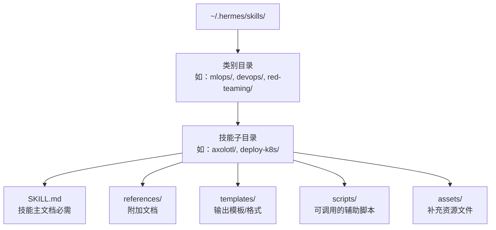
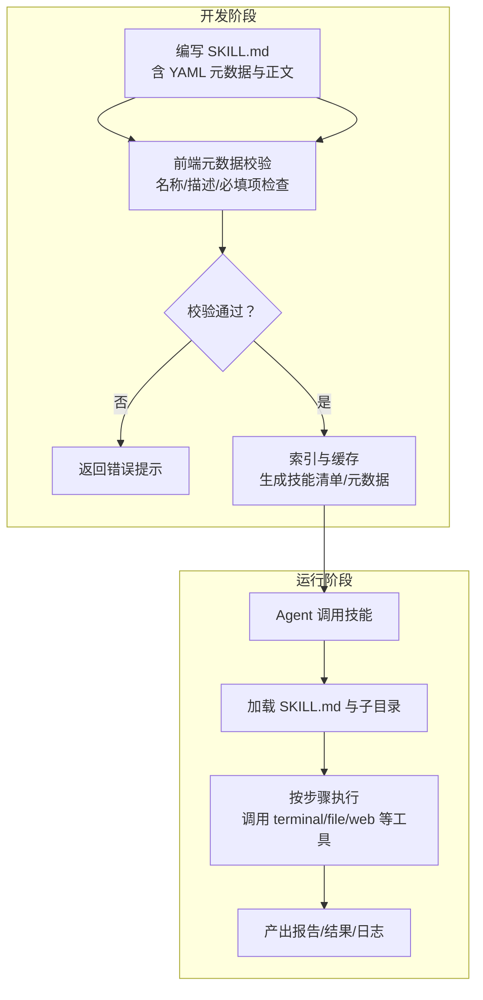
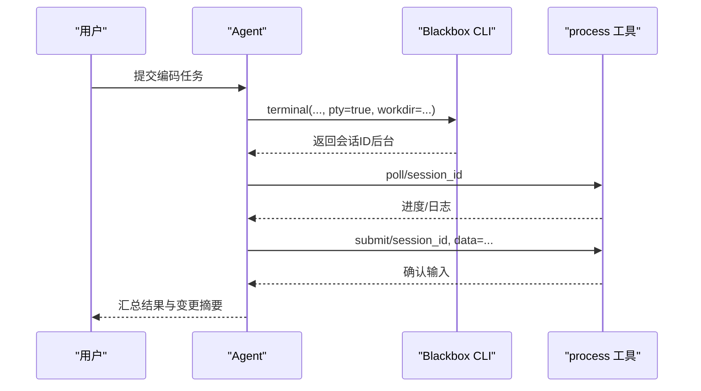
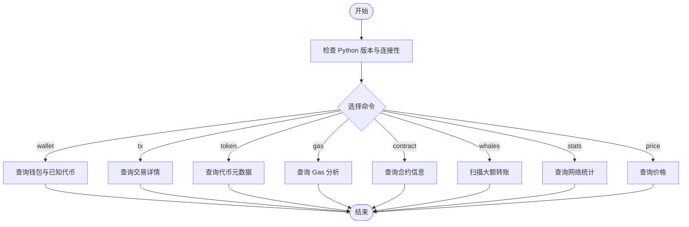
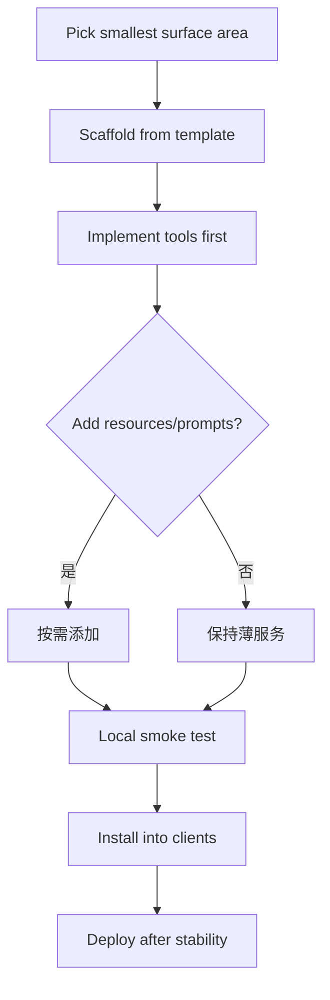
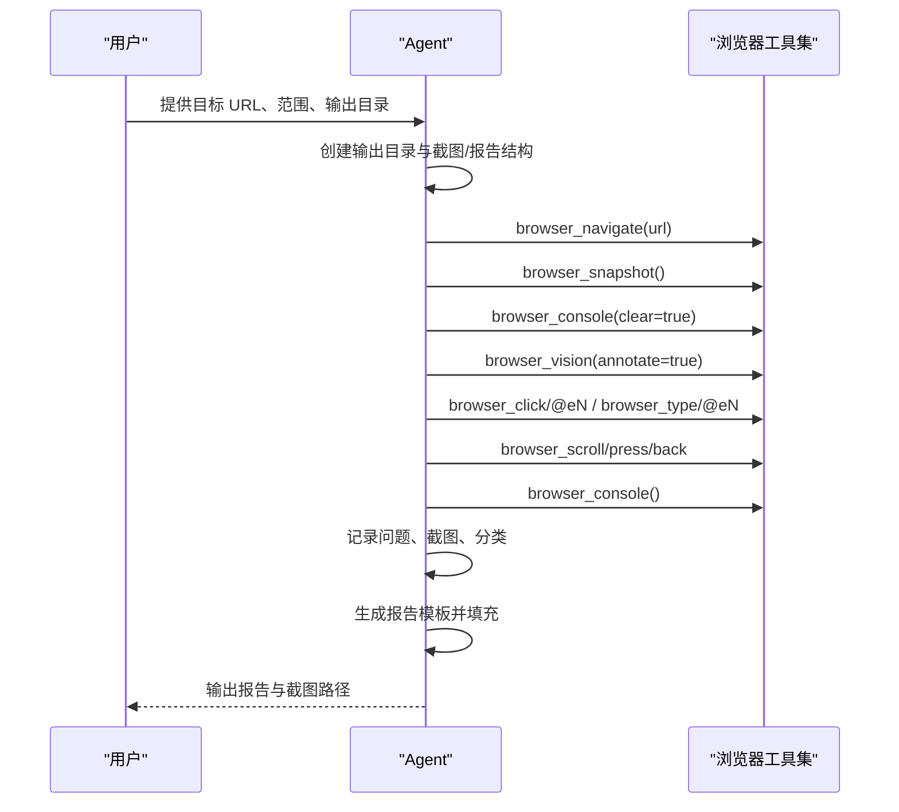
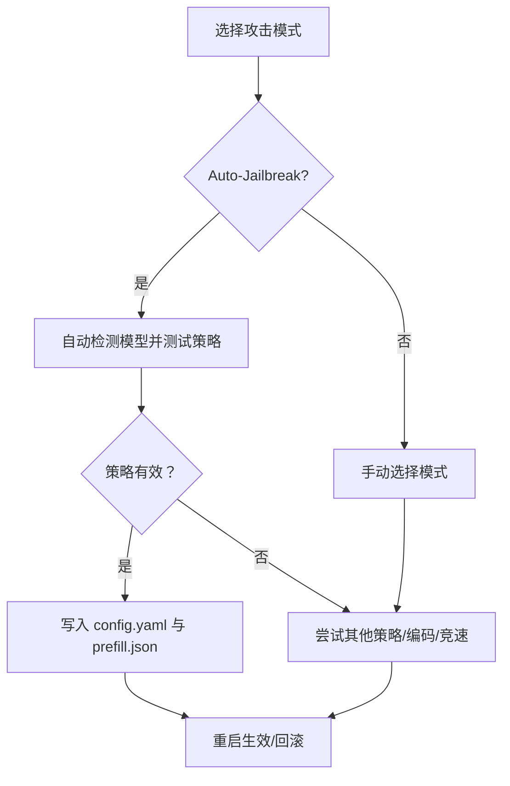
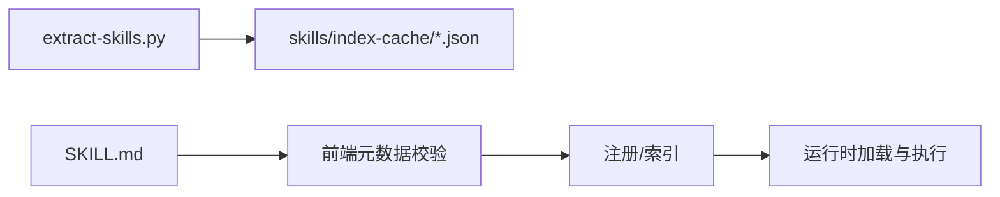

# 技能开发

<cite>
**本文引用的文件**
- [skills 目录结构与说明](file://website/docs/user-guide/features/skills.md)
- [技能管理工具：前端元数据校验](file://tools/skill_manager_tool.py)
- [技能列表与查看测试](file://tests/tools/test_skills_tool.py)
- [技能创建测试（含目录结构）](file://tests/tools/test_skill_manager_tool.py)
- [示例技能：Blackbox](file://optional-skills/autonomous-ai-agents/blackbox/SKILL.md)
- [示例技能：区块链基础查询](file://optional-skills/blockchain/base/SKILL.md)
- [示例技能：FastMCP](file://optional-skills/mcp/fastmcp/SKILL.md)
- [示例技能：系统化探索式测试（Dogfood）](file://skills/dogfood/SKILL.md)
- [示例技能：Godmode 红队](file://skills/red-teaming/godmode/SKILL.md)
- [Dogfood 报告模板](file://skills/dogfood/templates/dogfood-report-template.md)
- [Dogfood 问题分类体系](file://skills/dogfood/references/issue-taxonomy.md)
- [软件开发：测试驱动开发](file://skills/software-development/test-driven-development/SKILL.md)
- [软件开发：系统化调试](file://skills/software-development/systematic-debugging/SKILL.md)
- [可选技能总览](file://optional-skills/DESCRIPTION.md)
- [网站技能提取脚本](file://website/scripts/extract-skills.py)
</cite>

## 目录
1. [引言](#引言)
2. [项目结构](#项目结构)
3. [核心组件](#核心组件)
4. [架构总览](#架构总览)
5. [详细组件分析](#详细组件分析)
6. [依赖分析](#依赖分析)
7. [性能考虑](#性能考虑)
8. [故障排查指南](#故障排查指南)
9. [结论](#结论)
10. [附录](#附录)

## 引言
本指南面向希望在 Hermes Agent 中开发与维护“技能”的开发者，系统讲解技能的结构、规范、编写方法、目录组织、最佳实践、测试与调试策略，并通过多个真实示例展示从简单到复杂的自动化流程设计思路。文中所有技术细节均以仓库中的实际实现与文档为依据。

## 项目结构
Hermes 的技能以“技能包”形式组织，每个技能包包含一个主文档 SKILL.md 以及可选的 references、templates、scripts、assets 子目录。技能目录遵循统一布局，便于工具扫描、索引与加载。

**图表来源**
- [skills 目录结构与说明:168-194](file://website/docs/user-guide/features/skills.md#L168-L194)

**章节来源**
- [skills 目录结构与说明:168-194](file://website/docs/user-guide/features/skills.md#L168-L194)

## 核心组件
- SKILL.md：技能的“说明书”，包含 YAML 前置元数据、描述、步骤、参考与注意事项等。它是技能被发现、索引与加载的核心入口。
- references：存放技能相关的背景资料、参考链接、术语表等。
- templates：存放报告模板、输出格式等可复用文本。
- scripts：技能内部可调用的辅助脚本，供执行步骤中使用。
- assets：补充资源（如图标、配置样例等）。

上述结构由工具链负责解析、校验与索引，确保技能在 Hub 或本地被正确识别与使用。

**章节来源**
- [skills 目录结构与说明:168-194](file://website/docs/user-guide/features/skills.md#L168-L194)

## 架构总览
下图展示了技能从“编写—校验—索引—运行”的端到端流程，体现工具链对 SKILL.md 的解析与对子目录的利用。

**图表来源**
- [技能管理工具：前端元数据校验:138-171](file://tools/skill_manager_tool.py#L138-L171)
- [技能列表与查看测试:284-320](file://tests/tools/test_skills_tool.py#L284-L320)
- [技能创建测试（含目录结构）:190-216](file://tests/tools/test_skill_manager_tool.py#L190-L216)

## 详细组件分析

### YAML 前置元数据规范
- 必填字段
  - name：技能名称（仅字母数字、连字符、下划线，且不包含路径遍历）
  - description：技能简介（长度限制）
- 可选字段
  - version、author、license
  - metadata.hermes.tags：标签数组，用于分类与检索
  - metadata.hermes.related_skills：关联技能标识符列表
  - metadata.hermes.homepage：官方主页（如适用）
  - prerequisites.commands：运行所需命令（如 python3）
- 元数据必须以三短横线包裹的 YAML 表示，且以闭合三短横线结束。

校验逻辑要点
- 内容不能为空
- 必须以 YAML 前置元数据开头与闭合
- YAML 解析必须成功
- 字段类型与长度需满足约束

**章节来源**
- [技能管理工具：前端元数据校验:138-171](file://tools/skill_manager_tool.py#L138-L171)
- [技能创建测试（含目录结构）:117-128](file://tests/tools/test_skill_manager_tool.py#L117-L128)

### 正文结构与写作规范
- 概述与适用场景：明确“何时使用该技能”
- 前置条件：列出环境、依赖、配置要求
- 快速参考：列出常用命令或参数
- 步骤说明：分步骤、编号清晰；每步包含目标、操作、预期结果
- 常见陷阱与注意事项：列举易错点与规避建议
- 验证与收尾：提供验证方法与后续建议

参考示例
- Blackbox：交互式 CLI 使用、后台模式、会话命令、多模型模式、规则与注意事项
- 区块链基础查询：8 类命令、参数与标志、输出说明、常见陷阱与验证
- FastMCP：模板选择、工具设计原则、安装与部署、质量门槛
- Dogfood：系统化探索式测试五阶段、证据收集、报告模板与分类体系
- Godmode：三种攻击模式、自动入狱流程、持久化配置、编码升级策略

**章节来源**
- [示例技能：Blackbox:1-144](file://optional-skills/autonomous-ai-agents/blackbox/SKILL.md#L1-L144)
- [示例技能：区块链基础查询:1-232](file://optional-skills/blockchain/base/SKILL.md#L1-L232)
- [示例技能：FastMCP:1-300](file://optional-skills/mcp/fastmcp/SKILL.md#L1-L300)
- [示例技能：系统化探索式测试（Dogfood）:1-162](file://skills/dogfood/SKILL.md#L1-L162)
- [示例技能：Godmode 红队:1-404](file://skills/red-teaming/godmode/SKILL.md#L1-L404)

### 目录结构与子目录用途
- references：存放参考文档、术语表、外部链接等
- templates：存放报告模板、输出格式等
- scripts：存放可由技能调用的辅助脚本
- assets：存放补充资源文件

工具链行为
- 列表与查看：支持按类别过滤、显示技能内容与步骤
- 创建技能：支持指定类别与名称，自动生成目录与 SKILL.md

**章节来源**
- [skills 目录结构与说明:168-194](file://website/docs/user-guide/features/skills.md#L168-L194)
- [技能列表与查看测试:284-320](file://tests/tools/test_skills_tool.py#L284-L320)
- [技能创建测试（含目录结构）:190-216](file://tests/tools/test_skill_manager_tool.py#L190-L216)

### 示例一：Blackbox 交互式代码代理
- 触发条件：需要将复杂编码任务委托给多模型代理，且 CLI 支持交互会话
- 步骤设计：一次性任务、后台长任务、检查点恢复、会话命令、并行工作、多模型模式、视觉支持、令牌限制
- 命令准确性：强调 pty=true、workdir、process 工具的使用
- 验证与收尾：报告结果、总结变更、避免干扰

**图表来源**
- [示例技能：Blackbox:32-102](file://optional-skills/autonomous-ai-agents/blackbox/SKILL.md#L32-L102)

**章节来源**
- [示例技能：Blackbox:1-144](file://optional-skills/autonomous-ai-agents/blackbox/SKILL.md#L1-L144)

### 示例二：区块链基础查询（Python 脚本）
- 触发条件：查询 Base 链钱包、交易、代币、Gas、合约、鲸鱼检测、网络统计、价格
- 步骤设计：环境检查、设置私有 RPC、各命令详解与标志说明
- 命令准确性：使用标准库、避免外部依赖、明确标志与输出
- 验证与收尾：stats 命令作为快速验证入口

**图表来源**
- [示例技能：区块链基础查询:66-198](file://optional-skills/blockchain/base/SKILL.md#L66-L198)

**章节来源**
- [示例技能：区块链基础查询:1-232](file://optional-skills/blockchain/base/SKILL.md#L1-L232)

### 示例三：FastMCP 服务器构建与部署
- 触发条件：需要在 Python 中构建 MCP 服务器、封装 API/数据库/文件处理为工具
- 步骤设计：最小可用面、模板选择、工具优先、资源与提示按需添加、本地验证、安装到客户端、HTTP 部署
- 命令准确性：模板复制、CLI 检查、HTTP 传输验证
- 验证与收尾：质量门槛清单、常见问题排查

**图表来源**
- [示例技能：FastMCP:64-192](file://optional-skills/mcp/fastmcp/SKILL.md#L64-L192)

**章节来源**
- [示例技能：FastMCP:1-300](file://optional-skills/mcp/fastmcp/SKILL.md#L1-L300)

### 示例四：系统化探索式测试（Dogfood）
- 触发条件：需要系统性地对 Web 应用进行探索式测试，收集证据并生成结构化报告
- 步骤设计：计划、探索、收集证据、分类、报告
- 命令准确性：浏览器工具集的组合使用（导航、快照、点击、输入、滚动、回退、按键、视觉标注、控制台）
- 验证与收尾：使用模板生成报告，按严重级别与类别汇总

**图表来源**
- [示例技能：系统化探索式测试（Dogfood）:29-136](file://skills/dogfood/SKILL.md#L29-L136)
- [Dogfood 报告模板:1-87](file://skills/dogfood/templates/dogfood-report-template.md#L1-L87)
- [Dogfood 问题分类体系:1-110](file://skills/dogfood/references/issue-taxonomy.md#L1-L110)

**章节来源**
- [示例技能：系统化探索式测试（Dogfood）:1-162](file://skills/dogfood/SKILL.md#L1-L162)
- [Dogfood 报告模板:1-87](file://skills/dogfood/templates/dogfood-report-template.md#L1-L87)
- [Dogfood 问题分类体系:1-110](file://skills/dogfood/references/issue-taxonomy.md#L1-L110)

### 示例五：Godmode 红队（多模型竞速与持久化）
- 触发条件：需要绕过安全过滤、红队测试模型鲁棒性、持久化入狱配置
- 步骤设计：自动入狱（Auto-Jailbreak）、经典入狱（GODMODE）、帕斯尔语（Parseltongue）、多模型竞速（Ultraplinian）、检测拒绝信号、组合技巧
- 命令准确性：系统提示注入、预填充消息、编码升级、竞速评分
- 验证与收尾：策略顺序、回滚、常见陷阱与注意事项

**图表来源**
- [示例技能：Godmode 红队:55-116](file://skills/red-teaming/godmode/SKILL.md#L55-L116)

**章节来源**
- [示例技能：Godmode 红队:1-404](file://skills/red-teaming/godmode/SKILL.md#L1-L404)

## 依赖分析
- 技能发现与索引：网站脚本会从内置与可选技能目录抽取元数据，生成技能索引缓存，供前端展示与搜索。
- 工具链校验：技能管理工具对 SKILL.md 的 YAML 元数据进行严格校验，防止无效或不合规内容进入系统。
- 运行时依赖：部分技能依赖外部命令（如 python3、blackbox）、外部服务（如 RPC、CoinGecko），应在前置条件中明确。

**图表来源**
- [网站技能提取脚本:1-47](file://website/scripts/extract-skills.py#L1-L47)
- [技能管理工具：前端元数据校验:138-171](file://tools/skill_manager_tool.py#L138-L171)

**章节来源**
- [网站技能提取脚本:1-47](file://website/scripts/extract-skills.py#L1-L47)
- [技能管理工具：前端元数据校验:138-171](file://tools/skill_manager_tool.py#L138-L171)

## 性能考虑
- 减少外部请求与重试成本：合理设置 RPC 与第三方 API 的超时与重试策略，必要时使用私有节点或缓存。
- 并行与批处理：在允许的情况下并行执行独立任务，但注意资源占用与并发上限。
- 输出与日志：使用结构化输出与模板，减少重复计算与冗余信息。
- 交互式工具：对需要伪终端（pty）的交互式 CLI，确保正确传递 pty 参数，避免阻塞与卡死。

## 故障排查指南
- YAML 元数据错误
  - 现象：技能未被识别或报错
  - 排查：确认前置元数据以三短横线包裹、闭合、语法正确；字段齐全且长度符合要求
- 命令缺失或不可用
  - 现象：步骤执行失败
  - 排查：核对 prerequisites.commands 与环境变量；在本地先手动验证命令可用性
- 外部服务限流
  - 现象：RPC 或第三方接口频繁失败
  - 排查：切换私有节点、降低请求频率、增加指数退避
- 交互式 CLI 卡住
  - 现象：无响应或长时间等待
  - 排查：确保传入 pty=true；必要时使用后台模式并轮询进度
- 报告与证据缺失
  - 现象：最终报告为空或缺少截图
  - 排查：确认证据采集步骤是否执行；检查输出目录权限与路径

**章节来源**
- [技能管理工具：前端元数据校验:138-171](file://tools/skill_manager_tool.py#L138-L171)
- [示例技能：Blackbox:19-31](file://optional-skills/autonomous-ai-agents/blackbox/SKILL.md#L19-L31)
- [示例技能：Godmode 红队:390-404](file://skills/red-teaming/godmode/SKILL.md#L390-L404)

## 结论
通过规范化的 YAML 元数据、清晰的步骤结构、完善的子目录组织与严格的校验机制，Hermes 的技能体系能够稳定地支撑从简单任务到复杂自动化流程的多样化需求。建议在开发过程中始终以“可验证、可扩展、可维护”为目标，结合示例技能的最佳实践，持续优化技能的可用性与鲁棒性。

## 附录

### 最佳实践清单
- 触发条件设计：明确“何时使用该技能”，并与用户意图匹配
- 步骤编号与命令准确性：步骤编号连续、命令可复现、参数完整
- 常见陷阱避免：前置条件完备、外部依赖可控、交互式工具正确传参
- 验证步骤设置：提供一键验证入口与预期输出
- 文档与模板：使用 templates 与 references 提升可读性与可维护性

### 测试与调试建议
- TDD 集成：在技能中嵌入测试命令与断言，确保回归测试覆盖
- 系统化调试：遇到问题先定位根因，再提出修复方案
- 多模型竞速：在需要绕过过滤或对比效果时，使用竞速策略评估最优解

**章节来源**
- [软件开发：测试驱动开发:282-343](file://skills/software-development/test-driven-development/SKILL.md#L282-L343)
- [软件开发：系统化调试:317-367](file://skills/software-development/systematic-debugging/SKILL.md#L317-L367)