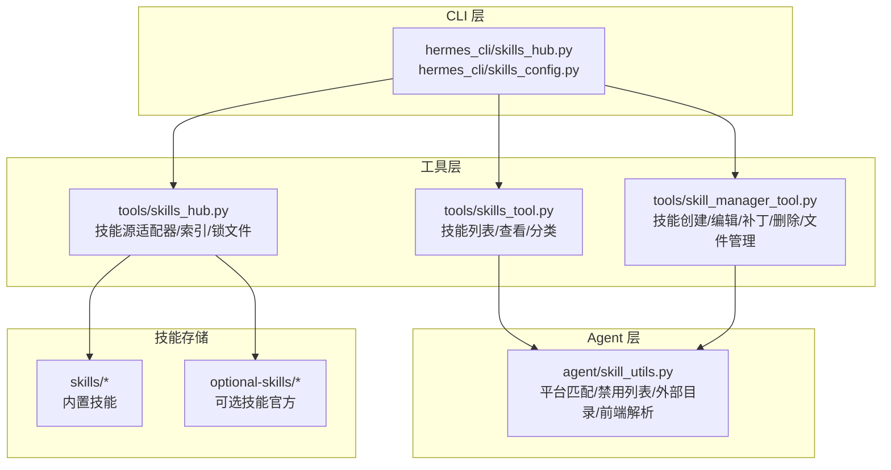
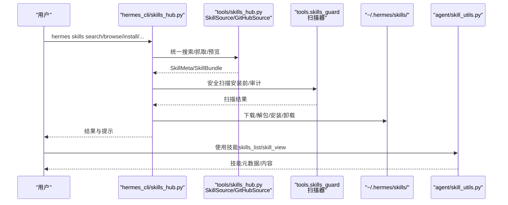
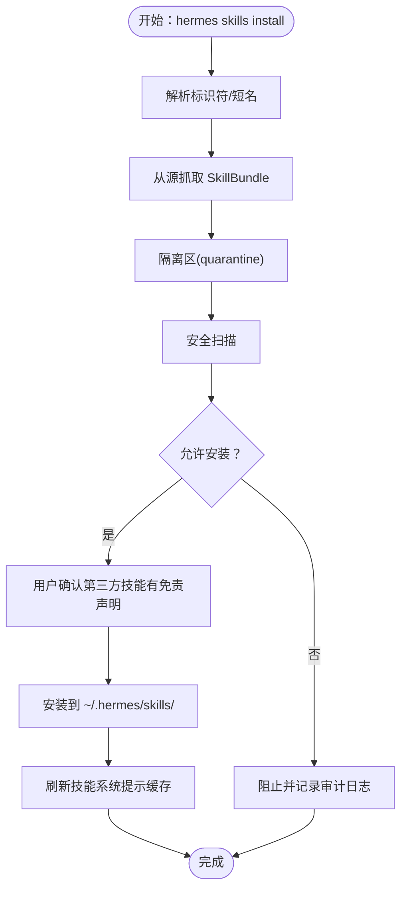
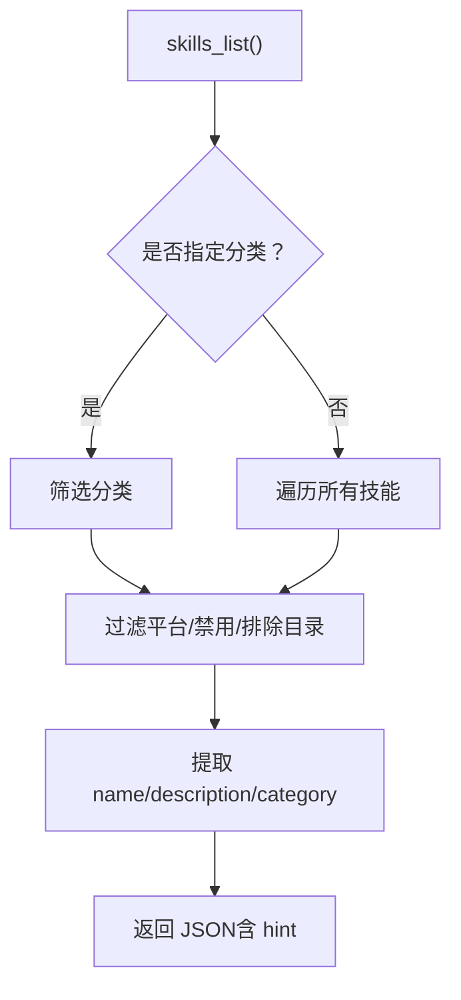
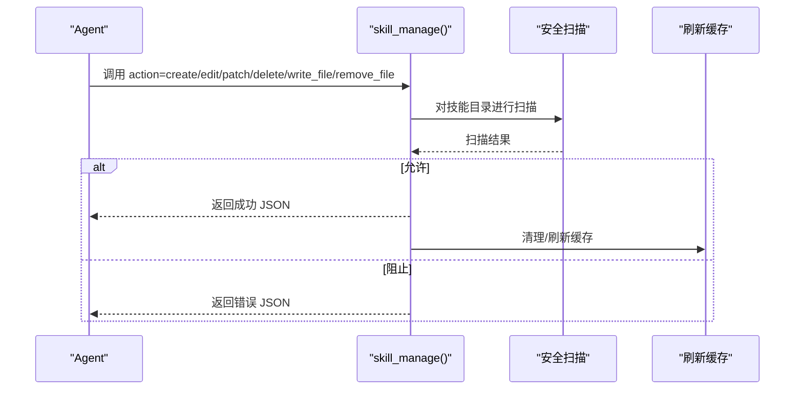
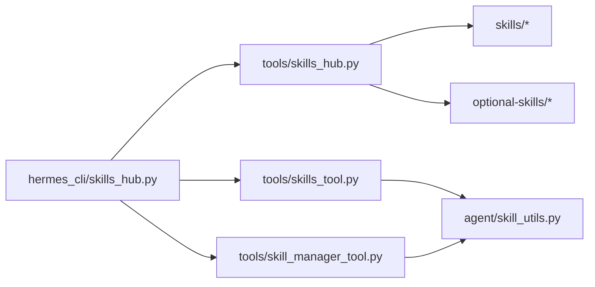

# 技能系统

<cite>
**本文引用的文件**
- [skills_hub.py](file://tools/skills_hub.py)
- [skills_tool.py](file://tools/skills_tool.py)
- [skill_manager_tool.py](file://tools/skill_manager_tool.py)
- [skills_hub.py（CLI）](file://hermes_cli/skills_hub.py)
- [skills_config.py](file://hermes_cli/skills_config.py)
- [skill_utils.py](file://agent/skill_utils.py)
- [SKILL.md 示例：数据科学](file://skills/data-science/jupyter-live-kernel/SKILL.md)
- [SKILL.md 示例：Notion](file://skills/productivity/notion/SKILL.md)
- [SKILL.md 示例：ASCII 艺术](file://skills/creative/ascii-art/SKILL.md)
- [SKILL.md 示例：代码库检查](file://skills/github/codebase-inspection/SKILL.md)
- [SKILL.md 示例：Dogfood 测试](file://skills/dogfood/SKILL.md)
- [可选技能说明](file://optional-skills/DESCRIPTION.md)
</cite>

## 目录
1. [简介](#简介)
2. [项目结构](#项目结构)
3. [核心组件](#核心组件)
4. [架构总览](#架构总览)
5. [详细组件分析](#详细组件分析)
6. [依赖关系分析](#依赖关系分析)
7. [性能考量](#性能考量)
8. [故障排除指南](#故障排除指南)
9. [结论](#结论)
10. [附录](#附录)

## 简介
本指南面向使用者与开发者，系统讲解 Hermes Agent 的“技能系统”。内容覆盖：
- 技能的概念与工作机制：创建、学习、改进流程
- 技能市场（Skills Hub）的使用：搜索、安装、更新、审计与卸载
- 内置技能与可选技能的功能与使用场景：代码编写、文档处理、数据分析、创意工具等
- 技能开发指南：模板、参数与返回值约定、安全扫描与合规
- 版本管理与依赖关系
- 调试与故障排除方法

## 项目结构
技能系统由以下关键模块组成：
- 工具层（tools）：技能发现、查看、管理与安全扫描
- CLI 层（hermes_cli）：技能市场命令行入口与配置管理
- Agent 层（agent）：技能元数据解析、平台匹配、禁用列表与外部目录支持
- 内置与可选技能：位于 skills 与 optional-skills 目录中，以 SKILL.md 作为统一规范

图示来源
- [skills_hub.py（CLI）:144-598](file://hermes_cli/skills_hub.py#L144-L598)
- [skills_hub.py:284-800](file://tools/skills_hub.py#L284-L800)
- [skills_tool.py:1-120](file://tools/skills_tool.py#L1-L120)
- [skill_manager_tool.py:1-120](file://tools/skill_manager_tool.py#L1-L120)
- [skill_utils.py:1-120](file://agent/skill_utils.py#L1-L120)

章节来源
- [skills_hub.py（CLI）:144-598](file://hermes_cli/skills_hub.py#L144-L598)
- [skills_hub.py:284-800](file://tools/skills_hub.py#L284-L800)
- [skills_tool.py:1-120](file://tools/skills_tool.py#L1-L120)
- [skill_manager_tool.py:1-120](file://tools/skill_manager_tool.py#L1-L120)
- [skill_utils.py:1-120](file://agent/skill_utils.py#L1-L120)

## 核心组件
- 技能市场（Skills Hub）
  - 搜索、浏览、预览、安装、更新、审计、卸载、发布
  - 支持多源：GitHub、Well-Known Endpoint、官方可选技能等
- 技能工具
  - 列出技能、查看技能详情、加载参考文件与模板
  - 平台过滤、禁用列表、外部目录支持
- 技能管理器（Agent 可调用）
  - 创建/编辑/补丁/删除用户技能；写入/删除支持文件；安全扫描
- 配置与平台
  - 全局/平台维度禁用技能；平台匹配；外部技能目录

章节来源
- [skills_hub.py（CLI）:144-598](file://hermes_cli/skills_hub.py#L144-L598)
- [skills_tool.py:719-800](file://tools/skills_tool.py#L719-L800)
- [skill_manager_tool.py:569-743](file://tools/skill_manager_tool.py#L569-L743)
- [skill_utils.py:121-235](file://agent/skill_utils.py#L121-L235)

## 架构总览
技能系统的运行时交互如下：

图示来源
- [skills_hub.py（CLI）:144-598](file://hermes_cli/skills_hub.py#L144-L598)
- [skills_hub.py:284-800](file://tools/skills_hub.py#L284-L800)
- [skill_manager_tool.py:569-743](file://tools/skill_manager_tool.py#L569-L743)
- [skill_utils.py:121-235](file://agent/skill_utils.py#L121-L235)

## 详细组件分析

### 技能市场（Skills Hub）
- 功能要点
  - 搜索与浏览：支持按名称、描述、标签检索；分页展示；去重与信任度排序
  - 预览：无需安装即可查看 SKILL.md 摘要
  - 安装：自动分类、路径校验、隔离区（quarantine）、安全扫描、确认安装
  - 更新：检查上游变更并增量更新
  - 审计：对已安装技能重新扫描
  - 卸载：删除并清理缓存
  - 发布：本地技能自检后提交到 GitHub（PR）或 ClawHub（待支持）
  - Tap 管理：添加/移除自定义 GitHub 源
- 关键实现
  - 多源适配器：GitHubSource、WellKnownSkillSource 等
  - 安全策略：扫描器与安装策略组合
  - 状态管理：HubLockFile 记录已安装技能来源与信任级别

图示来源
- [skills_hub.py（CLI）:307-447](file://hermes_cli/skills_hub.py#L307-L447)
- [skills_hub.py:284-800](file://tools/skills_hub.py#L284-L800)

章节来源
- [skills_hub.py（CLI）:144-598](file://hermes_cli/skills_hub.py#L144-L598)
- [skills_hub.py:284-800](file://tools/skills_hub.py#L284-L800)

### 技能工具（skills_tool）
- 功能要点
  - skills_list：仅返回最小元数据（名称、描述、分类），用于高效发现
  - skill_view：按需加载完整内容、标签、相关文件
  - categories：列出分类及其描述（支持 DESCRIPTION.md）
  - 平台过滤：根据 frontmatter.platforms 过滤不兼容技能
  - 外部目录：支持 skills.external_dirs，优先本地目录
- 前端解析：统一解析 SKILL.md 的 YAML frontmatter，兼容 agentskills.io 规范

图示来源
- [skills_tool.py:719-784](file://tools/skills_tool.py#L719-L784)
- [skill_utils.py:52-87](file://agent/skill_utils.py#L52-L87)

章节来源
- [skills_tool.py:719-800](file://tools/skills_tool.py#L719-L800)
- [skill_utils.py:92-116](file://agent/skill_utils.py#L92-L116)

### 技能管理器（Agent 可调用）
- 功能要点
  - 创建：校验名称/分类/frontmatter/大小限制；原子写入；安全扫描
  - 编辑/补丁：全量替换或基于模糊匹配的精准替换；支持目标文件路径
  - 文件管理：write_file/remove_file；路径白名单与防逃逸校验
  - 删除：递归删除并清理空目录
  - 缓存刷新：修改后刷新系统提示缓存
- 参数与返回
  - 接口：skill_manage(action, name, content?, category?, file_path?, file_content?, old_string?, new_string?, replace_all?)
  - 返回：JSON 字符串（success/error/message/path 等）

图示来源
- [skill_manager_tool.py:569-743](file://tools/skill_manager_tool.py#L569-L743)

章节来源
- [skill_manager_tool.py:569-743](file://tools/skill_manager_tool.py#L569-L743)

### 配置与平台（hermes_cli/skills_config）
- 功能要点
  - 全局与平台维度禁用技能（CLI 交互式配置）
  - 支持按类别批量启用/禁用
  - 平台选择：CLI、Telegram、Discord、Slack、WhatsApp、Signal、Email、HomeAssistant、Mattermost、Matrix、DingTalk、Feishu、WeCom、Webhook
- 存储位置
  - ~/.hermes/config.yaml 中的 skills.disabled 与 skills.platform_disabled

章节来源
- [skills_config.py:1-189](file://hermes_cli/skills_config.py#L1-L189)

### 技能模板与规范（SKILL.md）
- 必填字段
  - name（≤64 字符）
  - description（≤1024 字符）
- 可选字段
  - version、license、author、metadata.hermes.tags、metadata.hermes.related_skills、prerequisites.env_vars/commands、platforms（macos/linux/windows）、setup.collect_secrets、required_environment_variables 等
- 目录结构建议
  - references/、templates/、scripts/、assets/
- 示例参考
  - 数据科学：Jupyter Live Kernel
  - 生产力：Notion API
  - 创意：ASCII Art
  - 开发：Plan
  - 测试：Dogfood QA

章节来源
- [SKILL.md 示例：数据科学:1-172](file://skills/data-science/jupyter-live-kernel/SKILL.md#L1-L172)
- [SKILL.md 示例：Notion:1-172](file://skills/productivity/notion/SKILL.md#L1-L172)
- [SKILL.md 示例：ASCII 艺术:1-322](file://skills/creative/ascii-art/SKILL.md#L1-L322)
- [SKILL.md 示例：代码库检查:1-116](file://skills/github/codebase-inspection/SKILL.md#L1-L116)
- [SKILL.md 示例：Dogfood 测试:1-162](file://skills/dogfood/SKILL.md#L1-L162)

### 内置技能与可选技能
- 内置技能（skills/*）
  - 通过 tools/skills_tool 与 agent/skill_utils 自动发现与加载
  - 支持分类、平台过滤、禁用列表
- 可选技能（optional-skills/*）
  - 官方维护但默认未激活，可通过 Skills Hub 安装到 ~/.hermes/skills/
  - 适合小众、实验性或重型依赖场景

章节来源
- [skills_tool.py:520-595](file://tools/skills_tool.py#L520-L595)
- [skill_utils.py:173-235](file://agent/skill_utils.py#L173-L235)
- [可选技能说明:1-25](file://optional-skills/DESCRIPTION.md#L1-L25)

## 依赖关系分析

图示来源
- [skills_hub.py（CLI）:144-598](file://hermes_cli/skills_hub.py#L144-L598)
- [skills_hub.py:284-800](file://tools/skills_hub.py#L284-L800)
- [skills_tool.py:1-120](file://tools/skills_tool.py#L1-L120)
- [skill_manager_tool.py:1-120](file://tools/skill_manager_tool.py#L1-L120)
- [skill_utils.py:1-120](file://agent/skill_utils.py#L1-L120)

章节来源
- [skills_hub.py（CLI）:144-598](file://hermes_cli/skills_hub.py#L144-L598)
- [skills_hub.py:284-800](file://tools/skills_hub.py#L284-L800)
- [skills_tool.py:1-120](file://tools/skills_tool.py#L1-L120)
- [skill_manager_tool.py:1-120](file://tools/skill_manager_tool.py#L1-L120)
- [skill_utils.py:1-120](file://agent/skill_utils.py#L1-L120)

## 性能考量
- 技能发现与列表
  - skills_list 仅读取 frontmatter，避免加载大体量正文，降低 token 消耗
  - 分类与平台过滤在发现阶段即剔除不必要项
- 索引与缓存
  - GitHubSource 使用树 API 一次性拉取目录树，减少 API 调用次数
  - 索引缓存（index-cache）按小时过期，平衡新鲜度与性能
- 安全扫描
  - 安装前/审计时进行扫描，避免在生产环境引入高风险内容
- 缓存刷新
  - 安装/卸载/编辑技能后刷新系统提示缓存，确保最新技能生效

## 故障排除指南
- 安装被阻止
  - 检查扫描报告与审计日志，确认是否存在危险行为或路径不安全
  - 使用 hermes skills audit 重新扫描已安装技能
- 权限与认证
  - GitHub 源需要 GITHUB_TOKEN 或 gh CLI 登录；未认证时请求速率受限
- 平台不兼容
  - 检查 SKILL.md frontmatter 中的 platforms 字段，确认当前系统是否匹配
- 技能不可见
  - 确认未被全局或平台禁用；检查 skills.external_dirs 是否正确配置
  - 使用 hermes skills list --source hub|builtin|local 查看来源分布
- 编辑失败
  - 补丁需唯一匹配或开启 replace_all；若匹配失败，查看返回中的 file_preview 以便修正
  - 确保 frontmatter 结构完整，避免破坏 YAML 前言

章节来源
- [skills_hub.py（CLI）:600-666](file://hermes_cli/skills_hub.py#L600-L666)
- [skills_hub.py:129-246](file://tools/skills_hub.py#L129-L246)
- [skills_tool.py:520-595](file://tools/skills_tool.py#L520-L595)
- [skill_manager_tool.py:369-453](file://tools/skill_manager_tool.py#L369-L453)

## 结论
Hermes Agent 的技能系统以 SKILL.md 为统一规范，结合多源技能市场、严格的安装与审计流程、以及灵活的配置与平台适配，实现了“可发现、可安装、可管理、可扩展”的能力体系。对于使用者，建议优先使用内置与可选技能，并通过 Skills Hub 进行搜索与安装；对于开发者，可利用 skill_manage 快速沉淀经验为可复用技能，并遵循模板与安全规范。

## 附录

### 技能市场常用命令速查
- hermes skills search <关键词> [--source all|official|github|well-known] [--limit N]
- hermes skills browse [--source all|official] [--page N] [--page-size M]
- hermes skills inspect <标识符>
- hermes skills install <标识符> [--category 分类] [--force] [--skip-confirm] [--now]
- hermes skills check
- hermes skills update
- hermes skills audit [<技能名>]
- hermes skills uninstall <技能名> [--skip-confirm] [--now]
- hermes skills tap list|add|remove <仓库>
- hermes skills publish <路径> --to github|clawhub --repo owner/repo

章节来源
- [skills_hub.py（CLI）:144-598](file://hermes_cli/skills_hub.py#L144-L598)