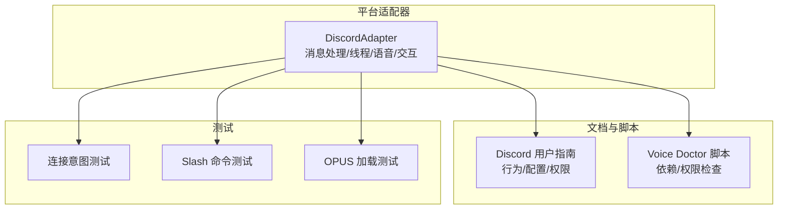
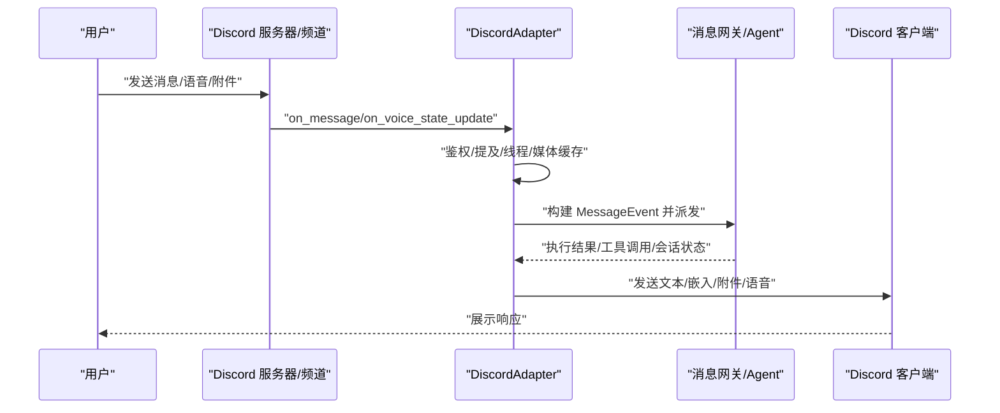
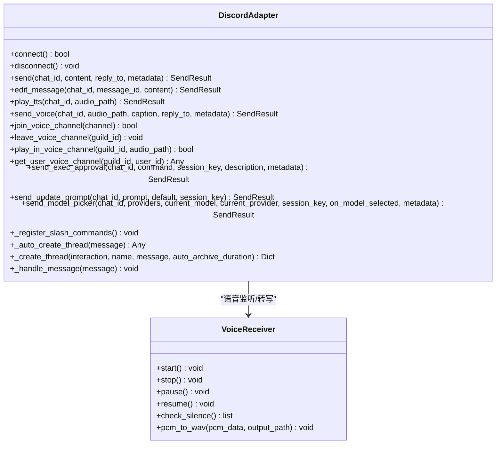
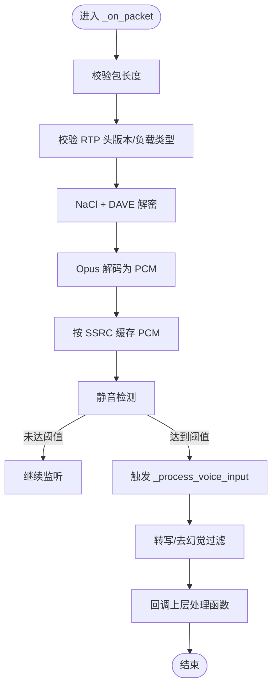
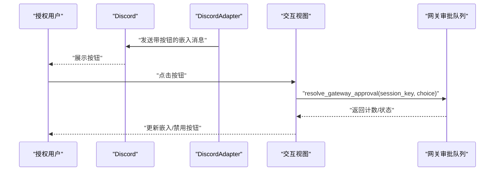
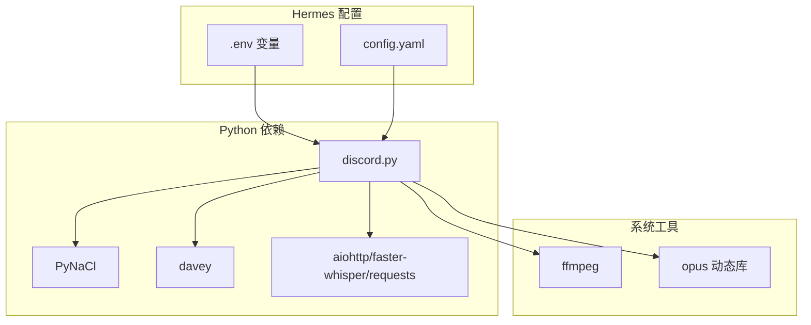

# Discord 平台集成

<cite>
**本文档引用的文件**
- [discord.py](file://gateway/platforms/discord.py)
- [discord.md](file://website/docs/user-guide/messaging/discord.md)
- [discord-voice-doctor.py](file://scripts/discord-voice-doctor.py)
- [test_discord_connect.py](file://tests/gateway/test_discord_connect.py)
- [test_discord_slash_commands.py](file://tests/gateway/test_discord_slash_commands.py)
- [test_discord_opus.py](file://tests/gateway/test_discord_opus.py)
</cite>

## 目录
1. [简介](#简介)
2. [项目结构](#项目结构)
3. [核心组件](#核心组件)
4. [架构总览](#架构总览)
5. [详细组件分析](#详细组件分析)
6. [依赖关系分析](#依赖关系分析)
7. [性能考虑](#性能考虑)
8. [故障排除指南](#故障排除指南)
9. [结论](#结论)
10. [附录](#附录)

## 简介
本指南面向在 Hermes Agent 中集成 Discord 平台的用户与运维人员，系统讲解从零开始创建与配置 Discord 机器人的完整流程，深入解析平台适配器的功能特性（文本消息处理、线程隔离、按钮交互、语音消息与语音通道），并提供安全配置建议与最佳实践。文档同时覆盖 Discord 特有的功能使用示例与常见问题排查方法。

## 项目结构
Hermes 的 Discord 集成由“平台适配器 + 文档与脚本 + 测试”三部分组成：
- 平台适配器：实现 Discord 事件接入、消息分发、线程与语音支持、交互式 UI 组件等
- 用户文档：官方部署与行为说明，涵盖环境变量、权限与会话模型
- 诊断脚本：语音模式依赖检查工具
- 单元测试：验证连接意图请求、自动建线程、Slash 命令注册等关键路径

图表来源
- [discord.py:409-2399](file://gateway/platforms/discord.py#L409-L2399)
- [discord.md:1-535](file://website/docs/user-guide/messaging/discord.md#L1-L535)
- [discord-voice-doctor.py:1-390](file://scripts/discord-voice-doctor.py#L1-L390)
- [test_discord_connect.py:78-111](file://tests/gateway/test_discord_connect.py#L78-L111)
- [test_discord_slash_commands.py:73-120](file://tests/gateway/test_discord_slash_commands.py#L73-L120)
- [test_discord_opus.py:9-31](file://tests/gateway/test_discord_opus.py#L9-L31)

章节来源
- [discord.py:1-2828](file://gateway/platforms/discord.py#L1-L2828)
- [discord.md:1-535](file://website/docs/user-guide/messaging/discord.md#L1-L535)

## 核心组件
- DiscordAdapter：平台适配器核心类，负责连接 Discord、接收消息、发送响应、线程与语音支持、交互式 UI（按钮、下拉菜单）、Slash 命令注册与处理、会话路由与媒体缓存等
- VoiceReceiver：语音数据捕获与解码组件，支持 Discord 加密传输（NaCl + DAVE E2EE）、Opus 解码、静音检测与转写
- 交互式 UI 组件：ExecApprovalView、UpdatePromptView、ModelPickerView，用于危险命令审批、更新提示与模型选择
- 配置与行为：通过环境变量与 config.yaml 控制提及规则、自由回复通道、自动建线程、忽略通道、反应反馈等

章节来源
- [discord.py:409-2399](file://gateway/platforms/discord.py#L409-L2399)

## 架构总览
Hermes 在 Discord 上采用“事件驱动 + 消息网关”的架构：DiscordAdapter 订阅消息事件，进行鉴权与上下文判断后，将消息封装为统一的 MessageEvent，交由上层 Agent 执行，再将结果以 Discord 支持的格式（Markdown、嵌入、附件）回传。

图表来源
- [discord.py:552-610](file://gateway/platforms/discord.py#L552-L610)
- [discord.py:2190-2433](file://gateway/platforms/discord.py#L2190-L2433)

章节来源
- [discord.py:409-2399](file://gateway/platforms/discord.py#L409-L2399)

## 详细组件分析

### 平台适配器（DiscordAdapter）
- 连接与鉴权
  - 自动请求并按需启用 Privileged Intents（Message Content、Server Members、Voice States）
  - 使用令牌锁防止重复启动同一 Bot
  - 允许用户名或显示名解析为用户 ID，便于灵活配置允许列表
- 消息处理
  - 支持 DM、普通频道、线程三种聊天类型
  - 提及规则与自由回复通道策略
  - 自动建线程（可配置归档时长）
  - 附件缓存与注入（图片/音频/文档），支持文本内容注入
- 交互式 UI
  - 按钮式危险命令审批（允许一次/会话/永久/拒绝）
  - 更新提示（是/否）
  - 模型选择下拉菜单（两步：提供商 → 模型）
- Slash 命令
  - 内置命令：/new、/reset、/model、/reasoning、/personality、/retry、/undo、/status、/sethome、/stop、/compress、/title、/resume、/usage、/provider、/help、/insights、/reload-mcp、/voice、/update、/approve、/deny、/thread、/queue、/background、/btw
  - 技能命令自动注册为 Discord Slash 命令（最多 100 个）
- 语音能力
  - 语音消息转写（本地 faster-whisper 或云端 Whisper）
  - 语音通道加入/播放/自动断开
  - 语音监听与静音检测，PCM → WAV 转换与转写

图表来源
- [discord.py:409-2399](file://gateway/platforms/discord.py#L409-L2399)

章节来源
- [discord.py:409-2399](file://gateway/platforms/discord.py#L409-L2399)

### 语音通道与监听（VoiceReceiver）
- 数据流
  - 从 Discord VoiceConnection 的 SocketListener 接收加密 RTP 包
  - 使用 NaCl 与 DAVE E2EE 解密
  - Opus 解码为 PCM，静音检测后触发转写回调
- 关键参数
  - 采样率 48kHz、立体声、静音阈值与最小语音时长
  - UDP Keepalive 防止空闲断连
- 输出
  - 将 PCM 缓冲转换为 16kHz 单声道 WAV，供 Whisper 转写
  - 回调上层处理函数，传递用户 ID 与转写文本

图表来源
- [discord.py:205-374](file://gateway/platforms/discord.py#L205-L374)
- [discord.py:1218-1252](file://gateway/platforms/discord.py#L1218-L1252)

章节来源
- [discord.py:83-407](file://gateway/platforms/discord.py#L83-L407)

### 交互式 UI 组件
- ExecApprovalView：危险命令审批（Allow Once/Session/Always/Deny）
- UpdatePromptView：更新确认（Yes/No）
- ModelPickerView：两步模型选择（Provider → Model）

图表来源
- [discord.py:2441-2534](file://gateway/platforms/discord.py#L2441-L2534)
- [discord.py:2535-2613](file://gateway/platforms/discord.py#L2535-L2613)
- [discord.py:2614-2828](file://gateway/platforms/discord.py#L2614-L2828)

章节来源
- [discord.py:1971-2106](file://gateway/platforms/discord.py#L1971-L2106)

### Slash 命令与自动建线程
- Slash 命令注册：内置命令 + 技能命令（最多 100 个）
- 自动建线程：在频道中 @ 机器人时自动创建线程，保持主频道整洁
- 线程上下文：线程内消息无需再次 @ 机器人；父频道/论坛上下文名称格式化

章节来源
- [discord.py:1561-1743](file://gateway/platforms/discord.py#L1561-L1743)
- [discord.py:1789-1948](file://gateway/platforms/discord.py#L1789-L1948)
- [discord.py:2190-2399](file://gateway/platforms/discord.py#L2190-L2399)

## 依赖关系分析
- 第三方库
  - discord.py：事件与 API 访问
  - PyNaCl：加密（NaCl）
  - davey：DAVE E2EE
  - ffmpeg：音频处理
  - faster-whisper/OpenAI Whisper/ElevenLabs：语音转写与 TTS
- 系统库
  - ctypes.util.find_library：查找系统 Opus 动态库
  - macOS Homebrew 路径回退
- 环境变量与配置
  - DISCORD_BOT_TOKEN、DISCORD_ALLOWED_USERS、DISCORD_HOME_CHANNEL 等
  - config.yaml 中的 discord.* 与全局会话策略

图表来源
- [discord.py:29-40](file://gateway/platforms/discord.py#L29-L40)
- [discord-voice-doctor.py:60-171](file://scripts/discord-voice-doctor.py#L60-L171)
- [discord.md:265-423](file://website/docs/user-guide/messaging/discord.md#L265-L423)

章节来源
- [discord.py:29-40](file://gateway/platforms/discord.py#L29-L40)
- [discord-voice-doctor.py:60-171](file://scripts/discord-voice-doctor.py#L60-L171)
- [discord.md:265-423](file://website/docs/user-guide/messaging/discord.md#L265-L423)

## 性能考虑
- 消息拆分与限长：单条消息超过 2000 字符自动拆分
- 附件缓存：图片/音频/文档下载到本地缓存，避免 CDN 过期导致访问失败
- 语音处理：静音检测与定时器减少 CPU 占用；播放前暂停监听以避免回音
- 线程数量限制：线程参与集合持久化并限制最大条目，避免无限增长
- 速率限制：依赖 Discord API 限速，避免频繁创建线程或发送消息

章节来源
- [discord.py:750-820](file://gateway/platforms/discord.py#L750-L820)
- [discord.py:2151-2190](file://gateway/platforms/discord.py#L2151-L2190)

## 故障排除指南
- 机器人在线但不回复
  - 检查“消息内容意图”是否开启
  - 确认 DISCORD_ALLOWED_USERS 是否正确配置
- “Disallowed Intents”错误
  - 启用 Presence、Server Members、Message Content 三项意图
- 无法看到特定频道消息
  - 为机器人角色授予“查看频道/阅读消息历史”
- 403 权限不足
  - 重新邀请机器人或调整服务器角色权限
- 机器人离线
  - 确认 hermes gateway 正在运行且 DISCORD_BOT_TOKEN 有效
- “用户未被允许”
  - 将用户 ID 添加到 DISCORD_ALLOWED_USERS
- 共享上下文问题
  - 设置 group_sessions_per_user: true，确保每用户独立会话

章节来源
- [discord.md:475-531](file://website/docs/user-guide/messaging/discord.md#L475-L531)

## 结论
Hermes 的 Discord 集成提供了完整的消息、线程、语音与交互式 UI 能力，配合严格的鉴权与会话隔离策略，既满足个人使用场景，也能在多用户共享频道中保持安全与清晰。通过本文档的步骤与最佳实践，您可以快速完成机器人创建、权限配置与安全加固，并充分利用平台特性提升用户体验。

## 附录

### Discord 机器人创建与配置步骤
- 创建应用与机器人
  - 开发者门户创建应用，启用 Public Bot
  - 在 Bot 页面开启 Message Content Intent 与 Server Members Intent
  - 获取 Bot Token
- 生成邀请链接与权限
  - 使用安装页生成带权限的链接（至少包含 View Channels、Send Messages、Embed Links、Attach Files、Read Message History）
  - 或手动构造 URL（包含 scopes 与权限整数）
- 邀请机器人至服务器
  - 使用管理员权限打开链接并授权
- 获取用户 ID
  - 开启开发者模式，右键复制用户 ID
- 配置 Hermes
  - 交互式 setup 或在 ~/.hermes/.env 中设置 DISCORD_BOT_TOKEN 与 DISCORD_ALLOWED_USERS
  - 启动 hermes gateway，发送测试消息验证

章节来源
- [discord.md:85-264](file://website/docs/user-guide/messaging/discord.md#L85-L264)

### 安全配置建议
- 强制设置 DISCORD_ALLOWED_USERS，仅允许受信用户
- 使用 Public Bot + Discord 提供链接简化安装流程
- 定期轮换 Bot Token，避免泄露
- 限制机器人角色权限，遵循最小权限原则
- 对语音模式启用必要的系统工具与依赖（ffmpeg、opus、PyNaCl、davey）

章节来源
- [discord.md:525-531](file://website/docs/user-guide/messaging/discord.md#L525-L531)
- [discord-voice-doctor.py:274-361](file://scripts/discord-voice-doctor.py#L274-L361)

### Discord 特有功能使用示例
- 自动建线程：在频道中 @ 机器人自动创建线程，保持主频道整洁
- 自由回复通道：为特定频道设置免 @ 规则
- 按钮交互：危险命令审批、更新确认、模型选择
- Slash 命令：/model、/voice、/thread、技能命令等
- 语音消息：自动转写与 TTS 回复；语音通道加入与播放

章节来源
- [discord.py:1561-1743](file://gateway/platforms/discord.py#L1561-L1743)
- [discord.py:1789-1948](file://gateway/platforms/discord.py#L1789-L1948)
- [discord.py:1971-2106](file://gateway/platforms/discord.py#L1971-L2106)
- [discord.md:424-474](file://website/docs/user-guide/messaging/discord.md#L424-L474)

### 测试与验证要点
- 连接意图测试：当允许列表包含用户名时自动请求 Server Members Intent
- Slash 命令测试：验证 /thread 等命令注册与交互
- OPUS 加载测试：确保 find_library 优先于 Homebrew 回退路径

章节来源
- [test_discord_connect.py:78-111](file://tests/gateway/test_discord_connect.py#L78-L111)
- [test_discord_slash_commands.py:73-120](file://tests/gateway/test_discord_slash_commands.py#L73-L120)
- [test_discord_opus.py:9-31](file://tests/gateway/test_discord_opus.py#L9-L31)