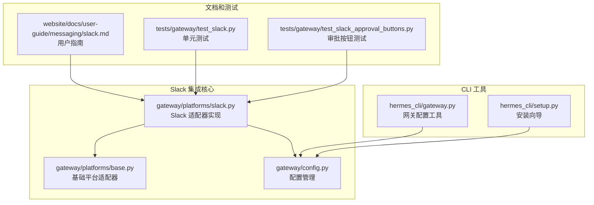
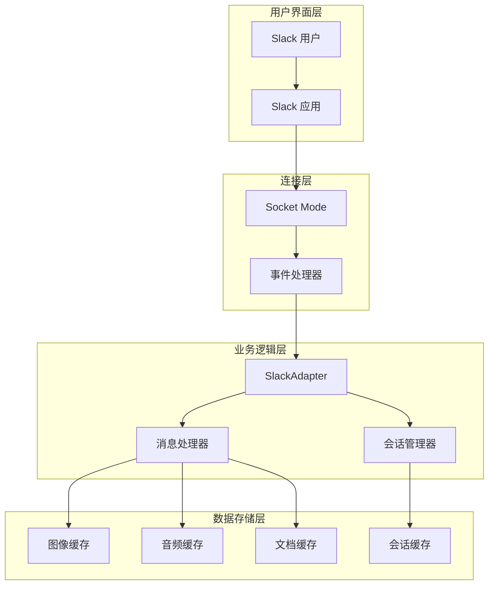
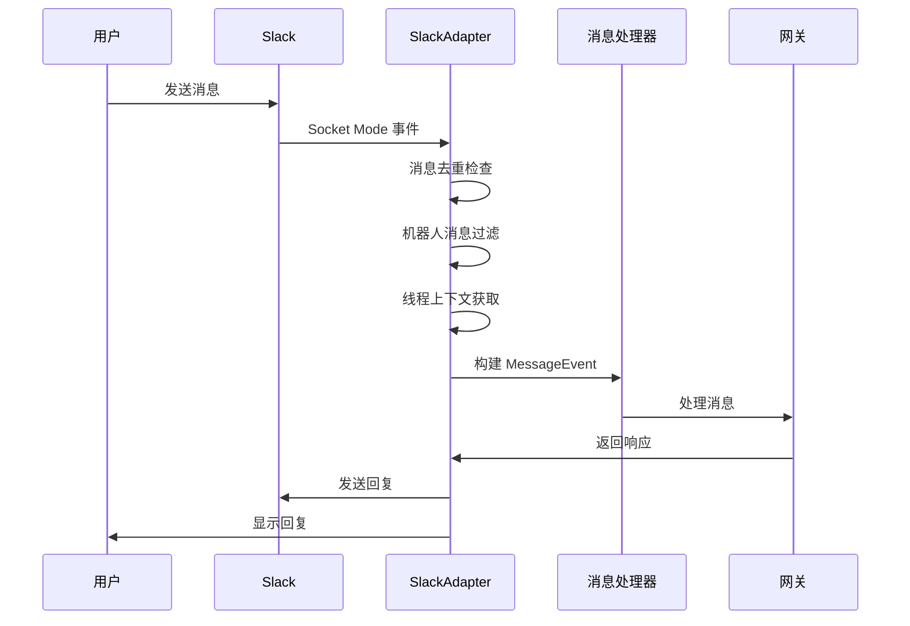
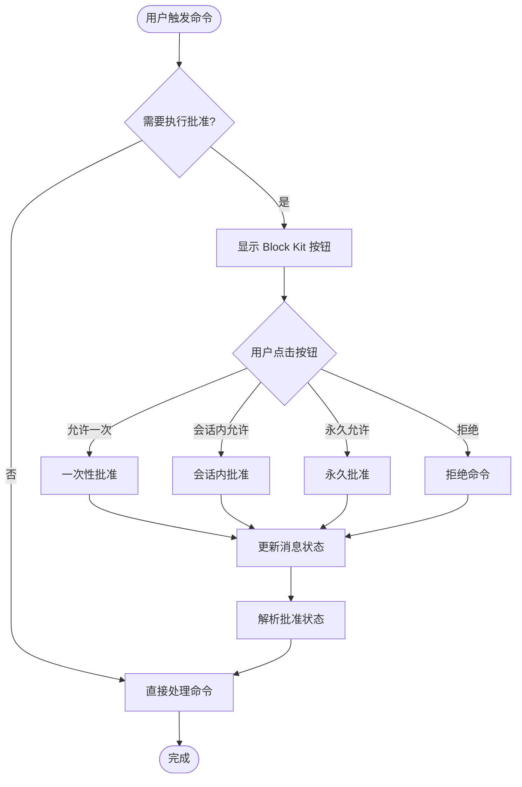
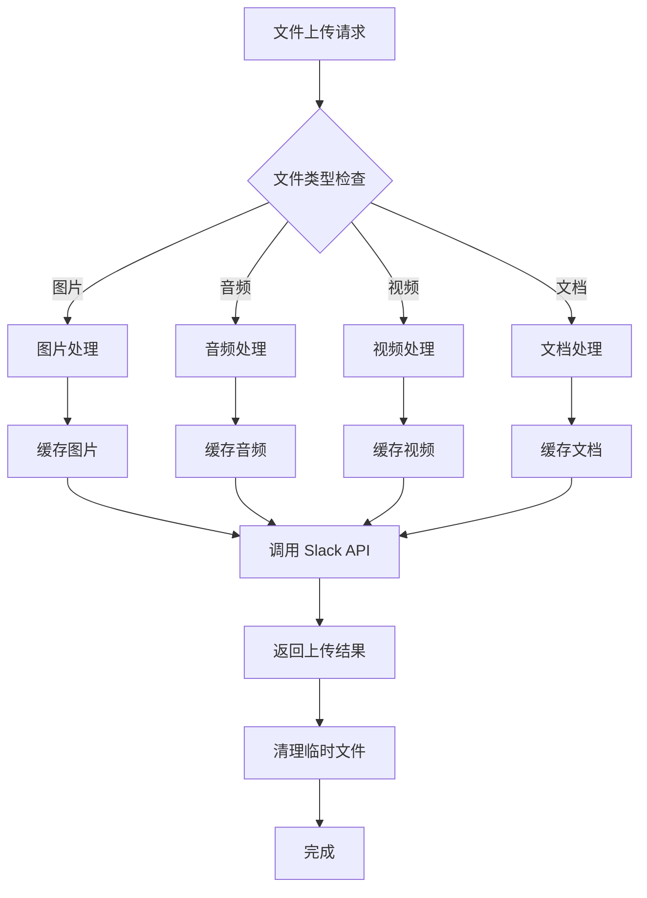
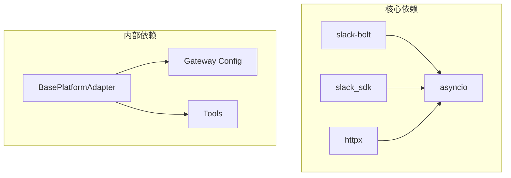
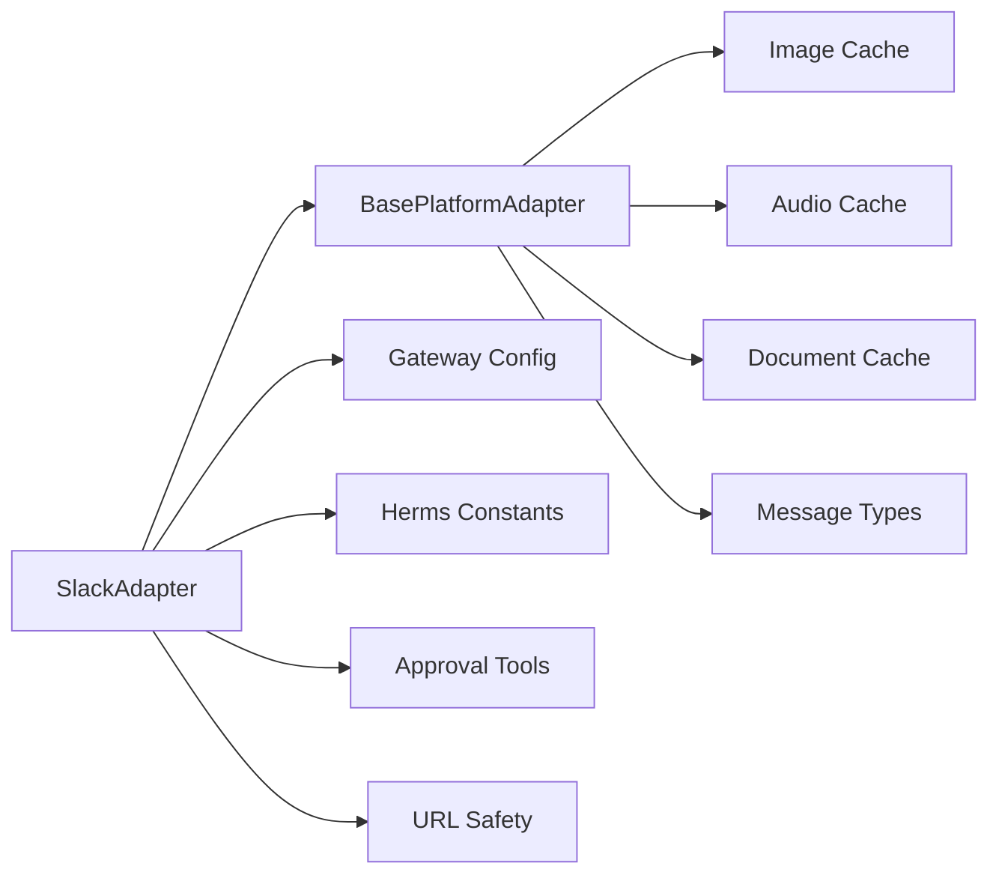

# Slack 平台集成

<cite>
**本文档引用的文件**
- [slack.py](file://gateway/platforms/slack.py)
- [slack.md](file://website/docs/user-guide/messaging/slack.md)
- [base.py](file://gateway/platforms/base.py)
- [config.py](file://gateway/config.py)
- [test_slack.py](file://tests/gateway/test_slack.py)
- [test_slack_approval_buttons.py](file://tests/gateway/test_slack_approval_buttons.py)
- [gateway.py](file://hermes_cli/gateway.py)
- [setup.py](file://hermes_cli/setup.py)
</cite>

## 目录
1. [简介](#简介)
2. [项目结构](#项目结构)
3. [核心组件](#核心组件)
4. [架构概览](#架构概览)
5. [详细组件分析](#详细组件分析)
6. [依赖关系分析](#依赖关系分析)
7. [性能考虑](#性能考虑)
8. [故障排除指南](#故障排除指南)
9. [结论](#结论)
10. [附录](#附录)

## 简介

Hermes Agent 的 Slack 平台集成为用户提供了完整的 Slack 机器人解决方案，基于现代的 Slack Bolt SDK 和 Socket Mode 连接方式。该集成支持实时消息处理、Slash 命令、Block Kit 交互式界面、文件上传下载等多种功能。

Slack 集成的主要特点包括：
- 使用 Socket Mode 进行 WebSocket 连接，无需公共 URL
- 支持多工作区同时连接
- 完整的 Block Kit 交互支持
- 智能线程管理和会话跟踪
- 多媒体文件处理（图片、音频、视频、文档）
- 安全的令牌管理和访问控制

## 项目结构

Hermes Agent 的 Slack 集成主要分布在以下目录中：

**图表来源**
- [slack.py:1-1362](file://gateway/platforms/slack.py#L1-L1362)
- [base.py:1-1697](file://gateway/platforms/base.py#L1-L1697)
- [config.py:720-919](file://gateway/config.py#L720-L919)

**章节来源**
- [slack.py:1-1362](file://gateway/platforms/slack.py#L1-L1362)
- [base.py:1-1697](file://gateway/platforms/base.py#L1-L1697)
- [config.py:720-919](file://gateway/config.py#L720-L919)

## 核心组件

### SlackAdapter 类

SlackAdapter 是整个 Slack 集成的核心类，继承自 BasePlatformAdapter，提供了完整的 Slack 平台功能：

**主要特性：**
- Socket Mode 连接管理
- 多工作区支持
- 消息事件处理
- Block Kit 交互
- 文件上传下载
- 线程上下文管理

**关键属性：**
- `_app`: AsyncApp 实例用于 Socket Mode 连接
- `_handler`: AsyncSocketModeHandler 处理 WebSocket 连接
- `_team_clients`: 工作区客户端映射
- `_team_bot_user_ids`: 工作区机器人用户 ID 映射
- `_channel_team`: 频道到工作区的映射

**章节来源**
- [slack.py:53-98](file://gateway/platforms/slack.py#L53-L98)

### 基础平台适配器

BasePlatformAdapter 提供了所有平台适配器的基础功能和接口定义：

**核心功能：**
- 消息类型定义（TEXT、PHOTO、VIDEO、AUDIO、DOCUMENT 等）
- 缓存管理（图像、音频、文档）
- 会话源构建
- 发送结果处理

**章节来源**
- [base.py:367-400](file://gateway/platforms/base.py#L367-L400)

## 架构概览

Hermes Agent 的 Slack 集成采用分层架构设计，确保了模块化和可扩展性：

**图表来源**
- [slack.py:99-233](file://gateway/platforms/slack.py#L99-L233)
- [base.py:85-364](file://gateway/platforms/base.py#L85-L364)

## 详细组件分析

### Slack 应用创建和配置

#### OAuth 应用设置

创建 Slack 应用需要以下步骤：

1. **创建应用**
   - 访问 [https://api.slack.com/apps](https://api.slack.com/apps)
   - 点击 "Create New App"
   - 选择 "From scratch"
   - 输入应用名称（如 "Hermes Agent"）
   - 选择工作区

2. **配置 Bot Token Scopes**
   必需的作用域：
   - `chat:write` - 作为机器人发送消息
   - `app_mentions:read` - 检测频道中的 @提及
   - `channels:history` - 读取公共频道消息
   - `groups:history` - 读取私有频道消息
   - `im:history` - 读取直接消息历史
   - `users:read` - 查看用户信息
   - `files:write` - 上传文件

3. **启用 Socket Mode**
   - 设置 → Socket Mode → 启用
   - 创建 App-Level Token（作用域：`connections:write`）
   - 复制 `xapp-` 开头的令牌

4. **订阅事件**
   - Features → Event Subscriptions → 启用
   - 订阅以下机器人事件：
     - `message.im` - 直接消息
     - `message.channels` - 公共频道消息
     - `message.groups` - 私有频道消息
     - `app_mention` - @提及事件

5. **启用消息标签页**
   - Features → App Home → Messages Tab → 启用
   - 允许用户通过消息标签页发送 Slash 命令和消息

**章节来源**
- [slack.md:30-144](file://website/docs/user-guide/messaging/slack.md#L30-L144)

### Slack 平台适配器核心功能

#### 实时消息处理

SlackAdapter 实现了完整的消息处理机制：

**图表来源**
- [slack.py:758-978](file://gateway/platforms/slack.py#L758-L978)

#### Slash 命令处理

Slash 命令映射机制：

| Slack 子命令 | Gateway 命令 |
|-------------|-------------|
| `compact` | `/compress` |
| `resume` | `/resume` |
| `background` | `/background` |
| `help` | `/help` |

**章节来源**
- [slack.py:1211-1250](file://gateway/platforms/slack.py#L1211-L1250)

#### Block Kit 交互系统

SlackAdapter 支持完整的 Block Kit 交互：

**图表来源**
- [slack.py:986-1146](file://gateway/platforms/slack.py#L986-L1146)

**章节来源**
- [slack.py:986-1146](file://gateway/platforms/slack.py#L986-L1146)

#### 文件上传下载系统

支持多种文件类型的处理：

**图表来源**
- [slack.py:387-409](file://gateway/platforms/slack.py#L387-L409)

**章节来源**
- [slack.py:387-409](file://gateway/platforms/slack.py#L387-L409)

### 高级功能使用

#### 视图系统和对话模式

SlackAdapter 支持复杂的交互模式：

1. **多工作区支持**
   - 每个工作区独立认证
   - 自动工作区客户端切换
   - 统一的机器人身份管理

2. **线程上下文管理**
   - 自动线程上下文获取
   - 机器人启动的线程跟踪
   - @提及线程的自动响应

3. **用户权限管理**
   - 基于成员 ID 的白名单
   - 动态配对机制
   - 不同平台的权限策略

**章节来源**
- [slack.py:78-98](file://gateway/platforms/slack.py#L78-L98)

## 依赖关系分析

### 外部依赖

Slack 集成依赖以下外部库：

**图表来源**
- [slack.py:19-28](file://gateway/platforms/slack.py#L19-L28)

### 内部依赖关系

**图表来源**
- [slack.py:34-42](file://gateway/platforms/slack.py#L34-L42)
- [base.py:28-31](file://gateway/platforms/base.py#L28-L31)

**章节来源**
- [slack.py:19-42](file://gateway/platforms/slack.py#L19-L42)
- [base.py:28-31](file://gateway/platforms/base.py#L28-L31)

## 性能考虑

### 连接优化

1. **Socket Mode 连接池**
   - 单个 App Token 管理多个工作区
   - 异步连接处理
   - 自动重连机制

2. **消息处理优化**
   - 事件去重防止重复处理
   - 线程消息缓存
   - 机器人消息快速过滤

3. **文件处理优化**
   - 异步文件下载
   - 缓存策略减少重复下载
   - 超时和重试机制

### 内存管理

1. **缓存限制**
   - 图像缓存大小限制（默认 24 小时）
   - 文档缓存大小限制（默认 24 小时）
   - 音频缓存大小限制（默认 24 小时）

2. **内存使用控制**
   - 线程消息 ID 缓存上限
   - @提及线程跟踪上限
   - 用户名缓存管理

**章节来源**
- [slack.py:82-98](file://gateway/platforms/slack.py#L82-L98)
- [base.py:173-191](file://gateway/platforms/base.py#L173-L191)

## 故障排除指南

### 常见问题和解决方案

| 问题 | 可能原因 | 解决方案 |
|------|----------|----------|
| 机器人不响应直接消息 | 缺少 `message.im` 事件订阅 | 添加 `message.im` 到事件订阅 |
| 机器人在频道中不响应 | 缺少 `message.channels` 事件订阅 | 添加 `message.channels` 和 `message.groups` |
| 机器人忽略 @提及 | 缺少 `app_mentions:read` 作用域 | 添加 `app_mentions:read` 作用域 |
| 机器人无法发布消息 | 缺少 `chat:write` 作用域 | 添加 `chat:write` 作用域 |
| "发送消息到此应用已被关闭" | 未启用消息标签页 | 在 App Home 中启用消息标签页 |
| 认证失败 | 令牌过期或错误 | 重新生成并更新令牌 |

### 调试技巧

1. **启用详细日志**
   - 检查 Slack API 错误信息
   - 监控 Socket Mode 连接状态
   - 分析消息处理流程

2. **验证配置**
   - 确认环境变量设置正确
   - 验证令牌权限范围
   - 测试事件订阅完整性

**章节来源**
- [slack.md:420-447](file://website/docs/user-guide/messaging/slack.md#L420-L447)

## 结论

Hermes Agent 的 Slack 平台集成为用户提供了强大而灵活的机器人解决方案。通过采用现代的 Slack Bolt SDK 和 Socket Mode 技术，该集成实现了：

- **完整的功能覆盖**：从基本的消息处理到高级的 Block Kit 交互
- **优秀的用户体验**：智能的线程管理和上下文感知
- **强大的安全性**：基于令牌的访问控制和多层安全检查
- **良好的可扩展性**：模块化的架构设计支持未来功能扩展

该集成特别适合需要在 Slack 环境中部署 AI 助手的企业用户，提供了从简单问答到复杂任务执行的全方位支持。

## 附录

### 配置选项参考

| 配置项 | 默认值 | 描述 |
|--------|--------|------|
| `reply_to_mode` | `"first"` | 多部分响应的线程模式 |
| `reply_in_thread` | `true` | 是否在线程中回复 |
| `reply_broadcast` | `false` | 是否广播线程回复到主频道 |
| `require_mention` | `true` | 是否要求 @提及 |
| `group_sessions_per_user` | `true` | 每个用户在共享频道中的独立会话 |

### 安全最佳实践

1. **令牌管理**
   - 使用独立的应用级别令牌
   - 定期轮换机器人令牌
   - 限制令牌权限范围

2. **访问控制**
   - 始终设置允许用户列表
   - 使用动态配对机制
   - 定期审计访问日志

3. **网络配置**
   - 使用 Socket Mode 避免公网暴露
   - 配置防火墙规则
   - 监控连接状态

**章节来源**
- [slack.md:221-335](file://website/docs/user-guide/messaging/slack.md#L221-L335)