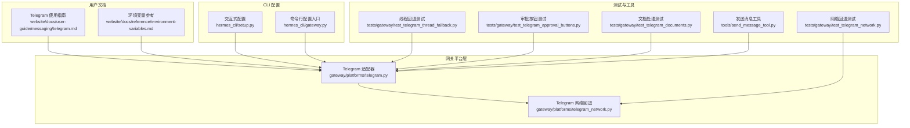
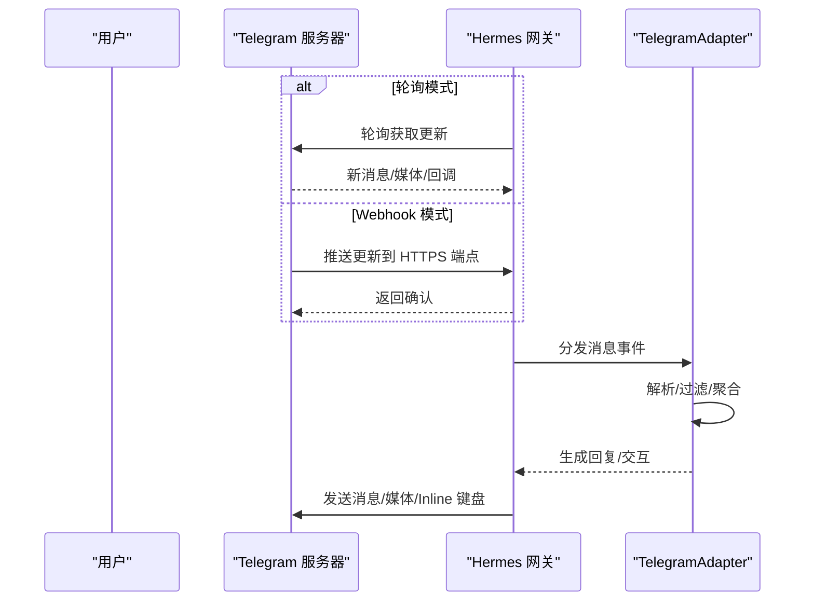
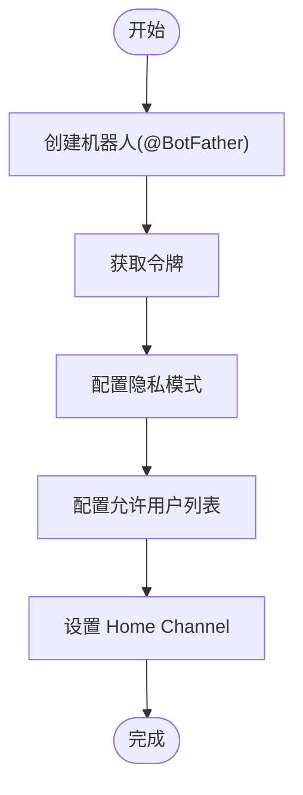
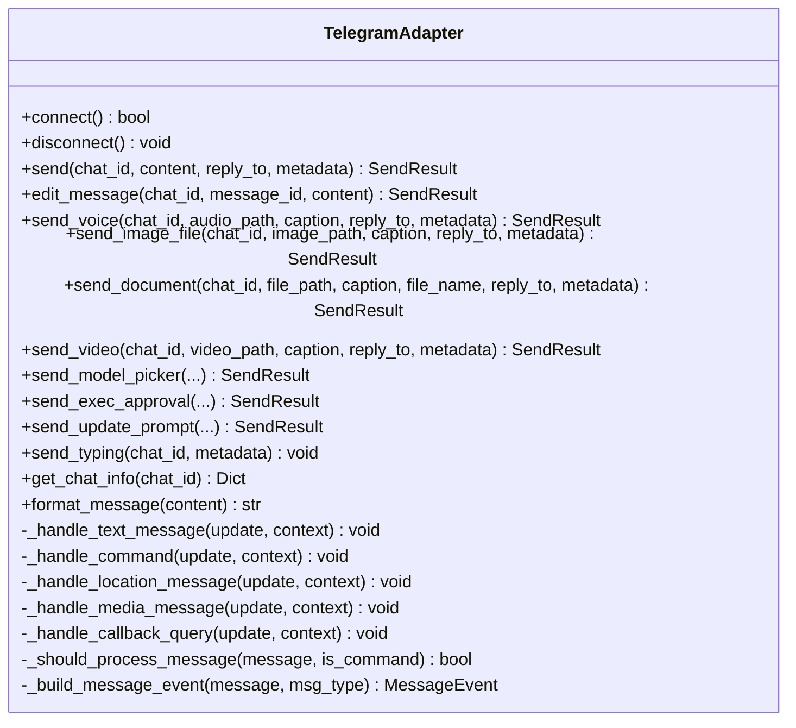
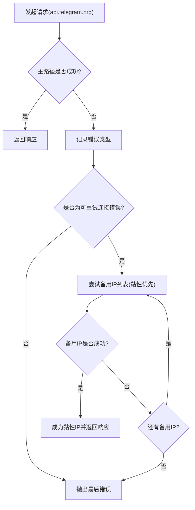
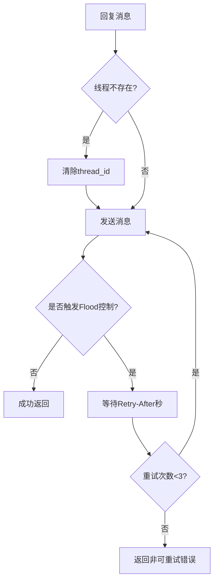
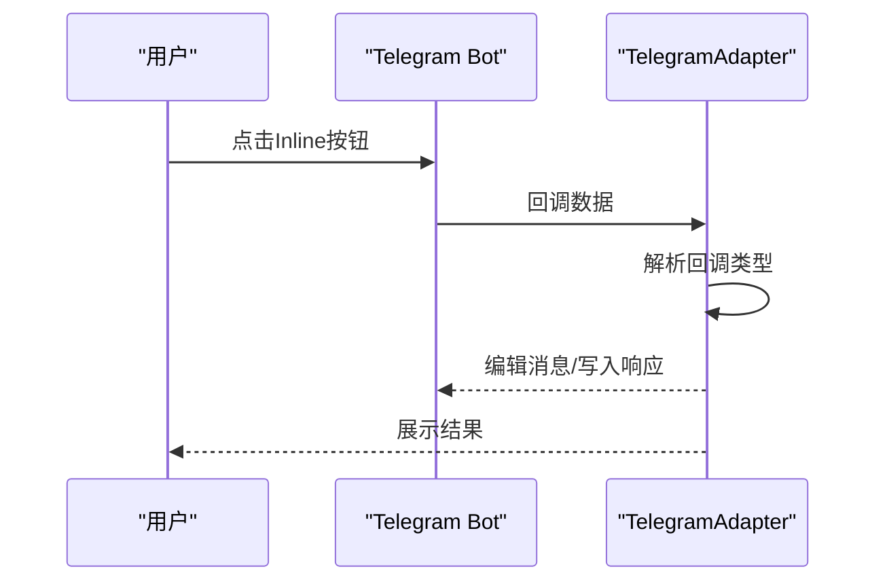
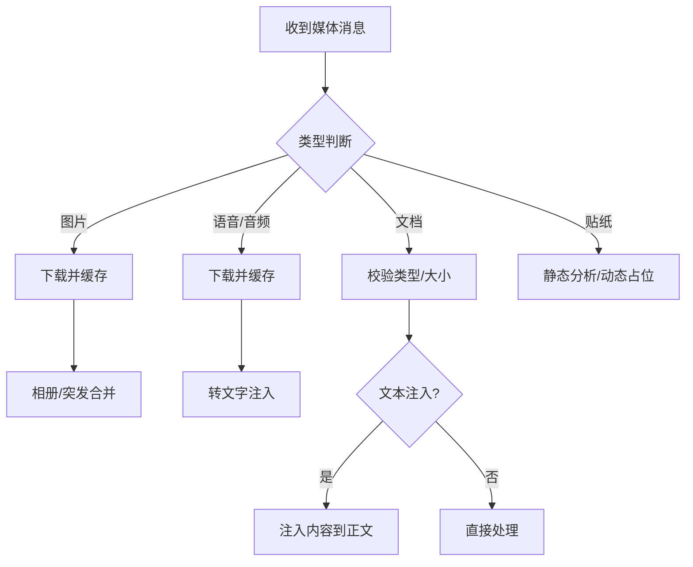
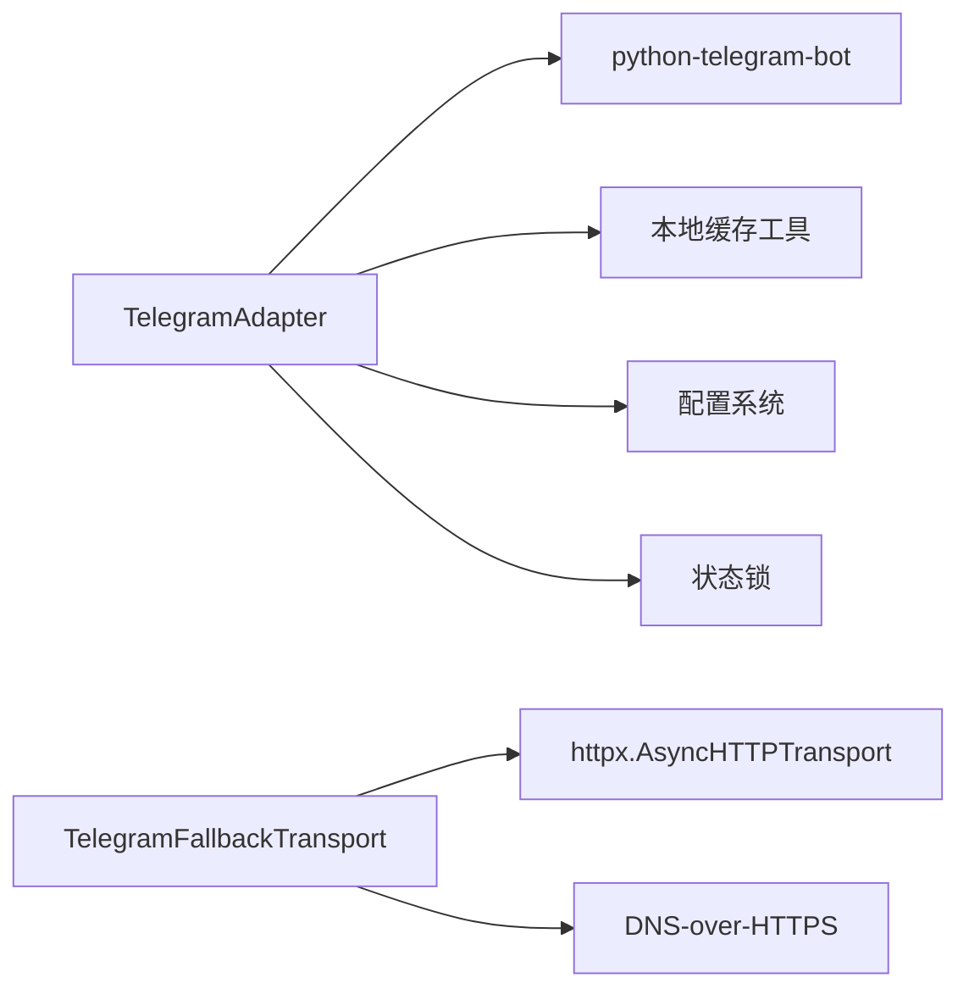

# Telegram 平台集成

<cite>
**本文档引用的文件**
- [telegram.py](file://gateway/platforms/telegram.py)
- [telegram_network.py](file://gateway/platforms/telegram_network.py)
- [telegram.md](file://website/docs/user-guide/messaging/telegram.md)
- [environment-variables.md](file://website/docs/reference/environment-variables.md)
- [setup.py](file://hermes_cli/setup.py)
- [gateway.py](file://hermes_cli/gateway.py)
- [test_telegram_network.py](file://tests/gateway/test_telegram_network.py)
- [test_telegram_thread_fallback.py](file://tests/gateway/test_telegram_thread_fallback.py)
- [test_telegram_approval_buttons.py](file://tests/gateway/test_telegram_approval_buttons.py)
- [test_telegram_documents.py](file://tests/gateway/test_telegram_documents.py)
- [send_message_tool.py](file://tools/send_message_tool.py)
</cite>

## 目录
1. [简介](#简介)
2. [项目结构](#项目结构)
3. [核心组件](#核心组件)
4. [架构总览](#架构总览)
5. [详细组件分析](#详细组件分析)
6. [依赖关系分析](#依赖关系分析)
7. [性能考虑](#性能考虑)
8. [故障排除指南](#故障排除指南)
9. [结论](#结论)
10. [附录](#附录)

## 简介
本指南面向在 Hermes Agent 中集成 Telegram 平台的用户与运维人员，系统讲解如何配置与使用 Telegram 机器人，涵盖以下主题：
- 机器人令牌获取与基础配置
- 频道/群组权限与隐私模式设置
- 适配器核心能力：消息接收、回复、媒体处理、Inline 模式交互
- 最佳实践：安全配置、速率限制处理、错误恢复
- 常见问题与排障建议

## 项目结构
Telegram 平台适配器位于网关平台层，核心代码集中在 gateway/platforms/telegram.py，并配套网络回退实现（telegram_network.py）。用户文档位于 website/docs/user-guide/messaging/telegram.md，环境变量参考位于 website/docs/reference/environment-variables.md。

**图表来源**
- [telegram.py](file://gateway/platforms/telegram.py)
- [telegram_network.py](file://gateway/platforms/telegram_network.py)
- [telegram.md](file://website/docs/user-guide/messaging/telegram.md)
- [environment-variables.md](file://website/docs/reference/environment-variables.md)
- [setup.py](file://hermes_cli/setup.py)
- [gateway.py](file://hermes_cli/gateway.py)
- [test_telegram_network.py](file://tests/gateway/test_telegram_network.py)
- [test_telegram_thread_fallback.py](file://tests/gateway/test_telegram_thread_fallback.py)
- [test_telegram_approval_buttons.py](file://tests/gateway/test_telegram_approval_buttons.py)
- [test_telegram_documents.py](file://tests/gateway/test_telegram_documents.py)
- [send_message_tool.py](file://tools/send_message_tool.py)

**章节来源**
- [telegram.py](file://gateway/platforms/telegram.py)
- [telegram_network.py](file://gateway/platforms/telegram_network.py)
- [telegram.md](file://website/docs/user-guide/messaging/telegram.md)
- [environment-variables.md](file://website/docs/reference/environment-variables.md)
- [setup.py](file://hermes_cli/setup.py)
- [gateway.py](file://hermes_cli/gateway.py)

## 核心组件
- TelegramAdapter：继承自 BasePlatformAdapter，负责与 Telegram 的连接、消息接收与发送、媒体处理、Inline 键盘交互、DM 主题与群组话题绑定、消息反应等。
- TelegramFallbackTransport：在 api.telegram.org 解析不可达时，通过备用 IPv4 地址重试连接，同时保持 TLS SNI 与 Host 头为 api.telegram.org。
- 环境变量与 CLI 配置：提供 TELEGRAM_* 系列环境变量与 hermes gateway setup 交互流程，简化令牌、允许用户列表、Webhook、Home Channel 等配置。
- 测试与工具：覆盖网络回退、线程回退、审批按钮、文档注入等关键路径，保障稳定性与可维护性。

**章节来源**
- [telegram.py](file://gateway/platforms/telegram.py)
- [telegram_network.py](file://gateway/platforms/telegram_network.py)
- [environment-variables.md](file://website/docs/reference/environment-variables.md)
- [setup.py](file://hermes_cli/setup.py)
- [gateway.py](file://hermes_cli/gateway.py)

## 架构总览
Telegram 适配器支持两种接入模式：
- 轮询模式（Polling）：默认方式，由网关主动向 Telegram 拉取更新，适合本地或常在线部署。
- Webhook 模式：由 Telegram 推送更新到网关提供的 HTTPS 端点，适合云平台自动唤醒场景。

**图表来源**
- [telegram.py](file://gateway/platforms/telegram.py)
- [telegram.md](file://website/docs/user-guide/messaging/telegram.md)

## 详细组件分析

### 1) 机器人配置与权限设置
- 获取机器人令牌：通过 @BotFather 创建机器人并获取令牌；务必妥善保管，泄露后立即撤销。
- 隐私模式：默认开启，限制机器人仅接收命令、@提及、回复自身消息等；可在 BotFather 关闭隐私模式，或提升为管理员以接收全部消息。
- 允许用户列表：通过 TELEGRAM_ALLOWED_USERS 限制可交互用户；未配置时默认拒绝所有用户。
- Home Channel：通过 /sethome 或 TELEGRAM_HOME_CHANNEL 设定，用于定时任务结果投递。

**图表来源**
- [telegram.md](file://website/docs/user-guide/messaging/telegram.md)
- [setup.py](file://hermes_cli/setup.py)
- [gateway.py](file://hermes_cli/gateway.py)

**章节来源**
- [telegram.md](file://website/docs/user-guide/messaging/telegram.md)
- [setup.py](file://hermes_cli/setup.py)
- [gateway.py](file://hermes_cli/gateway.py)

### 2) 适配器核心功能
- 消息接收与过滤：支持文本、命令、位置、媒体（图片/视频/音频/语音/文档/贴纸），并按群组隐私策略与触发规则过滤。
- 文本聚合：对 Telegram 客户端侧分片的长文本进行缓冲合并，避免重复处理。
- 媒体处理：下载媒体至本地缓存，支持贴纸视觉描述、文档内容注入（限制大小）、相册/图片突发合并。
- 回复与线程：支持按原始消息回复、按 thread_id 进行话题隔离；对无效 thread_id 自动回退。
- Inline 模式：提供交互式模型选择器、执行审批按钮、更新提示等。
- 反馈与反应：可选的消息反应（👀 成功/失败），便于用户感知处理状态。
- 语音消息：入站语音转文字，出站语音以原生“语音气泡”形式发送（需 Opus 支持）。

**图表来源**
- [telegram.py](file://gateway/platforms/telegram.py)

**章节来源**
- [telegram.py](file://gateway/platforms/telegram.py)

### 3) 网络回退与连接健壮性
- 备用 IP 回退：当 api.telegram.org 解析的主 IP 不可达时，自动尝试备用 IPv4 地址，保持 TLS SNI 与 Host 为 api.telegram.org。
- 自动发现：若未显式配置，通过 DNS-over-HTTPS 查询 Google DNS 与 Cloudflare DNS，提取不同于系统解析的结果作为备用。
- 黏性回退：一旦某个备用 IP 成功，后续请求优先使用该 IP，减少重试开销。
- 错误分类与重试：区分连接超时/错误与语义错误（如 BadRequest），对可重试错误采用指数退避，对不可重试错误（如超时）避免重复发送。

**图表来源**
- [telegram_network.py](file://gateway/platforms/telegram_network.py)
- [test_telegram_network.py](file://tests/gateway/test_telegram_network.py)

**章节来源**
- [telegram_network.py](file://gateway/platforms/telegram_network.py)
- [test_telegram_network.py](file://tests/gateway/test_telegram_network.py)

### 4) 速率限制与错误恢复
- 发送速率限制：对 flood 控制（Retry-After）进行退避重试；超过阈值时返回非可重试错误，避免阻塞流式输出。
- 线程回退：当回复目标线程不存在时，自动清除 thread_id 后重试，确保消息仍能送达。
- 轮询冲突与网络中断：检测轮询冲突（另一个实例运行）与网络中断，采用指数退避重连，超过最大次数后标记致命错误并通知重启。
- 编辑消息：对“消息未修改”“消息过长”等场景进行特殊处理，保证编辑流程稳定。

**图表来源**
- [telegram.py](file://gateway/platforms/telegram.py)
- [test_telegram_thread_fallback.py](file://tests/gateway/test_telegram_thread_fallback.py)

**章节来源**
- [telegram.py](file://gateway/platforms/telegram.py)
- [test_telegram_thread_fallback.py](file://tests/gateway/test_telegram_thread_fallback.py)

### 5) Inline 模式与交互
- 模型选择器：两步式交互（提供商→模型），支持分页导航与取消。
- 执行审批：通过内联按钮提供“一次性/会话/永久/拒绝”，点击后解除阻塞。
- 更新提示：通过内联按钮回答更新流程问题，写入响应文件。

**图表来源**
- [telegram.py](file://gateway/platforms/telegram.py)
- [test_telegram_approval_buttons.py](file://tests/gateway/test_telegram_approval_buttons.py)

**章节来源**
- [telegram.py](file://gateway/platforms/telegram.py)
- [test_telegram_approval_buttons.py](file://tests/gateway/test_telegram_approval_buttons.py)

### 6) 媒体处理与内容注入
- 图片/相册：下载至本地缓存，支持相册/图片突发合并，避免多次打断。
- 语音/音频：缓存以供 STT；出站语音优先发送为“语音气泡”，否则降级为音频文件。
- 文档：支持类型校验与大小限制，文本类文档（≤100KB）可注入内容到消息正文。
- 贴纸：静态贴纸经视觉分析生成描述；动态贴纸注入表情占位符。

**图表来源**
- [telegram.py](file://gateway/platforms/telegram.py)
- [test_telegram_documents.py](file://tests/gateway/test_telegram_documents.py)
- [send_message_tool.py](file://tools/send_message_tool.py)

**章节来源**
- [telegram.py](file://gateway/platforms/telegram.py)
- [test_telegram_documents.py](file://tests/gateway/test_telegram_documents.py)
- [send_message_tool.py](file://tools/send_message_tool.py)

## 依赖关系分析
- 组件耦合：TelegramAdapter 依赖 python-telegram-bot 库进行消息收发与回调处理；依赖本地缓存工具进行媒体存储；依赖配置系统与状态锁防止多实例竞争。
- 外部依赖：Telegram Bot API、DNS-over-HTTPS、可选代理环境变量（HTTPS_PROXY/HTTP_PROXY/ALL_PROXY）。
- 循环依赖：未发现循环导入；网络回退模块独立于适配器核心逻辑。

**图表来源**
- [telegram.py](file://gateway/platforms/telegram.py)
- [telegram_network.py](file://gateway/platforms/telegram_network.py)

**章节来源**
- [telegram.py](file://gateway/platforms/telegram.py)
- [telegram_network.py](file://gateway/platforms/telegram_network.py)

## 性能考虑
- 文本与媒体聚合：通过延迟队列合并 Telegram 客户端侧分片，降低事件风暴影响。
- 网络回退：启用黏性回退减少重复重试，提高连接稳定性。
- 速率限制：合理处理 Flood 控制与重试，避免阻塞流式输出。
- 语音转换：出站语音优先使用原生 Opus，必要时通过 ffmpeg 转换，平衡质量与兼容性。

## 故障排除指南
- 无法连接/无响应：检查 TELEGRAM_BOT_TOKEN 是否正确；查看网关日志定位错误。
- 未授权/被拒绝：确认 TELEGRAM_ALLOWED_USERS 包含你的用户 ID；或启用全局允许用户。
- 群组消息不响应：隐私模式可能开启；关闭隐私模式或提升为管理员；变更后需移除并重新添加机器人。
- 语音消息未转写：确认已安装本地 Whisper 或配置 GROQ/OpenAI 密钥。
- 出站语音为文件而非气泡：安装 ffmpeg 以支持 Opus 转换。
- Webhook 无法接收：验证 TELEGRAM_WEBHOOK_URL 可达且具备有效 TLS；确保平台/反向代理正确路由；检查防火墙。
- 线程不存在：适配器会自动回退到非线程模式；检查 thread_id 是否仍有效。

**章节来源**
- [telegram.md](file://website/docs/user-guide/messaging/telegram.md)

## 结论
Hermes Agent 的 Telegram 平台适配器提供了从基础聊天到复杂交互（Inline 模式、模型选择、执行审批）的一体化能力，并通过网络回退、速率限制处理与错误恢复机制保障在受限网络与高并发场景下的稳定性。结合严格的权限控制与 Webhook 模式，可满足本地与云端多种部署需求。

## 附录

### A. 环境变量与配置要点
- TELEGRAM_BOT_TOKEN：机器人令牌
- TELEGRAM_ALLOWED_USERS：允许用户的逗号分隔列表
- TELEGRAM_HOME_CHANNEL：Home Channel ID
- TELEGRAM_WEBHOOK_URL：Webhook HTTPS URL
- TELEGRAM_WEBHOOK_PORT：本地监听端口（默认 8443）
- TELEGRAM_WEBHOOK_SECRET：更新验证密钥
- TELEGRAM_REACTIONS：启用消息反应
- TELEGRAM_FALLBACK_IPS：备用 IP 列表（逗号分隔）

**章节来源**
- [environment-variables.md](file://website/docs/reference/environment-variables.md)
- [telegram.md](file://website/docs/user-guide/messaging/telegram.md)