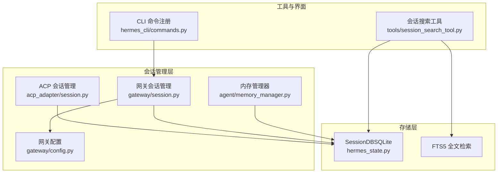
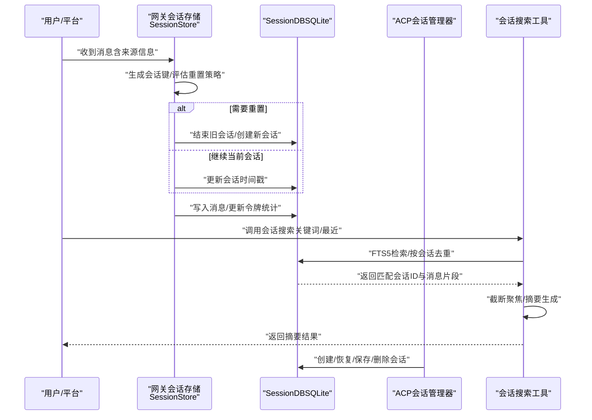
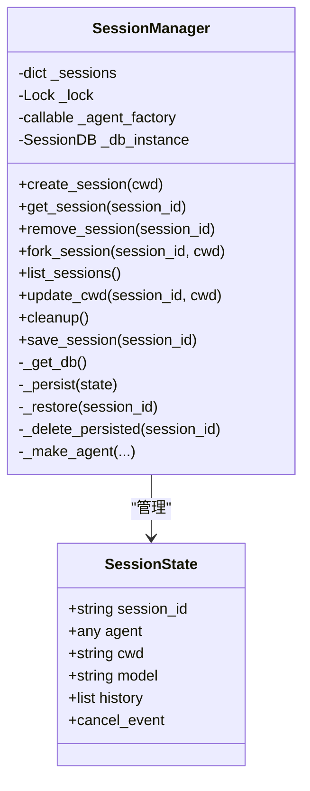
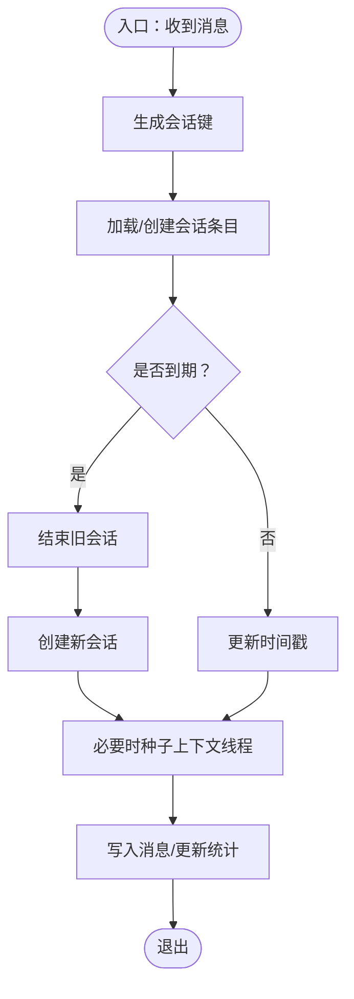
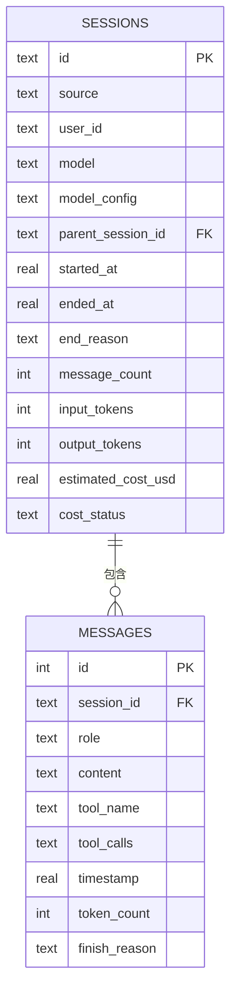
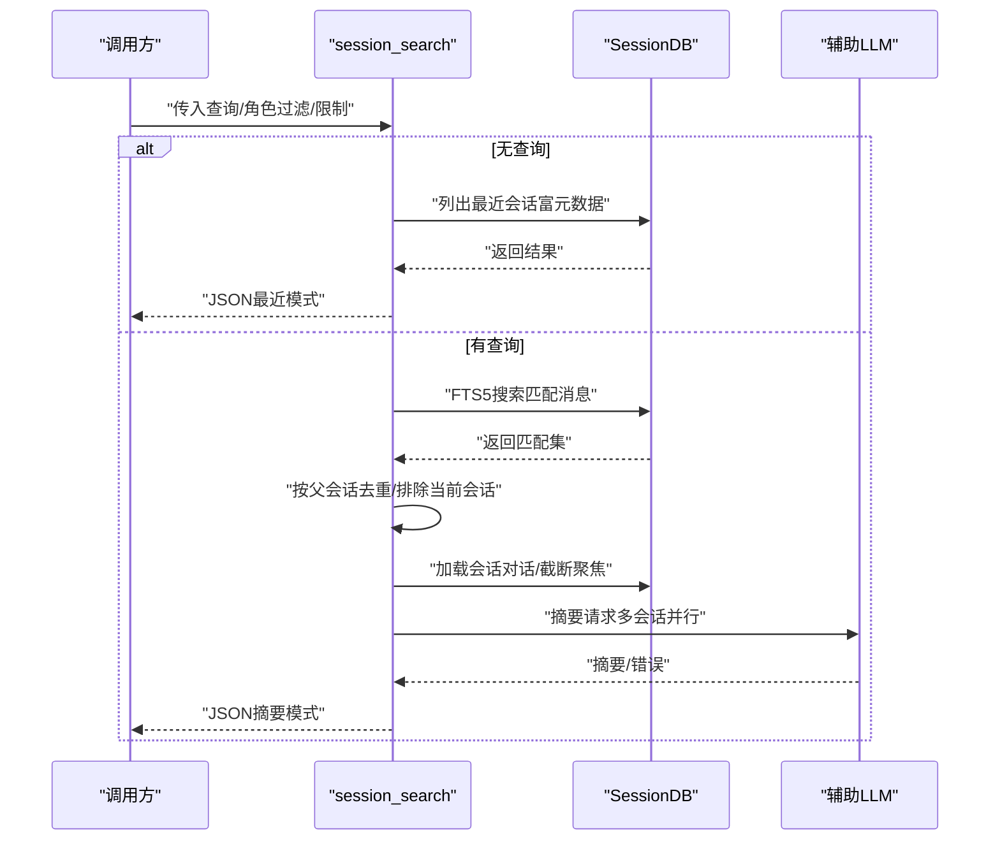
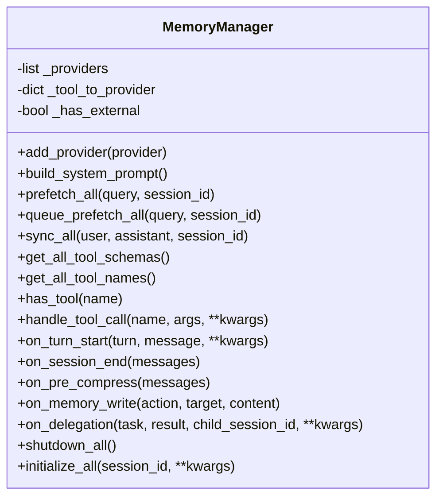
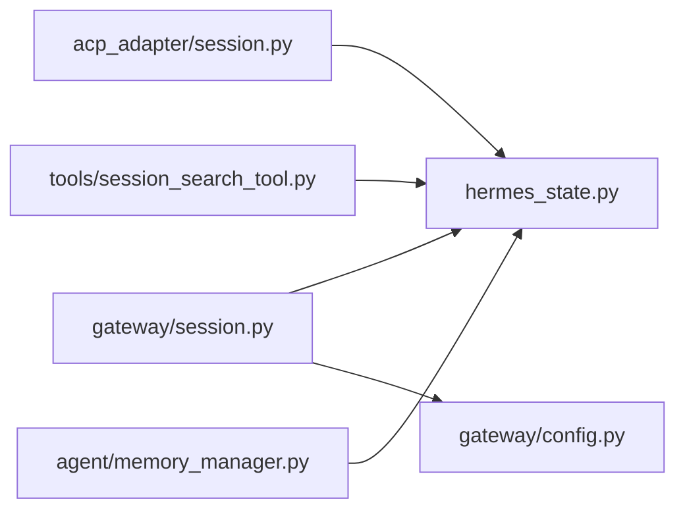

# 会话管理

<cite>
**本文引用的文件**
- [acp_adapter/session.py](file://acp_adapter/session.py)
- [gateway/session.py](file://gateway/session.py)
- [hermes_state.py](file://hermes_state.py)
- [tools/session_search_tool.py](file://tools/session_search_tool.py)
- [agent/memory_manager.py](file://agent/memory_manager.py)
- [gateway/config.py](file://gateway/config.py)
- [hermes_cli/commands.py](file://hermes_cli/commands.py)
</cite>

## 目录
1. [简介](#简介)
2. [项目结构](#项目结构)
3. [核心组件](#核心组件)
4. [架构总览](#架构总览)
5. [详细组件分析](#详细组件分析)
6. [依赖关系分析](#依赖关系分析)
7. [性能考量](#性能考量)
8. [故障排查指南](#故障排查指南)
9. [结论](#结论)
10. [附录](#附录)

## 简介
本指南面向Hermes Agent的会话管理，系统性阐述会话生命周期（创建、状态跟踪、上下文维护、重置与清理）、存储与持久化（SQLite、内存、文件）、搜索与查询（历史检索、状态监控、性能指标）、最佳实践与故障恢复策略。文档以代码为依据，结合图示帮助读者快速理解并正确使用会话管理能力。

## 项目结构
围绕会话管理的关键模块与职责如下：
- ACP适配器会话管理：负责将ACP会话映射到Agent实例，支持内存与SQLite双层持久化，提供创建、fork、列表、更新工作目录、清理等能力。
- 网关会话管理：负责多平台消息来源的会话键生成、会话重置策略评估、会话存储（SQLite + JSONL回退）、动态系统提示注入与上下文构建。
- 状态数据库（SessionDB）：基于SQLite的会话元数据与消息持久化，支持FTS5全文检索、WAL并发写入、事务重试与WAL checkpoint优化。
- 会话搜索工具：基于FTS5检索匹配会话，对命中会话进行摘要生成，支持最近会话浏览与关键词检索。
- 内存管理器：统一编排内置与外部记忆提供者，支持预取、同步、工具路由与生命周期钩子，保障上下文在会话中的持续性。
- 网关配置：定义会话重置策略（按日/空闲/两者/不重置），以及平台连接、投递偏好等。
- CLI命令注册：集中定义“新建/重置”“历史”“标题”“压缩”“回滚”等会话相关命令，便于用户操作。

**图表来源**
- [acp_adapter/session.py:70-476](file://acp_adapter/session.py#L70-L476)
- [gateway/session.py:503-800](file://gateway/session.py#L503-L800)
- [hermes_state.py:115-800](file://hermes_state.py#L115-L800)
- [tools/session_search_tool.py:1-505](file://tools/session_search_tool.py#L1-L505)
- [agent/memory_manager.py:72-368](file://agent/memory_manager.py#L72-L368)
- [gateway/config.py:96-137](file://gateway/config.py#L96-L137)
- [hermes_cli/commands.py:46-83](file://hermes_cli/commands.py#L46-L83)

**章节来源**
- [acp_adapter/session.py:70-476](file://acp_adapter/session.py#L70-L476)
- [gateway/session.py:503-800](file://gateway/session.py#L503-L800)
- [hermes_state.py:115-800](file://hermes_state.py#L115-L800)
- [tools/session_search_tool.py:1-505](file://tools/session_search_tool.py#L1-L505)
- [agent/memory_manager.py:72-368](file://agent/memory_manager.py#L72-L368)
- [gateway/config.py:96-137](file://gateway/config.py#L96-L137)
- [hermes_cli/commands.py:46-83](file://hermes_cli/commands.py#L46-L83)

## 核心组件
- ACP会话管理器（SessionManager）
  - 职责：创建/获取/删除/复制会话；内存与SQLite双层持久化；工作目录与任务环境绑定；列出会话信息；保存/清理。
  - 关键点：线程安全锁保护；延迟初始化SessionDB；持久化时写入模型配置与消息全量替换。
- 网关会话存储（SessionStore）
  - 职责：根据消息来源生成会话键；评估重置策略；创建/结束会话；加载/保存索引；种子线程会话上下文；令牌统计与成本追踪。
  - 关键点：SQLite优先（SessionDB），不可用时回退JSONL；WAL模式与随机抖动重试缓解写竞争；支持按平台/类型覆盖重置策略。
- 状态数据库（SessionDB）
  - 职责：会话元数据、消息、FTS5表与触发器；事务重试、WAL checkpoint；标题唯一性约束；会话计数与解析。
  - 关键点：BEGIN IMMEDIATE + 随机抖动重试；定期PASSIVE WAL checkpoint；FTS5自动同步消息内容。
- 会话搜索工具（session_search）
  - 职责：关键词/短语/布尔检索；按会话去重；截断聚焦；摘要生成；最近会话浏览。
  - 关键点：FTS5检索+父会话链解析；并发摘要；超时保护；隐藏来源过滤。
- 内存管理器（MemoryManager）
  - 职责：内置+外部记忆提供者编排；系统提示拼接；预取/同步；工具路由；生命周期钩子。
  - 关键点：单个外部提供者限制；失败不影响其他提供者；会话结束通知。
- 网关配置（GatewayConfig）
  - 职责：平台连接、Home通道、会话重置策略（模式/时间/空闲/通知）。
  - 关键点：默认策略可按平台/类型覆盖；环境变量覆盖；校验与告警。

**章节来源**
- [acp_adapter/session.py:70-476](file://acp_adapter/session.py#L70-L476)
- [gateway/session.py:503-800](file://gateway/session.py#L503-L800)
- [hermes_state.py:115-800](file://hermes_state.py#L115-L800)
- [tools/session_search_tool.py:247-431](file://tools/session_search_tool.py#L247-L431)
- [agent/memory_manager.py:72-368](file://agent/memory_manager.py#L72-L368)
- [gateway/config.py:96-137](file://gateway/config.py#L96-L137)

## 架构总览
下图展示从消息输入到会话创建、持久化、检索与摘要的整体流程。

**图表来源**
- [gateway/session.py:692-800](file://gateway/session.py#L692-L800)
- [hermes_state.py:355-501](file://hermes_state.py#L355-L501)
- [tools/session_search_tool.py:247-431](file://tools/session_search_tool.py#L247-L431)
- [acp_adapter/session.py:273-416](file://acp_adapter/session.py#L273-L416)

## 详细组件分析

### ACP会话管理器（SessionManager）
- 生命周期
  - 创建：生成UUID会话ID，构造Agent实例，初始化取消事件，注册任务工作目录，写入内存与数据库。
  - 获取：优先内存，不存在则从SQLite恢复；恢复时重建Agent并注入模型配置与历史。
  - 删除：移除内存与数据库记录，并清理任务工作目录覆盖。
  - Fork：深拷贝历史到新会话，保持模型与工作目录一致。
  - 列表：合并内存与数据库会话，补充缺失的数据库会话信息。
  - 更新工作目录：更新cwd并重新注册任务环境覆盖，同时持久化。
  - 清理：清空所有会话（内存+数据库），清理所有任务cwd覆盖。
  - 保存：显式持久化当前会话。
- 持久化策略
  - SessionDB延迟初始化；写入时先确保会话存在，再全量替换消息；模型配置（含cwd、provider/base_url/api_mode）写入model_config。
  - 恢复时从DB读取会话与消息，重建Agent并注入历史。
- 并发与一致性
  - 内部使用线程锁保护；DB写入通过事务封装与异常处理；任务工作目录通过注册/清理函数绑定/解除。

**图表来源**
- [acp_adapter/session.py:58-112](file://acp_adapter/session.py#L58-L112)
- [acp_adapter/session.py:70-163](file://acp_adapter/session.py#L70-L163)

**章节来源**
- [acp_adapter/session.py:70-476](file://acp_adapter/session.py#L70-L476)

### 网关会话存储（SessionStore）
- 会话键生成
  - DM：chat_id优先，thread_id次之，均无则共享会话。
  - 群组/频道：chat_id标识父级；thread_id区分线程；默认共享线程会话（可配置为按用户隔离）。
- 重置策略评估
  - 支持“每日/空闲/两者/不重置”，可按平台/类型覆盖；活跃进程检测避免误判；到期后结束旧会话并创建新会话。
- 存储与回退
  - 优先SessionDB（SQLite）；不可用时回退JSONL文件；索引文件采用原子写入与临时文件替换。
- 上下文与动态系统提示
  - 构建动态系统提示段落，包含来源、平台、Home通道、投递选项等；支持PII脱敏（特定平台）。
- 令牌与成本统计
  - 提供增量/绝对两种更新方式；支持缓存读写、推理令牌、计费信息字段。

**图表来源**
- [gateway/session.py:444-501](file://gateway/session.py#L444-L501)
- [gateway/session.py:588-669](file://gateway/session.py#L588-L669)
- [gateway/session.py:692-779](file://gateway/session.py#L692-L779)

**章节来源**
- [gateway/session.py:444-800](file://gateway/session.py#L444-L800)
- [gateway/config.py:96-137](file://gateway/config.py#L96-L137)

### 状态数据库（SessionDB）
- 表结构与索引
  - sessions：会话元数据（来源、用户ID、模型、配置、父子会话链、计数与成本字段等）。
  - messages：消息明细（角色、内容、工具调用、时间戳、令牌计数、完成原因、推理信息等）。
  - sessions与messages通过外键关联；FTS5虚拟表messages_fts自动同步内容。
- 写入与并发
  - BEGIN IMMEDIATE + 应用层随机抖动重试；短超时+定期WAL checkpoint；避免SQLite内置忙等待导致的队头阻塞。
- 查询与检索
  - 提供创建/结束/更新系统提示/令牌统计/解析会话ID/标题管理/富列表等接口；FTS5用于全文检索与摘要场景。

**图表来源**
- [hermes_state.py:41-91](file://hermes_state.py#L41-L91)
- [hermes_state.py:355-501](file://hermes_state.py#L355-L501)

**章节来源**
- [hermes_state.py:115-800](file://hermes_state.py#L115-L800)

### 会话搜索工具（session_search）
- 功能特性
  - 最近会话：无需LLM，直接返回标题、预览、时间戳。
  - 关键词检索：FTS5匹配，按会话去重，截断聚焦，摘要生成。
  - 父子会话解析：委托/压缩产生的子会话归属同一主线，避免重复摘要。
  - 容错与超时：摘要失败回退原始预览；异步执行带超时保护。
- 使用建议
  - 复杂查询建议使用OR连接多个关键词；短语用引号；布尔表达式提高召回。
  - 限制最大摘要数量，避免昂贵LLM调用。

**图表来源**
- [tools/session_search_tool.py:247-431](file://tools/session_search_tool.py#L247-L431)
- [hermes_state.py:783-800](file://hermes_state.py#L783-L800)

**章节来源**
- [tools/session_search_tool.py:1-505](file://tools/session_search_tool.py#L1-L505)
- [hermes_state.py:783-800](file://hermes_state.py#L783-L800)

### 内存管理器（MemoryManager）
- 角色与职责
  - 注册内置与最多一个外部记忆提供者；统一系统提示拼接；预取/同步；工具路由；生命周期钩子（回合开始/会话结束/压缩前/外部写入通知/委派完成）。
- 与会话的关系
  - 在会话开始/结束、每回合前后调用相应钩子，确保记忆上下文与会话生命周期一致。
  - 通过工具路由将记忆相关工具调用分发给对应提供者。

**图表来源**
- [agent/memory_manager.py:72-368](file://agent/memory_manager.py#L72-L368)

**章节来源**
- [agent/memory_manager.py:72-368](file://agent/memory_manager.py#L72-L368)

### CLI命令与会话操作
- 常用会话命令
  - 新建/重置、历史、保存、重试、撤销、标题、分支、压缩、回滚、后台、旁路问题、队列、状态、主页设置、恢复等。
- 作用
  - 提供用户侧直接操作会话的能力，配合网关/ACP会话管理实现端到端体验。

**章节来源**
- [hermes_cli/commands.py:46-83](file://hermes_cli/commands.py#L46-L83)

## 依赖关系分析
- 组件耦合
  - ACP会话管理器依赖SessionDB进行持久化；与Agent运行时工厂解耦（测试可用代理工厂）。
  - 网关会话存储依赖SessionDB与配置；动态系统提示构建依赖平台枚举与Home通道。
  - 会话搜索工具依赖SessionDB的FTS5与消息读取接口。
  - 内存管理器与会话生命周期钩子协作，确保上下文在会话内稳定。
- 外部依赖
  - SQLite（WAL、FTS5、触发器）；Python标准库（json、tempfile、threading、datetime等）。
- 循环依赖
  - 未见循环导入；模块间通过接口与数据类传递，职责清晰。

**图表来源**
- [acp_adapter/session.py:264-271](file://acp_adapter/session.py#L264-L271)
- [gateway/session.py:522-527](file://gateway/session.py#L522-L527)
- [hermes_state.py:115-161](file://hermes_state.py#L115-L161)
- [tools/session_search_tool.py:247-285](file://tools/session_search_tool.py#L247-L285)
- [agent/memory_manager.py:357-367](file://agent/memory_manager.py#L357-L367)

**章节来源**
- [acp_adapter/session.py:264-271](file://acp_adapter/session.py#L264-L271)
- [gateway/session.py:522-527](file://gateway/session.py#L522-L527)
- [hermes_state.py:115-161](file://hermes_state.py#L115-L161)
- [tools/session_search_tool.py:247-285](file://tools/session_search_tool.py#L247-L285)
- [agent/memory_manager.py:357-367](file://agent/memory_manager.py#L357-L367)

## 性能考量
- SQLite并发与写入
  - 使用WAL模式；写入采用短超时+应用层随机抖动重试，避免内置busy handler造成队头阻塞；定期PASSIVE WAL checkpoint降低WAL增长。
- 会话搜索
  - FTS5检索+按会话去重，限制摘要数量；对命中会话进行截断聚焦，减少LLM输入长度。
- 内存与磁盘
  - 内存中缓存活跃会话；会话索引文件采用原子写入；SQLite不可用时回退JSONL文件，保证可用性。
- 令牌与成本统计
  - 支持增量/绝对两种更新方式，避免重复计算；提供缓存读写与推理令牌字段，便于成本控制与分析。

**章节来源**
- [hermes_state.py:123-236](file://hermes_state.py#L123-L236)
- [tools/session_search_tool.py:247-431](file://tools/session_search_tool.py#L247-L431)
- [gateway/session.py:557-579](file://gateway/session.py#L557-L579)

## 故障排查指南
- 会话无法持久化或写入冲突
  - 现象：写入失败或“database is locked”。
  - 排查：检查并发写入情况；确认WAL模式与checkpoint策略；观察重试日志。
  - 参考：事务重试与WAL checkpoint逻辑。
- 会话恢复失败
  - 现象：重启后会话未恢复或Agent重建失败。
  - 排查：确认SessionDB可用；检查model_config与provider/base_url/api_mode字段；核对历史消息完整性。
- 会话搜索无结果或性能差
  - 现象：关键词检索无结果或耗时过长。
  - 排查：确认FTS5已建立；尝试简化查询（使用OR连接）；限制摘要数量；检查隐藏来源过滤。
- 重置策略未生效
  - 现象：会话未按预期重置。
  - 排查：核对默认/平台/类型策略；检查活跃进程检测；确认时间边界与空闲阈值。

**章节来源**
- [hermes_state.py:164-214](file://hermes_state.py#L164-L214)
- [acp_adapter/session.py:333-416](file://acp_adapter/session.py#L333-L416)
- [tools/session_search_tool.py:247-431](file://tools/session_search_tool.py#L247-L431)
- [gateway/session.py:588-669](file://gateway/session.py#L588-L669)

## 结论
Hermes Agent的会话管理通过“内存+SQLite”的双层持久化、严谨的并发控制与FTS5检索，实现了跨平台、可扩展且高性能的会话生命周期管理。配合动态系统提示、记忆上下文与CLI命令，用户可在不同入口（CLI、网关、ACP）获得一致的会话体验。遵循本文最佳实践与故障排查建议，可有效提升稳定性与可维护性。

## 附录
- 会话重置策略配置要点
  - 模式：daily/idle/both/none
  - 时间：at_hour（本地时区）
  - 空闲：idle_minutes
  - 通知：notify及排除平台
- 常用命令速览
  - 新建/重置、历史、保存、重试、撤销、标题、分支、压缩、回滚、后台、旁路问题、队列、状态、主页设置、恢复等。

**章节来源**
- [gateway/config.py:96-137](file://gateway/config.py#L96-L137)
- [hermes_cli/commands.py:46-83](file://hermes_cli/commands.py#L46-L83)