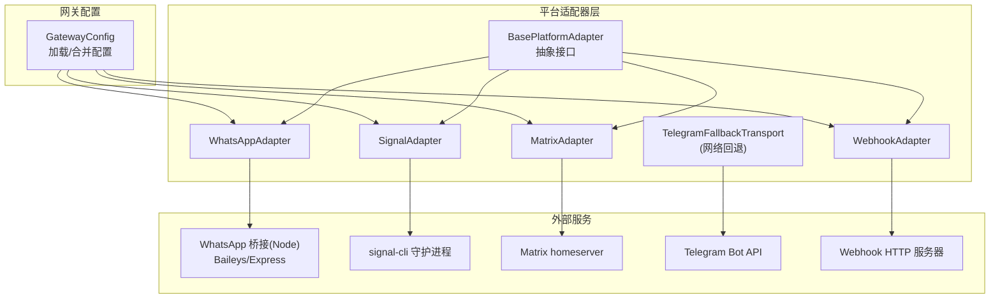
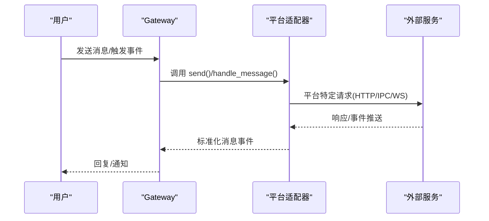
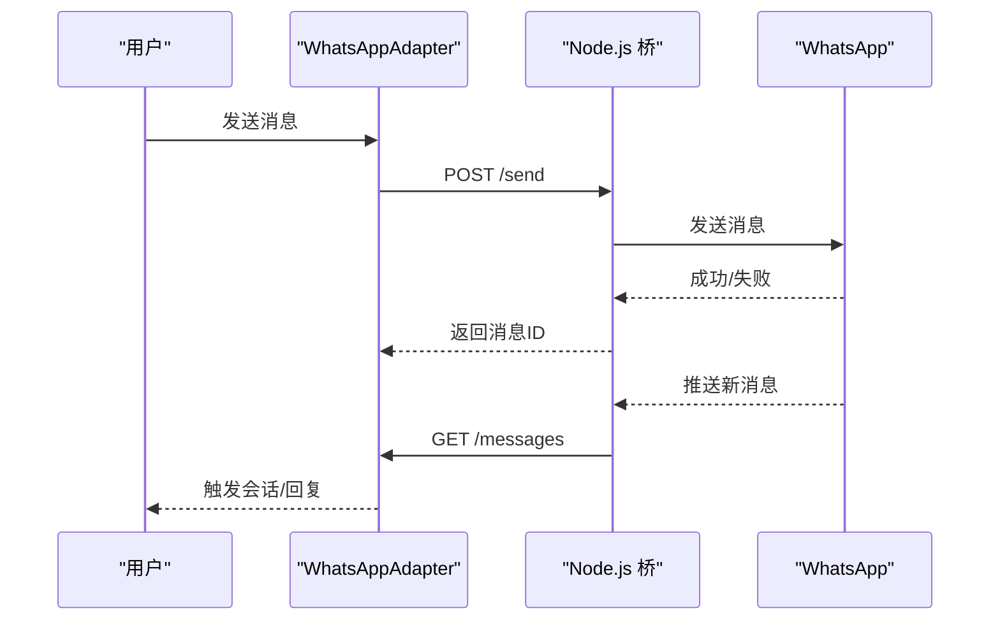
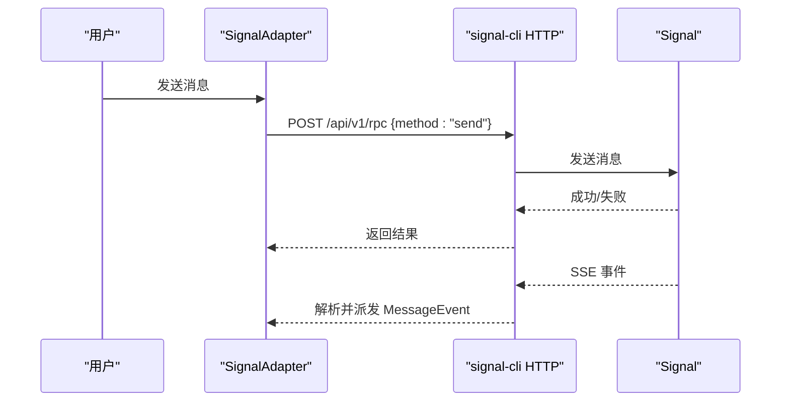
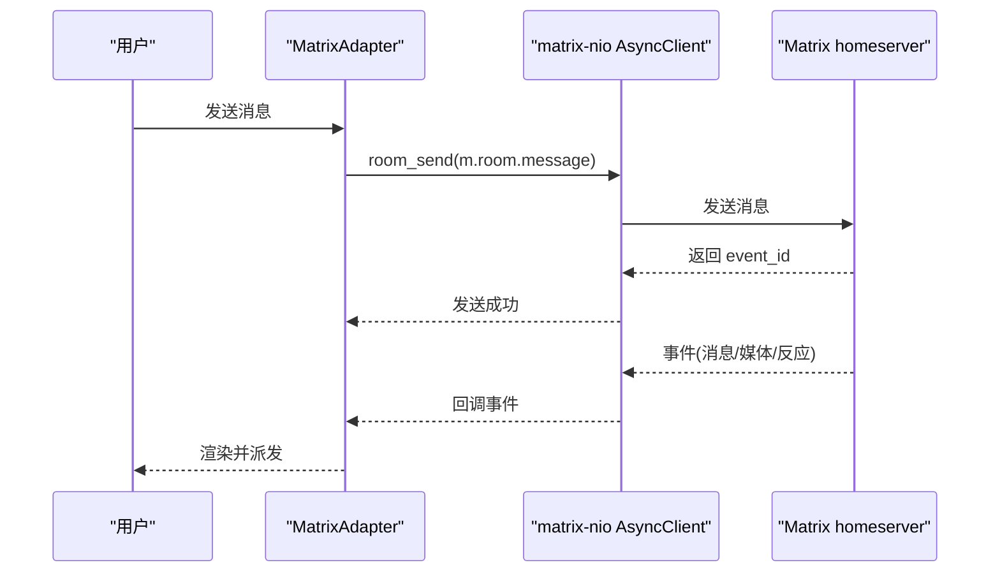
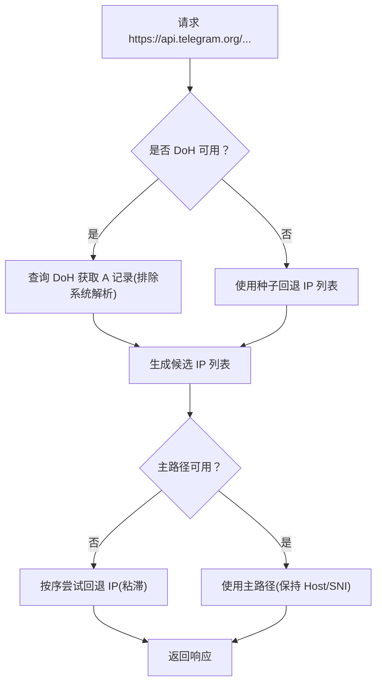
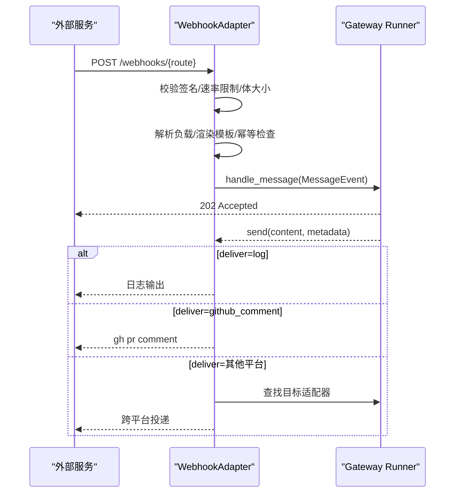
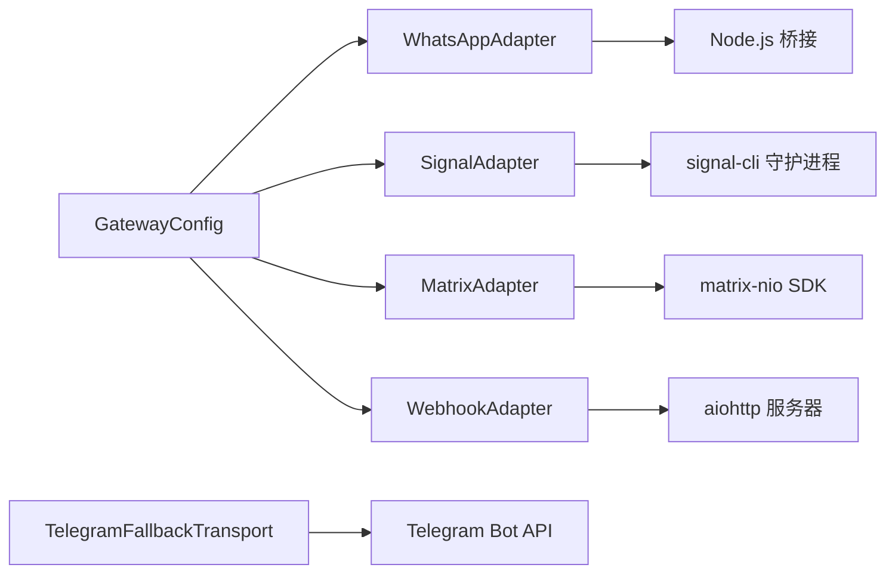

# 其他消息平台

<cite>
**本文引用的文件**
- [gateway/platforms/base.py](file://gateway/platforms/base.py)
- [gateway/platforms/whatsapp.py](file://gateway/platforms/whatsapp.py)
- [gateway/platforms/signal.py](file://gateway/platforms/signal.py)
- [gateway/platforms/matrix.py](file://gateway/platforms/matrix.py)
- [gateway/platforms/telegram_network.py](file://gateway/platforms/telegram_network.py)
- [gateway/platforms/webhook.py](file://gateway/platforms/webhook.py)
- [gateway/config.py](file://gateway/config.py)
- [scripts/whatsapp-bridge/package.json](file://scripts/whatsapp-bridge/package.json)
</cite>

## 目录
1. [简介](#简介)
2. [项目结构](#项目结构)
3. [核心组件](#核心组件)
4. [架构总览](#架构总览)
5. [详细组件分析](#详细组件分析)
6. [依赖关系分析](#依赖关系分析)
7. [性能考量](#性能考量)
8. [故障排查指南](#故障排查指南)
9. [结论](#结论)
10. [附录](#附录)

## 简介
本指南面向希望在 Hermes Agent 中集成并使用其他消息平台（WhatsApp、Signal、Matrix、Telegram Network、Webhook）的用户与运维人员。文档从平台特性、配置要点、使用流程、部署策略、监控与迁移等方面进行系统说明，并提供可直接定位到源码实现的路径，帮助读者快速上手并在生产环境中稳定运行。

## 项目结构
Hermes 的消息平台以“适配器模式”组织：每个平台在 gateway/platforms 下有独立模块，统一继承自基础适配器接口；平台配置由 gateway/config.py 统一加载与合并环境变量；部分平台还包含本地桥接进程或网络辅助工具（如 WhatsApp 桥接、Telegram 网络回退传输）。

图示来源
- [gateway/platforms/base.py](file://gateway/platforms/base.py)
- [gateway/platforms/whatsapp.py](file://gateway/platforms/whatsapp.py)
- [gateway/platforms/signal.py](file://gateway/platforms/signal.py)
- [gateway/platforms/matrix.py](file://gateway/platforms/matrix.py)
- [gateway/platforms/telegram_network.py](file://gateway/platforms/telegram_network.py)
- [gateway/platforms/webhook.py](file://gateway/platforms/webhook.py)
- [gateway/config.py](file://gateway/config.py)

章节来源
- [gateway/config.py](file://gateway/config.py)
- [gateway/platforms/base.py](file://gateway/platforms/base.py)

## 核心组件
- 平台适配器基类：定义统一的连接、发送、接收、媒体处理等接口，提供缓存、重试、致命错误上报等通用能力。
- 平台适配器实现：针对不同平台的认证方式、消息模型、媒体上传/下载、线程/回复语义等进行差异化封装。
- 配置系统：集中管理平台开关、凭据、默认通道、会话重置策略、流式输出等。
- 网络辅助：如 Telegram 的主机名保留回退传输，确保在 DNS 不可达时仍能访问 Bot API。

章节来源
- [gateway/platforms/base.py](file://gateway/platforms/base.py)
- [gateway/config.py](file://gateway/config.py)

## 架构总览
下图展示各平台适配器如何通过统一接口接入 Hermes，并与外部服务交互：

图示来源
- [gateway/platforms/base.py](file://gateway/platforms/base.py)
- [gateway/platforms/whatsapp.py](file://gateway/platforms/whatsapp.py)
- [gateway/platforms/signal.py](file://gateway/platforms/signal.py)
- [gateway/platforms/matrix.py](file://gateway/platforms/matrix.py)
- [gateway/platforms/webhook.py](file://gateway/platforms/webhook.py)

## 详细组件分析

### WhatsApp 平台
- 特点
  - 支持多种后端：Business API、个人账号（Node.js 桥接，如 Baileys）、web 自动化。
  - 采用“桥接模式”：Python 适配器通过 HTTP 与 Node.js 桥通信，转发消息与控制命令。
  - 支持群组管理：提及规则、免打扰聊天白名单、自由回复模式。
  - 会话锁：防止同一会话目录被多个实例同时占用。
- 关键配置
  - bridge_script：桥接脚本路径（默认位于 scripts/whatsapp-bridge/bridge.js）
  - bridge_port：桥接 HTTP 端口（默认 3000）
  - session_path：会话数据存储路径
  - reply_prefix：回复前缀（透传给 Node 桥）
  - require_mention/free_response_chats/mention_patterns：群组消息过滤与触发条件
- 连接流程
  - 检查 Node.js 可用性与依赖安装
  - 启动/复用桥接进程，健康检查（/health）
  - 轮询 /messages 获取入站消息，构建 MessageEvent 分发
- 发送与媒体
  - send/send_image/send_video/send_document/send_typing
  - 通过 /send、/send-media、/typing 等端点调用桥接
- 错误与恢复
  - 桥接进程退出自动标记致命错误并通知
  - 会话锁冲突时提示停止另一个实例再启动

图示来源
- [gateway/platforms/whatsapp.py](file://gateway/platforms/whatsapp.py)
- [scripts/whatsapp-bridge/package.json](file://scripts/whatsapp-bridge/package.json)

章节来源
- [gateway/platforms/whatsapp.py](file://gateway/platforms/whatsapp.py)
- [scripts/whatsapp-bridge/package.json](file://scripts/whatsapp-bridge/package.json)

### Signal 平台
- 特点
  - 依赖 signal-cli HTTP 守护进程（HTTP 模式），SSE 推送入站事件，JSON-RPC 2.0 发送消息。
  - 支持附件大小限制、Mentions 渲染、自对话（Note to Self）过滤、最近发送时间戳防回环。
  - 支持分组白名单（仅允许特定群组）。
- 关键配置
  - http_url/account：signal-cli 守护进程地址与账户标识
  - ignore_stories：忽略故事消息
  - SIGNAL_GROUP_ALLOWED_USERS：允许的群组 ID 列表或 "*" 允许全部
- 连接流程
  - 健康检查 /api/v1/check
  - SSE 订阅 /api/v1/events?account=...
  - 周期性健康监测，空闲超时强制重连
- 发送与媒体
  - send/send_image/send_document/send_voice：通过 JSON-RPC send 路由
  - 语音消息与文件作为附件发送（Signal 不区分语音与文件）

图示来源
- [gateway/platforms/signal.py](file://gateway/platforms/signal.py)

章节来源
- [gateway/platforms/signal.py](file://gateway/platforms/signal.py)

### Matrix 平台
- 特点
  - 使用 matrix-nio SDK，支持可选端到端加密（E2EE）。
  - 支持房间类型识别（DM/群组）、线程回复、富文本渲染（Markdown→HTML）。
  - 加密状态维护、密钥导出/导入、未解密事件缓冲与重试。
- 关键配置
  - MATRIX_HOMESERVER/MATRIX_ACCESS_TOKEN/MATRIX_USER_ID/MATRIX_PASSWORD
  - MATRIX_ENCRYPTION/MATRIX_DEVICE_ID：启用 E2EE 并持久化设备
  - MATRIX_ALLOWED_USERS/MATRIX_HOME_ROOM/MATRIX_REACTIONS/MATRIX_REQUIRE_MENTION
- 连接流程
  - 创建 AsyncClient，令牌登录或密码登录
  - whoami 校验令牌并绑定设备 ID
  - 初始同步（full_state）获取房间状态，建立回调
  - 后续增量同步，处理消息、媒体、反应、邀请等事件
- 发送与媒体
  - send/edit_message：支持 m.replace 编辑
  - send_image/send_document/send_voice：上传并发送
  - 语音消息使用 MSC3245 标志

图示来源
- [gateway/platforms/matrix.py](file://gateway/platforms/matrix.py)

章节来源
- [gateway/platforms/matrix.py](file://gateway/platforms/matrix.py)

### Telegram Network 辅助
- 特点
  - 在 api.telegram.org 无法解析或不可达时，通过 DNS-over-HTTPS 发现可用 IPv4，并以“主机名保留”的方式重写请求，保持 TLS SNI 为 api.telegram.org。
  - 支持代理环境变量透传，粘滞使用某个回退 IP，降低抖动。
- 关键机制
  - 发现：Google/Cloudflare DoH 查询 A 记录，排除系统解析结果
  - 回退：按候选 IP 顺序尝试连接，失败记录并继续
  - 重写：修改请求 URL 主机与 Host 头，保留 SNI

图示来源
- [gateway/platforms/telegram_network.py](file://gateway/platforms/telegram_network.py)

章节来源
- [gateway/platforms/telegram_network.py](file://gateway/platforms/telegram_network.py)

### Webhook 平台
- 特点
  - 内建 aiohttp 服务器，接收外部服务（GitHub/GitLab/JIRA/Stripe 等）的 Webhook。
  - 每路由独立 HMAC 签名验证、速率限制、幂等窗口、动态订阅热加载。
  - 支持将响应投递到其他平台（如 Telegram/Discord/Signal 等）或写入 GitHub PR 评论。
- 关键配置
  - host/port：监听地址与端口
  - routes：路由列表，每项含 events/secret/prompt/skills/deliver/deliver_extra
  - rate_limit/max_body_bytes/secret：安全与限流参数
- 工作流
  - 健康检查 /health
  - POST /webhooks/{route_name}：校验签名→解析负载→模板渲染→幂等检查→异步触发会话→立即返回 202
  - send：根据 deliver 类型投递到日志/平台/GitHub

图示来源
- [gateway/platforms/webhook.py](file://gateway/platforms/webhook.py)

章节来源
- [gateway/platforms/webhook.py](file://gateway/platforms/webhook.py)

## 依赖关系分析
- 平台适配器依赖
  - 基类接口：统一 send/edit_message/send_image 等方法签名与错误处理
  - 平台特定库：signal-cli(HTTP)/matrix-nio/Node.js 桥/HTTP 客户端
- 配置依赖
  - GatewayConfig 提供平台开关、凭据、默认通道、会话策略
  - 环境变量覆盖 config.yaml，便于容器化与运维注入
- 网络依赖
  - Telegram：FallbackTransport 保证在受限网络中仍可访问 Bot API
  - WhatsApp：Node.js 桥接进程与本地会话目录
  - Signal：signal-cli 守护进程（HTTP 模式）

图示来源
- [gateway/config.py](file://gateway/config.py)
- [gateway/platforms/whatsapp.py](file://gateway/platforms/whatsapp.py)
- [gateway/platforms/signal.py](file://gateway/platforms/signal.py)
- [gateway/platforms/matrix.py](file://gateway/platforms/matrix.py)
- [gateway/platforms/webhook.py](file://gateway/platforms/webhook.py)
- [gateway/platforms/telegram_network.py](file://gateway/platforms/telegram_network.py)

章节来源
- [gateway/config.py](file://gateway/config.py)
- [gateway/platforms/base.py](file://gateway/platforms/base.py)

## 性能考量
- 流式输出
  - GatewayConfig.streaming 控制编辑式流式传输与光标样式，减少长文本多次发送带来的延迟与冗余。
- 媒体缓存
  - 图片/音频/文档缓存目录按小时清理，避免磁盘膨胀；下载时带指数退避，提升 CDN 不稳定下的成功率。
- 会话隔离与线程
  - Matrix/Telegram/Slack 等支持线程/回复上下文，合理设置 reply_to_mode/auto_thread 可减少无关噪音。
- 平台特性
  - Signal/Matrix 对大文件有大小限制，需注意附件策略。
  - WhatsApp 群组消息过滤可显著降低无效处理量。

章节来源
- [gateway/platforms/base.py](file://gateway/platforms/base.py)
- [gateway/config.py](file://gateway/config.py)

## 故障排查指南
- WhatsApp
  - 症状：无法启动/连接超时
  - 排查：确认 Node.js 与 npm 依赖；检查 bridge_port 是否被占用；查看 session_path 权限；若会话锁冲突，先停止另一个实例
  - 参考
    - [gateway/platforms/whatsapp.py](file://gateway/platforms/whatsapp.py)
- Signal
  - 症状：SSE 断连/空闲告警
  - 排查：检查 http_url 与 account；确认 signal-cli 守护进程健康；关注分组白名单配置
  - 参考
    - [gateway/platforms/signal.py](file://gateway/platforms/signal.py)
- Matrix
  - 症状：E2EE 初始化失败/加密房间不可用
  - 排查：确认安装 matrix-nio[e2e]；设置 MATRIX_DEVICE_ID 以复用设备；检查 whoami 登录与密钥导入
  - 参考
    - [gateway/platforms/matrix.py](file://gateway/platforms/matrix.py)
- Telegram Network
  - 症状：api.telegram.org 解析失败或连接超时
  - 排查：启用 DoH 发现回退 IP；检查代理设置；观察粘滞回退 IP 日志
  - 参考
    - [gateway/platforms/telegram_network.py](file://gateway/platforms/telegram_network.py)
- Webhook
  - 症状：签名失败/速率超限/重复投递
  - 排查：核对路由 secret；检查 X-Hub-Signature-256/X-Gitlab-Token/X-Webhook-Signature；调整 rate_limit；确认幂等窗口与 delivery_id
  - 参考
    - [gateway/platforms/webhook.py](file://gateway/platforms/webhook.py)

章节来源
- [gateway/platforms/whatsapp.py](file://gateway/platforms/whatsapp.py)
- [gateway/platforms/signal.py](file://gateway/platforms/signal.py)
- [gateway/platforms/matrix.py](file://gateway/platforms/matrix.py)
- [gateway/platforms/telegram_network.py](file://gateway/platforms/telegram_network.py)
- [gateway/platforms/webhook.py](file://gateway/platforms/webhook.py)

## 结论
Hermes Agent 的平台适配器体系提供了统一扩展点，使新增平台只需遵循 BasePlatformAdapter 接口即可快速接入。WhatsApp、Signal、Matrix、Telegram Network、Webhook 各具特色：前者强调桥接与群组治理，后者强调端到端加密与去中心化，再者强调网络可达性与跨平台投递。结合配置系统与网络辅助工具，可在复杂网络环境下稳定运行，并通过流式输出与媒体缓存优化用户体验。

## 附录

### 平台选择与适用场景建议
- WhatsApp：需要与大量个人/企业用户沟通且具备自动化能力；对群组管理与免打扰策略有要求
- Signal：注重隐私与端到端加密，适合合规/安全敏感场景
- Matrix：追求去中心化与开放生态，支持 E2EE 与富文本
- Telegram Network：网络受限或 DNS 不稳定时优先保障 Bot API 可达性
- Webhook：对接第三方系统事件流，实现自动化工作流与跨平台通知

### 配置模板与最佳实践
- 通用
  - 使用 config.yaml 管理平台开关与凭据，必要时通过环境变量覆盖
  - 为每个平台设置 home_channel，便于定时任务与告警直投
  - 启用/调整 GatewayConfig.streaming 以平衡实时性与平台限制
- WhatsApp
  - 指定 bridge_script/bridge_port/session_path；按需开启 require_mention/free_response_chats/mention_patterns
  - 若多人共享会话，务必使用会话锁避免冲突
- Signal
  - 设置 SIGNAL_HTTP_URL 与 SIGNAL_ACCOUNT；按需开启 SIGNAL_GROUP_ALLOWED_USERS
  - 控制附件大小与忽略故事消息，减少资源消耗
- Matrix
  - 启用 MATRIX_ENCRYPTION 并设置 MATRIX_DEVICE_ID；确保 whoami 登录成功
  - 合理配置 require_mention/auto_thread 与 reactions
- Telegram Network
  - 在受限网络中启用回退传输；必要时手动指定回退 IP 列表
- Webhook
  - 为每个路由配置唯一 secret；设置合理的 rate_limit 与 max_body_bytes
  - 使用 deliver_extra 注入目标平台的 chat_id/thread_id

### 监控方案
- 运行状态
  - 通过平台状态写入与 fatal 错误上报机制，结合外部监控系统告警
- 指标建议
  - 连接状态、消息吞吐、媒体缓存大小、SSE/WS 健康、重连次数
- 日志
  - 适配器内已对关键路径进行日志记录，建议结合平台日志与系统日志统一采集

### 平台间差异对比与迁移指导
- 认证方式
  - Token（Telegram/Discord/Matrix） vs. HTTP 守护进程（Signal） vs. 本地桥接（WhatsApp） vs. 环境变量（Webhook）
- 媒体与线程
  - Matrix/Telegram 支持更丰富的媒体与线程；Signal/WhatsApp 有大小与格式限制
- 加密与去中心化
  - Signal 强端到端；Matrix 强去中心化；WhatsApp/Telegram 更偏向生态成熟度
- 迁移建议
  - 从 Telegram/Slack/Matrix 开始，逐步引入 Signal/WhatsApp/Webhook
  - 迁移前评估媒体策略、线程模型与加密需求，统一配置命名与环境变量
  - 使用 home_channel 与路由模板，减少迁移后的配置变更