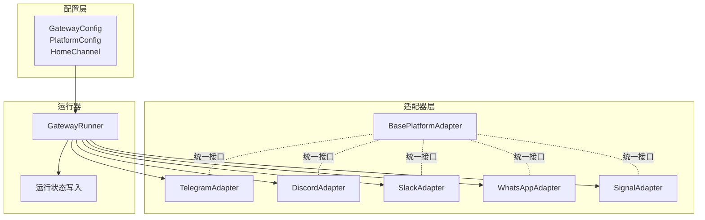
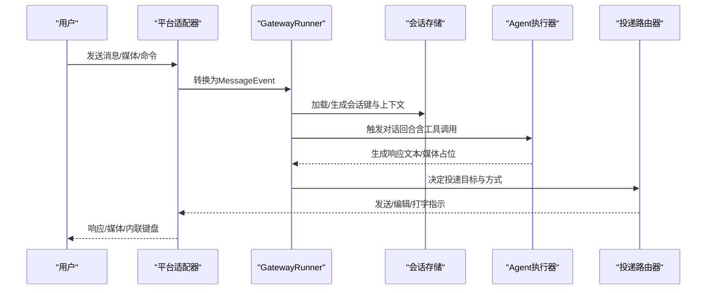
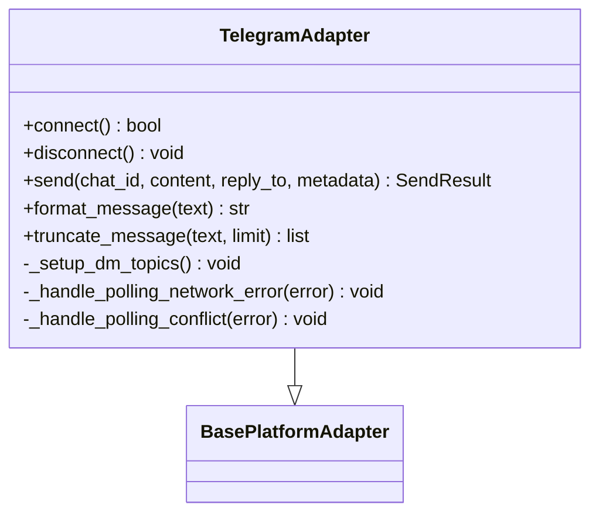
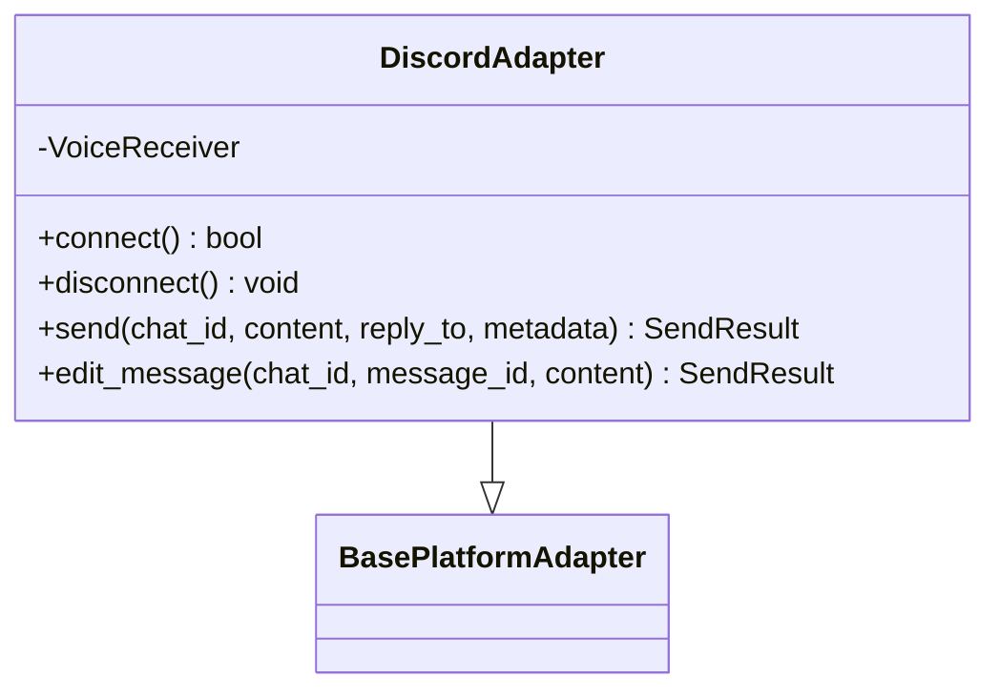
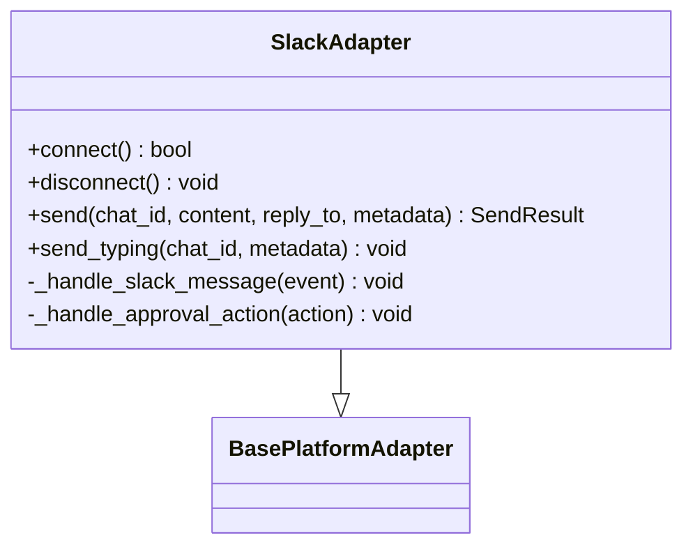
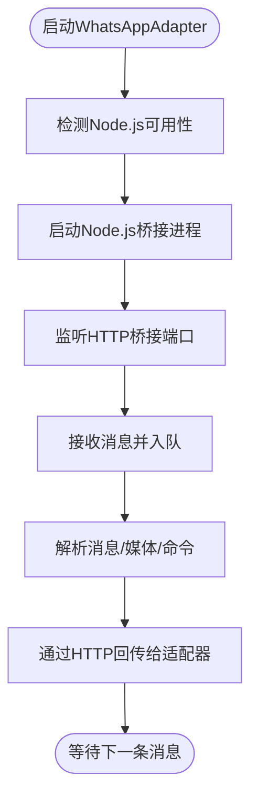
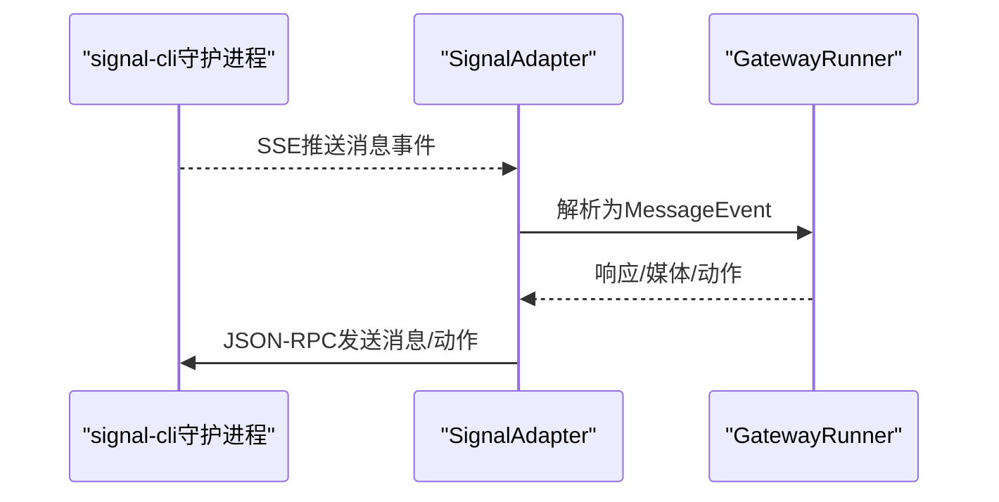
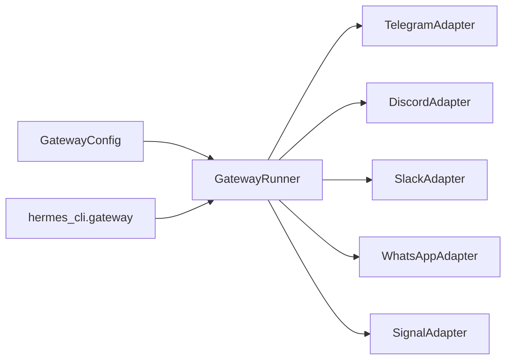

# 消息网关

<cite>
**本文引用的文件**
- [gateway/__init__.py](file://gateway/__init__.py)
- [gateway/run.py](file://gateway/run.py)
- [gateway/config.py](file://gateway/config.py)
- [gateway/platforms/base.py](file://gateway/platforms/base.py)
- [gateway/platforms/telegram.py](file://gateway/platforms/telegram.py)
- [gateway/platforms/discord.py](file://gateway/platforms/discord.py)
- [gateway/platforms/slack.py](file://gateway/platforms/slack.py)
- [gateway/platforms/whatsapp.py](file://gateway/platforms/whatsapp.py)
- [gateway/platforms/signal.py](file://gateway/platforms/signal.py)
- [hermes_cli/gateway.py](file://hermes_cli/gateway.py)
</cite>

## 目录
1. [简介](#简介)
2. [项目结构](#项目结构)
3. [核心组件](#核心组件)
4. [架构总览](#架构总览)
5. [详细组件分析](#详细组件分析)
6. [依赖分析](#依赖分析)
7. [性能考虑](#性能考虑)
8. [故障排查指南](#故障排查指南)
9. [结论](#结论)
10. [附录](#附录)

## 简介
本指南面向Hermes Agent的消息网关（Gateway），帮助你在多平台上完成消息集成与运行管理。内容涵盖：
- 多平台配置与接入：Telegram、Discord、Slack、WhatsApp、Signal等
- 运行模式：前台运行、后台服务、自动启动
- 平台特定配置项：机器人令牌、频道权限、Webhook设置等
- 功能使用：消息转发、回复、媒体处理
- 最佳实践与安全配置

## 项目结构
消息网关由“配置层”“适配器层”“运行器”三部分组成：
- 配置层：统一加载与合并用户配置、环境变量与平台特有参数
- 适配器层：各平台适配器（Telegram、Discord、Slack、WhatsApp、Signal）实现连接、收发、媒体处理
- 运行器：GatewayRunner负责生命周期管理、会话存储、投递路由、错误重连与状态上报

图示来源
- [gateway/config.py:218-401](file://gateway/config.py#L218-L401)
- [gateway/platforms/base.py:470-800](file://gateway/platforms/base.py#L470-L800)
- [gateway/run.py:461-570](file://gateway/run.py#L461-L570)

章节来源
- [gateway/__init__.py:1-36](file://gateway/__init__.py#L1-L36)
- [gateway/config.py:1-120](file://gateway/config.py#L1-L120)
- [gateway/platforms/base.py:1-120](file://gateway/platforms/base.py#L1-L120)
- [gateway/run.py:1-120](file://gateway/run.py#L1-L120)

## 核心组件
- 配置模型
  - GatewayConfig：主配置容器，包含平台列表、会话重置策略、快速命令、存储路径、STT开关、会话隔离策略、未授权DM行为、流式传输配置等
  - PlatformConfig：单平台配置，含启用标志、令牌/API密钥、默认家信道、回复线程模式等
  - HomeChannel：平台默认收件箱（用于无指定目标时的投递）
- 适配器基类
  - BasePlatformAdapter：定义统一接口（连接/断开、发送/编辑/打字指示、媒体下载缓存、消息事件结构等）
- 运行器
  - GatewayRunner：管理所有适配器生命周期、会话存储、投递路由、后台任务、错误重试与致命错误处理、音视频输入处理等

章节来源
- [gateway/config.py:48-401](file://gateway/config.py#L48-L401)
- [gateway/platforms/base.py:367-800](file://gateway/platforms/base.py#L367-L800)
- [gateway/run.py:461-570](file://gateway/run.py#L461-L570)

## 架构总览
消息从各平台进入，经适配器标准化为MessageEvent，再由运行器选择会话上下文与工具集，最终通过DeliveryRouter投递给目标平台或本地日志。

图示来源
- [gateway/platforms/base.py:380-444](file://gateway/platforms/base.py#L380-L444)
- [gateway/run.py:461-570](file://gateway/run.py#L461-L570)
- [gateway/config.py:218-401](file://gateway/config.py#L218-L401)

## 详细组件分析

### 配置与运行模式
- 配置来源优先级：环境变量 > 用户配置（~/.hermes/config.yaml） > 历史配置（~/.hermes/gateway.json） > 内置默认
- 运行模式
  - 前台运行：直接启动网关进程
  - 后台服务：通过CLI安装systemd/launchd服务，支持用户服务与系统服务
  - 自动启动：服务随系统/用户登录启动；linger需开启以确保用户服务在登出后仍运行

章节来源
- [gateway/config.py:415-662](file://gateway/config.py#L415-L662)
- [hermes_cli/gateway.py:29-186](file://hermes_cli/gateway.py#L29-L186)
- [hermes_cli/gateway.py:298-720](file://hermes_cli/gateway.py#L298-L720)
- [hermes_cli/gateway.py:726-800](file://hermes_cli/gateway.py#L726-L800)

### Telegram 集成
- 认证与连接
  - 支持轮询与Webhook两种模式；Webhook适合云部署唤醒场景
  - 可配置备用IP（TelegramFallbackTransport）提升网络稳定性
  - 令牌互斥锁防止同一Token重复使用
- 功能特性
  - 文本/媒体/位置/命令处理
  - DM论坛主题（按名称映射到message_thread_id）
  - 回复线程模式（off/first/all）
  - 命令菜单注册（基于中央命令表）
- 安全与容错
  - 网络错误自动重连（指数退避）
  - 轮询冲突检测与恢复
  - MarkdownV2转义与清理

图示来源
- [gateway/platforms/telegram.py:111-780](file://gateway/platforms/telegram.py#L111-L780)
- [gateway/platforms/base.py:470-800](file://gateway/platforms/base.py#L470-L800)

章节来源
- [gateway/platforms/telegram.py:469-690](file://gateway/platforms/telegram.py#L469-L690)
- [gateway/platforms/telegram.py:750-800](file://gateway/platforms/telegram.py#L750-L800)

### Discord 集成
- 认证与连接
  - 使用discord.py，支持多工作区（多Bot Token）
  - Socket Mode连接，支持多工作区客户端映射
- 功能特性
  - 语音接收（DAVE E2EE解密、Opus解码、静音检测）
  - 线程归档时间控制
  - 媒体缓存与URL安全检查
- 安全与容错
  - 事件去重（SEEN缓存）
  - 多工作区Bot用户ID缓存
  - 空闲线程清理与超限保护

图示来源
- [gateway/platforms/discord.py:1-200](file://gateway/platforms/discord.py#L1-L200)
- [gateway/platforms/base.py:470-800](file://gateway/platforms/base.py#L470-L800)

章节来源
- [gateway/platforms/discord.py:1-200](file://gateway/platforms/discord.py#L1-L200)

### Slack 集成
- 认证与连接
  - 需要Bot Token与App Token（Socket Mode）
  - 支持多工作区，动态加载保存的OAuth Token
- 功能特性
  - 打字指示（通过Socket Mode事件）
  - 线程自动提及追踪（避免遗漏）
  - Block Kit交互按钮（审批流程）
  - 文件/图片/音频附件处理
- 安全与容错
  - 事件去重（SEEN缓存）
  - Bot消息时间戳缓存（避免重复响应）

图示来源
- [gateway/platforms/slack.py:53-200](file://gateway/platforms/slack.py#L53-L200)
- [gateway/platforms/base.py:470-800](file://gateway/platforms/base.py#L470-L800)

章节来源
- [gateway/platforms/slack.py:99-200](file://gateway/platforms/slack.py#L99-L200)

### WhatsApp 集成
- 运行机制
  - 通过HTTP桥接（Node.js子进程）与WhatsApp Web/Business API通信
  - 支持多种后端（whatsapp-web.js、Baileys、Business API）
- 配置要点
  - bridge_script、bridge_port、session_path
  - 提及要求、自由回复聊天白名单、提及正则
- 安全与容错
  - 端口占用检测与进程清理
  - 消息队列与桥接日志文件

图示来源
- [gateway/platforms/whatsapp.py:103-200](file://gateway/platforms/whatsapp.py#L103-L200)

章节来源
- [gateway/platforms/whatsapp.py:103-200](file://gateway/platforms/whatsapp.py#L103-L200)

### Signal 集成
- 运行机制
  - 依赖signal-cli HTTP守护进程（SSE流式接收，JSON-RPC发送）
  - 支持故事忽略、提及渲染、媒体类型识别
- 配置要点
  - SIGNAL_HTTP_URL、SIGNAL_ACCOUNT、可选忽略故事
  - 分组白名单（允许的群成员）
- 安全与容错
  - SSE健康检查与重连
  - 自我消息去回环（最近发送时间戳集合）

图示来源
- [gateway/platforms/signal.py:197-220](file://gateway/platforms/signal.py#L197-L220)

章节来源
- [gateway/platforms/signal.py:197-220](file://gateway/platforms/signal.py#L197-L220)

### 媒体处理与缓存
- 图片/音频/文档缓存
  - 下载到本地缓存目录，避免平台URL过期
  - 支持重试与SSRF防护
- 提示
  - 缓存清理策略（按小时阈值删除旧文件）

章节来源
- [gateway/platforms/base.py:85-192](file://gateway/platforms/base.py#L85-L192)
- [gateway/platforms/base.py:194-365](file://gateway/platforms/base.py#L194-L365)

## 依赖分析
- 配置与运行器耦合度低：运行器仅依赖配置模型与适配器接口
- 适配器对第三方库强依赖：Telegram/Discord/Slack/Signal分别依赖对应SDK
- 服务化管理：CLI提供systemd/launchd服务安装与状态查询

图示来源
- [gateway/config.py:218-401](file://gateway/config.py#L218-L401)
- [gateway/run.py:461-570](file://gateway/run.py#L461-L570)
- [hermes_cli/gateway.py:29-186](file://hermes_cli/gateway.py#L29-L186)

章节来源
- [gateway/config.py:218-401](file://gateway/config.py#L218-L401)
- [gateway/run.py:461-570](file://gateway/run.py#L461-L570)
- [hermes_cli/gateway.py:29-186](file://hermes_cli/gateway.py#L29-L186)

## 性能考虑
- 会话缓存与提示词缓存：运行器对Agent实例进行缓存，避免每次消息重建系统提示
- 流式传输：可配置编辑式增量更新，减少消息往返
- 媒体缓存：本地缓存降低远端CDN抖动影响
- 重连策略：针对网络波动采用指数退避，降低瞬时失败率

## 故障排查指南
- 常见问题定位
  - 令牌为空或格式错误：检查环境变量与配置文件
  - 平台连接失败：查看运行器状态写入与致命错误码
  - Telegram轮询冲突：确认唯一实例，释放令牌锁
  - Slack Socket Mode重复事件：检查SEEN去重与Bot消息时间戳缓存
  - WhatsApp桥接异常：确认Node.js可用、端口未被占用
- 建议操作
  - 查看服务日志（systemd/journald）
  - 使用CLI停止/重启网关，确保无残留进程
  - 开启linger（Linux用户服务）以保证登出后继续运行

章节来源
- [gateway/run.py:796-820](file://gateway/run.py#L796-L820)
- [gateway/platforms/telegram.py:256-311](file://gateway/platforms/telegram.py#L256-L311)
- [gateway/platforms/telegram.py:399-468](file://gateway/platforms/telegram.py#L399-L468)
- [gateway/platforms/slack.py:136-146](file://gateway/platforms/slack.py#L136-L146)
- [gateway/platforms/whatsapp.py:35-68](file://gateway/platforms/whatsapp.py#L35-L68)
- [hermes_cli/gateway.py:94-186](file://hermes_cli/gateway.py#L94-L186)

## 结论
Hermes消息网关提供了统一的多平台消息集成框架，具备完善的配置体系、健壮的运行器与适配器生态。通过合理的配置与服务化部署，可在不同平台间稳定地转发与回复消息，并高效处理媒体与语音输入。

## 附录

### 平台配置清单与要点
- Telegram
  - 必填：TELEGRAM_BOT_TOKEN
  - 可选：TELEGRAM_WEBHOOK_URL/PORT/SECRET、备用IP、DM主题配置
- Discord
  - 必填：DISCORD_BOT_TOKEN
  - 可选：线程自动归档、自由回复通道、忽略通道、反应开关
- Slack
  - 必填：SLACK_BOT_TOKEN、SLACK_APP_TOKEN
  - 可选：多工作区Token、线程提及追踪、Block Kit审批按钮
- WhatsApp
  - 必填：Node.js可用
  - 可选：bridge_script、bridge_port、session_path、提及/自由回复规则
- Signal
  - 必填：SIGNAL_HTTP_URL、SIGNAL_ACCOUNT
  - 可选：忽略故事、分组白名单

章节来源
- [gateway/config.py:665-800](file://gateway/config.py#L665-L800)
- [gateway/platforms/telegram.py:579-635](file://gateway/platforms/telegram.py#L579-L635)
- [gateway/platforms/discord.py:1-200](file://gateway/platforms/discord.py#L1-L200)
- [gateway/platforms/slack.py:99-200](file://gateway/platforms/slack.py#L99-L200)
- [gateway/platforms/whatsapp.py:129-200](file://gateway/platforms/whatsapp.py#L129-L200)
- [gateway/platforms/signal.py:197-220](file://gateway/platforms/signal.py#L197-L220)