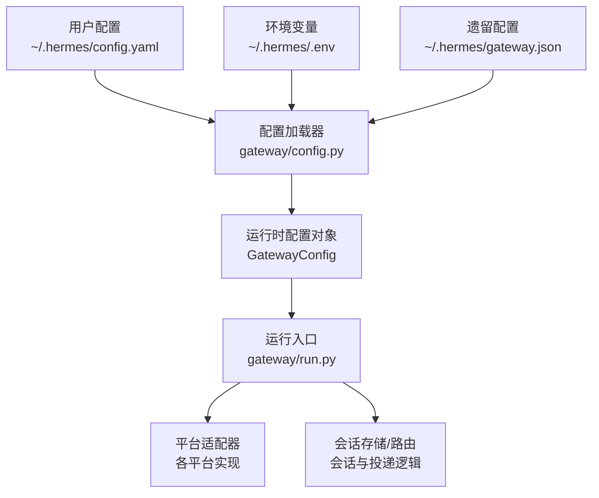
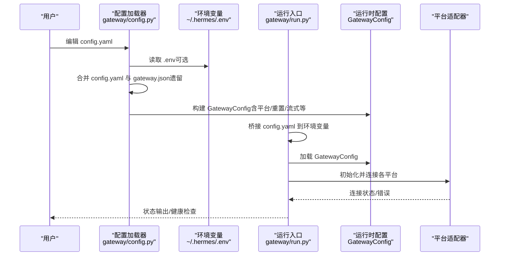
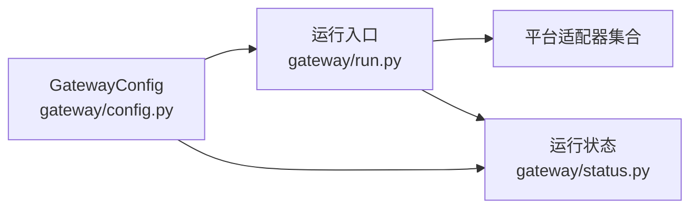

# 网关配置管理

<cite>
**本文档引用的文件**
- [gateway/config.py](file://gateway/config.py)
- [gateway/run.py](file://gateway/run.py)
- [cli-config.yaml.example](file://cli-config.yaml.example)
- [hermes_cli/config.py](file://hermes_cli/config.py)
- [hermes_cli/gateway.py](file://hermes_cli/gateway.py)
- [tests/gateway/test_api_server.py](file://tests/gateway/test_api_server.py)
- [gateway/status.py](file://gateway/status.py)
</cite>

## 目录
1. [简介](#简介)
2. [项目结构](#项目结构)
3. [核心组件](#核心组件)
4. [架构总览](#架构总览)
5. [详细组件分析](#详细组件分析)
6. [依赖分析](#依赖分析)
7. [性能考虑](#性能考虑)
8. [故障排除指南](#故障排除指南)
9. [结论](#结论)
10. [附录](#附录)

## 简介
本指南面向Hermes Agent网关（Gateway）的配置管理，围绕config.yaml配置文件的结构与参数进行系统化说明，涵盖平台配置、会话管理、安全设置、性能优化等方面；同时解释网关运行模式（前台运行、后台服务、自动重启）的选择与配置，并提供配置验证与故障排除方法，以及配置模板与最佳实践建议。

## 项目结构
网关配置主要由以下模块协作完成：
- 配置加载与合并：gateway/config.py
- 运行时桥接与环境变量注入：gateway/run.py
- 示例配置模板：cli-config.yaml.example
- CLI配置工具与校验：hermes_cli/config.py
- 网关服务安装与控制：hermes_cli/gateway.py
- 运行状态持久化：gateway/status.py

图表来源
- [gateway/config.py:415-662](file://gateway/config.py#L415-L662)
- [gateway/run.py:82-226](file://gateway/run.py#L82-L226)

章节来源
- [gateway/config.py:415-662](file://gateway/config.py#L415-L662)
- [gateway/run.py:82-226](file://gateway/run.py#L82-L226)

## 核心组件
- 配置数据模型
  - 平台枚举与平台配置：Platform、PlatformConfig
  - 会话重置策略：SessionResetPolicy
  - 默认/按类型/按平台的重置策略优先级
  - 实时流式传输：StreamingConfig
  - 主配置容器：GatewayConfig（包含平台集合、重置策略、快速命令、STT开关、会话隔离、流式传输等）
- 加载与合并策略
  - 优先级：环境变量 > config.yaml > gateway.json（遗留）> 内置默认值
  - 支持深度合并平台extra字段，确保遗留配置不被覆盖
  - 将部分终端配置桥接到环境变量，供运行时使用
- 运行时桥接
  - 在启动前加载并扩展环境变量，使config.yaml成为权威配置源
  - 将部分配置映射到终端、辅助模型、代理超时等运行时行为

章节来源
- [gateway/config.py:48-401](file://gateway/config.py#L48-L401)
- [gateway/config.py:415-662](file://gateway/config.py#L415-L662)
- [gateway/run.py:82-226](file://gateway/run.py#L82-L226)

## 架构总览
下图展示了从配置文件到运行时的完整流程，包括配置加载、环境变量桥接、运行时校验与平台连接。

图表来源
- [gateway/config.py:415-662](file://gateway/config.py#L415-L662)
- [gateway/run.py:82-226](file://gateway/run.py#L82-L226)

## 详细组件分析

### 配置文件结构与关键参数
- 平台配置（platforms.*）
  - 基础字段：enabled、token/api_key、home_channel（平台默认投递目标）、reply_to_mode（回复线程模式）
  - 平台特定extra字段：用于承载平台特有配置（如Signal的http_url/account、Matrix的homeserver/user_id/password/encryption/device_id、Feishu的app_id/app_secret/domain/connection_mode/encrypt_key/verification_token等）
  - 未认证私信处理策略：unauthorized_dm_behavior（支持"pair"/"ignore"，可按平台覆盖）
- 会话重置策略（session_reset）
  - mode：both（空闲或每日边界任一触发）、idle（仅空闲）、daily（仅每日）、none（从不）
  - idle_minutes：空闲分钟数（需>0）
  - at_hour：每日重置小时（0-23）
  - notify/notify_exclude_platforms：自动重置通知策略及排除平台
- 快速命令（quick_commands）
  - 自定义斜杠命令，绕过Agent循环直接执行
- 存储与日志（sessions_dir、always_log_local）
  - sessions_dir：会话数据目录
  - always_log_local：是否始终将计划任务输出保存到本地文件
- 语音转写（stt_enabled）
  - 是否对入站语音消息自动转写
- 会话隔离（group_sessions_per_user、thread_sessions_per_user）
  - 群组/频道按用户隔离会话；线程内按用户隔离（默认关闭）
- 流式传输（streaming）
  - enabled、transport（"edit"或"off"）、edit_interval、buffer_threshold、cursor
- 其他
  - reset_triggers：重置触发命令列表（默认["/new","/reset"]）
  - unauthorized_dm_behavior：全局未认证私信处理策略

章节来源
- [gateway/config.py:139-401](file://gateway/config.py#L139-L401)
- [gateway/config.py:483-544](file://gateway/config.py#L483-L544)

### 配置加载与合并机制
- 多源合并顺序（高优先级覆盖低优先级）
  1) 环境变量（覆盖所有其他来源）
  2) config.yaml（主配置文件）
  3) gateway.json（遗留配置，提供默认值）
  4) 内置默认值
- 平台section深度合并
  - 对platforms.*.extra进行深合并，保留遗留配置中的自定义项
- 平台特定环境变量桥接
  - 针对Discord/Telegram/WhatsApp/Matrix等，将配置映射到对应环境变量（若未设置），以兼容平台适配器读取
- 运行时环境变量桥接
  - gateway/run.py在启动前将config.yaml中顶层简单键值与终端/辅助模型等配置桥接为环境变量，确保运行时读取一致性

章节来源
- [gateway/config.py:415-662](file://gateway/config.py#L415-L662)
- [gateway/run.py:82-226](file://gateway/run.py#L82-L226)

### 运行模式选择与配置
- 前台运行
  - 直接通过Python模块入口启动网关，适合调试与开发
- 后台服务（systemd/launchd）
  - 提供服务安装、启动、停止、重启与状态查询
  - Linux使用systemd，macOS使用launchd
  - 支持自动重启与linger（Linux）配置
- 自动重启
  - 通过服务管理器的重启命令实现；运行时也支持失败平台的后台重连队列

章节来源
- [hermes_cli/gateway.py:1952-1990](file://hermes_cli/gateway.py#L1952-L1990)
- [hermes_cli/gateway.py:1155-1242](file://hermes_cli/gateway.py#L1155-L1242)

### 安全设置
- 未认证私信处理
  - 全局策略：pair（配对）/ignore（忽略）
  - 可按平台在extra中覆盖
- API密钥与敏感信息
  - 建议放入~/.hermes/.env，避免硬编码在config.yaml中
  - CLI提供配置校验与缺失项提示
- CORS与API服务器安全
  - API Server支持CORS白名单配置（通过环境变量桥接）

章节来源
- [gateway/config.py:39-45](file://gateway/config.py#L39-L45)
- [gateway/config.py:855-877](file://gateway/config.py#L855-L877)
- [hermes_cli/config.py:2695-2731](file://hermes_cli/config.py#L2695-L2731)

### 性能优化
- 会话重置策略
  - 合理设置idle_minutes/at_hour，平衡成本与上下文连续性
  - 使用"both"模式在空闲与每日边界间取较早者，降低长期会话成本
- 流式传输
  - 启用实时token流式传输可改善用户体验，但需权衡编辑频率与平台限制
- STT与媒体处理
  - 按需开启stt_enabled，避免不必要的转写开销
- 会话隔离
  - 群组按用户隔离可减少跨用户上下文污染，提高安全性与资源利用率

章节来源
- [gateway/config.py:96-136](file://gateway/config.py#L96-L136)
- [gateway/config.py:186-214](file://gateway/config.py#L186-L214)
- [gateway/config.py:244-249](file://gateway/config.py#L244-L249)

## 依赖分析
- 组件耦合
  - GatewayConfig是配置的核心数据结构，被运行入口与平台适配器广泛依赖
  - 运行入口负责将配置桥接为环境变量，确保平台适配器读取一致性
- 外部依赖
  - 平台适配器（Telegram/Discord/WhatsApp/Slack/Signal/Mattermost/Matrix/HomeAssistant/Email/SMS/API Server/Webhook/Feishu/WeCom）
  - 环境变量与.ENV文件
  - 服务管理器（systemd/launchd）

图表来源
- [gateway/config.py:218-401](file://gateway/config.py#L218-L401)
- [gateway/run.py:461-570](file://gateway/run.py#L461-L570)
- [gateway/status.py:204-240](file://gateway/status.py#L204-L240)

章节来源
- [gateway/config.py:218-401](file://gateway/config.py#L218-L401)
- [gateway/run.py:461-570](file://gateway/run.py#L461-L570)
- [gateway/status.py:204-240](file://gateway/status.py#L204-L240)

## 性能考虑
- 会话成本控制
  - 合理设置重置策略，避免无限增长的上下文导致成本飙升
- 流式传输
  - edit_interval与buffer_threshold影响消息编辑频率，需根据平台限制调优
- STT与媒体
  - 关闭不必要的语音转写与媒体处理，减少API调用与计算开销
- 平台连接稳定性
  - 利用失败平台的后台重连队列，提升整体可用性

## 故障排除指南
- 配置语法检查
  - 使用hermes_cli的配置检查命令，识别缺失的必需环境变量与可选配置项
  - CLI会在检查中报告版本差异与缺失项，指导迁移
- 参数冲突检测
  - 空闲分钟数必须为正数，否则回退到默认值并记录警告
  - 每日重置小时必须在0-23范围内，否则回退到默认值并记录警告
  - 空令牌启用平台将记录警告，避免连接失败难以定位
- 日志分析
  - 运行状态持久化文件可用于诊断平台状态与错误码
  - 服务管理器日志（systemd/launchd）可帮助定位启动/重启问题
- 常见问题
  - API Server端口/主机/CORS未生效：确认环境变量桥接是否正确（config.yaml优先于.env）
  - 平台无法连接：检查令牌/密钥是否为空字符串，核对平台特定环境变量是否设置

章节来源
- [hermes_cli/config.py:2695-2731](file://hermes_cli/config.py#L2695-L2731)
- [gateway/config.py:626-661](file://gateway/config.py#L626-L661)
- [gateway/status.py:204-240](file://gateway/status.py#L204-L240)
- [tests/gateway/test_api_server.py:940-970](file://tests/gateway/test_api_server.py#L940-L970)

## 结论
通过理解GatewayConfig的数据模型、配置加载与合并策略、运行时桥接机制以及服务管理模式，可以高效地完成Hermes Agent网关的配置与运维。合理设置会话重置策略、流式传输与STT选项，结合安全策略与服务管理，可在保证体验的同时控制成本与风险。

## 附录

### 配置模板与示例
- 完整示例配置文件路径：cli-config.yaml.example
  - 包含模型、终端、压缩、技能、代理行为、工具集、MCP、语音转写、显示等全面配置示例
  - 可复制为~/.hermes/config.yaml后按需修改

章节来源
- [cli-config.yaml.example:1-800](file://cli-config.yaml.example#L1-L800)

### 最佳实践建议
- 配置文件
  - 将敏感信息放入~/.hermes/.env，config.yaml中仅保留非敏感参数
  - 使用"both"重置模式平衡成本与上下文连续性
  - 启用流式传输前评估平台编辑频率限制
- 运行模式
  - 生产环境推荐使用systemd/launchd服务，配合自动重启与linger
  - 更新配置后通过服务管理器重启以应用变更
- 安全
  - 未认证私信采用"pair"策略，必要时在平台级别覆盖为"ignore"
  - API Server配置CORS白名单，避免跨域风险