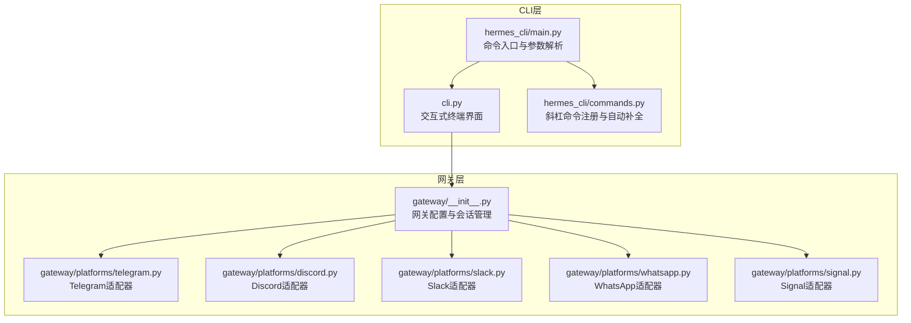
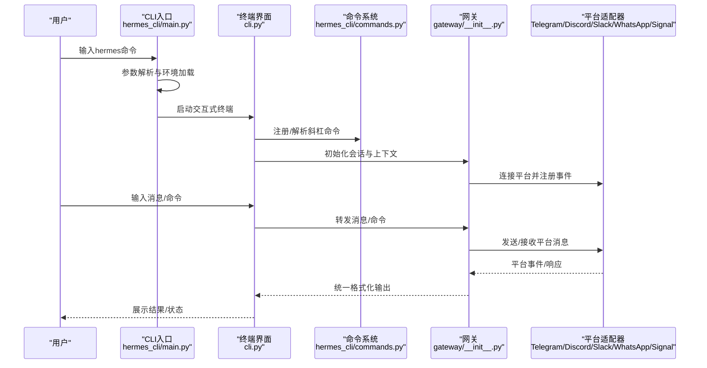
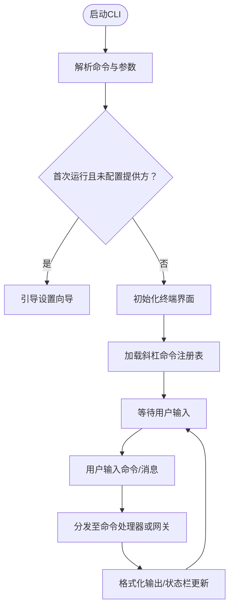
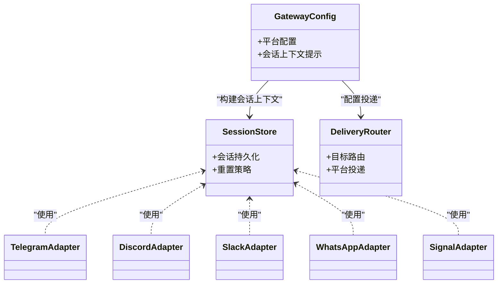
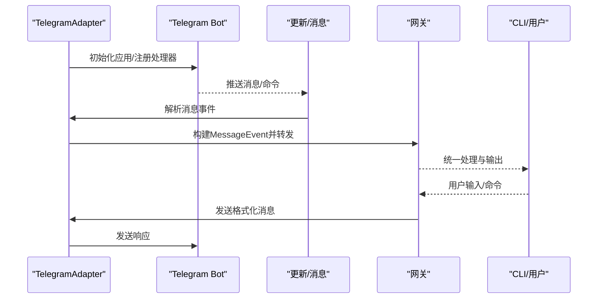
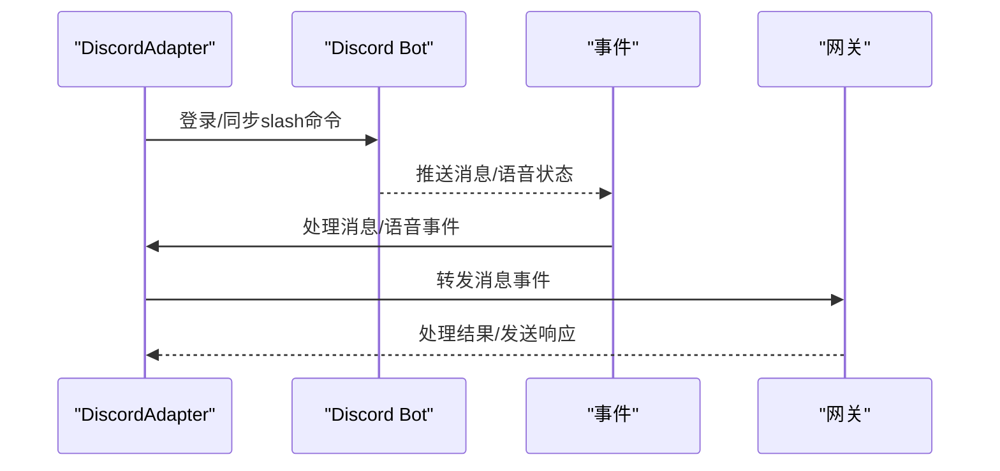
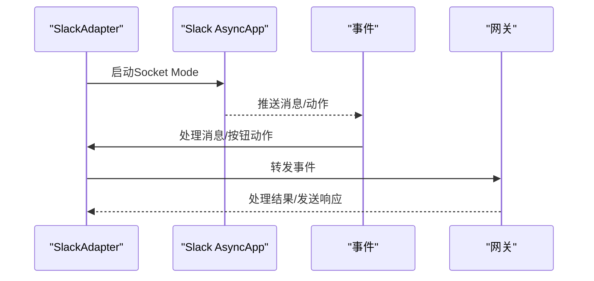
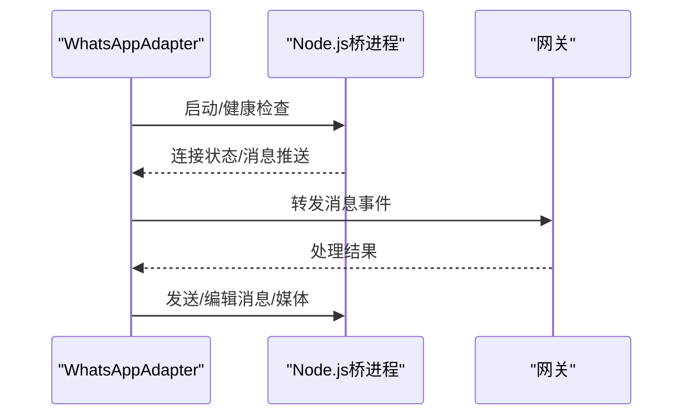
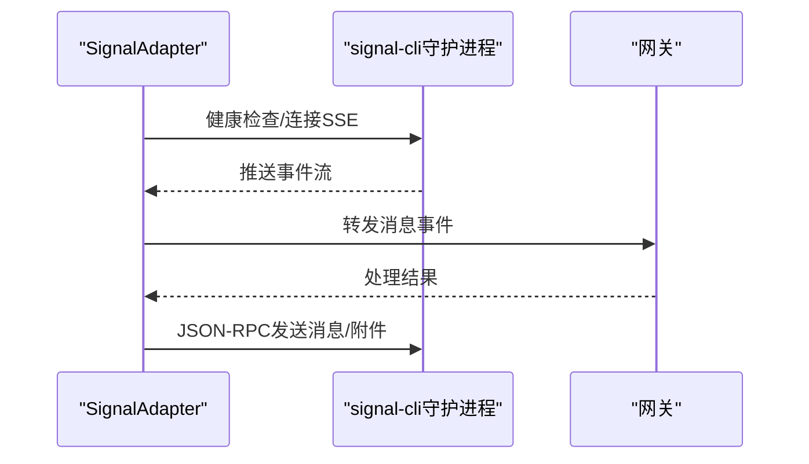
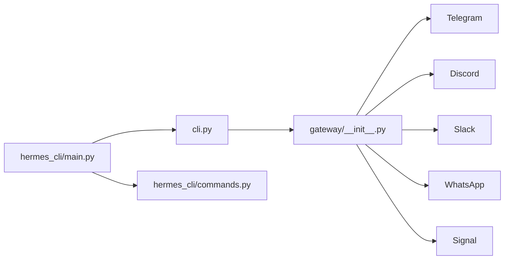

# 用户指南

<cite>
**本文引用的文件**
- [README.md](file://README.md)
- [hermes_cli/main.py](file://hermes_cli/main.py)
- [cli.py](file://cli.py)
- [hermes_cli/commands.py](file://hermes_cli/commands.py)
- [gateway/__init__.py](file://gateway/__init__.py)
- [gateway/platforms/telegram.py](file://gateway/platforms/telegram.py)
- [gateway/platforms/discord.py](file://gateway/platforms/discord.py)
- [gateway/platforms/slack.py](file://gateway/platforms/slack.py)
- [gateway/platforms/whatsapp.py](file://gateway/platforms/whatsapp.py)
- [gateway/platforms/signal.py](file://gateway/platforms/signal.py)
</cite>

## 目录
1. [简介](#简介)
2. [项目结构](#项目结构)
3. [核心组件](#核心组件)
4. [架构总览](#架构总览)
5. [详细组件分析](#详细组件分析)
6. [依赖关系分析](#依赖关系分析)
7. [性能考虑](#性能考虑)
8. [故障排查指南](#故障排查指南)
9. [结论](#结论)
10. [附录](#附录)

## 简介
本指南面向Hermes Agent的终端用户与运维人员，覆盖以下主题：
- CLI交互式终端界面：命令语法、快捷键、会话管理、个性化设置
- 消息网关与多平台集成：Telegram、Discord、Slack、WhatsApp、Signal
- 工具系统与技能系统：工具启用、技能创建与管理、记忆与检索
- 高级功能：委托并行化、计划自动化（Cron）、上下文文件管理
- 最佳实践、性能优化与安全配置
- 丰富的使用示例与常见场景解决方案

## 项目结构
Hermes Agent采用模块化设计，CLI入口与网关适配器分别位于独立子包中，平台适配器按平台拆分，便于扩展与维护。

**图表来源**
- [hermes_cli/main.py:1-120](file://hermes_cli/main.py#L1-L120)
- [cli.py:1-120](file://cli.py#L1-L120)
- [hermes_cli/commands.py:1-120](file://hermes_cli/commands.py#L1-L120)
- [gateway/__init__.py:1-36](file://gateway/__init__.py#L1-L36)
- [gateway/platforms/telegram.py:1-120](file://gateway/platforms/telegram.py#L1-L120)
- [gateway/platforms/discord.py:1-120](file://gateway/platforms/discord.py#L1-L120)
- [gateway/platforms/slack.py:1-120](file://gateway/platforms/slack.py#L1-L120)
- [gateway/platforms/whatsapp.py:1-120](file://gateway/platforms/whatsapp.py#L1-L120)
- [gateway/platforms/signal.py:1-120](file://gateway/platforms/signal.py#L1-L120)

**章节来源**
- [README.md:1-176](file://README.md#L1-L176)
- [hermes_cli/main.py:1-120](file://hermes_cli/main.py#L1-L120)
- [cli.py:1-120](file://cli.py#L1-L120)
- [hermes_cli/commands.py:1-120](file://hermes_cli/commands.py#L1-L120)
- [gateway/__init__.py:1-36](file://gateway/__init__.py#L1-L36)

## 核心组件
- 命令行入口与参数解析：负责hermes命令的路由、参数校验、环境变量加载与首次运行引导。
- 交互式终端界面：提供多行编辑、自动补全、历史记录、流式工具输出、中断重定向等能力。
- 斜杠命令系统：统一的命令注册中心，支持别名、子命令、跨平台映射与自动补全。
- 网关与平台适配器：统一的消息收发、会话上下文注入、线程/话题管理、媒体处理与状态反馈。
- 平台适配器：Telegram/Discord/Slack/WhatsApp/Signal各具特性，覆盖轮询/Webhook、语音、附件、按钮审批等。

**章节来源**
- [hermes_cli/main.py:1-120](file://hermes_cli/main.py#L1-L120)
- [cli.py:1-120](file://cli.py#L1-L120)
- [hermes_cli/commands.py:1-120](file://hermes_cli/commands.py#L1-L120)
- [gateway/__init__.py:1-36](file://gateway/__init__.py#L1-L36)

## 架构总览
下图展示从CLI到网关再到各平台适配器的调用链路与职责边界。

**图表来源**
- [hermes_cli/main.py:1-120](file://hermes_cli/main.py#L1-L120)
- [cli.py:1-120](file://cli.py#L1-L120)
- [hermes_cli/commands.py:1-120](file://hermes_cli/commands.py#L1-L120)
- [gateway/__init__.py:1-36](file://gateway/__init__.py#L1-L36)
- [gateway/platforms/telegram.py:1-120](file://gateway/platforms/telegram.py#L1-L120)
- [gateway/platforms/discord.py:1-120](file://gateway/platforms/discord.py#L1-L120)
- [gateway/platforms/slack.py:1-120](file://gateway/platforms/slack.py#L1-L120)
- [gateway/platforms/whatsapp.py:1-120](file://gateway/platforms/whatsapp.py#L1-L120)
- [gateway/platforms/signal.py:1-120](file://gateway/platforms/signal.py#L1-L120)

## 详细组件分析

### CLI交互式终端与命令系统
- 命令入口与参数解析：支持启动聊天、网关服务、设置向导、状态查询、Cron管理、医生诊断等。
- 交互式终端：多行输入、自动补全、历史记录、状态栏、皮肤切换、语音模式、工具进度显示等。
- 斜杠命令系统：集中注册所有内置命令，支持别名、子命令、跨平台映射；平台侧可动态注册插件/技能命令。

**图表来源**
- [hermes_cli/main.py:556-663](file://hermes_cli/main.py#L556-L663)
- [cli.py:180-508](file://cli.py#L180-L508)
- [hermes_cli/commands.py:46-145](file://hermes_cli/commands.py#L46-L145)

**章节来源**
- [hermes_cli/main.py:556-663](file://hermes_cli/main.py#L556-L663)
- [cli.py:180-508](file://cli.py#L180-L508)
- [hermes_cli/commands.py:46-145](file://hermes_cli/commands.py#L46-L145)

### 消息网关与平台适配器
- 网关职责：统一配置、会话存储与重置策略、动态上下文注入、投递路由、平台特定工具集。
- 平台适配器：对Telegram/Discord/Slack/WhatsApp/Signal进行连接、消息收发、线程/话题、媒体处理、按钮审批、语音等差异化封装。

**图表来源**
- [gateway/__init__.py:11-35](file://gateway/__init__.py#L11-L35)
- [gateway/platforms/telegram.py:111-158](file://gateway/platforms/telegram.py#L111-L158)
- [gateway/platforms/discord.py:409-458](file://gateway/platforms/discord.py#L409-L458)
- [gateway/platforms/slack.py:53-98](file://gateway/platforms/slack.py#L53-L98)
- [gateway/platforms/whatsapp.py:103-149](file://gateway/platforms/whatsapp.py#L103-L149)
- [gateway/platforms/signal.py:151-188](file://gateway/platforms/signal.py#L151-L188)

**章节来源**
- [gateway/__init__.py:1-36](file://gateway/__init__.py#L1-L36)
- [gateway/platforms/telegram.py:111-158](file://gateway/platforms/telegram.py#L111-L158)
- [gateway/platforms/discord.py:409-458](file://gateway/platforms/discord.py#L409-L458)
- [gateway/platforms/slack.py:53-98](file://gateway/platforms/slack.py#L53-L98)
- [gateway/platforms/whatsapp.py:103-149](file://gateway/platforms/whatsapp.py#L103-L149)
- [gateway/platforms/signal.py:151-188](file://gateway/platforms/signal.py#L151-L188)

### Telegram集成
- 支持轮询与Webhook两种接入模式；自动发现备用IP以提升连通性。
- 命令菜单自动生成，支持论坛话题（DM Topic）与回复模式控制。
- 文本/媒体消息聚合、Markdown转义、长文本分片发送。

**图表来源**
- [gateway/platforms/telegram.py:469-690](file://gateway/platforms/telegram.py#L469-L690)
- [gateway/platforms/telegram.py:750-800](file://gateway/platforms/telegram.py#L750-L800)

**章节来源**
- [gateway/platforms/telegram.py:469-690](file://gateway/platforms/telegram.py#L469-L690)
- [gateway/platforms/telegram.py:750-800](file://gateway/platforms/telegram.py#L750-L800)

### Discord集成
- 使用slash命令同步、语音通道监听（Opus/Dave E2EE解码）、反应反馈、线程自动归档。
- 允许白名单用户、忽略无提及消息、去重与会话跟踪。

**图表来源**
- [gateway/platforms/discord.py:459-676](file://gateway/platforms/discord.py#L459-L676)
- [gateway/platforms/discord.py:707-750](file://gateway/platforms/discord.py#L707-L750)

**章节来源**
- [gateway/platforms/discord.py:459-676](file://gateway/platforms/discord.py#L459-L676)
- [gateway/platforms/discord.py:707-750](file://gateway/platforms/discord.py#L707-L750)

### Slack集成
- Socket Mode连接，支持多工作区、slash命令映射、Block Kit按钮审批、线程回复广播。
- 自动去重、机器人消息识别、打字指示器。

**图表来源**
- [gateway/platforms/slack.py:99-213](file://gateway/platforms/slack.py#L99-L213)
- [gateway/platforms/slack.py:241-301](file://gateway/platforms/slack.py#L241-L301)

**章节来源**
- [gateway/platforms/slack.py:99-213](file://gateway/platforms/slack.py#L99-L213)
- [gateway/platforms/slack.py:241-301](file://gateway/platforms/slack.py#L241-L301)

### WhatsApp集成
- 通过Node.js桥进程实现Web/业务API/替代方案；HTTP桥接收发消息、媒体、打字指示。
- 会话锁防止重复会话；提及/回复前缀/自由响应群组策略。

**图表来源**
- [gateway/platforms/whatsapp.py:274-480](file://gateway/platforms/whatsapp.py#L274-L480)
- [gateway/platforms/whatsapp.py:562-634](file://gateway/platforms/whatsapp.py#L562-L634)

**章节来源**
- [gateway/platforms/whatsapp.py:274-480](file://gateway/platforms/whatsapp.py#L274-L480)
- [gateway/platforms/whatsapp.py:562-634](file://gateway/platforms/whatsapp.py#L562-L634)

### Signal集成
- 依赖signal-cli HTTP守护进程；SSE流式接收消息，JSON-RPC发送消息与附件。
- 自我消息过滤、故事消息过滤、附件大小限制、打字指示。

**图表来源**
- [gateway/platforms/signal.py:197-244](file://gateway/platforms/signal.py#L197-L244)
- [gateway/platforms/signal.py:626-652](file://gateway/platforms/signal.py#L626-L652)

**章节来源**
- [gateway/platforms/signal.py:197-244](file://gateway/platforms/signal.py#L197-L244)
- [gateway/platforms/signal.py:626-652](file://gateway/platforms/signal.py#L626-L652)

## 依赖关系分析
- CLI层依赖命令注册中心与终端界面；终端界面依赖网关层以完成消息收发与会话管理。
- 网关层依赖各平台适配器，适配器之间通过统一接口解耦。
- 平台适配器各自依赖第三方SDK（如python-telegram-bot、discord.py、slack-bolt等），并通过环境变量与配置文件驱动行为。

**图表来源**
- [hermes_cli/main.py:1-120](file://hermes_cli/main.py#L1-L120)
- [cli.py:1-120](file://cli.py#L1-L120)
- [hermes_cli/commands.py:1-120](file://hermes_cli/commands.py#L1-L120)
- [gateway/__init__.py:1-36](file://gateway/__init__.py#L1-L36)
- [gateway/platforms/telegram.py:1-120](file://gateway/platforms/telegram.py#L1-L120)
- [gateway/platforms/discord.py:1-120](file://gateway/platforms/discord.py#L1-L120)
- [gateway/platforms/slack.py:1-120](file://gateway/platforms/slack.py#L1-L120)
- [gateway/platforms/whatsapp.py:1-120](file://gateway/platforms/whatsapp.py#L1-L120)
- [gateway/platforms/signal.py:1-120](file://gateway/platforms/signal.py#L1-L120)

**章节来源**
- [hermes_cli/main.py:1-120](file://hermes_cli/main.py#L1-L120)
- [cli.py:1-120](file://cli.py#L1-L120)
- [hermes_cli/commands.py:1-120](file://hermes_cli/commands.py#L1-L120)
- [gateway/__init__.py:1-36](file://gateway/__init__.py#L1-L36)

## 性能考虑
- 上下文压缩与令牌预算：在接近模型上下文上限时自动压缩，减少延迟与成本。
- 智能模型路由：根据输入长度与复杂度选择更便宜的模型，降低推理成本。
- 会话与资源清理：退出时清理终端环境、浏览器会话、MCP服务器、内存提供者，避免资源泄漏。
- 平台连接优化：Telegram备用IP、Discord Opus/DAVE解码、Slack Socket Mode、WhatsApp桥进程复用、Signal SSE健康监控。

**章节来源**
- [cli.py:225-298](file://cli.py#L225-L298)
- [cli.py:586-622](file://cli.py#L586-L622)
- [gateway/platforms/telegram.py:159-165](file://gateway/platforms/telegram.py#L159-L165)
- [gateway/platforms/discord.py:466-489](file://gateway/platforms/discord.py#L466-L489)
- [gateway/platforms/signal.py:356-392](file://gateway/platforms/signal.py#L356-L392)

## 故障排查指南
- 安装与依赖
  - 缺少平台依赖库：安装对应SDK（如python-telegram-bot、discord.py、slack-bolt等）。
  - Node.js依赖：WhatsApp桥需要Node.js与npm依赖。
- 连接问题
  - Telegram轮询冲突/网络错误：自动重试与指数退避；必要时重启网关。
  - Discord语音解码失败：检查Opus库路径与加载；无Opus时禁用语音播放。
  - Slack Socket Mode：确认SLACK_APP_TOKEN与SLACK_BOT_TOKEN正确；多工作区需逗号分隔。
  - WhatsApp桥：检查端口占用、日志文件、会话锁；必要时重新配对。
  - Signal：确保signal-cli守护进程运行、HTTP可达、账户配置正确。
- 安全与权限
  - 使用危险命令审批：启用按钮审批或yolo模式仅在受控环境下使用。
  - 秘密信息脱敏：开启脱敏开关，避免敏感信息泄露。
- 常见症状与对策
  - 无法接收消息：检查平台命令菜单同步、事件去重、提及/回复规则。
  - 响应缓慢：启用智能路由、调整压缩阈值、减少大体积媒体传输。
  - 资源泄漏：确认退出流程中的清理回调已执行。

**章节来源**
- [gateway/platforms/telegram.py:189-255](file://gateway/platforms/telegram.py#L189-L255)
- [gateway/platforms/discord.py:466-489](file://gateway/platforms/discord.py#L466-L489)
- [gateway/platforms/slack.py:108-146](file://gateway/platforms/slack.py#L108-L146)
- [gateway/platforms/whatsapp.py:280-333](file://gateway/platforms/whatsapp.py#L280-L333)
- [gateway/platforms/signal.py:197-244](file://gateway/platforms/signal.py#L197-L244)

## 结论
Hermes Agent通过统一的CLI与网关架构，实现了跨平台消息互通与强大的工具/技能生态。用户可通过简洁的命令与直观的终端界面高效完成日常任务，并借助委托并行化、计划自动化与上下文文件管理提升生产力。遵循本文的最佳实践与安全配置，可在不同环境中稳定运行并获得良好体验。

## 附录
- 快速参考
  - CLI命令：启动聊天、模型切换、工具管理、配置查看、网关控制、医生诊断等。
  - 斜杠命令：会话控制、模型/个性、工具/技能、Cron、浏览器、插件等。
  - 平台命令：各平台通用命令与平台特定状态/设置。
- 使用示例
  - 在任意平台发起新会话、切换模型、启用/禁用工具、安装/管理技能、设置定时任务、上传/下载文件、语音转写与播放等。
- 场景化建议
  - 开发协作：在Discord中启用代码审查与CI通知；在Slack中配置自动化报告。
  - 个人助理：在Telegram中设置每日提醒与备份；在WhatsApp中管理家庭群组。
  - 研究与实验：利用上下文文件与轨迹压缩生成高质量训练数据。

**章节来源**
- [README.md:49-82](file://README.md#L49-L82)
- [hermes_cli/commands.py:46-145](file://hermes_cli/commands.py#L46-L145)