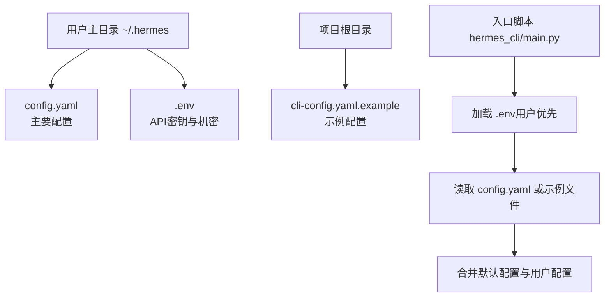
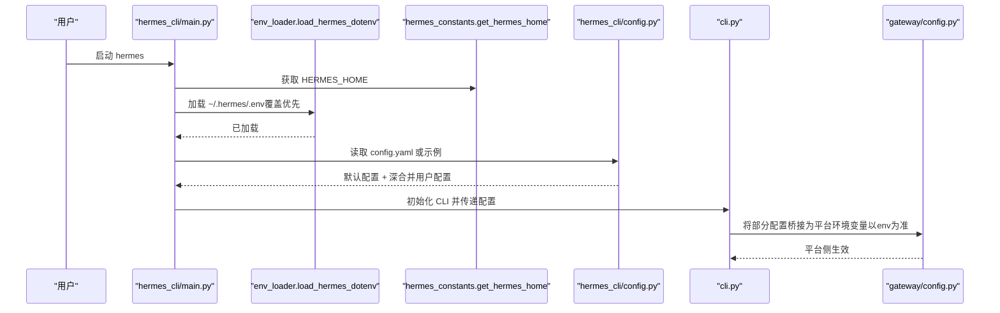
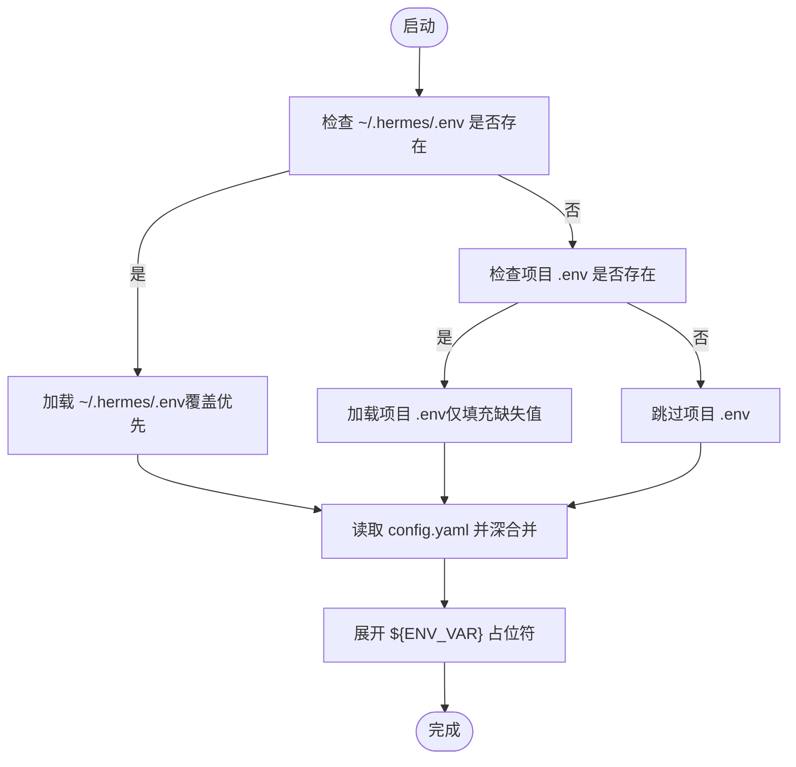
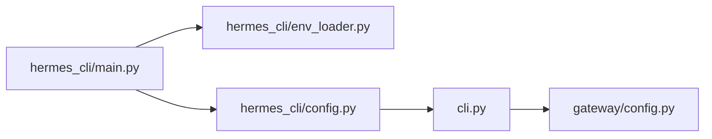

# 配置管理

<cite>
**本文引用的文件**
- [cli-config.yaml.example](file://cli-config.yaml.example)
- [hermes_cli/config.py](file://hermes_cli/config.py)
- [hermes_cli/env_loader.py](file://hermes_cli/env_loader.py)
- [hermes_cli/main.py](file://hermes_cli/main.py)
- [hermes_constants.py](file://hermes_constants.py)
- [gateway/config.py](file://gateway/config.py)
- [hermes_cli/doctor.py](file://hermes_cli/doctor.py)
- [cli.py](file://cli.py)
</cite>

## 目录
1. [简介](#简介)
2. [项目结构](#项目结构)
3. [核心组件](#核心组件)
4. [架构总览](#架构总览)
5. [详细组件分析](#详细组件分析)
6. [依赖关系分析](#依赖关系分析)
7. [性能考量](#性能考量)
8. [故障排除指南](#故障排除指南)
9. [结论](#结论)
10. [附录](#附录)

## 简介
本指南面向Hermes Agent用户与运维人员，系统性讲解配置管理：配置文件结构与位置、环境变量优先级与覆盖规则、关键配置项（模型、API密钥、工具集、内存、会话重置、显示与日志等）的用途与设置方法；并提供配置模板、验证与迁移、故障排除与备份策略的最佳实践。

## 项目结构
Hermes的配置由两部分组成：
- 用户主配置：~/.hermes/config.yaml（主要）
- 密钥与机密：~/.hermes/.env（优先于shell导出）

此外，CLI示例配置文件提供完整字段参考：cli-config.yaml.example。

图示来源
- [hermes_cli/env_loader.py:18-45](file://hermes_cli/env_loader.py#L18-L45)
- [hermes_cli/main.py:139-143](file://hermes_cli/main.py#L139-L143)
- [cli-config.yaml.example:1-10](file://cli-config.yaml.example#L1-L10)

章节来源
- [hermes_cli/env_loader.py:18-45](file://hermes_cli/env_loader.py#L18-L45)
- [hermes_cli/main.py:139-143](file://hermes_cli/main.py#L139-L143)
- [cli-config.yaml.example:1-10](file://cli-config.yaml.example#L1-L10)

## 核心组件
- 配置路径解析：统一通过常量模块获取HOME路径，确保跨平台一致性。
- .env加载顺序：优先加载用户~/.hermes/.env，再回退到项目根目录.env（仅在无用户.env时覆盖未设置值）。
- 默认配置与深合并：CLI启动时先应用默认配置，再从config.yaml深合并用户配置；同时对旧版键进行兼容迁移。
- 环境变量扩展：支持在配置中使用${ENV_VAR}占位符，启动前展开。
- 网关桥接：gateway/config.py将部分config.yaml键映射到平台环境变量，且以环境变量为最终优先。

章节来源
- [hermes_constants.py:11-17](file://hermes_constants.py#L11-L17)
- [hermes_cli/env_loader.py:18-45](file://hermes_cli/env_loader.py#L18-L45)
- [hermes_cli/config.py:201-551](file://hermes_cli/config.py#L201-L551)
- [cli.py:354-376](file://cli.py#L354-L376)
- [gateway/config.py:453-556](file://gateway/config.py#L453-L556)

## 架构总览
下图展示配置加载与优先级的端到端流程。

图示来源
- [hermes_cli/main.py:139-143](file://hermes_cli/main.py#L139-L143)
- [hermes_cli/env_loader.py:18-45](file://hermes_cli/env_loader.py#L18-L45)
- [hermes_cli/config.py:201-551](file://hermes_cli/config.py#L201-L551)
- [cli.py:354-376](file://cli.py#L354-L376)
- [gateway/config.py:453-556](file://gateway/config.py#L453-L556)

## 详细组件分析

### 配置文件结构与位置
- 主配置：~/.hermes/config.yaml（推荐）
- 示例配置：cli-config.yaml.example（包含所有可配置键的注释说明）
- 项目根.env：开发回退，不建议用于生产
- 常量路径：通过hermes_constants.get_hermes_home统一解析

章节来源
- [hermes_constants.py:11-17](file://hermes_constants.py#L11-L17)
- [cli-config.yaml.example:1-10](file://cli-config.yaml.example#L1-L10)

### 环境变量加载与优先级
- 用户~/.hermes/.env优先于shell导出的环境变量
- 项目根.env仅在无用户.env时作为回退，且仅填充缺失值
- 支持在配置中使用${ENV_VAR}占位符，启动前展开

图示来源
- [hermes_cli/env_loader.py:18-45](file://hermes_cli/env_loader.py#L18-L45)
- [hermes_cli/main.py:139-143](file://hermes_cli/main.py#L139-L143)

章节来源
- [hermes_cli/env_loader.py:18-45](file://hermes_cli/env_loader.py#L18-L45)
- [hermes_cli/main.py:139-143](file://hermes_cli/main.py#L139-L143)

### 模型配置与推理提供者
- model.default：默认模型名（可被命令行覆盖）
- model.provider：自动检测或指定提供者（如openrouter、nous、anthropic、custom等）
- model.base_url：自定义OpenAI兼容端点（本地/云）
- 支持智能路由与辅助模型（vision/web_extract/compression等）按任务选择不同提供者与模型
- 提供者路由（OpenRouter）：排序策略、白名单/黑名单、数据策略等

章节来源
- [cli-config.yaml.example:8-49](file://cli-config.yaml.example#L8-L49)
- [cli-config.yaml.example:52-76](file://cli-config.yaml.example#L52-L76)
- [cli-config.yaml.example:78-90](file://cli-config.yaml.example#L78-L90)
- [hermes_cli/config.py:310-368](file://hermes_cli/config.py#L310-L368)

### API密钥管理
- 支持多提供商密钥：OPENROUTER_API_KEY、ANTHROPIC_*、GOOGLE_API_KEY/GEMINI_API_KEY、GLM_*、KIMI_*、MINIMAX*_API_KEY、HF_TOKEN、AI_GATEWAY_API_KEY、OPENCODE_*、DEEPSEEK_*、DASHSCOPE_*、KILOCODE_API_KEY 等
- 辅助模型（vision/web_extract/compression等）可独立配置api_key与base_url
- 环境变量扩展：在config.yaml中使用${ENV_VAR}引用

章节来源
- [hermes_cli/config.py:575-773](file://hermes_cli/config.py#L575-L773)
- [cli-config.yaml.example:47-49](file://cli-config.yaml.example#L47-L49)
- [cli-config.yaml.example:330-368](file://cli-config.yaml.example#L330-L368)

### 工具配置与平台工具集
- platform_toolsets：按平台（cli/telegram/discord/whatsapp/slack/signal/homeassistant）定制可用工具集
- 支持预设组合（如hermes-telegram）与自定义组合
- 可通过hermes tools交互式启用/禁用工具

章节来源
- [cli-config.yaml.example:480-591](file://cli-config.yaml.example#L480-L591)
- [hermes_cli/config.py:471-477](file://hermes_cli/config.py#L471-L477)

### 内存设置与持久化
- memory.memory_enabled / user_profile_enabled：是否启用个人记忆与用户画像
- memory.char_limit / user_char_limit：字符上限（近似token数）
- nudge_interval / flush_min_turns：记忆提醒与退出/重置前保存记忆的触发条件
- 外部记忆插件（如openviking/mem0等）可通过配置启用

章节来源
- [cli-config.yaml.example:345-372](file://cli-config.yaml.example#L345-L372)
- [hermes_cli/config.py:440-451](file://hermes_cli/config.py#L440-L451)

### 会话重置策略与消息平台行为
- session_reset.mode：both/idle/daily/none
- idle_minutes / at_hour：空闲超时与每日重置时间
- group_sessions_per_user：群组/频道是否按用户隔离会话
- gateway/streaming：网关流式传输配置

章节来源
- [cli-config.yaml.example:374-418](file://cli-config.yaml.example#L374-L418)
- [gateway/config.py:453-556](file://gateway/config.py#L453-L556)

### 显示与日志
- display：紧凑模式、工具进度级别、忙碌输入模式、响铃提示、推理展示、流式输出、皮肤主题
- logging：日志级别、单文件大小、备份数量
- 日志目录：~/.hermes/logs/

章节来源
- [cli-config.yaml.example:713-799](file://cli-config.yaml.example#L713-L799)
- [hermes_cli/config.py:541-547](file://hermes_cli/config.py#L541-L547)

### 终端执行后端与资源限制
- terminal.backend：local/ssh/docker/singularity/modal/daytona
- 资源限制：container_cpu/memory/disk、持久化开关
- 容器镜像与卷挂载、环境变量透传、工作目录cwd
- sudo支持与安全提示

章节来源
- [cli-config.yaml.example:102-225](file://cli-config.yaml.example#L102-L225)
- [hermes_cli/config.py:222-259](file://hermes_cli/config.py#L222-L259)

### 辅助模型与上下文压缩
- auxiliary.*：vision/web_extract/compression/session_search/skills_hub/approval/mcp/flush_memories
- compression：阈值、尾部保留比例、保护最近消息数、摘要模型与提供者
- smart_model_routing：简单请求使用便宜模型的智能路由

章节来源
- [cli-config.yaml.example:249-310](file://cli-config.yaml.example#L249-L310)
- [cli-config.yaml.example:266-295](file://cli-config.yaml.example#L266-L295)
- [cli-config.yaml.example:78-90](file://cli-config.yaml.example#L78-L90)
- [hermes_cli/config.py:288-302](file://hermes_cli/config.py#L288-L302)

### 配置验证与迁移
- hermes doctor：检查配置文件、版本、结构、API连通性、外部工具依赖等
- hermes config migrate：检查缺失项并提示升级
- 迁移系统：按版本追踪新增的环境变量，自动提示升级

章节来源
- [hermes_cli/doctor.py:135-956](file://hermes_cli/doctor.py#L135-L956)
- [hermes_cli/config.py:2639-2667](file://hermes_cli/config.py#L2639-L2667)
- [hermes_cli/config.py:557-566](file://hermes_cli/config.py#L557-L566)

### 配置模板与最佳实践
- 使用cli-config.yaml.example作为模板，复制到~/.hermes/config.yaml并按需修改
- 将API密钥写入~/.hermes/.env，避免提交到版本控制
- 对于本地/私有端点，优先在config.yaml中配置base_url与api_key，减少对环境变量的依赖
- 为敏感信息使用${ENV_VAR}占位符，结合~/.hermes/.env集中管理
- 分平台定制platform_toolsets，遵循最小权限原则

章节来源
- [cli-config.yaml.example:1-10](file://cli-config.yaml.example#L1-L10)
- [hermes_cli/env_loader.py:18-45](file://hermes_cli/env_loader.py#L18-L45)

## 依赖关系分析
- hermes_cli/main.py负责加载.env与初始化日志
- hermes_cli/config.py提供默认配置、深合并、版本迁移与校验
- cli.py在启动时将config.yaml与默认配置合并，并展开环境变量
- gateway/config.py将部分配置键桥接为平台环境变量，且以环境变量为最终优先

图示来源
- [hermes_cli/main.py:139-143](file://hermes_cli/main.py#L139-L143)
- [hermes_cli/env_loader.py:18-45](file://hermes_cli/env_loader.py#L18-L45)
- [hermes_cli/config.py:201-551](file://hermes_cli/config.py#L201-L551)
- [cli.py:354-376](file://cli.py#L354-L376)
- [gateway/config.py:453-556](file://gateway/config.py#L453-L556)

章节来源
- [hermes_cli/main.py:139-143](file://hermes_cli/main.py#L139-L143)
- [hermes_cli/config.py:201-551](file://hermes_cli/config.py#L201-L551)
- [cli.py:354-376](file://cli.py#L354-L376)
- [gateway/config.py:453-556](file://gateway/config.py#L453-L556)

## 性能考量
- 上下文压缩与智能路由可降低token消耗，提升长对话稳定性
- 辅助模型应选用轻量模型以减少延迟
- 终端后端选择需考虑资源开销与隔离需求
- 日志轮转与备份数量影响磁盘占用

## 故障排除指南
- 使用hermes doctor全面诊断：配置文件、版本、结构、API连通性、外部工具依赖、目录结构、WAL文件大小等
- 若出现“未配置提供者”提示，运行hermes setup或手动在~/.hermes/.env中添加所需API密钥
- 若config.yaml存在旧版根级provider/base_url键，doctor会提示并可自动修复
- 网关平台配置：gateway/config.py会将部分键映射为环境变量，若平台行为异常，请检查对应环境变量是否被其他来源覆盖

章节来源
- [hermes_cli/doctor.py:135-956](file://hermes_cli/doctor.py#L135-L956)
- [gateway/config.py:453-556](file://gateway/config.py#L453-L556)

## 结论
Hermes的配置体系以用户主目录下的config.yaml为核心，配合~/.hermes/.env集中管理密钥与机密。通过默认配置深合并、环境变量扩展与网关桥接，系统实现了灵活、可维护且可审计的配置管理。建议遵循“模板复制+密钥外置+分平台定制”的最佳实践，并定期使用doctor与config migrate保持配置健康与最新。

## 附录

### 配置优先级与覆盖规则
- .env加载顺序：~/.hermes/.env（覆盖）→ 项目 .env（仅填充缺失）
- 网关平台配置：config.yaml中的某些键会被桥接为环境变量，且以环境变量为最终优先
- CLI启动时：默认配置 + config.yaml深合并 + 展开${ENV_VAR}

章节来源
- [hermes_cli/env_loader.py:18-45](file://hermes_cli/env_loader.py#L18-L45)
- [gateway/config.py:453-556](file://gateway/config.py#L453-L556)
- [cli.py:354-376](file://cli.py#L354-L376)

### 配置验证与迁移
- hermes doctor：自动检查配置文件、版本、结构、API连通性与外部依赖
- hermes config migrate：检查缺失项并提示升级
- 迁移系统：按版本追踪新增环境变量，仅提示新版本引入的变量

章节来源
- [hermes_cli/doctor.py:135-956](file://hermes_cli/doctor.py#L135-L956)
- [hermes_cli/config.py:2639-2667](file://hermes_cli/config.py#L2639-L2667)
- [hermes_cli/config.py:557-566](file://hermes_cli/config.py#L557-L566)

### 版本管理与备份策略
- 版本管理：通过_config_version跟踪配置版本，doctor与migrate自动提示升级
- 备份策略：建议在修改config.yaml前手动备份至~/.hermes/config.yaml.backup；定期归档~/.hermes/logs/与~/.hermes/memories/目录

章节来源
- [hermes_cli/config.py:549-551](file://hermes_cli/config.py#L549-L551)
- [hermes_cli/doctor.py:247-338](file://hermes_cli/doctor.py#L247-L338)